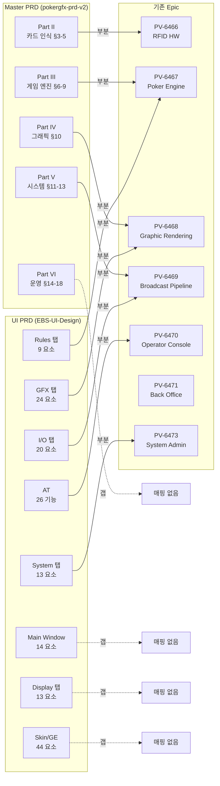
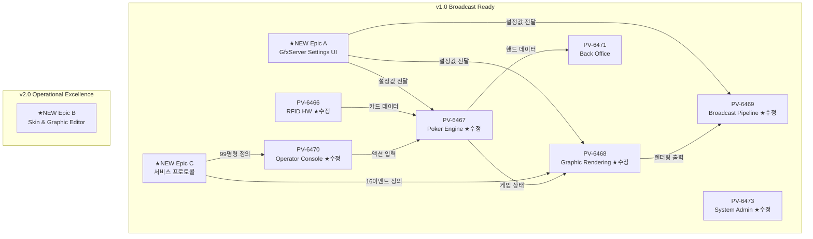
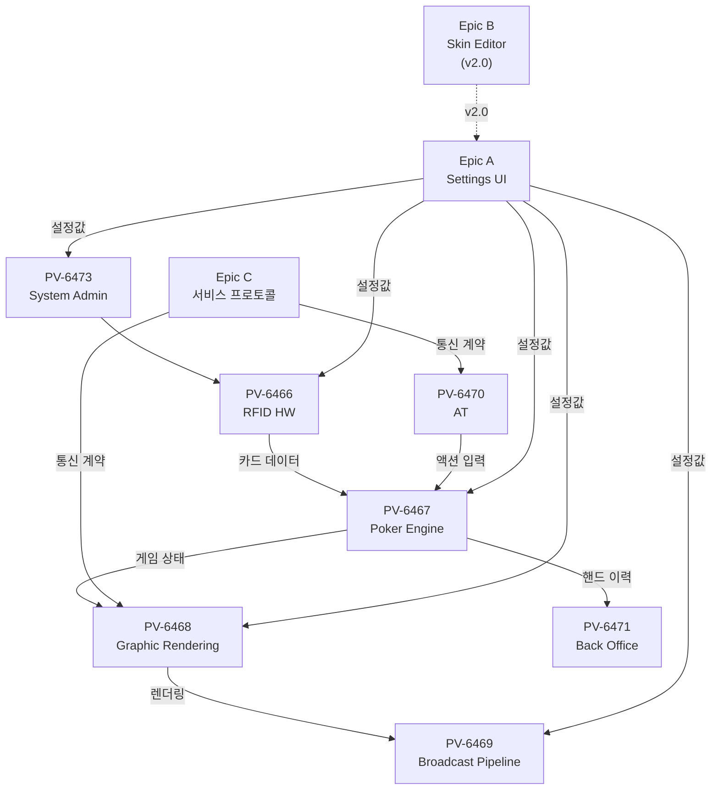

# Epic 구조 개선 제안서

## 1. 개요

### 1.1 목적

Jira PV 프로젝트(PLUS V2)의 기존 7개 Epic을 EBS Master PRD(v29.3)와 UI Design PRD(v32.0)에 기반하여 재구조화한다. 현재 Epic 구조에서 발견된 갭을 해소하고, 144개 기능과 180개 UI 요소의 추적성(traceability)을 확보한다.

### 1.2 배경

현재 Jira PV 보드(#2049)에는 7개 Epic이 등록되어 있으나, 다음 문제가 존재한다:

| 문제 | 상세 |
|------|------|
| Story 미등록 | 7개 Epic 모두 하위 Story/Sub-task가 0개. Description에만 텍스트로 기술 |
| 관점 편향 | 기존 Epic은 백엔드/엔진 관점. UI 설정 화면, 프로토콜, 운영 워크플로우 누락 |
| PRD 매핑 부재 | Epic Description이 PRD Element ID(M-xx, S-xx, G-xx 등)와 연결되지 않음 |
| 서브시스템 갭 | EBS 6개 서브시스템 중 FTS·GFX·BKO만 v1 범위이나, Epic이 이 경계를 반영하지 않음 |
| v1/v2 스코프 혼재 | Defer(v2.0) 기능과 Keep(v1.0) 기능이 Epic 내에서 구분되지 않음 |

### 1.3 범위

이 문서는 **Epic 레벨 구조 개선**만 다룬다. Story/Sub-task 생성은 별도 작업으로 분리한다.

---

## 2. 현황 분석

### 2.1 기존 7개 Epic

Jira API 조회 결과 (2026-03-04):

| # | Key | Epic | 상태 | Story 수 |
|:-:|---------|------|:----:|:--------:|
| 1 | PV-6466 | RFID 하드웨어 및 카드 인식 | N/A | 0 |
| 2 | PV-6467 | Poker Engine (포커 규칙 및 상태 연산) | N/A | 0 |
| 3 | PV-6468 | Graphic Rendering System (화면 오버레이) | N/A | 0 |
| 4 | PV-6469 | Broadcast & Data Pipeline (방송 송출) | N/A | 0 |
| 5 | PV-6470 | Operator Console (운영자 제어) | N/A | 0 |
| 6 | PV-6471 | Back Office (데이터 아카이브 및 통계) | N/A | 0 |
| 7 | PV-6473 | System Administration & Core (시스템 공통) | N/A | 0 |

### 2.2 PRD 소스 문서 구조

**pokergfx-prd-v2.md** (Master PRD v29.3):

| Part | 섹션 | 내용 | 기능 수 |
|------|------|------|:-------:|
| I | §1-2 | 문제 정의, 핵심 개념 3가지 | — |
| II | §3-5 | 카드 인식 설계 (RFID HW, 안테나, 카드 상태) | 10 (SRC) |
| III | §6-9 | 게임 엔진 (22게임, 베팅, 평가기, 통계) | 24+13 (G1+G2) |
| IV | §10 | 그래픽 요소 체계 (4타입, 16 애니메이션, 오버레이) | 13 (G3) |
| V | §11-13 | 시스템 구조 (파이프라인, 서비스, 서버 구성) | 16 (SYS) |
| VI | §14-18 | 운영 워크플로우 (역할, 준비, 진행, 히스토리, 복구) | 10 (MW) |
| 부록 | A-D | 22게임 카탈로그, 144기능, 용어, 참고 | — |

**EBS-UI-Design-v3.prd.md** (UI Design SSOT):

| 장 | 내용 | 요소 수 |
|:--:|------|:-------:|
| 4 | Main Window | 14 (M-01~M-14) |
| 5 | I/O 탭 (Sources+Outputs) | 20 (S-xx + O-xx) |
| 6 | GFX 탭 | 24 (G-01~G-22s) |
| 7 | Rules 탭 | 9 (G-32~G-56) |
| 8 | Display 탭 | 13 (G-40~G-51c) |
| 9 | System 탭 | 13 (Y-01~Y-22) |
| 10 | Action Tracker 상호작용 | 26 (AT-001~AT-026) |
| 11 | Skin/Graphic Editor | 44 (SK-01~SK-26 + GE 18) |

### 2.3 PRD ↔ Epic 교차 매핑



---

## 3. 갭 분석

### 3.1 누락된 영역 (Epic 부재)

| # | 누락 영역 | PRD 소스 | 영향도 | 설명 |
|:-:|----------|---------|:------:|------|
| G-1 | **GfxServer Settings UI** | UI PRD 4~9장 (93개 요소) | Critical | 운영자가 방송 전 설정하는 5탭 UI 전체. 기존 Epic 중 어디에도 완전히 매핑되지 않음 |
| G-2 | **Skin & Graphic Editor** | UI PRD 11장 (44개 요소) | High | 87→18개 통합된 Graphic Editor + 26개 Skin Editor. v2.0 대상이지만 Epic 자체가 없음 |
| G-3 | **서비스 프로토콜** | Master §12 (99명령, 16이벤트) | High | 서버-클라이언트 간 99개 명령어, 16개 실시간 이벤트, GameInfoResponse(75+ 필드). 시스템 통합의 핵심 |
| G-4 | **Display 포맷팅** | UI PRD 8장 (13개 요소) | Medium | 통화 기호, Precision, BB 모드 등 수치 표시 형식. 기존 어떤 Epic에도 매핑 안 됨 |
| G-5 | **운영 워크플로우** | Master §14-18 | Medium | 준비 체크리스트, 게임 진행 루프, 긴급 복구. 운영 절차가 시스템에 어떻게 반영되는지의 Epic |

### 3.2 불완전 매핑 (기존 Epic 개선 필요)

| Epic | 현재 매핑률 | 누락 영역 |
|------|:----------:|----------|
| PV-6466 RFID HW | 60% | UI PRD Y-03~Y-07 (RFID 설정 UI), 카드 상태 머신 5단계 |
| PV-6467 Poker Engine | 70% | Rules 탭 UI (G-52~G-56), Hand Evaluation 별도 프로세스 |
| PV-6468 Graphic Rendering | 50% | GFX 탭 UI (24요소), Display 탭 연동, 4가지 요소 타입 상세 |
| PV-6469 Broadcast | 40% | I/O 탭 UI (20요소), Fill & Key 모드, 3가지 데이터 출력 경로 |
| PV-6470 Operator Console | 30% | AT 26개 기능 (UI PRD §10), AT↔GfxServer 상호작용 |
| PV-6471 Back Office | 80% | Y-12 Export Folder 크로스레퍼런스만 추가 |
| PV-6473 System Admin | 60% | System 탭 UI (13요소), 서버 자동 검색, Master-Slave |

### 3.3 관점 갭 매트릭스

기존 Epic은 **기술 도메인 관점** 단일 축으로 구성. **사용자 인터페이스 관점**과 **통합/프로토콜 관점**이 누락됨.

| 관점 | 현재 커버리지 | 필요 Epic |
|------|:------------:|----------|
| 백엔드/엔진 (기술 도메인) | 7/7 Epic 커버 | 기존 유지 |
| UI/UX (사용자 인터페이스) | 0/7 전용 Epic 없음 | **신규 2개** (Settings UI + Skin Editor) |
| 프로토콜/통합 (시스템 연결) | 0/7 전용 Epic 없음 | **신규 1개** (서비스 프로토콜) |

---

## 4. 제안: 10-Epic 구조

### 4.1 구조 개요



### 4.2 신규 Epic 상세 (3개)

#### Epic A: `[EBS] GfxServer Settings UI (설정 화면 5탭)`

| 항목 | 내용 |
|------|------|
| **목적** | 운영자가 방송 전 설정하는 GfxServer Settings Window의 5탭 UI 구현 |
| **PRD 매핑** | UI PRD 4~9장 (Main Window 14 + I/O 20 + GFX 24 + Rules 9 + Display 13 + System 13 = **93개 요소**) |
| **스코프** | v1.0 |
| **의존성** | PV-6466(RFID HW), PV-6467(Engine), PV-6468(Rendering), PV-6469(Broadcast) |

**제안 Story 구조 (6개)**:

| Story | 내용 | PRD 매핑 | 요소 수 |
|-------|------|---------|:-------:|
| A.1 Main Window 셸 | Title Bar, Preview, Status, Actions, TabBar | M-01~M-14 | 14 |
| A.2 I/O 탭 | Input 섹션 (S-xx) + Output 섹션 (O-xx) | UI PRD 5장 | 20 |
| A.3 GFX 탭 | Layout, Card & Player, Animation, Branding | UI PRD 6장 | 24 |
| A.4 Rules 탭 | Game Rules + Player Display | UI PRD 7장 | 9 |
| A.5 Display 탭 | Blinds, Precision, Mode, (Outs=v2.0) | UI PRD 8장 | 13 |
| A.6 System 탭 | Table, RFID, AT, Diagnostics, Startup | UI PRD 9장 | 13 |

#### Epic B: `[EBS] Skin & Graphic Editor (스킨 편집 시스템)`

| 항목 | 내용 |
|------|------|
| **목적** | 방송 그래픽 테마 편집 도구. Skin Editor(26개) + Graphic Editor(18개, 87→18 통합) |
| **PRD 매핑** | UI PRD 11장 전체 (SK-01~SK-26 + GE 공통 10 + Player 8 = **44개 요소**) |
| **스코프** | v2.0 Defer (v1.0에서 G-14s 버튼 비활성 노출) |
| **의존성** | Epic A(Settings UI — G-14s Skin Editor 버튼) |

**제안 Story 구조 (4개)**:

| Story | 내용 | PRD 매핑 | 요소 수 |
|-------|------|---------|:-------:|
| B.1 Skin Editor 기본 | Info, Elements, Actions | SK-01~SK-06, SK-21~SK-26 | 12 |
| B.2 Skin Editor 상세 | Text, Cards, Player (국기 포함) | SK-07~SK-20 | 14 |
| B.3 Graphic Editor 공통 | Element 선택, Position, Animation, Text, BG | GE 공통 10개 | 10 |
| B.4 Player Overlay Editor | Overlay A~H (Photo~Position) | GE Player 8개 | 8 |

#### Epic C: `[EBS] 서비스 프로토콜 (서버-클라이언트 통신)`

| 항목 | 내용 |
|------|------|
| **목적** | GfxServer ↔ ActionTracker/HandEvaluation 간 TCP 프로토콜 정의 및 구현 |
| **PRD 매핑** | Master PRD §12 (5개 서비스, 99명령, 16이벤트, GameInfoResponse 75+필드) |
| **스코프** | v1.0 |
| **의존성** | PV-6467(Engine — 게임 상태), PV-6470(AT — 클라이언트) |

**제안 Story 구조 (5개)**:

| Story | 내용 | Master PRD 매핑 |
|-------|------|----------------|
| C.1 Connection & Auth | 서버 자동 검색, 연결, 인증, Heartbeat | 9개 Connection 명령 |
| C.2 GameService + CardService | 게임 시작/종료/타입 + 카드 딜/공개/Muck | 13+9 = 22개 명령 |
| C.3 PlayerService | 좌석 등록/퇴장, 칩 관리, 통계 | 21개 명령 |
| C.4 DisplayService + MediaService | 오버레이 제어, 스킨 전환, 비디오/오디오 | 17+13 = 30개 명령 |
| C.5 실시간 이벤트 + GameInfoResponse | 16개 Push 이벤트, 75+필드 상태 메시지 | §12 이벤트/GIR |

### 4.3 기존 Epic 수정 상세 (5개)

#### PV-6466: RFID 하드웨어 및 카드 인식 — 수정

**추가 사항**:

| 항목 | 내용 | PRD 소스 |
|------|------|---------|
| Story 1.5 추가 | RFID 설정 UI ↔ HW 연동 API | UI PRD Y-03~Y-07 |
| 카드 상태 머신 명시 | 5단계 (DECK→DETECTED→DEALT→REVEALED/MUCKED) | Master §5 |
| 크로스레퍼런스 | Epic A Story A.6, Epic C Story C.1 | — |

**기존 Story 1.1~1.4 보완**:
- Story 1.1: 안테나 역할 상세 추가 (Seat 10대, Board 1대, Muck 1대 = 12대)
- Story 1.2: 이중 연결 방식 명시 (WiFi 기본 + USB 백업, 자동 전환)
- Story 1.3: REGISTER_DECK(52장 UID→카드 매핑) 사전 등록 절차 추가
- Story 1.4: MISS_DEAL + FORCE_CARD_SCAN 복구 명령 매핑

#### PV-6467: Poker Engine — 수정

**추가 사항**:

| 항목 | 내용 | PRD 소스 |
|------|------|---------|
| Story 2.7 추가 | Rules UI ↔ Engine 연동 API | UI PRD 7장 G-52~G-56 |
| Story 2.8 추가 | HandEvaluation 별도 프로세스 분리 | Master §8, §11 프로세스 경계 |
| 3가지 평가기 명시 | Standard High(10게임), Hi-Lo(5게임), Lowball(7게임) | Master §8 |
| Lookup Table 참조 | 핸드 등급, Straight 판별, 169 Pre-Flop, Omaha 6장 | Master §8 |

**기존 Story 보완**:
- Story 2.3 베팅 구조: 7가지 Ante 유형 명시 (Standard~TB Ante 1st)
- Story 2.4 특수 규칙: 4가지 명시 (Bomb Pot, Run It Twice, 7-2 Side Bet, Straddle)
- Story 2.5 핸드 평가: Lookup Table 기반 즉시 평가 메커니즘 추가
- Story 2.6 승률 계산: HandEvaluation 별도 프로세스, Monte Carlo 비동기 채널

#### PV-6468: Graphic Rendering System — 수정

**추가 사항**:

| 항목 | 내용 | PRD 소스 |
|------|------|---------|
| Story 3.4 추가 | GFX 설정 반영 파이프라인 | UI PRD 6장 G-01~G-20 → 렌더링 연동 |
| Story 3.5 추가 | Display 포맷 반영 | UI PRD 8장 G-45~G-51c → 수치 포맷팅 |
| 4가지 요소 타입 명시 | Image(41필드), Text(52필드), Pip(12필드), Border(8필드) | Master §10 |
| 애니메이션 시스템 | 16 Animation State × 11 Animation Class | Master §10 |
| 오버레이 10요소 | Player Info~스폰서 로고 (WSOP 해부도 기준) | Master §10 |

#### PV-6469: Broadcast & Data Pipeline — 수정

**추가 사항**:

| 항목 | 내용 | PRD 소스 |
|------|------|---------|
| Story 4.3 추가 | Input Pipeline (카메라/스위처) | UI PRD 5장 S-01~S-29 |
| Story 4.4 추가 | Fill & Key 모드 (EBS 신규 3요소) | UI PRD 5장 O-18~O-20 |
| Story 4.5 추가 | 3가지 데이터 출력 경로 | Master §11 (LiveApi, live_export, HAND_HISTORY) |
| 방송 송출 모드 | Internal(직접 합성) + External(데이터 전달) | Master §11 |

#### PV-6470: Operator Console — 수정 (AT 전담 재정의)

**변경 사항**:

| 항목 | 변경 전 | 변경 후 |
|------|---------|---------|
| 스코프 | "운영자 제어 클라이언트" (모호) | **Action Tracker 전담** (Settings UI는 Epic A로 분리) |
| Description 갱신 | 텍스트 Story 3개 | AT 26개 기능 기반 Story 재구성 |

**제안 Story 재구성**:

| Story | 내용 | PRD 매핑 |
|-------|------|---------|
| 5.1 덱/플레이어 준비 | REGISTER_DECK, 좌석별 이름/칩 등록 | 기존 유지 |
| 5.2a AT 베팅/액션 입력 | Fold/Check/Call/Raise + Predictive Bet | AT-012~AT-017, Y-14 |
| 5.2b AT 상태 표시 | Network/Table/Stream + 10인 레이아웃 | AT-001~AT-011 |
| 5.2c AT 특수 기능 (v2.0) | HIDE GFX, TAG HAND, CHOP, RUN IT 2x, MISS DEAL | AT-021~AT-026 |
| 5.3 서버-AT 통신 | WebSocket 자동 검색, GameInfoResponse 동기화 | Epic C 연동 |

#### PV-6471: Back Office — 유지 (크로스레퍼런스만 추가)

| 항목 | 내용 |
|------|------|
| 크로스레퍼런스 추가 | Y-12(Export Folder) → Back Office JSON 내보내기 연결 |
| Story 6.4 보완 | 8개 통계 지표 명시 (VPIP, PFR, AGR, WTSD, 3Bet%, CBet%, WIN%, AFq) |
| Playback 도구 매핑 | Master §17 (리플레이, 편집, 비디오 관리, 렌더링, Export, 검색) |

#### PV-6473: System Administration & Core — 수정

**추가 사항**:

| 항목 | 내용 | PRD 소스 |
|------|------|---------|
| Master-Slave 구성 | 1서버=1테이블, Slave는 렌더링 전용 | Master §13 |
| 서버 자동 검색 | 클라이언트 브로드캐스트 → 서버 응답 | Master §13 |
| 크로스레퍼런스 | Epic A Story A.6 (System 탭 UI) | — |

---

## 5. v1.0 / v2.0 스코프 분리

### 5.1 v1.0 Broadcast Ready (9 Epic)

| Epic | 주요 Story 수 | PRD 기능 매핑 |
|------|:------------:|:------------:|
| PV-6466 RFID HW (수정) | 5 | SRC 10개 |
| PV-6467 Poker Engine (수정) | 8 | G1 24개 + G2 13개 |
| PV-6468 Graphic Rendering (수정) | 5 | G3 13개 + 오버레이 10개 |
| PV-6469 Broadcast Pipeline (수정) | 5 | OUT 12개 |
| PV-6470 Operator Console (수정) | 5 | MW 10개 + AT 17개(v1) |
| PV-6471 Back Office | 4 | 기존 유지 |
| PV-6473 System Admin (수정) | 3 | SYS 16개 |
| **Epic A** Settings UI (신규) | 6 | **93개 UI 요소** |
| **Epic C** 서비스 프로토콜 (신규) | 5 | **99명령 + 16이벤트** |

### 5.2 v2.0 Operational Excellence (1 Epic)

| Epic | 주요 Story 수 | PRD 기능 매핑 |
|------|:------------:|:------------:|
| **Epic B** Skin & Graphic Editor (신규) | 4 | **44개 요소** |

### 5.3 v2.0 Defer 요소 상세 (UI PRD 기준)

| 카테고리 | 요소 | 수량 |
|---------|------|:----:|
| Skin Editor | SK-01~SK-26 | 26 |
| Graphic Editor | GE 공통 10 + Player 8 | 18 |
| GFX 탭 Defer | G-23(PIP), G-14s/G-15s(Skin 관련), G-22s(Stats) | 4 |
| Rules 탭 Defer | G-54(Rabbit Hunting), G-39(Nit Game) | 2 |
| Display 탭 Defer | G-40~G-42(Outs), G-26~G-31(Leaderboard), G-37(Equities) | 12 |
| System 탭 Defer | Y-08(HW Panel), Y-24(업데이트) | 2 |
| AT 특수 기능 | AT-022~AT-026 (TAG/CHOP/RUN IT/MISS DEAL) | 5 |

---

## 6. Epic 간 의존 관계

### 6.1 의존 그래프



### 6.2 권장 구현 순서

```
  Phase 1 (병렬): PV-6473 System Admin + PV-6466 RFID HW + Epic C 프로토콜
  Phase 2:        PV-6467 Poker Engine
  Phase 3 (병렬): PV-6468 Graphic Rendering + Epic A Settings UI
  Phase 4 (병렬): PV-6469 Broadcast + PV-6470 AT
  Phase 5:        PV-6471 Back Office
  Phase 6 (v2.0): Epic B Skin & Graphic Editor
```

### 6.3 병렬 실행 가능 조건

| Phase | 병렬 Epic | 병렬 조건 |
|:-----:|----------|----------|
| 1 | System + RFID + Protocol | 독립 도메인, 파일 겹침 없음 |
| 3 | Rendering + Settings UI | Rendering = 엔진, Settings = Flutter UI. 인터페이스 계약만 공유 |
| 4 | Broadcast + AT | Output pipeline과 Input client. 서로 다른 앱 |

---

## 7. 구현 상태

| 항목 | 상태 | 비고 |
|------|:----:|------|
| 갭 분석 완료 | ✅ 완료 | 5개 갭 식별, 5개 기존 Epic 개선점 도출 |
| Epic A 정의 | ✅ 완료 | 93개 요소, 6 Story |
| Epic B 정의 | ✅ 완료 | 44개 요소, 4 Story (v2.0) |
| Epic C 정의 | ✅ 완료 | 99명령 + 16이벤트, 5 Story |
| 기존 Epic 수정안 | ✅ 완료 | 5개 Epic 수정 + 1개 유지 |
| Jira 이슈 생성 | ⏳ 예정 | 승인 후 jira_client.py로 생성 |
| Story/Sub-task 상세 분해 | ⏳ 예정 | Epic 승인 후 별도 작업 |

---

## Changelog

| 날짜 | 버전 | 변경 내용 | 결정 근거 |
|------|------|-----------|----------|
| 2026-03-05 | v1.0 | 최초 작성 | pokergfx-prd-v2.md + EBS-UI-Design.md 교차 분석 |
