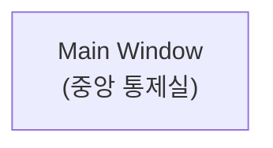
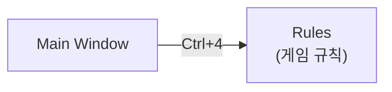
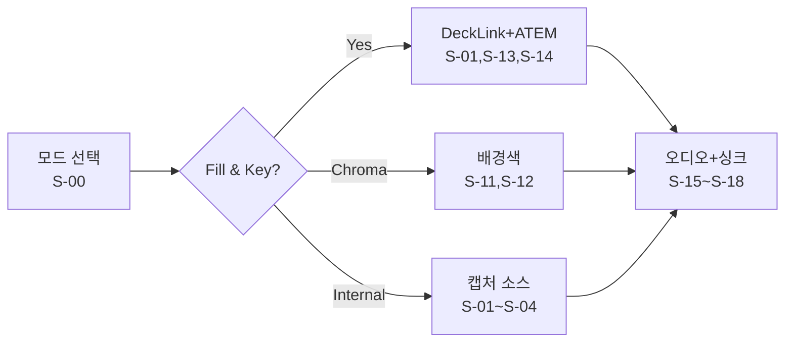
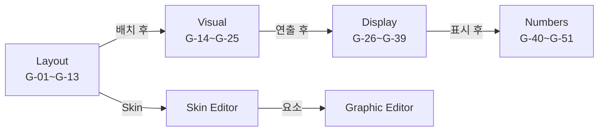
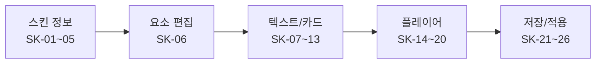
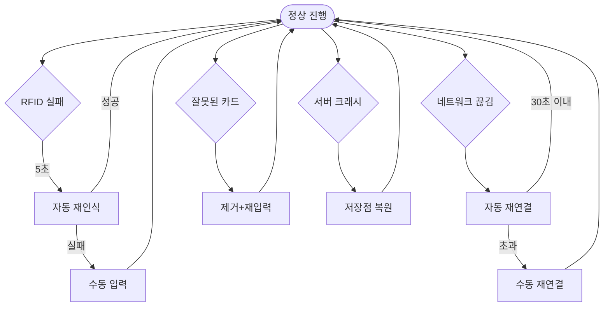

# PRD-0004 개선 계획 v1.0.0

## 개요

**대상 파일**: `C:/claude/ebs/docs/01_PokerGFX_Analysis/PRD-0004-EBS-Server-UI-Design.md`
**현재 버전**: v17.0.0 (1411줄)
**목표 버전**: v18.0.0
**참조 문서**: `C:/claude/ebs_reverse/docs/01-plan/pokergfx-ui-overview.md` (v1.1.0)

**개선 목적**:
1. CLAUDE.md 규칙 위반 수정: 계획/설계 문서의 Mermaid 블록 → ASCII art 변환 (CRITICAL)
2. overview 문서의 강화된 ASCII 다이어그램을 PRD-0004에 이식
3. overview에만 존재하는 섹션/내용을 PRD-0004에 추가
4. 메타데이터 업데이트

---

## 개선 항목 목록

| # | 항목 | 유형 | 우선순위 | 영향 라인 |
|---|------|------|:--------:|----------|
| 1 | Step 1~8 Mermaid → ASCII 변환 (8개 블록) | 규칙 위반 수정 | CRITICAL | L50-146 |
| 2 | 3.6 Sources Workflow Mermaid → ASCII | 규칙 위반 수정 | CRITICAL | L425-432 |
| 3 | 4.6 Outputs Workflow Mermaid → ASCII | 규칙 위반 수정 | CRITICAL | L526-529 |
| 4 | 5.6 GFX Workflow Mermaid → ASCII | 규칙 위반 수정 | CRITICAL | L651-657 |
| 5 | 8.6 Skin Editor Workflow Mermaid → ASCII | 규칙 위반 수정 | CRITICAL | L975-979 |
| 6 | 11.4 예외 처리 흐름 Mermaid → ASCII | 규칙 위반 수정 | CRITICAL | L1197-1205 |
| 7 | 1.1 최종 네비게이션 맵 강화 (overview 1.2) | 내용 강화 | HIGH | L148 이후 |
| 8 | 1.2 화면 역할: 시간 흐름 ASCII 순서도 추가 | 내용 추가 | HIGH | L150-163 |
| 9 | 1.4 공통 레이아웃: ASCII 레이아웃 다이어그램 추가 | 내용 추가 | HIGH | L172-174 |
| 10 | 1.5 설계 기초: 3개 ASCII 다이어그램 추가 | 내용 추가 | HIGH | L205-226 |
| 11 | 5.4 GFX 서브탭: PokerGFX→EBS 매핑 ASCII 추가 | 내용 추가 | MEDIUM | L634-640 |
| 12 | 방송 워크스테이션 섹션 추가 (overview 2.1) | 누락 섹션 추가 | MEDIUM | 1.5 이전 위치 |
| 13 | 설계 원칙 벤치마크 메모 추가 (overview 2.6) | 내용 추가 | MEDIUM | L164-170 |
| 14 | source_docs 업데이트 + 버전 v18.0.0 | 메타데이터 | LOW | L23-26, L1411 |

---

## 섹션별 작업 상세

### 태스크 1: Step 1 Mermaid → ASCII 변환

**위치**: L50-54

**현재 내용**:
```

```

**변환 결과** (overview Step 1 형식 채택):
```
  +------------------------------+
  |   Main Window (중앙 통제실)   |
  +------------------------------+
```

**Accept Criteria**: `mermaid` 키워드가 Step 1 블록에 존재하지 않음. 동일한 개념을 표현하는 ASCII 박스 존재.

---

### 태스크 2: Step 2 Mermaid → ASCII 변환

**위치**: L59-62

**현재 내용**:
```

```

**변환 결과** (overview Step 2 형식 채택):
```
  +------------------------------+
  |        Main Window           |
  +----------+-------------------+
             |  Ctrl+4
             v
          +-------+
          | Rules |
          +-------+
          (게임 규칙)
```

**Accept Criteria**: 화살표와 단축키 레이블이 ASCII로 표현됨.

---

### 태스크 3: Step 3 Mermaid → ASCII 변환

**위치**: L68-72

**변환 결과** (overview Step 3 형식):
```
  +------------------------------+
  |        Main Window           |
  +----------+----------+--------+
             |          |
          Ctrl+4      Ctrl+5
             v          v
          +-------+  +--------+
          | Rules |  | System |
          +-------+  +--------+
                     (RFID + 연결 점검)
```

---

### 태스크 4: Step 4 Mermaid → ASCII 변환

**위치**: L78-83

**변환 결과** (overview Step 4 형식):
```
  +---------------------------------------------+
  |                Main Window                   |
  +----------+-----------+----------+------------+
             |           |          |
          Ctrl+4       Ctrl+5      F8
             v           v          v
          +-------+  +--------+  +-----------------+
          | Rules |  | System |  | Action Tracker  |
          +-------+  +--------+  | (별도 앱, 터치)  |
                                 +-----------------+
```

---

### 태스크 5: Step 5 Mermaid → ASCII 변환

**위치**: L89-99

**변환 결과** (overview Step 5 형식):
```
  +------------------------------------------------------------+
  |                       Main Window                          |
  +----------+-----------+----------+----------+--------------+
             |           |          |          |
          Ctrl+4       Ctrl+5      F8        Ctrl+3
             v           v          v          v
          +-------+  +--------+  +----+    +-----+
          | Rules |  | System |  | AT |    | GFX |
          +-------+  +--------+  +----+    +--+--+
                                               |
                    +----------+----------+----+----+
                    v          v          v         v
                +------+  +------+  +-------+  +-------+
                |Layout|  |Visual|  |Display|  |Numbers|
                +------+  +------+  +-------+  +-------+
                (어디에) (어떤 연출) (무엇을)  (어떤 형식)
```

---

### 태스크 6: Step 6 Mermaid → ASCII 변환

**위치**: L105-113

**변환 결과** (overview Step 6 형식):
```
  +-----------------------------------------------------------------+
  |                         Main Window                             |
  +--------+---------+-----------+----------+----------+-----------+
           |         |           |          |          |
         Ctrl+2    Ctrl+3      Ctrl+4     Ctrl+5      F8
           v         v           v          v          v
        +------+  +----+------+ +-------+  +------+  +----+
        |Output|  |GFX |      | | Rules |  |System|  | AT |
        +------+  |    +------+ +-------+  +------+  +----+
                  |Layout/Visual|
                  |Display/Number|
                  +--------------+
```

---

### 태스크 7: Step 7 Mermaid → ASCII 변환

**위치**: L119-128

**변환 결과**: overview Step 7은 ASCII 텍스트만 있음. Mermaid 블록 제거 후 동일 내용의 간결한 ASCII 작성:
```
  +--------+ Ctrl+1  +-------+
  |        |-------->|Sources|  (카메라 + 스위처)
  |  Main  |         +-------+
  | Window | + 기존 Ctrl+2~5, F8 연결
  +--------+
```

**Accept Criteria**: Mermaid 블록 제거. 기존 텍스트 설명 보존.

---

### 태스크 8: Step 8 Mermaid → ASCII 변환 (최종 네비게이션 맵)

**위치**: L134-146

**변환 결과** — overview 1.2의 완성 ASCII 맵으로 교체:
```
  +-------------------------------------------------------------------------+
  |                            Main Window                                   |
  |                          (중앙 통제실)                                    |
  +----+--------+--------+--------+--------+--------+-----+------------------+
       |        |        |        |        |        |     |
     Ctrl+1   Ctrl+2   Ctrl+3   Ctrl+4   Ctrl+5   Skin   F8
       |        |        |        |        |        |     |
       v        v        v        v        v        v     v
   +------+  +------+  +-----+  +------+  +------+  +------+  +------+
   |Source|  |Output|  | GFX |  |Rules |  |System|  | Skin |  |  AT  |
   |  s   |  |  s   |  |     |  |      |  |      |  |Editor|  |      |
   |(카메라 +  |(출력  +  +--+--+  |(게임  +  |(RFID +  |(별도  +  |(별도  |
   | 스위처)|  | 파이프)|  |  |  |  | 규칙)|  | 연결)|  |  창) |  | 앱)  |
   +------+  +------+  |  |  |  +------+  +------+  +--+---+  +------+
                        |  |  |                          |
             +----------+  +--+---------+             요소 클릭
             |              |           |                 |
             v              v           v                 v
          +------+      +-------+  +-------+        +--------+
          |Layout|      |Display|  |Numbers|        |Graphic |
          +------+      +-------+  +-------+        | Editor |
          |Visual|                                  |(별도 창)|
          +------+                                  +--------+

  System 탭 내부:
  System --> Y-09 --> [Table Diagnostics (별도 창)]
```

**Accept Criteria**: 8단계 완성 맵이 ASCII로 표현됨. Mermaid 블록 없음.

---

### 태스크 9: 1.2 화면 역할 — 시간 흐름 ASCII 순서도 추가

**위치**: L150-163 (표 이후)

**추가할 내용** (overview 3장의 ASCII):
```
  시간 흐름 기준 화면 사용 순서:

  [사전 준비]       [준비 단계]            [본방송]         [후처리]
  Skin Editor  --> System              --> Action Tracker --> Main Window
  Graphic Editor   Rules                  Main Window        (모니터링)
                   Sources
                   Outputs
                   GFX
```

**Accept Criteria**: 표 아래에 시간 축 기반 ASCII 순서도가 존재함.

---

### 태스크 10: 1.4 공통 레이아웃 — ASCII 레이아웃 다이어그램 추가

**위치**: L172-174 (현재 텍스트 설명만 있음)

**추가할 내용** (overview 2.7 공통 레이아웃 ASCII):
```
  +-------------------------------------------------------------------+
  |  Title Bar  [앱명 + 버전]                          [_][□][X]      |
  +----------------------------------+--------------------------------+
  |                                  |  CPU [===] GPU [===]           |
  |                                  |  RFID [●]  Error [●]  Lock [●] |
  |   Preview Panel                  |  [Preview]                      |
  |   (16:9 Chroma Key Blue)         |                                 |
  |   GFX 오버레이 실시간 렌더링       |  [Reset Hand]                  |
  |                                  |  [Register Deck]                |
  |                                  |  [Launch AT]                    |
  +----------------------------------+--------------------------------+
  | [Sources] [Outputs] [GFX] [Rules] [System]                        |
  +-------------------------------------------------------------------+
  |                    Tab Content Area                                |
  +-------------------------------------------------------------------+
```

**Accept Criteria**: 1.4 섹션 텍스트 설명 뒤에 ASCII 레이아웃 다이어그램이 존재함.

---

### 태스크 11: 1.5 설계 기초 — 3개 ASCII 다이어그램 추가

**위치**: L205-226

**추가할 내용 3개**:

**(A) 3단계 시간 모델 ASCII** (overview 2.2):
```
  [준비 단계]          [본방송]              [후처리]
  GfxServer            AT (85%)             GfxServer
  설정 구성    --->    GfxServer (15%)  --->  결과 확인
  (30~60분)           (수 시간)             (10~30분)
  긴장도: 낮음         긴장도: 높음          긴장도: 낮음
```

**(B) 주의력 분배 ASCII** (overview 2.3):
```
  주의력 분배 (본방송 중):

  +---------+-----------------------------------------------+---------+
  |  AT     |///////////  Action Tracker  ///////////////////|Stream   |
  |  80%    |////////////  (터치, 베팅 입력)  ///////////////|  5%     |
  +---------+-----------------------------------------------+---------+
  | GfxServer 15% (모니터링 대시보드)                                   |
  +---------------------------------------------------------------------+
```

**(C) 자동화 그래디언트 ASCII** (overview 2.4):
```
  [완전 자동]           [반자동]              [수동 입력]
  (RFID 처리)          (운영자 확인)          (운영자 직접)
  +-----------+        +-------------+       +-----------+
  | 카드 인식  |        | New Hand 시작|       | 베팅 금액 |
  | 승률 계산  |  --->  | Showdown 선언|  --->| 특수 상황 |
  | 핸드 평가  |        | GFX 표시/숨김|       | Chop/2x  |
  | 오버레이   |        | 카메라 전환  |       | 수동 카드 |
  | 렌더링    |        |              |       | 스택 조정 |
  +-----------+        +--------------+       +-----------+
```

**Accept Criteria**: 1.5 섹션의 각 소제목(3단계 시간 모델, 주의력 분배, 자동화 그래디언트) 아래에 ASCII 다이어그램이 존재함.

---

### 태스크 12: 방송 워크스테이션 섹션 추가

**위치**: 1.5 설계 기초 앞 (또는 1.3으로 삽입하고 기존 1.3→1.4, 1.4→1.5 번호 조정)

**추가 내용** (overview 2.1):
```markdown
### 1.3 방송 워크스테이션

GFX 운영자는 하나의 워크스테이션에서 GfxServer를 중심으로 작업한다:

- **메인 모니터** (GfxServer): 시스템 설정과 모니터링. 마우스/키보드 조작. 주 장치
- **터치스크린/키보드** (Action Tracker): 실시간 게임 진행 입력. 터치 또는 키보드 입력 모두 지원

준비 단계에서 GfxServer로 시스템을 구성하고, 본방송에서는 Action Tracker가 주 인터페이스로 전환된다. GfxServer는 모니터링 역할로 전환된다.
```

**Accept Criteria**: 방송 워크스테이션 섹션이 1장 내에 존재함. 기존 섹션 번호가 충돌하지 않음.

---

### 태스크 13: 3.6 Sources Workflow Mermaid → ASCII 변환

**위치**: L425-432

**현재 내용**:
```

```

**변환 결과**:
```
  [모드 선택 S-00]
        |
        +-----Fill & Key?-----+
        |                     |
     Yes(Fill&Key)       Chroma/Internal
        v                     v
  [DeckLink+ATEM       [배경색 S-11,S-12]
   S-01,S-13,S-14]     [캡처 소스 S-01~S-04]
        |                     |
        +----------+----------+
                   v
          [오디오+싱크 S-15~S-18]
```

**Accept Criteria**: mermaid 키워드 없음. 동일한 분기 로직이 ASCII로 표현됨.

---

### 태스크 14: 4.6 Outputs Workflow Mermaid → ASCII 변환

**위치**: L526-529

**현재 내용**:
```

```

**변환 결과**:
```
  [해상도 O-01,O-03] ---> [Live O-04,O-05] ---> [녹화/스트리밍 O-15~O-17]
```

**Accept Criteria**: 단일 선형 흐름이 ASCII로 표현됨.

---

### 태스크 15: 5.4 GFX 서브탭 — PokerGFX→EBS 매핑 ASCII 추가

**위치**: L634-640 (표 이후)

**추가할 내용** (overview 3.1 GFX 탭 4개 서브탭 구조):
```
  PokerGFX         EBS
  +---------+      +---------+
  | GFX 1  |  --> | Layout  | (어디에 배치: Board Position, Player Layout 등)
  | GFX 2  |  --> | Visual  | (어떤 연출로: Skin, 애니메이션, 스폰서 등)
  | GFX 3  |  --> | Display | (무엇을 표시: Equity, Leaderboard, Outs 등)
  +---------+  --> | Numbers | (어떤 형식으로: 통화, 정밀도, Strip 등)
               +-----------+
```

**Accept Criteria**: 5.4 섹션 표 아래에 PokerGFX→EBS 매핑 ASCII가 존재함.

---

### 태스크 16: 5.6 GFX Workflow Mermaid → ASCII 변환

**위치**: L651-657

**현재 내용**:
```

```

**변환 결과**:
```
  [Layout G-01~G-13] --배치 후--> [Visual G-14~G-25] --연출 후-->
  [Display G-26~G-39] --표시 후--> [Numbers G-40~G-51]
       |
     Skin
       v
  [Skin Editor] --요소 클릭--> [Graphic Editor]
```

**Accept Criteria**: 분기가 있는 GFX 서브탭 흐름이 ASCII로 표현됨.

---

### 태스크 17: 8.6 Skin Editor Workflow Mermaid → ASCII 변환

**위치**: L975-979

**현재 내용**:
```

```

**변환 결과**:
```
  [스킨 정보 SK-01~05] --> [요소 편집 SK-06] --> [텍스트/카드 SK-07~13]
                                                        |
                                                        v
                                              [플레이어 SK-14~20] --> [저장/적용 SK-21~26]
```

**Accept Criteria**: 선형 흐름이 ASCII로 표현됨.

---

### 태스크 18: 11.4 예외 처리 흐름 Mermaid → ASCII 변환

**위치**: L1197-1205

**현재 내용**:
```

```

**변환 결과**:
```
  [정상 진행]
      |
      +-- RFID 실패 --5초--> [자동 재인식] --성공--> [정상 진행]
      |                            |
      |                          실패
      |                            v
      |                      [수동 입력] --> [정상 진행]
      |
      +-- 네트워크 끊김 --> [자동 재연결] --30초 이내--> [정상 진행]
      |                            |
      |                          초과
      |                            v
      |                      [수동 재연결] --> [정상 진행]
      |
      +-- 잘못된 카드 --> [제거+재입력] --> [정상 진행]
      |
      +-- 서버 크래시 --> [저장점 복원] --> [정상 진행]
```

**Accept Criteria**: 4개 예외 경로가 모두 ASCII로 표현됨.

---

### 태스크 19: 설계 원칙 — 벤치마크 메모 추가

**위치**: L164-170 (1.3 설계 원칙 표 이후)

**추가할 내용** (overview 2.6):
```markdown
> **벤치마크 메모**: PokerGFX의 Dual Canvas(Venue/Broadcast 이중 출력), Trustless Mode, Security Delay는 홀카드 보안을 위한 기능이나 EBS v1에서는 구현 범위에서 제외된다.
```

**Accept Criteria**: 설계 원칙 표 이후에 벤치마크 메모 블록이 존재함.

---

### 태스크 20: 메타데이터 업데이트

**위치**: L23-26 (YAML front matter), L1394-1411 (변경 이력)

**변경 내용**:

(A) YAML source_docs에 추가:
```yaml
  - ref: "pokergfx-ui-overview-v1"
    path: "C:/claude/ebs_reverse/docs/01-plan/pokergfx-ui-overview.md"
    desc: "UI 설계 개요 (네비게이션 맵, 설계 기초, 화면 역할, Feature Mapping 요약)"
```

(B) version: "17.0.0" → "18.0.0"

(C) 변경 이력 항목 추가:
```markdown
| **v18.0.0** | **2026-02-20** | **Mermaid → ASCII 변환**: 12개 Mermaid 블록 전체를 ASCII art로 교체 (CLAUDE.md 규칙 준수). overview v1.1.0의 강화된 ASCII 다이어그램 이식. 방송 워크스테이션 섹션, 시간 흐름 순서도, 공통 레이아웃 ASCII, 주의력 분배 ASCII, 자동화 그래디언트 ASCII, GFX 매핑 ASCII 추가. source_docs에 pokergfx-ui-overview.md 추가. |
```

**Accept Criteria**: YAML version = "18.0.0". source_docs에 pokergfx-ui-overview.md 포함. 변경 이력 v18.0.0 항목 존재.

---

## 실행 순서

```
  Phase 1: 규칙 위반 수정 (CRITICAL) — 반드시 먼저
  +----------------------------------------------------------+
  | 태스크 1~8:  Step 1~8 Mermaid → ASCII (8개 블록)        |
  | 태스크 13:   3.6 Sources Workflow                        |
  | 태스크 14:   4.6 Outputs Workflow                        |
  | 태스크 16:   5.6 GFX Workflow                            |
  | 태스크 17:   8.6 Skin Editor Workflow                    |
  | 태스크 18:   11.4 예외 처리 흐름                          |
  +----------------------------------------------------------+

  Phase 2: 내용 강화 (HIGH)
  +----------------------------------------------------------+
  | 태스크 9:    1.2 화면 역할 시간 흐름 ASCII 추가           |
  | 태스크 10:   1.4 공통 레이아웃 ASCII 추가                 |
  | 태스크 11:   1.5 설계 기초 3개 ASCII 추가                 |
  | 태스크 12:   방송 워크스테이션 섹션 추가                   |
  +----------------------------------------------------------+

  Phase 3: 추가 강화 (MEDIUM/LOW)
  +----------------------------------------------------------+
  | 태스크 15:   5.4 GFX 서브탭 매핑 ASCII 추가              |
  | 태스크 19:   설계 원칙 벤치마크 메모 추가                  |
  | 태스크 20:   메타데이터 업데이트 (마지막에 일괄 처리)       |
  +----------------------------------------------------------+
```

---

## 위험 요소

### Risk 1: 섹션 번호 충돌 (방송 워크스테이션 삽입)
- **설명**: 1.3 방송 워크스테이션을 삽입하면 기존 1.3 설계 원칙이 1.4로, 1.4 공통 레이아웃이 1.5로, 1.5 설계 기초가 1.6으로 밀림
- **처리**: 삽입 시 1.3~1.5 전체 번호 재조정 필요. 문서 내 교차 참조("1.3 설계 원칙", "1.5 설계 기초" 등) 전수 검색 후 수정
- **Edge Case**: 부록, 위성 문서(PRD-0004-technical-specs.md, PRD-0004-feature-interactions.md)가 섹션 번호를 참조하는 경우

### Risk 2: ASCII 박스 폭 일관성
- **설명**: 각 Step별 ASCII 박스 폭이 달라지면 시각적 불일치 발생
- **처리**: overview에서 검증된 동일 형식 그대로 복사하여 일관성 유지
- **Edge Case**: Tab width 차이로 터미널에서 정렬이 깨지는 경우 → 스페이스만 사용

### Risk 3: 예외 처리 흐름(11.4) ASCII 가독성
- **설명**: graph TD(하향식 분기 4개)를 텍스트로 표현 시 수평 공간 부족
- **처리**: 각 예외 경로를 별도 행에 나열하는 수직 전개 방식 채택

### Risk 4: 섹션 번호 재조정 시 내부 교차 참조 누락
- **설명**: 문서 내 "1.4 공통 레이아웃", "1.5 설계 기초" 등 교차 참조가 번호 변경 후 깨질 수 있음
- **처리**: 작업 전 `grep -n "1\.3\|1\.4\|1\.5" PRD-0004-EBS-Server-UI-Design.md` 로 전수 확인

---

## 커밋 전략

```
feat(prd-0004): Mermaid → ASCII 변환 및 overview 내용 이식 (v18.0.0)

- 12개 Mermaid 블록 전체 ASCII art로 교체 (CLAUDE.md 규칙 준수)
- pokergfx-ui-overview.md v1.1.0의 강화된 ASCII 다이어그램 이식
- 방송 워크스테이션 섹션, 시간 흐름 순서도 추가
- 주의력 분배, 자동화 그래디언트, GFX 매핑 ASCII 추가
- source_docs에 pokergfx-ui-overview.md 추가
```

---

**Version**: 1.0.0 | **Date**: 2026-02-20 | **대상**: PRD-0004-EBS-Server-UI-Design.md v17.0.0 → v18.0.0
