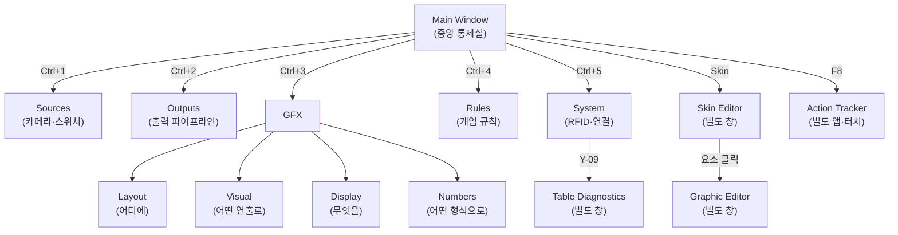
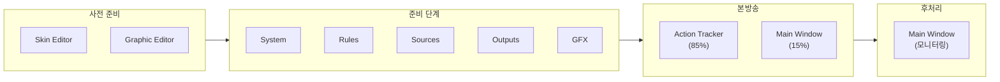
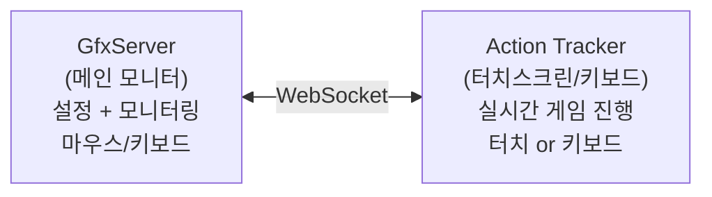
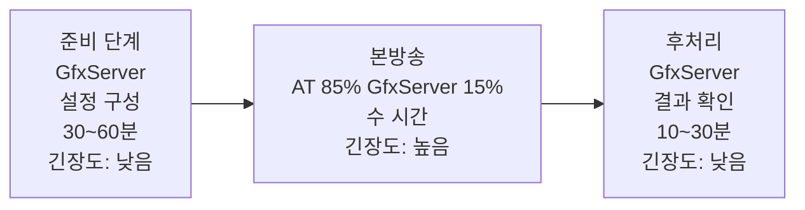
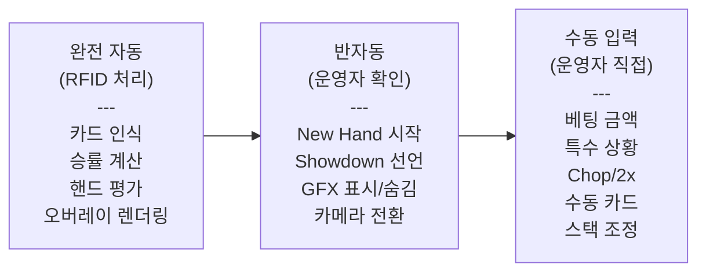
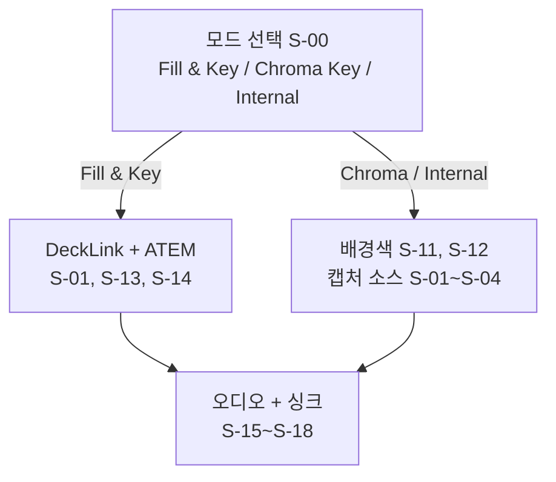
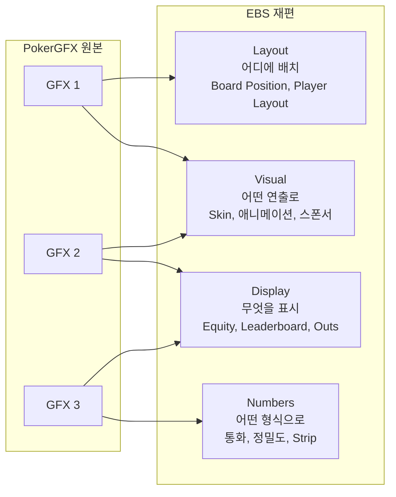
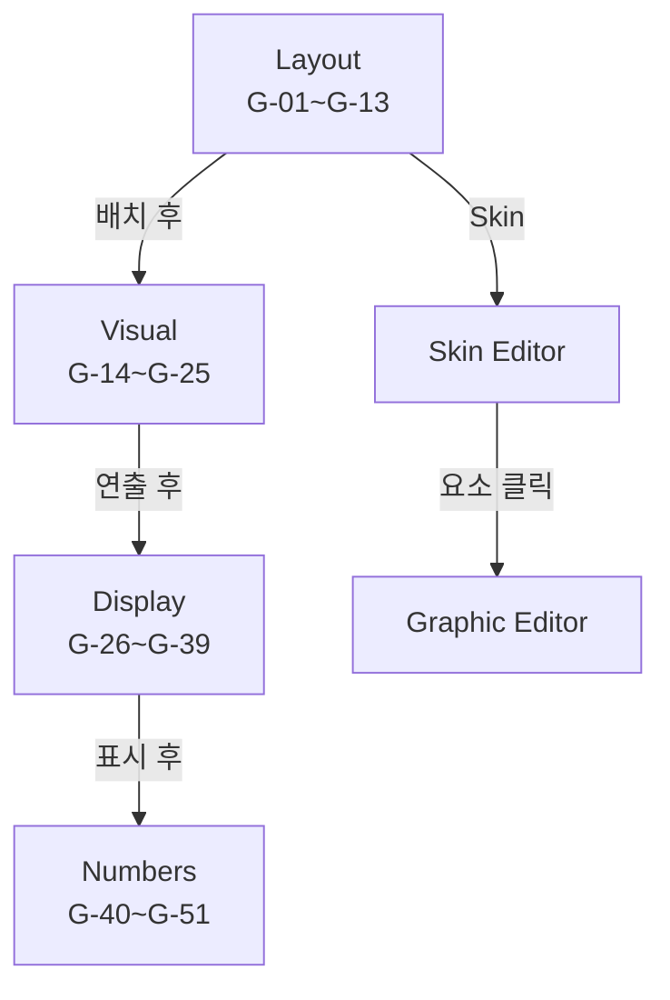
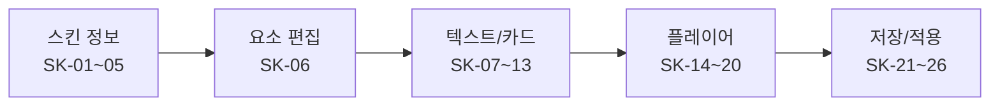
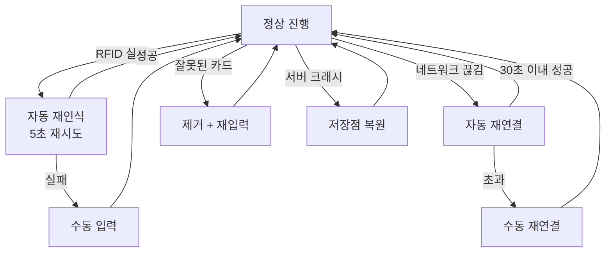

# PRD-0004 ASCII → Mermaid 변환 Work Plan

## 배경 (Background)

- 요청 내용: `PRD-0004-EBS-Server-UI-Design.md` 내 ASCII 다이어그램을 Mermaid로 변환
- 해결하려는 문제: 저장 파일(.md)에 ASCII art가 사용된 것은 CLAUDE.md 규칙 위반. 규칙 `11-ascii-diagram.md`에 따르면 저장·전달되는 문서의 다이어그램은 Mermaid를 사용해야 하며, ASCII는 터미널 즉시 확인용에 한정된다.
- 적용 규칙: ASCII는 primary(터미널 응답), Mermaid는 supplementary(.md 파일 저장) — 본 문서는 .md 저장 파일이므로 Mermaid로 변환

---

## 구현 범위 (Scope)

### 포함 항목
- 플로우차트, 네비게이션 맵, 워크플로우 다이어그램 → Mermaid 변환
- UI 와이어프레임(ASCII box drawing) → 삭제 후 PNG mockup 참조로 대체

### 제외 항목
- 테이블(표) — 변환 대상 아님
- 이미지(`![...]`) 참조 — 변환 대상 아님
- 코드 블록(비다이어그램) — 변환 대상 아님

---

## 영향 파일 (Affected Files)

### 수정 예정 파일 (1개)
- `C:\claude\ebs\docs\01_PokerGFX_Analysis\PRD-0004-EBS-Server-UI-Design.md`

### 신규 생성 파일
- 없음

---

## 위험 요소 (Risks)

1. **Step 1~7 단계별 다이어그램 중복 누적 구조**: 1.1 네비게이션 맵은 Step 1~8에 걸쳐 동일 다이어그램이 점진적으로 누적된다. Step 1~7의 중간 단계 다이어그램을 모두 Mermaid로 변환하면 렌더링 비용이 크고 가독성이 낮아진다. 단일 완성본(Step 8) 하나만 Mermaid로 유지하고 나머지는 서술 텍스트로 처리해야 한다.

2. **레이아웃 와이어프레임(UI Box Drawing) 오분류 위험**: `2.3 레이아웃 구조`(Lines 396~412), `1.5 공통 레이아웃`(Lines 253~269) 등은 UI 와이어프레임이다. 11-ascii-diagram.md 규칙에 따르면 이는 Mermaid 변환 대상이 아니라 삭제 후 mockup PNG 참조로 대체해야 한다. 1.5 공통 레이아웃은 아직 mockup PNG가 없으므로 삭제 후 텍스트 설명으로 대체한다.

3. **다이어그램 번호와 Line 번호 불일치 위험**: 변환 작업 중 앞 섹션 내용 변경 시 뒤 섹션의 Line 번호가 밀린다. 섹션 식별자(제목 기준)로 편집하고 Line 번호는 참조용으로만 사용해야 한다.

4. **Step 1~7 서술 내 인라인 다이어그램 제거 후 맥락 손실**: 각 Step에는 해당 단계의 구조를 보여주는 소형 다이어그램이 있다. 제거 시 서술 텍스트만으로는 독자가 구조를 파악하기 어려울 수 있다. Step 완성본(Step 8)이 전체 구조를 포함하므로 "Step 8의 완성 다이어그램 참조" 문구를 각 Step에 추가한다.

---

## 태스크 목록 (Tasks)

### Task 1: 1.1 Step 1~7 중간 단계 ASCII 다이어그램 제거

**대상 라인**: Lines 53~57, 63~73, 79~90, 96~107, 113~130, 136~149, 155~161

**수행 방법**:
- 각 Step 내 ` ```...``` ` ASCII 블록 전체 삭제
- 각 Step 마지막 줄에 다음 문구 추가: `(완성된 네비게이션 맵은 Step 8 참조)`

**Before (Step 1 예시)**:
```
#### Step 1: Main Window — 중앙 통제실

모든 것은 **Main Window**에서 시작한다...

\```
  +------------------------------+
  |   Main Window (중앙 통제실)   |
  +------------------------------+
\```
```

**After (Step 1 예시)**:
```
#### Step 1: Main Window — 중앙 통제실

모든 것은 **Main Window**에서 시작한다...

(완성된 네비게이션 맵은 Step 8 참조)
```

**Acceptance Criteria**:
- Step 1~7(Lines 49~161) 내 7개 ASCII 블록이 모두 제거된다
- 각 Step 제목 아래 서술 텍스트는 그대로 유지된다
- "(Step 8 참조)" 문구가 각 Step에 존재한다

---

### Task 2: 1.1 Step 8 완성 다이어그램 → Mermaid 변환

**대상 라인**: Lines 167~194 (Step 8 ASCII 블록)

**Before**:
```
\```
  +-------------------------------------------------------------------------+
  |                            Main Window                                   |
  |                          (중앙 통제실)                                    |
  +----+--------+--------+--------+--------+--------+-----+------------------+
       |        |        |        |        |        |     |
     Ctrl+1   Ctrl+2   Ctrl+3   Ctrl+4   Ctrl+5   Skin   F8
       |        |        |        |        |        |     |
       v        v        v        v        v        v     v
   +------+  +------+  +-----+  +------+  +------+  +------+  +------+
   |Source|  |Output|  | GFX |  |Rules |  |System|  | Skin |  |  AT  |
   |  s   |  |  s   |  |     |  |      |  |      |  |Editor|  |      |
   ...
   System --> Y-09 --> [Table Diagnostics (별도 창)]
\```
```

**After**:


**Acceptance Criteria**:
- Lines 167~194의 ASCII 블록이 위 Mermaid 블록으로 교체된다
- Main Window → 7개 분기(Sources, Outputs, GFX, Rules, System, Skin, AT)가 모두 표현된다
- GFX → 4개 서브탭(Layout, Visual, Display, Numbers)이 표현된다
- Skin Editor → Graphic Editor 연결이 표현된다
- System → Table Diagnostics 연결이 표현된다

---

### Task 3: 1.2 화면 사용 순서 타임라인 → Mermaid 변환

**대상 라인**: Lines 212~221

**Before**:
```
\```
  시간 흐름 기준 화면 사용 순서:

  [사전 준비]       [준비 단계]            [본방송]         [후처리]
  Skin Editor  --> System              --> Action Tracker --> Main Window
  Graphic Editor   Rules                  Main Window        (모니터링)
                   Sources
                   Outputs
                   GFX
\```
```

**After**:


**Acceptance Criteria**:
- Lines 212~221의 ASCII 블록이 위 Mermaid 블록으로 교체된다
- 4개 단계(사전 준비, 준비 단계, 본방송, 후처리)가 subgraph로 표현된다
- 각 단계의 화면 목록이 포함된다

---

### Task 4: 1.3 방송 워크스테이션 → Mermaid 변환

**대상 라인**: Lines 232~237

**Before**:
```
\```
  [메인 모니터]         [터치스크린/키보드]
  GfxServer              Action Tracker
  설정 + 모니터링  <-->  실시간 게임 진행
  (마우스/키보드)       (터치 or 키보드)
\```
```

**After**:


**Acceptance Criteria**:
- Lines 232~237의 ASCII 블록이 위 Mermaid 블록으로 교체된다
- GfxServer와 Action Tracker 양방향 연결이 표현된다

---

### Task 5: 1.5 공통 레이아웃 ASCII 삭제 후 텍스트 대체

**대상 라인**: Lines 253~269 (UI 와이어프레임)

**판단 근거**: 이것은 UI 와이어프레임(레이아웃)이다. 11-ascii-diagram.md 규칙에 따르면 UI 와이어프레임은 ASCII도 Mermaid도 아니라 `--mockup --bnw`로 HTML 목업 생성이다. 그러나 `ebs-main.png` mockup이 이미 2.3절에 존재하므로, 1.5 공통 레이아웃 와이어프레임은 삭제하고 2.3절의 mockup PNG를 참조하는 텍스트로 대체한다.

**Before**:
```
\```
  +-------------------------------------------------------------------+
  |  Title Bar  [앱명 + 버전]                          [_][□][X]      |
  +----------------------------------+--------------------------------+
  |                                  |  CPU [===] GPU [===]           |
  |                                  |  RFID [●]  Error [●]  Lock [●] |
  |   Preview Panel                  |  [Preview]                      |
  |   (16:9 Chroma Key Blue)         |                                 |
  |   GFX 오버레이 실시간 렌더링       |  [Reset Hand]                  |
  |                                  |  [Register Deck]                |
  |                                  |  [Launch AT]                    |
  +----------------------------------+--------------------------------+
  | [Sources] [Outputs] [GFX] [Rules] [System]                        |
  +-------------------------------------------------------------------+
  |                    Tab Content Area                                |
  +-------------------------------------------------------------------+
\```
```

**After** (삭제 후 추가할 텍스트):
```
> 공통 레이아웃 구조 시각화: [2장 Main Window EBS 설계 목업](../images/mockups/ebs-main.png) 참조.
> Title Bar > Preview Panel(좌) + Status/Quick Actions(우) > Tab Navigation > Tab Content Area 순으로 구성.
```

**Acceptance Criteria**:
- Lines 253~269의 ASCII 와이어프레임이 삭제된다
- 대체 텍스트로 2장 mockup PNG 참조가 추가된다
- 바로 아래 "해상도 적응 원칙" 섹션(Line 271)과 연결이 자연스럽다

---

### Task 6: 1.6 3단계 시간 모델 → Mermaid 변환

**대상 라인**: Lines 308~314

**Before**:
```
\```
  [준비 단계]          [본방송]              [후처리]
  GfxServer            AT (85%)             GfxServer
  설정 구성    --->    GfxServer (15%)  --->  결과 확인
  (30~60분)           (수 시간)             (10~30분)
  긴장도: 낮음         긴장도: 높음          긴장도: 낮음
\```
```

**After**:


**Acceptance Criteria**:
- Lines 308~314의 ASCII 블록이 위 Mermaid 블록으로 교체된다
- 3단계(준비, 본방송, 후처리)와 각 단계의 주 화면, 시간, 긴장도가 모두 표현된다

---

### Task 7: 1.6 주의력 분배 ASCII 삭제 (테이블로 이미 표현됨)

**대상 라인**: Lines 326~335

**판단 근거**: 바로 위 Lines 320~324에 동일 정보를 담은 테이블이 있다. ASCII 다이어그램이 추가적인 정보를 제공하지 않으므로 삭제한다.

**Before**:
```
\```
  주의력 분배 (본방송 중):

  +---------+-----------------------------------------------+---------+
  |  AT     |///////////  Action Tracker  ///////////////////|Stream   |
  |  80%    |////////////  (터치, 베팅 입력)  ///////////////|  5%     |
  +---------+-----------------------------------------------+---------+
  | GfxServer 15% (모니터링 대시보드)                                   |
  +---------------------------------------------------------------------+
\```
```

**After**: 해당 블록 전체 삭제 (위 테이블로 충분)

**Acceptance Criteria**:
- Lines 326~335의 ASCII 블록이 삭제된다
- 바로 위 테이블(Lines 320~324)은 유지된다
- 삭제 후 "#### 자동화 그래디언트" 헤딩(Line 337)이 자연스럽게 이어진다

---

### Task 8: 1.6 자동화 그래디언트 → Mermaid 변환

**대상 라인**: Lines 341~351

**Before**:
```
\```
  [완전 자동]           [반자동]              [수동 입력]
  (RFID 처리)          (운영자 확인)          (운영자 직접)
  +-----------+        +-------------+       +-----------+
  | 카드 인식  |        | New Hand 시작|       | 베팅 금액 |
  | 승률 계산  |  --->  | Showdown 선언|  --->| 특수 상황 |
  | 핸드 평가  |        | GFX 표시/숨김|       | Chop/2x  |
  | 오버레이   |        | 카메라 전환  |       | 수동 카드 |
  | 렌더링    |        |              |       | 스택 조정 |
  +-----------+        +--------------+       +-----------+
\```
```

**After**:


**Acceptance Criteria**:
- Lines 341~351의 ASCII 블록이 위 Mermaid 블록으로 교체된다
- 완전 자동→반자동→수동 3단계 흐름이 표현된다
- 각 단계의 세부 항목이 모두 포함된다

---

### Task 9: 2.3 레이아웃 구조 ASCII 삭제 (PNG mockup으로 대체)

**대상 라인**: Lines 396~412

**판단 근거**: 바로 위 Line 388에 `` mockup PNG가 이미 있다. UI 와이어프레임은 Mermaid 변환 대상이 아니라 삭제 후 mockup 참조로 대체한다.

**Before**:
```
#### 레이아웃 구조

\```
+------------------------------------------+
| Title Bar                     [_][□][×] |
+---------------------------+--------------+
...
+------------------------------------------+
\```
```

**After**: ASCII 블록 전체 삭제. `#### 레이아웃 구조` 헤딩도 삭제 (PNG mockup이 이미 구조를 보여줌)

**Acceptance Criteria**:
- Lines 394~412의 "#### 레이아웃 구조" 헤딩과 ASCII 블록이 삭제된다
- Line 388의 `` 이미지 참조는 유지된다
- 삭제 후 "#### UI 설계 원칙" 섹션(Line 414)이 자연스럽게 이어진다

---

### Task 10: 3.6 Sources Workflow → Mermaid 변환

**대상 라인**: Lines 555~568

**Before**:
```
\```
  [모드 선택 S-00]
        |
        +-----Fill & Key?-----+
        |                     |
     Yes(Fill&Key)       Chroma/Internal
        v                     v
  [DeckLink+ATEM       [배경색 S-11,S-12]
   S-01,S-13,S-14]     [캡처 소스 S-01~S-04]
        |                     |
        +----------+----------+
                   v
          [오디오+싱크 S-15~S-18]
\```
```

**After**:


**Acceptance Criteria**:
- Lines 555~568의 ASCII 블록이 위 Mermaid 블록으로 교체된다
- Fill & Key 분기와 Chroma/Internal 분기가 표현된다
- 두 분기 모두 오디오+싱크로 합류하는 구조가 표현된다

---

### Task 11: 4.6 Outputs Workflow → Mermaid 변환

**대상 라인**: Lines 662~664

**Before**:
```
\```
  [해상도 O-01,O-03] ---> [Live O-04,O-05] ---> [녹화/스트리밍 O-15~O-17]
\```
```

**After**:


**Acceptance Criteria**:
- Lines 662~664의 ASCII 블록이 위 Mermaid 블록으로 교체된다
- 3단계 순서(해상도 → Live → 녹화/스트리밍)가 표현된다

---

### Task 12: 5.4 GFX 탭 매핑 → Mermaid 변환

**대상 라인**: Lines 776~784

**Before**:
```
\```
  PokerGFX         EBS
  +---------+      +-----------+
  | GFX 1  |  --> | Layout    | (어디에 배치: Board Position, Player Layout 등)
  | GFX 2  |  --> | Visual    | (어떤 연출로: Skin, 애니메이션, 스폰서 등)
  | GFX 3  |  --> | Display   | (무엇을 표시: Equity, Leaderboard, Outs 등)
  +---------+  --> | Numbers   | (어떤 형식으로: 통화, 정밀도, Strip 등)
               +-----------+
\```
```

**After**:


**Acceptance Criteria**:
- Lines 776~784의 ASCII 블록이 위 Mermaid 블록으로 교체된다
- PokerGFX GFX1/2/3 → EBS Layout/Visual/Display/Numbers 매핑이 표현된다
- GFX1/2/3의 교차 매핑(예: GFX1→Visual, GFX2→Visual)이 표현된다

---

### Task 13: 5.6 GFX Workflow → Mermaid 변환

**대상 라인**: Lines 796~803

**Before**:
```
\```
  [Layout G-01~G-13] --배치 후--> [Visual G-14~G-25] --연출 후-->
  [Display G-26~G-39] --표시 후--> [Numbers G-40~G-51]
       |
     Skin
       v
  [Skin Editor] --요소 클릭--> [Graphic Editor]
\```
```

**After**:


**Acceptance Criteria**:
- Lines 796~803의 ASCII 블록이 위 Mermaid 블록으로 교체된다
- Layout→Visual→Display→Numbers 순서 흐름이 표현된다
- Layout→Skin Editor→Graphic Editor 분기가 표현된다

---

### Task 14: 8.6 Skin Editor Workflow → Mermaid 변환

**대상 라인**: Lines 1121~1126

**Before**:
```
\```
  [스킨 정보 SK-01~05] --> [요소 편집 SK-06] --> [텍스트/카드 SK-07~13]
                                                        |
                                                        v
                                              [플레이어 SK-14~20] --> [저장/적용 SK-21~26]
\```
```

**After**:


**Acceptance Criteria**:
- Lines 1121~1126의 ASCII 블록이 위 Mermaid 블록으로 교체된다
- 5단계 순서(스킨 정보→요소 편집→텍스트/카드→플레이어→저장/적용)가 표현된다

---

### Task 15: 11.4 예외 처리 흐름 → Mermaid 변환

**대상 라인**: Lines 1344~1362

**Before**:
```
\```
  [정상 진행]
      |
      +-- RFID 실패 --5초--> [자동 재인식] --성공--> [정상 진행]
      |                            |
      |                          실패
      |                            v
      |                      [수동 입력] --> [정상 진행]
      |
      +-- 네트워크 끊김 --> [자동 재연결] --30초 이내--> [정상 진행]
      |                            |
      |                          초과
      |                            v
      |                      [수동 재연결] --> [정상 진행]
      |
      +-- 잘못된 카드 --> [제거+재입력] --> [정상 진행]
      |
      +-- 서버 크래시 --> [저장점 복원] --> [정상 진행]
\```
```

**After**:


**Acceptance Criteria**:
- Lines 1344~1362의 ASCII 블록이 위 Mermaid 블록으로 교체된다
- 4개 예외 경로(RFID 실패, 네트워크 끊김, 잘못된 카드, 서버 크래시)가 모두 표현된다
- 각 자동 복구 실패 시 수동 개입 분기가 표현된다
- 모든 경로가 "정상 진행"으로 복귀하는 구조가 표현된다

---

## 커밋 전략 (Commit Strategy)

변환 완료 후 단일 커밋:

```
docs(prd-0004): ASCII 다이어그램 → Mermaid 변환 (15개 수정)

- Step 1~7 중간 단계 ASCII 7개 삭제, Step 8 완성본 Mermaid 변환
- 1.2 화면 사용 순서 flowchart LR 변환
- 1.3 워크스테이션 flowchart LR 변환
- 1.5 공통 레이아웃 UI 와이어프레임 삭제, mockup PNG 참조로 대체
- 1.6 3단계 시간 모델, 주의력 분배(삭제), 자동화 그래디언트 변환
- 2.3 레이아웃 구조 UI 와이어프레임 삭제 (PNG mockup 존재)
- 3.6 Sources 워크플로우 flowchart TD 변환
- 4.6 Outputs 워크플로우 flowchart LR 변환
- 5.4 GFX 탭 매핑 graph LR 변환
- 5.6 GFX 워크플로우 flowchart TD 변환
- 8.6 Skin Editor 워크플로우 flowchart LR 변환
- 11.4 예외 처리 흐름 flowchart TD 변환
```

---

## 변환 대상 요약 다이어그램

```
  PRD-0004 다이어그램 변환 맵

  섹션         | 타입          | 처리
  -------------|---------------|------------------
  1.1 Step 1~7 | ASCII (중간)  | 삭제 + Step 8 참조
  1.1 Step 8   | ASCII → Mermaid| graph TD 변환
  1.2          | ASCII → Mermaid| flowchart LR 변환
  1.3          | ASCII → Mermaid| flowchart LR 변환
  1.5          | UI 와이어프레임| 삭제 + PNG 참조
  1.6 시간모델  | ASCII → Mermaid| flowchart LR 변환
  1.6 주의력   | ASCII (중복)  | 삭제 (테이블 존재)
  1.6 자동화   | ASCII → Mermaid| flowchart LR 변환
  2.3          | UI 와이어프레임| 삭제 (PNG 존재)
  3.6          | ASCII → Mermaid| flowchart TD 변환
  4.6          | ASCII → Mermaid| flowchart LR 변환
  5.4          | ASCII → Mermaid| graph LR 변환
  5.6          | ASCII → Mermaid| flowchart TD 변환
  8.6          | ASCII → Mermaid| flowchart LR 변환
  11.4         | ASCII → Mermaid| flowchart TD 변환
```

---

## 변경 이력

| 버전 | 날짜 | 내용 |
|------|------|------|
| v1.0.0 | 2026-02-20 | 초기 작성 |

---

**Version**: 1.0.0 | **Updated**: 2026-02-20
