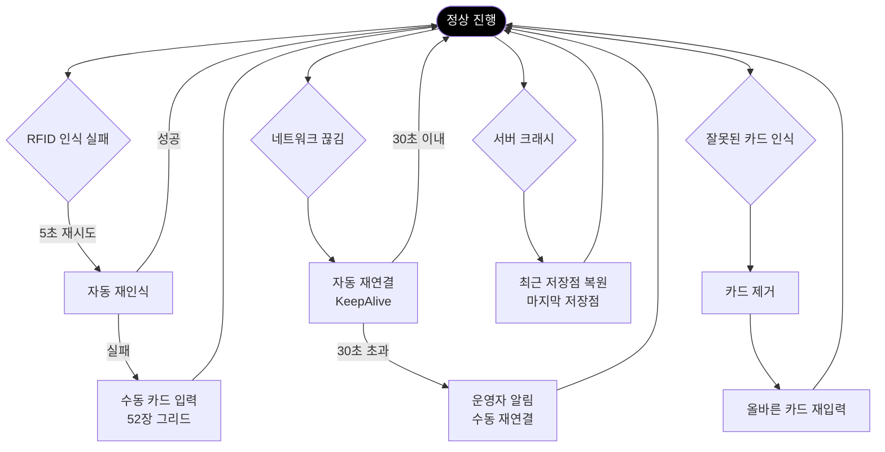

# PRD-0004 보강 작업 구현 계획서

**작성일**: 2026-02-18
**버전**: v1.0.0
**상태**: 승인 대기

---

## 1. 배경 및 목적

### 1.1 배경

PRD-0004-EBS-Server-UI-Design.md (v11.0.0)는 pokergfx-prd-v2와의 중복 제거를 목표로 v10.0 대비 1356줄→650줄(52% 압축)로 대폭 축소되었다. 그러나 이 과정에서 ebs_reverse 역설계 문서(`part-vii-draft.md`)에 포함된 일부 핵심 설계 내용이 PRD-0004에서 누락되었다.

### 1.2 목적

PRD-0004에 다음 5가지 항목을 보강하여 **독립된 UI 설계 허브 문서**로서의 완결성을 확보한다:

1. 멘탈 모델 병합 (3단계 시간 모델, 주의력 분배, 자동화 그래디언트)
2. 에러/로딩/비활성 상태 상세화
3. 예외 처리 흐름 추가
4. Viewer Overlay 상세 보강
5. GFX ID 체계 통일

### 1.3 소스 문서

- **단일 소스**: `C:/claude/ebs_reverse/docs/01-plan/part-vii-draft.md`
  - Section 17 (L9-111): 멘탈 모델
  - Section 19 (L528-563): 예외 처리 흐름
  - Section 20 (L566-636): Viewer Overlay
  - Section 20.5.3 (L715-730): 에러 6유형
  - Section 20.5.4 (L731-744): 로딩 6단계
  - Section 20.5.5 (L746-761): 비활성 7+1조건

> **주의**: `part-vii-draft.md`는 `ebs_reverse` 레포 소속이므로 **참조만 허용**, 직접 수정 금지.

### 1.4 대상 문서

- **허브 문서**: `C:/claude/ebs/docs/01_PokerGFX_Analysis/PRD-0004-EBS-Server-UI-Design.md` (v11.0.0)
- **위성 문서**: `C:/claude/ebs/docs/01_PokerGFX_Analysis/PRD-0004-feature-mapping.md` (v1.1.0)

---

## 2. 보강 항목 상세

### 항목 1: 멘탈 모델 병합

#### 현재 상태
- PRD-0004 v11.0.0에서 "UI 설계 기초" 장이 전체 삭제됨
- `pokergfx-prd-v2.md`로의 참조 링크만 존재

#### 목표
- 1장 "전체 화면 구조"에 **"1.5 설계 기초"** 섹션 추가
- part-vii의 핵심 멘탈 모델을 테이블 형태로 요약

#### 편집 지시

**파일**: `PRD-0004-EBS-Server-UI-Design.md`

**위치**: 1.4절 "공통 레이아웃" 다음 (L136 이후)

**추가 내용**:

```markdown
### 1.5 설계 기초

PRD-0004는 단순한 화면 스펙이 아니라 **운영자의 사고 모델**을 반영한 설계다. UI를 이해하기 위한 4가지 핵심 개념:

#### 3단계 시간 모델

방송 시스템 사용은 3개의 명확한 시간 단계로 나뉜다.

| 단계 | 시간 | 주 화면 | 조작 방식 | 긴장도 |
|------|------|---------|----------|--------|
| **준비** (Setup) | 30~60분 | GfxServer | 마우스/키보드 | 낮음 |
| **본방송** (Live) | 수 시간 | Action Tracker | 터치 | **높음** |
| **후처리** (Post) | 10~30분 | GfxServer | 마우스/키보드 | 낮음 |

본방송 중 GfxServer는 "설정 도구"에서 "모니터링 대시보드"로 역할이 전환된다.

#### 주의력 분배

본방송 중 운영자 주의력 분배:

| 장치 | 비중 | 주시 내용 |
|------|:----:|----------|
| **Action Tracker** | 80% | 현재 핸드 진행, 베팅 입력, 특수 상황 |
| **GfxServer** | 15% | RFID 상태, 에러 알림, 프리뷰 |
| **Stream Deck** | 5% | GFX 숨기기, 카메라 전환 (손끝 감각) |

이 분배가 UI 설계의 핵심 제약 조건이다. Action Tracker는 주변 시야에서도 상태를 파악할 수 있어야 하고, GfxServer는 문제가 생겼을 때만 주의를 끌어야 한다.

#### 자동화 그래디언트

시스템은 가능한 많은 작업을 자동 처리하되, 판단이 필요한 작업만 인간에게 맡긴다.

| 완전 자동 (RFID) | 반자동 (운영자 확인) | 수동 입력 |
|:---:|:---:|:---:|
| 카드 인식 | New Hand 시작 | 베팅 금액 |
| 승률 계산 | Showdown 선언 | 특수 상황 (Chop, Run It 2x) |
| 핸드 평가 | GFX 표시/숨기기 | 수동 카드 입력 (RFID 실패 시) |
| 오버레이 렌더링 | 카메라 전환 | 스택 수동 조정 |

#### 더 알아보기

- **전체 멘탈 모델 설명**: [pokergfx-prd-v2 Part VII §17](../../ebs_reverse/docs/01-plan/pokergfx-prd-v2.md#17-인터페이스-멘탈-모델)
- **운영 워크플로우**: [pokergfx-prd-v2 Part III](../../ebs_reverse/docs/01-plan/pokergfx-prd-v2.md#part-iii-운영-워크플로우)
```

**영향 줄 수**: 약 +40줄

---

### 항목 2: 에러/로딩/비활성 상태 상세화

#### 현재 상태
- 11장 "시스템 상태 UI"에 기본 테이블 존재 (에러 6행, 로딩 6행, 비활성 7행)
- 시각적 표시, 복구 절차 등 구체적 내용 부족

#### 목표
- 기존 11.1~11.3절을 ebs_reverse 수준의 상세 내용으로 보강
- Feature ID 추가

#### 편집 지시

**파일**: `PRD-0004-EBS-Server-UI-Design.md`

**위치**: 11장 전체 교체 (L598-639)

**교체 내용**:

```markdown
## 11장: 시스템 상태 UI

### 11.1 에러 상태

방송 중 발생 가능한 에러와 UI 피드백 전략. 모든 에러는 복구 가능해야 하며, 방송을 중단시키지 않는다.

| 에러 유형 | 시각적 표시 | 자동 복구 | 수동 개입 | Feature ID |
|----------|-----------|----------|----------|-----------|
| **RFID 인식 실패** | Main 탭 RFID 상태 그리드 빨간색, 5초 카운트다운 | 5초 재시도 | 재시도 실패 시 수동 카드 입력 창 자동 표시 | Y-01, M-05 |
| **네트워크 끊김** | Main 탭 클라이언트 목록에서 접속 상태 회색, 재연결 아이콘 회전 | 30초 자동 재연결 | 재연결 실패 시 "수동 재연결" 버튼 활성화 | M-18 |
| **잘못된 카드** | Action Tracker 해당 좌석 셀 빨간색 테두리, "WRONG CARD" 경고 | — | "카드 제거 → 올바른 카드 재입력" 가이드 표시 | Y-01 |
| **서버 크래시** | 서버 전체 다운, 자동 재시작 | 최근 저장점 자동 복원 (최대 30초 전) | 복원 실패 시 마지막 핸드 수동 재입력 | M-13 |
| **License 만료** | 서버 시작 시 차단, 모달 다이얼로그 | — | PokerGFX 계정 로그인 후 라이선스 갱신 | Y-02 |
| **GPU 과부하** | System 탭 FPS 그래프 빨간색 (30fps 이하), 경고음 | — | 비디오 소스 해상도 낮춤 또는 GFX 요소 숨김 | M-04 |

**에러 로그 표시**: Main 탭 하단에 최근 5개 에러만 표시. 심각도별 색상 구분 (빨강=긴급, 노랑=경고, 회색=정보).

### 11.2 로딩 상태

시스템 시작과 데이터 로드 중 표시되는 프로그레스 인디케이터.

| 로딩 단계 | 예상 시간 | UI 표시 | Feature ID |
|----------|:--------:|---------|-----------|
| **서버 시작** | 3~5초 | 스플래시 화면, "Checking License..." → "Initializing..." | Y-02 |
| **RFID 초기화** | 2~4초 | "Connecting RFID Readers... (0/12)" 프로그레스 바 | Y-01 |
| **Skin 로딩** | 1~3초 | "Loading Skin: [파일명]..." 스피너 | G-01 |
| **비디오 소스 검색** | 2~5초 | "Scanning NDI Sources..." 회전 아이콘 | S-01 |
| **테스트 스캔** | 0.2초 | "Test Card Recognition..." → "200ms ✓" 또는 "FAIL ✗" | Y-04 |
| **상태 복원** | 1~2초 | "Restoring Game State... Hand #[번호]" 프로그레스 바 | M-13 |

**스플래시 화면 표시 규칙**: 예상 로딩 시간이 1초 이상인 경우에만 표시. 1초 미만은 즉시 완료 처리.

### 11.3 비활성 상태

UI 요소가 비활성화되는 조건과 시각적 피드백.

| 조건 | 비활성화 요소 | 시각적 표시 | 이유 |
|------|-------------|-----------|------|
| **게임 진행 중** | Main 탭 "게임 시작" 버튼 | 회색 처리, "게임 진행 중" 툴팁 | 중복 시작 방지 |
| **자동 모드 활성** | GFX1 탭 수동 카드 입력 섹션 전체 | 회색 처리, "Auto Mode ON" 배너 | RFID 우선 정책 |
| **Trustless Mode ON** | Outputs 탭 Live Canvas "Show Hole Cards" 체크박스 | 회색 처리, 체크 불가 | 보안 정책 강제 |
| **에디터 빈 캔버스** | Properties 패널 전체 | 회색 처리, "No Element Selected" 플레이스홀더 | 선택된 요소 없음 |
| **클라이언트 미연결** | GFX1 탭 "Action Tracker로 전송" 버튼 | 회색 처리, "No Client Connected" 툴팁 | 전송 대상 없음 |
| **RFID 리더 오프라인** | GFX1 탭 Auto 모드 라디오 버튼 | 회색 처리, "RFID Offline" 경고 | 하드웨어 장애 |
| **License Basic** | System 탭 Advanced 기능 섹션 전체 | 회색 처리, "Upgrade to PRO" 배너 | 라이선스 제한 |
| **Action Tracker 불가능 액션** | RAISE 버튼 (All-in 상태 플레이어) | 회색 처리, 터치 무반응 | 게임 규칙 위반 |

**비활성 vs 숨김**: 사용자가 "이 기능이 존재하지만 지금은 사용 불가"임을 알아야 하면 비활성 표시. "이 모드에서는 아예 존재하지 않는 기능"이면 숨김 처리.
```

**영향 줄 수**: 약 +25줄 (기존 테이블 확장)

---

### 항목 3: 예외 처리 흐름 추가

#### 현재 상태
- PRD-0004에 예외 처리 흐름 설명 없음 (v11.0에서 삭제)

#### 목표
- 11장에 **"11.4 예외 처리 흐름"** 섹션 추가
- 4가지 예외 시나리오 + Mermaid 다이어그램 포함

#### 편집 지시

**파일**: `PRD-0004-EBS-Server-UI-Design.md`

**위치**: 11.3절 "비활성 상태" 다음 (새 섹션 추가)

**추가 내용**:

```markdown
### 11.4 예외 처리 흐름

본방송 중 발생할 수 있는 예외 상황과 복구 경로.



모든 예외 경로는 결국 "정상 진행"으로 돌아온다. 시스템은 어떤 장애가 발생해도 방송을 계속할 수 있도록 설계되어야 한다.

**더 알아보기**: [pokergfx-prd-v2 Part VII §19](../../ebs_reverse/docs/01-plan/pokergfx-prd-v2.md#19-본방송-인터페이스) (예외 처리 상세)
```

**영향 줄 수**: 약 +35줄

---

### 항목 4: Viewer Overlay 상세 보강

#### 현재 상태
- PRD-0004 v11.0에서 Viewer Overlay 전체 삭제 (pokergfx-prd-v2 참조 링크만)

#### 목표
- **부록 D**로 "Viewer Overlay 설계" 추가
- 정보 계층, 오버레이 구성 요소, Dual Canvas 비교, 게임 상태별 화면 변화 포함

#### 편집 지시

**파일**: `PRD-0004-EBS-Server-UI-Design.md`

**위치**: 부록 C "관련 문서 색인" 다음 (새 부록 추가, L688 이후)

**추가 내용**:

```markdown
### D. Viewer Overlay 설계

운영자가 만드는 모든 것의 최종 산출물은 시청자의 방송 화면이다. 이 섹션은 시청자가 실제로 무엇을 보는지 서술한다.

#### 정보 계층

시청자가 방송 화면을 볼 때, 정보는 3개 계층으로 인지된다:

| 계층 | 요소 | 시선 우선순위 |
|------|------|:--------:|
| **1차** (즉시 인지) | 플레이어 홀카드, 승률 | 가장 높음 |
| **2차** (맥락 파악) | 팟 사이즈, 베팅 액션, 보드 카드 | 중간 |
| **3차** (참고 정보) | 이벤트명, 블라인드, 핸드 번호, 로고 | 낮음 |

이 계층은 오버레이 요소의 크기, 위치, 색상 강도에 반영되어야 한다.

#### 오버레이 구성 요소

| 요소 | 위치 | 정보 계층 | 표시 조건 |
|------|------|:--------:|----------|
| 플레이어 홀카드 | 각 플레이어 근처 | 1차 | Delayed Canvas만 (보안) *(Delayed Canvas는 추후 개발)* |
| 승률 | 홀카드 옆 | 1차 | 2인 이상 활성 |
| 팟 사이즈 | 보드 상단 | 2차 | 항상 |
| 베팅 액션 | 현재 플레이어 | 2차 | 액션 발생 시 |
| 보드 카드 | 화면 중앙 | 2차 | Flop 이후 |
| 플레이어 이름/칩 | 각 플레이어 하단 | 2차 | 항상 |
| 이벤트명/블라인드 | 상단 | 3차 | 항상 |
| 로고 | 상단/하단 코너 | 3차 | 항상 |
| 폴드 표시 | 폴드 플레이어 | — | 폴드 시 회색 처리 |

#### Dual Canvas 비교

> **추후 개발**: Delayed Canvas (방송용 딜레이 출력)는 추후 개발 대상이다. EBS Phase 1에서는 Live Canvas만 구현한다.

| 구분 | Live Canvas (현장용) | Delayed Canvas (방송용) *(추후 개발)* |
|------|---------------------|----------------------|
| **대상** | 현장 관객, 스태프 | TV/스트림 시청자 |
| **홀카드** | 숨김 (Showdown 전까지) | 지연 후 공개 (5~30분) |
| **승률** | 표시 안 함 | 표시 |
| **보드 카드** | 즉시 표시 | 즉시 표시 |
| **팟/베팅** | 즉시 표시 | 즉시 표시 |
| **용도** | 현장 대형 화면, IMAG | 방송 송출, 녹화 |
| **보안** | Trustless Mode 적용 | 딜레이로 보호 *(추후 개발)* |

#### 게임 상태별 화면 변화

| 상태 | 오버레이 변화 |
|------|-------------|
| **Pre-Flop** | 홀카드 표시 (Delayed는 추후 개발, 현재 Broadcast Canvas 없음), 초기 승률, "PRE-FLOP" 인디케이터 |
| **Flop** | 보드 카드 3장 등장 애니메이션, 승률 재계산, 팟 갱신 |
| **Turn/River** | 보드 카드 추가, 승률 드라마틱하게 변동, 큰 베팅 시 강조 |
| **All-in** | 승률 바 확대 표시, 남은 카드 자동 전개 여부 선택 |
| **Showdown** | Live Canvas에도 카드 공개, 승자 하이라이트 애니메이션 |

**더 알아보기**: [pokergfx-prd-v2 Part VII §20](../../ebs_reverse/docs/01-plan/pokergfx-prd-v2.md#20-시청자-경험) (전체 상세)
```

**영향 줄 수**: 약 +60줄

---

### 항목 5: GFX ID 체계 통일

#### 현재 상태
- PRD-0004는 G-01~G-51 ID 사용
- ebs_reverse는 G1-xxx, G2-xxx, G3-xxx ID 사용
- 두 체계 간 매핑 부재

#### 목표
- `PRD-0004-feature-mapping.md`에 **크로스 레퍼런스 추가**
- "Original PokerGFX ID" 열 추가하여 G1-xxx ↔ G-xx 매핑 명시

#### 편집 지시

**파일**: `PRD-0004-feature-mapping.md`

**위치**: "## 기능별 매핑 테이블" 섹션 시작 전 (L24 이전)

**추가 내용**:

```markdown
### GFX ID 체계 크로스 레퍼런스

PRD-0004는 단순화된 G-xx ID (G-01~G-51)를 사용하며, ebs_reverse의 pokergfx-prd-v2는 원본 PokerGFX 탭 구조를 반영한 G1-xxx (GFX1), G2-xxx (GFX2), G3-xxx (GFX3) ID를 사용한다.

아래는 두 ID 체계 간 주요 매핑:

| PRD-0004 ID | Original PokerGFX ID | 기능 |
|:-----------:|:-------------------:|------|
| G-01 | G1-006 | Board Position |
| G-02 | G1-001 | Player Layout (10-seat) |
| G-14 | G1-004 | Reveal Players |
| G-16 | G1-022 | Transition In/Out |
| G-22 | G2-006 | Leaderboard |
| G-24 | G2-001~005 | Player Stats (VPIP/PFR) |
| G-37 | G1-008 | Hand Equities |
| G-40~G-42 | G1-009 | Outs Display |
| G-45 | G1-012 | Show Blinds |
| G-50 | G3-014 | Chipcount Precision |

**전체 매핑**: [pokergfx-prd-v2 Part VII](../../ebs_reverse/docs/01-plan/pokergfx-prd-v2.md#part-vii-사용자-인터페이스-설계-draft) 참조.
```

**위치**: "## 전체 커버리지 요약" 섹션 하단 (L22 이후)

**영향 줄 수**: 약 +20줄

---

## 3. 영향 파일 목록

| 파일 경로 | 변경 유형 | 예상 줄 수 |
|----------|----------|:----------:|
| `C:/claude/ebs/docs/01_PokerGFX_Analysis/PRD-0004-EBS-Server-UI-Design.md` | 편집 (4개 섹션 추가/교체) | +160줄 |
| `C:/claude/ebs/docs/01_PokerGFX_Analysis/PRD-0004-feature-mapping.md` | 편집 (크로스 레퍼런스 추가) | +20줄 |
| `C:/claude/ebs_reverse/docs/01-plan/part-vii-draft.md` | **참조만** (수정 금지) | 0줄 |

---

## 4. 위험 요소

### 4.1 중복 콘텐츠 리스크

**위험**: PRD-0004 v11.0은 pokergfx-prd-v2와의 중복 제거를 목표로 압축되었는데, 이번 보강이 다시 중복을 유발할 수 있음

**완화 전략**:
- 추가 내용은 **테이블 형태 요약**으로 최소화
- Mermaid 다이어그램은 필수 1개만 포함 (11.4 예외 처리 흐름)
- "더 알아보기" 링크로 pokergfx-prd-v2 상세 참조 유도

### 4.2 레포 간 파일 혼동

**위험**: `ebs`에서 `ebs_reverse` 파일을 직접 수정할 수 있음 (MEMORY.md 실수 #10)

**완화 전략**:
- 계획서 최상단에 "참조만 허용, 수정 금지" 명시
- 모든 편집 지시는 `C:/claude/ebs/` 경로만 대상
- 구현 전 대상 파일 경로 재확인

### 4.3 ID 체계 혼동

**위험**: G-xx ↔ G1-xxx 매핑이 불완전하거나 오류 발생 가능

**완화 전략**:
- 크로스 레퍼런스는 주요 10개만 명시 (전체 149개는 과잉)
- "전체 매핑" 링크로 pokergfx-prd-v2 참조 유도

### 4.4 문서 길이 재팽창

**위험**: v11.0의 압축 효과(1356→650줄)가 무효화될 수 있음

**완화 전략**:
- 총 추가 줄 수 상한: +180줄 (허브 문서 +160줄, feature-mapping +20줄)
- 최종 허브 문서 길이: ~810줄 (기존 650줄 대비 +24%)
- 1000줄 이하 유지 원칙 준수

---

## 5. 작업 순서

의존성 기반 순차 실행:

### Phase 1: 기초 작업 (선행 조건 없음)
1. **항목 1** (멘탈 모델 병합) — 1.5절 추가
2. **항목 5** (GFX ID 크로스 레퍼런스) — feature-mapping.md 추가

### Phase 2: 상태 UI 보강 (Phase 1 완료 후)
3. **항목 2** (에러/로딩/비활성 상태 상세화) — 11.1~11.3절 교체
4. **항목 3** (예외 처리 흐름) — 11.4절 추가

### Phase 3: 부록 추가 (Phase 2 완료 후)
5. **항목 4** (Viewer Overlay) — 부록 D 추가

### Phase 4: 최종 검증
6. PRD-0004 v12.0.0 변경 이력 업데이트
7. PRD-0004-feature-mapping.md v1.2.0 변경 이력 업데이트
8. 전체 문서 링크 정합성 검증 (내부 섹션 참조, 외부 문서 참조)
9. 최종 줄 수 확인 (허브 문서 1000줄 이하 유지)

---

## 6. 검증 체크리스트

작업 완료 후 다음 항목 검증:

- [ ] PRD-0004 1.5절 "설계 기초" 추가 완료 (3단계 시간 모델, 주의력 분배, 자동화 그래디언트 테이블 포함)
- [ ] PRD-0004 11.1~11.3절 에러/로딩/비활성 상태 Feature ID 포함 (최소 6+6+8=20개 항목)
- [ ] PRD-0004 11.4절 예외 처리 흐름 Mermaid 다이어그램 렌더링 확인
- [ ] PRD-0004 부록 D Viewer Overlay 4개 테이블 포함 (정보 계층, 구성 요소, Dual Canvas 비교, 게임 상태)
- [ ] PRD-0004-feature-mapping.md 크로스 레퍼런스 테이블 추가 (최소 10개 ID 매핑)
- [ ] 모든 "더 알아보기" 링크 정상 작동 (pokergfx-prd-v2.md, PRD-0004-screen-specs.md)
- [ ] PRD-0004 최종 줄 수 ≤ 1000줄
- [ ] ebs_reverse/part-vii-draft.md 파일 수정 이력 없음 (참조만 확인)
- [ ] 변경 이력 업데이트 완료 (PRD-0004 v12.0.0, feature-mapping v1.2.0)

---

## 7. 승인 요청

본 계획서는 다음 조건 충족 시 구현 진행:

1. Team Lead 승인
2. 위험 완화 전략 검토 완료
3. 최종 줄 수 제약 확인 (허브 문서 +24%, 총 810줄 예상)

**구현 예상 소요 시간**: 1.5시간

---

**Version**: v1.0.0 | **Updated**: 2026-02-18
