# PRD-0004: EBS Server UI Design

> **역할 재정의 (2026-02-23)**: 본 문서는 **EBS console v1.0 Broadcast Ready** 범위의 UI 설계서입니다. v2.0 이후 기능 (Equity/Stats 전체, Hand History 고급, Skin Editor, 고급 GFX Console)은 버전별 별도 설계서에서 다룹니다. 스코프 기준: [ebs-console.prd.md](../00-prd/ebs-console.prd.md)

> 화면별 UI 설계만 다룬다. 시스템 아키텍처는 [전체 기획서](../../ebs_reverse/docs/01-plan/pokergfx-prd-v2.md), 기술 상세는 [PRD-0004-technical-specs.md](PRD-0004-technical-specs.md) 참조.

---

## v1.0 스코프 요약 (2026-02-23 확정)

> **기준 문서**: [ebs-console.prd.md](../00-prd/ebs-console.prd.md) | [ebs-console-feature-triage.md](ebs-console-feature-triage.md)

| 버전 | 목표 | 기능 수 |
|------|------|:------:|
| **v1.0 Broadcast Ready** | EBS console 단독 라이브 방송 1회 성공 | 66개 |
| v2.0 Operational Excellence | 통계·분석·방송 품질 고도화 | 62개 |
| v3.0 EBS Native | RFID 자동 인식 + WSOP LIVE DB 연동 | 9개 |

### Drop 확정 (12개)

| ID | 기능 | 배제 사유 |
|----|------|----------|
| GC-019 | Print Report | 방송 운영과 무관한 오프라인 기능 |
| GC-022 | 시스템 상태 | CPU/메모리 모니터링 — 방송과 무관 |
| GC-024 | 다크/라이트 테마 | 단일 다크 테마 고정 |
| EQ-009 | 핸드 레인지 인식 | 고급 AI 분석 — EBS 범위 외 |
| EQ-011 | Short Deck Equity | 특수 게임타입 — 개발 ROI 불충분 |
| ST-005 | 누적 3Bet% | 고급 통계 누적 집계 — 우선순위 최하위 |
| HH-004 | 팟 사이즈 필터 | 분석용 고급 필터 — v1.0 범위 외 |
| HH-011 | 핸드 공유 | 외부 서비스 연동 필요, EBS 범위 외 |
| SV-010 | 9x16 Vertical | 쇼츠/모바일용 — EBS 방송 범위 외 |
| SV-011 | Twitch 연동 | OBS에서 처리, EBS 범위 외 |
| SV-021 | Commentary Mode | 기존 배제 확정 (운영팀 미사용) |
| SV-022 | PIP (Commentary) | SV-021 전제 — 기존 배제 |
| SV-030 | Split Recording | 편집 워크플로우 — 기존 배제 |

> **본 문서의 UI 설계는 v1.0 Keep 66개 기능을 우선 기술한다.** Drop 기능은 해당 섹션에 `[DROP]`으로 표기.

---

## 1장: 전체 화면 구조

### 1.1 네비게이션 맵

포커 방송 한 프레임이 만들어지는 데이터 파이프라인을 따라가면, EBS의 모든 화면이 왜 존재하는지 드러난다. 빈 캔버스에서 시작하여 8단계를 거치면 완성된 네비게이션 맵에 도달한다.

#### Step 1: Main Window — 중앙 통제실

모든 것은 **Main Window**에서 시작한다. 운영자가 시스템 전체를 한눈에 모니터링하고, 5개 설정 영역으로 분기하는 허브다. 본방송 중에는 여기서 긴급 조작을 수행하고, 준비 단계에서는 여기서 각 탭으로 이동한다.

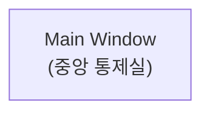
```mermaid
flowchart LR
    MW["Main Window<br/>(중앙 통제실)"]
```

##### PokerGFX 원본

**원본 캡쳐**

**오버레이 분석본**

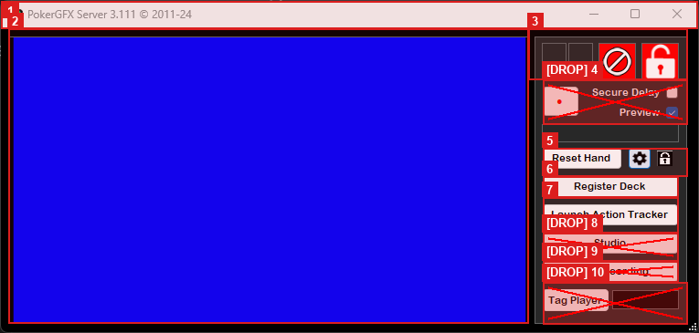

PokerGFX의 기본 화면. 좌측에 방송 Preview, 우측에 상태 표시와 액션 버튼이 배치된 2-column 레이아웃이다. 10개 UI 요소로 구성.

| # | 기능명 | 설명 | EBS 복제 |
|:-:|--------|------|:--------:|
| 1 | Title Bar | `PokerGFX Server 3.111 (c) 2011-24` 타이틀 + 최소/최대/닫기 버튼 | P2 |
| 2 | Preview | Chroma Key Blue 배경의 방송 미리보기 화면. GFX 오버레이가 실시간 렌더링됨 | P0 |
| 3 | CPU / GPU / Error / Lock | CPU, GPU 사용률 인디케이터 + Error 아이콘 + Lock 아이콘. 시스템 부하와 상태 실시간 모니터링 | P1 |
| 4 | Recording / Secure Delay / Preview | 3개 체크박스 행. Recording(녹화 토글), Secure Delay(방송 보안 딜레이 토글), Preview(미리보기 토글). | EBS MVP 범위 외 (추후 개발 예정) |
| 5 | Reset Hand | Reset Hand 버튼. 현재 핸드 데이터 초기화 + Settings 톱니바퀴 + Lock 자물쇠 | P0 |
| 6 | Register Deck | RFID 카드 덱 일괄 등록 버튼. 새 덱 투입 시 52장 순차 스캔 | P0 |
| 7 | Action Tracker | Action Tracker 실행 버튼. 운영자용 실시간 게임 추적 인터페이스 | P0 |
| 8 | Studio | Studio 모드 진입 버튼. 방송 스튜디오 환경 전환 | EBS MVP 범위 외 (추후 개발 예정) |
| 9 | Split Recording | 핸드별 분할 녹화 버튼. 각 핸드를 개별 파일로 자동 저장 | EBS MVP 범위 외 (추후 개발 예정) |
| 10 | Tag Player | 플레이어 태그 + 드롭다운. 특정 플레이어에 마커를 부여하여 추적 | EBS MVP 범위 외 (추후 개발 예정) |

> **설계 시사점**
> - Preview + 우측 컨트롤 패널 2-column 레이아웃은 운영 효율이 검증된 구조 → EBS 계승
> - RFID 상태(3번)가 CPU/GPU와 같은 행에 묻혀 존재감 약함 → EBS에서 독립 분리 (M-05)
> - 버튼 7개가 우선순위 구분 없이 균등 노출 → EBS에서 Quick Actions 그룹으로 재편
> - **EBS MVP 범위 외 (추후 개발 예정)**: Recording, Secure Delay(4번), Studio(8번), Split Recording(9번), Tag Player(10번) — Preview는 미리보기 항상 활성화 고정(토글 UI 제거)

##### EBS 설계본

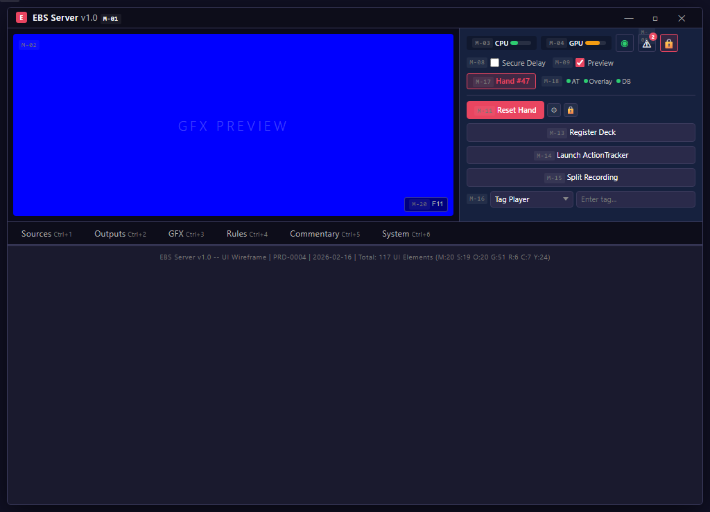

##### 설계 스펙

**변환 요약**: PokerGFX 10개 → EBS 15개. RFID Status 독립 분리, Hand Counter(M-17), Connection Status(M-18) 신규 추가. Recording·Secure Delay·Studio·Split Recording·Tag Player EBS MVP 범위 외 (추후 개발 예정). Preview 상시 활성화 고정(M-09 토글 제거). 2-column 레이아웃 계승.

시스템 모니터링과 긴급 조작을 담당하는 기본 화면. 본방송 중 운영자 주의력의 15%만 할당된다.

###### UI 설계 원칙

- **Preview Panel**: 480px 고정폭, 16:9 비율 자동 높이 (480×270). Chroma Key Blue(#0000FF) 배경에 GFX 오버레이 실시간 렌더링. CSS `aspect-ratio:16/9` 적용.
- **Control Panel**: 나머지 320px. 상단: 필수 상태 인디케이터(CPU/GPU/RFID). 중단: 자동 spacer(flex:1, ~60px). 하단: Quick Actions 버튼 3개. 수직 스크롤 없이 모든 요소가 보여야 한다.
- **앱 윈도우**: 800×365px 기준 (Title Bar 28px + Preview 270px + Status Bar 22px + Shortcut Bar 24px + Watermark 22px).
- **Status Bar**: 하단 1행. RFID 연결 상태, 현재 핸드 번호, AT/Overlay/DB 연결 상태를 점 인디케이터로 표시.
- **탭 없음**: Main Window는 독립 모니터링 화면. 각 설정 탭(Sources, Outputs, GFX, Rules, System)은 키보드 단축키(Ctrl+1~5)로 별도 창 접근.

###### 레이아웃

Preview Panel(M-02, 좌) + Status Panel(M-03~M-05, M-18, 우상) + Quick Actions(M-11~M-14, 우하).

###### Design Decisions

1. **Dual Canvas 모니터링이 Preview Panel(M-02)에 집중되는 이유**: 운영자가 방송 중 80% 이상 바라보는 화면이다. Venue/Broadcast Canvas의 상태 차이를 한 곳에서 확인하여 Hidden Information Problem이 정상 작동하는지 즉시 판단 가능하다.

2. **Quick Actions(M-11~M-14)가 메인에 노출되는 이유**: Reset Hand, Register Deck, Launch AT는 즉각적 반응이 필요하므로 메인 화면에 상주한다.

###### Workflow

**시나리오 A: 방송 전 준비**
1. 앱 실행 → Preview 상태 확인 (M-02)
2. RFID Status (M-05) 확인 → Green이면 다음 단계
3. Ctrl+5 → System 탭: RFID 캘리브레이션
4. Ctrl+1~4 → 각 탭 설정 완료
5. M-13 Register Deck → 새 덱 등록
6. F8 / M-14 → Action Tracker 실행

**시나리오 B: 긴급 복구 (본방송 중)**
1. RFID 빨간색 → M-05 상태 상세 확인
2. M-11 Reset Hand → 현재 핸드 초기화 (확인 다이얼로그)
3. 문제 지속 시 → Ctrl+5 → Y-03 Reset → 캘리브레이션 재실행

**시나리오 C: 덱 교체**
1. 핸드 종료 확인 (Action Tracker)
2. M-13 Register Deck 클릭
3. 52장 순차 스캔 완료 (1/52 ~ 52/52)
4. Preview에서 새 덱 인식 확인

###### Element Catalog

###### 상태 표시 그룹

| # | 요소 | 타입 | 설명 | PGX | 우선순위 |
|:-:|------|------|------|:---:|:--------:|
| M-01 | Title Bar | AppBar | 앱 이름 + 버전 + 윈도우 컨트롤 | #1 | P2 |
| M-02 | Preview Panel | Canvas | 출력 해상도(O-01)와 동일한 종횡비 유지, Chroma Key Blue, GFX 오버레이 실시간 렌더링. **해상도 정책**: 실제 출력은 Full HD(1920×1080) 기준 리사이징. 문서 표기(480×270)는 UI 공간 내 표시 크기로 가독성용 축약 표기. | #2 | P0 |
| M-03 | CPU Indicator | ProgressBar | CPU 사용률 + 색상 코딩 (Green<60%, Yellow<85%, Red>=85%) | #3 | P1 |
| M-04 | GPU Indicator | ProgressBar | GPU 사용률 + 색상 코딩 | #3 | P1 |
| M-05 | RFID Status | Icon+Badge | Green=Connected, Red=Disconnected, Yellow=Calibrating | #3 | P0 |
| M-06 | RFID Connection Icon | Icon | RFID 연결 상태 표시 (연결 시 녹색 USB/WiFi 아이콘으로 변경, 미연결 시 경고 아이콘) | #3 | P1 |
| M-17 | Hand Counter | Badge | 현재 세션 핸드 번호 (Hand #47) | 신규 | P0 |
| M-18 | Connection Status | Row | AT/Overlay/DB 각각 Green/Red 표시 | 신규 | P0 |

####### M-02 Preview Panel 해상도 스케일링 스펙

| 조건 | Preview 동작 |
|------|-------------|
| 출력 해상도(O-01) = 16:9 (기본) | Preview 캔버스 크기: `UI_Panel_Width × 9/16` |
| 출력 해상도(O-01) = 9:16 (세로 모드) | Preview 캔버스 크기: `UI_Panel_Height × 9/16` |
| 출력 해상도 변경 시 | 블랙아웃 없이 즉시 비율 재계산 및 리스케일 |
| 4K 출력 (3840×2160) | Preview는 UI 공간 내 최대 크기로 표시 (업스케일 없음, 고밀도 픽셀 그대로 표시) |
| SD 480p (854×480) 출력 | Preview는 실제 픽셀 크기 또는 2× 확대 표시 (픽셀이 너무 작아 식별 불가 방지) |

Preview는 항상 출력 해상도의 종횡비를 유지한다. Preview 캔버스 자체의 픽셀 밀도는 UI 공간 크기에 따라 결정되며, 출력 해상도와 1:1 대응하지 않는다.

###### 보안 제어 그룹

| # | 요소 | 타입 | 설명 | PGX | 우선순위 |
|:-:|------|------|------|:---:|:--------:|
| M-07 | Lock Toggle | IconButton | 설정 잠금/해제. 잠금 시 Quick Actions 외 모든 탭 설정 변경 불가 (본방송 중 실수 방지) | #3 | P1 |
| M-09 | Preview Toggle | Checkbox | Preview 렌더링 On/Off (CPU 절약) | #4 | P0 |

###### Quick Actions 그룹

| # | 요소 | 타입 | 설명 | PGX | 우선순위 |
|:-:|------|------|------|:---:|:--------:|
| M-11 | Reset Hand | ElevatedButton | 현재 핸드 초기화, 확인 다이얼로그 | #5 | P0 |
| M-12 | Settings | IconButton | 전역 설정 다이얼로그 (테마, 언어, 단축키) | #5 | P1 |
| M-13 | Register Deck | ElevatedButton | 52장 RFID 일괄 등록, 진행 다이얼로그 | #6 | P0 |
| M-14 | Launch AT | ElevatedButton | Action Tracker 실행/포커스 전환 | #7 | P0 |
| M-20 | Fullscreen Preview | IconButton | Preview 전체 화면 (F11) | 신규 | P2 |

###### Interaction Patterns

| 조작 | 시스템 반응 | 피드백 |
|------|-----------|--------|
| M-07 Lock Toggle | 잠금 시: 탭 비활성, Lock 아이콘 빨간색 | 설정 변경 시도 → "잠금 해제 후 가능" 툴팁 |
| M-11 Reset Hand | 확인 다이얼로그 → 핸드 초기화 | Preview 초기화, Hand# 리셋 |
| M-12 Settings | 전역 설정 다이얼로그 열림 | 테마/언어/단축키 변경 가능 |
| M-13 Register Deck | 52장 순차 스캔 다이얼로그 | 1/52~52/52 진행 표시 |
| M-14 Launch AT | AT 프로세스 실행 + 포커스 전환 | M-18 AT 표시등 Green으로 변경 |
| M-20 Fullscreen Preview | Preview 전체 화면 전환 | ESC로 복귀 |

###### 에러 상태 (Main Window 특화)

| 에러 유형 | 표시 위치 | 시각 피드백 | 복구 액션 |
|----------|----------|-----------|---------|
| RFID 미연결 | M-05 | Red 아이콘 + 경고음 | Ctrl+5 → Y-03 Reset |
| AT 연결 끊김 | M-18 | AT 표시등 Red | M-14 재실행 |
| Preview 멈춤 | M-02 | 마지막 프레임 고정 + 테두리 빨간색 | M-09 Preview 토글 재시작 |
| Hand Counter 불일치 | M-17 | 숫자 빨간색 표시 | M-11 Reset Hand |

###### Navigation

| 목적지 | 방법 | 조건 |
|--------|------|------|
| Sources~System 탭 | Ctrl+1~5 또는 탭 클릭 | 항상 |
| Skin Editor | GFX 탭 > 스킨 선택 영역 | 별도 창 |
| ActionTracker | F8 또는 M-14 | 별도 앱 실행 |
| Preview 전체 화면 | F11 또는 M-20 | ESC로 복귀 |

#### Step 2: Rules — 게임의 문법

같은 포커라도 게임마다 규칙이 다르다. Bomb Pot이 있는 게임에서는 프리플롭 베팅이 없고, Straddle이 허용되면 블라인드 구조가 달라진다. 규칙이 달라지면 그래픽도 달라지므로, 운영자는 **Rules**(Ctrl+4)에서 게임 규칙을 먼저 정의해야 한다.

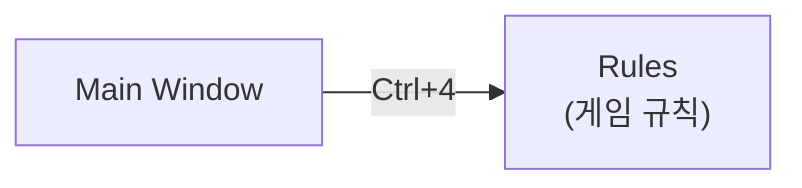
```mermaid
flowchart LR
    MW["Main Window"] -->|"Ctrl+4"| RUL["Rules<br/>(게임 규칙)"]
```

##### PokerGFX 원본

PokerGFX에는 독립 Rules 탭이 없다. 게임 규칙(Bomb Pot, Straddle 등)은 GFX 2 탭의 #8~#11, #14, #21에 표시 설정과 섞여 있었다.

**원본 캡쳐** (GFX 2 탭)

**오버레이 분석본**

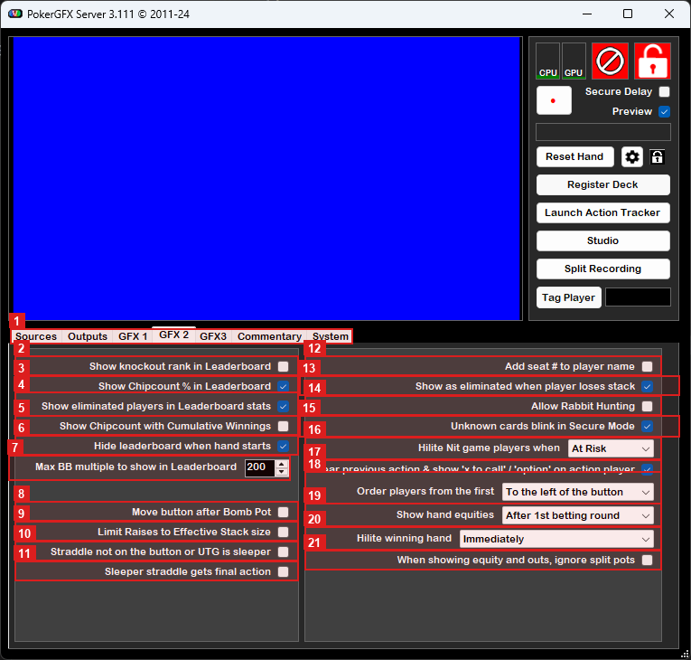

##### EBS 설계본

##### 설계 스펙

###### 분리 근거

| GFX 2 # | 기능명 | 성격 | EBS 배치 |
|:--------:|--------|------|----------|
| #8 | Move Button Bomb Pot | 게임 규칙 | → Rules R-01 |
| #9 | Limit Raises | 게임 규칙 | → Rules R-02 |
| #10 | Straddle Sleeper | 게임 규칙 | → Rules R-04 |
| #11 | Sleeper Final Action | 게임 규칙 | → Rules R-05 |
| #14 | Allow Rabbit Hunting | 게임 규칙 | → Rules R-03 |
| #21 | Ignore Split Pots | 계산 규칙 | → Rules R-06 |

> **설계 시사점**
> - 게임 규칙은 Game Engine의 행동을 결정하고, GFX Display는 시각적 출력을 결정한다
> - 변경 빈도와 영향 범위가 다르므로 독립 탭으로 분리
> - 대부분 기본값으로 운영되며 특수 게임 형식에서만 변경

**변환 요약**: GFX 2에서 게임 규칙 6개를 추출하여 독립 탭으로 구성. 모든 요소 P1 (기본값 운영).

게임 규칙(Bomb Pot, Straddle 등)과 특수 상황 설정.

###### Design Decisions

1. **GFX 2에서 분리한 이유**: 규칙은 Game Engine의 행동을 결정하고, GFX Display는 시각적 출력을 결정한다. 변경 빈도와 영향 범위가 다르므로 독립 탭으로 분리했다.

2. **모든 요소가 P1인 이유**: 대부분의 방송에서 기본값으로 운영된다. 특수 규칙은 특정 게임 형식에서만 활성화되므로 P0이 아닌 P1로 분류했다.

###### Workflow

게임 규칙 설정은 독립적이며 순서가 없다. 필요한 규칙만 확인/변경한다.

###### Element Catalog

| # | 요소 | 설명 | PGX | 우선순위 |
|:-:|------|------|:---:|:--------:|
| R-01 | Move Button Bomb Pot | 봄팟 후 버튼 이동 | GFX2 #8 | P1 |
| R-02 | Limit Raises | 유효 스택 기반 레이즈 제한 | GFX2 #9 | P1 |
| R-03 | Allow Rabbit Hunting | 래빗 헌팅 허용 | GFX2 #14 | P1 |
| R-04 | Straddle Sleeper | 스트래들 위치 규칙 | GFX2 #10 | P1 |
| R-05 | Sleeper Final Action | 슬리퍼 최종 액션 | GFX2 #11 | P1 |
| R-06 | Ignore Split Pots | Equity/Outs에서 Split pot 무시 | GFX2 #21 | P1 |

###### Navigation

| 목적지 | 방법 | 조건 |
|--------|------|------|
| GFX 탭 | Ctrl+3 | 규칙과 연동되는 표시 설정 확인 |
| Main Window | 탭 영역 외 클릭 | 설정 완료 후 |

#### Step 3: System — 하드웨어 연결 확인

RFID가 카드를 읽으려면 리더가 연결되고 캘리브레이션이 완료되어야 한다. 하드웨어 점검 없이 본방송을 시작하면 중간에 카드 인식이 안 되는 사고가 발생한다. **System**(Ctrl+5)에서 RFID 리더 상태, 네트워크 연결, 테이블 디바이스를 점검한다.

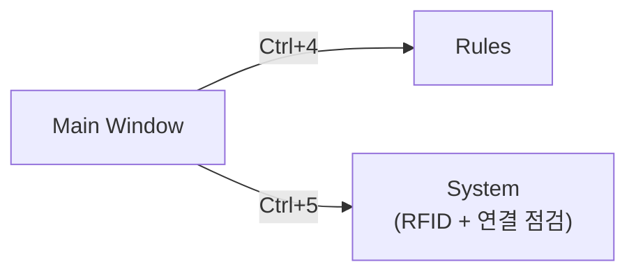
```mermaid
flowchart LR
    MW["Main Window"] -->|"Ctrl+4"| RUL["Rules"]
    MW -->|"Ctrl+5"| SYS["System<br/>(RFID + 연결 점검)"]
```

##### PokerGFX 원본

**원본 캡쳐**

**오버레이 분석본**

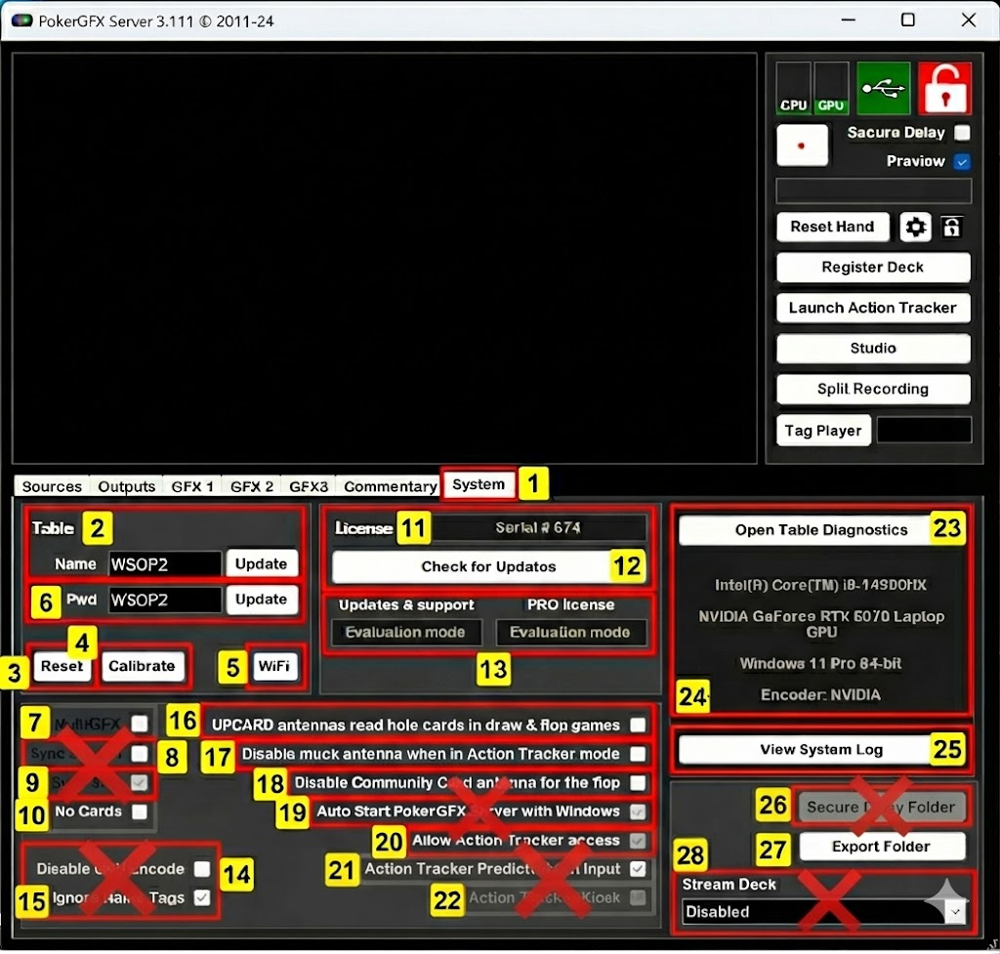

RFID 리더, 안테나, 라이선스, 시스템 진단, 고급 설정을 관리하는 탭. 28개 UI 요소로 구성.

> **설계 시사점**
> - RFID 안테나(22~24번)가 하단에 배치되어 있으나, 실제로는 방송 준비의 첫 번째 설정임 → EBS에서 상단 이동 (Y-03~Y-07)
> - 라이선스 관련 4개(6~9번)는 EBS 자체 시스템에서 불필요 → 제거
> - AT 접근 정책이 다른 설정과 혼재 → EBS에서 독립 그룹 (Y-13~Y-15)

##### EBS 설계본

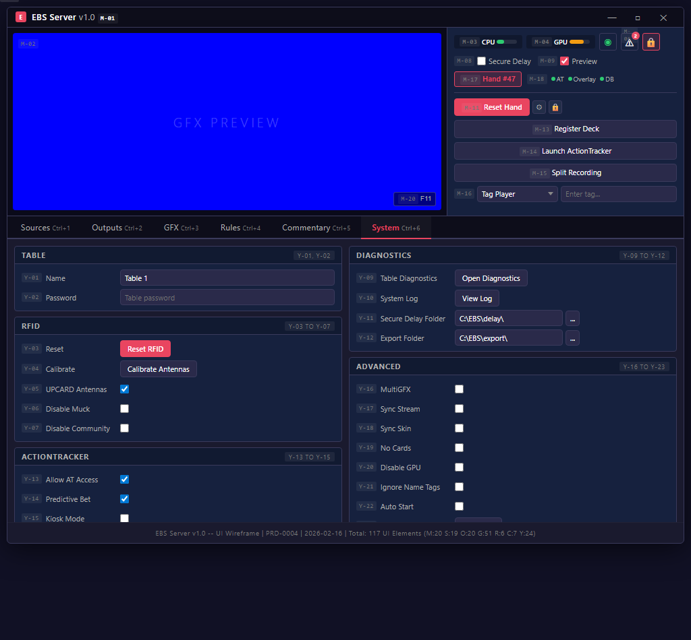

##### 설계 스펙

**변환 요약**: PokerGFX 28개 → EBS 24개. RFID를 상단으로 이동 (준비 첫 단계), 라이선스 4개 제거, AT 접근 정책 독립 그룹화.

RFID, Action Tracker 연결, 시스템 진단.

###### 레이아웃

4구역: RFID(Y-03~Y-07, 상단) > AT(Y-13~Y-15) > Diagnostics(Y-08~Y-12) > Advanced(Y-16~Y-24).

###### Design Decisions

1. **RFID 캘리브레이션이 방송 준비 첫 단계인 이유**: 캘리브레이션 없이 다른 설정을 진행하면 테스트 핸드에서 카드 오인식이 발생한다. 따라서 하드웨어 점검 -> RFID 캘리브레이션을 최우선으로 배치했다.

2. **AT 접근 정책(Y-13~Y-15)이 이 탭에 있는 이유**: ActionTracker는 딜러가 사용하는 별도 장치이므로 보안 설정이 필요하다. Kiosk Mode(Y-15)는 딜러의 불필요한 기능 접근을 제한한다.

3. **Advanced 그룹(Y-16~Y-23)이 별도 섹션인 이유**: MultiGFX, Stream Deck 매핑 등은 대부분 변경하지 않는다. 자주 사용하는 RFID/Diagnostics 설정과 시각적으로 분리하여 실수를 방지한다.

###### Workflow

RFID 리셋/캘리브레이션 -> 안테나 설정 -> AT 접근 정책 -> 진단 확인 -> 고급 설정.

###### Element Catalog

| # | 그룹 | 요소 | 설명 | PGX | 우선순위 |
|:-:|------|------|------|:---:|:--------:|
| Y-01 | Table | Name | 테이블 식별 이름 | #2 | P1 |
| Y-02 | Table | Password | 접속 비밀번호 | #3 | P1 |
| Y-03 | RFID | Reset | RFID 시스템 초기화 | #4 | P0 |
| Y-04 | RFID | Calibrate | 안테나별 캘리브레이션 | #5 | P0 |
| Y-05 | RFID | UPCARD Antennas | UPCARD 안테나로 홀카드 읽기 | #22 | P0 |
| Y-06 | RFID | Disable Muck | AT 모드 시 muck 안테나 비활성 | #23 | P0 |
| Y-07 | RFID | Disable Community | 커뮤니티 카드 안테나 비활성 | #24 | P0 |
| Y-08 | System Info | Hardware Panel | CPU/GPU/OS/Encoder 자동 감지 | #11 | P1 |
| Y-09 | Diagnostics | Table Diagnostics | 안테나별 상태, 신호 강도 (별도 창) | #10 | P1 |
| Y-10 | Diagnostics | System Log | 로그 뷰어 | #12 | P1 |
| Y-12 | Diagnostics | Export Folder | 내보내기 폴더 | #14 | P1 |
| Y-13 | AT | Allow AT Access | AT 접근 허용 | #26 | P0 |
| Y-14 | AT | Predictive Bet | 베팅 예측 입력 | #27 | P0 |
| Y-15 | AT | Kiosk Mode | AT 키오스크 모드 | #28 | P0 |
| Y-16 | Advanced | MultiGFX | 다중 테이블 운영 | #16 | P2 |
| Y-17 | Advanced | Sync Stream | 스트림 동기화 | #17 | P2 |
| Y-18 | Advanced | Sync Skin | 스킨 동기화 | #18 | P2 |
| Y-19 | Advanced | No Cards | 카드 비활성화 | #19 | P1 |
| Y-20 | Advanced | Disable GPU | GPU 인코딩 비활성화 | #20 | P1 |
| Y-21 | Advanced | Ignore Name Tags | 네임 태그 무시 | #21 | P1 |
| Y-22 | Advanced | Auto Start | OS 시작 시 자동 실행 | 신규 | P2 |
| Y-23 | Advanced | Stream Deck | Elgato Stream Deck 매핑 | #15 | P2 |
| Y-24 | Updates | Version + Check | 버전 표시 + 업데이트 | #7,#8 | P2 |

###### Interaction Patterns

| 조작 | 시스템 반응 | 피드백 |
|------|-----------|--------|
| Y-03 Reset 클릭 | RFID 시스템 재초기화 | M-05 상태 변화 (Yellow -> Green/Red) |
| Y-04 Calibrate 클릭 | 안테나별 캘리브레이션 시작 | 진행률 + 안테나별 결과 |
| Y-09 Table Diagnostics | 별도 창 열림 | 안테나 신호 강도 실시간 표시 |

###### Navigation

| 목적지 | 방법 | 조건 |
|--------|------|------|
| Table Diagnostics | Y-09 클릭 | 별도 창 열림 |
| Main Window | 탭 영역 외 클릭 | RFID 설정 완료 후 |
| Sources 탭 | Ctrl+1 | RFID 후 비디오 설정으로 이동 |

#### Step 4: Action Tracker — 게임 진행 실시간 입력

규칙이 정의되고 하드웨어가 준비되면 본방송이 시작된다. RFID가 카드를 자동으로 읽고, 운영자가 베팅 금액과 액션을 수동으로 입력한다. 본방송 주의력의 85%가 여기에 집중된다. **Action Tracker**(F8)가 별도 앱인 이유는 터치에 최적화된 인터페이스가 필요하고, 실수로 Main Window 설정을 건드리는 것을 방지해야 하기 때문이다.

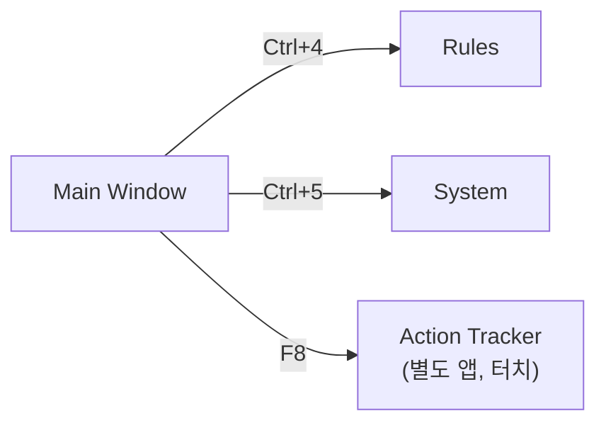
```mermaid
flowchart LR
    MW["Main Window"] -->|"Ctrl+4"| RUL["Rules"]
    MW -->|"Ctrl+5"| SYS["System"]
    MW -->|"F8"| AT["Action Tracker<br/>(별도 앱, 터치)"]
```

#### Step 5: GFX — 규칙 + 입력 → 그래픽 생성

규칙이 정의되고 데이터가 입력되면, 이를 시각적으로 표현해야 한다. **GFX**(Ctrl+3)는 가장 복잡한 영역이라 하나의 화면으로는 부족하다. "어디에 배치할지"(Layout), "어떤 연출로"(Visual), "무엇을 표시할지"(Display), "숫자를 어떤 형식으로"(Numbers) — 이 네 가지는 서로 다른 작업이므로 4개 서브탭으로 분리된다.

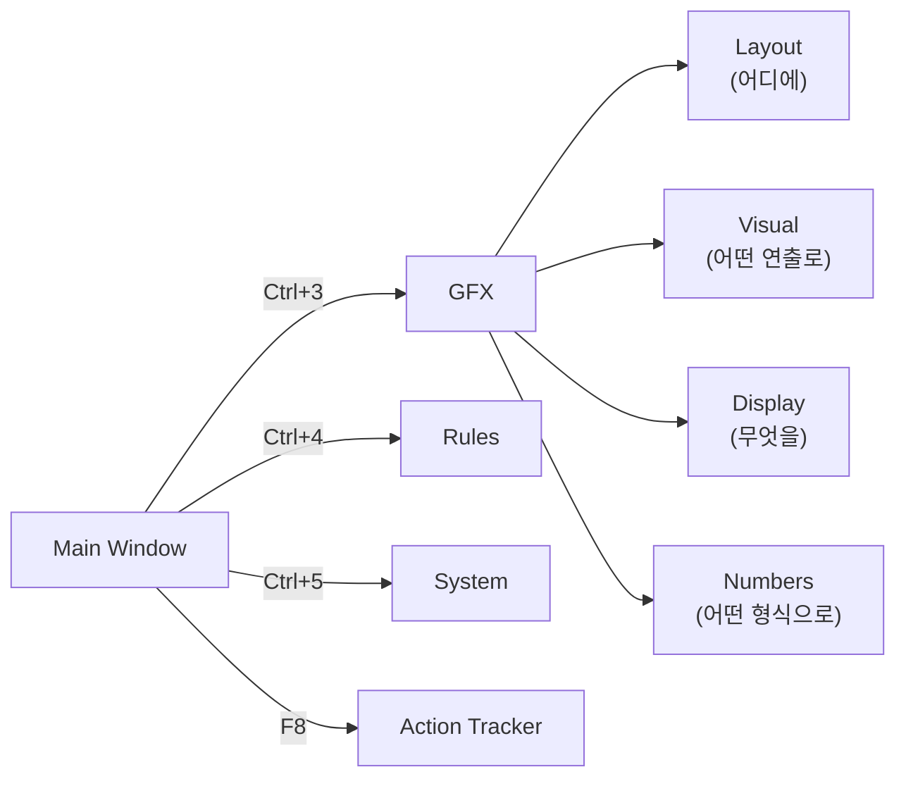
```mermaid
flowchart LR
    MW["Main Window"] -->|"Ctrl+3"| GFX["GFX"]
    GFX --> LAY["Layout<br/>(어디에)"]
    GFX --> VIS["Visual<br/>(어떤 연출로)"]
    GFX --> DIS["Display<br/>(무엇을)"]
    GFX --> NUM["Numbers<br/>(어떤 형식으로)"]
    MW -->|"Ctrl+4"| RUL["Rules"]
    MW -->|"Ctrl+5"| SYS["System"]
    MW -->|"F8"| AT["Action Tracker"]
```

##### PokerGFX 원본: GFX 1/2/3

PokerGFX는 GFX 설정을 3개 탭에 걸쳐 73개 요소로 분산했다. 기능이 추가되면서 자연 발생한 구조이며, 논리적 분류 기준이 일관되지 않는다.

**GFX 1** (29개 요소) — 레이아웃, 연출, 스킨, 스폰서, 마진이 혼재

**원본 캡쳐**

**오버레이 분석본**

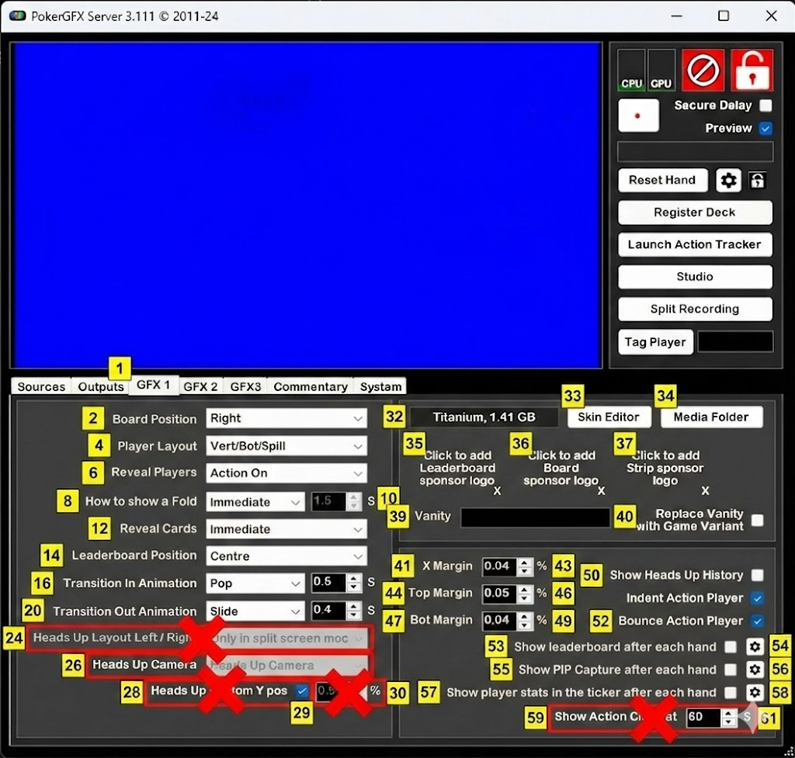

**GFX 2** (21개 요소) — 리더보드, 게임 규칙, 표시 설정이 혼재

**원본 캡쳐**

**오버레이 분석본**

**GFX 3** (23개 요소) — 수치 형식 위주, 가장 응집도 높음

**원본 캡쳐**

**오버레이 분석본**

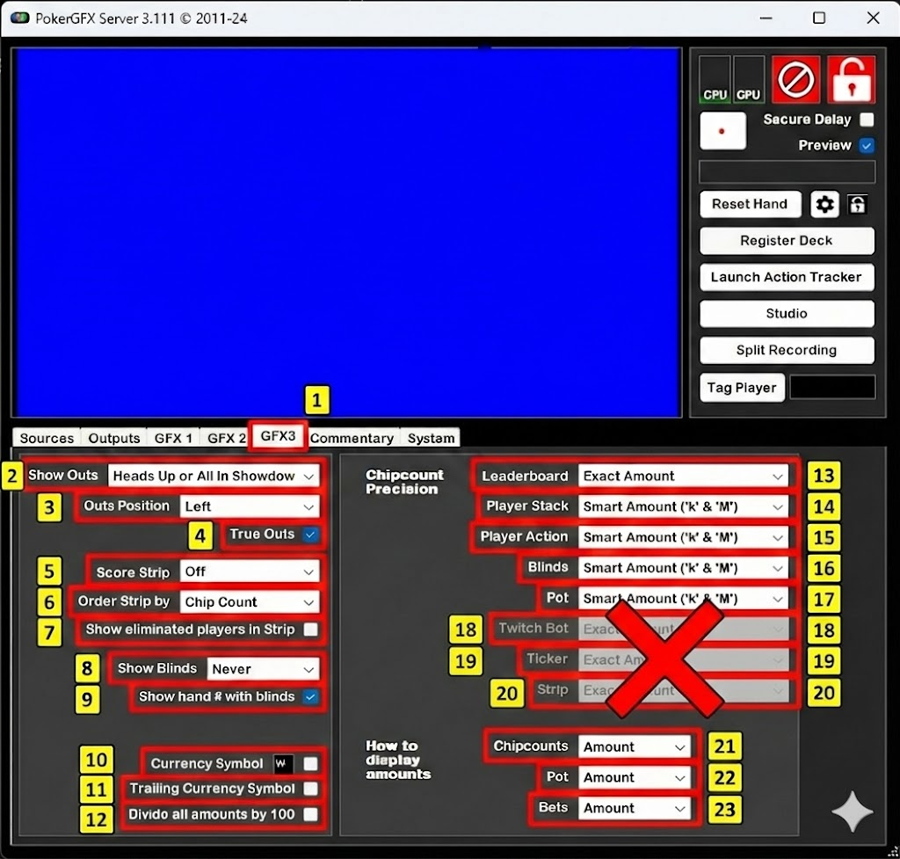

##### EBS 설계본

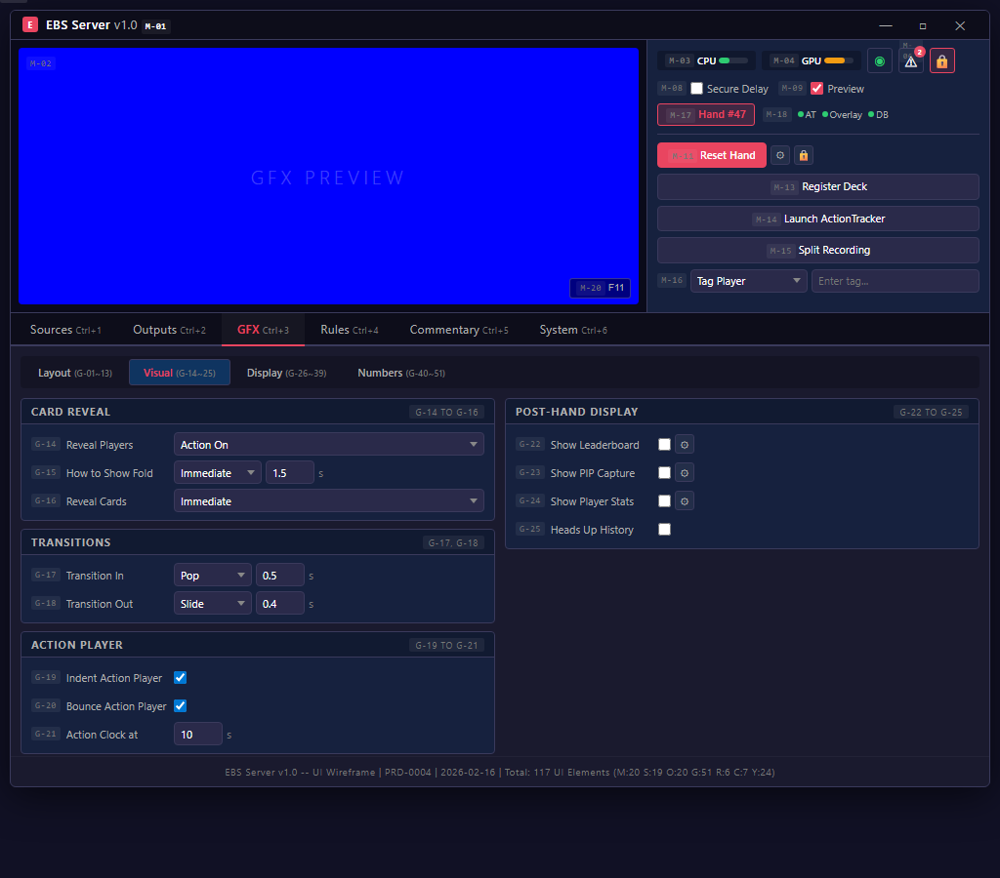

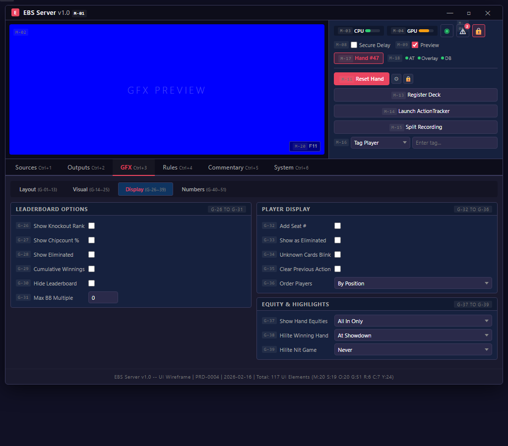

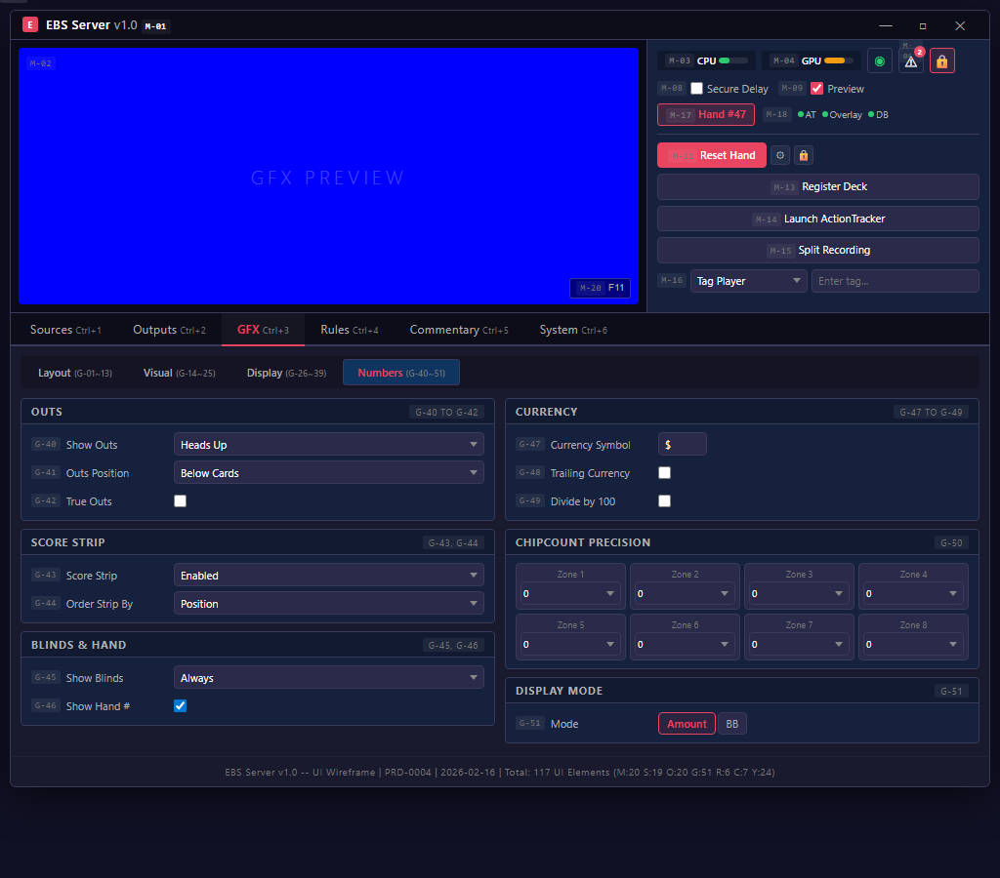

##### 설계 스펙

###### 분석: 재편이 필요한 이유

GFX 1에 Board Position(배치)과 Reveal Cards(연출)이 같은 탭에 있다. GFX 2에 Show Chipcount %(표시 설정)와 Move Button Bomb Pot(게임 규칙)이 같은 탭에 있다. 변경 빈도와 영향 범위가 다른 설정이 섞여 있으면 라이브 중 오조작 위험이 높아진다.

> **재편 원칙**: 운영자의 작업 흐름을 기준으로 분류한다.
> - **"어디에"**(Layout): 보드 위치, 플레이어 배치, 마진, 스킨
> - **"어떤 연출로"**(Visual): 카드 공개 방식, Transition, 액션 플레이어 효과
> - **"무엇을"**(Display): 통계, 리더보드, Equity, 승자 강조
> - **"어떤 형식으로"**(Numbers): 통화 기호, 정밀도, BB 표시, 블라인드
>
> GFX 2의 게임 규칙 6개(#8~#11, #14, #21)는 **Rules 탭**으로 독립 분리.

**변환 결과**: 73개 → 51개(GFX) + 6개(Rules). 중복 제거와 배제로 -16개.

###### EBS GFX 탭 구조 개요

GFX 탭은 PokerGFX 원본의 GFX1/2/3을 **Layout/Visual/Display/Numbers** 4개 서브탭으로 재편한 것이다.

###### GFX 서브탭 매핑

| 서브탭 | 원본 대응 | 주요 기능 |
|--------|----------|----------|
| **Layout** | GFX1 일부 | 카드 위치, 플레이어 배치, 스킨 선택 |
| **Visual** | GFX1 일부 + GFX2 일부 | 카드 공개 방식, 리더보드, 스폰서 |
| **Display** | GFX2 + GFX3 일부 | 통계 표시, 방송 오버레이 |
| **Numbers** | GFX3 일부 | 승률, Outs, 위닝 핸드 |

###### Design Decisions

1. **GFX 1/2/3을 단일 탭(4개 서브 섹션)으로 통합한 이유**: PokerGFX의 GFX 1/2/3은 기능 추가 과정의 산물이었다. EBS에서는 기능적 분류(Layout/Visual/Display/Numbers)로 재편하여 "어디에, 어떤 연출로, 무엇을, 어떤 형식으로"라는 자연스러운 작업 순서를 따른다.

2. **Global vs Local 설정 영향 범위를 명시한 이유**: Board Position(G-01)이나 Currency Symbol(G-47)을 변경하면 모든 출력 채널에 즉시 반영된다(Global). 반면 Sponsor Logo(G-10~G-12)는 해당 요소만 영향받는다(Local). 라이브 중 Global 설정 변경은 방송 사고 위험이 있다.

3. **Skin Editor/Graphic Editor가 별도 창인 이유**: GFX 탭은 "런타임 설정", Skin/Graphic Editor는 "디자인 편집"이다. 편집 작업은 시간이 걸리고 실시간 프리뷰가 필요하므로 별도 창에서 작업한다.

###### Workflow

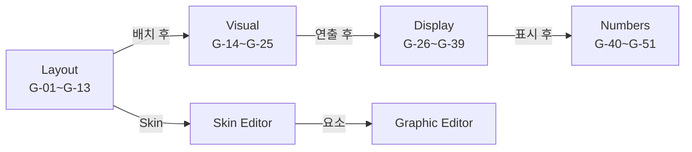
```mermaid
flowchart LR
    L["Layout<br/>G-01~G-13"] -->|"배치 후"| V["Visual<br/>G-14~G-25"]
    V -->|"연출 후"| D["Display<br/>G-26~G-39"]
    D -->|"표시 후"| N["Numbers<br/>G-40~G-51"]
    L -->|"Skin"| SKE["Skin Editor"] -->|"요소"| GRE["Graphic Editor"]
```

###### Layout 서브탭

###### GFX 좌표계 원칙

EBS GFX의 위치/크기 값은 두 가지 단위 체계가 혼재한다. 구현 시 혼동 방지를 위해 명확히 구분한다.

| 단위 | 범위 | 사용 항목 | 해상도 변경 시 처리 |
|------|------|----------|------------------|
| 정규화 좌표 (float) | 0.0 ~ 1.0 | Margin % (G-03~G-05). 예: 0.04 = 4% | 변환 불필요. `margin_pixel = margin_normalized × output_width` |
| 기준 픽셀 (int) | 0 ~ 1920 또는 0 ~ 1080 | Graphic Editor LTWH. Design Resolution 기준 | 스케일 팩터 자동 적용. 예: 1080p L=100 → 4K L=200 |

Margin(G-03~G-05)은 이미 정규화 좌표(올바른 설계)이므로 변경하지 않는다. Graphic Editor LTWH는 기준 해상도(Design Resolution) 기준 픽셀이며, 출력 해상도 변경 시 스케일 팩터가 자동 적용된다.

###### Element Catalog

| # | 요소 | 타입 | 설명 | PGX | 우선순위 |
|:-:|------|------|------|:---:|:--------:|
| G-01 | Board Position | Dropdown | 보드 카드 위치 (Left/Right/Centre/Top) | GFX1 #2 | P0 |
| G-02 | Player Layout | Dropdown | 플레이어 배치 (Vert/Bot/Spill) | GFX1 #3 | P0 |
| G-03 | X Margin | NumberInput | 좌우 여백 (%, 기본 0.04) | GFX1 #20 | P1 |
| G-04 | Top Margin | NumberInput | 상단 여백 (%, 기본 0.05) | GFX1 #21 | P1 |
| G-05 | Bot Margin | NumberInput | 하단 여백 (%, 기본 0.04) | GFX1 #22 | P1 |
| G-06 | Leaderboard Position | Dropdown | 리더보드 위치 | GFX1 #7 | P1 |
| G-07 | Heads Up Layout L/R | Dropdown | 헤즈업 화면 분할 배치 | GFX1 #10 | P1 |
| G-08 | Heads Up Camera | Dropdown | 헤즈업 카메라 위치 | GFX1 #11 | P1 |
| G-09 | Heads Up Custom Y | Checkbox+NumberInput | Y축 미세 조정 | GFX1 #12 | P1 |
| G-10 | Sponsor Logo 1 | ImageSlot | Leaderboard 스폰서 | GFX1 #16 | P2 |
| G-11 | Sponsor Logo 2 | ImageSlot | Board 스폰서 | GFX1 #17 | P2 |
| G-12 | Sponsor Logo 3 | ImageSlot | Strip 스폰서 | GFX1 #18 | P2 |
| G-13 | Vanity Text | TextField+Checkbox | 테이블 텍스트 + Game Variant 대체 | GFX1 #19 | P2 |

###### Visual 서브탭

###### Element Catalog

| # | 요소 | 타입 | 설명 | PGX | 우선순위 |
|:-:|------|------|------|:---:|:--------:|
| G-14 | Reveal Players | Dropdown | 카드 공개 시점 (Always/Action On/Never) | GFX1 #4 | P0 |
| G-15 | How to Show Fold | Dropdown+NumberInput | 폴드 표시 (Immediate/Fade + 시간) | GFX1 #5 | P0 |
| G-16 | Reveal Cards | Dropdown | 카드 공개 연출 (Immediate/Animated) | GFX1 #6 | P0 |
| G-17 | Transition In | Dropdown+NumberInput | 등장 애니메이션 + 시간 | GFX1 #8 | P1 |
| G-18 | Transition Out | Dropdown+NumberInput | 퇴장 애니메이션 + 시간 | GFX1 #9 | P1 |
| G-19 | Indent Action Player | Checkbox | 액션 플레이어 들여쓰기 | GFX1 #24 | P1 |
| G-20 | Bounce Action Player | Checkbox | 액션 플레이어 바운스 | GFX1 #25 | P1 |
| G-21 | Action Clock | NumberInput | 카운트다운 임계값 (초) | GFX1 #29 | P0 |
| G-22 | Show Leaderboard | Checkbox+Settings | 핸드 후 리더보드 자동 표시 | GFX1 #26 | P1 |
| G-23 | Show PIP Capture | Checkbox+Settings | 핸드 후 PIP 표시 | GFX1 #27 | P1 |
| G-24 | Show Player Stats | Checkbox+Settings | 핸드 후 티커 통계 | GFX1 #28 | P1 |
| G-25 | Heads Up History | Checkbox | 헤즈업 히스토리 | GFX1 #23 | P1 |

###### Display 서브탭

###### Element Catalog

| # | 요소 | 타입 | 설명 | PGX | 우선순위 |
|:-:|------|------|------|:---:|:--------:|
| G-26 | Show Knockout Rank | Checkbox | 녹아웃 순위 | GFX2 #2 | P1 |
| G-27 | Show Chipcount % | Checkbox | 칩카운트 퍼센트 | GFX2 #3 | P1 |
| G-28 | Show Eliminated | Checkbox | 탈락 선수 표시 | GFX2 #4 | P1 |
| G-29 | Cumulative Winnings | Checkbox | 누적 상금 | GFX2 #5 | P1 |
| G-30 | Hide Leaderboard | Checkbox | 핸드 시작 시 숨김 | GFX2 #6 | P1 |
| G-31 | Max BB Multiple | NumberInput | BB 배수 상한 | GFX2 #7 | P1 |
| G-32 | Add Seat # | Checkbox | 좌석 번호 추가 | GFX2 #12 | P1 |
| G-33 | Show as Eliminated | Checkbox | 스택 소진 시 탈락 | GFX2 #13 | P1 |
| G-34 | Unknown Cards Blink | Checkbox | 미확인 카드 깜빡임 | GFX2 #15 | P1 |
| G-35 | Clear Previous Action | Checkbox | 이전 액션 초기화 | GFX2 #17 | P1 |
| G-36 | Order Players | Dropdown | 플레이어 정렬 순서 | GFX2 #18 | P1 |
| G-37 | Show Hand Equities | Dropdown | Equity 표시 시점 | GFX2 #19 | P0 |
| G-38 | Hilite Winning Hand | Dropdown | 위닝 핸드 강조 시점 | GFX2 #20 | P0 |
| G-39 | Hilite Nit Game | Dropdown | 닛 게임 강조 조건 | GFX2 #16 | P1 |

###### Numbers 서브탭

###### Element Catalog

| # | 요소 | 타입 | 설명 | PGX | 우선순위 |
|:-:|------|------|------|:---:|:--------:|
| G-40 | Show Outs | Dropdown | 아웃츠 조건 (Heads Up/All In/Always) | GFX3 #2 | P1 |
| G-41 | Outs Position | Dropdown | 아웃츠 위치 | GFX3 #3 | P1 |
| G-42 | True Outs | Checkbox | 정밀 아웃츠 계산 | GFX3 #4 | P1 |
| G-43 | Score Strip | Dropdown | 하단 스코어 스트립 | GFX3 #5 | P1 |
| G-44 | Order Strip By | Dropdown | 스트립 정렬 기준 | GFX3 #6 | P1 |
| G-45 | Show Blinds | Dropdown | 블라인드 표시 조건 | GFX3 #8 | P0 |
| G-46 | Show Hand # | Checkbox | 핸드 번호 표시 | GFX3 #9 | P0 |
| G-47 | Currency Symbol | TextField | 통화 기호 | GFX3 #10 | P0 |
| G-48 | Trailing Currency | Checkbox | 후치 통화 기호 | GFX3 #11 | P0 |
| G-49 | Divide by 100 | Checkbox | 금액 100분의 1 | GFX3 #12 | P0 |
| G-50 | Chipcount Precision | PrecisionGroup | 8개 영역별 수치 형식 | GFX3 #14-20 | P1 |
| G-51 | Display Mode | ModeGroup | Amount vs BB 전환 | GFX3 #22-23 | P1 |

###### Interaction Patterns

| 조작 | 시스템 반응 | 영향 범위 |
|------|-----------|-----------|
| G-01 Board Position 변경 | 보드 위치 즉시 반영 | Global -- 모든 출력 채널 |
| G-02 Player Layout 변경 | 플레이어 배치 즉시 반영 | Global |
| G-47 Currency Symbol 변경 | 모든 금액 표시 갱신 | Global |
| G-10~G-12 Sponsor Logo 변경 | 해당 로고만 교체 | Local -- 단일 요소 |
| G-17 Transition 변경 | 다음 전환부터 적용 | Local |

**Blast Radius**:

| 범위 | 설정 예시 | 라이브 중 변경 |
|------|-----------|:-----------:|
| Global (모든 출력) | Board Position, Player Layout, Currency | 주의 필요 |
| Channel (특정 출력) | Live 설정 | 안전 |
| Local (단일 요소) | Sponsor Logo, Vanity Text | 안전 |

###### Navigation

| 목적지 | 방법 | 조건 |
|--------|------|------|
| Skin Editor | 스킨 선택 영역 클릭 | 별도 창 열림 |
| Graphic Editor | Skin Editor > 요소 클릭 | Skin Editor 경유 |
| Rules 탭 | Ctrl+4 | 게임 규칙 확인 |

#### Step 6: Outputs — 출력 파이프라인

생성된 그래픽을 내보내야 한다. 그래픽이 어떤 장치로, 어떤 해상도와 프레임레이트로 나가는지를 설정해야 한다. Fill & Key 채널 매핑, 녹화, 스트리밍 설정도 이 탭에서 관리한다. **Outputs**(Ctrl+2)에서 출력 파이프라인을 구성한다.

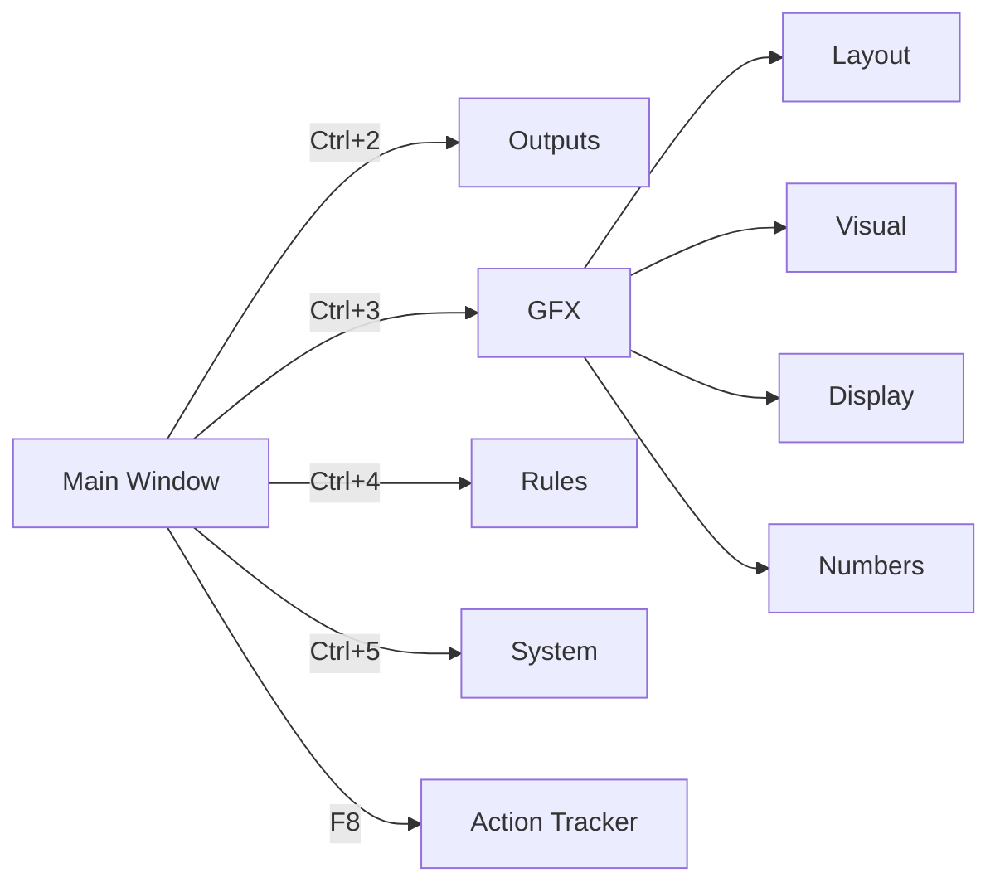
```mermaid
flowchart LR
    MW["Main Window"] -->|"Ctrl+2"| OUT["Outputs"]
    MW -->|"Ctrl+3"| GFX["GFX"]
    GFX --> LAY["Layout"] & VIS["Visual"] & DIS["Display"] & NUM["Numbers"]
    MW -->|"Ctrl+4"| RUL["Rules"]
    MW -->|"Ctrl+5"| SYS["System"]
    MW -->|"F8"| AT["Action Tracker"]
```

##### PokerGFX 원본

**원본 캡쳐**

**오버레이 분석본**

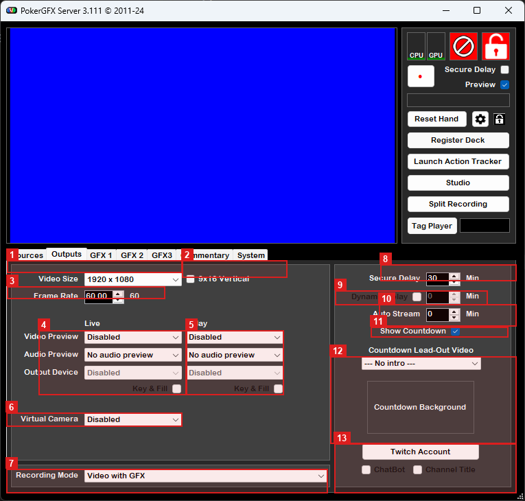

비디오 출력 해상도, Live/Delay 이중 파이프라인, 스트리밍을 관리하는 탭. 13개 UI 요소로 구성.

| # | 기능명 | 설명 | EBS 복제 |
|:-:|--------|------|:--------:|
| 1 | Video Size | 출력 해상도 (`1920 x 1080`) | P0 |
| 2 | 9x16 Vertical | 세로 모드 출력 (모바일/쇼츠) | P2 |
| 3 | Frame Rate | 출력 프레임레이트 (`60.00 -> 60`) | P0 |
| 4 | Live column | Live 출력 파이프라인 4개 설정 | P0 |
| 5 | Delay column | Delay 출력 파이프라인 (Live와 독립) | P0 |
| 6 | Virtual Camera | 가상 카메라 출력 | P2 |
| 7 | Recording Mode | 녹화 모드 (`Video with GFX`) | P1 |
| 8 | Dynamic Delay | 동적 딜레이 (상황별 자동 조절) | P1 |
| 10 | Auto Stream | 자동 스트리밍 시작 딜레이(분) | P2 |
| 11 | Show Countdown | 카운트다운 표시 | P1 |
| 12 | Countdown Video | 카운트다운 종료 시 재생 영상 | P2 |
| 13 | Twitch / ChatBot | Twitch 직접 연동 | P2 |

> **설계 시사점**
> - Live/Delay 2열 구조는 직관적이며 EBS 계승 가치 있음
> - Key & Fill(4~5번)의 DeckLink 포트 할당이 불명확 → EBS에서 O-18~O-20 Fill & Key 전용 섹션 신규

##### EBS 설계본

##### 설계 스펙

**변환 요약**: PokerGFX 13개 → EBS 20개. Fill & Key Channel Map(O-20), Key Color(O-18), Fill/Key Preview(O-19) 신규 추가. Live 단일 출력 구조. Delay 파이프라인은 추후 개발.

출력 파이프라인을 설정한다. Delay 이중 출력은 추후 개발 범위이며, 현재는 Live 단일 출력 구조로 설계한다.

###### 레이아웃

3구역: Resolution(O-01~O-03, 상단) > Live 출력(O-04~O-05) > Recording/Streaming/Fill&Key(O-14~O-20). Delay 파이프라인(O-06~O-07)은 추후 개발.

###### Design Decisions

1. **Venue/Broadcast가 독립 파이프라인인 이유**: Dual Canvas Architecture의 핵심. 두 파이프라인의 장치, 해상도, 프레임레이트가 독립적이어야 Hidden Information Problem을 하드웨어 수준에서 해결할 수 있다. (추후 개발: Delay 파이프라인 추가 시 적용)

2. **Fill & Key 채널 매핑(O-05, O-07, O-20)이 P0인 이유**: Fill(RGB)과 Key(Alpha)는 DeckLink 카드의 물리적 SDI/HDMI 포트에 매핑된다. 포트 할당 오류는 방송 화면 깨짐으로 직결된다.

###### Workflow

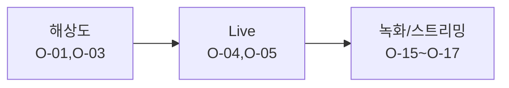
```mermaid
flowchart LR
    O1["해상도<br/>O-01,O-03"] --> O2["Live<br/>O-04,O-05"] --> O5["녹화/스트리밍<br/>O-15~O-17"]
```

###### Element Catalog

| # | 그룹 | 요소 | 설명 | PGX | 우선순위 |
|:-:|------|------|------|:---:|:--------:|
| O-01 | Resolution | Video Size | 1080p/4K 출력 해상도 | #1 | P0 |
| O-02 | Resolution | 9x16 Vertical | 세로 모드 (모바일) | #2 | P2 |
| O-03 | Resolution | Frame Rate | 30/60fps | #3 | P0 |
| O-04 | Live | Video/Audio/Device | Live 파이프라인 3개 드롭다운 | #4 | P0 |
| O-05 | Live | Key & Fill | Live Fill & Key 출력 (DeckLink 채널 할당) | #4 | P0 |
| O-06 | Delay | Video/Audio/Device | Delay 파이프라인 (Live와 독립) | #5 | Future |
| O-07 | Delay | Key & Fill | Delay Fill & Key 출력 (DeckLink 채널 할당) | #5 | Future |
| O-14 | Virtual | Camera | 가상 카메라 (OBS 연동) | #6 | P2 |
| O-15 | Recording | Mode | Video / Video+GFX / GFX only | #7 | P1 |
| O-16 | Streaming | Platform | Twitch/YouTube/Custom RTMP | #13 | P2 |
| O-17 | Streaming | Account Connect | OAuth 연결 | #13 | P2 |
| O-18 | Fill & Key | Key Color | Key 신호 배경색 (기본: #FF000000) | 신규 | P0 |
| O-19 | Fill & Key | Fill/Key Preview | Fill 신호와 Key 신호 나란히 미리보기 | 신규 | P1 |
| O-20 | Fill & Key | DeckLink Channel Map | Live Fill/Key → DeckLink 포트 매핑 (Delay 추가 시 확장) | 신규 | P0 |

###### Interaction Patterns

| 조작 | 시스템 반응 | 피드백 |
|------|-----------|--------|
| O-08 딜레이 시간 변경 *(추후 개발)* | Delay 버퍼 리사이징 | Main > M-10 프로그레스바 갱신 |
| O-04 Live 장치 변경 | 즉시 출력 전환 | Preview 갱신 |
| O-01 해상도 변경 | 전체 파이프라인 재초기화 (7단계) | 2~3초 Preview 블랙아웃 후 복구 |

###### O-01 해상도 변경 파급 효과 (전체 처리 체인)

**트리거**: O-01 Video Size 드롭다운에서 새 해상도 선택

**사전 확인 다이얼로그**: "해상도를 변경하면 출력이 2~3초 중단됩니다. 계속하시겠습니까?"

**7단계 처리 순서**:

| 단계 | 처리 내용 | 상세 |
|:----:|----------|------|
| 1 | Live 출력 스트림 중단 | 방송 중단 발생 (2~3초) |
| 2 | 렌더러 해상도 재설정 | `renderer._w`, `renderer._h` 갱신 |
| 3 | 스케일 팩터 재계산 | `scale = new_resolution / base_resolution(1920×1080)` |
| 4 | GFX 좌표 재매핑 | 모든 요소의 정규화 좌표 → 새 픽셀 좌표 변환 |
| 5 | 스킨 호환성 확인 | 현재 스킨의 SK-04 상태와 출력 해상도 비교 |
| 6 | Preview 캔버스 크기 재계산 | 새 해상도 종횡비로 M-02 갱신 |
| 7 | 출력 스트림 재시작 | Live 출력 복구 |

**피드백 순서**:
- 처리 중: Preview 블랙아웃 (2~3초)
- 완료: Preview 즉시 복구, O-01에 새 해상도 표시
- 스킨 비호환 감지 시: 경고 토스트 "현재 스킨이 4K 최적화되지 않았습니다. SK-04를 확인하세요."

###### Navigation

| 목적지 | 방법 | 조건 |
|--------|------|------|
| GFX 탭 | Ctrl+3 | 출력 설정 후 그래픽 조정 |
| Main Window | 탭 영역 외 클릭 | — |

#### Step 7: Sources — 카메라/스위처 연결

그래픽만으로는 방송이 완성되지 않는다. 카메라 영상과 합성되어야 한다. 어떤 카메라가 연결되어 있는지, ATEM 스위처의 IP는 무엇인지, 보드 카메라 싱크는 몇 밀리초인지를 설정해야 그래픽 오버레이가 정확한 타이밍에 올라간다. **Sources**(Ctrl+1)는 이 물리적 연결을 담당한다.

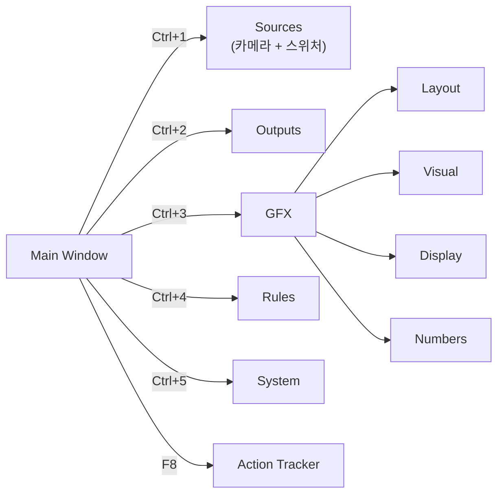
```mermaid
flowchart LR
    MW["Main Window"] -->|"Ctrl+1"| SRC["Sources<br/>(카메라 + 스위처)"]
    MW -->|"Ctrl+2"| OUT["Outputs"]
    MW -->|"Ctrl+3"| GFX["GFX"]
    GFX --> LAY["Layout"] & VIS["Visual"] & DIS["Display"] & NUM["Numbers"]
    MW -->|"Ctrl+4"| RUL["Rules"]
    MW -->|"Ctrl+5"| SYS["System"]
    MW -->|"F8"| AT["Action Tracker"]
```

##### PokerGFX 원본

**원본 캡쳐**

**오버레이 분석본**

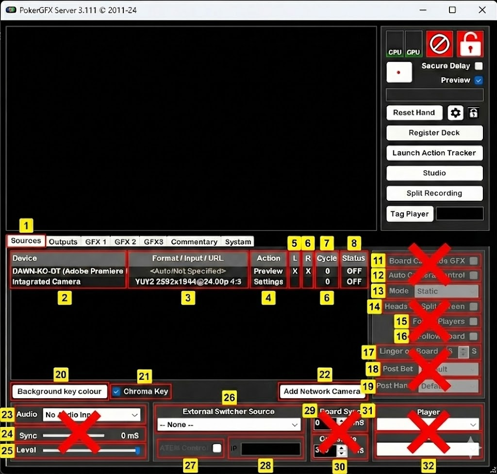

비디오 입력 장치, 카메라 제어, 크로마키, 외부 스위처 연동을 관리하는 탭. 12개 UI 요소로 구성.

| # | 기능명 | 설명 | EBS 복제 |
|:-:|--------|------|:--------:|
| 1 | Tab Bar | 7개 탭 전환 바 | P0 |
| 2 | Device Table | 비디오 입력 장치 목록. Preview, Settings 버튼으로 개별 제어 | P0 |
| 3 | Board Cam / Auto Camera | 보드 카메라 전환 시 GFX 자동 숨기기 + 게임 상태 기반 자동 카메라 전환 | P1 |
| 4 | Camera Mode | Static / Dynamic 카메라 전환 모드 | P1 |
| 5 | Heads Up / Follow | 헤즈업 시 화면 분할과 플레이어/보드 추적 | P1 |
| 6 | Linger / Post | 보드 카드 유지 시간 + Post Bet / Post Hand 카메라 동작 | P1 |
| 7 | Chroma Key | 활성화 체크박스 + Background Key Colour 색상 선택기 | P0 |
| 8 | Add Network Camera | IP 기반 원격 카메라 추가 | P2 |
| 9 | Audio / Sync | 오디오 소스 + Sync 보정값 (mS) | P1 |
| 10 | External Switcher / ATEM | ATEM 스위처 IP 기반 직접 통신 | P1 |
| 11 | Board Sync / Crossfade | 싱크 보정 + 크로스페이드 시간 (기본 0/300mS) | P1 |
| 12 | Player View | 플레이어별 카메라 뷰 전환 | P1 |

> **설계 시사점**
> - External Switcher(10번)가 출력 모드와 무관하게 항상 노출 → 혼란 유발. EBS에서 Fill & Key 모드에서만 표시
> - Chroma Key(7번)가 목록 중간에 배치 → EBS에서 Output Mode Selector(S-00)로 상단 분리
> - Auto Camera Control: 게임 상태 기반 자동 카메라 전환이 핵심 → EBS 계승

##### EBS 설계본

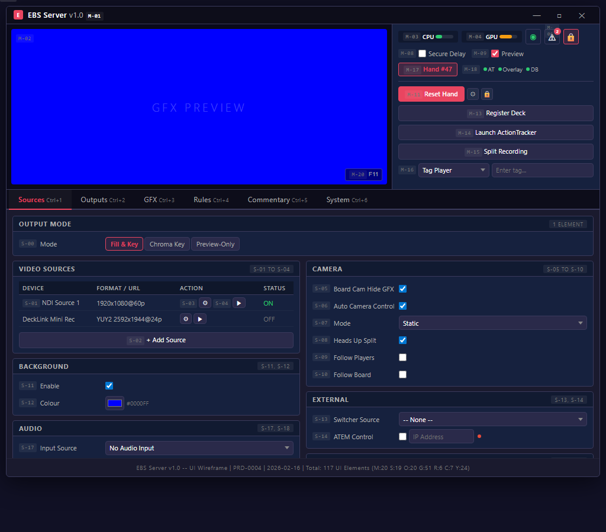

##### 설계 스펙

**변환 요약**: PokerGFX 12개 → EBS 19개. Output Mode Selector(S-00) 신규 추가로 Fill & Key/Chroma Key/Internal 모드에 따른 조건부 표시. ATEM 설정은 Fill & Key 모드에서만 노출하여 인지 부하 감소.

비디오/오디오 입력 소스를 등록하고 속성을 조절한다. 자동 카메라 제어 설정도 이 화면에서 한다.

###### 레이아웃

3구역: Video Sources Table(S-01, 상단) > Camera Control(S-05~S-10, 중단) > Background/Audio/External/Sync(S-11~S-18, 하단).

###### Design Decisions

1. **Output Mode Selector(S-00)가 첫 번째인 이유**: Fill & Key / Chroma Key / Internal 모드 선택이 나머지 요소의 가시성과 필수 여부를 결정한다. 모드를 먼저 결정해야 불필요한 설정 노출을 방지할 수 있다.

2. **ATEM Control(S-13, S-14)이 Fill & Key 전용인 이유**: Fill & Key 모드에서만 외부 ATEM 스위처 DSK가 필요하다. 다른 모드에서는 스위처가 불필요하므로 설정을 노출하면 혼란만 가중된다.

3. **Audio(S-17, S-18)가 모든 모드에서 공통인 이유**: 오디오 소스와 싱크 보정은 출력 모드와 무관하게 항상 필요하다.

###### Workflow

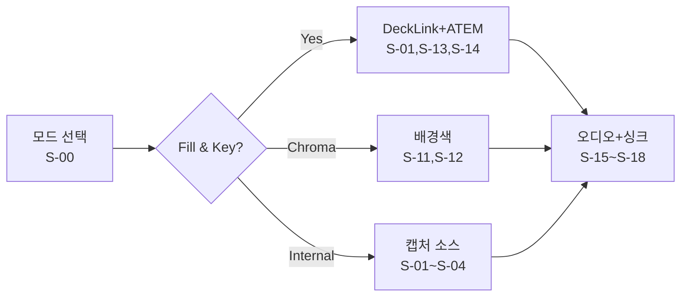
```mermaid
flowchart LR
    S0["모드 선택<br/>S-00"] --> FK{"Fill & Key?"}
    FK -->|"Yes"| S1["DeckLink+ATEM<br/>S-01,S-13,S-14"]
    FK -->|"Chroma"| S3["배경색<br/>S-11,S-12"]
    FK -->|"Internal"| S4["캡처 소스<br/>S-01~S-04"]
    S1 & S3 & S4 --> S5["오디오+싱크<br/>S-15~S-18"]
```

###### Element Catalog

| # | 그룹 | 요소 | 타입 | 설명 | PGX | 우선순위 |
|:-:|------|------|------|------|:---:|:--------:|
| S-00 | Output Mode | Mode Selector | RadioGroup | Fill & Key / Chroma Key / Internal (기본: Fill & Key) | 신규 | P0 |
| S-01 | Video Sources | Device Table | DataTable | NDI, 캡처 카드, 네트워크 카메라 목록 | #2 | P0 |
| S-02 | Video Sources | Add Button | TextButton | NDI 자동 탐색 또는 수동 URL | #8 | P1 |
| S-03 | Video Sources | Settings | IconButton | 해상도, 프레임레이트, 크롭 | #2 | P1 |
| S-04 | Video Sources | Preview | IconButton | 소스별 미니 프리뷰 | #2 | P1 |
| S-05 | Camera | Board Cam Hide GFX | Checkbox | 보드 카메라 시 GFX 자동 숨기기 | #3 | P1 |
| S-06 | Camera | Auto Camera Control | Checkbox | 게임 상태 기반 자동 전환 | #3 | P1 |
| S-07 | Camera | Mode | Dropdown | Static / Dynamic | #4 | P1 |
| S-08 | Camera | Heads Up Split | Checkbox | 헤즈업 화면 분할 | #5 | P1 |
| S-09 | Camera | Follow Players | Checkbox | 플레이어 추적 | #5 | P1 |
| S-10 | Camera | Follow Board | Checkbox | 보드 추적 | #5 | P1 |
| S-11 | Background | Enable | Checkbox | 크로마키 활성화 | #7 | P0 |
| S-12 | Background | Background Colour | ColorPicker | 배경색 (기본 Blue) | #7 | P0 |
| S-13 | External | Switcher Source | Dropdown | ATEM 스위처 연결 (Fill & Key 필수) | #10 | P0 |
| S-14 | External | ATEM Control | Checkbox+TextField | ATEM IP + 연결 상태 (Fill & Key 필수) | #10 | P0 |
| S-15 | Sync | Board Sync | NumberInput | 보드 싱크 보정 (ms) | #11 | P1 |
| S-16 | Sync | Crossfade | NumberInput | 크로스페이드 (ms, 기본 300) | #11 | P1 |
| S-17 | Audio | Input Source | Dropdown | 오디오 소스 선택 | #9 | P1 |
| S-18 | Audio | Audio Sync | NumberInput | 오디오 싱크 보정 (ms) | #9 | P1 |

###### Interaction Patterns

| 조작 | 시스템 반응 | 피드백 |
|------|-----------|--------|
| S-02 Add 클릭 | NDI 자동 탐색 시작 | 발견된 소스 목록 팝업 |
| S-11 Chroma Key 토글 | Preview에 크로마키 즉시 반영 | 배경색 변화 |
| S-14 ATEM IP 입력 | 연결 시도 + 상태 표시 | Green/Red 아이콘 |

###### Navigation

| 목적지 | 방법 | 조건 |
|--------|------|------|
| Main Window | 탭 영역 외 클릭 | 언제든 |
| Outputs 탭 | Ctrl+2 | 비디오 소스 설정 완료 후 자연스러운 다음 단계 |

#### Step 8: Skin Editor / Graphic Editor — 에필로그

지금까지의 모든 그래픽에는 "외관"이 있다 — 색상, 폰트, 카드 이미지, 애니메이션. 이것을 스킨이라고 부르며, 방송 전날 또는 며칠 전에 미리 만들어둔다. 본방송 중에는 건드리지 않는 사전 작업이므로 탭이 아니라 **Skin Editor**(별도 창)로 분리된다. **Graphic Editor**는 Skin Editor에서 개별 요소를 클릭하면 열리는 하위 작업 창이다.

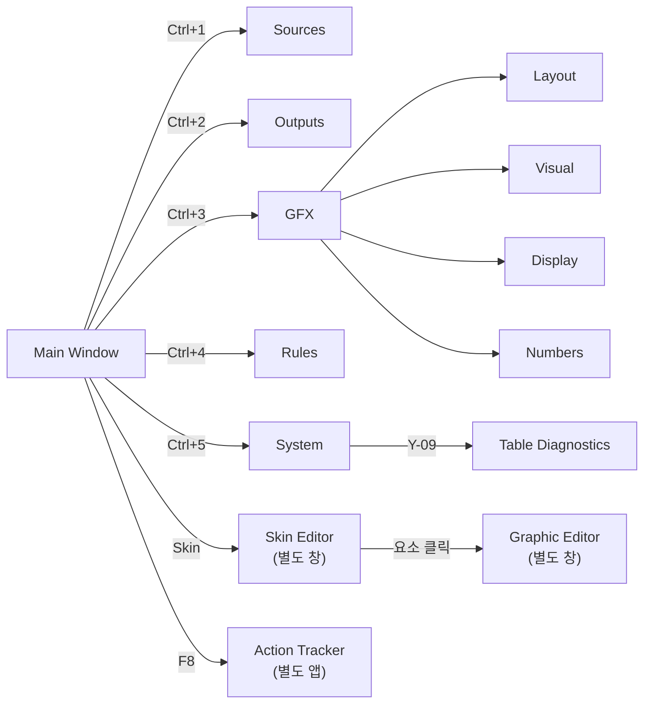
```mermaid
flowchart LR
    MW["Main Window"] -->|"Ctrl+1"| SRC["Sources"]
    MW -->|"Ctrl+2"| OUT["Outputs"]
    MW -->|"Ctrl+3"| GFX["GFX"]
    GFX --> LAY["Layout"] & VIS["Visual"] & DIS["Display"] & NUM["Numbers"]
    MW -->|"Ctrl+4"| RUL["Rules"]
    MW -->|"Ctrl+5"| SYS["System"]
    SYS -->|"Y-09"| TDG["Table Diagnostics"]
    MW -->|"Skin"| SKE["Skin Editor<br/>(별도 창)"]
    SKE -->|"요소 클릭"| GRE["Graphic Editor<br/>(별도 창)"]
    MW -->|"F8"| AT["Action Tracker<br/>(별도 앱)"]
```

8단계를 거쳐 완성된 최종 다이어그램이 EBS의 전체 네비게이션 맵이다. 운영자의 하루는 이 맵의 바깥(Skin Editor)에서 시작하여, 안쪽(5개 탭 설정)을 거쳐, Action Tracker에서 끝난다.

##### PokerGFX 원본

**원본 캡쳐**

**오버레이 분석본**

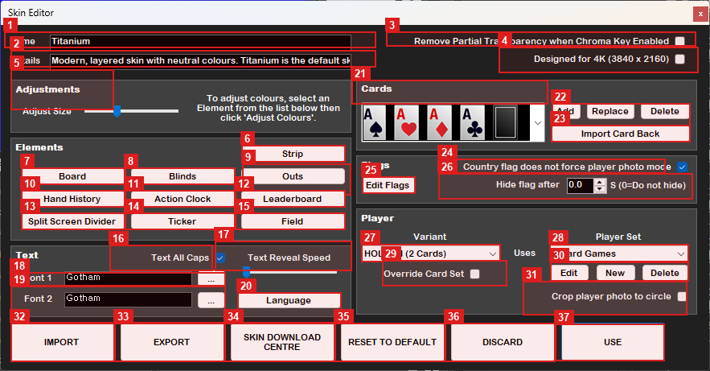

별도 창으로 열리는 스킨 편집기. 37개 UI 요소로 구성. 스킨 정보, 요소 버튼, 텍스트/카드/플레이어/국기 설정, Import/Export 기능.

> **설계 시사점**
> - 국기 관련 3개(24~26번)가 카드/플레이어 설정 사이에 끼어 흐름이 단절됨 → EBS에서 P2로 통합
> - 에디터 계층(GFX → Skin → Graphic)이 자연스러운 깊이 구조를 형성 → EBS 계승
> - Import/Export/Download(32~34번)는 팀 간 공유 자산 관리에 필수 → EBS 유지

##### EBS 설계본

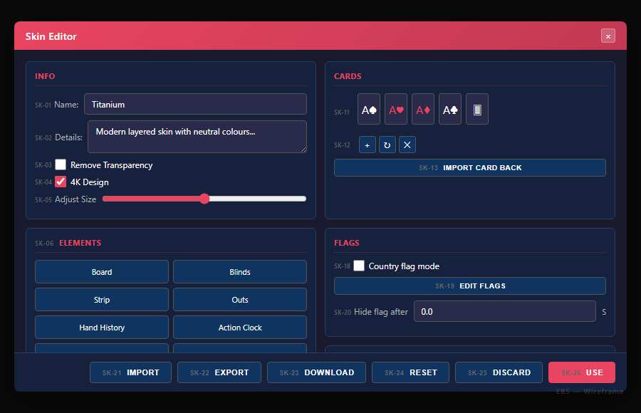

##### 설계 스펙

**변환 요약**: PokerGFX 37개 → EBS 26개. 국기 관련 P2 통합, 에디터 계층(GFX → Skin → Graphic) 명시, 핵심 기능 유지.

Skin(방송 그래픽 테마) 편집. 색상, 폰트, 레이아웃을 변경하고 테마를 저장/불러오기.

###### 레이아웃

4구역: Skin Preview(상단) > Element Buttons(SK-06, 중상) > Settings(SK-01~SK-20) > Actions(SK-21~SK-26, 하단).

###### Design Decisions

1. **에디터 계층 구조 (GFX -> Skin -> Graphic)**: GFX 탭은 "무엇을 어디에 표시할지" 런타임 설정. Skin Editor는 "어떤 시각적 테마로" 표현할지 정의. Graphic Editor는 "개별 요소를 픽셀 단위로" 편집. 변경 빈도에 따라 분리: GFX는 방송마다, Skin은 시즌마다, Graphic은 디자인 변경 시에만.

2. **별도 창인 이유**: Skin 편집은 실시간 프리뷰가 필수이며 작업 시간이 길다. 메인 윈도우의 Preview와 독립적으로 프리뷰를 제공한다.

3. **Import/Export/Download(SK-21~SK-23) 분리**: 스킨은 팀 간 공유 자산이다. 파일 기반 교환과 온라인 리포지토리 다운로드를 지원한다.

4. **SK-04 4K Design이 체크박스인 이유**: 스킨은 특정 해상도를 기준으로 제작된다. 이 플래그는 "이 스킨의 원본 좌표계가 무엇인지"를 선언한다. 런타임에 출력 해상도(O-01)와 스킨 기준 해상도(SK-04)가 다르면 스케일 변환이 자동 적용된다. 단, 업스케일(1080p 스킨 → 4K 출력)은 품질 저하 가능성이 있으므로 경고를 표시한다.

###### Workflow

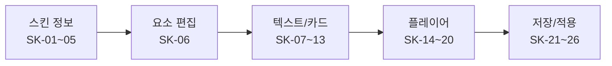
```mermaid
flowchart LR
    S1["스킨 정보<br/>SK-01~05"] --> S2["요소 편집<br/>SK-06"] --> S3["텍스트/카드<br/>SK-07~13"]
    S3 --> S4["플레이어<br/>SK-14~20"] --> S5["저장/적용<br/>SK-21~26"]
```

###### Element Catalog

| # | 그룹 | 요소 | 설명 | PGX | 우선순위 |
|:-:|------|------|------|:---:|:--------:|
| SK-01 | Info | Name | 스킨 이름 | #1 | P1 |
| SK-02 | Info | Details | 설명 텍스트 | #2 | P1 |
| SK-03 | Info | Remove Transparency | 크로마키 투명도 제거 | #3 | P1 |
| SK-04 | Info | 4K Design | 이 스킨이 4K(3840×2160) 기준으로 디자인되었음을 선언. 체크 시: Graphic Editor의 기준 좌표계가 3840×2160으로 전환됨. 미체크(기본): 기준 좌표계 1920×1080. O-01이 4K인데 SK-04 미체크 시 경고 표시(스킨 업스케일 적용됨). O-01이 1080p인데 SK-04 체크 시 경고 표시(스킨 다운스케일 적용됨). | #4 | P1 |
| SK-05 | Info | Adjust Size | 크기 슬라이더 | #5 | P2 |
| SK-06 | Elements | 10 Buttons | Strip~Field 각 요소 -> Graphic Editor | #6-15 | P1 |
| SK-07 | Text | All Caps | 대문자 변환 | #16 | P1 |
| SK-08 | Text | Reveal Speed | 텍스트 등장 속도 | #17 | P1 |
| SK-09 | Text | Font 1/2 | 1차/2차 폰트 | #18,19 | P1 |
| SK-10 | Text | Language | 다국어 설정 | #20 | P1 |
| SK-11 | Cards | Card Preview | 4수트 + 뒷면 미리보기 | #21 | P1 |
| SK-12 | Cards | Add/Replace/Delete | 카드 이미지 관리 | #22 | P1 |
| SK-13 | Cards | Import Card Back | 뒷면 이미지 | #23 | P1 |
| SK-14 | Player | Variant | 게임 타입 선택 | #27 | P1 |
| SK-15 | Player | Player Set | 게임별 세트 | #28 | P1 |
| SK-16 | Player | Edit/New/Delete | 세트 관리 | #30 | P1 |
| SK-17 | Player | Crop to Circle | 원형 크롭 | #31 | P1 |
| SK-18 | Player | Country Flag | 국기 모드 | #24 | P2 |
| SK-19 | Player | Edit Flags | 국기 이미지 편집 | #25 | P2 |
| SK-20 | Player | Hide Flag After | 자동 숨김 (초) | #26 | P2 |
| SK-21 | Actions | Import | 스킨 가져오기 | #32 | P1 |
| SK-22 | Actions | Export | 스킨 내보내기 | #33 | P1 |
| SK-23 | Actions | Download | 온라인 다운로드 | #34 | P2 |
| SK-24 | Actions | Reset | 기본 초기화 | #35 | P1 |
| SK-25 | Actions | Discard | 변경 취소 | #36 | P1 |
| SK-26 | Actions | Use | 현재 적용 | #37 | P1 |

###### Navigation

| 목적지 | 방법 | 조건 |
|--------|------|------|
| Graphic Editor | SK-06 요소 버튼 클릭 | 별도 창 열림 |
| GFX 탭 | 창 닫기 | SK-26 Use 후 |

##### PokerGFX 원본

PokerGFX의 Graphic Editor는 Board 모드(39개)와 Player 모드(48개)로 분리되어 있었다. 공통 기능(Position, Animation, Text, Background)이 60% 이상 중복.

**Board 모드** (39개 요소)

**원본 캡쳐**

**오버레이 분석본**

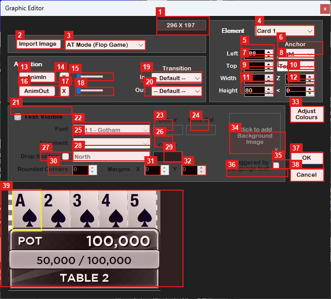

**Player 모드** (48개 요소)

**원본 캡쳐**

**오버레이 분석본**

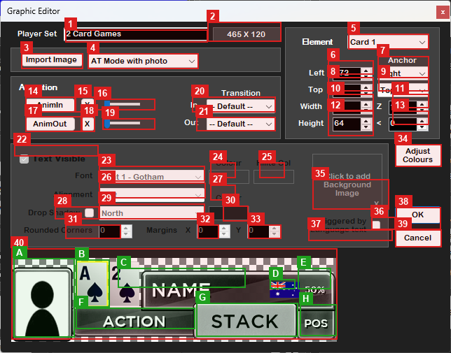

##### EBS 설계본

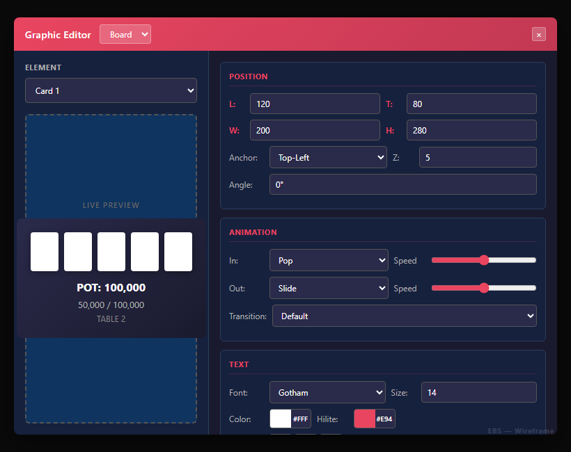

##### 설계 스펙

###### 분석

> **설계 시사점**
> - Board(39개) + Player(48개) = 87개 요소 중 공통 기능이 60% 이상 중복됨
> - Position(LTWH), Animation In/Out, Text, Background는 동일한 조작 패턴
> - 두 에디터를 분리할 이유가 기능적으로 없음 → 단일 에디터 + 모드 전환으로 통합

**변환 요약**: PokerGFX 87개(Board 39 + Player 48) → EBS 18개(공통 10 + Player 전용 8). Board/Player 단일 에디터로 통합, 동일한 조작 패턴 유지하면서 대상만 전환.

Skin Editor에서 선택한 특정 요소(Board, Player, Card 등)의 위치, 크기, 색상, 효과를 픽셀 단위로 편집.

###### Design Decisions

1. **Board/Player 듀얼 모드인 이유**: 보드 영역과 플레이어 영역은 레이아웃 요소가 완전히 다르다. 모드 전환으로 동일한 조작 패턴(Position, Animation, Text)을 유지하면서 대상만 바꾼다.

2. **Skin Editor에서만 접근 가능한 이유**: GFX -> Skin Editor -> Graphic Editor 순서로 진입 깊이가 깊어지면서 실수로 픽셀 수준 편집에 접근하는 것을 방지한다. "변경 빈도가 낮을수록 접근이 깊다."

###### Workflow

편집 대상 선택 -> 위치/크기 조정 -> 애니메이션 설정 -> 텍스트 스타일 -> 실시간 프리뷰 확인.

###### Element Catalog

###### Board/공통 편집 기능 (10개)

| 기능 | 설명 |
|------|------|
| Element 선택 | 드롭다운으로 편집 대상 선택 |
| Position (LTWH) | Left/Top/Width/Height. 단위: Design Resolution(SK-04에 따라 1920×1080 또는 3840×2160) 기준 픽셀 정수값. 예: L=100, T=50, W=400, H=200. 출력 해상도 변경 시 스케일 팩터가 자동 적용되므로 운영자가 직접 수정하지 않아도 됨. |
| Anchor | 해상도 변경 시 요소의 기준점. 옵션: TopLeft / TopRight / BottomLeft / BottomRight / Center / TopCenter / BottomCenter. 예: TopRight 앵커 → 해상도 변경 시 오른쪽 상단 기준으로 위치 유지. 기본값: TopLeft. PokerGFX renderer Anchor 개념과 동일. |
| Coordinate Display | 현재 출력 해상도 기준 실제 픽셀값 미리보기 (읽기 전용). 예: Design Resolution(1920×1080) L=100 → 4K(3840×2160) 출력 시 실제 L=200 표시. 편집은 Design Resolution 기준값으로만 가능. |
| Z-order | 레이어 겹침 순서 |
| Angle | 요소 회전 |
| Animation In/Out | 등장/퇴장 + 속도 슬라이더 |
| Transition | Default/Pop/Expand/Slide |
| Text | 폰트, 색상, 강조색, 정렬, 그림자 |
| Background Image | 요소 배경 |
| Live Preview | 하단 실시간 프리뷰 |

###### Player Overlay 요소 (8개)

| 코드 | 요소 | 설명 | 우선순위 |
|:----:|------|------|:--------:|
| A | Player Photo | 프로필 이미지 | P1 |
| B | Hole Cards | 홀카드 2~5장 | P0 |
| C | Name | 플레이어 이름 | P0 |
| D | Country Flag | 국적 국기 | P2 |
| E | Equity % | 승률 | P0 |
| F | Action | 최근 액션 | P0 |
| G | Stack | 칩 스택 | P0 |
| H | Position | 포지션 (D/SB/BB) | P0 |

###### Navigation

| 목적지 | 방법 | 조건 |
|--------|------|------|
| Skin Editor | 창 닫기 | 편집 완료 후 |

### 1.2 화면 역할 한눈에 보기

| 화면 | 역할 | 주 사용 시점 |
|------|------|-------------|
| Main Window | 시스템 모니터링 + 긴급 조작 | 항상 (본방송 중 15% 주의력) |
| Sources 탭 | 비디오/오디오 입력 장치 설정 | 준비 단계 |
| Outputs 탭 | 출력 파이프라인 설정 (해상도, 장치, 녹화, 스트리밍) | 준비 단계 |
| GFX 탭 | 그래픽 레이아웃/연출/표시/수치 | 준비 단계 + 핸드 간 조정 |
| Rules 탭 | 게임 규칙 (Bomb Pot, Straddle 등) | 준비 단계 |
| System 탭 | RFID, AT 연결, 시스템 진단 | 준비 단계 + 비상 대응 |
| Skin Editor | 방송 그래픽 테마 편집 | 사전 준비 |
| Graphic Editor | 개별 요소 픽셀 단위 편집 | 사전 준비 |
| **Action Tracker** | **실시간 게임 진행 입력** | **본방송 (85% 주의력)** |

### 1.3 설계 원칙

| 원칙 | UI 반영 |
|------|---------|
| 운영자 중심 설계 (라이브 중 인지 부하 최소화) | Quick Actions, 단축키 |
| 검증된 레이아웃 계승 (PokerGFX 2-column 유지) | Preview(좌) + Control(우) |
| 논리적 기능 통합 (GFX 1/2/3 재편) | Layout/Visual/Display/Numbers 4개 서브탭 |

### 1.4 공통 레이아웃

모든 탭이 공유하는 구조: Title Bar > Preview Panel(좌, 16:9 Chroma Key) + Status/Quick Actions(우) > Tab Navigation > Tab Content Area.

#### 해상도 적응 원칙

EBS Server UI는 다양한 모니터 환경(SD~4K)과 다양한 출력 해상도(480p~4K)를 지원한다.

**Design Resolution vs Output Resolution**

| 개념 | 정의 | 설정 위치 |
|------|------|----------|
| Design Resolution | Graphic Editor에서 좌표를 입력하는 기준 해상도. SK-04(4K Design) 설정에 따라 1920×1080 또는 3840×2160 | 8장 SK-04 |
| Output Resolution | 실제 방송 송출 해상도. O-01(Video Size)에서 설정 | 4장 O-01 |
| Preview Scaling | UI 내 Preview Panel이 출력 해상도 비율을 유지하며 UI 공간에 맞게 표시되는 방식 | 2장 M-02 |

**앱 윈도우 크기 정책**

- 최소 앱 윈도우: 1280×720 (이하에서는 스크롤 발생)
- 최대: 운영자 모니터 크기에 따라 가변
- Preview(좌) : Control(우) 기본 비율 = 6:4
- 고해상도(4K) 모니터에서 앱 윈도우 크기: OS DPI 스케일링을 따름 (앱 자체 DPI 처리 없음)

**좌표 시스템 원칙**

- Graphic Editor의 모든 위치/크기 값(LTWH)은 Design Resolution 기준 픽셀 단위
- GFX 마진(G-03~G-05)은 정규화 좌표(0.0~1.0) 사용 (% 표시)
- 출력 해상도 변경 시 기준 픽셀값에 스케일 팩터가 자동 적용됨 (운영자 수동 조정 불필요)

### 1.5 설계 기초

PRD-0004는 단순한 화면 스펙이 아니라 **운영자의 사고 모델**을 반영한 설계다.

#### 3단계 시간 모델

| 단계 | 시간 | 주 화면 | 조작 방식 | 긴장도 |
|------|------|---------|----------|--------|
| **준비** (Setup) | 30~60분 | GfxServer | 마우스/키보드 | 낮음 |
| **본방송** (Live) | 수 시간 | Action Tracker | 터치 | **높음** |
| **후처리** (Post) | 10~30분 | GfxServer | 마우스/키보드 | 낮음 |

본방송 중 GfxServer는 "설정 도구"에서 "모니터링 대시보드"로 역할이 전환된다.

#### 주의력 분배

| 장치 | 비중 | 주시 내용 |
|------|:----:|----------|
| **Action Tracker** | 80% | 현재 핸드 진행, 베팅 입력, 특수 상황 |
| **GfxServer** | 15% | RFID 상태, 에러 알림, 프리뷰 |
| **Stream Deck** | 5% | GFX 숨기기, 카메라 전환 (손끝 감각) |

#### 자동화 그래디언트

**완전 자동**(카드 인식, 승률 계산, 핸드 평가, 오버레이 렌더링) > **반자동**(New Hand, Showdown, GFX 표시, 카메라 전환) > **수동**(베팅 금액, Chop/Run It 2x, 수동 카드 입력, 스택 조정).

---

## Commentary 탭 — 배제 근거

### PokerGFX 원본

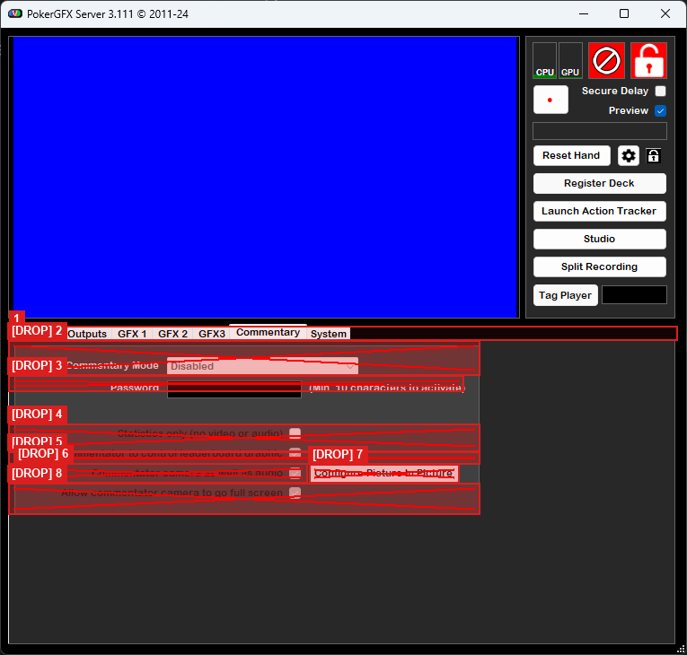

PokerGFX에서 Commentary 탭은 해설자 전용 정보 표시 영역을 제어한다. 8개 요소(SV-021 Commentary ON/OFF, SV-022 Commentator Name 등)로 구성되며, 방송 화면에 해설자 이름과 관련 정보를 오버레이한다.

> **배제 판단 근거**
> - 기존 프로덕션에서 Commentary 기능을 사용한 적이 없음 — 해설자 정보는 별도 그래픽 소스로 처리
> - 8개 요소 전체가 P3(불필요)로 분류됨
> - 기능을 복제하더라도 운영 워크플로우에 투입될 가능성이 없음
> - Phase 1 복제 범위에서 제외하여 개발 리소스를 핵심 기능(P0/P1)에 집중

### 결정

**EBS에서 완전 배제.** PokerGFX 268개 요소 중 Commentary 8개를 제거한 것이 EBS 184개로의 감축(-84)에 기여하는 첫 번째 요인이다. 향후 해설자 오버레이가 필요해질 경우 GFX-Visual 서브탭의 확장으로 대응 가능하며, 별도 탭 부활은 계획하지 않는다.

---

## 10장: Action Tracker (별도 앱)

Action Tracker는 GfxServer와는 별도의 독립 앱으로, **본방송 중 운영자 주의력의 85%**를 차지한다.

> **구현 요구사항 문서**: [PRD-AT-001: EBS Action Tracker](../../docs/00-prd/action-tracker.prd.md) — 26개 기능 요구사항, Flutter Desktop 아키텍처, 키보드 중심 입력 설계, 68개 프로토콜 매핑 포함.

### 10.1 AT의 역할

실시간 게임 진행 입력 장치. 베팅 금액, New Hand, Showdown 등 모든 액션을 이 앱에서 입력한다.

### 10.2 GfxServer와의 상호작용 지점

| GfxServer 요소 | AT와의 관계 |
|---------------|------------|
| M-14 Launch AT | AT 앱 실행 (F8) |
| M-18 Connection Status | AT 연결 상태 표시 (WebSocket) |
| Y-01 RFID Status | AT로 RFID 데이터 전송 |
| Y-02 AT Connection | AT 연결 관리 |

---

## 11장: 시스템 상태 UI

### 11.1 에러 상태

방송 중 발생 가능한 에러와 UI 피드백 전략. 모든 에러는 복구 가능해야 하며, 방송을 중단시키지 않는다.

| 에러 유형 | 시각적 표시 | 자동 복구 | 수동 개입 | Feature ID |
|----------|-----------|----------|----------|-----------|
| **RFID 인식 실패** | Main 탭 RFID 상태 그리드 빨간색, 5초 카운트다운 | 5초 재시도 | 재시도 실패 시 수동 카드 입력 창 자동 표시 | Y-01, M-05 |
| **네트워크 끊김** | Main 탭 클라이언트 목록에서 접속 상태 회색, 재연결 아이콘 회전 | 30초 자동 재연결 | 재연결 실패 시 "수동 재연결" 버튼 활성화 | M-18 |
| **잘못된 카드** | Action Tracker 해당 좌석 셀 빨간색 테두리, "WRONG CARD" 경고 | -- | "카드 제거 -> 올바른 카드 재입력" 가이드 표시 | Y-01 |
| **서버 크래시** | 서버 전체 다운, 자동 재시작 | 최근 저장점 자동 복원 (최대 30초 전) | 복원 실패 시 마지막 핸드 수동 재입력 | M-13 |
| **License 만료** | 서버 시작 시 차단, 모달 다이얼로그 | -- | PokerGFX 계정 로그인 후 라이선스 갱신 | Y-02 |
| **GPU 과부하** | System 탭 FPS 그래프 빨간색 (30fps 이하), 경고음 | -- | 비디오 소스 해상도 낮춤 또는 GFX 요소 숨김 | M-04 |

**에러 로그 표시**: Main 탭 하단에 최근 5개 에러만 표시. 심각도별 색상 구분 (빨강=긴급, 노랑=경고, 회색=정보).

### 11.2 로딩 상태

| 로딩 단계 | 예상 시간 | UI 표시 | Feature ID |
|----------|:--------:|---------|-----------|
| **서버 시작** | 3~5초 | 스플래시 화면, "Checking License..." -> "Initializing..." | Y-02 |
| **RFID 초기화** | 2~4초 | "Connecting RFID Readers... (0/12)" 프로그레스 바 | Y-01 |
| **Skin 로딩** | 1~3초 | "Loading Skin: [파일명]..." 스피너 | G-01 |
| **비디오 소스 검색** | 2~5초 | "Scanning NDI Sources..." 회전 아이콘 | S-01 |
| **테스트 스캔** | 0.2초 | "Test Card Recognition..." -> "200ms OK" 또는 "FAIL" | Y-04 |
| **상태 복원** | 1~2초 | "Restoring Game State... Hand #[번호]" 프로그레스 바 | M-13 |

**스플래시 화면 표시 규칙**: 예상 로딩 시간이 1초 이상인 경우에만 표시. 1초 미만은 즉시 완료 처리.

### 11.3 비활성 상태

| 조건 | 비활성화 요소 | 시각적 표시 | 이유 |
|------|-------------|-----------|------|
| **게임 진행 중** | Main 탭 "게임 시작" 버튼 | 회색 처리, "게임 진행 중" 툴팁 | 중복 시작 방지 |
| **자동 모드 활성** | GFX1 탭 수동 카드 입력 섹션 전체 | 회색 처리, "Auto Mode ON" 배너 | RFID 우선 정책 |
| **Trustless Mode ON** | Outputs 탭 Live Canvas "Show Hole Cards" | 회색 처리, 체크 불가 | 보안 정책 강제 |
| **에디터 빈 캔버스** | Properties 패널 전체 | 회색 처리, "No Element Selected" | 선택된 요소 없음 |
| **클라이언트 미연결** | GFX1 탭 "Action Tracker로 전송" 버튼 | 회색 처리, "No Client Connected" | 전송 대상 없음 |
| **RFID 리더 오프라인** | GFX1 탭 Auto 모드 라디오 버튼 | 회색 처리, "RFID Offline" 경고 | 하드웨어 장애 |
| **License Basic** | System 탭 Advanced 기능 전체 | 회색 처리, "Upgrade to PRO" 배너 | 라이선스 제한 |
| **AT 불가능 액션** | RAISE 버튼 (All-in 상태 플레이어) | 회색 처리, 터치 무반응 | 게임 규칙 위반 |

**비활성 vs 숨김**: "이 기능이 존재하지만 지금은 사용 불가"이면 비활성 표시. "이 모드에서는 아예 존재하지 않는 기능"이면 숨김 처리.

### 11.4 예외 처리 흐름

본방송 중 발생할 수 있는 예외 상황과 복구 경로.

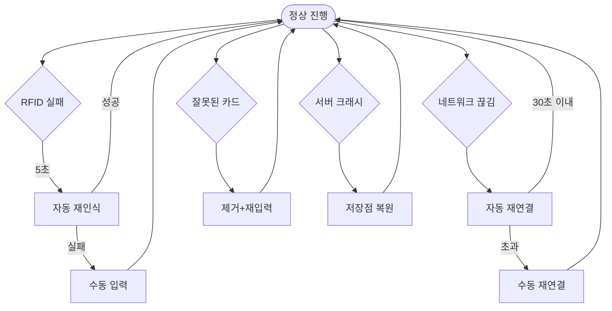
```mermaid
graph TD
    N(["정상 진행"]) --> RF{"RFID 실패"} -->|"5초"| RR["자동 재인식"] -->|"성공"| N
    RR -->|"실패"| MN["수동 입력"] --> N
    N --> NF{"네트워크 끊김"} --> RC["자동 재연결"] -->|"30초 이내"| N
    RC -->|"초과"| AL["수동 재연결"] --> N
    N --> WC{"잘못된 카드"} --> RM["제거+재입력"] --> N
    N --> CR{"서버 크래시"} --> RS["저장점 복원"] --> N
```

모든 예외 경로는 "정상 진행"으로 복귀한다. 방송 중단 없는 설계가 원칙이다.

---

## 부록

### A. UI 요소 전체 집계

**구현 우선순위 정의**:

| 우선순위 | 정의 | 기준 |
|:--------:|------|------|
| **P0** | 필수 | 없으면 방송이 불가능한 핵심 기능. MVP에 반드시 포함 |
| **P1** | 중요 | 방송은 가능하나 운영 효율/품질에 영향. 초기 배포 후 순차 추가 |
| **P2** | 부가 | 확장성, 편의성, 고급 기능. 시스템 안정화 후 추가 |

| 화면 | 요소 수 | P0 | P1 | P2 |
|------|:-------:|:--:|:--:|:--:|
| Main Window | 20 | 11 | 7 | 2 |
| Sources 탭 | 19 | 6 | 13 | 0 |
| Outputs 탭 | 20 | 8 | 4 | 8 |
| GFX - Layout | 13 | 2 | 8 | 3 |
| GFX - Visual | 12 | 4 | 8 | 0 |
| GFX - Display | 14 | 2 | 12 | 0 |
| GFX - Numbers | 12 | 5 | 7 | 0 |
| Rules 탭 | 6 | 0 | 6 | 0 |
| System 탭 | 24 | 7 | 11 | 6 |
| Skin Editor | 26 | 0 | 21 | 5 |
| Graphic Editor | 18 | 6 | 11 | 1 |
| **합계** | **184** | **51** | **108** | **25** |

### B. 전역 단축키

| 단축키 | 동작 | 맥락 |
|--------|------|------|
| `F5` | Reset Hand | 메인 |
| `F7` | Register Deck | 메인 |
| `F8` | Launch AT | 메인 |
| `F11` | Preview 전체 화면 | 메인 |
| `Ctrl+1` | Sources 탭 | 전역 |
| `Ctrl+2` | Outputs 탭 | 전역 |
| `Ctrl+3` | GFX 탭 | 전역 |
| `Ctrl+4` | Rules 탭 | 전역 |
| `Ctrl+5` | System 탭 | 전역 |
| `Ctrl+S` | 설정 저장 | 전역 |

### C. Feature Mapping (149개)

PokerGFX-Feature-Checklist.md의 149개 기능이 이 문서의 어느 요소에 대응하는지 전체 매핑한다.

**전체 커버리지: 147/149 (98.7%)**

#### 배제 기능 (2개)

| Feature ID | 기능 | 배제 사유 |
|:----------:|------|----------|
| SV-021 | Commentary 탭 (C-01~C-03) | **배제**: 기존 포커 방송 프로덕션에서 Commentary 탭을 사용하지 않으며, EBS Phase 1에서 복제하지 않음. |
| SV-022 | Commentary PIP (C-07) | **배제**: 동일 사유. |

#### GFX ID 크로스 레퍼런스

| PRD-0004 ID | Original PokerGFX ID | 기능 |
|:-----------:|:-------------------:|------|
| G-01 | G1-006 | Board Position |
| G-02 | G1-001 | Player Layout (10-seat) |
| G-14 | G1-004 | Reveal Players |
| G-16 | G1-022 | Transition In/Out |
| G-22 | G2-006 | Leaderboard |
| G-24 | G2-001~005 | Player Stats (VPIP/PFR) |
| G-37 | G1-008 | Hand Equities |
| G-40~G-42 | G1-009 | Outs Display |
| G-45 | G1-012 | Show Blinds |
| G-50 | G3-014 | Chipcount Precision |

#### Action Tracker (AT-001~AT-026, 26개)

AT는 별도 앱. GfxServer 상호작용 지점만 매핑한다.

| Feature ID | PRD 연결 지점 |
|:----------:|---------------|
| AT-001 | M-18 Connection Status (2장) |
| AT-002 | Y-01, Y-02 (7장) |
| AT-003~004 | O-15, O-16 (4장), M-15 (2장) |
| AT-005~006 | Game Engine, G-45 (5장) |
| AT-007 | M-17 (2장), G-46 (5장) |
| AT-008~010 | G-02, G-15, G-19, G-20 (5장) |
| AT-011 | Player Overlay H (9장) |
| AT-012~017 | Server GameState / AT 자체 UI |
| AT-018 | R-02 (6장) |
| AT-019~020 | RFID 자동 / AT 수동 |
| AT-021~026 | Display Domain, Hand History, Server, M-11 (2장) |

#### Pre-Start Setup (PS-001~PS-013, 13개)

| Feature ID | PRD 연결 지점 |
|:----------:|---------------|
| PS-001 | G-13 (5장 Layout) |
| PS-002 | Game Engine (내부) |
| PS-003 | G-50 (5장 Numbers) |
| PS-004~006 | Player Overlay C, G, H (9장) |
| PS-007 | M-05 (2장), Y-03~Y-07 (7장) |
| PS-008~009 | G-45 (5장), R-04 (6장) |
| PS-010 | G-02 (5장 Layout) |
| PS-011~013 | Outputs Dual Board, M-14 (2장), RFID 자동 |

#### Viewer Overlay (VO-001~VO-014, 14개)

| Feature ID | PRD 연결 지점 |
|:----------:|---------------|
| VO-001, VO-004 | G-10~G-12 Sponsor Logo (5장) |
| VO-002, VO-003, VO-010 | G-45, G-50 (5장 Numbers) |
| VO-005 | G-14, G-16 (5장 Visual) |
| VO-006 | Player Overlay C, G (9장) |
| VO-007~008 | G-35, G-37 (5장 Display) |
| VO-009, VO-011 | G-01, G-13 (5장 Layout) |
| VO-012 | Game State Machine |
| VO-013~014 | G-19, G-20, G-15 (5장 Visual) |

#### GFX Console (GC-001~GC-025, 25개)

| Feature ID | PRD 연결 지점 |
|:----------:|---------------|
| GC-001~008 | G-24 Show Player Stats (5장) |
| GC-009~010, GC-013~016 | G-22 Leaderboard (5장) |
| GC-011~012 | G-36, G-28 (5장 Display) |
| GC-017 | Display Domain 제어 |
| GC-018~020 | Y-12 (7장), M-11 (2장) |
| GC-021 | G-43 Score Strip (5장) |
| GC-022~025 | M-03, M-04, M-02, M-12 (2장), SK-10 (8장) |

> **[DROP]** GC-019 (Print Report), GC-024 (다크/라이트 테마): ebs-console v1.0~v3.0 범위 외. 배제 확정.

#### Security (SEC-001~SEC-011, 11개)

| Feature ID | PRD 연결 지점 |
|:----------:|---------------|
| SEC-001, SEC-011 | O-08, O-09 (4장, 추후 개발) |
| SEC-002 | O-10 (4장, 추후 개발), M-10 (2장, 추후 개발) |
| SEC-003~004 | Live Canvas 내부 로직, M-02 (2장). Delay Canvas는 추후 개발 |
| SEC-006~008 | System RFID / 설정 영속화 |
| SEC-009 | M-18 Connection Status (2장) |

#### Equity & Stats (EQ-001~EQ-012, ST-001~ST-007, 19개)

| Feature ID | PRD 연결 지점 |
|:----------:|---------------|
| EQ-001~005, EQ-008 | G-37 Show Hand Equities (5장) |
| EQ-006~007 | G-40~G-42 Outs (5장 Numbers) |
| EQ-009~011 | Phase 2 / Game Engine |
| EQ-012 | G-38 Hilite Winning Hand (5장) |
| ST-001~007 | G-24 Show Player Stats (5장) |

> **[DROP]** ST-005 (누적 3Bet%): ebs-console v1.0~v3.0 범위 외. 배제 확정.

#### Hand History (HH-001~HH-011, 11개)

| Feature ID | PRD 연결 지점 |
|:----------:|---------------|
| HH-001~006 | Hand History DB (hands.db) |
| HH-007~008 | M-02 Preview 확장, 별도 다이얼로그 |
| HH-009~011 | Y-12 Export (7장), P2 기능 |

> **[DROP]** HH-011 (핸드 공유): 외부 서비스 연동 필요. ebs-console v1.0~v3.0 범위 외. 배제 확정.

#### Server 관리 (SV-001~SV-030, 30개)

대부분 직접 매핑. 주요 요소별 그룹:

| 그룹 | Feature ID | PRD 요소 |
|------|:----------:|----------|
| Sources (3장) | SV-001~005 | S-01, S-06, S-11~S-16 |
| Outputs (4장) | SV-006~011 | O-01~O-17 |

> **[DROP]** SV-011 (Twitch 연동): OBS에서 처리, EBS 범위 외. 배제 확정.
| GFX (5장) | SV-012~020 | G-01, G-02, G-10~G-12, G-17~G-21, G-47~G-51 |
| **배제** | SV-021~022 | ~~Commentary~~ |
| System (7장) | SV-023~026 | M-13, Y-04, Y-16, Y-23 |
| Editor (8-9장) | SV-027~029 | SK-01~SK-26, Graphic Editor |
| Main (2장) | SV-030 | M-14 Launch AT |

### D. Viewer Overlay 설계

시청자 방송 화면의 정보 계층: **1차**(홀카드, 승률) > **2차**(팟, 베팅, 보드) > **3차**(이벤트명, 블라인드, 로고). 이 계층이 요소의 크기, 위치, 색상 강도에 반영된다.

**현재 범위**: Live Canvas(현장용, Trustless Mode로 홀카드 관리). Delayed Canvas(방송용, 시간 지연 후 홀카드/승률 공개)는 추후 개발.

**게임 상태별**: Pre-Flop(홀카드+초기 승률) -> Flop(보드 3장+승률 재계산) -> Turn/River(승률 변동 강조) -> All-in(승률 바 확대) -> Showdown(Live에도 공개, 승자 하이라이트).

### E. 관련 문서 색인

[전체 기획서 (pokergfx-prd-v2.md)](../../ebs_reverse/docs/01-plan/pokergfx-prd-v2.md) | [기술 명세서 (PRD-0004-technical-specs.md)](PRD-0004-technical-specs.md) | [PokerGFX UI 분석](PokerGFX-UI-Analysis.md) | [Feature Checklist](PokerGFX-Feature-Checklist.md)

## Appendix A: 오버레이 오차율 분석

> 분석 도구: `tools/analyze_overlay_errors.py` | 원본 데이터: `docs/01_PokerGFX_Analysis/02_Annotated_ngd/*-ocr.json`

### A.1 화면별 오차율 요약

| 화면 | 박스 수 | Delta 적용 | OCR 인식 | Guard 위반 | 평균 δ | 최대 δ |
|------|:------:|:----------:|:--------:|:----------:|:------:|:------:|
| 01 메인 윈도우 | 10 | 10 (100%) | 1 (10%) | 0 (0%) | 7.8 px | 16 px |
| 02 Sources 탭 | 12 | 5 (42%) | 8 (67%) | 1 (20%) | 8.8 px | 15 px |
| 03 Outputs 탭 | 13 | 11 (85%) | 12 (92%) | 5 (45%) | 16.2 px | 20 px |
| 04 GFX 1 탭 | 29 | 14 (48%) | 27 (93%) | 1 (7%) | 11.2 px | 20 px |
| 05 GFX 2 탭 | 21 | 4 (19%) | 6 (29%) | 2 (50%) | 15.2 px | 26 px |
| 06 GFX3 탭 | 23 | 11 (48%) | 20 (87%) | 2 (18%) | 9.5 px | 20 px |
| 07 Commentary 탭 | 8 | 7 (88%) | 3 (38%) | 1 (14%) | 8.4 px | 15 px |
| 08 System 탭 | 28 | 21 (75%) | 20 (71%) | 5 (24%) | 13.6 px | 31 px |
| 09 Skin Editor | 37 | 28 (76%) | 17 (46%) | 2 (7%) | 9.5 px | 24 px |
| 10 Graphic Editor Board | 39 | 23 (59%) | 12 (31%) | 2 (9%) | 9.7 px | 40 px |
| 11 Graphic Editor Player | 48 | 22 (46%) | 13 (27%) | 2 (9%) | 9.2 px | 40 px |
| **전체** | **268** | **156 (58.2%)** | **139 (51.9%)** | **23 (14.7%)** | **10.6 px** | **40 px** |

### A.2 DELTA_GUARD 임계값 기준

| 컴포넌트 | 임계값 | 위반 조건 |
|---------|:------:|----------|
| dx (X 이동) | 20 px | abs(delta[0]) > 20 |
| dy (Y 이동) | 12 px | abs(delta[1]) > 12 |
| dw (너비 변화) | 25 px | abs(delta[2]) > 25 |
| dh (높이 변화) | 20 px | abs(delta[3]) > 20 |

> 출처: `tools/generate_annotations.py` DELTA_GUARD 상수 (line 43–48)

### A.3 Guard 위반 상세 (23건)

| 화면 | 박스 # | dx | dy | dw | dh | 위반 성분 |
|------|:------:|:--:|:--:|:--:|:--:|----------|
| 02 Sources 탭 | #12 | 7 | -15 | 1 | 7 | dy=-15 |
| 03 Outputs 탭 | #1 | -20 | -18 | 20 | -2 | dy=-18 |
| 03 Outputs 탭 | #2 | -5 | -18 | 5 | 5 | dy=-18 |
| 03 Outputs 탭 | #4 | 0 | 16 | 6 | -16 | dy=16 |
| 03 Outputs 탭 | #5 | 1 | 16 | -1 | -16 | dy=16 |
| 03 Outputs 탭 | #12 | -7 | 19 | 19 | -4 | dy=19 |
| 04 GFX 1 탭 | #10 | -7 | 20 | 8 | -19 | dy=20 |
| 05 GFX 2 탭 | #13 | -6 | 0 | 26 | 0 | dw=26 |
| 05 GFX 2 탭 | #15 | -6 | 0 | 26 | 0 | dw=26 |
| 06 GFX3 탭 | #13 | -17 | -13 | 9 | 12 | dy=-13 |
| 06 GFX3 탭 | #21 | -6 | -20 | 7 | 4 | dy=-20 |
| 07 Commentary 탭 | #2 | -7 | -15 | 8 | 13 | dy=-15 |
| 08 System 탭 | #4 | -18 | -1 | 28 | 3 | dw=28 |
| 08 System 탭 | #6 | -5 | -14 | 14 | 22 | dy=-14, dh=22 |
| 08 System 탭 | #8 | -17 | -4 | 31 | -14 | dw=31 |
| 08 System 탭 | #16 | -7 | -17 | -9 | 5 | dy=-17 |
| 08 System 탭 | #28 | 0 | -7 | -12 | 22 | dh=22 |
| 09 Skin Editor | #5 | -5 | -19 | -14 | 9 | dy=-19 |
| 09 Skin Editor | #31 | 0 | -9 | -6 | 24 | dh=24 |
| 10 Graphic Editor Board | #31 | 20 | 0 | -40 | 0 | dw=-40 |
| 10 Graphic Editor Board | #34 | 1 | 14 | -3 | -15 | dy=14 |
| 11 Graphic Editor Player | #32 | 20 | 0 | -40 | 0 | dw=-40 |
| 11 Graphic Editor Player | #35 | 1 | 14 | -3 | -15 | dy=14 |

### A.4 해석 지침

| Guard 위반 수준 | 의미 | 대응 방침 |
|----------------|------|----------|
| 0건 | 오버레이 정확 | 해당 화면 박스 신뢰 |
| 1–2건 (< 20%) | 부분 오차, 수용 가능 | 위반 박스만 수동 검토 |
| 3–5건 (20–45%) | 오버레이 재조정 권장 | 해당 화면 OCR 재실행 |
| 5건 이상 (> 45%) | 오버레이 신뢰 불가 | 박스 정의 전면 재검토 |

> **현황**: 03 Outputs 탭 (5건, 45%), 08 System 탭 (5건, 24%)이 고위험군. 해당 화면 박스 정의 재검토 권장.

---

---

## 변경 이력

| 버전 | 날짜 | 변경 내용 |
|------|------|----------|
| v1.0~v4.1 | 2026-02-16 | 초기 작성 -> 인과적 PRD -> UX 프로세스 -> Fill & Key 재설계 -> 와이어프레임 |
| v5.0~v6.0 | 2026-02-16 | Hub-and-Spoke 분리, Commentary 배제, P0/P1/P2 정의 |
| v7.0~v7.2 | 2026-02-17 | 인터페이스 설계서 전면 재설계, 정합성 검증, AT 입력 수정 |
| v8.0~v9.0 | 2026-02-17 | 앱 생태계 재설계, 기획서/기술 명세서 2문서 분리 |
| v10.0~v12.0 | 2026-02-18 | UI 전용 병합, 목업 중심 리팩토링, 역설계 분석 병합 |
| **v13.0.0** | **2026-02-18** | **전면 재설계**: Hub + Screen Specs + Feature Mapping 3개 문서를 단일 통합 문서로 병합. 화면별 섹션에 Design Decisions, Workflow, Element Catalog (전체), Interaction Patterns, Navigation을 자기 완결적으로 포함. PRD-0004-screen-specs.md, PRD-0004-screens/ 디렉토리, PRD-0004-feature-mapping.md 폐기. |
| **v14.0.0** | **2026-02-18** | **내러티브 재설계**: 화면별 "PokerGFX 원본 → 오버레이 분석 → EBS 설계" 3단계 인과 구조 도입. 프롤로그(이 문서의 접근법), 1.3 구조 변환 요약표, Commentary 배제 근거, 전 화면 원본/분석/설계 삼중 섹션 추가. 기존 Element Catalog·Interaction Patterns·Navigation 전량 보존. |
| **v15.0.0** | **2026-02-18** | **해상도 적응형 레이아웃 재설계**: 1.5절 해상도 적응 원칙 추가(Design/Output/Preview 개념 정의, 앱 윈도우 크기 정책, 좌표 시스템 원칙). M-02 Preview Panel 해상도 스케일링 스펙 추가. O-01 해상도 변경 7단계 처리 체인 정의. 5.7절 GFX 좌표계 원칙 블록 추가(정규화 좌표 vs 기준 픽셀 단위 체계 명시). SK-04 4K Design 동작 정의(기준 좌표계 전환, 경고 조건) + 8.5 Design Decisions 항목 4 추가. 9.6절 Position(LTWH)/Anchor/Coordinate Display 해상도 독립적 좌표 시스템 재정의. |
| **v16.0.0** | **2026-02-19** | **Delay 이중 출력 추후 개발 처리**: 1.3 "PokerGFX → EBS 구조 변환" 섹션 제거 (1.4~1.6 → 1.3~1.5로 번호 재조정). Step 6 설명에서 Delay 제거 → Live 단일 출력 구조로 재기술. M-08/M-10 우선순위 P0 → Future. O-06~O-13 우선순위 → Future. 4.3~4.9 Outputs 탭 EBS 설계 전반에 "Delay는 추후 개발" 표기. SEC-001~005, SEC-010~011 매핑에 추후 개발 주석. Y-11 Secure Delay Folder Future 처리. Ctrl+D 단축키 추후 개발 표기. Viewer Overlay Dual Canvas 설명 재기술. |
| **v17.0.0** | **2026-02-19** | Secure Delay, Split Recording, Tag Player 제거. 2.3 EBS 설계 UI 설명 강화. |
| **v18.0.0** | **2026-02-20** | **1장+2~9장 완전 통합 구조 재편**: 2~9장을 Step 1~8 형식으로 1장에 흡수. 각 Step에 PokerGFX 원본(02_Annotated_ngd/) + EBS 설계본(images/mockups/) 이미지 이중 삽입. Step 1 Main Window 보완: M-07 Lock Toggle Element 추가, Workflow 시나리오 A/B/C 3개 추가, Interaction Patterns 6개로 확장(M-07/M-12/M-14/M-20 포함), 에러 상태 섹션 신규 추가, M-02 Full HD 주석 추가. 제외 기능 표현 "EBS MVP 범위 외 (추후 개발 예정)"으로 통일. Commentary 섹션 이미지 경로 정리(구형 스크린샷 제거). |
| **v19.0.0** | **2026-02-23** | **ebs-console.prd.md 동기화**: frontmatter depends_on에 ebs-console.prd.md, related_docs에 ebs-console-feature-triage.md 추가. v1.0 스코프 요약 섹션 신규 추가 (Drop 12개 목록 포함). Drop 확정 6개(GC-019, GC-024, ST-005, HH-011, SV-011) [DROP] 마킹 추가. |
| **v19.1.0** | **2026-02-23** | **Appendix A 추가**: 오버레이 오차율 분석 섹션 신규 삽입. 11개 화면 Guard 위반 상세(23건), DELTA_GUARD 임계값 기준, 해석 지침 포함. tools/analyze_overlay_errors.py 연동. |

---

**Version**: 19.1.0 | **Updated**: 2026-02-23
