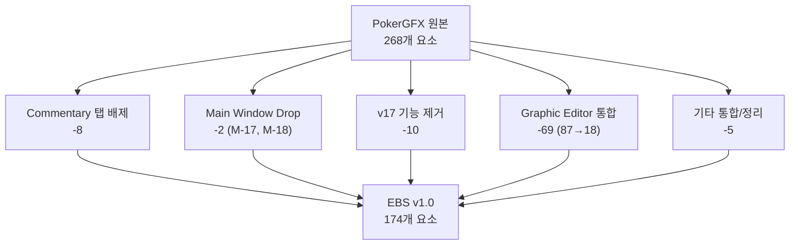
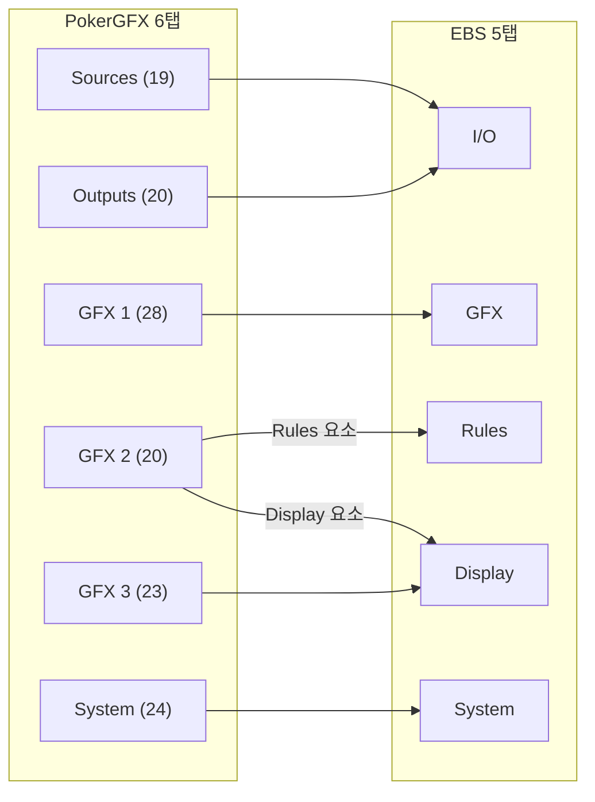
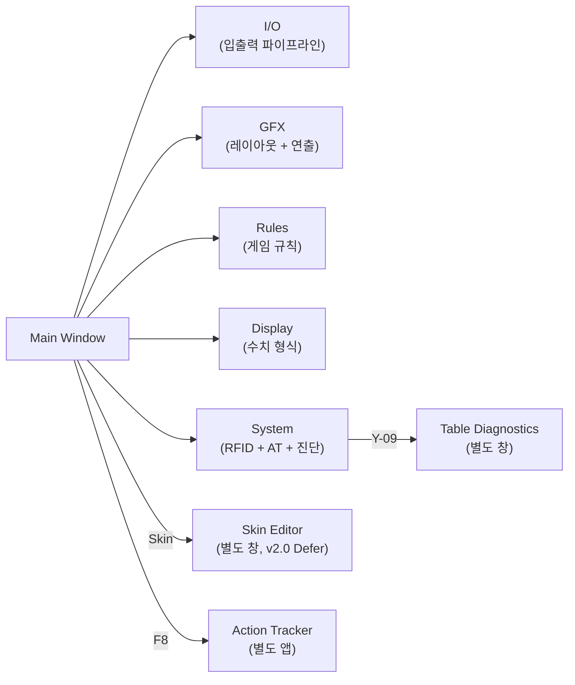
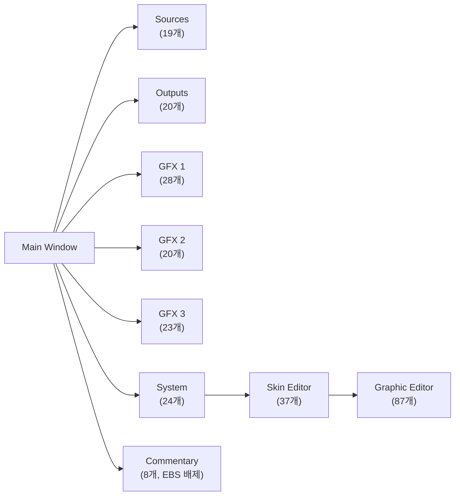
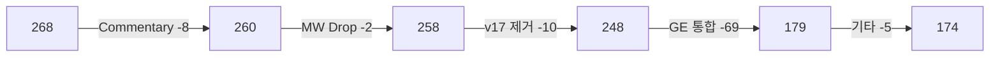

# PRD-0004: EBS Server UI Design

> EBS console v1.0의 UI 설계서. PokerGFX 268개 원본 요소를 분석하고, 174개 EBS 요소로 변환하는 과정을 담는다.
>
> 부속 문서: [기술 명세](PRD-0004-technical-specs.md) · [기능 상호작용](PRD-0004-feature-interactions.md)

---

# Part I: 전체 그림

## 1장. 문서 안내

이 문서는 PokerGFX 268개 UI 요소를 분석하고, EBS console v1.0의 174개 요소로 변환하는 설계서다.

### 읽기 순서

| Part | 내용 | 장 | 독자 |
|:----:|------|:---:|------|
| I | 전체 그림 — 변환 요약과 수치 | 1~2장 | 전원 필독 |
| II | PokerGFX 원본(As-Is) — 6탭 268개 전수 분석 | 3~4장 | 역설계 참조 시 |
| III | 변환 과정 — 6탭→5탭 원칙과 매핑 | 5장 | 설계 결정 확인 시 |
| IV | EBS 설계(To-Be) — 5탭 + Main Window + AT + Editor | 6~13장 | 구현 시 |

> 부속 문서: [기술 명세](PRD-0004-technical-specs.md) · [기능 상호작용](PRD-0004-feature-interactions.md)

### Element ID 체계

| 접두사 | 의미 | 예시 |
|:------:|------|------|
| S | Sources(입력) 요소 | S-01 Video Sources Table |
| O | Outputs(출력) 요소 | O-01 Video Size |
| G | GFX 그래픽 요소 | G-01 Graphic Table |
| Y | System 요소 | Y-03 RFID Reset |
| M | Main Window 요소 | M-01 Title Bar |
| SK | Skin Editor 요소 | SK-01 Skin Name |

이 ID는 문서 간 교차 참조에 사용된다. 각 ID의 상세 정의는 해당 장의 Element Catalog에 있다.

---

## 2장. 268개 → 174개: 변환 전체 지도

### 2.1 감축 요인 분해도

### 2.2 6탭→5탭 변환 맵

### 2.3 v1.0 스코프 요약

| EBS 영역 | v1.0 Keep | v2.0 Defer | Drop |
|---------|:---------:|:----------:|:----:|
| Main Window | 14개 | 0개 | 2개 |
| I/O | 16개 | 6개 | 2개 |
| GFX | 24개 | 4개 | 0개 |
| Rules | 9개 | 3개 | 0개 |
| Display | 13개 | 7개 | 0개 |
| System | 14개 | 8개 | 0개 |

### 2.4 EBS 네비게이션 맵

---

# Part II: PokerGFX 원본 (As-Is)

## 3장. PokerGFX 전체 구조

PokerGFX는 Main Window + 6개 설정 탭 + Skin Editor + Graphic Editor로 구성된다. Commentary 탭(8개)은 EBS에서 배제한다(5장 참조).

### PokerGFX 원본 네비게이션 맵

### 268개 요소 분포

| 화면 | 요소 수 | 역할 |
|------|:-------:|------|
| Main Window | 16개 | 모니터링 + 탭 분기 |
| Sources | 19개 | 비디오 입력 소스 |
| Outputs | 20개 | 출력 파이프라인 |
| GFX 1 | 28개 | 그래픽 배치 + 연출 |
| GFX 2 | 20개 | 표시 설정 + 게임 규칙 |
| GFX 3 | 23개 | 수치 렌더링 |
| System | 24개 | RFID, AT, 진단 |
| Commentary | 8개 | 해설자 오버레이 (EBS 배제) |
| Skin Editor | 37개 | 스킨 테마 편집 |
| Graphic Editor | 87개 | 요소 픽셀 편집 |
| **합계** | **268개** | (Main Window 16개는 PGX 번호 기준) |

---

## 4장. PokerGFX 6탭 Element Catalog

> 이 장은 PokerGFX 원본의 모든 UI 요소를 화면별로 기록한다. 각 요소의 EBS 행선지를 **EBS** 열에 표기한다.
>
> **읽는 법**: 각 화면을 **① 원본 캡처** → **② 분석 오버레이** 순으로 배치했다. 분석 오버레이에서 번호는 Element ID, 빨간 X는 Drop 확정 요소를 나타낸다.

### 4.1 Main Window (16개 요소)

> → EBS 6장 Main Window로 변환

시스템 전체를 한눈에 모니터링하고, 6개 설정 탭으로 분기하는 중앙 통제실. 본방송 중 운영자 주의력의 15%가 여기에 할당된다.

> **① 원본 캡처**:
>
> 
>
> **② 분석 오버레이** *(번호 = Element ID, 빨간 X = Drop)*:
>
> 
>
> 원본 기능 테이블: [PokerGFX-UI-Analysis.md](PokerGFX-UI-Analysis.md) 참조

#### Element Catalog

##### 상태 표시 그룹

| # | 요소 | 타입 | 설명 | PGX | EBS |
|:-:|------|------|------|:---:|:---:|
| M-01 | Title Bar | AppBar | 앱 이름 + 버전 + 윈도우 컨트롤 | #1 | 6장 Keep |
| M-02 | Preview Panel | Canvas | 출력 해상도(O-01)와 동일한 종횡비 유지, Chroma Key Blue, GFX 오버레이 실시간 렌더링. 해상도 정책: 실제 출력은 Full HD(1920×1080) 기준 리사이징. 문서 표기(480×270)는 UI 공간 내 표시 크기로 가독성용 축약 표기. | #2 | 6장 Keep |
| M-03 | CPU Indicator | ProgressBar | CPU 사용률 + 색상 코딩 (Green<60%, Yellow<85%, Red>=85%). 매뉴얼: "The icons on the left indicate CPU and GPU usage. If they turn red, usage is too high for the Server to operate reliably." (p.34) | #3 | 6장 Keep |
| M-04 | GPU Indicator | ProgressBar | GPU 사용률 + 색상 코딩. 동일 기준 | #3 | 6장 Keep |
| M-05 | RFID Status | Icon+Badge | RFID 리더 상태 7색 표시. Green=정상, Grey=보안 링크 수립 중, Blue=미등록 카드 감지, Black=중복 카드 감지, Magenta=중복 카드, Orange=응답 없음, Red=미연결. 매뉴얼 p.34 | #3 | 6장 Keep |
| M-06 | RFID Connection Icon | Icon | RFID 연결 상태 표시 (연결 시 녹색 USB/WiFi 아이콘, 미연결 시 경고 아이콘) | #3 | 6장 Keep |
| ~~M-17~~ | ~~Hand Counter~~ | ~~Badge~~ | ~~현재 세션 핸드 번호 (Hand #47)~~ | ~~신규~~ | Drop |
| ~~M-18~~ | ~~Connection Status~~ | ~~Row~~ | ~~AT/Overlay/DB 각각 Green/Red 표시~~ | ~~신규~~ | Drop |

##### 보안 제어 그룹

| # | 요소 | 타입 | 설명 | PGX | EBS |
|:-:|------|------|------|:---:|:---:|
| M-07 | Lock Toggle | IconButton | 설정 잠금/해제. 잠금 시 모든 탭 설정 변경 불가. 매뉴얼: "Click the Lock symbol next to the Settings button to password protect the Settings Window." (p.33) | #3 | 6장 Keep |

##### 액션 버튼 그룹

| # | 요소 | 타입 | 설명 | PGX | EBS |
|:-:|------|------|------|:---:|:---:|
| M-11 | Reset Hand | ElevatedButton | 현재 핸드 초기화, 확인 다이얼로그 | #5 | 6장 Keep |
| M-12 | Settings | IconButton | 전역 설정 다이얼로그 (테마, 언어, 단축키) | #5 | 6장 Keep |
| M-13 | Register Deck | ElevatedButton | 52장 RFID 일괄 등록, 진행 다이얼로그 | #6 | 6장 Keep |
| M-14 | Launch AT | ElevatedButton | Action Tracker 실행/포커스 전환 | #7 | 6장 Keep |

### 4.2 Sources 탭 (19개 요소)

> → EBS 7장 I/O 탭의 Input 섹션으로 변환

비디오 입력 소스를 등록하고 속성을 조절한다. 자동 카메라 제어 설정도 이 화면에서 한다.

> **① 원본 캡처**:
>
> 
>
> **② 분석 오버레이** *(번호 = Element ID, 빨간 X = Drop)*:
>
> 
>
> 원본 기능 테이블: [PokerGFX-UI-Analysis.md](PokerGFX-UI-Analysis.md) 참조

#### Element Catalog

| # | 그룹 | 요소 | 타입 | 설명 | PGX | EBS |
|:-:|------|------|------|------|:---:|:---:|
| S-00 | Output Mode | Mode Selector | RadioGroup | Fill & Key / Chroma Key / Internal (기본: Fill & Key) | 신규 | 7장 Keep |
| S-01 | Video Sources | Device Table | DataTable | NDI, 캡처 카드, 네트워크 카메라 목록. 매뉴얼: "The Sources tab contains a list of available video sources." (p.35) | #2 | 7장 Keep |
| S-02 | Video Sources | Add Button | TextButton | NDI 자동 탐색 또는 수동 URL | #14 | 7장 Defer |
| S-03 | Video Sources | Settings | IconButton | 해상도, 프레임레이트, 크롭 | #2 | 7장 Keep |
| S-04 | Video Sources | Preview | IconButton | 소스별 미니 프리뷰 | #2 | 7장 Keep |
| S-05 | Camera | Board Cam Hide GFX | Checkbox | 보드 카메라 시 GFX 자동 숨기기. 매뉴얼: "If the 'Hide GFX' option is enabled, all player graphics will be made invisible while the board cam is active." (p.36) | #3 | 7장 Defer |
| S-06 | Camera | Auto Camera Control | Checkbox | 게임 상태 기반 자동 전환 | #4 | 7장 Defer |
| S-07 | Camera | Mode | Dropdown | Static / Dynamic. 매뉴얼: "To display video sources in rotation, select 'Cycle' mode instead of 'Static'." (p.35) | #5,#6 | 7장 Defer |
| S-08 | Camera | Heads Up Split | Checkbox | 헤즈업 화면 분할. 매뉴얼: "When play is heads up, and both players are covered by separate cameras, a split screen view showing each player will automatically be displayed." (p.37) | #7 | 7장 Defer |
| S-09 | Camera | Follow Players | Checkbox | 플레이어 추적. 매뉴얼: "If Action Tracker is enabled, the video will switch to ensure that the player whose turn it is to act is always displayed." (p.37) | #8 | 7장 Defer |
| S-10 | Camera | Follow Board | Checkbox | 보드 추적. 매뉴얼: "When 'Follow Board' is enabled, the video will switch to the community card close-up for a few seconds whenever flop, turn or river cards are dealt." (p.36) | #9 | 7장 Defer |
| S-11 | Background | Enable | Checkbox | 크로마키 활성화. 매뉴얼: "To enable chroma key, enable the 'Chroma Key' checkbox." (p.39) | #13 | 7장 Keep |
| S-12 | Background | Background Colour | ColorPicker | 배경색 (기본 Blue). 매뉴얼: "repeatedly click the 'Background Key Colour' button until the desired colour is selected." (p.39) | #13 | 7장 Keep |
| S-13 | External | Switcher Source | Dropdown | ATEM 스위처 연결 (Fill & Key 필수). 매뉴얼: "When using a camera source for video capture from an external vision switcher, select this capture device using the 'External Switcher Source' dropdown box." (p.38) | #16 | 7장 Keep |
| S-14 | External | ATEM Control | Checkbox+TextField | ATEM IP + 연결 상태 (Fill & Key 필수). 매뉴얼: "PokerGFX can control a Blackmagic ATEM Video Switcher to automatically switch camera inputs to follow the action." (p.40) | #16 | 7장 Keep |
| S-15 | Sync | Board Sync | NumberInput | 보드 싱크 보정 (ms). 매뉴얼: "Delays the detection of community cards by the specified number of milliseconds." (p.38) | #17 | 7장 Defer |
| S-16 | Sync | Crossfade | NumberInput | 크로스페이드 (ms, 기본 300). 매뉴얼: "Setting this value to a higher value between 0.1 and 2.0 causes sources to crossfade." (p.38) | #17 | 7장 Defer |
| S-17 | Audio | Input Source | Dropdown | 오디오 소스 선택. 매뉴얼: "Select the desired audio capture device and volume." (p.38) | #15 | 7장 Keep |
| S-18 | Audio | Audio Sync | NumberInput | 오디오 싱크 보정 (ms) | #15 | 7장 Keep |

### 4.3 Outputs 탭 (20개 요소)

> → EBS 7장 I/O 탭의 Output 섹션으로 변환

출력 파이프라인을 설정한다. Delay 이중 출력은 추후 개발 범위이며, 현재는 Live 단일 출력 구조로 설계한다.

> **① 원본 캡처**:
>
> 
>
> **② 분석 오버레이** *(번호 = Element ID, 빨간 X = Drop)*:
>
> 
>
> 원본 기능 테이블: [PokerGFX-UI-Analysis.md](PokerGFX-UI-Analysis.md) 참조

#### Element Catalog

| # | 그룹 | 요소 | 설명 | PGX | EBS |
|:-:|------|------|------|:---:|:---:|
| O-01 | Resolution | Video Size | 1080p/4K 출력 해상도. 매뉴얼: "Select the desired resolution and frame rate of the video output." (p.42) | #1 | 7장 Keep |
| O-02 | Resolution | 9x16 Vertical | 세로 모드 (모바일). 매뉴얼: "PokerGFX supports vertical video natively by enabling the '9x16 Vertical' checkbox." (p.43) | #2 | Drop |
| O-03 | Resolution | Frame Rate | 30/60fps | #3 | 7장 Keep |
| O-04 | Live | Video/Audio/Device | Live 파이프라인 3개 드롭다운. 매뉴얼: "Sends the live and/or delayed video and audio feed to a Blackmagic Decklink device output (if installed), or to an NDI stream on the local network." (p.42) | #4 | 7장 Keep |
| O-05 | Live | Key & Fill | Live Fill & Key 출력 (DeckLink 채널 할당). 매뉴얼: "When an output device that supports external keying is selected, the 'Key & Fill' checkbox is enabled. Activating this feature causes separate key & fill signals to be sent to 2 SDI connectors on the device." (p.43) | #4 | 7장 Keep |
| O-06 | Delay | Video/Audio/Device | Delay 파이프라인 (Live와 독립) | #5 | 7장 Defer |
| O-07 | Delay | Key & Fill | Delay Fill & Key 출력 (DeckLink 채널 할당) | #5 | 7장 Defer |
| O-14 | Virtual | Camera | 가상 카메라 (OBS 연동). 매뉴얼: "Sends the video and audio feed (live OR delayed, depending on this setting) to the POKERGFX VCAM virtual camera device." (p.43) | #6 | 7장 Defer |
| O-15 | Recording | Mode | Video / Video+GFX / GFX only | #7 | 7장 Defer |
| O-16 | Streaming | Platform | Twitch/YouTube/Custom RTMP | #13 | 7장 Defer |
| O-17 | Streaming | Account Connect | OAuth 연결 | #13 | 7장 Defer |
| O-18 | Fill & Key | Key Color | Key 신호 배경색 (기본: #FF000000) | 신규 | 7장 Keep |
| O-19 | Fill & Key | Fill/Key Preview | Fill 신호와 Key 신호 나란히 미리보기 | 신규 | 7장 Keep |
| O-20 | Fill & Key | DeckLink Channel Map | Live Fill/Key → DeckLink 포트 매핑 (Delay 추가 시 확장) | 신규 | 7장 Keep |

### 4.4 GFX 1 탭 (28개 요소)

> → EBS 8장 GFX 탭으로 변환

GFX 1은 그래픽 배치(어디에)와 연출(어떤 방식으로)을 담당한다. PokerGFX 원본의 GFX 1 탭 구조를 직접 계승한다.

> **① 원본 캡처**:
>
> 
>
> **② 분석 오버레이** *(번호 = Element ID, 빨간 X = Drop)*:
>
> 

> 원본 기능 테이블: [PokerGFX-UI-Analysis.md](PokerGFX-UI-Analysis.md) 참조

#### Element Catalog

##### Layout 그룹 (배치)

| # | 요소 | 타입 | 설명 | PGX | EBS |
|:-:|------|------|------|:---:|:---:|
| G-01 | Board Position | Dropdown | 보드 카드 위치 (Left/Right/Centre/Top). 매뉴얼: "Position of the Board graphic (shows community cards, pot size and optionally blind levels). Choices are LEFT, CENTRE and RIGHT." (p.48) | GFX1 #2 | 8장 Keep |
| G-02 | Player Layout | Dropdown | 플레이어 배치. Horizontal, Vert/Bot/Spill, Vert/Bot/Fit, Vert/Top/Spill, Vert/Top/Fit | GFX1 #3 | 8장 Keep |
| G-03 | X Margin | NumberInput | 좌우 여백 (%, 기본 0.04). 매뉴얼: "This setting controls the size of the horizontal margins. Valid values are between 0 and 1." (p.49) | GFX1 #20 | 8장 Keep |
| G-04 | Top Margin | NumberInput | 상단 여백 (%, 기본 0.05) | GFX1 #21 | 8장 Keep |
| G-05 | Bot Margin | NumberInput | 하단 여백 (%, 기본 0.04) | GFX1 #22 | 8장 Keep |
| G-06 | Leaderboard Position | Dropdown | 리더보드 위치. 매뉴얼: "Selects the position of the Leaderboard graphic." (p.49) | GFX1 #7 | 8장 Keep |
| G-07 | Heads Up Layout L/R | Dropdown | 헤즈업 화면 분할 배치. 매뉴얼: "Overrides the player layout when players are heads-up." (p.48) | GFX1 #10 | 8장 Defer |
| G-08 | Heads Up Camera | Dropdown | 헤즈업 카메라 위치 | GFX1 #11 | 8장 Defer |
| G-09 | Heads Up Custom Y | Checkbox+NumberInput | Y축 미세 조정. 매뉴얼: "Use this to specify the vertical position of player graphics when Heads Up layout is active." (p.48) | GFX1 #12 | 8장 Defer |
| G-10 | Sponsor Logo 1 | ImageSlot | Leaderboard 스폰서. 매뉴얼: "Displays a sponsor logo at the top of the Leaderboard. NOTE: Pro only." (p.50) | GFX1 #16 | 8장 Keep |
| G-11 | Sponsor Logo 2 | ImageSlot | Board 스폰서. 매뉴얼: "Displays a sponsor logo to the side of the Board. NOTE: Pro only." (p.50) | GFX1 #17 | 8장 Keep |
| G-12 | Sponsor Logo 3 | ImageSlot | Strip 스폰서. 매뉴얼: "Displays a sponsor logo at the left-hand end of the Strip. NOTE: Pro only." (p.50) | GFX1 #18 | 8장 Keep |
| G-13 | Vanity Text | TextField+Checkbox | 테이블 텍스트 + Game Variant 대체 | GFX1 #19 | 8장 Keep |

##### Visual 그룹 (연출)

| # | 요소 | 타입 | 설명 | PGX | EBS |
|:-:|------|------|------|:---:|:---:|
| G-14 | Reveal Players | Dropdown | 카드 공개 시점. 매뉴얼: "Determines when players are shown: Immediate / On Action / After Bet / On Action + Next" (p.50) | GFX1 #4 | 8장 Keep |
| G-15 | How to Show Fold | Dropdown+NumberInput | 폴드 표시. Immediate / Delayed | GFX1 #5 | 8장 Keep |
| G-16 | Reveal Cards | Dropdown | 카드 공개 연출. Immediate / After Action / End of Hand / Showdown Cash / Showdown Tourney / Never | GFX1 #6 | 8장 Keep |
| G-17 | Transition In | Dropdown+NumberInput | 등장 애니메이션 + 시간 | GFX1 #8 | 8장 Keep |
| G-18 | Transition Out | Dropdown+NumberInput | 퇴장 애니메이션 + 시간 | GFX1 #9 | 8장 Keep |
| G-19 | Indent Action Player | Checkbox | 액션 플레이어 들여쓰기 | GFX1 #24 | 8장 Keep |
| G-20 | Bounce Action Player | Checkbox | 액션 플레이어 바운스 | GFX1 #25 | 8장 Keep |
| G-21 | Action Clock | NumberInput | 카운트다운 임계값 (초) | GFX1 #29 | 8장 Keep |
| G-22 | Show Leaderboard | Checkbox+Settings | 핸드 후 리더보드 자동 표시 | GFX1 #26 | 8장 Keep |
| G-23 | Show PIP Capture | Checkbox+Settings | 핸드 후 PIP 표시 | GFX1 #27 | 8장 Defer |
| G-24 | Show Player Stats | Checkbox+Settings | 핸드 후 티커 통계 | GFX1 #28 | 8장 Defer |
| G-25 | Heads Up History | Checkbox | 헤즈업 히스토리 | GFX1 #23 | 8장 Defer |

##### Skin 그룹

| # | 요소 | 타입 | 설명 | PGX | EBS |
|:-:|------|------|------|:---:|:---:|
| G-13s | Skin Info | Label | 현재 스킨명 + 용량 (`Titanium, 1.41 GB`) | GFX1 #13 | 8장 Keep |
| G-14s | Skin Editor | TextButton | 별도 창 스킨 편집기 실행 | GFX1 #14 | 8장 Defer |
| G-15s | Media Folder | TextButton | 스킨 미디어 폴더 탐색기 | GFX1 #15 | 8장 Defer |

### 4.5 GFX 2 탭 (20개 요소)

> → EBS 9장 Rules 탭 + 10장 Display 탭으로 분리 변환

GFX 2는 표시 설정(무엇을 보여줄지)과 게임 규칙(어떤 규칙으로)을 담당한다. PokerGFX 원본의 GFX 2 탭 구조를 직접 계승한다.

> **① 원본 캡처**:
>
> 
>
> **② 분석 오버레이** *(번호 = Element ID, 빨간 X = Drop)*:
>
> 

> 원본 기능 테이블: [PokerGFX-UI-Analysis.md](PokerGFX-UI-Analysis.md) 참조

#### Element Catalog

##### Leaderboard 그룹

| # | 요소 | 타입 | 설명 | PGX | EBS |
|:-:|------|------|------|:---:|:---:|
| G-26 | Show Knockout Rank | Checkbox | 녹아웃 순위 | GFX2 #2 | 10장 Defer |
| G-27 | Show Chipcount % | Checkbox | 칩카운트 퍼센트 | GFX2 #3 | 10장 Defer |
| G-28 | Show Eliminated | Checkbox | 탈락 선수 표시 | GFX2 #4 | 10장 Defer |
| G-29 | Cumulative Winnings | Checkbox | 누적 상금 | GFX2 #5 | 10장 Defer |
| G-30 | Hide Leaderboard | Checkbox | 핸드 시작 시 숨김 | GFX2 #6 | 10장 Defer |
| G-31 | Max BB Multiple | NumberInput | BB 배수 상한 | GFX2 #7 | 10장 Defer |

##### Player Display 그룹

| # | 요소 | 타입 | 설명 | PGX | EBS |
|:-:|------|------|------|:---:|:---:|
| G-32 | Add Seat # | Checkbox | 좌석 번호 추가 | GFX2 #12 | 9장 Keep |
| G-33 | Show as Eliminated | Checkbox | 스택 소진 시 탈락 | GFX2 #13 | 9장 Keep |
| G-34 | Unknown Cards Blink | Checkbox | 미확인 카드 깜빡임 (RFID 미인식 시각 경보) | GFX2 #15 | 9장 Defer |
| G-35 | Clear Previous Action | Checkbox | 이전 액션 초기화 | GFX2 #17 | 9장 Keep |
| G-36 | Order Players | Dropdown | 플레이어 정렬 순서 | GFX2 #18 | 9장 Keep |

##### Equity 그룹

| # | 요소 | 타입 | 설명 | PGX | EBS |
|:-:|------|------|------|:---:|:---:|
| G-37 | Show Hand Equities | Dropdown | Equity 표시 시점 (방송 긴장감 직결) | GFX2 #19 | 10장 Defer |
| G-38 | Hilite Winning Hand | Dropdown | 위닝 핸드 강조 시점 | GFX2 #20 | 9장 Keep |
| G-39 | Hilite Nit Game | Dropdown | 닛 게임 강조 조건 | GFX2 #16 | 9장 Defer |

##### Game Rules 그룹

| # | 요소 | 타입 | 설명 | PGX | EBS |
|:-:|------|------|------|:---:|:---:|
| G-52 | Move Button Bomb Pot | Checkbox | 봄팟 후 버튼 이동 | GFX2 #8 | 9장 Keep |
| G-53 | Limit Raises | Checkbox | 유효 스택 기반 레이즈 제한 | GFX2 #9 | 9장 Keep |
| G-54 | Allow Rabbit Hunting | Checkbox | 래빗 헌팅 허용 | GFX2 #14 | 9장 Defer |
| G-55 | Straddle Sleeper | Dropdown | 스트래들 위치 규칙 | GFX2 #10 | 9장 Keep |
| G-56 | Sleeper Final Action | Dropdown | 슬리퍼 최종 액션 | GFX2 #11 | 9장 Keep |
| G-57 | Ignore Split Pots | Checkbox | Equity/Outs에서 Split pot 무시 | GFX2 #21 | 10장 Defer |

### 4.6 GFX 3 탭 (23개 요소)

> → EBS 10장 Display 탭으로 변환

GFX 3은 수치 렌더링(어떤 형식으로)을 담당한다. PokerGFX 원본의 GFX3 탭 구조를 직접 계승한다.

> **① 원본 캡처**:
>
> 
>
> **② 분석 오버레이** *(번호 = Element ID, 빨간 X = Drop)*:
>
> 

> 원본 기능 테이블: [PokerGFX-UI-Analysis.md](PokerGFX-UI-Analysis.md) 참조

#### Element Catalog

##### Outs & Strip 그룹

| # | 요소 | 타입 | 설명 | PGX | EBS |
|:-:|------|------|------|:---:|:---:|
| G-40 | Show Outs | Dropdown | 아웃츠 조건 (Heads Up/All In/Always) | GFX3 #2 | 10장 Defer |
| G-41 | Outs Position | Dropdown | 아웃츠 위치 | GFX3 #3 | 10장 Defer |
| G-42 | True Outs | Checkbox | 정밀 아웃츠 계산 | GFX3 #4 | 10장 Defer |
| G-43 | Score Strip | Dropdown | 하단 스코어 스트립 | GFX3 #5 | 10장 Defer |
| G-44 | Order Strip By | Dropdown | 스트립 정렬 기준 | GFX3 #6 | 10장 Defer |

##### Blinds & Currency 그룹

| # | 요소 | 타입 | 설명 | PGX | EBS |
|:-:|------|------|------|:---:|:---:|
| G-45 | Show Blinds | Dropdown | 블라인드 표시 조건 | GFX3 #8 | 10장 Keep |
| G-46 | Show Hand # | Checkbox | 핸드 번호 표시 | GFX3 #9 | 10장 Keep |
| G-47 | Currency Symbol | TextField | 통화 기호 (한국 방송: ₩) | GFX3 #10 | 10장 Keep |
| G-48 | Trailing Currency | Checkbox | 후치 통화 기호 | GFX3 #11 | 10장 Keep |
| G-49 | Divide by 100 | Checkbox | 금액 100분의 1 | GFX3 #12 | 10장 Keep |

##### Precision & Mode 그룹

| # | 요소 | 타입 | 설명 | PGX | EBS |
|:-:|------|------|------|:---:|:---:|
| G-50 | Chipcount Precision | PrecisionGroup | 8개 영역별 수치 형식 (Leaderboard/Player Stack/Action/Blinds/Pot/TwitchBot/Ticker/Strip) | GFX3 #13-20 | 10장 Keep (5개) / Defer (3개) |
| G-51 | Display Mode | ModeGroup | Amount vs BB 전환 (Chipcounts/Pot/Bets) | GFX3 #21-23 | 10장 Keep |

### 4.7 System 탭 (24개 요소)

> → EBS 11장 System 탭으로 변환

RFID, Action Tracker 연결, 시스템 진단을 담당한다. RFID를 상단으로 이동하여 준비 첫 단계에 배치했다.

> **① 원본 캡처**:
>
> 
>
> **② 분석 오버레이** *(번호 = Element ID, 빨간 X = Drop)*:
>
> 

> 원본 기능 테이블: [PokerGFX-UI-Analysis.md](PokerGFX-UI-Analysis.md) 참조

#### Element Catalog

| # | 그룹 | 요소 | 설명 | PGX | EBS |
|:-:|------|------|------|:---:|:---:|
| Y-01 | Table | Name | 테이블 식별 이름. 매뉴얼: "Enter an optional name for this table. This is required when using MultiGFX mode." (p.60) | #2 | 11장 Keep |
| Y-02 | Table | Password | 접속 비밀번호. 매뉴얼: "Password for this table. Anyone attempting to use Action Tracker with this table will be required to enter this password." (p.60) | #3 | 11장 Keep |
| Y-03 | RFID | Reset | RFID 시스템 초기화. 매뉴얼: "Resets the RFID Reader connection, as if PokerGFX had been closed and restarted." (p.60) | #4 | 11장 Keep |
| Y-04 | RFID | Calibrate | 안테나별 캘리브레이션. 매뉴얼: "Perform the once-off table calibration procedure, which 'teaches' the table about its physical configuration." (p.60) | #5 | 11장 Keep |
| Y-05 | RFID | UPCARD Antennas | UPCARD 안테나로 홀카드 읽기. 매뉴얼: "Enables all antennas configured for reading UPCARDS in STUD games to also detect hole cards when playing any flop or draw game." (p.59) | #22 | 11장 Keep |
| Y-06 | RFID | Disable Muck | AT 모드 시 muck 안테나 비활성. 매뉴얼: "Causes the muck antenna to be disabled when in Action Tracker mode." (p.59) | #23 | 11장 Keep |
| Y-07 | RFID | Disable Community | 커뮤니티 카드 안테나 비활성 | #24 | 11장 Keep |
| Y-08 | System Info | Hardware Panel | CPU/GPU/OS/Encoder 자동 감지 | #11 | 11장 Defer |
| Y-09 | Diagnostics | Table Diagnostics | 안테나별 상태, 신호 강도 (별도 창). 매뉴얼: "Displays a diagnostic window that displays the physical table configuration along with how many cards are currently detected on each antenna." (p.60) | #10 | 11장 Keep |
| Y-10 | Diagnostics | System Log | 로그 뷰어 | #12 | 11장 Keep |
| Y-12 | Diagnostics | Export Folder | 내보내기 폴더. 매뉴얼: "When the Developer API is enabled, use this to specify the location for writing the JSON hand history files." (p.60) | #14 | 11장 Keep |
| Y-13 | AT | Allow AT Access | AT 접근 허용. 매뉴얼: "'Track the action' can only be started from Action Tracker if this option is enabled." (p.58) | #26 | 11장 Keep |
| Y-14 | AT | Predictive Bet | 베팅 예측 입력. 매뉴얼: "Action Tracker will auto-complete bets and raises based on the initial digits entered, min raise amount and stack size." (p.60) | #27 | 11장 Keep |
| Y-15 | AT | Kiosk Mode | AT 키오스크 모드. 매뉴얼: "When the Server starts, Action Tracker is automatically started on the same PC on the secondary display in kiosk mode." (p.58) | #28 | 11장 Keep |
| Y-16 | Advanced | MultiGFX | 다중 테이블 운영. 매뉴얼: "Forces PokerGFX to sync to another primary PokerGFX running on a different, networked computer." (p.58) | #16 | 11장 Defer |
| Y-17 | Advanced | Sync Stream | 스트림 동기화 | #17 | 11장 Defer |
| Y-18 | Advanced | Sync Skin | 스킨 동기화. 매뉴얼: "Causes the secondary MultiGFX server skin to auto update from the skin that is currently active on the primary server." (p.58) | #18 | 11장 Defer |
| Y-19 | Advanced | No Cards | 카드 비활성화 | #19 | 11장 Defer |
| Y-20 | Advanced | Disable GPU | GPU 인코딩 비활성화 | #20 | 11장 Defer |
| Y-21 | Advanced | Ignore Name Tags | 네임 태그 무시. 매뉴얼: "When enabled, player ID tags are ignored; player names are entered manually in Action Tracker." (p.59) | #21 | 11장 Defer |
| Y-22 | Advanced | Auto Start | OS 시작 시 자동 실행 | 신규 | 11장 Keep |
| Y-23 | Advanced | Stream Deck | Elgato Stream Deck 매핑 | #15 | 11장 Defer |
| Y-24 | Updates | Version + Check | 버전 표시 + 업데이트 확인 | #7,#8 | 11장 Defer |

> **Y-05 주의**: Y-05는 반드시 **UPCARD Antennas** (WiFi Connect로 재할당 금지)

---

# Part III: 변환 과정 (Transformation)

## 5장. 6탭 → 5탭 변환

### 5.1 변환 원칙

PokerGFX 6탭은 방송 준비 워크플로우 순서로 배치되어 있다(System → Sources → Outputs → GFX 1 → GFX 2 → GFX 3). EBS 5탭은 이 흐름을 유지하되, 기능 응집도(cohesion) 기준으로 재편한다.

**핵심 관찰**: Sources(입력)와 Outputs(출력)는 물리적 파이프라인의 양 끝이며 운영 문맥이 동일하다. 함께 보는 것이 설정 오류를 줄인다. GFX 1/2/3은 "배치", "규칙", "수치 형식"으로 기능이 다르지만 하나의 탭에 혼재되어 혼란을 유발한다.

| 관찰 (v21 출처) | 변환 결정 |
|----------------|----------|
| Sources: ATEM 설정이 출력 모드와 무관하게 항상 노출 → 혼란 | I/O 탭에서 Fill & Key 모드 조건부 표시 |
| Outputs: Live/Delay 2열이 동일 화면에서 병렬 관리 | I/O 탭에서 단일 뷰로 통합 |
| GFX 1: 레이아웃(배치)과 규칙 요소(Reveal, Fold)가 혼재 | GFX 탭(배치/연출)과 Rules 탭(규칙) 분리 |
| GFX 2: 게임 규칙과 Leaderboard 옵션이 혼재 | Rules 탭(게임 규칙)과 Display 탭(표시 옵션) 분리 |
| GFX 3: 수치 형식 전담이지만 탭 이름이 불명확 | Display 탭으로 통합, 이름 명확화 |
| System: RFID 안테나가 하단 배치 → 준비 첫 단계인데 위치 어색 | System 탭 내 RFID 상단 이동 유지 |

### 5.2 Commentary 배제 결정 (-8)

**결정**: Commentary 탭 8개 요소 전체 EBS 완전 배제. 불필요 분류.

> **Commentary 탭 원본** *(전체 Drop — 빨간 X 8개)*:
>
> 

| 배제 근거 | 상세 |
|----------|------|
| 운영팀 미사용 확정 | 기존 포커 방송 프로덕션에서 Commentary 기능을 사용한 적이 없음. 해설자 정보는 별도 그래픽 소스(OBS Scene)로 처리 |
| 운영 방식 불일치 | 해설자 원격 접속 기능 자체가 EBS 현장 운영 방식과 불일치 |
| 우선순위 최하위 | 8개 요소 전체 불필요 분류. 복제하더라도 운영 워크플로우에 투입될 가능성 없음 |
| 개발 리소스 집중 | 핵심 기능(RFID, AT, GFX 연출)에 집중. Commentary 복제는 낭비 |

Commentary 탭 원본 구성(8개): Commentary ON/OFF 토글(SV-021), Commentator Name 1/2, Commentary Display Mode, Show Commentator Names, Commentary PIP(SV-022), PIP Size, PIP Position.

향후 해설자 오버레이가 필요해질 경우 GFX-Visual 서브탭의 확장으로 대응 가능하며, 별도 탭으로 구현하지 않는다.

### 5.3 6탭→5탭 매핑 테이블

| PokerGFX 원본 탭 | 요소 | EBS 탭 | 처리 방식 |
|-----------------|------|--------|---------|
| Sources | S-01, S-03, S-04, S-11~S-18 | I/O | Input 섹션 |
| Outputs | O-01, O-03~O-05, O-18~O-20 | I/O | Output 섹션 |
| GFX 1 Layout | G-01~G-06 | GFX | Layout 서브그룹 |
| GFX 1 Card & Player | G-14~G-16, G-21~G-23 | GFX | Card & Player 서브그룹 |
| GFX 1 Animation | G-17~G-20 | GFX | Animation 서브그룹 |
| GFX 1 Skin/Branding | G-10~G-13, G-13s~G-15s, G-22s | GFX | Branding 서브그룹 |
| GFX 1 Heads Up | G-07~G-09 | GFX | v2.0 Defer |
| GFX 2 Game Rules | G-52, G-53, G-55, G-56 | Rules | Game Rules 서브그룹 |
| GFX 2 Player Display | G-32, G-33, G-35, G-36, G-38 | Rules | Player Display 서브그룹 |
| GFX 3 Blinds/Currency | G-45~G-49 | Display | Blinds 서브그룹 |
| GFX 3 Precision (핵심 5개) | G-50a~G-50e | Display | Precision 서브그룹 |
| GFX 3 Mode | G-51a~G-51c | Display | Mode 서브그룹 |
| GFX 3 Outs | G-40~G-42 | Display | Outs 서브그룹 |
| System | Y-01~Y-02, Y-03~Y-07, Y-09~Y-11, Y-13~Y-15, Y-22 | System | 전체 계승 |

### 5.4 감축 상세

| 감축 요인 | 감축 수 |
|----------|:-------:|
| Commentary 탭 8개 배제 | -8 |
| M-17 Hand Counter Drop | -1 |
| M-18 Connection Status Drop | -1 |
| Secure Delay/Recording/Split Recording/Tag Player 등 제거 (v17.0.0) | -10 |
| Graphic Editor Board/Player 단일 통합 (87→18) | -69 |
| 기타 요소 통합/정리 | -5 |
| **합계** | **-94** |

268개(PokerGFX 원본) - 94개(감축) = **174개(EBS v1.0 기준)**

---

# Part IV: EBS 설계 (To-Be)

## 6장. Main Window

> **원본 매핑**: 4.1절(Main Window)에서 도출. 16개 중 14개 Keep, 2개 Drop.

시스템 전체를 한눈에 모니터링하고, 5개 설정 탭으로 분기하는 중앙 통제실. 본방송 중 운영자 주의력의 15%가 여기에 할당된다.

**원본 캡쳐 참조**

> 오버레이: 

### Element Catalog (14개 Keep, 2개 Drop)

#### 상태 표시 그룹

| # | 요소 | 타입 | v1.0 | 설명 | 원본 |
|:-:|------|------|:----:|------|:----:|
| M-01 | Title Bar | AppBar | Keep | 앱 이름 + 버전 + 윈도우 컨트롤 | PGX #1 |
| M-02 | Preview Panel | Canvas | Keep | 출력 해상도(O-01)와 동일한 종횡비 유지, Chroma Key Blue, GFX 오버레이 실시간 렌더링. 해상도 정책: 실제 출력은 Full HD(1920×1080) 기준 리사이징. 문서 표기(480×270)는 UI 공간 내 표시 크기로 가독성용 축약 표기. | PGX #2 |
| M-03 | CPU Indicator | ProgressBar | Keep | CPU 사용률 + 색상 코딩 (Green<60%, Yellow<85%, Red>=85%). 매뉴얼: "The icons on the left indicate CPU and GPU usage. If they turn red, usage is too high for the Server to operate reliably." (p.34) | PGX #3 |
| M-04 | GPU Indicator | ProgressBar | Keep | GPU 사용률 + 색상 코딩. 동일 기준 | PGX #3 |
| M-05 | RFID Status | Icon+Badge | Keep | RFID 리더 상태 7색 표시. Green=정상, Grey=보안 링크 수립 중, Blue=미등록 카드 감지, Black=중복 카드 감지, Magenta=중복 카드, Orange=응답 없음, Red=미연결. 매뉴얼 p.34 | PGX #3 |
| M-06 | RFID Connection Icon | Icon | Keep | RFID 연결 상태 표시 (연결 시 녹색 USB/WiFi 아이콘, 미연결 시 경고 아이콘) | PGX #3 |

#### 보안 제어 그룹

| # | 요소 | 타입 | v1.0 | 설명 | 원본 |
|:-:|------|------|:----:|------|:----:|
| M-07 | Lock Toggle | IconButton | Keep | 설정 잠금/해제. 잠금 시 모든 탭 설정 변경 불가. 매뉴얼: "Click the Lock symbol next to the Settings button to password protect the Settings Window." (p.33) | PGX #3 |

#### 액션 버튼 그룹

| # | 요소 | 타입 | v1.0 | 설명 | 원본 |
|:-:|------|------|:----:|------|:----:|
| M-11 | Reset Hand | ElevatedButton | Keep | 현재 핸드 초기화, 확인 다이얼로그 | PGX #5 |
| M-12 | Settings | IconButton | Keep | 전역 설정 다이얼로그 (테마, 언어, 단축키) | PGX #5 |
| M-13 | Register Deck | ElevatedButton | Keep | 52장 RFID 일괄 등록, 진행 다이얼로그 | PGX #6 |
| M-14 | Launch AT | ElevatedButton | Keep | Action Tracker 실행/포커스 전환 (F8 단축키 동일) | PGX #7 |

#### Tab Navigation

| # | 요소 | 타입 | v1.0 | 설명 | 원본 |
|:-:|------|------|:----:|------|:----:|
| M-08 | Tab Bar | TabBar | Keep | I/O · GFX · Rules · Display · System 5탭 네비게이션 | PGX |
| M-09 | Status Bar | StatusBar | Keep | 하단 상태 표시줄 | PGX |
| M-10 | Shortcut Bar | ToolBar | Keep | 단축키 안내 바 | PGX |

#### Drop 요소

| # | 요소 | Drop 사유 |
|:-:|------|----------|
| ~~M-17~~ | ~~Hand Counter~~ | AT 앱에서 핸드 번호를 관리하므로 Main Window 중복 표시 불필요 |
| ~~M-18~~ | ~~Connection Status~~ | AT 연결 단절 시 AT 앱 자체에서 재연결 알림을 제공하므로 GfxServer 중복 표시 불필요. 운영자가 AT를 주시(85%)하는 상황에서 GfxServer Main Window(15%)에서 추가 모니터링 행위를 요구하는 것은 인지 부하 증가 |

---

## 7장. I/O 탭 (Sources+Outputs 통합)

> **위치**: Main Window > **[I/O]** > GFX > Rules > Display > System
>
> **원본 매핑**: 4.2절(Sources) + 4.3절(Outputs)에서 도출.

Sources와 Outputs를 단일 탭으로 통합한 입출력 파이프라인 설정 화면. 운영자가 "카메라가 어디서 들어오고, 방송이 어디로 나가는지"를 한 화면에서 파악하고 설정한다.

**원본 캡쳐 참조**

**오버레이 분석본 참조**

### 레이아웃

2섹션: Input(상단, Sources 계승) + Output(하단, Outputs 계승). Output Mode Selector(S-00)가 탭 최상단에 위치하여 Fill & Key / Chroma Key / Internal 모드를 선택하면 하위 항목 조건부 표시.

### Element Catalog

#### Input 섹션 (9개 요소, v1.0 Keep)

| # | 요소 | 타입 | v1.0 | 설명 | 원본 |
|:-:|------|------|:----:|------|:----:|
| S-01 | Video Sources Table | DataTable | Keep | NDI/캡처카드/네트워크 카메라 목록. 매뉴얼: "The Sources tab contains a list of available video sources. These include USB cameras, video capture cards installed in the system and NDI sources detected on the local network." (p.35) | S-01 |
| S-03 | Source Settings | IconButton | Keep (복원) | 해상도/프레임레이트/크롭 설정. 매뉴얼: "To edit the properties of the video source, click on the 'Settings' keyword. A properties window will open enabling additional camera settings to be changed." (p.35) | S-03 |
| S-04 | Source Preview | IconButton | Keep (복원) | 소스별 미니 프리뷰 | S-04 |
| S-11 | Chroma Key Enable | Checkbox | Keep | 크로마키 활성화. 매뉴얼: "To enable chroma key, enable the 'Chroma Key' checkbox." (p.39) | S-11 |
| S-12 | Background Colour | ColorPicker | Keep | 배경색 설정 (기본 Blue #0000FF) | S-12 |
| S-13 | Switcher Source | Dropdown | Keep | ATEM 스위처 연결. Fill & Key 모드에서만 표시. 매뉴얼: "When using a camera source for video capture from an external vision switcher, select this capture device using the 'External Switcher Source' dropdown box." (p.38) | S-13 |
| S-14 | ATEM Control | Checkbox+TextField | Keep (수동만 v1.0) | ATEM IP 입력 + 연결 상태. Fill & Key 모드에서만 표시. v1.0은 수동 IP 입력만 구현. 매뉴얼: "PokerGFX can control a Blackmagic ATEM Video Switcher to automatically switch camera inputs to follow the action." (p.40) | S-14 |
| S-17 | Audio Input Source | Dropdown | Keep | 오디오 소스 선택. 매뉴얼: "Select the desired audio capture device and volume. The Sync setting adjusts the timing of the audio signal to match the video, if required." (p.38) | S-17 |
| S-18 | Audio Sync | NumberInput | Keep | 오디오 싱크 보정 (ms) | S-18 |

> **v2.0 활성화**: S-02(Add Network Camera), S-05~S-10(카메라 자동 제어 — Auto Camera Control 전제), S-15~S-16(Board Sync/Crossfade — 고급 방송 장비 환경 전제).

#### Output 섹션 (7개 요소, v1.0 Keep)

| # | 요소 | 타입 | v1.0 | 설명 | 원본 |
|:-:|------|------|:----:|------|:----:|
| O-01 | Video Size | Dropdown | Keep | 출력 해상도 (1080p/4K). 매뉴얼: "Select the desired resolution and frame rate of the video output." (p.42) | O-01 |
| O-03 | Frame Rate | Dropdown | Keep | 30/60fps 선택 | O-03 |
| O-04 | Live Video/Audio/Device | DropdownGroup | Keep | Live 파이프라인 3개 드롭다운. 매뉴얼: "Sends the live and/or delayed video and audio feed to a Blackmagic Decklink device output (if installed), or to an NDI stream on the local network." (p.42) | O-04 |
| O-05 | Live Key & Fill | Checkbox | Keep | Live Fill & Key 출력. 매뉴얼: "When an output device that supports external keying is selected, the 'Key & Fill' checkbox is enabled." (p.43) | O-05 |
| O-18 | Fill & Key Color | ColorPicker | Keep | Key 신호 배경색 (기본 #FF000000). EBS 신규 추가 요소. | O-18 |
| O-19 | Fill/Key Preview | DualPreview | Keep | Fill 신호와 Key 신호 나란히 미리보기. EBS 신규 추가 요소. | O-19 |
| O-20 | DeckLink Channel Map | ChannelMap | Keep | Live Fill/Key → DeckLink 포트 매핑. EBS 신규 추가 요소. | O-20 |

> **v2.0 Defer**: O-06~O-07(Delay 파이프라인), O-14(Virtual Camera), O-15(Recording Mode), O-16~O-17(Streaming 플랫폼 연동).
> **Drop**: O-02(9x16 Vertical — SV-010 Drop 확정, 세로 모드 출력은 EBS 방송 범위 외).

---

## 8장. GFX 탭 (GFX 1 핵심 유지)

> **위치**: Main Window > I/O > **[GFX]** > Rules > Display > System
>
> **원본 매핑**: 4.4절(GFX 1)에서 도출. GFX 1 Skin 그룹 + GFX 2의 G-22s를 Branding 서브그룹에 통합.

GFX 1 탭을 직접 계승하는 배치/연출 설정 화면. 보드와 플레이어 그래픽의 위치, 카드 공개 방식, 등장/퇴장 애니메이션, 스킨 정보를 설정한다.

**원본 캡쳐 참조**

**오버레이 분석본 참조**

### 레이아웃

4서브그룹: Layout(G-01~G-06) > Card & Player(G-14~G-16, G-21~G-23) > Animation(G-17~G-20) > Branding(G-10~G-13, G-13s~G-15s, G-22s).

### Element Catalog

#### Layout 서브그룹 (6개, v1.0 Keep)

| # | 요소 | 타입 | v1.0 | 설명 | 원본 |
|:-:|------|------|:----:|------|:----:|
| G-01 | Board Position | Dropdown | Keep | 보드 카드 위치 (Left/Right/Centre/Top). 매뉴얼: "Position of the Board graphic (shows community cards, pot size and optionally blind levels). Choices are LEFT, CENTRE and RIGHT. The Board is always positioned at the bottom of the display." (p.48) | GFX1 #2 |
| G-02 | Player Layout | Dropdown | Keep | 플레이어 배치 모드 (Horizontal/Vert-Bot-Spill/Vert-Bot-Fit/Vert-Top-Spill/Vert-Top-Fit). 매뉴얼 p.48 | GFX1 #3 |
| G-03 | X Margin | NumberInput | Keep | 좌우 여백 (%, 기본 0.04). 정규화 좌표(0.0~1.0). 매뉴얼: "This setting controls the size of the horizontal margins." (p.49) | GFX1 #20 |
| G-04 | Top Margin | NumberInput | Keep | 상단 여백 (%, 기본 0.05). 매뉴얼 p.49 | GFX1 #21 |
| G-05 | Bot Margin | NumberInput | Keep | 하단 여백 (%, 기본 0.04). 매뉴얼 p.49 | GFX1 #22 |
| G-06 | Leaderboard Position | Dropdown | Keep | 리더보드 위치 (Centre/Left/Right). 매뉴얼: "Selects the position of the Leaderboard graphic." (p.49) | GFX1 #7 |

#### Card & Player 서브그룹 (6개)

| # | 요소 | 타입 | v1.0 | 설명 | 원본 |
|:-:|------|------|:----:|------|:----:|
| G-14 | Reveal Players | Dropdown | Keep | 카드 공개 시점 (Immediate/On Action/After Bet/On Action + Next). 매뉴얼: "Determines when players are shown." (p.50) | GFX1 #4 |
| G-15 | How to Show Fold | Dropdown+NumberInput | Keep | 폴드 표시 방식 (Immediate/Delayed + 초). 매뉴얼: "Player is removed immediately." / "Player graphic displays 'Fold', then disappears after a few seconds." (p.51) | GFX1 #5 |
| G-16 | Reveal Cards | Dropdown | Keep | 카드 공개 연출 (Immediate/After Action/End of Hand/Showdown Cash/Showdown Tourney/Never). 매뉴얼 p.51 | GFX1 #6 |
| G-21 | Action Clock | NumberInput | Keep | 카운트다운 임계값(초). 지정 시간부터 원형 타이머 표시. triage: SV-017 Keep | GFX1 #29 |
| G-22 | Show Leaderboard | Checkbox+Settings | Keep | 핸드 후 리더보드 자동 표시 + 설정. 레이아웃 트리거이므로 Keep 유지 | GFX1 #26 |
| G-23 | Show PIP Capture | Checkbox+Settings | Defer (v2.0) | 핸드 후 PIP 표시. triage: GC-023 Defer — 방송 품질 향상 기능 | GFX1 #27 |

#### Animation 서브그룹 (4개, v1.0 Keep)

| # | 요소 | 타입 | v1.0 | 설명 | 원본 |
|:-:|------|------|:----:|------|:----:|
| G-17 | Transition In | Dropdown+NumberInput | Keep | 등장 애니메이션 + 시간(초). triage: SV-014 Keep (v22.0.0 복원). 매뉴얼 p.48 | GFX1 #8 |
| G-18 | Transition Out | Dropdown+NumberInput | Keep | 퇴장 애니메이션 + 시간(초). triage: SV-014 Keep (v22.0.0 복원) | GFX1 #9 |
| G-19 | Indent Action Player | Checkbox | Keep | 액션 플레이어 들여쓰기 | GFX1 #24 |
| G-20 | Bounce Action Player | Checkbox | Keep | 액션 플레이어 바운스 효과. triage: SV-015 Keep (v22.0.0 복원) | GFX1 #25 |

#### Branding 서브그룹 (8개)

| # | 요소 | 타입 | v1.0 | 설명 | 원본 |
|:-:|------|------|:----:|------|:----:|
| G-10 | Sponsor Logo 1 | ImageSlot | Keep | Leaderboard 위치 스폰서 로고. triage: SV-016 Keep (v22.0.0 복원). 매뉴얼: "Displays a sponsor logo at the top of the Leaderboard. NOTE: Pro only." (p.50) | GFX1 #16 |
| G-11 | Sponsor Logo 2 | ImageSlot | Keep | Board 위치 스폰서 로고. 매뉴얼: "Displays a sponsor logo to the side of the Board. NOTE: Pro only." (p.50) | GFX1 #17 |
| G-12 | Sponsor Logo 3 | ImageSlot | Keep | Strip 위치 스폰서 로고. 매뉴얼: "Displays a sponsor logo at the left-hand end of the Strip. NOTE: Pro only." (p.50) | GFX1 #18 |
| G-13 | Vanity Text | TextField+Checkbox | Keep | 테이블 표시 텍스트 + Game Variant 대체 옵션. 매뉴얼: "Custom text displayed on the Board Card / Pot graphic." (p.49) | GFX1 #19 |
| G-13s | Skin Info | Label | Keep | 현재 스킨명 + 용량 (예: Titanium, 1.41 GB) | GFX1 #13 |
| G-14s | Skin Editor | TextButton | Defer (v2.0) | 별도 창 스킨 편집기 실행. triage: SV-027 Defer | GFX1 #14 |
| G-15s | Media Folder | TextButton | Defer (v2.0) | 스킨 미디어 폴더 탐색기. triage: SV-028 Defer | GFX1 #15 |
| G-22s | Show Player Stats | Checkbox+Settings | Defer (v2.0) | 핸드 후 티커 통계 표시. 통계 시스템 전제. triage: GC-017 Defer | GFX1 #28 |

> **v2.0 Defer**: G-07~G-09(Heads Up Layout/Camera/Custom Y — 헤즈업 카메라 자동 전환 전제. triage: SV-002 Defer), G-23(Show PIP Capture), G-25(Heads Up History).

---

## 9장. Rules 탭 (GFX 2에서 규칙 추출)

> **위치**: Main Window > I/O > GFX > **[Rules]** > Display > System
>
> **원본 매핑**: 4.5절(GFX 2) 중 Game Rules 그룹(G-52~G-57) + Player Display 그룹(G-32~G-39)에서 도출.

GFX 2에서 "게임 규칙" 성격의 요소를 추출한 전담 탭. Bomb Pot, Straddle 위치 규칙, 래빗 헌팅, 플레이어 표시 방식이 여기에 모인다. 규칙 변경이 그래픽 표시에 직접 영향을 미치므로 방송 시작 전 확인이 필요한 항목들이다.

**원본 캡쳐 참조**

**오버레이 분석본 참조**

### 레이아웃

2서브그룹: Game Rules(G-52, G-53, G-55, G-56, 상단) + Player Display(G-32, G-33, G-35, G-36, G-38, 하단).

### Element Catalog

#### Game Rules 서브그룹 (4개, v1.0 Keep)

| # | 요소 | 타입 | v1.0 | 설명 | 원본 |
|:-:|------|------|:----:|------|:----:|
| G-52 | Move Button Bomb Pot | Checkbox | Keep | 봄팟 후 딜러 버튼 이동 여부. 매뉴얼: "Move button after Bomb Pot." (p.49) | GFX2 #8 |
| G-53 | Limit Raises | Checkbox | Keep | 유효 스택 기반 레이즈 제한. 매뉴얼: "Limit Raises to Effective Stack size." (p.49) | GFX2 #9 |
| G-55 | Straddle Sleeper | Dropdown | Keep | 스트래들 위치 규칙 (버튼/UTG 이외 = 슬리퍼). 매뉴얼: "Straddle not on the button or UTG is sleeper." (p.49) | GFX2 #10 |
| G-56 | Sleeper Final Action | Dropdown | Keep | 슬리퍼 스트래들 최종 액션 여부. 매뉴얼: "Sleeper straddle gets final action." (p.49) | GFX2 #11 |

> **v2.0 Defer**: G-54(Allow Rabbit Hunting — 래빗 헌팅 허용. 방송 운영에서 빈도 낮음. triage 미포함이지만 v1.0 방송 필수 기능 기준 미달).

#### Player Display 서브그룹 (5개, v1.0 Keep)

| # | 요소 | 타입 | v1.0 | 설명 | 원본 |
|:-:|------|------|:----:|------|:----:|
| G-32 | Add Seat # | Checkbox | Keep | 플레이어 이름에 좌석 번호 추가. 매뉴얼: "Add seat # to player name." (p.49) | GFX2 #12 |
| G-33 | Show as Eliminated | Checkbox | Keep | 스택 소진 시 탈락 표시. 매뉴얼: "Show as eliminated when player loses stack." (p.49) | GFX2 #13 |
| G-35 | Clear Previous Action | Checkbox | Keep | 이전 액션 초기화 + 'x to call'/'option' 표시. 매뉴얼: "Clear previous action & show 'x to call' / 'option'." (p.50) | GFX2 #17 |
| G-36 | Order Players | Dropdown | Keep | 플레이어 정렬 순서 (To the left of the button 등). 매뉴얼: "Order players from the first." (p.50) | GFX2 #18 |
| G-38 | Hilite Winning Hand | Dropdown | Keep | 위닝 핸드 강조 시점 (Immediately/After Delay). 매뉴얼: "Hilite winning hand." (p.50) | GFX2 #20 |

> **v2.0 Defer**: G-34(Unknown Cards Blink — RFID 보안 링크 전제, 보안 모드에서 미인식 카드 깜빡임), G-39(Hilite Nit Game — 닛 게임 강조, 고급 운영 기능).

---

## 10장. Display 탭 (GFX 1/2/3에서 표시 추출)

> **위치**: Main Window > I/O > GFX > Rules > **[Display]** > System
>
> **원본 매핑**: 4.6절(GFX 3) + 4.5절(GFX 2) Leaderboard 그룹(G-26~G-31)에서 도출.

"어떤 형식으로 수치를 표시할지"를 결정하는 전담 탭. GFX 3 전체와 GFX 2의 Leaderboard 옵션을 통합한다. 통화 기호, 정밀도, BB 모드, 아웃츠 표시 조건, 블라인드 표시 시점이 여기에 모인다.

**원본 캡쳐 참조**

**오버레이 분석본 참조**

### 레이아웃

4서브그룹: Blinds(G-45~G-49) + Precision(G-50a~G-50e) + Mode(G-51a~G-51c) + Outs(G-40~G-42).

### Element Catalog

#### Blinds 서브그룹 (5개, v1.0 Keep)

| # | 요소 | 타입 | v1.0 | 설명 | 원본 |
|:-:|------|------|:----:|------|:----:|
| G-45 | Show Blinds | Dropdown | Keep | 블라인드 표시 조건 (Never/When Changed/Always). 매뉴얼: "Show Blinds." (p.53) | GFX3 #8 |
| G-46 | Show Hand # | Checkbox | Keep | 블라인드 표시 시 핸드 번호 동시 표시. 매뉴얼: "Show hand # with blinds." (p.53) | GFX3 #9 |
| G-47 | Currency Symbol | TextField | Keep | 통화 기호 (기본 ₩). 매뉴얼: "Currency Symbol." (p.54) | GFX3 #10 |
| G-48 | Trailing Currency | Checkbox | Keep | 통화 기호 후치 여부 (₩100 vs 100₩). 매뉴얼: "Trailing Currency Symbol." (p.54) | GFX3 #11 |
| G-49 | Divide by 100 | Checkbox | Keep | 전체 금액을 100으로 나눠 표시. 매뉴얼: "Divide all amounts by 100." (p.54) | GFX3 #12 |

#### Precision 서브그룹 (5개, v1.0 Keep)

> **v21 설계 시사점**: 영역별 독립 수치 형식(리더보드=정확 금액, 방송 화면=k/M 축약)이 방송 품질에 직결됨. triage: SV-018 Keep(영역별 Chipcount Precision). 5개 핵심 영역만 v1.0에 포함.

| # | 요소 | 타입 | v1.0 | 설명 | 원본 |
|:-:|------|------|:----:|------|:----:|
| G-50a | Leaderboard Precision | Dropdown | Keep | 리더보드 수치 형식 (Exact Amount/Smart k-M/Divide) | GFX3 #13 |
| G-50b | Player Stack Precision | Dropdown | Keep | 플레이어 스택 표시 형식 (기본: Smart Amount 'k' & 'M'). 매뉴얼 p.54 | GFX3 #14 |
| G-50c | Player Action Precision | Dropdown | Keep | 액션 금액 형식 (기본: Smart Amount) | GFX3 #15 |
| G-50d | Blinds Precision | Dropdown | Keep | 블라인드 수치 형식 (기본: Smart Amount) | GFX3 #16 |
| G-50e | Pot Precision | Dropdown | Keep | 팟 수치 형식 (기본: Smart Amount) | GFX3 #17 |

> **v2.0 Defer**: G-50f(Twitch Bot Precision), G-50g(Ticker Precision), G-50h(Strip Precision) — 해당 기능(Twitch/Ticker/Strip) 자체가 v2.0 Defer이므로 연동 설정도 Defer.

#### Mode 서브그룹 (3개, v1.0 Keep)

> triage: SV-019 Keep(BB 표시 모드). 토너먼트에서 BB 배수 표시는 시청자 이해도 향상 기본 기능.

| # | 요소 | 타입 | v1.0 | 설명 | 원본 |
|:-:|------|------|:----:|------|:----:|
| G-51a | Chipcounts Mode | Dropdown | Keep | 칩카운트 표시 모드 (Amount/BB). 매뉴얼: "Chipcounts." (p.54) | GFX3 #21 |
| G-51b | Pot Mode | Dropdown | Keep | 팟 표시 모드 (Amount/BB). 매뉴얼 p.54 | GFX3 #22 |
| G-51c | Bets Mode | Dropdown | Keep | 베팅 표시 모드 (Amount/BB). 매뉴얼 p.54 | GFX3 #23 |

#### Outs 서브그룹 (3개, v2.0 Defer)

> Outs(G-40~G-42)는 Equity 엔진과 밀접하게 연관되며, True Outs(G-42)는 정밀 계산 알고리즘 전제. v2.0 Defer 처리. v21 설계 시사점: "True Outs: 정밀한 아웃츠 계산 알고리즘 필요"

| # | 요소 | 타입 | v1.0 | 설명 | 원본 |
|:-:|------|------|:----:|------|:----:|
| G-40 | Show Outs | Dropdown | Defer | 아웃츠 표시 조건 (Never/Heads Up/All In/Always). 매뉴얼: "Show Outs." (p.53) | GFX3 #2 |
| G-41 | Outs Position | Dropdown | Defer | 아웃츠 화면 표시 위치 (Left/Right). 매뉴얼 p.53 | GFX3 #3 |
| G-42 | True Outs | Checkbox | Defer | 정밀 아웃츠 계산 알고리즘 활성화. 매뉴얼: "True Outs." (p.53) | GFX3 #4 |

> **v2.0 Defer**: G-26~G-31(Leaderboard 옵션 6개 — Show Knockout Rank/Chipcount %/Eliminated/Cumulative Winnings/Hide/Max BB Multiple, 리더보드 데이터 시스템 전제), G-37(Show Hand Equities — Equity 엔진 전제), G-40~G-42(Outs 3개 — Equity 엔진 연관, 정밀 계산 알고리즘 전제), G-43~G-44(Score Strip/Order Strip By — Strip 기능 v2.0 Defer), G-57(Ignore Split Pots — Equity/Outs Split pot 처리, Equity 엔진 전제).

---

## 11장. System 탭 (기존 유지 + 확장)

> **위치**: Main Window > I/O > GFX > Rules > Display > **[System]**
>
> **원본 매핑**: 4.7절(System)에서 도출. v21 설계 시사점 반영: RFID 상단 배치, AT 독립 그룹, 라이선스 4개 제거.

RFID 리더 연결, Action Tracker 접근 정책, 시스템 진단, 고급 설정을 관리하는 탭. PokerGFX System 탭을 직접 계승하며, RFID 섹션을 상단으로 이동하고 라이선스 관련 항목 4개를 제거한다.

**원본 캡쳐 참조**

**오버레이 분석본 참조**

### 레이아웃

4구역: Table(Y-01~Y-02, 최상단) + RFID(Y-03~Y-07, 상단) + AT(Y-13~Y-15, 중단) + Diagnostics(Y-09~Y-11, 하단) + Startup(Y-22).

> **v21 설계 시사점**: "RFID 안테나(22~24번)가 하단에 배치되어 있으나, 실제로는 방송 준비의 첫 번째 설정임 → EBS에서 상단 이동 (Y-03~Y-07)"

### Element Catalog

#### Table 서브그룹 (2개, v1.0 Keep)

| # | 요소 | 타입 | v1.0 | 설명 | 원본 |
|:-:|------|------|:----:|------|:----:|
| Y-01 | Table Name | TextField | Keep | 테이블 식별 이름. 매뉴얼: "Enter an optional name for this table. This is required when using MultiGFX mode." (p.60) | #2 |
| Y-02 | Table Password | TextField | Keep | 접속 비밀번호. 매뉴얼: "Password for this table. Anyone attempting to use Action Tracker with this table will be required to enter this password." (p.60) | #3 |

#### RFID 서브그룹 (5개, v1.0 Keep)

> **EBS 우선순위**: RFID 연결이 방송 시작의 첫 번째 전제 조건. v21 시사점: RFID 섹션을 상단으로 이동. Y-05(UPCARD)는 STUD 게임 전용이지만 홀카드 읽기 기능으로 범용 활용 가능하여 Keep.

| # | 요소 | 타입 | v1.0 | 설명 | 원본 |
|:-:|------|------|:----:|------|:----:|
| Y-03 | RFID Reset | TextButton | Keep | RFID 시스템 초기화 (재시작 없이 연결 재설정). 매뉴얼: "Resets the RFID Reader connection, as if PokerGFX had been closed and restarted." (p.60) | #4 |
| Y-04 | RFID Calibrate | TextButton | Keep | 안테나별 캘리브레이션. 매뉴얼: "Perform the once-off table calibration procedure, which 'teaches' the table about its physical configuration." (p.60) | #5 |
| Y-05 | UPCARD Antennas | Checkbox | Keep | UPCARD 안테나로 홀카드 읽기 활성화. 매뉴얼: "Enables all antennas configured for reading UPCARDS in STUD games to also detect hole cards when playing any flop or draw game." (p.59) | #22 |
| Y-06 | Disable Muck | Checkbox | Keep | AT 모드 시 muck 안테나 비활성. 매뉴얼: "Causes the muck antenna to be disabled when in Action Tracker mode." (p.59) | #23 |
| Y-07 | Disable Community | Checkbox | Keep | 커뮤니티 카드 안테나 비활성 | #24 |

#### AT 서브그룹 (3개, v1.0 Keep)

> **v21 설계 시사점**: "AT 접근 정책이 다른 설정과 혼재 → EBS에서 독립 그룹 (Y-13~Y-15)"

| # | 요소 | 타입 | v1.0 | 설명 | 원본 |
|:-:|------|------|:----:|------|:----:|
| Y-13 | Allow AT Access | Checkbox | Keep | AT 접근 허용. 매뉴얼: "'Track the action' can only be started from Action Tracker if this option is enabled. When disabled, Action Tracker may still be used but only in Auto mode." (p.58) | #26 |
| Y-14 | Predictive Bet | Checkbox | Keep | 베팅 예측 자동완성. 매뉴얼: "Action Tracker will auto-complete bets and raises based on the initial digits entered, min raise amount and stack size." (p.60) | #27 |
| Y-15 | Kiosk Mode | Checkbox | Keep | AT 키오스크 모드 (서버 시작 시 AT 자동 실행 + 닫기/최소화 불가). 매뉴얼: "When the Server starts, Action Tracker is automatically started on the same PC on the secondary display in kiosk mode." (p.58) | #28 |

#### Diagnostics 서브그룹 (3개, v1.0 Keep)

| # | 요소 | 타입 | v1.0 | 설명 | 원본 |
|:-:|------|------|:----:|------|:----:|
| Y-09 | Table Diagnostics | TextButton | Keep | 안테나별 상태/신호 강도 별도 창. 매뉴얼: "Displays a diagnostic window that displays the physical table configuration along with how many cards are currently detected on each antenna." (p.60) | #10 |
| Y-10 | System Log | TextButton | Keep | 로그 뷰어 (실시간 이벤트/오류 로그) | #12 |
| Y-11 | Export Folder | FolderPicker | Keep | JSON 핸드 히스토리 내보내기 폴더 지정. 매뉴얼: "When the Developer API is enabled, use this to specify the location for writing the JSON hand history files." (p.60) | #14 |

#### Startup 서브그룹 (1개, v1.0 Keep)

| # | 요소 | 타입 | v1.0 | 설명 | 원본 |
|:-:|------|------|:----:|------|:----:|
| Y-22 | Auto Start | Checkbox | Keep | OS 시작 시 EBS Server 자동 실행. 매뉴얼: "Automatically start the PokerGFX Server when Windows starts. Useful for unattended installations." (p.58) | 신규 |

> **v2.0 Defer**: Y-08(Hardware Panel — CPU/GPU/OS 자동 감지), Y-16~Y-21(Advanced 그룹 — MultiGFX/Sync Stream/Sync Skin/No Cards/Disable GPU/Ignore Name Tags. triage: SV-025 Defer(MultiGFX)), Y-23~Y-24(Stream Deck/버전 업데이트. triage: SV-026 Defer(Stream Deck)).

> **Drop (라이선스 4개)**: PokerGFX 라이선스 키/활성화 코드/라이선스 서버/시리얼 번호 관련 항목 — EBS 자체 시스템에서 불필요. 원본 #6~#9 제거 확정.

---

## 12장. ActionTracker 상호작용

### 12.1 AT의 위치와 역할

Action Tracker(AT)는 GfxServer와 완전히 분리된 **별도 앱**이다. GfxServer Settings Window가 준비 단계의 설정 도구라면, AT는 본방송 중 실시간 게임 진행을 입력하는 운영 도구다.

| 앱 | 역할 | 본방송 주의력 |
|----|------|:------------:|
| GfxServer Settings Window | 탭 설정 (System/I·O/GFX/Rules/Display) | 15% |
| **Action Tracker** | 실시간 베팅·액션 입력 | **85%** |

AT가 별도 앱으로 분리된 이유는 두 가지다. 첫째, 터치 최적화 인터페이스가 필요하다. 둘째, 본방송 중 실수로 GfxServer 설정 탭을 건드리는 것을 구조적으로 차단한다.

AT 실행 단축키는 `F8`이다. Main Window의 M-14 Launch AT 버튼과 동일 동작이다.

### 12.2 GfxServer와의 상호작용 지점 (M-14 / Y-13~Y-15)

AT는 GfxServer와 WebSocket으로 통신하며, GfxServer 설정 화면과 직접 연관된 요소는 다음과 같다.

| GfxServer 요소 | AT와의 관계 |
|---------------|------------|
| **M-14 Launch AT** | AT 앱 실행 / 포커스 전환 (F8 단축키 동일) |
| **Y-13 Allow AT Access** | AT에서 "Track the Action" 시작 허용 여부. 비활성 시 AT는 Auto 모드만 가능 |
| **Y-14 Predictive Bet** | AT의 베팅 자동완성 활성화. 초기 입력 숫자 기반으로 Min Raise와 스택 크기를 고려해 자동완성 |
| **Y-15 Kiosk Mode** | 서버 시작 시 AT를 보조 디스플레이에서 자동 시작. 키오스크 모드에서 AT는 닫거나 최소화 불가 |

### 12.3 Y-01/Y-02 → Y-13~Y-15 번호 재편 이유

v21 아카이브에서 AT 관련 접근 설정은 System 탭 상단 그룹에 혼재되어 있었다. v23에서 AT 접근 정책 요소(Allow AT Access, Predictive Bet, Kiosk Mode)를 Y-13~Y-15로 독립 그룹화한 이유는 다음과 같다.

| 변경 전 (v21) | 변경 후 (v23) | 이유 |
|-------------|-------------|------|
| Y-01 Table Name | Y-01 유지 | Table 식별 이름은 System 설정의 일부로 유지 |
| Y-02 Table Password | Y-02 유지 | 접속 비밀번호는 System 설정 |
| AT 접근 설정이 혼재 | **Y-13~Y-15 독립 AT 그룹** | Allow AT Access/Predictive Bet/Kiosk Mode는 기능적으로 연관되어 독립 그룹이 운영자 인지 부하를 낮춤 |

**System 탭 4구역 레이아웃 결과**:

| 구역 | 요소 | 목적 |
|------|------|------|
| RFID 그룹 | Y-03~Y-07 | 준비 단계 첫 번째 설정 (상단) |
| AT 그룹 | Y-13~Y-15 | Action Tracker 접근 정책 |
| 진단 그룹 | Y-08~Y-12 | 시스템 로그 / 테이블 진단 |
| 고급 설정 | Y-16~Y-24 | MultiGFX, Stream Deck 등 |

### 12.4 AT 26개 기능과 GfxServer 연결 매핑

AT 기능 상세는 PRD-AT-001 문서를 참조. GfxServer 연결 지점만 기술한다.

| AT Feature ID | AT 기능 | GfxServer 연결 요소 |
|:------------:|---------|-------------------|
| AT-001 | Network 연결 상태 | WebSocket 서버 주소 (Y 그룹 네트워크 설정) |
| AT-002 | Table 연결 상태 | Y-01 Table Name, Y-02 Password |
| AT-003 | Stream 상태 | O-15 Recording Mode, O-16 Streaming |
| AT-004 | Record 상태 | O-15 Recording Mode |
| AT-005 | 게임 타입 선택 | Game Engine 내부 / G-45 Show Blinds 연동 |
| AT-006 | Blinds 표시 | G-45 Show Blinds, G-46 Show Hand # |
| AT-007 | Hand 번호 추적 | G-46 Show Hand # (GfxServer 화면 동기) |
| AT-008 | 10인 좌석 레이아웃 | G-02 Player Layout |
| AT-009 | 플레이어 상태 표시 | G-14 Reveal Players, G-15 How to Show Fold |
| AT-010 | Action-on 하이라이트 | G-19 Indent Action Player, G-20 Bounce Action Player |
| AT-011 | 포지션 표시 | Player Overlay H (포지션 코드) |
| AT-012~017 | 액션 버튼 / 베팅 입력 | Server GameState 내부 처리 |
| AT-018 | Min/Max 범위 표시 | G-53 Limit Raises (유효 스택 기반) |
| AT-019~020 | Community Cards 표시/업데이트 | RFID 자동 / AT 수동 입력 폴백 |
| AT-021 | HIDE GFX | GfxServer Preview Canvas 즉시 숨김 신호 |
| AT-022 | TAG HAND | Hand History DB 연동 (v2.0 Defer) |
| AT-023 | ADJUST STACK | Player Overlay G (Stack 표시) 즉시 반영 |
| AT-024 | CHOP | Server GameState 팟 분배 로직 (v2.0 Defer) |
| AT-025 | RUN IT 2x | G-52 Move Button Bomb Pot 연동 (v2.0 Defer) |
| AT-026 | MISS DEAL | M-11 Reset Hand 동등 처리 (v2.0 Defer) |

---

## 13장. Skin/Graphic Editor (v2.0 Defer)

### 13.1 개요

Skin Editor와 Graphic Editor는 방송 그래픽 테마 편집 도구다. 본방송 중에는 사용하지 않는 사전 준비 작업이므로 탭이 아니라 별도 창으로 분리된다.

| 도구 | 진입 경로 | 역할 |
|------|----------|------|
| **Skin Editor** | Main Window Skin 버튼 (별도 창) | 스킨 전체 테마 편집 — 색상, 폰트, 카드 이미지, 레이아웃 |
| **Graphic Editor** | Skin Editor에서 요소 클릭 (별도 창) | 개별 요소 픽셀 단위 편집 — 위치, 크기, 애니메이션 |

운영자의 하루 흐름: **사전 준비(방송 전날)**: Skin Editor → Graphic Editor → 스킨 Export. **본방송 중**: AT 85% 집중, Skin Editor/Graphic Editor 접근 없음.

### 13.2 v1.0 비활성 / v2.0 활성화 기준 (G-14s)

GFX 1 탭의 Skin 그룹에 있는 G-14s(Skin Editor 버튼)는 **v1.0에서 비활성, v2.0에서 활성화**로 결정되었다.

| 단계 | Skin Editor 상태 | 근거 |
|------|:----------------:|------|
| **v1.0 Broadcast Ready** | 비활성 (버튼 노출, 클릭 불가) | v1.0은 기본 스킨 1종으로 방송 가능. 스킨 커스터마이징은 방송 필수 기능이 아님. SV-027/SV-028 v2.0 Defer 일정에 따름 |
| **v2.0 Operational Excellence** | **활성화** | 방송 브랜딩 커스터마이징 완성. SV-027(Skin Editor), SV-028(Graphic Editor) v2.0 구현 |

v1.0에서 버튼을 숨기지 않고 비활성(회색)으로 노출하는 이유: 운영자에게 기능의 존재를 알리고 v2.0에서 활성화됨을 예고. 완전 숨김은 기능 미인식을 초래한다.

### 13.3 Skin Editor Element Catalog (26개, SK-01~SK-26)

> **v2.0 Defer 대상**

**변환 요약**: PokerGFX 37개 → EBS 26개. 국기 관련(SK-18~SK-20) v2.0 Defer 통합. 에디터 계층(GFX → Skin → Graphic) 명시. 핵심 기능 유지.

| # | 그룹 | 요소 | 설명 |
|:-:|------|------|------|
| SK-01 | Info | Name | 스킨 이름 |
| SK-02 | Info | Details | 설명 텍스트 |
| SK-03 | Info | Remove Transparency | 크로마키 투명도 제거 |
| SK-04 | Info | 4K Design | 이 스킨이 4K(3840×2160) 기준으로 디자인되었음을 선언. 체크 시 Graphic Editor 기준 좌표계가 3840×2160으로 전환. 미체크(기본)는 1920×1080 |
| SK-05 | Info | Adjust Size | 크기 슬라이더 |
| SK-06 | Elements | 10 Buttons | Strip~Field 각 요소 → Graphic Editor 진입 버튼 |
| SK-07 | Text | All Caps | 대문자 변환 |
| SK-08 | Text | Reveal Speed | 텍스트 등장 속도 |
| SK-09 | Text | Font 1/2 | 1차/2차 폰트 |
| SK-10 | Text | Language | 다국어 설정 |
| SK-11 | Cards | Card Preview | 4수트 + 뒷면 미리보기 |
| SK-12 | Cards | Add/Replace/Delete | 카드 이미지 관리 |
| SK-13 | Cards | Import Card Back | 뒷면 이미지 |
| SK-14 | Player | Variant | 게임 타입 선택 |
| SK-15 | Player | Player Set | 게임별 세트 |
| SK-16 | Player | Edit/New/Delete | 세트 관리 |
| SK-17 | Player | Crop to Circle | 원형 크롭 |
| SK-18 | Player | Country Flag | 국기 모드 |
| SK-19 | Player | Edit Flags | 국기 이미지 편집 |
| SK-20 | Player | Hide Flag After | 자동 숨김 (초) |
| SK-21 | Actions | Import | 스킨 가져오기 |
| SK-22 | Actions | Export | 스킨 내보내기 |
| SK-23 | Actions | Download | 온라인 다운로드 |
| SK-24 | Actions | Reset | 기본 초기화 |
| SK-25 | Actions | Discard | 변경 취소 |
| SK-26 | Actions | Use | 현재 적용 |

### 13.4 Graphic Editor Element Catalog (18개)

**변환 요약**: PokerGFX 87개(Board 39 + Player 48) → EBS 18개(공통 10 + Player 전용 8). Board/Player 단일 에디터 통합. 공통 기능이 60% 이상 중복되어 통합 결정.

**Board/공통 편집 기능 (10개)**

| 기능 | 설명 |
|------|------|
| Element 선택 | 드롭다운으로 편집 대상 선택 |
| Position (LTWH) | Left/Top/Width/Height. Design Resolution(SK-04) 기준 픽셀 정수값 |
| Anchor | 해상도 변경 시 요소 기준점. TopLeft / TopRight / BottomLeft / BottomRight / Center / TopCenter / BottomCenter |
| Coordinate Display | 현재 출력 해상도 기준 실제 픽셀값 미리보기 (읽기 전용) |
| Z-order | 레이어 겹침 순서 |
| Angle | 요소 회전 |
| Animation In/Out | 등장/퇴장 + 속도 슬라이더 |
| Transition | Default/Pop/Expand/Slide |
| Text | 폰트, 색상, 강조색, 정렬, 그림자 |
| Background Image | 요소 배경 |

**Player Overlay 요소 (8개)**

| 코드 | 요소 | 설명 |
|:----:|------|------|
| A | Player Photo | 프로필 이미지 |
| B | Hole Cards | 홀카드 2~5장 |
| C | Name | 플레이어 이름 |
| D | Country Flag | 국적 국기 |
| E | Equity % | 승률 |
| F | Action | 최근 액션 |
| G | Stack | 칩 스택 |
| H | Position | 포지션 (D/SB/BB) |

---

## Appendix A: 공통 레이아웃 및 좌표계

모든 탭이 공유하는 기본 구조: **Title Bar → Preview Panel(좌, 16:9 Chroma Key) + Status/액션 버튼(우) → Tab Navigation → Tab Content Area**

#### Design Resolution vs Output Resolution vs Preview Scaling

| 개념 | 정의 | 설정 위치 |
|------|------|----------|
| Design Resolution | Graphic Editor에서 좌표를 입력하는 기준 해상도. SK-04(4K Design) 설정에 따라 1920×1080 또는 3840×2160 | 13장 SK-04 |
| Output Resolution | 실제 방송 송출 해상도. O-01(Video Size)에서 설정 | 7장 O-01 |
| Preview Scaling | UI 내 Preview Panel이 출력 해상도 비율을 유지하며 UI 공간에 맞게 표시되는 방식 | 4.1절 M-02 |

#### 앱 윈도우 크기 정책

- 최소 앱 윈도우: 1280×720 (이하에서는 스크롤 발생)
- 최대: 운영자 모니터 크기에 따라 가변
- Preview(좌) : Control(우) 기본 비율 = 6:4
- 기준 크기: 800×365px (Title Bar 28px + Preview 270px + Status Bar 22px + Shortcut Bar 24px + Watermark 22px)

#### GFX 좌표계 원칙

| 단위 | 범위 | 사용 항목 | 해상도 변경 시 처리 |
|------|------|----------|------------------|
| 정규화 좌표 (float) | 0.0 ~ 1.0 | Margin % (G-03~G-05). 예: 0.04 = 4% | 변환 불필요. `margin_pixel = margin_normalized × output_width` |
| 기준 픽셀 (int) | 0 ~ 1920 또는 0 ~ 1080 | Graphic Editor LTWH. Design Resolution 기준 | 스케일 팩터 자동 적용. 예: 1080p L=100 → 4K L=200 |

---

## 변경 이력

| 버전 | 날짜 | 변경 내용 |
|------|------|----------|
| **v26.2.0** | **2026-03-01** | 4.2절 Sources Element Catalog: PGX 열 전면 업데이트 (annotation 이미지 재생성에 따른 박스 넘버링 변경 반영). |
| v26.1.0 | 2026-02-28 | 4장 Element Catalog: 각 화면에 원본 캡처 + 분석 오버레이 이미지 쌍 배치. 5.2 Commentary: 전체 Drop 오버레이 이미지 추가. |
| v26.0.0 | 2026-02-28 | As-Is → Transformation → To-Be 서사 구조로 전면 재편. Part I(전체 그림) + Part II(원본) + Part III(변환) + Part IV(설계). Appendix A(원본)→4장 승격, Appendix B+C→5장 통합, Main Window 6장 독립. 5개 Mermaid 다이어그램 추가. |
| v25.0.0 | 2026-02-27 | 독자 이해 순서로 구조 재편. EBS 설계(3~7장)를 본론으로, PokerGFX 분석을 Appendix A~D로 이동. 1~2장 신규 작성(문서 안내, 5탭 한눈에 보기). Part I/II/III 폐지 |
| v1.0~v23.0.0 | 2026-02-16~27 | PokerGFX 6탭 분석 + EBS 5탭 설계. 174개 요소 체계 확립 |
| v24.0.0 | 2026-02-27 | 본래 목적(분석→설계) 복원. Appendix A~E 제거(스코프 관리/문서 버전 추적은 이 문서의 역할이 아님). 기능 테이블 중복 제거, v21 아카이브 참조 포인터 정리. P0/P1/P2 우선순위 열 삭제 — 분류 권위는 ebs-console.prd.md로 단일화 |

---

**Version**: 26.2.0 | **Updated**: 2026-03-01
