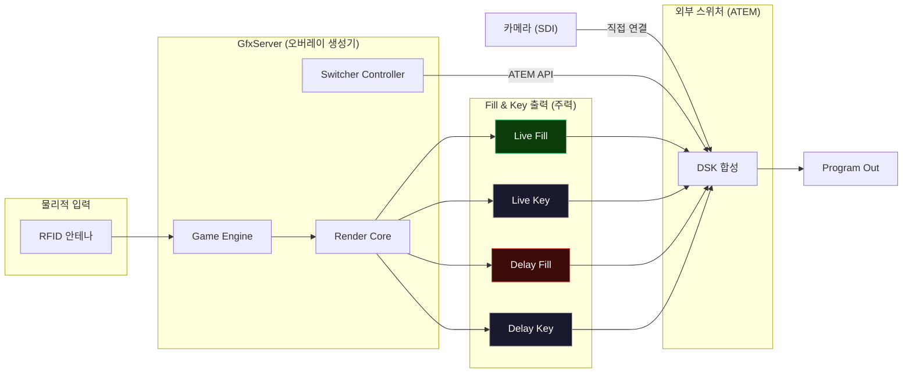
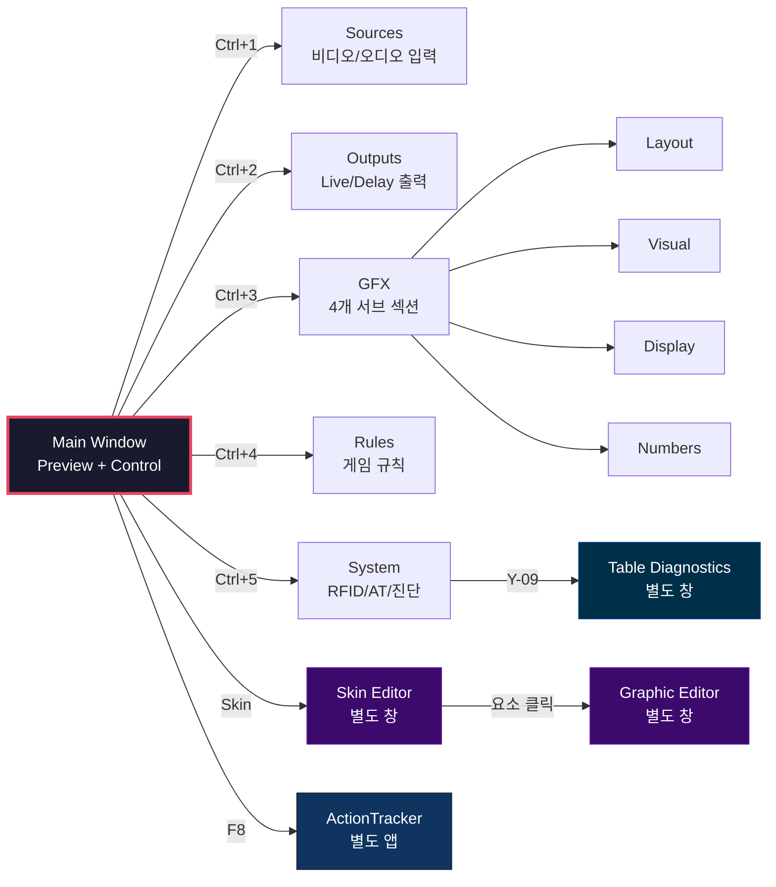
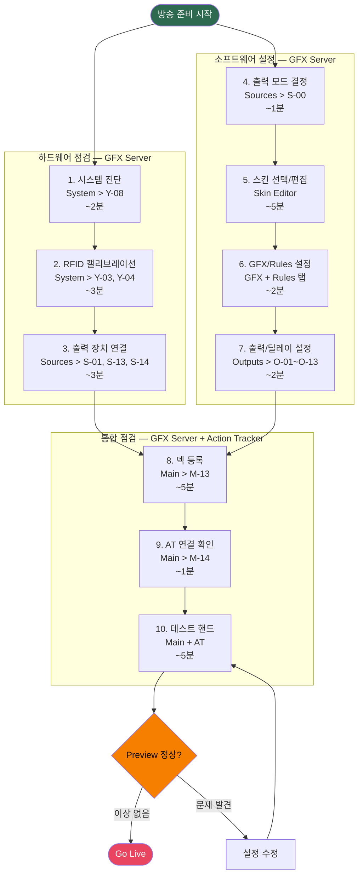
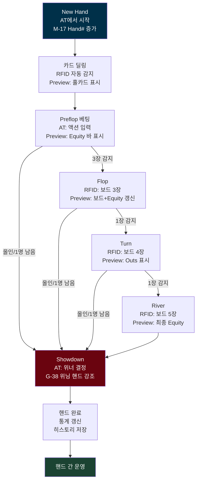
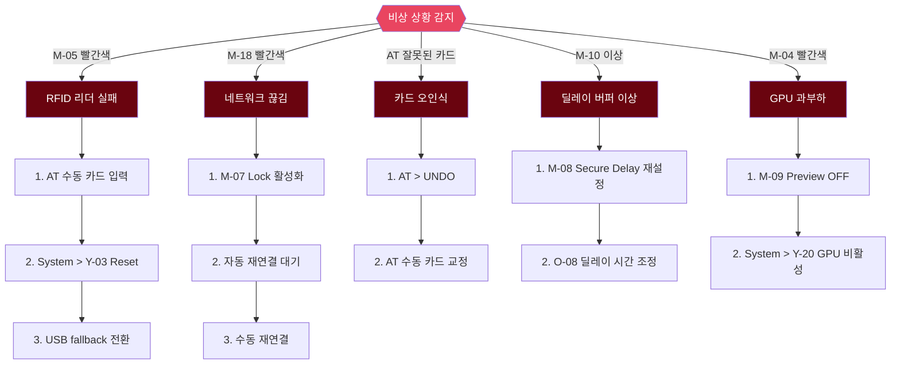
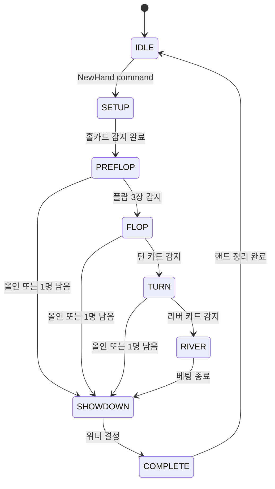

# PRD-0004: EBS Server UI Design -- UX Process Architecture

> 이 문서는 EBS Server의 UI를 운영자 UX 프로세스 관점에서 정의한다. 209개 UI 요소가 어떤 화면에서, 어떤 작업 흐름 속에서, 어떤 순서로 조작되는지를 구체적 다이어그램과 함께 제시한다. PokerGFX Server 3.111을 벤치마크로 삼되, EBS 고유의 기술 스택과 운영 환경에 맞춘 독립 설계다. 운영자가 이 문서만으로 "어떤 화면에서 무엇을 하고, 다음에 어디로 가야 하는지"를 파악할 수 있도록 작성했다.
>
> 문서 구조: 이 허브 문서는 시스템 전체 아키텍처와 운영자 워크플로우를 서술한다. 각 화면의 상세 요소 사양은 [PRD-0004-screen-specs.md](PRD-0004-screen-specs.md)에, 149개 기능 매핑은 [PRD-0004-feature-mapping.md](PRD-0004-feature-mapping.md)에 있다.

---

## Part I: 설계 맥락

### 1. Executive Summary

EBS Server는 포커 방송의 실시간 그래픽 오버레이를 생성하는 데스크톱 애플리케이션이다. RFID로 카드를 인식하고, 게임 상태를 추적하며, 시청자용 방송 화면을 렌더링한다.

핵심 설계 과제는 Hidden Information Problem이다. 플레이어의 홀카드는 운영자에게는 즉시 보여야 하고, 시청자에게는 지연 공개되어야 한다. 이를 해결하는 Dual Canvas Architecture(Live Canvas + Delay Canvas)가 UI 설계 전체를 관통한다.

> 출력 패러다임: EBS Server는 "영상 합성기"가 아니라 "그래픽 오버레이 생성기 + 스위처 컨트롤러"이다. 카메라 영상은 GFX Server를 경유하지 않고 외부 스위처(ATEM)에 직접 연결된다. GFX Server는 Fill(RGB 컬러) + Key(알파 마스크) 신호 쌍을 생성하여 스위처의 DSK(Downstream Keyer)로 전달하고, DSK가 카메라 위에 투명 합성한다. 이 방식은 Chroma Key보다 반투명/그림자/안티앨리어싱이 완벽하다.
>
> 3가지 출력 모드: Fill & Key(프로덕션 주력) / Chroma Key(간이 운용) / Internal Composite(개발/테스트). 출력 모드에 따라 Sources 탭과 Outputs 탭의 설정 항목이 달라진다.

### 2. 설계 원칙

| 원칙 | 내용 | UI 반영 |
|------|------|---------|
| 운영자 중심 설계 | 라이브 중 인지 부하 최소화 | Quick Actions, Lock Toggle, 단축키 |
| 검증된 레이아웃 계승 | PokerGFX 2-column 구조 유지 | Preview(좌) + Control(우) |
| 논리적 기능 통합 | GFX 1/2/3 → Layout/Visual/Display/Numbers | 4개 서브 섹션 탭 |
| Dual Canvas 우선 | 모든 출력 설정에 Live/Delay 영향 명시 | Outputs 탭 분리 |
| 모듈 분리 | 편집 작업은 별도 창 | Skin Editor, Graphic Editor |

---

## Part II: 화면 네비게이션 구조

### 4. 전체 화면 전환 맵

운영자가 접근할 수 있는 모든 화면과 이동 경로다. Main Window가 허브이며, 6개 탭과 2개 별도 창으로 분기한다.

### 5. 화면 역할 요약

| 화면 | 역할 | 주 사용 시점 |
|------|------|-------------|
| Main Window | 시스템 모니터링 + 긴급 조작 | 항상 (방송 중 80% 시선) |
| Sources 탭 | 비디오/오디오 입력 장치 설정 | 방송 준비 |
| Outputs 탭 | Live/Delay 출력 파이프라인 설정 | 방송 준비 |
| GFX 탭 | 그래픽 레이아웃/연출/표시/수치 | 방송 준비 + 핸드 간 조정 |
| Rules 탭 | 게임 규칙 (Bomb Pot, Straddle 등) | 방송 준비 |
| System 탭 | RFID, AT 연결, 시스템 진단 | 방송 준비 + 비상 대응 |
| Skin Editor | 방송 그래픽 테마 편집 | 사전 준비 |
| Graphic Editor | 개별 요소 픽셀 단위 편집 | 사전 준비 |
| Table Diagnostics | 안테나별 RFID 상태 진단 | 방송 준비 + 비상 대응 |

### 6. 전역 단축키 맵

| 단축키 | 동작 | 맥락 |
|--------|------|------|
| `Ctrl+1~5` | 탭 전환 (Sources~System) | 전역 |
| `Ctrl+L` | Lock 토글 | 전역 |
| `Ctrl+D` | Secure Delay 토글 | 전역 |
| `Ctrl+S` | 현재 설정 저장 | 전역 |
| `F5` | Reset Hand | 메인 |
| `F7` | Register Deck | 메인 |
| `F8` | Launch ActionTracker | 메인 |
| `F11` | Preview 전체 화면 | 메인 |

---

## Part III: 운영자 UX 프로세스

### 7. 방송 준비 프로세스

운영자가 방송 시작까지 수행하는 프로세스다. 하드웨어 점검과 소프트웨어 설정을 **병행 진행**하여 준비 시간을 단축한다. 모든 준비 단계는 GFX Server에서 수행하며, Action Tracker는 최종 통합 점검 단계에서만 사용한다.

단계별 상세:

| 구분 | 단계 | 소요 | 담당 시스템 | 사용 탭/화면 | 조작 요소 | 확인 사항 |
|:----:|:----:|:----:|:----------:|-------------|-----------|-----------|
| HW | 1 | 2분 | GFX Server | System 탭 | Y-08 System Info | CPU/GPU 감지, OS 호환성 |
| HW | 2 | 3분 | GFX Server | System 탭 | Y-03 Reset, Y-04 Calibrate | 12개 리더 연결, 안테나 신호 강도 |
| HW | 3 | 3분 | GFX Server | Sources 탭 | S-01, S-13, S-14 | DeckLink 출력 매핑 + ATEM IP 연결 |
| SW | 4 | 1분 | GFX Server | Sources 탭 | S-00 Output Mode | Fill & Key / Chroma Key / Internal 선택 |
| SW | 5 | 5분 | GFX Server | Skin Editor (별도 창) | SK-01~SK-26 | 스킨 로드, 폰트/카드 이미지 확인 |
| SW | 6 | 2분 | GFX Server | GFX + Rules 탭 | G-01~G-51, R-01~R-06 | 레이아웃, 연출, 표시 설정, 게임 규칙 |
| SW | 7 | 2분 | GFX Server | Outputs 탭 | O-01~O-13 | 해상도, 프레임레이트, Secure Delay |
| 통합 | 8 | 5분 | GFX Server | Main Window | M-13 Register Deck | 52장 UID 매핑 (1/52~52/52 진행) |
| 통합 | 9 | 1분 | GFX Server | Main Window | M-14 Launch AT | AT 접속 상태 확인 (M-18) |
| 통합 | 10 | 5분 | GFX Server + AT | Main + AT | M-02 Preview, AT 전체 | 테스트 핸드 진행, 출력 검증 |

> **병행 진행**: HW 1~3과 SW 4~7은 독립적이며 순서 관계가 없다. 두 사람이 분담하면 HW ~8분 / SW ~10분 = **~10분**, 한 사람이 순차 진행하면 ~18분 소요. 통합 점검 8~10은 HW/SW 양쪽이 완료된 후 진행한다 (~11분). 총 ~21~29분.

### 8. 핸드 사이클 프로세스

1개 핸드가 시작되어 종료될 때까지의 전체 플로우다. 각 단계에서 Preview Panel의 변화, Control Panel의 상태, 운영자 개입 포인트를 명시한다.

각 단계의 UI 상태 변화:
| 게임 단계 | Preview Panel 표시 | Control Panel 상태 | 자동 트리거 |
|-----------|-------------------|-------------------|-------------|
| New Hand | 초기화, Hand# 갱신 | Reset Hand 활성 | M-17 카운터 증가 |
| 카드 딜링 | 홀카드 렌더링 (Live 즉시, Delay 숨김) | Lock 가능 | Equity 계산 시작 |
| Preflop | 홀카드 + Equity 바 | AT 액션 대기 | G-37 Equity 표시 |
| Flop | 보드 3장 + Equity 재계산 | Outs 자동 표시 | G-40 Outs 조건 충족 시 |
| Turn | 보드 4장 + Equity 갱신 | Outs 갱신 | Equity 재계산 |
| River | 보드 5장 + 최종 Equity | 쇼다운 대기 | 최종 승률 확정 |
| Showdown | 위닝 핸드 강조 (G-38) | 핸드 종료 처리 | 올인 Equity 애니메이션 |
| 핸드 완료 | 리더보드 전환 | 다음 핸드 대기 | G-22 리더보드 자동 표시 |

운영자 개입 포인트:
| 상황 | 사용 요소 | 조작 |
|------|-----------|------|
| 잘못된 액션 입력 | AT > UNDO (AT-013) | 마지막 액션 취소 |
| 칩 스택 오류 | AT > ADJUST STACK (AT-023) | 수동 스택 조정 |
| 미스딜 | AT > MISS DEAL (AT-026) 또는 Main > M-11 | 핸드 무효화 |
| 중요 핸드 표시 | AT > TAG HAND (AT-022) | 하이라이트 태그 |
| GFX 일시 숨김 | AT > HIDE GFX (AT-021) | 오버레이 토글 |

### 9. 핸드 간 운영 프로세스

핸드 종료 후 다음 핸드 시작까지의 간격에서 자동/수동으로 발생하는 이벤트다.

| 순서 | 이벤트 | 자동/수동 | 관련 설정 | 소요 |
|:----:|--------|:---------:|-----------|:----:|
| 1 | 위닝 핸드 강조 표시 | 자동 | G-38 Hilite Winning Hand | 3초 |
| 2 | 리더보드 자동 표시 | 자동 | G-22 Show Leaderboard | 5초 |
| 3 | 플레이어 통계 티커 | 자동 | G-24 Show Player Stats | 5초 |
| 4 | PIP 캡처 표시 | 자동 | G-23 Show PIP Capture | 3초 |
| 5 | 스폰서 로고 노출 | 자동 | G-10~G-12 Sponsor Logos | 지속 |
| 6 | 스택 수동 조정 | 수동 | AT > Adjust Stack | 필요 시 |
| 7 | 플레이어 교체 | 수동 | AT > Player Management | 필요 시 |
| 8 | New Hand | 수동 | AT > New Hand | - |

자동 전환의 타이밍은 GFX Visual 섹션의 Transition In/Out(G-17, G-18) 값으로 결정된다.

운영자 선택 분기:- 다음 핸드: AT에서 New Hand → 핸드 사이클 반복
- 휴식: 리더보드/스폰서 로고 유지, 특별 조작 없음
- 설정 변경: Ctrl+1~6으로 탭 이동, Lock(M-07) 해제 후 변경

### 10. 비상 대응 프로세스

라이브 방송 중 발생할 수 있는 비상 상황과 대응 절차다. 각 상황에서 감지 방법, 대응 단계, 사용하는 UI 요소를 명시한다.

비상 대응 요약:
| 비상 상황 | 감지 UI | 1차 대응 | 2차 대응 | 관련 요소 |
|-----------|---------|----------|----------|-----------|
| RFID 리더 실패 | M-05 빨간색 | AT 수동 입력 전환 | Y-03 Reset, USB fallback | M-05, Y-03, Y-09 |
| 네트워크 끊김 | M-18 빨간색 | M-07 Lock (오조작 방지) | 자동/수동 재연결 | M-18, M-07 |
| 카드 오인식 | AT 잘못된 카드 | AT > UNDO | AT 수동 교정 | AT-013 |
| 딜레이 버퍼 문제 | M-10 이상 | M-08 재설정 | O-08 시간 조정 | M-08, M-10, O-08 |
| GPU 과부하 | M-04 빨간색 | M-09 Preview OFF | Y-20 Disable GPU | M-04, M-09, Y-20 |

---

## Part IV: 화면별 상세 설계

> 각 화면의 상세 사양은 별도 Screen Spec에 있다. 화면별 Design Decisions(왜 이렇게 설계했는가), Element Catalog(요소 테이블), Interaction Patterns(조작-반응-피드백), Navigation(화면 전환)을 포함한다.

### Screen Spec 읽는 법

1. Quick Reference: 단축키, 스크린샷, 요소 범위
2. Design Decisions: 왜 이렇게 설계했는가 (핵심)
3. Workflow: 작업 흐름 다이어그램
4. Element Catalog: 요소 테이블 (구현 참조)
5. Interaction Patterns: 조작-반응-피드백
6. Navigation: 화면 전환 경로

### Screen Index

모든 화면의 상세 사양은 단일 문서에 통합되어 있다: **[PRD-0004-screen-specs.md](PRD-0004-screen-specs.md)**

| 화면 | 요소 | P0/P1/P2 | Screen Spec 섹션 | 스크린샷 |
|------|------|----------|-----------------|---------|
| Main Window | M-01~M-20 | 11/7/2 | [Main Window](PRD-0004-screen-specs.md#1-main-window) | `images/mockups/ebs-main.png` |
| Sources | S-00~S-18 | 6/13/0 | [Sources](PRD-0004-screen-specs.md#2-sources-tab) | `images/mockups/ebs-sources.png` |
| Outputs | O-01~O-20 | 8/4/8 | [Outputs](PRD-0004-screen-specs.md#3-outputs-tab) | `images/mockups/ebs-outputs.png` |
| GFX | G-01~G-51 | 13/35/3 | [GFX](PRD-0004-screen-specs.md#4-gfx-tab) | `images/mockups/ebs-gfx-layout.png` |
| Rules | R-01~R-06 | 0/6/0 | [Rules](PRD-0004-screen-specs.md#5-rules-tab) | `images/mockups/ebs-rules.png` |
| System | Y-01~Y-24 | 7/11/6 | [System](PRD-0004-screen-specs.md#6-system-tab) | `images/mockups/ebs-system.png` |
| Skin Editor | SK-01~SK-26 | 0/21/5 | [Skin Editor](PRD-0004-screen-specs.md#7-skin-editor) | `images/mockups/ebs-skin-editor.png` |
| Graphic Editor | Board/Player | 6/1/1 | [Graphic Editor](PRD-0004-screen-specs.md#8-graphic-editor) | `images/mockups/ebs-graphic-editor.png` |

> HTML 와이어프레임: [ebs-server-ui.html](mockups/ebs-server-ui.html), [ebs-skin-editor.html](mockups/ebs-skin-editor.html), [ebs-graphic-editor.html](mockups/ebs-graphic-editor.html)

---

## Part V: 게임 상태별 UI 상태 맵

> **Section 8 (핸드 사이클)과 Section 20 (게임 상태 머신)의 관계**
>
> 이 두 섹션은 동일한 핸드 진행을 **서로 다른 관점**에서 서술한다.
>
> | | Section 8: 핸드 사이클 프로세스 | Section 20: 게임 상태 머신 |
> |------|------|------|
> | **관점** | 운영자 (UX 워크플로우) | 시스템 (내부 상태 전이) |
> | **초점** | 운영자가 무엇을 보고, 무엇을 조작하는가 | 어떤 이벤트가 상태를 전이시키고, 어떤 UI 갱신이 자동 트리거되는가 |
> | **다이어그램** | Flowchart — 순차적 작업 흐름 | State Diagram — 상태와 전이 조건 |
> | **포함 내용** | Preview/Control Panel 변화, 운영자 개입 포인트 (UNDO, ADJUST STACK 등) | 상태별 자동 트리거 (Equity 계산, G-38 강조 등), SETUP 상태 포함 |
> | **용도** | 운영자 교육, 운영 매뉴얼 | 개발자 구현 참조, 상태 기반 UI 로직 설계 |
>
> Section 8은 "운영자가 핸드를 어떻게 진행하는가"를, Section 20은 "시스템이 핸드를 어떻게 처리하는가"를 정의한다.

### 20. 게임 상태 머신

EBS Server의 핵심은 게임 상태 머신이다. 모든 UI 갱신은 상태 전이에 의해 트리거된다.

### 21. 상태별 UI 변화 상세

각 게임 상태에서 Preview Panel, Control Panel, 자동 트리거를 명시한다.

| 상태 | Preview Panel | Control Panel | 자동 트리거 |
|------|--------------|---------------|-------------|
| IDLE | 리더보드 / 스폰서 로고 / 대기 화면 | 다음 핸드 대기, 설정 변경 가능 | G-22 리더보드, G-24 통계 티커 |
| SETUP | 초기화, Hand# 표시 (M-17) | Reset Hand (M-11) 활성 | M-17 카운터 증가 |
| PREFLOP | 홀카드 렌더링 + Equity 바 | AT 액션 입력 대기 | G-37 Equity 계산, G-14 카드 공개 |
| FLOP | 보드 3장 + Equity 재계산 + Outs | AT 액션 입력 대기 | G-40 Outs 표시, Equity 갱신 |
| TURN | 보드 4장 + Equity 갱신 + Outs 갱신 | AT 액션 입력 대기 | Equity 재계산 |
| RIVER | 보드 5장 + 최종 Equity | 쇼다운 대기 | 최종 승률 확정 |
| SHOWDOWN | 위닝 핸드 강조 (G-38) + All-in 애니메이션 | 핸드 종료 처리 | G-38 강조, EQ-012 애니메이션 |
| COMPLETE | 리더보드 전환 | 통계 갱신 확인 | 히스토리 저장, 통계 갱신 |

### 22. Dual Canvas 상태 대비

Live Canvas와 Delay Canvas는 동일 게임 상태에서 다르게 동작한다.

| 게임 상태 | Live Canvas (운영자) | Delay Canvas (방송) |
|-----------|---------------------|---------------------|
| PREFLOP | 홀카드 즉시 표시 + Equity | 홀카드 숨김 (Trustless) |
| FLOP~RIVER | 보드 카드 즉시 + Equity | 보드 카드는 표시, 홀카드 계속 숨김 |
| SHOWDOWN | 위닝 핸드 즉시 강조 | 즉시 표시 — 카드가 물리적으로 공개된 상태이므로 지연 불필요 |
| IDLE | 리더보드 즉시 | 즉시 표시 — 숨길 정보 없음 |

---

## 부록

### A. UI 요소 전체 집계

**구현 우선순위 정의**:

| 우선순위 | 정의 | 기준 |
|:--------:|------|------|
| **P0** | 필수 | 없으면 방송이 불가능한 핵심 기능. MVP에 반드시 포함 |
| **P1** | 중요 | 방송은 가능하나 운영 효율/품질에 영향. 초기 배포 후 순차 추가 |
| **P2** | 부가 | 확장성, 편의성, 고급 기능. 시스템 안정화 후 추가 |

> PokerGFX 역설계 기준: P0 85개 + P1 48개 + P2 18개 = 151개 기능 ([PRD-0004-feature-mapping.md](PRD-0004-feature-mapping.md) 참조)

| 화면 | 요소 수 | P0 | P1 | P2 |
|------|:-------:|:--:|:--:|:--:|
| 메인 윈도우 | 20 | 11 | 7 | 2 |
| Sources 탭 | 18 | 2 | 16 | 0 |
| Outputs 탭 | 17 | 5 | 4 | 8 |
| GFX - Layout | 13 | 2 | 8 | 3 |
| GFX - Visual | 12 | 4 | 8 | 0 |
| GFX - Display | 14 | 2 | 12 | 0 |
| GFX - Numbers | 12 | 5 | 7 | 0 |
| Rules 탭 | 6 | 0 | 6 | 0 |
| System 탭 | 24 | 7 | 11 | 6 |
| Skin Editor | 26 | 0 | 21 | 5 |
| Graphic Editor | 39 | 1 | 38 | 0 |
| Player Overlay | 8 | 6 | 1 | 1 |
| 합계 | 209 | 45 | 139 | 25 |

### B. 단축키 맵

| 단축키 | 동작 | 맥락 |
|--------|------|------|
| `F5` | Reset Hand | 메인 |
| `F7` | Register Deck | 메인 |
| `F8` | Launch AT | 메인 |
| `F11` | Preview 전체 화면 | 메인 |
| `Ctrl+L` | Lock 토글 | 전역 |
| `Ctrl+D` | Secure Delay 토글 | 전역 |
| `Ctrl+1` | Sources 탭 | 전역 |
| `Ctrl+2` | Outputs 탭 | 전역 |
| `Ctrl+3` | GFX 탭 | 전역 |
| `Ctrl+4` | Rules 탭 | 전역 |
| `Ctrl+5` | System 탭 | 전역 |
| `Ctrl+S` | 설정 저장 | 전역 |

### C. 용어집

| 용어 | 정의 |
|------|------|
| Dual Canvas | Live/Delay 독립 렌더링 파이프라인 |
| Trustless Mode | 홀카드를 지연 공개하는 보안 모드 |
| Mixer Core | 90개 필드를 합성하여 렌더 프레임을 생성하는 엔진 |
| Blast Radius | 단일 설정 변경이 영향을 미치는 시스템 범위 |
| AT | ActionTracker (딜러 입력 장치) |
| PIP | Picture-in-Picture |
| NDI | Network Device Interface (비디오 전송 프로토콜) |
| Equity | 현재 카드 조합의 승률 |
| Outs | 승리에 필요한 남은 카드 수 |
| RFID | Radio-Frequency Identification |
| Fill Signal | GFX 오버레이의 RGB 컬러 영상 신호. Key와 쌍으로 외부 스위처 DSK에서 투명 합성에 사용 |
| Key Signal | GFX 오버레이의 알파(투명도) 마스크 영상 신호. 흰색=불투명, 검은색=투명 |
| DSK | Downstream Keyer. 스위처 최종 합성 단계에서 Fill+Key를 카메라 위에 합성 |
| DeckLink | Blackmagic Design PCIe 캡처/출력 카드. Fill & Key의 물리적 SDI/HDMI 출력 경로 |
| ATEM | Blackmagic Design 프로덕션 비디오 스위처. BMDSwitcherAPI로 원격 제어 |
| Internal Composite | GFX Server 내부에서 카메라+오버레이를 합성하는 개발/테스트 모드 |

---

## 변경 이력

| 버전 | 날짜 | 변경 내용 |
|------|------|----------|
| v1.0.0 | 2026-02-16 | 초기 작성. PokerGFX 11개 스크린샷 + 268개 요소 분석 기반 독립 설계 |
| v2.0.0 | 2026-02-16 | 인과적 설계 PRD로 전면 재작성. Mermaid 다이어그램 10개 추가, 운영자 워크플로우, 데이터 아키텍처, 상호작용 패턴 신규. 149개 기능 전체 매핑 |
| v3.0.0 | 2026-02-16 | UX 프로세스 중심 재작성. 추상적 시스템 다이어그램 제거, 구체적 화면 전환/작업 플로우 다이어그램 10개로 교체. Part II 화면 네비게이션, Part III 4개 운영자 프로세스, Part V 게임 상태별 UI 맵 신규 |
| v4.0.0 | 2026-02-16 | Fill & Key 아키텍처 재설계. "내부 합성기" → "오버레이 생성기 + 스위처 컨트롤러" 패러다임 전환. 3모드 공존 설계 |
| v4.1.0 | 2026-02-16 | UI 와이어프레임 추가. HTML 와이어프레임 3개 + Playwright 스크린샷 12개 생성 |
| v5.0.0 | 2026-02-16 | Hub-and-Spoke 구조 전환. 단일 1,288줄 모놀리스를 허브(~400줄) + 9개 Screen Spec + Feature Mapping으로 분리. Part IV를 Screen Index로 교체, 각 화면에 Design Decisions 섹션 신규 추가 |
| v5.1.0 | 2026-02-16 | Commentary 탭 배제. 프로덕션 미사용 기능으로 EBS 범위에서 제외. 탭 6→5, UI 요소 216→209, 단축키 재배정 (System: Ctrl+6→Ctrl+5) |
| v6.0.0 | 2026-02-16 | 방송 준비 프로세스를 HW/SW 병행 구조로 재설계, GFX Server vs AT 담당 구분 명시. 핸드 사이클(Sec.8) vs 게임 상태 머신(Sec.20) 차이점 설명 추가. Delay Canvas SHOWDOWN/IDLE 즉시 표시로 수정. Part VI 구현 로드맵 제거 (기술팀 담당). P0/P1/P2 우선순위 정의 추가. Screen Spec을 단일 문서로 통합 |

---

Version: 6.0.0 | Updated: 2026-02-16
