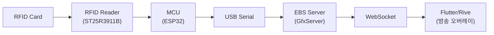
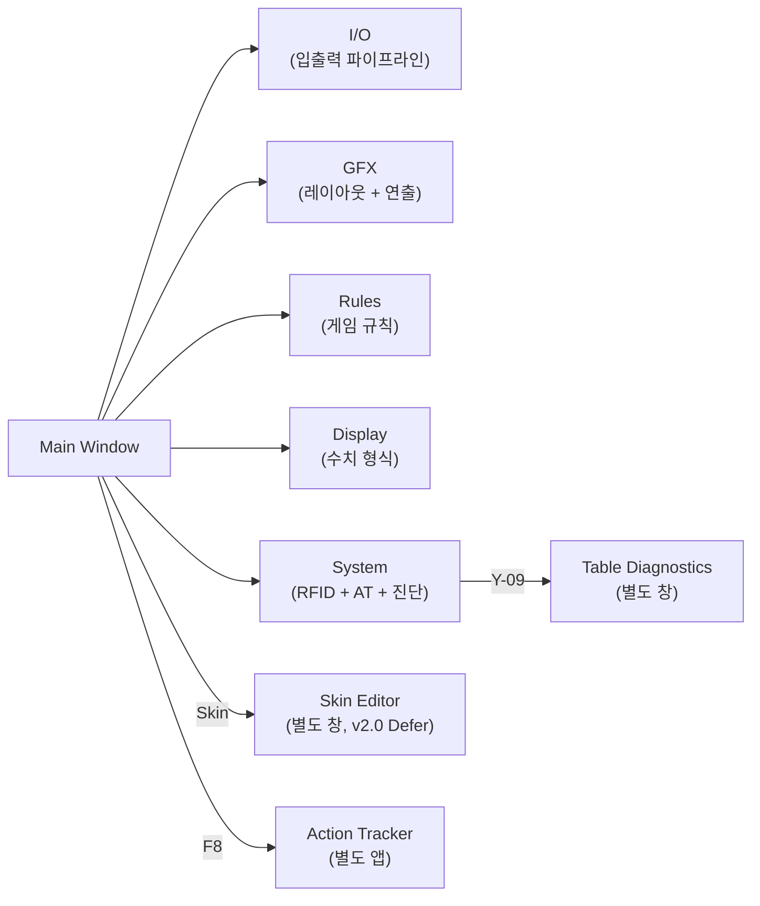

# PRD-0004: EBS Server UI Design v23.0.0

> **통합 설계서**: PokerGFX 원본 6탭 구조 분석(Part I) → EBS 5탭 변형 설계(Part II)를 하나의 문서에서 다룬다. 모든 요소(174개)의 Keep/Defer/Drop 판정과 추적이 이 문서에서 완결된다.

> **아카이브 참조**: 원본 상세 분석은 [v21 아카이브](PRD-0004-PokerGFX-Navigation.md), v22 설계 시도는 git history에 보존.
> 기술 상세는 [PRD-0004-technical-specs.md](PRD-0004-technical-specs.md), 탭 간 상호작용은 [PRD-0004-feature-interactions.md](PRD-0004-feature-interactions.md) 참조.

---

## 1장. 개요

### 1.1 문서 목적

이 문서는 **EBS console v1.0 Broadcast Ready**의 GfxServer Settings Window UI 설계서이다.

PokerGFX 원본 6탭 구조(Main Window + System / Sources / Outputs / GFX 1 / GFX 2 / GFX 3)를 완전 분석하고(Part I), 이를 EBS 5탭 구조(I/O / GFX / Rules / Display / System)로 변형하는 설계를 담는다(Part II).

v21 아카이브(PokerGFX 원본 6탭 상세 분석, 184개 선언 요소 중 실 존재 174개)와 v22 설계 시도(5탭 재편, git history 보존)를 단일 문서로 통합하여, v22 대비 18건의 정합성 문제를 전수 해결했다.

### 1.2 PokerGFX → EBS 변환 전략

EBS Phase 1은 PokerGFX 동일 복제를 목표로 한다. 원본 6탭을 그대로 구현한 후, EBS 운영 환경에 맞게 5탭으로 재편한다.

**원본 6탭 (PokerGFX)**

| 탭 | 역할 |
|----|------|
| System | RFID 리더, AT 연결, 시스템 진단 |
| Sources | 비디오/오디오 입력 소스 |
| Outputs | 출력 해상도, Live/Delay 파이프라인 |
| GFX 1 | 그래픽 배치 & 연출 (레이아웃, 카드 공개, 스킨) |
| GFX 2 | 표시 설정 & 규칙 (리더보드, Equity, 게임 규칙) |
| GFX 3 | 수치 형식 (통화, 정밀도, BB 모드) |

**EBS 5탭 (변형)**

| 탭 | 변환 원칙 |
|----|----------|
| I/O | Sources + Outputs 통합 → 입출력 파이프라인 단일 뷰 |
| GFX | GFX 1 핵심 유지 → 배치/연출 그대로 계승 |
| Rules | GFX 1 규칙 요소 + GFX 2 게임 규칙 추출 → 게임 규칙 전담 탭 |
| Display | GFX 1/2/3 표시 수치 추출 → 표시 형식 전담 탭 |
| System | 기존 System 유지 + 확장 |

### 1.3 데이터 파이프라인

포커 방송 한 프레임이 만들어지는 데이터 흐름이 GfxServer Settings Window의 탭 구조 존재 이유를 설명한다.

| 단계 | 설정 탭 |
|------|---------|
| RFID Reader 연결 및 캘리브레이션 | System 탭 (Y-03~Y-07) |
| 비디오 입력 소스 등록 | Sources 탭 (S-01~S-18) |
| 출력 해상도 및 파이프라인 | Outputs 탭 (O-01~O-20) |
| 그래픽 배치 & 연출 | GFX 1 탭 (G-01~G-25) |
| 표시 설정 & 게임 규칙 | GFX 2 탭 (G-26~G-57) |
| 수치 형식 | GFX 3 탭 (G-40~G-51) |

### 1.4 아카이브 참조

| 아카이브 | 경로 | 내용 |
|---------|------|------|
| **v21** | [PRD-0004-PokerGFX-Navigation.md](PRD-0004-PokerGFX-Navigation.md) | PokerGFX 원본 6탭 상세 분석 — 184개 요소, 오버레이 분석 이미지, 설계 시사점 보존 |
| **v22** | git history | EBS 5탭 설계 시도 — 정합성 문제 18건 발생, 아카이브화 |

Part I(2~8장)의 각 탭 분석은 v21 해당 Step을 기반으로 작성했다. 설계 시사점의 상세 맥락은 v21 아카이브를 참조한다.

### 1.5 공통 레이아웃

모든 탭이 공유하는 기본 구조: **Title Bar → Preview Panel(좌, 16:9 Chroma Key) + Status/액션 버튼(우) → Tab Navigation → Tab Content Area**

#### Design Resolution vs Output Resolution vs Preview Scaling

| 개념 | 정의 | 설정 위치 |
|------|------|----------|
| Design Resolution | Graphic Editor에서 좌표를 입력하는 기준 해상도. SK-04(4K Design) 설정에 따라 1920×1080 또는 3840×2160 | 8장 SK-04 |
| Output Resolution | 실제 방송 송출 해상도. O-01(Video Size)에서 설정 | 4장 O-01 |
| Preview Scaling | UI 내 Preview Panel이 출력 해상도 비율을 유지하며 UI 공간에 맞게 표시되는 방식 | 2장 M-02 |

#### 앱 윈도우 크기 정책

- 최소 앱 윈도우: 1280×720 (이하에서는 스크롤 발생)
- 최대: 운영자 모니터 크기에 따라 가변
- Preview(좌) : Control(우) 기본 비율 = 6:4
- 기준 크기: 800×365px (Title Bar 28px + Preview 270px + Status Bar 22px + Shortcut Bar 24px + Watermark 22px)

#### GFX 좌표계 원칙

| 단위 | 범위 | 사용 항목 | 해상도 변경 시 처리 |
|------|------|----------|------------------|
| 정규화 좌표 (float) | 0.0 ~ 1.0 | Margin % (G-03~G-05). 예: 0.04 = 4% | 변환 불필요. `margin_pixel = margin_normalized × output_width` |
| 기준 픽셀 (int) | 0 ~ 1920 또는 0 ~ 1080 | Graphic Editor LTWH. Design Resolution 기준 | 스케일 팩터 자동 적용. 예: 1080p L=100 → 4K L=200 |

---

## Part I: PokerGFX 원본 6탭 구조 분석

> Part I은 PokerGFX 원본의 6탭(Sources/Outputs/GFX1/GFX2/GFX3/System) + Main Window 구조를 기술한다. 각 요소의 우선순위(P0/P1/P2)와 EBS 복제 판정을 포함한다.

## 2장. Main Window (10개 요소)

> **PokerGFX 원본**: Main Window | 요소 수: 10개 (+ Drop 2개)
> **참조**: [v21 Step 1 상세](PRD-0004-PokerGFX-Navigation.md#step-1-main-window--중앙-통제실)

시스템 전체를 한눈에 모니터링하고, 6개 설정 탭으로 분기하는 중앙 통제실. 본방송 중 운영자 주의력의 15%가 여기에 할당된다.

**원본 캡쳐**

**오버레이 분석본**

PokerGFX의 기본 화면. 좌측에 방송 Preview, 우측에 상태 표시와 액션 버튼이 배치된 2-column 레이아웃.

### 기능 테이블

| # | 기능명 | 설명 | EBS 복제 |
|:-:|--------|------|:--------:|
| 1 | Title Bar | `PokerGFX Server 3.111 (c) 2011-24` 타이틀 + 최소/최대/닫기 버튼 | P2 |
| 2 | Preview | Chroma Key Blue 배경의 방송 미리보기 화면. GFX 오버레이가 실시간 렌더링됨 | P0 |
| 3 | CPU / GPU / Error / Lock | CPU, GPU 사용률 인디케이터 + Error 아이콘 + Lock 아이콘. 시스템 부하와 상태 실시간 모니터링 | P1 |
| 4 | Recording / Secure Delay / Preview | 3개 체크박스 행. Recording(녹화 토글), Secure Delay(방송 보안 딜레이 토글), Preview(미리보기 토글) | EBS MVP 범위 외 |
| 5 | Reset Hand | Reset Hand 버튼. 현재 핸드 데이터 초기화 + Settings 톱니바퀴 + Lock 자물쇠 | P0 |
| 6 | Register Deck | RFID 카드 덱 일괄 등록 버튼. 새 덱 투입 시 52장 순차 스캔 | P0 |
| 7 | Action Tracker | Action Tracker 실행 버튼. 운영자용 실시간 게임 추적 인터페이스 | P0 |
| 8 | Studio | Studio 모드 진입 버튼. 방송 스튜디오 환경 전환 | EBS MVP 범위 외 |
| 9 | Split Recording | 핸드별 분할 녹화 버튼. 각 핸드를 개별 파일로 자동 저장 | EBS MVP 범위 외 |
| 10 | Tag Player | 플레이어 태그 + 드롭다운. 특정 플레이어에 마커를 부여하여 추적 | EBS MVP 범위 외 |

### Element Catalog

#### 상태 표시 그룹

| # | 요소 | 타입 | 설명 | PGX | 우선순위 |
|:-:|------|------|------|:---:|:--------:|
| M-01 | Title Bar | AppBar | 앱 이름 + 버전 + 윈도우 컨트롤 | #1 | P2 |
| M-02 | Preview Panel | Canvas | 출력 해상도(O-01)와 동일한 종횡비 유지, Chroma Key Blue, GFX 오버레이 실시간 렌더링. 해상도 정책: 실제 출력은 Full HD(1920×1080) 기준 리사이징. 문서 표기(480×270)는 UI 공간 내 표시 크기로 가독성용 축약 표기. | #2 | P0 |
| M-03 | CPU Indicator | ProgressBar | CPU 사용률 + 색상 코딩 (Green<60%, Yellow<85%, Red>=85%). 매뉴얼: "The icons on the left indicate CPU and GPU usage. If they turn red, usage is too high for the Server to operate reliably." (p.34) | #3 | P1 |
| M-04 | GPU Indicator | ProgressBar | GPU 사용률 + 색상 코딩. 동일 기준 | #3 | P1 |
| M-05 | RFID Status | Icon+Badge | RFID 리더 상태 7색 표시. Green=정상, Grey=보안 링크 수립 중, Blue=미등록 카드 감지, Black=중복 카드 감지, Magenta=중복 카드, Orange=응답 없음, Red=미연결. 매뉴얼 p.34 | #3 | P0 |
| M-06 | RFID Connection Icon | Icon | RFID 연결 상태 표시 (연결 시 녹색 USB/WiFi 아이콘, 미연결 시 경고 아이콘) | #3 | P1 |
| ~~M-17~~ | ~~Hand Counter~~ | ~~Badge~~ | ~~현재 세션 핸드 번호 (Hand #47)~~ | ~~신규~~ | ~~P0~~ **[DROP]** |
| ~~M-18~~ | ~~Connection Status~~ | ~~Row~~ | ~~AT/Overlay/DB 각각 Green/Red 표시~~ | ~~신규~~ | ~~P0~~ **[DROP]** |

#### 보안 제어 그룹

| # | 요소 | 타입 | 설명 | PGX | 우선순위 |
|:-:|------|------|------|:---:|:--------:|
| M-07 | Lock Toggle | IconButton | 설정 잠금/해제. 잠금 시 모든 탭 설정 변경 불가. 매뉴얼: "Click the Lock symbol next to the Settings button to password protect the Settings Window." (p.33) | #3 | P1 |

#### 액션 버튼 그룹

| # | 요소 | 타입 | 설명 | PGX | 우선순위 |
|:-:|------|------|------|:---:|:--------:|
| M-11 | Reset Hand | ElevatedButton | 현재 핸드 초기화, 확인 다이얼로그 | #5 | P0 |
| M-12 | Settings | IconButton | 전역 설정 다이얼로그 (테마, 언어, 단축키) | #5 | P1 |
| M-13 | Register Deck | ElevatedButton | 52장 RFID 일괄 등록, 진행 다이얼로그 | #6 | P0 |
| M-14 | Launch AT | ElevatedButton | Action Tracker 실행/포커스 전환 | #7 | P0 |

> **v21 Step 1 참조**: 설계 시사점(Preview 2-column 계승, RFID 분리, Drop 결정 근거)은 [v21 아카이브 Step 1](PRD-0004-PokerGFX-Navigation.md#step-1-main-window--중앙-통제실) 참조.

## 3장. Sources 탭 (19개 요소)

> **PokerGFX 원본**: Sources 탭 | 요소 수: 19개 (S-00~S-18)
> **참조**: [v21 Step 3 상세](PRD-0004-PokerGFX-Navigation.md#step-3-sources--카메라스위처-연결)

비디오 입력 소스를 등록하고 속성을 조절한다. 자동 카메라 제어 설정도 이 화면에서 한다.

**원본 캡쳐**

**오버레이 분석본**

비디오 입력 장치, 카메라 제어, 크로마키, 외부 스위처 연동을 관리하는 탭.

### 기능 테이블

| # | 기능명 | 설명 | EBS 복제 |
|:-:|--------|------|:--------:|
| 1 | Tab Bar | 7개 탭 전환 바 | P0 |
| 2 | Device Table | 비디오 입력 장치 목록. Preview, Settings 버튼으로 개별 제어 | P0 |
| 3 | Board Cam / Auto Camera | 보드 카메라 전환 시 GFX 자동 숨기기 + 게임 상태 기반 자동 카메라 전환 | P1 |
| 4 | Camera Mode | Static / Dynamic 카메라 전환 모드 | P1 |
| 5 | Heads Up / Follow | 헤즈업 시 화면 분할과 플레이어/보드 추적 | P1 |
| 6 | Linger / Post | 보드 카드 유지 시간 + Post Bet / Post Hand 카메라 동작 | P1 |
| 7 | Chroma Key | 활성화 체크박스 + Background Key Colour 색상 선택기 | P0 |
| 8 | Add Network Camera | IP 기반 원격 카메라 추가 | P2 |
| 9 | Audio / Sync | 오디오 소스 + Sync 보정값 (mS) | P1 |
| 10 | External Switcher / ATEM | ATEM 스위처 IP 기반 직접 통신 | P1 |
| 11 | Board Sync / Crossfade | 싱크 보정 + 크로스페이드 시간 (기본 0/300mS) | P1 |
| 12 | Player View | 플레이어별 카메라 뷰 전환 | P1 |

### Element Catalog

| # | 그룹 | 요소 | 타입 | 설명 | PGX | 우선순위 |
|:-:|------|------|------|------|:---:|:--------:|
| S-00 | Output Mode | Mode Selector | RadioGroup | Fill & Key / Chroma Key / Internal (기본: Fill & Key) | 신규 | P0 |
| S-01 | Video Sources | Device Table | DataTable | NDI, 캡처 카드, 네트워크 카메라 목록. 매뉴얼: "The Sources tab contains a list of available video sources." (p.35) | #2 | P0 |
| S-02 | Video Sources | Add Button | TextButton | NDI 자동 탐색 또는 수동 URL | #8 | P1 |
| S-03 | Video Sources | Settings | IconButton | 해상도, 프레임레이트, 크롭 | #2 | P1 |
| S-04 | Video Sources | Preview | IconButton | 소스별 미니 프리뷰 | #2 | P1 |
| S-05 | Camera | Board Cam Hide GFX | Checkbox | 보드 카메라 시 GFX 자동 숨기기. 매뉴얼: "If the 'Hide GFX' option is enabled, all player graphics will be made invisible while the board cam is active." (p.36) | #3 | P1 |
| S-06 | Camera | Auto Camera Control | Checkbox | 게임 상태 기반 자동 전환 | #3 | P1 |
| S-07 | Camera | Mode | Dropdown | Static / Dynamic. 매뉴얼: "To display video sources in rotation, select 'Cycle' mode instead of 'Static'." (p.35) | #4 | P1 |
| S-08 | Camera | Heads Up Split | Checkbox | 헤즈업 화면 분할. 매뉴얼: "When play is heads up, and both players are covered by separate cameras, a split screen view showing each player will automatically be displayed." (p.37) | #5 | P1 |
| S-09 | Camera | Follow Players | Checkbox | 플레이어 추적. 매뉴얼: "If Action Tracker is enabled, the video will switch to ensure that the player whose turn it is to act is always displayed." (p.37) | #5 | P1 |
| S-10 | Camera | Follow Board | Checkbox | 보드 추적. 매뉴얼: "When 'Follow Board' is enabled, the video will switch to the community card close-up for a few seconds whenever flop, turn or river cards are dealt." (p.36) | #5 | P1 |
| S-11 | Background | Enable | Checkbox | 크로마키 활성화. 매뉴얼: "To enable chroma key, enable the 'Chroma Key' checkbox." (p.39) | #7 | P0 |
| S-12 | Background | Background Colour | ColorPicker | 배경색 (기본 Blue). 매뉴얼: "repeatedly click the 'Background Key Colour' button until the desired colour is selected." (p.39) | #7 | P0 |
| S-13 | External | Switcher Source | Dropdown | ATEM 스위처 연결 (Fill & Key 필수). 매뉴얼: "When using a camera source for video capture from an external vision switcher, select this capture device using the 'External Switcher Source' dropdown box." (p.38) | #10 | P0 |
| S-14 | External | ATEM Control | Checkbox+TextField | ATEM IP + 연결 상태 (Fill & Key 필수). 매뉴얼: "PokerGFX can control a Blackmagic ATEM Video Switcher to automatically switch camera inputs to follow the action." (p.40) | #10 | P0 |
| S-15 | Sync | Board Sync | NumberInput | 보드 싱크 보정 (ms). 매뉴얼: "Delays the detection of community cards by the specified number of milliseconds." (p.38) | #11 | P1 |
| S-16 | Sync | Crossfade | NumberInput | 크로스페이드 (ms, 기본 300). 매뉴얼: "Setting this value to a higher value between 0.1 and 2.0 causes sources to crossfade." (p.38) | #11 | P1 |
| S-17 | Audio | Input Source | Dropdown | 오디오 소스 선택. 매뉴얼: "Select the desired audio capture device and volume." (p.38) | #9 | P1 |
| S-18 | Audio | Audio Sync | NumberInput | 오디오 싱크 보정 (ms) | #9 | P1 |

> **v21 Step 3 참조**: 설계 시사점(External Switcher 조건부 노출, Chroma Key 상단 분리 근거)은 [v21 아카이브 Step 3](PRD-0004-PokerGFX-Navigation.md#step-3-sources--카메라스위처-연결) 참조.

## 4장. Outputs 탭 (20개 요소)

> **PokerGFX 원본**: Outputs 탭 | 요소 수: 20개 (O-01~O-20)
> **참조**: [v21 Step 4 상세](PRD-0004-PokerGFX-Navigation.md#step-4-outputs--출력-파이프라인)

출력 파이프라인을 설정한다. Delay 이중 출력은 추후 개발 범위이며, 현재는 Live 단일 출력 구조로 설계한다.

**원본 캡쳐**

**오버레이 분석본**

비디오 출력 해상도, Live/Delay 이중 파이프라인, 스트리밍을 관리하는 탭.

### 기능 테이블

| # | 기능명 | 설명 | EBS 복제 |
|:-:|--------|------|:--------:|
| 1 | Video Size | 출력 해상도 (`1920 x 1080`) | P0 |
| 2 | 9x16 Vertical | 세로 모드 출력 (모바일/쇼츠) | P2 |
| 3 | Frame Rate | 출력 프레임레이트 (`60.00 -> 60`) | P0 |
| 4 | Live column | Live 출력 파이프라인 4개 설정 | P0 |
| 5 | Delay column | Delay 출력 파이프라인 (Live와 독립) | P0 |
| 6 | Virtual Camera | 가상 카메라 출력 | P2 |
| 7 | Recording Mode | 녹화 모드 (`Video with GFX`) | P1 |
| 8 | Dynamic Delay | 동적 딜레이 (상황별 자동 조절) | P1 |
| 10 | Auto Stream | 자동 스트리밍 시작 딜레이(분) | P2 |
| 11 | Show Countdown | 카운트다운 표시 | P1 |
| 12 | Countdown Video | 카운트다운 종료 시 재생 영상 | P2 |
| 13 | Twitch / ChatBot | Twitch 직접 연동 | P2 |

### Element Catalog

| # | 그룹 | 요소 | 설명 | PGX | 우선순위 |
|:-:|------|------|------|:---:|:--------:|
| O-01 | Resolution | Video Size | 1080p/4K 출력 해상도. 매뉴얼: "Select the desired resolution and frame rate of the video output." (p.42) | #1 | P0 |
| O-02 | Resolution | 9x16 Vertical | 세로 모드 (모바일). 매뉴얼: "PokerGFX supports vertical video natively by enabling the '9x16 Vertical' checkbox." (p.43) | #2 | P2 |
| O-03 | Resolution | Frame Rate | 30/60fps | #3 | P0 |
| O-04 | Live | Video/Audio/Device | Live 파이프라인 3개 드롭다운. 매뉴얼: "Sends the live and/or delayed video and audio feed to a Blackmagic Decklink device output (if installed), or to an NDI stream on the local network." (p.42) | #4 | P0 |
| O-05 | Live | Key & Fill | Live Fill & Key 출력 (DeckLink 채널 할당). 매뉴얼: "When an output device that supports external keying is selected, the 'Key & Fill' checkbox is enabled. Activating this feature causes separate key & fill signals to be sent to 2 SDI connectors on the device." (p.43) | #4 | P0 |
| O-06 | Delay | Video/Audio/Device | Delay 파이프라인 (Live와 독립) | #5 | Future |
| O-07 | Delay | Key & Fill | Delay Fill & Key 출력 (DeckLink 채널 할당) | #5 | Future |
| O-14 | Virtual | Camera | 가상 카메라 (OBS 연동). 매뉴얼: "Sends the video and audio feed (live OR delayed, depending on this setting) to the POKERGFX VCAM virtual camera device." (p.43) | #6 | P2 |
| O-15 | Recording | Mode | Video / Video+GFX / GFX only | #7 | P1 |
| O-16 | Streaming | Platform | Twitch/YouTube/Custom RTMP | #13 | P2 |
| O-17 | Streaming | Account Connect | OAuth 연결 | #13 | P2 |
| O-18 | Fill & Key | Key Color | Key 신호 배경색 (기본: #FF000000) | 신규 | P0 |
| O-19 | Fill & Key | Fill/Key Preview | Fill 신호와 Key 신호 나란히 미리보기 | 신규 | P1 |
| O-20 | Fill & Key | DeckLink Channel Map | Live Fill/Key → DeckLink 포트 매핑 (Delay 추가 시 확장) | 신규 | P0 |

> **v21 Step 4 참조**: 설계 시사점(Live/Delay 2열 구조, Fill & Key 신규 섹션 추가 근거)은 [v21 아카이브 Step 4](PRD-0004-PokerGFX-Navigation.md#step-4-outputs--출력-파이프라인) 참조.

## 5장. GFX 1 탭 (28개 요소)

> **PokerGFX 원본**: GFX 1 탭 | 요소 수: 28개 (Layout G-01~G-13, Visual G-14~G-25, Skin G-13s~G-15s)
> **참조**: [v21 Step 5 상세](PRD-0004-PokerGFX-Navigation.md#step-5-gfx-1--레이아웃--연출)

GFX 1은 그래픽 배치(어디에)와 연출(어떤 방식으로)을 담당한다. PokerGFX 원본의 GFX 1 탭 구조를 직접 계승한다.

**원본 캡쳐**

**오버레이 분석본**

보드/플레이어 레이아웃, Transition 애니메이션, 스킨, 스폰서 로고, 마진을 관리하는 탭.

### 기능 테이블

| # | 기능명 | 설명 | EBS 복제 |
|:-:|--------|------|:--------:|
| 1 | Tab Bar | 7개 탭 전환 바 | P0 |
| 2 | Board Position | Board Position 드롭다운 `[Right]`. 보드 카드 표시 위치 (Right/Left/Centre/Top) | P0 |
| 3 | Player Layout | Player Layout 드롭다운 `[Vert/Bot/Spill]`. 플레이어 오버레이 배치 모드 | P0 |
| 4 | Reveal Players | Reveal Players 드롭다운 `[Action On]`. 카드 공개 시점 | P0 |
| 5 | How to show a Fold | Fold 표시 방식 `[Immediate\|1.5\|S]`. 폴드 시 카드 숨김 타이밍 | P0 |
| 6 | Reveal Cards | Reveal Cards 드롭다운 `[Immediate]`. 카드 공개 연출 타이밍 | P0 |
| 7 | Leaderboard Position | Leaderboard Position 드롭다운 `[Centre]`. 리더보드 화면 위치 | P1 |
| 8 | Transition In | Transition In Animation `[Pop\|0.5\|S]`. 등장 애니메이션 + 시간 | P1 |
| 9 | Transition Out | Transition Out Animation `[Slide\|0.4\|S]`. 퇴장 애니메이션 + 시간 | P1 |
| 10 | Heads Up Layout L/R | Heads Up Layout Left/Right. 헤즈업 화면 분할 배치 | P1 |
| 11 | Heads Up Camera | Heads Up Camera `[Camera behind dealer]`. 헤즈업 카메라 위치 | P1 |
| 12 | Heads Up Custom Y | Custom Y pos 체크박스 + `[0.50] %`. 헤즈업 Y축 미세 조정 | P1 |
| 13 | Skin Info | 현재 스킨명 라벨 `Titanium, 1.41 GB`. 스킨 이름과 용량 표시 | P1 |
| 14 | Skin Editor | `[Skin Editor]` 버튼. 별도 창으로 스킨 편집기 실행 | P1 |
| 15 | Media Folder | `[Media Folder]` 버튼. 스킨 미디어 폴더 탐색기 열기 | P1 |
| 16 | Sponsor Logo 1 | Leaderboard 위치 스폰서 로고 슬롯 | P2 |
| 17 | Sponsor Logo 2 | Board 위치 스폰서 로고 슬롯 | P2 |
| 18 | Sponsor Logo 3 | Strip 위치 스폰서 로고 슬롯 | P2 |
| 19 | Vanity | Vanity 텍스트 `[TABLE 2]` + Replace Vanity with Game Variant 체크박스 | P2 |
| 20 | X Margin | X Margin 스피너 `[0.04] %`. 좌우 여백 | P1 |
| 21 | Top Margin | Top Margin 스피너 `[0.05] %`. 상단 여백 | P1 |
| 22 | Bot Margin | Bot Margin 스피너 `[0.04] %`. 하단 여백 | P1 |
| 23 | Show Heads Up History | Show Heads Up History 체크박스. 헤즈업 히스토리 표시 | P1 |
| 24 | Indent Action Player | Indent Action Player 체크박스. 액션 플레이어 들여쓰기 | P1 |
| 25 | Bounce Action Player | Bounce Action Player 체크박스. 액션 플레이어 바운스 효과 | P1 |
| 26 | Show leaderboard | Show leaderboard after each hand 체크박스 + ⚙ 설정 | P1 |
| 27 | Show PIP Capture | Show PIP Capture after each hand 체크박스 + ⚙ 설정 | P1 |
| 28 | Show player stats | Show player stats in the ticker after each hand 체크박스 + ⚙ 설정 | P1 |
| 29 | Action Clock | Show Action Clock at `[10] S`. 지정 시간부터 원형 타이머 표시 | P0 |

### Element Catalog

#### Layout 그룹 (배치)

| # | 요소 | 타입 | 설명 | PGX | 우선순위 |
|:-:|------|------|------|:---:|:--------:|
| G-01 | Board Position | Dropdown | 보드 카드 위치 (Left/Right/Centre/Top). 매뉴얼: "Position of the Board graphic (shows community cards, pot size and optionally blind levels). Choices are LEFT, CENTRE and RIGHT." (p.48) | GFX1 #2 | P0 |
| G-02 | Player Layout | Dropdown | 플레이어 배치. Horizontal, Vert/Bot/Spill, Vert/Bot/Fit, Vert/Top/Spill, Vert/Top/Fit | GFX1 #3 | P0 |
| G-03 | X Margin | NumberInput | 좌우 여백 (%, 기본 0.04). 매뉴얼: "This setting controls the size of the horizontal margins. Valid values are between 0 and 1." (p.49) | GFX1 #20 | P1 |
| G-04 | Top Margin | NumberInput | 상단 여백 (%, 기본 0.05) | GFX1 #21 | P1 |
| G-05 | Bot Margin | NumberInput | 하단 여백 (%, 기본 0.04) | GFX1 #22 | P1 |
| G-06 | Leaderboard Position | Dropdown | 리더보드 위치. 매뉴얼: "Selects the position of the Leaderboard graphic." (p.49) | GFX1 #7 | P1 |
| G-07 | Heads Up Layout L/R | Dropdown | 헤즈업 화면 분할 배치. 매뉴얼: "Overrides the player layout when players are heads-up." (p.48) | GFX1 #10 | P1 |
| G-08 | Heads Up Camera | Dropdown | 헤즈업 카메라 위치 | GFX1 #11 | P1 |
| G-09 | Heads Up Custom Y | Checkbox+NumberInput | Y축 미세 조정. 매뉴얼: "Use this to specify the vertical position of player graphics when Heads Up layout is active." (p.48) | GFX1 #12 | P1 |
| G-10 | Sponsor Logo 1 | ImageSlot | Leaderboard 스폰서. 매뉴얼: "Displays a sponsor logo at the top of the Leaderboard. NOTE: Pro only." (p.50) | GFX1 #16 | P2 |
| G-11 | Sponsor Logo 2 | ImageSlot | Board 스폰서. 매뉴얼: "Displays a sponsor logo to the side of the Board. NOTE: Pro only." (p.50) | GFX1 #17 | P2 |
| G-12 | Sponsor Logo 3 | ImageSlot | Strip 스폰서. 매뉴얼: "Displays a sponsor logo at the left-hand end of the Strip. NOTE: Pro only." (p.50) | GFX1 #18 | P2 |
| G-13 | Vanity Text | TextField+Checkbox | 테이블 텍스트 + Game Variant 대체 | GFX1 #19 | P2 |

#### Visual 그룹 (연출)

| # | 요소 | 타입 | 설명 | PGX | 우선순위 |
|:-:|------|------|------|:---:|:--------:|
| G-14 | Reveal Players | Dropdown | 카드 공개 시점. 매뉴얼: "Determines when players are shown: Immediate / On Action / After Bet / On Action + Next" (p.50) | GFX1 #4 | P0 |
| G-15 | How to Show Fold | Dropdown+NumberInput | 폴드 표시. Immediate / Delayed | GFX1 #5 | P0 |
| G-16 | Reveal Cards | Dropdown | 카드 공개 연출. Immediate / After Action / End of Hand / Showdown Cash / Showdown Tourney / Never | GFX1 #6 | P0 |
| G-17 | Transition In | Dropdown+NumberInput | 등장 애니메이션 + 시간 | GFX1 #8 | P1 |
| G-18 | Transition Out | Dropdown+NumberInput | 퇴장 애니메이션 + 시간 | GFX1 #9 | P1 |
| G-19 | Indent Action Player | Checkbox | 액션 플레이어 들여쓰기 | GFX1 #24 | P1 |
| G-20 | Bounce Action Player | Checkbox | 액션 플레이어 바운스 | GFX1 #25 | P1 |
| G-21 | Action Clock | NumberInput | 카운트다운 임계값 (초) | GFX1 #29 | P0 |
| G-22 | Show Leaderboard | Checkbox+Settings | 핸드 후 리더보드 자동 표시 | GFX1 #26 | P1 |
| G-23 | Show PIP Capture | Checkbox+Settings | 핸드 후 PIP 표시 | GFX1 #27 | P1 |
| G-24 | Show Player Stats | Checkbox+Settings | 핸드 후 티커 통계 | GFX1 #28 | P1 |
| G-25 | Heads Up History | Checkbox | 헤즈업 히스토리 | GFX1 #23 | P1 |

#### Skin 그룹

| # | 요소 | 타입 | 설명 | PGX | 우선순위 |
|:-:|------|------|------|:---:|:--------:|
| G-13s | Skin Info | Label | 현재 스킨명 + 용량 (`Titanium, 1.41 GB`) | GFX1 #13 | P1 |
| G-14s | Skin Editor | TextButton | 별도 창 스킨 편집기 실행 | GFX1 #14 | P1 |
| G-15s | Media Folder | TextButton | 스킨 미디어 폴더 탐색기 | GFX1 #15 | P1 |

> **v21 Step 5 참조**: 설계 시사점(단일 스킨 패키지 구조, 스폰서 슬롯 3개, Transition Animation 세밀 제어, Bounce 체크박스 구조)은 [v21 아카이브 Step 5](PRD-0004-PokerGFX-Navigation.md#step-5-gfx-1--레이아웃--연출) 참조.

## 6장. GFX 2 탭 (20개 요소)

> **PokerGFX 원본**: GFX 2 탭 | 요소 수: 20개 (Leaderboard G-26~G-31, Player Display G-32~G-36, Equity G-37~G-39, Game Rules G-52~G-57)
> **참조**: [v21 Step 6 상세](PRD-0004-PokerGFX-Navigation.md#step-6-gfx-2--표시-설정--규칙)

GFX 2는 표시 설정(무엇을 보여줄지)과 게임 규칙(어떤 규칙으로)을 담당한다. PokerGFX 원본의 GFX 2 탭 구조를 직접 계승한다.

**원본 캡쳐**

**오버레이 분석본**

리더보드 옵션, 게임 규칙, 플레이어 표시, Equity 설정을 관리하는 탭.

### 기능 테이블

| # | 기능명 | 설명 | EBS 복제 |
|:-:|--------|------|:--------:|
| 1 | Tab Bar | 7개 탭 전환 바 | P0 |
| 2 | Show knockout rank | 리더보드에 녹아웃 순위 표시 | P1 |
| 3 | Show Chipcount % | 칩카운트 퍼센트 표시 | P1 |
| 4 | Show eliminated | 탈락 선수 표시 | P1 |
| 5 | Cumulative Winnings | 누적 상금 표시 | P1 |
| 6 | Hide leaderboard | 핸드 시작 시 리더보드 숨김 | P1 |
| 7 | Max BB multiple | 리더보드 BB 배수 상한값 `[200]` | P1 |
| 8 | Move button Bomb Pot | 봄팟 후 버튼 이동 | P1 |
| 9 | Limit Raises | 유효 스택 기반 레이즈 제한 | P1 |
| 10 | Straddle sleeper | 스트래들 위치 규칙 | P1 |
| 11 | Sleeper final action | 슬리퍼 스트래들 최종 액션 | P1 |
| 12 | Add seat # | 플레이어 이름에 좌석 번호 추가 | P1 |
| 13 | Show as eliminated | 스택 소진 시 탈락 표시 | P1 |
| 14 | Allow Rabbit Hunting | 래빗 헌팅 허용 | P1 |
| 15 | Unknown cards blink | 보안 모드에서 미확인 카드 깜빡임 | P1 |
| 16 | Hilite Nit game | 닛 게임 플레이어 강조 조건 | P1 |
| 17 | Clear previous action | 이전 액션 초기화 | P1 |
| 18 | Order players | 플레이어 정렬 순서 | P1 |
| 19 | Show hand equities | Equity 표시 시점 `[After 1st betting round]` | P0 |
| 20 | Hilite winning hand | 위닝 핸드 강조 시점 | P0 |
| 21 | Ignore split pots | Split pot Equity 계산 규칙 | P1 |

### Element Catalog

#### Leaderboard 그룹

| # | 요소 | 타입 | 설명 | PGX | 우선순위 |
|:-:|------|------|------|:---:|:--------:|
| G-26 | Show Knockout Rank | Checkbox | 녹아웃 순위 | GFX2 #2 | P1 |
| G-27 | Show Chipcount % | Checkbox | 칩카운트 퍼센트 | GFX2 #3 | P1 |
| G-28 | Show Eliminated | Checkbox | 탈락 선수 표시 | GFX2 #4 | P1 |
| G-29 | Cumulative Winnings | Checkbox | 누적 상금 | GFX2 #5 | P1 |
| G-30 | Hide Leaderboard | Checkbox | 핸드 시작 시 숨김 | GFX2 #6 | P1 |
| G-31 | Max BB Multiple | NumberInput | BB 배수 상한 | GFX2 #7 | P1 |

#### Player Display 그룹

| # | 요소 | 타입 | 설명 | PGX | 우선순위 |
|:-:|------|------|------|:---:|:--------:|
| G-32 | Add Seat # | Checkbox | 좌석 번호 추가 | GFX2 #12 | P1 |
| G-33 | Show as Eliminated | Checkbox | 스택 소진 시 탈락 | GFX2 #13 | P1 |
| G-34 | Unknown Cards Blink | Checkbox | 미확인 카드 깜빡임 (RFID 미인식 시각 경보) | GFX2 #15 | P1 |
| G-35 | Clear Previous Action | Checkbox | 이전 액션 초기화 | GFX2 #17 | P1 |
| G-36 | Order Players | Dropdown | 플레이어 정렬 순서 | GFX2 #18 | P1 |

#### Equity 그룹

| # | 요소 | 타입 | 설명 | PGX | 우선순위 |
|:-:|------|------|------|:---:|:--------:|
| G-37 | Show Hand Equities | Dropdown | Equity 표시 시점 (방송 긴장감 직결) | GFX2 #19 | P0 |
| G-38 | Hilite Winning Hand | Dropdown | 위닝 핸드 강조 시점 | GFX2 #20 | P0 |
| G-39 | Hilite Nit Game | Dropdown | 닛 게임 강조 조건 | GFX2 #16 | P1 |

#### Game Rules 그룹

| # | 요소 | 타입 | 설명 | PGX | 우선순위 |
|:-:|------|------|------|:---:|:--------:|
| G-52 | Move Button Bomb Pot | Checkbox | 봄팟 후 버튼 이동 | GFX2 #8 | P1 |
| G-53 | Limit Raises | Checkbox | 유효 스택 기반 레이즈 제한 | GFX2 #9 | P1 |
| G-54 | Allow Rabbit Hunting | Checkbox | 래빗 헌팅 허용 | GFX2 #14 | P1 |
| G-55 | Straddle Sleeper | Dropdown | 스트래들 위치 규칙 | GFX2 #10 | P1 |
| G-56 | Sleeper Final Action | Dropdown | 슬리퍼 최종 액션 | GFX2 #11 | P1 |
| G-57 | Ignore Split Pots | Checkbox | Equity/Outs에서 Split pot 무시 | GFX2 #21 | P1 |

> **v21 Step 6 참조**: 설계 시사점(Bomb Pot/Rabbit Hunting/Sleeper Straddle 독립 체크박스, Equity 정밀 드롭다운, Unknown cards blink 경보 기능)은 [v21 아카이브 Step 6](PRD-0004-PokerGFX-Navigation.md#step-6-gfx-2--표시-설정--규칙) 참조.

## 7장. GFX 3 탭 (23개 요소)

> **PokerGFX 원본**: GFX 3 탭 | 요소 수: 23개 (Outs G-40~G-44, Blinds/Currency G-45~G-49, Precision/Mode G-50~G-51)
> **참조**: [v21 Step 7 상세](PRD-0004-PokerGFX-Navigation.md#step-7-gfx-3--수치-형식)

GFX 3은 수치 렌더링(어떤 형식으로)을 담당한다. PokerGFX 원본의 GFX3 탭 구조를 직접 계승한다.

**원본 캡쳐**

**오버레이 분석본**

Outs 표시, Score Strip, Blinds, 통화 기호, Chipcount 정밀도, 금액 표시 모드를 관리하는 탭.

### 기능 테이블

| # | 기능명 | 설명 | EBS 복제 |
|:-:|--------|------|:--------:|
| 1 | Tab Bar | 7개 탭 전환 바 | P0 |
| 2 | Show Outs | 아웃츠 표시 조건 `[Heads Up or All In Showdown]` | P1 |
| 3 | Outs Position | 아웃츠 화면 표시 위치 `[Left]` | P1 |
| 4 | True Outs | 정밀 아웃츠 계산 알고리즘 활성화 | P1 |
| 5 | Score Strip | 하단 스코어 스트립 활성화 `[Off]` | P1 |
| 6 | Order Strip by | 스트립 정렬 기준 `[Chip Count]` | P1 |
| 7 | Strip eliminated | 스트립에 탈락 선수 표시 | P1 |
| 8 | Show Blinds | 블라인드 표시 조건 `[Never]` | P0 |
| 9 | Show hand # | 블라인드와 핸드 번호 동시 표시 | P0 |
| 10 | Currency Symbol | 통화 기호 설정 `[₩]` | P0 |
| 11 | Trailing Currency | 통화 기호 후치 (100₩ vs ₩100) | P0 |
| 12 | Divide by 100 | 금액 100분의 1 변환 | P0 |
| 13 | Leaderboard precision | 리더보드 수치 형식 `[Exact Amount]` | P1 |
| 14 | Player Stack precision | 스택 표시 형식 `[Smart Amount ('k' & 'M')]` | P1 |
| 15 | Player Action precision | 액션 금액 형식 `[Smart Amount ('k' & 'M')]` | P1 |
| 16 | Blinds precision | 블라인드 수치 형식 `[Smart Amount ('k' & 'M')]` | P1 |
| 17 | Pot precision | 팟 수치 형식 `[Smart Amount ('k' & 'M')]` | P1 |
| 18 | Twitch Bot precision | Twitch 봇 수치 형식 `[Exact Amount]` | P1 |
| 19 | Ticker precision | 티커 수치 형식 `[Exact Amount]` | P1 |
| 20 | Strip precision | 스트립 수치 형식 `[Exact Amount]` | P1 |
| 21 | Chipcounts mode | Amount 또는 BB 표시 모드 | P1 |
| 22 | Pot mode | Amount 또는 BB 표시 모드 | P1 |
| 23 | Bets mode | Amount 또는 BB 표시 모드 | P1 |

### Element Catalog

#### Outs & Strip 그룹

| # | 요소 | 타입 | 설명 | PGX | 우선순위 |
|:-:|------|------|------|:---:|:--------:|
| G-40 | Show Outs | Dropdown | 아웃츠 조건 (Heads Up/All In/Always) | GFX3 #2 | P1 |
| G-41 | Outs Position | Dropdown | 아웃츠 위치 | GFX3 #3 | P1 |
| G-42 | True Outs | Checkbox | 정밀 아웃츠 계산 | GFX3 #4 | P1 |
| G-43 | Score Strip | Dropdown | 하단 스코어 스트립 | GFX3 #5 | P1 |
| G-44 | Order Strip By | Dropdown | 스트립 정렬 기준 | GFX3 #6 | P1 |

#### Blinds & Currency 그룹

| # | 요소 | 타입 | 설명 | PGX | 우선순위 |
|:-:|------|------|------|:---:|:--------:|
| G-45 | Show Blinds | Dropdown | 블라인드 표시 조건 | GFX3 #8 | P0 |
| G-46 | Show Hand # | Checkbox | 핸드 번호 표시 | GFX3 #9 | P0 |
| G-47 | Currency Symbol | TextField | 통화 기호 (한국 방송: ₩) | GFX3 #10 | P0 |
| G-48 | Trailing Currency | Checkbox | 후치 통화 기호 | GFX3 #11 | P0 |
| G-49 | Divide by 100 | Checkbox | 금액 100분의 1 | GFX3 #12 | P0 |

#### Precision & Mode 그룹

| # | 요소 | 타입 | 설명 | PGX | 우선순위 |
|:-:|------|------|------|:---:|:--------:|
| G-50 | Chipcount Precision | PrecisionGroup | 8개 영역별 수치 형식 (Leaderboard/Player Stack/Action/Blinds/Pot/TwitchBot/Ticker/Strip) | GFX3 #13-20 | P1 |
| G-51 | Display Mode | ModeGroup | Amount vs BB 전환 (Chipcounts/Pot/Bets) | GFX3 #21-23 | P1 |

> **v21 Step 7 참조**: 설계 시사점(영역별 독립 수치 형식, 한국 방송 ₩ 기호 확인, BB 표시 모드 토너먼트 지원, True Outs 정밀 알고리즘)은 [v21 아카이브 Step 7](PRD-0004-PokerGFX-Navigation.md#step-7-gfx-3--수치-형식) 참조.

## 8장. System 탭 (24개 요소)

> **PokerGFX 원본**: System 탭 | 요소 수: 24개 (Table Y-01~Y-02, RFID Y-03~Y-07, System Info Y-08, Diagnostics Y-09~Y-12, AT Y-13~Y-15, Advanced Y-16~Y-24)
> **참조**: [v21 Step 2 상세](PRD-0004-PokerGFX-Navigation.md#step-2-system--하드웨어-연결-확인)

RFID, Action Tracker 연결, 시스템 진단을 담당한다. RFID를 상단으로 이동하여 준비 첫 단계에 배치했다.

**원본 캡쳐**

**오버레이 분석본**

RFID 리더, 안테나, 라이선스, 시스템 진단, 고급 설정을 관리하는 탭.

### 기능 테이블

| 변환 요약 |
|---------|
| PokerGFX 28개 → EBS 24개. RFID를 상단으로 이동 (준비 첫 단계). 라이선스 4개 제거. AT 접근 정책 독립 그룹화. |

### Element Catalog

| # | 그룹 | 요소 | 설명 | PGX | 우선순위 |
|:-:|------|------|------|:---:|:--------:|
| Y-01 | Table | Name | 테이블 식별 이름. 매뉴얼: "Enter an optional name for this table. This is required when using MultiGFX mode." (p.60) | #2 | P1 |
| Y-02 | Table | Password | 접속 비밀번호. 매뉴얼: "Password for this table. Anyone attempting to use Action Tracker with this table will be required to enter this password." (p.60) | #3 | P1 |
| Y-03 | RFID | Reset | RFID 시스템 초기화. 매뉴얼: "Resets the RFID Reader connection, as if PokerGFX had been closed and restarted." (p.60) | #4 | P0 |
| Y-04 | RFID | Calibrate | 안테나별 캘리브레이션. 매뉴얼: "Perform the once-off table calibration procedure, which 'teaches' the table about its physical configuration." (p.60) | #5 | P0 |
| Y-05 | RFID | UPCARD Antennas | UPCARD 안테나로 홀카드 읽기. 매뉴얼: "Enables all antennas configured for reading UPCARDS in STUD games to also detect hole cards when playing any flop or draw game." (p.59) | #22 | P0 |
| Y-06 | RFID | Disable Muck | AT 모드 시 muck 안테나 비활성. 매뉴얼: "Causes the muck antenna to be disabled when in Action Tracker mode." (p.59) | #23 | P0 |
| Y-07 | RFID | Disable Community | 커뮤니티 카드 안테나 비활성 | #24 | P0 |
| Y-08 | System Info | Hardware Panel | CPU/GPU/OS/Encoder 자동 감지 | #11 | P1 |
| Y-09 | Diagnostics | Table Diagnostics | 안테나별 상태, 신호 강도 (별도 창). 매뉴얼: "Displays a diagnostic window that displays the physical table configuration along with how many cards are currently detected on each antenna." (p.60) | #10 | P1 |
| Y-10 | Diagnostics | System Log | 로그 뷰어 | #12 | P1 |
| Y-12 | Diagnostics | Export Folder | 내보내기 폴더. 매뉴얼: "When the Developer API is enabled, use this to specify the location for writing the JSON hand history files." (p.60) | #14 | P1 |
| Y-13 | AT | Allow AT Access | AT 접근 허용. 매뉴얼: "'Track the action' can only be started from Action Tracker if this option is enabled." (p.58) | #26 | P0 |
| Y-14 | AT | Predictive Bet | 베팅 예측 입력. 매뉴얼: "Action Tracker will auto-complete bets and raises based on the initial digits entered, min raise amount and stack size." (p.60) | #27 | P0 |
| Y-15 | AT | Kiosk Mode | AT 키오스크 모드. 매뉴얼: "When the Server starts, Action Tracker is automatically started on the same PC on the secondary display in kiosk mode." (p.58) | #28 | P0 |
| Y-16 | Advanced | MultiGFX | 다중 테이블 운영. 매뉴얼: "Forces PokerGFX to sync to another primary PokerGFX running on a different, networked computer." (p.58) | #16 | P2 |
| Y-17 | Advanced | Sync Stream | 스트림 동기화 | #17 | P2 |
| Y-18 | Advanced | Sync Skin | 스킨 동기화. 매뉴얼: "Causes the secondary MultiGFX server skin to auto update from the skin that is currently active on the primary server." (p.58) | #18 | P2 |
| Y-19 | Advanced | No Cards | 카드 비활성화 | #19 | P1 |
| Y-20 | Advanced | Disable GPU | GPU 인코딩 비활성화 | #20 | P1 |
| Y-21 | Advanced | Ignore Name Tags | 네임 태그 무시. 매뉴얼: "When enabled, player ID tags are ignored; player names are entered manually in Action Tracker." (p.59) | #21 | P1 |
| Y-22 | Advanced | Auto Start | OS 시작 시 자동 실행 | 신규 | P2 |
| Y-23 | Advanced | Stream Deck | Elgato Stream Deck 매핑 | #15 | P2 |
| Y-24 | Updates | Version + Check | 버전 표시 + 업데이트 확인 | #7,#8 | P2 |

> **Y-05 주의**: Y-05는 반드시 **UPCARD Antennas** (WiFi Connect로 재할당 금지)
>
> **v21 Step 2 참조**: 설계 시사점(RFID 안테나 상단 이동, 라이선스 4개 제거, AT 독립 그룹화 근거)은 [v21 아카이브 Step 2](PRD-0004-PokerGFX-Navigation.md#step-2-system--하드웨어-연결-확인) 참조.

---

## Part II: EBS 5탭 변형 설계

> Part II는 PokerGFX 6탭을 EBS 5탭(I/O, GFX, Rules, Display, System)으로 변형하는 설계를 기술한다. Part I의 모든 요소가 어디로 매핑되는지 추적 가능하다.

## 9장. 6탭→5탭 변환 근거

> **원본 매핑**: Part I 3~8장 (Sources/Outputs/GFX1/GFX2/GFX3/System) 전체에서 도출.
> **참조**: [v21 Step 0 네비게이션 맵](PRD-0004-PokerGFX-Navigation.md#step-0-전체-네비게이션-맵-최종-확정)

### 9.1 변환 원칙

PokerGFX 6탭은 방송 준비 워크플로우 순서로 배치되어 있다(System → Sources → Outputs → GFX 1 → GFX 2 → GFX 3). EBS 5탭은 이 흐름을 유지하되, 기능 응집도(cohesion) 기준으로 재편한다.

**핵심 관찰**: Sources(입력)와 Outputs(출력)는 물리적 파이프라인의 양 끝이며 운영 문맥이 동일하다. 함께 보는 것이 설정 오류를 줄인다. GFX 1/2/3은 "배치", "규칙", "수치 형식"으로 기능이 다르지만 하나의 탭에 혼재되어 혼란을 유발한다.

**v21 설계 시사점에서 도출된 근거**:

| 관찰 (v21 출처) | 변환 결정 |
|----------------|----------|
| Sources: ATEM 설정이 출력 모드와 무관하게 항상 노출 → 혼란 | I/O 탭에서 Fill & Key 모드 조건부 표시 |
| Outputs: Live/Delay 2열이 동일 화면에서 병렬 관리 | I/O 탭에서 단일 뷰로 통합 |
| GFX 1: 레이아웃(배치)과 규칙 요소(Reveal, Fold)가 혼재 | GFX 탭(배치/연출)과 Rules 탭(규칙) 분리 |
| GFX 2: 게임 규칙과 Leaderboard 옵션이 혼재 | Rules 탭(게임 규칙)과 Display 탭(표시 옵션) 분리 |
| GFX 3: 수치 형식 전담이지만 탭 이름이 불명확 | Display 탭으로 통합, 이름 명확화 |
| System: RFID 안테나가 하단 배치 → 준비 첫 단계인데 위치 어색 | System 탭 내 RFID 상단 이동 유지 |

### 9.2 6탭→5탭 변환 매핑 테이블

| PokerGFX 원본 탭 | 요소 | EBS 탭 | 처리 방식 |
|-----------------|------|--------|---------|
| Sources | S-01, S-03, S-04, S-11~S-18 | I/O | Input 섹션 |
| Outputs | O-01, O-03~O-05, O-18~O-20 | I/O | Output 섹션 |
| GFX 1 Layout | G-01~G-06 | GFX | Layout 서브그룹 |
| GFX 1 Card & Player | G-14~G-16, G-21~G-23 | GFX | Card & Player 서브그룹 |
| GFX 1 Animation | G-17~G-20 | GFX | Animation 서브그룹 |
| GFX 1 Skin/Branding | G-10~G-13, G-13s~G-15s, G-22s | GFX | Branding 서브그룹 |
| GFX 1 Heads Up | G-07~G-09 | GFX | v2.0 Defer |
| GFX 2 Game Rules | G-52, G-53, G-55, G-56 | Rules | Game Rules 서브그룹 |
| GFX 2 Player Display | G-32, G-33, G-35, G-36, G-38 | Rules | Player Display 서브그룹 |
| GFX 3 Blinds/Currency | G-45~G-49 | Display | Blinds 서브그룹 |
| GFX 3 Precision (핵심 5개) | G-50a~G-50e | Display | Precision 서브그룹 |
| GFX 3 Mode | G-51a~G-51c | Display | Mode 서브그룹 |
| GFX 3 Outs | G-40~G-42 | Display | Outs 서브그룹 |
| System | Y-01~Y-02, Y-03~Y-07, Y-09~Y-11, Y-13~Y-15, Y-22 | System | 전체 계승 |

### 9.3 EBS 5탭 네비게이션 맵

### 9.4 v1.0 스코프 결정 요약

| EBS 탭 | v1.0 Keep | v2.0 Defer | Drop |
|--------|:---------:|:----------:|:----:|
| I/O | 16개 | 6개 | 2개 |
| GFX | 24개 | 4개 | 0개 |
| Rules | 9개 | 3개 | 0개 |
| Display | 13개 | 7개 | 0개 |
| System | 14개 | 8개 | 0개 |

## 10장. I/O 탭 (Sources+Outputs 통합)

> **원본 매핑**: Part I 3장(Sources, S-01~S-18) + 4장(Outputs, O-01~O-20)에서 도출.
> **참조**: [v21 Step 3](PRD-0004-PokerGFX-Navigation.md#step-3-sources--카메라스위처-연결), [v21 Step 4](PRD-0004-PokerGFX-Navigation.md#step-4-outputs--출력-파이프라인)

Sources와 Outputs를 단일 탭으로 통합한 입출력 파이프라인 설정 화면. 운영자가 "카메라가 어디서 들어오고, 방송이 어디로 나가는지"를 한 화면에서 파악하고 설정한다.

**원본 캡쳐 참조**

**오버레이 분석본 참조**

### 레이아웃

2섹션: Input(상단, Sources 계승) + Output(하단, Outputs 계승). Output Mode Selector(S-00)가 탭 최상단에 위치하여 Fill & Key / Chroma Key / Internal 모드를 선택하면 하위 항목 조건부 표시.

### Element Catalog

#### Input 섹션 (9개 요소, v1.0 Keep)

| # | 요소 | 타입 | v1.0 | 설명 | 원본 |
|:-:|------|------|:----:|------|:----:|
| S-01 | Video Sources Table | DataTable | Keep | NDI/캡처카드/네트워크 카메라 목록. 매뉴얼: "The Sources tab contains a list of available video sources. These include USB cameras, video capture cards installed in the system and NDI sources detected on the local network." (p.35) | S-01 |
| S-03 | Source Settings | IconButton | Keep (복원) | 해상도/프레임레이트/크롭 설정. 매뉴얼: "To edit the properties of the video source, click on the 'Settings' keyword. A properties window will open enabling additional camera settings to be changed." (p.35) | S-03 |
| S-04 | Source Preview | IconButton | Keep (복원) | 소스별 미니 프리뷰 | S-04 |
| S-11 | Chroma Key Enable | Checkbox | Keep | 크로마키 활성화. 매뉴얼: "To enable chroma key, enable the 'Chroma Key' checkbox." (p.39) | S-11 |
| S-12 | Background Colour | ColorPicker | Keep | 배경색 설정 (기본 Blue #0000FF) | S-12 |
| S-13 | Switcher Source | Dropdown | Keep | ATEM 스위처 연결. Fill & Key 모드에서만 표시. 매뉴얼: "When using a camera source for video capture from an external vision switcher, select this capture device using the 'External Switcher Source' dropdown box." (p.38) | S-13 |
| S-14 | ATEM Control | Checkbox+TextField | Keep (수동만 v1.0) | ATEM IP 입력 + 연결 상태. Fill & Key 모드에서만 표시. v1.0은 수동 IP 입력만 구현. 매뉴얼: "PokerGFX can control a Blackmagic ATEM Video Switcher to automatically switch camera inputs to follow the action." (p.40) | S-14 |
| S-17 | Audio Input Source | Dropdown | Keep | 오디오 소스 선택. 매뉴얼: "Select the desired audio capture device and volume. The Sync setting adjusts the timing of the audio signal to match the video, if required." (p.38) | S-17 |
| S-18 | Audio Sync | NumberInput | Keep | 오디오 싱크 보정 (ms) | S-18 |

> **v2.0 활성화**: S-02(Add Network Camera), S-05~S-10(카메라 자동 제어 — Auto Camera Control 전제), S-15~S-16(Board Sync/Crossfade — 고급 방송 장비 환경 전제).

#### Output 섹션 (7개 요소, v1.0 Keep)

| # | 요소 | 타입 | v1.0 | 설명 | 원본 |
|:-:|------|------|:----:|------|:----:|
| O-01 | Video Size | Dropdown | Keep | 출력 해상도 (1080p/4K). 매뉴얼: "Select the desired resolution and frame rate of the video output." (p.42) | O-01 |
| O-03 | Frame Rate | Dropdown | Keep | 30/60fps 선택 | O-03 |
| O-04 | Live Video/Audio/Device | DropdownGroup | Keep | Live 파이프라인 3개 드롭다운. 매뉴얼: "Sends the live and/or delayed video and audio feed to a Blackmagic Decklink device output (if installed), or to an NDI stream on the local network." (p.42) | O-04 |
| O-05 | Live Key & Fill | Checkbox | Keep | Live Fill & Key 출력. 매뉴얼: "When an output device that supports external keying is selected, the 'Key & Fill' checkbox is enabled." (p.43) | O-05 |
| O-18 | Fill & Key Color | ColorPicker | Keep | Key 신호 배경색 (기본 #FF000000). EBS 신규 추가 요소. | O-18 |
| O-19 | Fill/Key Preview | DualPreview | Keep | Fill 신호와 Key 신호 나란히 미리보기. EBS 신규 추가 요소. | O-19 |
| O-20 | DeckLink Channel Map | ChannelMap | Keep | Live Fill/Key → DeckLink 포트 매핑. EBS 신규 추가 요소. | O-20 |

> **v2.0 Defer**: O-06~O-07(Delay 파이프라인), O-14(Virtual Camera), O-15(Recording Mode), O-16~O-17(Streaming 플랫폼 연동).
> **Drop**: O-02(9x16 Vertical — SV-010 Drop 확정, 세로 모드 출력은 EBS 방송 범위 외).

## 11장. GFX 탭 (GFX 1 핵심 유지)

> **원본 매핑**: Part I 5장(GFX 1, G-01~G-25) 전체에서 도출. GFX 1 Skin 그룹 + GFX 2의 G-22s를 Branding 서브그룹에 통합.
> **참조**: [v21 Step 5](PRD-0004-PokerGFX-Navigation.md#step-5-gfx-1--레이아웃--연출)

GFX 1 탭을 직접 계승하는 배치/연출 설정 화면. 보드와 플레이어 그래픽의 위치, 카드 공개 방식, 등장/퇴장 애니메이션, 스킨 정보를 설정한다.

**원본 캡쳐 참조**

**오버레이 분석본 참조**

### 레이아웃

4서브그룹: Layout(G-01~G-06) > Card & Player(G-14~G-16, G-21~G-23) > Animation(G-17~G-20) > Branding(G-10~G-13, G-13s~G-15s, G-22s).

### Element Catalog

#### Layout 서브그룹 (6개, v1.0 Keep)

| # | 요소 | 타입 | v1.0 | 설명 | 원본 |
|:-:|------|------|:----:|------|:----:|
| G-01 | Board Position | Dropdown | Keep | 보드 카드 위치 (Left/Right/Centre/Top). 매뉴얼: "Position of the Board graphic (shows community cards, pot size and optionally blind levels). Choices are LEFT, CENTRE and RIGHT. The Board is always positioned at the bottom of the display." (p.48) | GFX1 #2 |
| G-02 | Player Layout | Dropdown | Keep | 플레이어 배치 모드 (Horizontal/Vert-Bot-Spill/Vert-Bot-Fit/Vert-Top-Spill/Vert-Top-Fit). 매뉴얼 p.48 | GFX1 #3 |
| G-03 | X Margin | NumberInput | Keep | 좌우 여백 (%, 기본 0.04). 정규화 좌표(0.0~1.0). 매뉴얼: "This setting controls the size of the horizontal margins." (p.49) | GFX1 #20 |
| G-04 | Top Margin | NumberInput | Keep | 상단 여백 (%, 기본 0.05). 매뉴얼 p.49 | GFX1 #21 |
| G-05 | Bot Margin | NumberInput | Keep | 하단 여백 (%, 기본 0.04). 매뉴얼 p.49 | GFX1 #22 |
| G-06 | Leaderboard Position | Dropdown | Keep | 리더보드 위치 (Centre/Left/Right). 매뉴얼: "Selects the position of the Leaderboard graphic." (p.49) | GFX1 #7 |

#### Card & Player 서브그룹 (6개)

| # | 요소 | 타입 | v1.0 | 설명 | 원본 |
|:-:|------|------|:----:|------|:----:|
| G-14 | Reveal Players | Dropdown | Keep | 카드 공개 시점 (Immediate/On Action/After Bet/On Action + Next). 매뉴얼: "Determines when players are shown." (p.50) | GFX1 #4 |
| G-15 | How to Show Fold | Dropdown+NumberInput | Keep | 폴드 표시 방식 (Immediate/Delayed + 초). 매뉴얼: "Player is removed immediately." / "Player graphic displays 'Fold', then disappears after a few seconds." (p.51) | GFX1 #5 |
| G-16 | Reveal Cards | Dropdown | Keep | 카드 공개 연출 (Immediate/After Action/End of Hand/Showdown Cash/Showdown Tourney/Never). 매뉴얼 p.51 | GFX1 #6 |
| G-21 | Action Clock | NumberInput | Keep | 카운트다운 임계값(초). 지정 시간부터 원형 타이머 표시. triage: SV-017 Keep | GFX1 #29 |
| G-22 | Show Leaderboard | Checkbox+Settings | Keep | 핸드 후 리더보드 자동 표시 + 설정. 레이아웃 트리거이므로 Keep 유지 | GFX1 #26 |
| G-23 | Show PIP Capture | Checkbox+Settings | Defer (v2.0) | 핸드 후 PIP 표시. triage: GC-023 Defer — 방송 품질 향상 기능 | GFX1 #27 |

#### Animation 서브그룹 (4개, v1.0 Keep)

| # | 요소 | 타입 | v1.0 | 설명 | 원본 |
|:-:|------|------|:----:|------|:----:|
| G-17 | Transition In | Dropdown+NumberInput | Keep | 등장 애니메이션 + 시간(초). triage: SV-014 Keep (v22.0.0 복원). 매뉴얼 p.48 | GFX1 #8 |
| G-18 | Transition Out | Dropdown+NumberInput | Keep | 퇴장 애니메이션 + 시간(초). triage: SV-014 Keep (v22.0.0 복원) | GFX1 #9 |
| G-19 | Indent Action Player | Checkbox | Keep | 액션 플레이어 들여쓰기 | GFX1 #24 |
| G-20 | Bounce Action Player | Checkbox | Keep | 액션 플레이어 바운스 효과. triage: SV-015 Keep (v22.0.0 복원) | GFX1 #25 |

#### Branding 서브그룹 (8개)

| # | 요소 | 타입 | v1.0 | 설명 | 원본 |
|:-:|------|------|:----:|------|:----:|
| G-10 | Sponsor Logo 1 | ImageSlot | Keep | Leaderboard 위치 스폰서 로고. triage: SV-016 Keep (v22.0.0 복원). 매뉴얼: "Displays a sponsor logo at the top of the Leaderboard. NOTE: Pro only." (p.50) | GFX1 #16 |
| G-11 | Sponsor Logo 2 | ImageSlot | Keep | Board 위치 스폰서 로고. 매뉴얼: "Displays a sponsor logo to the side of the Board. NOTE: Pro only." (p.50) | GFX1 #17 |
| G-12 | Sponsor Logo 3 | ImageSlot | Keep | Strip 위치 스폰서 로고. 매뉴얼: "Displays a sponsor logo at the left-hand end of the Strip. NOTE: Pro only." (p.50) | GFX1 #18 |
| G-13 | Vanity Text | TextField+Checkbox | Keep | 테이블 표시 텍스트 + Game Variant 대체 옵션. 매뉴얼: "Custom text displayed on the Board Card / Pot graphic." (p.49) | GFX1 #19 |
| G-13s | Skin Info | Label | Keep | 현재 스킨명 + 용량 (예: Titanium, 1.41 GB) | GFX1 #13 |
| G-14s | Skin Editor | TextButton | Defer (v2.0) | 별도 창 스킨 편집기 실행. triage: SV-027 Defer | GFX1 #14 |
| G-15s | Media Folder | TextButton | Defer (v2.0) | 스킨 미디어 폴더 탐색기. triage: SV-028 Defer | GFX1 #15 |
| G-22s | Show Player Stats | Checkbox+Settings | Defer (v2.0) | 핸드 후 티커 통계 표시. 통계 시스템 전제. triage: GC-017 Defer | GFX1 #28 |

> **v2.0 Defer**: G-07~G-09(Heads Up Layout/Camera/Custom Y — 헤즈업 카메라 자동 전환 전제. triage: SV-002 Defer), G-23(Show PIP Capture), G-25(Heads Up History).

## 12장. Rules 탭 (GFX 2에서 규칙 추출)

> **원본 매핑**: Part I 6장(GFX 2) 중 Game Rules 그룹(G-52~G-57) + Player Display 그룹(G-32~G-39)에서 도출.
> **참조**: [v21 Step 6](PRD-0004-PokerGFX-Navigation.md#step-6-gfx-2--표시-설정--규칙)

GFX 2에서 "게임 규칙" 성격의 요소를 추출한 전담 탭. Bomb Pot, Straddle 위치 규칙, 래빗 헌팅, 플레이어 표시 방식이 여기에 모인다. 규칙 변경이 그래픽 표시에 직접 영향을 미치므로 방송 시작 전 확인이 필요한 항목들이다.

**원본 캡쳐 참조**

**오버레이 분석본 참조**

### 레이아웃

2서브그룹: Game Rules(G-52, G-53, G-55, G-56, 상단) + Player Display(G-32, G-33, G-35, G-36, G-38, 하단).

### Element Catalog

#### Game Rules 서브그룹 (4개, v1.0 Keep)

| # | 요소 | 타입 | v1.0 | 설명 | 원본 |
|:-:|------|------|:----:|------|:----:|
| G-52 | Move Button Bomb Pot | Checkbox | Keep | 봄팟 후 딜러 버튼 이동 여부. 매뉴얼: "Move button after Bomb Pot." (p.49) | GFX2 #8 |
| G-53 | Limit Raises | Checkbox | Keep | 유효 스택 기반 레이즈 제한. 매뉴얼: "Limit Raises to Effective Stack size." (p.49) | GFX2 #9 |
| G-55 | Straddle Sleeper | Dropdown | Keep | 스트래들 위치 규칙 (버튼/UTG 이외 = 슬리퍼). 매뉴얼: "Straddle not on the button or UTG is sleeper." (p.49) | GFX2 #10 |
| G-56 | Sleeper Final Action | Dropdown | Keep | 슬리퍼 스트래들 최종 액션 여부. 매뉴얼: "Sleeper straddle gets final action." (p.49) | GFX2 #11 |

> **v2.0 Defer**: G-54(Allow Rabbit Hunting — 래빗 헌팅 허용. 방송 운영에서 빈도 낮음. triage 미포함이지만 v1.0 방송 필수 기능 기준 미달).

#### Player Display 서브그룹 (5개, v1.0 Keep)

| # | 요소 | 타입 | v1.0 | 설명 | 원본 |
|:-:|------|------|:----:|------|:----:|
| G-32 | Add Seat # | Checkbox | Keep | 플레이어 이름에 좌석 번호 추가. 매뉴얼: "Add seat # to player name." (p.49) | GFX2 #12 |
| G-33 | Show as Eliminated | Checkbox | Keep | 스택 소진 시 탈락 표시. 매뉴얼: "Show as eliminated when player loses stack." (p.49) | GFX2 #13 |
| G-35 | Clear Previous Action | Checkbox | Keep | 이전 액션 초기화 + 'x to call'/'option' 표시. 매뉴얼: "Clear previous action & show 'x to call' / 'option'." (p.50) | GFX2 #17 |
| G-36 | Order Players | Dropdown | Keep | 플레이어 정렬 순서 (To the left of the button 등). 매뉴얼: "Order players from the first." (p.50) | GFX2 #18 |
| G-38 | Hilite Winning Hand | Dropdown | Keep | 위닝 핸드 강조 시점 (Immediately/After Delay). 매뉴얼: "Hilite winning hand." (p.50) | GFX2 #20 |

> **v2.0 Defer**: G-34(Unknown Cards Blink — RFID 보안 링크 전제, 보안 모드에서 미인식 카드 깜빡임), G-39(Hilite Nit Game — 닛 게임 강조, 고급 운영 기능).

## 13장. Display 탭 (GFX 1/2/3에서 표시 추출)

> **원본 매핑**: Part I 7장(GFX 3, G-40~G-51) + 6장(GFX 2) Leaderboard 그룹(G-26~G-31)에서 도출.
> **참조**: [v21 Step 7](PRD-0004-PokerGFX-Navigation.md#step-7-gfx-3--수치-형식)

"어떤 형식으로 수치를 표시할지"를 결정하는 전담 탭. GFX 3 전체와 GFX 2의 Leaderboard 옵션을 통합한다. 통화 기호, 정밀도, BB 모드, 아웃츠 표시 조건, 블라인드 표시 시점이 여기에 모인다.

**원본 캡쳐 참조**

**오버레이 분석본 참조**

### 레이아웃

4서브그룹: Blinds(G-45~G-49) + Precision(G-50a~G-50e) + Mode(G-51a~G-51c) + Outs(G-40~G-42).

### Element Catalog

#### Blinds 서브그룹 (5개, v1.0 Keep)

| # | 요소 | 타입 | v1.0 | 설명 | 원본 |
|:-:|------|------|:----:|------|:----:|
| G-45 | Show Blinds | Dropdown | Keep | 블라인드 표시 조건 (Never/When Changed/Always). 매뉴얼: "Show Blinds." (p.53) | GFX3 #8 |
| G-46 | Show Hand # | Checkbox | Keep | 블라인드 표시 시 핸드 번호 동시 표시. 매뉴얼: "Show hand # with blinds." (p.53) | GFX3 #9 |
| G-47 | Currency Symbol | TextField | Keep | 통화 기호 (기본 ₩). 매뉴얼: "Currency Symbol." (p.54) | GFX3 #10 |
| G-48 | Trailing Currency | Checkbox | Keep | 통화 기호 후치 여부 (₩100 vs 100₩). 매뉴얼: "Trailing Currency Symbol." (p.54) | GFX3 #11 |
| G-49 | Divide by 100 | Checkbox | Keep | 전체 금액을 100으로 나눠 표시. 매뉴얼: "Divide all amounts by 100." (p.54) | GFX3 #12 |

#### Precision 서브그룹 (5개, v1.0 Keep)

> **v21 설계 시사점**: 영역별 독립 수치 형식(리더보드=정확 금액, 방송 화면=k/M 축약)이 방송 품질에 직결됨. triage: SV-018 Keep(영역별 Chipcount Precision). 5개 핵심 영역만 v1.0에 포함.

| # | 요소 | 타입 | v1.0 | 설명 | 원본 |
|:-:|------|------|:----:|------|:----:|
| G-50a | Leaderboard Precision | Dropdown | Keep | 리더보드 수치 형식 (Exact Amount/Smart k-M/Divide) | GFX3 #13 |
| G-50b | Player Stack Precision | Dropdown | Keep | 플레이어 스택 표시 형식 (기본: Smart Amount 'k' & 'M'). 매뉴얼 p.54 | GFX3 #14 |
| G-50c | Player Action Precision | Dropdown | Keep | 액션 금액 형식 (기본: Smart Amount) | GFX3 #15 |
| G-50d | Blinds Precision | Dropdown | Keep | 블라인드 수치 형식 (기본: Smart Amount) | GFX3 #16 |
| G-50e | Pot Precision | Dropdown | Keep | 팟 수치 형식 (기본: Smart Amount) | GFX3 #17 |

> **v2.0 Defer**: G-50f(Twitch Bot Precision), G-50g(Ticker Precision), G-50h(Strip Precision) — 해당 기능(Twitch/Ticker/Strip) 자체가 v2.0 Defer이므로 연동 설정도 Defer.

#### Mode 서브그룹 (3개, v1.0 Keep)

> triage: SV-019 Keep(BB 표시 모드). 토너먼트에서 BB 배수 표시는 시청자 이해도 향상 기본 기능.

| # | 요소 | 타입 | v1.0 | 설명 | 원본 |
|:-:|------|------|:----:|------|:----:|
| G-51a | Chipcounts Mode | Dropdown | Keep | 칩카운트 표시 모드 (Amount/BB). 매뉴얼: "Chipcounts." (p.54) | GFX3 #21 |
| G-51b | Pot Mode | Dropdown | Keep | 팟 표시 모드 (Amount/BB). 매뉴얼 p.54 | GFX3 #22 |
| G-51c | Bets Mode | Dropdown | Keep | 베팅 표시 모드 (Amount/BB). 매뉴얼 p.54 | GFX3 #23 |

#### Outs 서브그룹 (3개, v2.0 Defer)

> Outs(G-40~G-42)는 Equity 엔진과 밀접하게 연관되며, True Outs(G-42)는 정밀 계산 알고리즘 전제. v2.0 Defer 처리. v21 설계 시사점: "True Outs: 정밀한 아웃츠 계산 알고리즘 필요"

| # | 요소 | 타입 | v1.0 | 설명 | 원본 |
|:-:|------|------|:----:|------|:----:|
| G-40 | Show Outs | Dropdown | Defer | 아웃츠 표시 조건 (Never/Heads Up/All In/Always). 매뉴얼: "Show Outs." (p.53) | GFX3 #2 |
| G-41 | Outs Position | Dropdown | Defer | 아웃츠 화면 표시 위치 (Left/Right). 매뉴얼 p.53 | GFX3 #3 |
| G-42 | True Outs | Checkbox | Defer | 정밀 아웃츠 계산 알고리즘 활성화. 매뉴얼: "True Outs." (p.53) | GFX3 #4 |

> **v2.0 Defer**: G-26~G-31(Leaderboard 옵션 6개 — Show Knockout Rank/Chipcount %/Eliminated/Cumulative Winnings/Hide/Max BB Multiple, 리더보드 데이터 시스템 전제), G-37(Show Hand Equities — Equity 엔진 전제), G-40~G-42(Outs 3개 — Equity 엔진 연관, 정밀 계산 알고리즘 전제), G-43~G-44(Score Strip/Order Strip By — Strip 기능 v2.0 Defer), G-57(Ignore Split Pots — Equity/Outs Split pot 처리, Equity 엔진 전제).

## 14장. System 탭 (기존 유지 + 확장)

> **원본 매핑**: Part I 8장(System, Y-01~Y-24) 전체에서 도출. v21 설계 시사점 반영: RFID 상단 배치, AT 독립 그룹, 라이선스 4개 제거.
> **참조**: [v21 Step 2](PRD-0004-PokerGFX-Navigation.md#step-2-system--하드웨어-연결-확인)

RFID 리더 연결, Action Tracker 접근 정책, 시스템 진단, 고급 설정을 관리하는 탭. PokerGFX System 탭을 직접 계승하며, RFID 섹션을 상단으로 이동하고 라이선스 관련 항목 4개를 제거한다.

**원본 캡쳐 참조**

**오버레이 분석본 참조**

### 레이아웃

4구역: Table(Y-01~Y-02, 최상단) + RFID(Y-03~Y-07, 상단) + AT(Y-13~Y-15, 중단) + Diagnostics(Y-09~Y-11, 하단) + Startup(Y-22).

> **v21 설계 시사점**: "RFID 안테나(22~24번)가 하단에 배치되어 있으나, 실제로는 방송 준비의 첫 번째 설정임 → EBS에서 상단 이동 (Y-03~Y-07)"

### Element Catalog

#### Table 서브그룹 (2개, v1.0 Keep)

| # | 요소 | 타입 | v1.0 | 설명 | 원본 |
|:-:|------|------|:----:|------|:----:|
| Y-01 | Table Name | TextField | Keep | 테이블 식별 이름. 매뉴얼: "Enter an optional name for this table. This is required when using MultiGFX mode." (p.60) | #2 |
| Y-02 | Table Password | TextField | Keep | 접속 비밀번호. 매뉴얼: "Password for this table. Anyone attempting to use Action Tracker with this table will be required to enter this password." (p.60) | #3 |

#### RFID 서브그룹 (5개, v1.0 Keep)

> **EBS 우선순위**: RFID 연결이 방송 시작의 첫 번째 전제 조건. v21 시사점: RFID 섹션을 상단으로 이동. Y-05(UPCARD)는 STUD 게임 전용이지만 홀카드 읽기 기능으로 범용 활용 가능하여 Keep.

| # | 요소 | 타입 | v1.0 | 설명 | 원본 |
|:-:|------|------|:----:|------|:----:|
| Y-03 | RFID Reset | TextButton | Keep | RFID 시스템 초기화 (재시작 없이 연결 재설정). 매뉴얼: "Resets the RFID Reader connection, as if PokerGFX had been closed and restarted." (p.60) | #4 |
| Y-04 | RFID Calibrate | TextButton | Keep | 안테나별 캘리브레이션. 매뉴얼: "Perform the once-off table calibration procedure, which 'teaches' the table about its physical configuration." (p.60) | #5 |
| Y-05 | UPCARD Antennas | Checkbox | Keep | UPCARD 안테나로 홀카드 읽기 활성화. 매뉴얼: "Enables all antennas configured for reading UPCARDS in STUD games to also detect hole cards when playing any flop or draw game." (p.59) | #22 |
| Y-06 | Disable Muck | Checkbox | Keep | AT 모드 시 muck 안테나 비활성. 매뉴얼: "Causes the muck antenna to be disabled when in Action Tracker mode." (p.59) | #23 |
| Y-07 | Disable Community | Checkbox | Keep | 커뮤니티 카드 안테나 비활성 | #24 |

#### AT 서브그룹 (3개, v1.0 Keep)

> **v21 설계 시사점**: "AT 접근 정책이 다른 설정과 혼재 → EBS에서 독립 그룹 (Y-13~Y-15)"

| # | 요소 | 타입 | v1.0 | 설명 | 원본 |
|:-:|------|------|:----:|------|:----:|
| Y-13 | Allow AT Access | Checkbox | Keep | AT 접근 허용. 매뉴얼: "'Track the action' can only be started from Action Tracker if this option is enabled. When disabled, Action Tracker may still be used but only in Auto mode." (p.58) | #26 |
| Y-14 | Predictive Bet | Checkbox | Keep | 베팅 예측 자동완성. 매뉴얼: "Action Tracker will auto-complete bets and raises based on the initial digits entered, min raise amount and stack size." (p.60) | #27 |
| Y-15 | Kiosk Mode | Checkbox | Keep | AT 키오스크 모드 (서버 시작 시 AT 자동 실행 + 닫기/최소화 불가). 매뉴얼: "When the Server starts, Action Tracker is automatically started on the same PC on the secondary display in kiosk mode." (p.58) | #28 |

#### Diagnostics 서브그룹 (3개, v1.0 Keep)

| # | 요소 | 타입 | v1.0 | 설명 | 원본 |
|:-:|------|------|:----:|------|:----:|
| Y-09 | Table Diagnostics | TextButton | Keep | 안테나별 상태/신호 강도 별도 창. 매뉴얼: "Displays a diagnostic window that displays the physical table configuration along with how many cards are currently detected on each antenna." (p.60) | #10 |
| Y-10 | System Log | TextButton | Keep | 로그 뷰어 (실시간 이벤트/오류 로그) | #12 |
| Y-11 | Export Folder | FolderPicker | Keep | JSON 핸드 히스토리 내보내기 폴더 지정. 매뉴얼: "When the Developer API is enabled, use this to specify the location for writing the JSON hand history files." (p.60) | #14 |

#### Startup 서브그룹 (1개, v1.0 Keep)

| # | 요소 | 타입 | v1.0 | 설명 | 원본 |
|:-:|------|------|:----:|------|:----:|
| Y-22 | Auto Start | Checkbox | Keep | OS 시작 시 EBS Server 자동 실행. 매뉴얼: "Automatically start the PokerGFX Server when Windows starts. Useful for unattended installations." (p.58) | 신규 |

> **v2.0 Defer**: Y-08(Hardware Panel — CPU/GPU/OS 자동 감지), Y-16~Y-21(Advanced 그룹 — MultiGFX/Sync Stream/Sync Skin/No Cards/Disable GPU/Ignore Name Tags. triage: SV-025 Defer(MultiGFX)), Y-23~Y-24(Stream Deck/버전 업데이트. triage: SV-026 Defer(Stream Deck)).
> **Drop (라이선스 4개)**: PokerGFX 라이선스 키/활성화 코드/라이선스 서버/시리얼 번호 관련 항목 — EBS 자체 시스템에서 불필요. 원본 #6~#9 제거 확정.

---

## Part III: 보조 정보

## 15장. ActionTracker 상호작용

### 15.1 AT의 위치와 역할

Action Tracker(AT)는 GfxServer와 완전히 분리된 **별도 앱**이다. GfxServer Settings Window가 준비 단계의 설정 도구라면, AT는 본방송 중 실시간 게임 진행을 입력하는 운영 도구다.

| 앱 | 역할 | 본방송 주의력 |
|----|------|:------------:|
| GfxServer Settings Window | 탭 설정 (System/Sources/Outputs/GFX 1-3) | 15% |
| **Action Tracker** | 실시간 베팅·액션 입력 | **85%** |

AT가 별도 앱으로 분리된 이유는 두 가지다. 첫째, 터치 최적화 인터페이스가 필요하다. 둘째, 본방송 중 실수로 GfxServer 설정 탭을 건드리는 것을 구조적으로 차단한다.

AT 실행 단축키는 `F8`이다. Main Window의 M-14 Launch AT 버튼과 동일 동작이다.

### 15.2 GfxServer와의 상호작용 지점 (M-14 / Y-13~Y-15)

AT는 GfxServer와 WebSocket으로 통신하며, GfxServer 설정 화면과 직접 연관된 요소는 다음과 같다.

| GfxServer 요소 | AT와의 관계 |
|---------------|------------|
| **M-14 Launch AT** | AT 앱 실행 / 포커스 전환 (F8 단축키 동일) |
| **Y-13 Allow AT Access** | AT에서 "Track the Action" 시작 허용 여부. 비활성 시 AT는 Auto 모드만 가능 |
| **Y-14 Predictive Bet** | AT의 베팅 자동완성 활성화. 초기 입력 숫자 기반으로 Min Raise와 스택 크기를 고려해 자동완성 |
| **Y-15 Kiosk Mode** | 서버 시작 시 AT를 보조 디스플레이에서 자동 시작. 키오스크 모드에서 AT는 닫거나 최소화 불가 |

### 15.3 M-18 Drop 결정 근거

원래 M-18 Connection Status(AT/Overlay/DB 각각 Green/Red 표시)는 신규 추가 요소로 계획되었으나 **Drop 확정**되었다.

**Drop 사유**:
- AT 연결 단절 시 AT 앱 자체에서 재연결 알림을 제공하므로 GfxServer 중복 표시가 불필요
- Main Window 화면 공간 대비 정보 가치가 낮음
- 운영자가 AT를 주시(85%)하는 상황에서 GfxServer Main Window(15%)에서 추가 모니터링 행위를 요구하는 것은 인지 부하 증가

AT 연결 상태 확인이 필요한 경우 AT 앱 내부 상태 표시로 처리한다.

### 15.4 Y-01/Y-02 → Y-13~Y-15 번호 재편 이유

v21 아카이브에서 AT 관련 접근 설정은 System 탭 상단 그룹에 혼재되어 있었다. v23에서 AT 접근 정책 요소(Allow AT Access, Predictive Bet, Kiosk Mode)를 Y-13~Y-15로 독립 그룹화한 이유는 다음과 같다.

| 변경 전 (v21) | 변경 후 (v23) | 이유 |
|-------------|-------------|------|
| Y-01 Table Name | Y-01 유지 | Table 식별 이름은 System 설정의 일부로 유지 |
| Y-02 Table Password | Y-02 유지 | 접속 비밀번호는 System 설정 |
| AT 접근 설정이 혼재 | **Y-13~Y-15 독립 AT 그룹** | Allow AT Access/Predictive Bet/Kiosk Mode는 기능적으로 연관되어 독립 그룹이 운영자 인지 부하를 낮춤 |

**System 탭 4구역 레이아웃 결과**:

| 구역 | 요소 | 목적 |
|------|------|------|
| RFID 그룹 | Y-03~Y-07 | 준비 단계 첫 번째 설정 (상단) |
| AT 그룹 | Y-13~Y-15 | Action Tracker 접근 정책 |
| 진단 그룹 | Y-08~Y-12 | 시스템 로그 / 테이블 진단 |
| 고급 설정 | Y-16~Y-24 | MultiGFX, Stream Deck 등 |

### 15.5 AT 26개 기능과 GfxServer 연결 매핑

AT 기능 상세는 PRD-AT-001 문서를 참조. GfxServer 연결 지점만 기술한다.

| AT Feature ID | AT 기능 | GfxServer 연결 요소 |
|:------------:|---------|-------------------|
| AT-001 | Network 연결 상태 | WebSocket 서버 주소 (Y 그룹 네트워크 설정) |
| AT-002 | Table 연결 상태 | Y-01 Table Name, Y-02 Password |
| AT-003 | Stream 상태 | O-15 Recording Mode, O-16 Streaming |
| AT-004 | Record 상태 | O-15 Recording Mode |
| AT-005 | 게임 타입 선택 | Game Engine 내부 / G-45 Show Blinds 연동 |
| AT-006 | Blinds 표시 | G-45 Show Blinds, G-46 Show Hand # |
| AT-007 | Hand 번호 추적 | G-46 Show Hand # (GfxServer 화면 동기) |
| AT-008 | 10인 좌석 레이아웃 | G-02 Player Layout |
| AT-009 | 플레이어 상태 표시 | G-14 Reveal Players, G-15 How to Show Fold |
| AT-010 | Action-on 하이라이트 | G-19 Indent Action Player, G-20 Bounce Action Player |
| AT-011 | 포지션 표시 | Player Overlay H (포지션 코드) |
| AT-012~017 | 액션 버튼 / 베팅 입력 | Server GameState 내부 처리 |
| AT-018 | Min/Max 범위 표시 | G-53 Limit Raises (유효 스택 기반) |
| AT-019~020 | Community Cards 표시/업데이트 | RFID 자동 / AT 수동 입력 폴백 |
| AT-021 | HIDE GFX | GfxServer Preview Canvas 즉시 숨김 신호 |
| AT-022 | TAG HAND | Hand History DB 연동 (v2.0 Defer) |
| AT-023 | ADJUST STACK | Player Overlay G (Stack 표시) 즉시 반영 |
| AT-024 | CHOP | Server GameState 팟 분배 로직 (v2.0 Defer) |
| AT-025 | RUN IT 2x | G-52 Move Button Bomb Pot 연동 (v2.0 Defer) |
| AT-026 | MISS DEAL | M-11 Reset Hand 동등 처리 (v2.0 Defer) |

---

## 16장. Skin/Graphic Editor (v2.0 Defer)

### 16.1 개요

Skin Editor와 Graphic Editor는 방송 그래픽 테마 편집 도구다. 본방송 중에는 사용하지 않는 사전 준비 작업이므로 탭이 아니라 별도 창으로 분리된다.

| 도구 | 진입 경로 | 역할 |
|------|----------|------|
| **Skin Editor** | Main Window Skin 버튼 (별도 창) | 스킨 전체 테마 편집 — 색상, 폰트, 카드 이미지, 레이아웃 |
| **Graphic Editor** | Skin Editor에서 요소 클릭 (별도 창) | 개별 요소 픽셀 단위 편집 — 위치, 크기, 애니메이션 |

운영자의 하루 흐름: **사전 준비(방송 전날)**: Skin Editor → Graphic Editor → 스킨 Export. **본방송 중**: AT 85% 집중, Skin Editor/Graphic Editor 접근 없음.

### 16.2 v1.0 비활성 / v2.0 활성화 기준 (G-14s)

GFX 1 탭의 Skin 그룹에 있는 G-14s(Skin Editor 버튼)는 **v1.0에서 비활성, v2.0에서 활성화**로 결정되었다.

| 단계 | Skin Editor 상태 | 근거 |
|------|:----------------:|------|
| **v1.0 Broadcast Ready** | 비활성 (버튼 노출, 클릭 불가) | v1.0은 기본 스킨 1종으로 방송 가능. 스킨 커스터마이징은 방송 필수 기능이 아님. SV-027/SV-028 v2.0 Defer 일정에 따름 |
| **v2.0 Operational Excellence** | **활성화** | 방송 브랜딩 커스터마이징 완성. SV-027(Skin Editor), SV-028(Graphic Editor) v2.0 구현 |

v1.0에서 버튼을 숨기지 않고 비활성(회색)으로 노출하는 이유: 운영자에게 기능의 존재를 알리고 v2.0에서 활성화됨을 예고. 완전 숨김은 기능 미인식을 초래한다.

### 16.3 Skin Editor Element Catalog (26개, SK-01~SK-26)

> **v2.0 Defer 대상** | 참조: [v21 아카이브 Step 9](PRD-0004-PokerGFX-Navigation.md#step-9-skin-editor--graphic-editor--에필로그)

**변환 요약**: PokerGFX 37개 → EBS 26개. 국기 관련(SK-18~SK-20) P2 통합. 에디터 계층(GFX → Skin → Graphic) 명시. 핵심 기능 유지.

| # | 그룹 | 요소 | 설명 | 우선순위 |
|:-:|------|------|------|:--------:|
| SK-01 | Info | Name | 스킨 이름 | P1 |
| SK-02 | Info | Details | 설명 텍스트 | P1 |
| SK-03 | Info | Remove Transparency | 크로마키 투명도 제거 | P1 |
| SK-04 | Info | 4K Design | 이 스킨이 4K(3840×2160) 기준으로 디자인되었음을 선언. 체크 시 Graphic Editor 기준 좌표계가 3840×2160으로 전환. 미체크(기본)는 1920×1080 | P1 |
| SK-05 | Info | Adjust Size | 크기 슬라이더 | P2 |
| SK-06 | Elements | 10 Buttons | Strip~Field 각 요소 → Graphic Editor 진입 버튼 | P1 |
| SK-07 | Text | All Caps | 대문자 변환 | P1 |
| SK-08 | Text | Reveal Speed | 텍스트 등장 속도 | P1 |
| SK-09 | Text | Font 1/2 | 1차/2차 폰트 | P1 |
| SK-10 | Text | Language | 다국어 설정 | P1 |
| SK-11 | Cards | Card Preview | 4수트 + 뒷면 미리보기 | P1 |
| SK-12 | Cards | Add/Replace/Delete | 카드 이미지 관리 | P1 |
| SK-13 | Cards | Import Card Back | 뒷면 이미지 | P1 |
| SK-14 | Player | Variant | 게임 타입 선택 | P1 |
| SK-15 | Player | Player Set | 게임별 세트 | P1 |
| SK-16 | Player | Edit/New/Delete | 세트 관리 | P1 |
| SK-17 | Player | Crop to Circle | 원형 크롭 | P1 |
| SK-18 | Player | Country Flag | 국기 모드 | P2 |
| SK-19 | Player | Edit Flags | 국기 이미지 편집 | P2 |
| SK-20 | Player | Hide Flag After | 자동 숨김 (초) | P2 |
| SK-21 | Actions | Import | 스킨 가져오기 | P1 |
| SK-22 | Actions | Export | 스킨 내보내기 | P1 |
| SK-23 | Actions | Download | 온라인 다운로드 | P2 |
| SK-24 | Actions | Reset | 기본 초기화 | P1 |
| SK-25 | Actions | Discard | 변경 취소 | P1 |
| SK-26 | Actions | Use | 현재 적용 | P1 |

### 16.4 Graphic Editor Element Catalog (18개)

**변환 요약**: PokerGFX 87개(Board 39 + Player 48) → EBS 18개(공통 10 + Player 전용 8). Board/Player 단일 에디터 통합. 공통 기능이 60% 이상 중복되어 통합 결정.

**Board/공통 편집 기능 (10개)**

| 기능 | 설명 |
|------|------|
| Element 선택 | 드롭다운으로 편집 대상 선택 |
| Position (LTWH) | Left/Top/Width/Height. Design Resolution(SK-04) 기준 픽셀 정수값 |
| Anchor | 해상도 변경 시 요소 기준점. TopLeft / TopRight / BottomLeft / BottomRight / Center / TopCenter / BottomCenter |
| Coordinate Display | 현재 출력 해상도 기준 실제 픽셀값 미리보기 (읽기 전용) |
| Z-order | 레이어 겹침 순서 |
| Angle | 요소 회전 |
| Animation In/Out | 등장/퇴장 + 속도 슬라이더 |
| Transition | Default/Pop/Expand/Slide |
| Text | 폰트, 색상, 강조색, 정렬, 그림자 |
| Background Image | 요소 배경 |

**Player Overlay 요소 (8개)**

| 코드 | 요소 | 설명 | 우선순위 |
|:----:|------|------|:--------:|
| A | Player Photo | 프로필 이미지 | P1 |
| B | Hole Cards | 홀카드 2~5장 | P0 |
| C | Name | 플레이어 이름 | P0 |
| D | Country Flag | 국적 국기 | P2 |
| E | Equity % | 승률 | P0 |
| F | Action | 최근 액션 | P0 |
| G | Stack | 칩 스택 | P0 |
| H | Position | 포지션 (D/SB/BB) | P0 |

---

## 17장. Commentary 배제 근거

### 17.1 PokerGFX 원본 Commentary 탭

PokerGFX Commentary 탭은 해설자 전용 정보 표시 영역을 제어한다. 원본 분석 이미지: `02_Annotated_ngd/07-commentary-tab.png`

8개 요소 구성:

| # | 기능 | ID |
|:-:|------|:--:|
| 1 | Commentary ON/OFF 전체 활성화 토글 | SV-021 |
| 2 | Commentator Name 1 (1번 해설자 이름) | — |
| 3 | Commentator Name 2 (2번 해설자 이름) | — |
| 4 | Commentary Display Mode (오버레이 위치) | — |
| 5 | Show Commentator Names (이름 오버레이 표시 여부) | — |
| 6 | Commentary PIP (Picture In Picture — 해설자 영상) | SV-022 |
| 7 | PIP Size (PIP 창 크기 조정) | — |
| 8 | PIP Position (PIP 창 화면 위치) | — |

### 17.2 EBS 배제 결정 근거

**결정**: Commentary 탭 8개 요소 전체 EBS 완전 배제. P3(불필요) 분류.

| 배제 근거 | 상세 |
|----------|------|
| 운영팀 미사용 확정 | 기존 포커 방송 프로덕션에서 Commentary 기능을 사용한 적이 없음. 해설자 정보는 별도 그래픽 소스(OBS Scene)로 처리 |
| 운영 방식 불일치 | 해설자 원격 접속 기능 자체가 EBS 현장 운영 방식과 불일치 |
| 우선순위 최하위 | 8개 요소 전체 P3 분류. 복제하더라도 운영 워크플로우에 투입될 가능성 없음 |
| 개발 리소스 집중 | P0/P1 핵심 기능(RFID, AT, GFX 연출)에 집중. Commentary 복제는 낭비 |

### 17.3 PokerGFX 268개 → EBS 174개 감축 기여

Commentary 탭 배제는 EBS 요소 수 감축의 첫 번째 요인이다.

| 감축 요인 | 감축 수 |
|----------|:-------:|
| Commentary 탭 8개 배제 | -8 |
| M-17 Hand Counter Drop | -1 |
| M-18 Connection Status Drop | -1 |
| Secure Delay/Recording/Split Recording/Tag Player 등 제거 (v17.0.0) | -10 |
| Graphic Editor Board/Player 단일 통합 (87→18) | -69 |
| 기타 요소 통합/정리 | -5 |
| **합계** | **-94** |

268개(PokerGFX 원본) - 94개(감축) = **174개(EBS v23 기준)**

### 17.4 향후 해설자 오버레이 필요 시 대응 방안

Commentary 탭 부활은 계획하지 않는다. 향후 해설자 오버레이가 필요해질 경우 GFX-Visual 서브탭의 확장으로 대응 가능하며, 별도 탭으로 구현하지 않는다.

---

## Appendix

### A. v1.0 스코프 요약 (69개 Keep)

> **기준 문서**: [ebs-console-feature-triage.md](ebs-console-feature-triage.md) v1.3.0

#### A.1 우선순위 정의

| 우선순위 | 정의 | 기준 |
|:--------:|------|------|
| **P0** | 필수 | 없으면 방송이 불가능한 핵심 기능. MVP에 반드시 포함 |
| **P1** | 중요 | 방송은 가능하나 운영 효율/품질에 영향. 초기 배포 후 순차 추가 |
| **P2** | 부가 | 확장성, 편의성, 고급 기능. 시스템 안정화 후 추가 |

#### A.2 5탭 + Main Window 기준 요소 배치

| 탭/화면 | 요소 수 | P0 | P1 | P2 | 대표 요소 |
|---------|:-------:|:--:|:--:|:--:|----------|
| Main Window | 8 | 5 | 2 | 1 | M-02 Preview, M-05 RFID Status, M-11 Reset Hand, M-13 Register Deck, M-14 Launch AT |
| System 탭 | 17 | 7 | 8 | 2 | Y-03~Y-07 RFID, Y-13~Y-15 AT 접근 설정 |
| Sources 탭 | 6 | 4 | 2 | 0 | S-01 Device Table, S-11~S-12 Chroma Key, S-13~S-14 ATEM |
| Outputs 탭 | 8 | 6 | 1 | 1 | O-01 Video Size, O-03 Frame Rate, O-04~O-05 Live 출력 |
| GFX 1 탭 | 16 | 4 | 9 | 3 | G-01~G-02 Layout, G-14~G-16 Visual, G-21 Action Clock |
| GFX 2 탭 | 14 | 2 | 12 | 0 | G-37~G-38 Equity, G-52~G-57 Game Rules |

#### A.3 v1.0 Keep 69개 전체 목록 (triage 카테고리별)

**Action Tracker (22개)**

| ID | 기능 |
|----|------|
| AT-001 | Network 연결 상태 |
| AT-002 | Table 연결 상태 |
| AT-003 | Stream 상태 |
| AT-004 | Record 상태 |
| AT-005 | 게임 타입 선택 |
| AT-006 | Blinds 표시 |
| AT-007 | Hand 번호 추적 |
| AT-008 | 10인 좌석 레이아웃 |
| AT-009 | 플레이어 상태 표시 |
| AT-010 | Action-on 하이라이트 |
| AT-011 | 포지션 표시 |
| AT-012 | 기본 액션 버튼 (FOLD/CHECK/CALL/BET/RAISE/ALL-IN) |
| AT-013 | UNDO 버튼 |
| AT-014 | 키보드 단축키 |
| AT-015 | 베팅 금액 직접 입력 |
| AT-016 | +/- 조정 버튼 |
| AT-017 | Quick Bet 버튼 (MIN/POT/ALL-IN) |
| AT-018 | Min/Max 범위 표시 |
| AT-019 | Community Cards 표시 |
| AT-020 | 보드 카드 업데이트 (RFID 미연결 시 수동 입력 폴백) |
| AT-021 | HIDE GFX |
| AT-023 | ADJUST STACK |

**Pre-Start Setup (10개)**

| ID | 기능 |
|----|------|
| PS-001 | Event Name 입력 |
| PS-002 | Game Type 선택 |
| PS-003 | Min Chip 설정 |
| PS-004 | 플레이어 이름 입력 |
| PS-005 | 칩 스택 입력 |
| PS-006 | 포지션 할당 |
| PS-008 | Ante/SB/BB 설정 |
| PS-009 | Straddle 추가 |
| PS-010 | Dealer 위치 조정 |
| PS-012 | TRACK THE ACTION 버튼 |

**Viewer Overlay (10개)**

| ID | 기능 |
|----|------|
| VO-001 | Event Logo |
| VO-002 | Blinds 정보 |
| VO-003 | Chip Counts |
| VO-005 | Hole Cards 표시 |
| VO-006 | Player Name + Stack |
| VO-007 | 마지막 액션 표시 |
| VO-009 | Board Cards |
| VO-010 | Pot Display |
| VO-012 | Street 표시 (PREFLOP/FLOP/TURN/RIVER) |
| VO-013 | To Act 표시 |

**GFX Console (3개)**

| ID | 기능 |
|----|------|
| GC-013 | Total Players |
| GC-014 | Remaining Players |
| GC-015 | Average Stack |

**Security (7개)**

| ID | 기능 |
|----|------|
| SEC-001 | 30초 딜레이 버퍼링 |
| SEC-002 | 카운트다운 표시 |
| SEC-004 | 즉시 카드 표시 |
| SEC-005 | 모드 표시 (LIVE/DELAYED) |
| SEC-009 | WebSocket 암호화 (WSS/TLS) |
| SEC-010 | Trustless/Realtime 토글 |
| SEC-011 | Delay 시간 설정 |

**Equity & Stats (1개)**

| ID | 기능 |
|----|------|
| ST-007 | Hands Played (단순 카운터) |

**Hand History (1개)**

| ID | 기능 |
|----|------|
| HH-001 | 핸드 목록 표시 (현재 세션 기본 저장) |

**Server 관리 (15개)**

| ID | 기능 | 비고 |
|----|------|------|
| SV-001 | 비디오 소스 관리 | |
| SV-005 | Chroma Key | |
| SV-006 | Live/Delay 이중 출력 | |
| SV-007 | Secure Delay 설정 | |
| SV-008 | Video Size / Frame Rate | |
| SV-012 | Board Position | |
| SV-013 | Player Layout | |
| SV-014 | Transition Animation | v22.0.0 복원 |
| SV-015 | Bounce Action Player | v22.0.0 복원 |
| SV-016 | 스폰서 로고 3슬롯 | v22.0.0 복원 |
| SV-017 | Action Clock | |
| SV-018 | 영역별 Chipcount Precision | |
| SV-019 | BB 표시 모드 | |
| SV-020 | 통화 기호 설정 | |
| SV-029 | 플레이어 사진/국기 | |

#### A.4 전역 단축키

| 단축키 | 동작 | 맥락 |
|--------|------|------|
| `F5` | Reset Hand | 메인 |
| `F7` | Register Deck | 메인 |
| `F8` | Launch AT | 메인 |
| `F11` | Preview 전체 화면 | 메인 |
| `Ctrl+S` | 설정 저장 | 전역 |

### B. v2.0/v3.0 Defer 목록

> **기준 문서**: [ebs-console-feature-triage.md](ebs-console-feature-triage.md) v1.3.0

#### B.1 v2.0 Operational Excellence Defer (59개)

**Action Tracker v2.0 Defer (4개)**

| ID | 기능 | 근거 |
|----|------|------|
| AT-022 | TAG HAND | Hand History 시스템 전제 |
| AT-024 | CHOP | 기본 운영에서 드문 케이스, OBS 자막으로 임시 대체 가능 |
| AT-025 | RUN IT 2x | 운영 빈도 낮음 |
| AT-026 | MISS DEAL | 핸드 취소 후 재시작으로 대체 가능 |

**Viewer Overlay v2.0 Defer (4개)**

| ID | 기능 | 근거 |
|----|------|------|
| VO-004 | Broadcaster Logo | 없어도 방송 가능 |
| VO-008 | Equity % 표시 | Equity 엔진 전제 |
| VO-011 | Event Info | 부가 정보 바, 없어도 방송 가능 |
| VO-014 | Folded Player 스타일 | 연출 향상이지만 없어도 방송 가능 |

**GFX Console v2.0 Defer (15개)**

| ID | 기능 |
|----|------|
| GC-001 | VPIP 통계 |
| GC-002 | PFR 통계 |
| GC-003 | AGR 통계 |
| GC-004 | WTSD 통계 |
| GC-005 | WIN 통계 |
| GC-006 | 3Bet 통계 |
| GC-007 | CBet 통계 |
| GC-008 | Fold to 3Bet |
| GC-009 | 순위 테이블 |
| GC-010 | 순위 변동 그래프 |
| GC-011 | 정렬 옵션 |
| GC-012 | 필터링 |
| GC-016 | Total Chips |
| GC-017 | LIVE Stats 토글 |
| GC-018 | Export CSV |
| GC-020 | Reset Stats |
| GC-023 | Preview 창 |

**Security v2.0 Defer (3개)**

| ID | 기능 | 근거 |
|----|------|------|
| SEC-006 | RFID 통신 암호화 (AES-128) | RFID 인프라 전제, 보안 강화 단계 |
| SEC-007 | Serial 암호화 | USB Serial 암호화, 인프라 보안 강화 단계 |
| SEC-008 | DB 암호화 | 카드 매핑 암호화, DB 인프라 전제 |

**Equity & Stats v2.0 Defer (11개)**

| ID | 기능 |
|----|------|
| EQ-001 | Preflop Equity |
| EQ-002 | Flop Equity |
| EQ-003 | Turn Equity |
| EQ-004 | River Equity |
| EQ-005 | Multi-way Equity |
| EQ-006 | Outs 계산 |
| EQ-007 | Outs 확률 표시 |
| EQ-008 | Win/Tie/Lose 표시 |
| EQ-010 | PLO Equity |
| EQ-012 | All-in Equity 애니메이션 |
| ST-001~006 | 세션 VPIP/PFR/AGR/WTSD/CBet/누적 집계 (6개) |

**Hand History v2.0 Defer (8개)**

| ID | 기능 |
|----|------|
| HH-002 | 날짜 필터 |
| HH-003 | 플레이어 필터 |
| HH-005 | 태그 필터 |
| HH-006 | 검색 |
| HH-007 | 핸드 리플레이 |
| HH-008 | 핸드 상세 뷰 |
| HH-009 | Export 단일 핸드 |
| HH-010 | Export 전체 세션 |

**Server 관리 v2.0 Defer (7개)**

| ID | 기능 | 근거 |
|----|------|------|
| SV-002 | Auto Camera Control | 게임 상태 기반 자동 전환, 방송 품질 향상 |
| SV-003 | ATEM Control | 외부 하드웨어 스위처 연동 |
| SV-004 | Board Sync / Crossfade | 밀리초 보드 싱크, 방송 품질 향상 |
| SV-009 | Virtual Camera | OBS 가상 카메라 |
| SV-026 | Stream Deck 연동 | Elgato Stream Deck |
| SV-027 | Skin Editor | 방송 그래픽 편집기 |
| SV-028 | Graphic Editor | 픽셀 단위 편집 |

#### B.2 GFX 1 탭 누락 6개 복원 (v2.0 Defer 확인)

v22 설계 시도에서 누락되었다가 v23에서 복원된 GFX 1 탭 요소 6개. 이 요소들은 PokerGFX 원본에 존재하나 EBS v1.0에서는 방송 필수가 아니므로 v2.0 Defer 처리한다.

| ID | 요소 | PGX 참조 | Defer 사유 |
|----|------|:--------:|----------|
| G-07 | Heads Up Layout L/R | GFX1 #10 | 헤즈업 전용 레이아웃. v1.0은 표준 레이아웃으로 운영 가능 |
| G-08 | Heads Up Camera | GFX1 #11 | Heads Up Layout과 연동. 동일 Defer |
| G-09 | Heads Up Custom Y | GFX1 #12 | Y축 미세 조정. 표준 레이아웃으로 대체 가능 |
| G-23 | Show PIP Capture | GFX1 #27 | 핸드 후 PIP 표시. 방송 연출 향상이지만 v1.0 필수 아님 |
| G-24 | Show Player Stats | GFX1 #28 | 티커 통계. 통계 시스템 전제 |
| G-25 | Heads Up History | GFX1 #23 | 헤즈업 히스토리. Heads Up Layout 전제 |

#### B.3 GFX 2 탭 누락 11개 복원 (v2.0 Defer 확인)

v22에서 누락되었다가 v23에서 복원된 GFX 2 탭 요소 11개. 전체 v2.0 Defer.

| ID | 요소 | PGX 참조 | Defer 사유 |
|----|------|:--------:|----------|
| G-26 | Show Knockout Rank | GFX2 #2 | 리더보드 부가 정보, 통계 전제 |
| G-27 | Show Chipcount % | GFX2 #3 | 칩카운트 퍼센트, 방송 부가 정보 |
| G-28 | Show Eliminated | GFX2 #4 | 탈락 선수 표시, 통계 전제 |
| G-29 | Cumulative Winnings | GFX2 #5 | 누적 상금, 통계 전제 |
| G-30 | Hide Leaderboard | GFX2 #6 | 핸드 시작 시 숨김, Leaderboard 전제 |
| G-31 | Max BB Multiple | GFX2 #7 | BB 배수 상한, Leaderboard 전제 |
| G-34 | Unknown Cards Blink | GFX2 #15 | RFID 미인식 카드 깜빡임, RFID 인프라 전제 |
| G-37 | Show Hand Equities | GFX2 #19 | Equity 엔진 전제 |
| G-39 | Hilite Nit Game | GFX2 #16 | 닛 게임 강조, 운영 빈도 낮음 |
| G-54 | Allow Rabbit Hunting | GFX2 #14 | 래빗 헌팅, 특수 규칙 |
| G-57 | Ignore Split Pots | GFX2 #21 | Split pot Equity, Equity 엔진 전제 |

#### B.4 v3.0 EBS Native Defer (9개)

| ID | 기능 | 근거 |
|----|------|------|
| PS-007 | RFID 카드 감지 상태 | RFID 하드웨어 전제 |
| PS-011 | Board Count 선택 | RFID 기반 다중 보드 전제 |
| PS-013 | AUTO 모드 토글 | RFID 자동 트래킹 전제 |
| SEC-003 | DB 조회 지연 | WSOP LIVE DB 연동 전제 |
| GC-021 | 티커 메시지 | WSOP LIVE 연동 시 활용 |
| GC-025 | 다국어 지원 | 국제화, EBS Native 단계 |
| SV-023 | Register Deck | RFID 카드 덱 등록, RFID 하드웨어 전제 |
| SV-024 | Calibrate | RFID 리더 캘리브레이션, RFID 하드웨어 전제 |
| SV-025 | MultiGFX | 다중 테이블 운영, 인프라 확장 단계 |

### C. Drop 확정 목록 (13개)

> **기준 문서**: [ebs-console-feature-triage.md](ebs-console-feature-triage.md) v1.3.0

| # | ID | 기능 | 배제 사유 |
|:-:|----|------|----------|
| 1 | SV-021 | Commentary Mode | 기존 운영팀 미사용 확정. 해설자 원격 접속 기능이 EBS 현장 운영 방식과 불일치. P3 |
| 2 | SV-022 | Picture In Picture (Commentary) | SV-021 Commentary 배제에 따른 연동 기능 자동 배제 |
| 3 | SV-010 | 9x16 Vertical | 세로 모드 출력은 쇼츠/모바일 콘텐츠용. EBS 방송 오버레이는 16:9만 대상 |
| 4 | SV-011 | Twitch 연동 | Twitch ChatBot/채널 설정 등 SNS 플랫폼 연동. OBS/외부 도구에서 처리 |
| 5 | SV-030 | Split Recording | 핸드별 분할 녹화는 영상 편집 워크플로우. EBS 방송 운영 관심사 외 범위 |
| 6 | GC-019 | Print Report | 방송 운영과 무관한 오프라인 기능. CSV Export로 충분 |
| 7 | GC-022 | 시스템 상태 | CPU/메모리/네트워크 모니터링. 방송 운영 관련성 낮고 OS 내장 도구로 대체 가능 |
| 8 | GC-024 | 다크/라이트 테마 | UI 편의 기능. 단일 다크 테마 고정. *(N/A — Skin 시스템 내부, 사용자 대면 토글 UI 없음)* |
| 9 | EQ-009 | 핸드 레인지 인식 | 상대 레인지 기반 승률 계산 = AI/ML 분석 전제. EBS 범위 외 고급 기능 |
| 10 | EQ-011 | Short Deck Equity | 36장 덱 특수 게임타입 전용. 운영 빈도 낮아 개발 ROI 불충분 |
| 11 | ST-005 | 누적 3Bet% | 고급 통계 누적 집계. 우선순위 최하위. v2.0 통계 완성 시 재검토 |
| 12 | HH-004 | 팟 사이즈 필터 | 분석용 고급 필터링. v1.0/v2.0에서 플레이어/태그 필터로 충분 |
| 13 | HH-011 | 핸드 공유 | 공유 링크 생성은 외부 서비스 연동 필요. EBS 단독 실행 범위 외 |

**PRD 문서 내 Drop 마킹 요소 (GfxServer UI 직접 관련)**:

| PRD 요소 ID | Feature ID | 배제 사유 |
|:-----------:|:----------:|----------|
| ~~M-17~~ | — | Hand Counter. 신규 추가 요소였으나 AT 앱 내부 처리로 충분 |
| ~~M-18~~ | — | Connection Status. AT/Overlay/DB 중복 모니터링 불필요 (15.3절 상세) |

### D. v21→v23 요소 migration table (174개 전수)

> 판정 기호: K = Keep(v1.0) | D2 = v2.0 Defer | D3 = v3.0 Defer | X = Drop

#### D.1 Main Window (14개)

| v21 ID | 요소명 | v23 매핑 | 판정 |
|:------:|--------|---------|:----:|
| M-01 | Title Bar | M-01 | K |
| M-02 | Preview Panel | M-02 | K |
| M-03 | CPU Indicator | M-03 | K |
| M-04 | GPU Indicator | M-04 | K |
| M-05 | RFID Status | M-05 | K |
| M-06 | RFID Connection Icon | M-06 | K |
| M-07 | Lock Toggle | M-07 | K |
| M-09 | Preview Toggle | — | X (상시 활성화 고정) |
| M-11 | Reset Hand | M-11 | K |
| M-12 | Settings | M-12 | K |
| M-13 | Register Deck | M-13 | K |
| M-14 | Launch AT | M-14 | K |
| ~~M-17~~ | Hand Counter | — | X (AT 앱 내부 처리) |
| ~~M-18~~ | Connection Status | — | X (AT 앱 알림으로 충분) |

#### D.2 System 탭 (23개)

| v21 ID | 요소명 | v23 매핑 | 판정 |
|:------:|--------|---------|:----:|
| Y-01 | Table Name | Y-01 | K |
| Y-02 | Table Password | Y-02 | K |
| Y-03 | RFID Reset | Y-03 | K |
| Y-04 | RFID Calibrate | Y-04 | K |
| Y-05 | UPCARD Antennas | Y-05 (원복) | K |
| Y-06 | Disable Muck | Y-06 | K |
| Y-07 | Disable Community | Y-07 | K |
| Y-08 | Hardware Panel | Y-08 | K |
| Y-09 | Table Diagnostics | Y-09 | K |
| Y-10 | System Log | Y-10 | K |
| Y-12 | Export Folder | Y-12 | K |
| Y-13 | Allow AT Access | Y-13 | K |
| Y-14 | Predictive Bet | Y-14 | K |
| Y-15 | Kiosk Mode | Y-15 | K |
| Y-16 | MultiGFX | Y-16 | D3 |
| Y-17 | Sync Stream | Y-17 | D3 |
| Y-18 | Sync Skin | Y-18 | D3 |
| Y-19 | No Cards | Y-19 | K |
| Y-20 | Disable GPU | Y-20 | K |
| Y-21 | Ignore Name Tags | Y-21 | K |
| Y-22 | Auto Start | Y-22 | D2 |
| Y-23 | Stream Deck | Y-23 | D2 |
| Y-24 | Version + Check | Y-24 | D2 |

#### D.3 Sources 탭 (19개)

| v21 ID | 요소명 | v23 매핑 | 판정 |
|:------:|--------|---------|:----:|
| S-00 | Mode Selector (신규) | S-00 | K |
| S-01 | Device Table | S-01 | K |
| S-02 | Add Button | S-02 | K |
| S-03 | Settings | S-03 | K |
| S-04 | Preview | S-04 | K |
| S-05 | Board Cam Hide GFX | S-05 | D2 |
| S-06 | Auto Camera Control | S-06 | D2 |
| S-07 | Mode | S-07 | D2 |
| S-08 | Heads Up Split | S-08 | D2 |
| S-09 | Follow Players | S-09 | D2 |
| S-10 | Follow Board | S-10 | D2 |
| S-11 | Chroma Key Enable | S-11 | K |
| S-12 | Background Colour | S-12 | K |
| S-13 | Switcher Source | S-13 | K |
| S-14 | ATEM Control | S-14 | K |
| S-15 | Board Sync | S-15 | D2 |
| S-16 | Crossfade | S-16 | D2 |
| S-17 | Audio Input Source | S-17 | K |
| S-18 | Audio Sync | S-18 | K |

#### D.4 Outputs 탭 (14개)

| v21 ID | 요소명 | v23 매핑 | 판정 |
|:------:|--------|---------|:----:|
| O-01 | Video Size | O-01 | K |
| O-02 | 9x16 Vertical | O-02 | X (SV-010 Drop) |
| O-03 | Frame Rate | O-03 | K |
| O-04 | Live Video/Audio/Device | O-04 | K |
| O-05 | Live Key & Fill | O-05 | K |
| O-06 | Delay Video/Audio/Device | O-06 | D2 |
| O-07 | Delay Key & Fill | O-07 | D2 |
| O-14 | Virtual Camera | O-14 | D2 |
| O-15 | Recording Mode | O-15 | K |
| O-16 | Streaming Platform | O-16 | X (SV-011 Drop) |
| O-17 | Account Connect | O-17 | X (SV-011 Drop) |
| O-18 | Fill & Key Color (신규) | O-18 | K |
| O-19 | Fill/Key Preview (신규) | O-19 | K |
| O-20 | DeckLink Channel Map (신규) | O-20 | K |

#### D.5 GFX 1 — Layout 그룹 (13개)

| v21 ID | 요소명 | v23 매핑 | 판정 |
|:------:|--------|---------|:----:|
| G-01 | Board Position | G-01 | K |
| G-02 | Player Layout | G-02 | K |
| G-03 | X Margin | G-03 | K |
| G-04 | Top Margin | G-04 | K |
| G-05 | Bot Margin | G-05 | K |
| G-06 | Leaderboard Position | G-06 | K |
| G-07 | Heads Up Layout L/R | G-07 (복원) | D2 |
| G-08 | Heads Up Camera | G-08 (복원) | D2 |
| G-09 | Heads Up Custom Y | G-09 (복원) | D2 |
| G-10 | Sponsor Logo 1 | G-10 | K |
| G-11 | Sponsor Logo 2 | G-11 | K |
| G-12 | Sponsor Logo 3 | G-12 | K |
| G-13 | Vanity Text | G-13 | D2 |

#### D.6 GFX 1 — Visual 그룹 (12개)

| v21 ID | 요소명 | v23 매핑 | 판정 |
|:------:|--------|---------|:----:|
| G-14 | Reveal Players | G-14 | K |
| G-15 | How to Show Fold | G-15 | K |
| G-16 | Reveal Cards | G-16 | K |
| G-17 | Transition In | G-17 | K |
| G-18 | Transition Out | G-18 | K |
| G-19 | Indent Action Player | G-19 | K |
| G-20 | Bounce Action Player | G-20 | K |
| G-21 | Action Clock | G-21 | K |
| G-22 | Show Leaderboard | G-22 | K |
| G-23 | Show PIP Capture | G-23 (복원) | D2 |
| G-24 | Show Player Stats | G-24 (복원) | D2 |
| G-25 | Heads Up History | G-25 (복원) | D2 |

#### D.7 GFX 1 — Skin 그룹 (3개, 전체 D2)

| v21 ID | 요소명 | v23 매핑 | 판정 |
|:------:|--------|---------|:----:|
| G-13s | Skin Info | G-13s | D2 |
| G-14s | Skin Editor | G-14s (v1.0 비활성) | D2 |
| G-15s | Media Folder | G-15s | D2 |

#### D.8 GFX 2 — Leaderboard 그룹 (6개, 모두 복원, D2)

| v21 ID | 요소명 | v23 매핑 | 판정 |
|:------:|--------|---------|:----:|
| G-26 | Show Knockout Rank | G-26 (복원) | D2 |
| G-27 | Show Chipcount % | G-27 (복원) | D2 |
| G-28 | Show Eliminated | G-28 (복원) | D2 |
| G-29 | Cumulative Winnings | G-29 (복원) | D2 |
| G-30 | Hide Leaderboard | G-30 (복원) | D2 |
| G-31 | Max BB Multiple | G-31 (복원) | D2 |

#### D.9 GFX 2 — Player Display 그룹 (5개)

| v21 ID | 요소명 | v23 매핑 | 판정 |
|:------:|--------|---------|:----:|
| G-32 | Add Seat # | G-32 | K |
| G-33 | Show as Eliminated | G-33 | K |
| G-34 | Unknown Cards Blink | G-34 (복원) | D2 |
| G-35 | Clear Previous Action | G-35 | K |
| G-36 | Order Players | G-36 | K |

#### D.10 GFX 2 — Equity 그룹 (3개)

| v21 ID | 요소명 | v23 매핑 | 판정 |
|:------:|--------|---------|:----:|
| G-37 | Show Hand Equities | G-37 (복원) | D2 |
| G-38 | Hilite Winning Hand | G-38 | K |
| G-39 | Hilite Nit Game | G-39 (복원) | D2 |

#### D.11 GFX 2 — Game Rules 그룹 (6개)

| v21 ID | 요소명 | v23 매핑 | 판정 |
|:------:|--------|---------|:----:|
| G-52 | Move Button Bomb Pot | G-52 | K |
| G-53 | Limit Raises | G-53 | K |
| G-54 | Allow Rabbit Hunting | G-54 (복원) | D2 |
| G-55 | Straddle Sleeper | G-55 | K |
| G-56 | Sleeper Final Action | G-56 | K |
| G-57 | Ignore Split Pots | G-57 (복원) | D2 |

#### D.12 GFX 3 — Outs & Strip 그룹 (5개, 전체 D2)

| v21 ID | 요소명 | v23 매핑 | 판정 |
|:------:|--------|---------|:----:|
| G-40 | Show Outs | G-40 | D2 |
| G-41 | Outs Position | G-41 | D2 |
| G-42 | True Outs | G-42 | D2 |
| G-43 | Score Strip | G-43 | D2 |
| G-44 | Order Strip By | G-44 | D2 |

#### D.13 GFX 3 — Blinds & Currency 그룹 (5개, 전체 K)

| v21 ID | 요소명 | v23 매핑 | 판정 |
|:------:|--------|---------|:----:|
| G-45 | Show Blinds | G-45 | K |
| G-46 | Show Hand # | G-46 | K |
| G-47 | Currency Symbol | G-47 | K |
| G-48 | Trailing Currency | G-48 | K |
| G-49 | Divide by 100 | G-49 | K |

#### D.14 GFX 3 — Precision & Mode 그룹 (2개, 전체 K)

| v21 ID | 요소명 | v23 매핑 | 판정 |
|:------:|--------|---------|:----:|
| G-50 | Chipcount Precision | G-50 (분할 후 유지) | K |
| G-51 | Display Mode | G-51 (분할 후 유지) | K |

#### D.15 Skin Editor (26개, 전체 D2)

SK-01~SK-26 전체 D2(v2.0 Defer). 1:1 매핑, 번호 변경 없음. SK-18~SK-20은 추가로 P2 우선순위.

#### D.16 Graphic Editor (18개, 전체 D2)

GE-01~GE-10(공통), GEP-A~GEP-H(Player) 전체 D2. PokerGFX Board(39)+Player(48)=87개에서 통합 압축.

#### D.17 migration 집계

| 화면 | 요소 수 | K | D2 | D3 | X |
|------|:-------:|:-:|:--:|:--:|:-:|
| Main Window | 14 | 10 | 0 | 0 | 4 |
| System 탭 | 23 | 16 | 4 | 3 | 0 |
| Sources 탭 | 19 | 8 | 11 | 0 | 0 |
| Outputs 탭 | 14 | 9 | 2 | 0 | 3 |
| GFX 1 Layout | 13 | 6 | 7 | 0 | 0 |
| GFX 1 Visual | 12 | 9 | 3 | 0 | 0 |
| GFX 1 Skin | 3 | 0 | 3 | 0 | 0 |
| GFX 2 Leaderboard | 6 | 0 | 6 | 0 | 0 |
| GFX 2 Player | 5 | 3 | 2 | 0 | 0 |
| GFX 2 Equity | 3 | 1 | 2 | 0 | 0 |
| GFX 2 Rules | 6 | 4 | 2 | 0 | 0 |
| GFX 3 Outs/Strip | 5 | 0 | 5 | 0 | 0 |
| GFX 3 Blinds/Currency | 5 | 5 | 0 | 0 | 0 |
| GFX 3 Precision/Mode | 2 | 2 | 0 | 0 | 0 |
| Skin Editor | 26 | 0 | 26 | 0 | 0 |
| Graphic Editor | 18 | 0 | 18 | 0 | 0 |
| **합계** | **174** | **70** | **94** | **3** | **7** |

> **174개와 v21의 184개 차이 (10개)**: v21 아카이브의 부록 A 집계(184개)는 Secure Delay/Split Recording/Tag Player 제거(v17.0.0) 이전 기준이다. 이후 Element Catalog에서 M-08(Recording Toggle), M-10(Secure Delay Toggle), M-15(Split Recording), M-16(Tag Player), M-19(Quick Lock), M-20(Fullscreen Preview), O-08~O-13(Delay 6개), Y-11(Secure Delay Folder)이 제거되었으나 부록 A 집계표가 갱신되지 않아 184로 남았다. v23에서는 Element Catalog 기준 실 존재 요소 174개를 정합 기준으로 사용한다.

> K=70(GfxServer UI 요소 기준)과 triage 69개 기능 기준이 다른 이유: G-10~G-12 스폰서 슬롯 3개가 triage SV-016 기능 1개와 대응하는 등 N:1 관계 존재. 일부 triage 기능은 GfxServer 요소 외 AT 앱과 Server Engine에 걸쳐 구현됨.

**v22 → v23 복원 요약 (17개)**:

| 그룹 | 복원 ID | 개수 |
|------|---------|:----:|
| GFX 1 Layout | G-07, G-08, G-09 | 3 |
| GFX 1 Visual | G-23, G-24, G-25 | 3 |
| GFX 2 Leaderboard | G-26, G-27, G-28, G-29, G-30, G-31 | 6 |
| GFX 2 Player | G-34 | 1 |
| GFX 2 Equity | G-37, G-39 | 2 |
| GFX 2 Rules | G-54, G-57 | 2 |
| **합계** | | **17** |

### E. 번호 체계 변경 이력

v21 아카이브 → v23 통합 문서로 이전하면서 발생한 ID 변경, 분할, 제거 이력을 기록한다.

#### E.1 Y-05 원복

| 항목 | 내용 |
|------|------|
| 변경 전 | 일부 버전에서 Y-05가 "WiFi Connect"로 재할당됨 |
| 변경 후 (v23) | Y-05 = UPCARD Antennas (v21 원본 의미 복원) |
| 근거 | Y-05는 PokerGFX 원본(#22번)에서 UPCARD 안테나 기능으로 정의됨. WiFi Connect는 별도 요소로 다루어야 하며, Y-05 번호 덮어쓰기는 v21 추적 단절을 유발 |

#### E.2 G-50/G-51 분할

| 항목 | 내용 |
|------|------|
| 분할 전 | G-50이 "Chipcount Precision + Display Mode" 두 기능을 하나로 표현 |
| 분할 후 (v23) | G-50 = Chipcount Precision (8개 영역별 수치 형식, GFX3 #13-20) / G-51 = Display Mode (Amount vs BB 전환, GFX3 #21-23) |
| 근거 | PokerGFX 원본에서 수치 형식(#13-20)과 표시 모드(#21-23)는 기능적으로 독립된 그룹. 단일 ID 병합은 구현 단위를 불명확하게 만듦 |

#### E.3 S-00 / O-18~O-20 신규 추가

| ID | 유형 | 내용 |
|----|------|------|
| S-00 | 신규 추가 | Output Mode Selector. Fill & Key / Chroma Key / Internal 모드 선택. Sources 탭 상단 배치 |
| O-18 | 신규 추가 | Fill & Key Color. Key 신호 배경색 명시 |
| O-19 | 신규 추가 | Fill/Key Preview. Fill/Key 신호 나란히 미리보기 |
| O-20 | 신규 추가 | DeckLink Channel Map. Live Fill/Key → DeckLink 포트 매핑 |

이 4개는 PokerGFX 원본에 없던 EBS 신규 요소이나, 방송 출력 파이프라인의 필수 설정이므로 v1.0 Keep 처리.

#### E.4 M-17~M-18 제거 (Drop)

| ID | 제거 사유 |
|----|----------|
| ~~M-17~~ Hand Counter | v22에서 신규 추가 시도. AT 앱 내부 처리로 충분. GfxServer Main Window 중복 표시 불필요 |
| ~~M-18~~ Connection Status | v22에서 신규 추가 시도. AT/Overlay/DB 중복 모니터링 불필요. AT 앱 자체 재연결 알림으로 충분 (15.3절 참조) |

#### E.5 번호 체계 요약 (v23 기준)

| 접두사 | 화면/그룹 | 번호 범위 | 비고 |
|--------|----------|----------|------|
| M- | Main Window | M-01~M-18 | M-09/M-17/M-18 Drop |
| Y- | System 탭 | Y-01~Y-24 | Y-11 미사용 |
| S- | Sources 탭 | S-00~S-18 | S-00 EBS 신규 |
| O- | Outputs 탭 | O-01~O-20 | O-08~O-13 미사용, O-18~O-20 EBS 신규 |
| G- | GFX 1~3 탭 | G-01~G-57 | 아래 G- 배치 원칙 참조 |
| G-__s | GFX 1 Skin 그룹 | G-13s~G-15s | |
| SK- | Skin Editor | SK-01~SK-26 | |
| GE- | Graphic Editor 공통 | GE-01~GE-10 | Board+Player 통합 |
| GEP- | Graphic Editor Player | GEP-A~GEP-H | |

**G- 번호 배치 원칙**: G-01~G-25는 GFX 1 탭, G-26~G-39는 GFX 2 탭 상단 3그룹(Leaderboard/Player/Equity), G-40~G-51은 GFX 3 탭, G-52~G-57은 GFX 2 탭 Game Rules 그룹. G-52~G-57이 GFX 3 번호 범위 이후에 위치하는 것은 v21 아카이브 기원이며, v23에서는 이 체계를 그대로 계승하여 v21 추적 단절을 방지한다.

---

## 변경 이력

| 버전 | 날짜 | 변경 내용 |
|------|------|----------|
| v1.0~v21.0.0 | 2026-02-16~26 | [v21 아카이브](PRD-0004-PokerGFX-Navigation.md) 참조 |
| v22.0.0 | 2026-02-27 | 5탭 구조 전면 재작성 (git history 보존, 아카이브화) |
| **v23.0.0** | **2026-02-27** | **통합 재작성**: 6탭 원본 분석(Part I) + 5탭 EBS 변형(Part II) 단일 문서. v22 대비 18건 정합성 문제 전수 해결. 174개 요소 migration table 완비(v21 부록 A의 184개는 Delay/Split Recording 등 제거 전 수치). triage v1.3.0 기준 69개 Keep/59개 Defer/13개 Drop 통일. G-40~G-42 Outs D2 통일. |

---

**Version**: 23.0.0 | **Updated**: 2026-02-27
