# PRD-0004: Feature Interaction Details

> 이 문서는 PRD-0004-EBS-Server-UI-Design.md의 **184개 UI 요소**에 대한 상세 인터랙션 명세이다.
>
> 각 요소의 로직 플로우, 상태 변화, 연관 요소, 비활성 조건을 개발자가 직관적으로 이해할 수 있도록 기술한다.
> 복잡한 인터랙션은 Mermaid 시퀀스/상태 다이어그램으로 시각화한다.

## 이 문서의 사용법

### 관련 문서

| 문서 | 역할 |
|------|------|
| [PRD-0004-EBS-Server-UI-Design.md](PRD-0004-EBS-Server-UI-Design.md) | UI 레이아웃 + Element Catalog (요소 정의) |
| [PRD-0004-technical-specs.md](PRD-0004-technical-specs.md) | 게임 엔진, GPU 파이프라인, 통신 프로토콜 |
| **이 문서** | **요소별 상세 로직, 상태 변화, 연관 요소** |

### 상세도 분류

| 분류 | 요소 수 | 포함 내용 |
|------|:-------:|----------|
| **Complex** | ~30 | 트리거, 전제조건, 로직 플로우, 상태 변화, 영향 요소 테이블, Mermaid 다이어그램, 비활성 조건 |
| **Medium** | ~80 | 트리거, 로직 설명, 영향 요소, 비활성 조건 |
| **Simple** | ~74 | 1-2줄 동작 설명 |

### 표기법

- **트리거**: 사용자가 이 기능을 작동시키는 방법 (클릭, 단축키, 자동)
- **전제조건**: 이 기능을 사용하기 위해 필요한 시스템 상태
- **로직 플로우**: 내부적으로 실행되는 단계별 동작
- **상태 변화**: 게임 상태 또는 UI 상태의 전이
- **영향 요소**: 이 기능 사용 시 연동되는 다른 UI 요소 (ID 참조)
- **비활성 조건**: 이 기능을 사용할 수 없는 조건
- **영향 범위**: Global(모든 출력), Channel(특정 출력), Local(단일 요소) — GFX 요소 전용

### 게임 상태 머신 참조

```
IDLE → SETUP_HAND → PRE_FLOP → FLOP → TURN → RIVER → SHOWDOWN → HAND_COMPLETE → IDLE
```

> **약칭 표기**: 본 문서와 Mermaid 다이어그램에서는 가독성을 위해 약칭(SETUP, PREFLOP, COMPLETE)을 사용한다. 정식 enum 명칭은 위의 표기를 따른다.

모든 상태 전이의 상세는 [기술 명세서 2.5절](PRD-0004-technical-specs.md) 참조.

---

## 2장: Main Window 기능 상세

### 요소 인덱스

| ID | 요소 | 상세도 |
|----|------|--------|
| M-01 | Title Bar | Simple |
| M-02 | Preview Panel | Complex |
| M-03 | CPU Indicator | Simple |
| M-04 | GPU Indicator | Simple |
| M-05 | RFID Status | Medium |
| M-06 | Error Icon | Medium |
| M-07 | Lock Toggle | Complex |
| M-08 | Secure Delay *(추후 개발)* | Complex |
| M-09 | Preview Toggle | Medium |
| M-10 | Delay Progress *(추후 개발)* | Complex |
| M-11 | Reset Hand | Complex |
| M-12 | Settings | Medium |
| M-13 | Register Deck | Complex |
| M-14 | Launch AT | Complex |
| M-15 | Split Recording | Medium |
| M-16 | Tag Player | Medium |
| M-17 | Hand Counter | Simple |
| M-18 | Connection Status | Medium |
| M-19 | Quick Lock | Simple |
| M-20 | Fullscreen Preview | Medium |

---

### M-01: Title Bar
앱 이름("EBS Server") + 현재 버전 + 표준 윈도우 컨트롤(최소화/최대화/닫기). 정보 표시 전용이며 다른 요소와의 연동 없음.

---

### M-02: Preview Panel

**트리거**: 시스템 시작 시 자동 렌더링 시작. 게임 상태 전이 시 자동 갱신.

**전제조건**: GPU 초기화 완료, Skin 로딩 완료

**로직 플로우**:
1. GPU 렌더링 파이프라인이 `canvas` 인스턴스를 생성하고 DirectX 11 컨텍스트를 초기화한다
2. 매 프레임마다 `begin_render()` 호출: `dc.Clear(_background_colour)` 로 Chroma Key Blue 배경 초기화
3. 4개 그래픽 레이어를 Z-order 순으로 렌더링: image_elements → text_elements → pip_elements → border_elements
4. Dual Canvas 모드에서는 Venue Canvas(`canvas_live`)와 Broadcast Canvas(`canvas_delayed`)를 독립 렌더링
5. Preview Panel은 현재 활성 Canvas의 합성 결과를 16:9 비율로 축소하여 표시
6. 게임 상태 전이(IDLE → SETUP → PREFLOP 등) 시 해당 상태의 오버레이 요소를 자동 갱신

**상태 변화**: 게임 상태에 따라 표시 내용이 자동 전환됨 (IDLE: 리더보드/스폰서, PREFLOP: 홀카드+Equity, SHOWDOWN: 위닝 핸드 강조)

**영향 요소**:
| 요소 | 변화 |
|------|------|
| M-08 | Secure Delay 활성 시 Broadcast Canvas로 전환 표시 (추후 개발) |
| M-09 | Preview Toggle Off 시 렌더링 중단 (CPU 절약) |
| M-10 | Delay 활성 시 딜레이된 프레임 표시 (추후 개발) |
| O-01 | 해상도 변경 시 Preview 재초기화 (일시 블랙아웃) |
| G-01~G-51 | GFX 설정 변경이 Preview에 실시간 반영 |

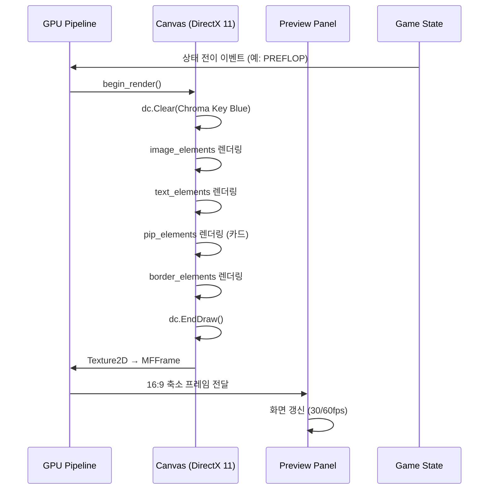
```mermaid
sequenceDiagram
    participant GPU as GPU Pipeline
    participant CV as Canvas (DirectX 11)
    participant PV as Preview Panel
    participant GS as Game State

    GS->>GPU: 상태 전이 이벤트 (예: PREFLOP)
    GPU->>CV: begin_render()
    CV->>CV: dc.Clear(Chroma Key Blue)
    CV->>CV: image_elements 렌더링
    CV->>CV: text_elements 렌더링
    CV->>CV: pip_elements 렌더링 (카드)
    CV->>CV: border_elements 렌더링
    CV->>CV: dc.EndDraw()
    CV->>GPU: Texture2D → MFFrame
    GPU->>PV: 16:9 축소 프레임 전달
    PV->>PV: 화면 갱신 (30/60fps)
```

**비활성 조건**: M-09 Preview Toggle Off 시 렌더링 중단. GPU 초기화 실패 시 "GPU Error" 메시지 표시.

---

### M-03: CPU Indicator
CPU 사용률을 ProgressBar로 표시. 색상 코딩: Green(<60%), Yellow(<85%), Red(>=85%). M-04 GPU Indicator와 나란히 배치. 정보 표시 전용.

---

### M-04: GPU Indicator
GPU 사용률을 ProgressBar로 표시. 색상 코딩은 M-03과 동일. 30fps 이하 시 빨간색 전환 + 경고음(GPU 과부하 에러). 정보 표시 전용.

---

### M-05: RFID Status

**트리거**: RFID 리더 연결/해제 시 자동 갱신 | **전제조건**: 없음 (항상 표시)

**로직**: RFID 리더 연결 상태를 아이콘+뱃지로 표시. Green=Connected, Red=Disconnected, Yellow=Calibrating. RFID 인식 실패 시 5초 카운트다운 후 수동 입력 그리드 활성화.

**영향 요소**: Y-03 (Reset 시 Yellow → Green/Red 전환), Y-04 (Calibrate 시 Yellow 상태), M-13 (Register Deck 진행 중 상태 변화)

**비활성 조건**: 없음 (항상 활성)

---

### M-06: Error Icon

**트리거**: 에러 발생 시 자동 뱃지 카운트 증가. 클릭 시 로그 팝업. | **전제조건**: 없음

**로직**: 미해결 에러 카운트를 뱃지로 표시. 클릭하면 최근 에러 로그 팝업이 열린다. 에러는 심각도별 색상 구분: 빨강=긴급, 노랑=경고, 회색=정보. 최근 5개만 메인 표시, 전체 로그는 Y-10 System Log에서 확인.

**영향 요소**: Y-10 (전체 로그 뷰어)

---

### M-07: Lock Toggle

**트리거**: 버튼 클릭 또는 Ctrl+L 단축키 (M-19)

**전제조건**: 없음 (어떤 상태에서든 토글 가능)

**로직 플로우**:
1. 운영자가 Lock 아이콘 클릭 또는 Ctrl+L 입력
2. Lock 상태가 토글됨 (Unlocked ↔ Locked)
3. Lock 활성 시: 모든 탭(Sources, Outputs, GFX, Rules, System)의 설정 변경 컨트롤이 비활성화됨
4. Lock 해제 시: 모든 컨트롤이 원래 상태로 복원됨
5. 액션 버튼(M-11~M-16)는 Lock 영향을 받지 않음 (긴급 조작 보장)

**상태 변화**: Lock 활성 시 자물쇠 아이콘이 닫힌 자물쇠로 변경. 탭 영역에 그레이아웃 오버레이 적용.

**영향 요소**:
| 요소 | 변화 |
|------|------|
| Sources (S-00~S-18) | 전체 비활성화 |
| Outputs (O-01~O-20) | 전체 비활성화 |
| GFX 1 (G-01~G-25) | 전체 비활성화 |
| GFX 2 (G-26~G-39, G-52~G-57) | 전체 비활성화 |
| GFX 3 / Display (G-40~G-51) | 전체 비활성화 |
| System (Y-01~Y-24) | 전체 비활성화 |
| M-11~M-16 | 영향 없음 (액션 버튼) |
| M-19 | Ctrl+L로 Lock 토글 (항상 활성) |

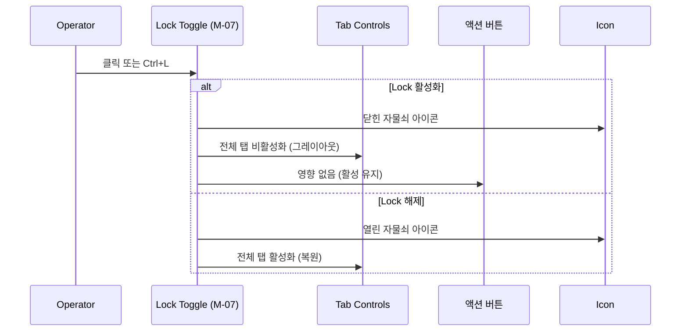
```mermaid
sequenceDiagram
    participant OP as Operator
    participant LK as Lock Toggle (M-07)
    participant TB as Tab Controls
    participant QA as 액션 버튼
    participant IC as Icon

    OP->>LK: 클릭 또는 Ctrl+L
    alt Lock 활성화
        LK->>IC: 닫힌 자물쇠 아이콘
        LK->>TB: 전체 탭 비활성화 (그레이아웃)
        LK->>QA: 영향 없음 (활성 유지)
    else Lock 해제
        LK->>IC: 열린 자물쇠 아이콘
        LK->>TB: 전체 탭 활성화 (복원)
    end
```

**비활성 조건**: 없음

---

### M-08: Secure Delay

> **추후 개발**: Delay 이중 출력 구조는 현재 범위에서 제외. 추후 개발 시 구현.

**트리거**: 체크박스 토글 또는 Ctrl+D 단축키

**전제조건**: I/O 탭에서 Delay 파이프라인(O-06, O-07)이 설정되어 있어야 함

**로직 플로우**:
1. 운영자가 Secure Delay 체크박스 토글
2. 활성화 시: Broadcast Canvas(`canvas_delayed`) 파이프라인이 시작됨
3. `thread_worker_process_delay`가 `MDelayClass` 내부 버퍼에 프레임 저장 시작
4. O-08에서 설정된 딜레이 시간(기본 30분)만큼 버퍼링 후 `delayed_frames` 큐로 출력
5. M-10 Delay Progress가 표시되어 남은 딜레이 시간을 프로그레스바로 보여줌
6. 비활성화 시: Broadcast 파이프라인 중단, 딜레이 버퍼 플러시

**상태 변화**: Broadcast Canvas 활성/비활성 전환. M-10 프로그레스바 표시/숨김.

**영향 요소**:
| 요소 | 변화 |
|------|------|
| M-02 | Broadcast Canvas 출력이 Preview에 반영 |
| M-10 | 딜레이 잔여 시간 프로그레스바 표시/숨김 |
| O-06+O-07 | Delay 파이프라인 활성/비활성 |
| O-08 | 딜레이 시간 설정값 적용 |

> **추후 개발** 범위의 인터랙션 다이어그램.

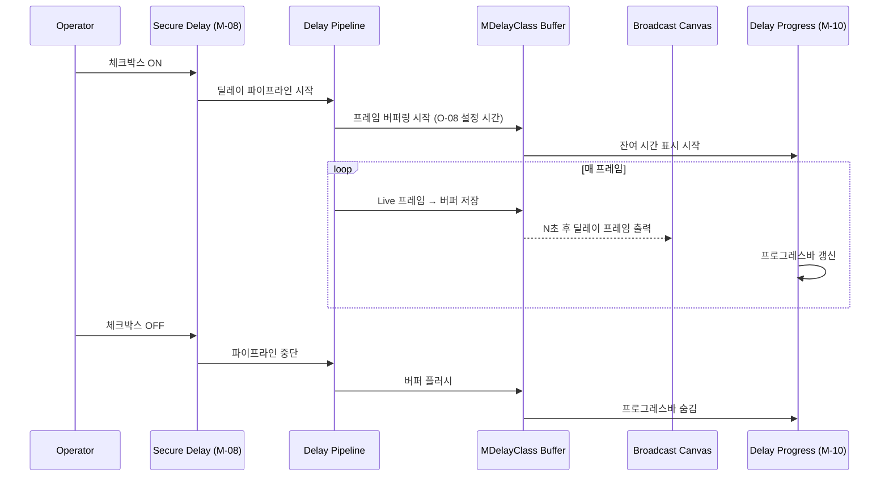
```mermaid
sequenceDiagram
    participant OP as Operator
    participant SD as Secure Delay (M-08)
    participant DP as Delay Pipeline
    participant BF as MDelayClass Buffer
    participant BC as Broadcast Canvas
    participant PG as Delay Progress (M-10)

    OP->>SD: 체크박스 ON
    SD->>DP: 딜레이 파이프라인 시작
    DP->>BF: 프레임 버퍼링 시작 (O-08 설정 시간)
    BF->>PG: 잔여 시간 표시 시작
    loop 매 프레임
        DP->>BF: Live 프레임 → 버퍼 저장
        BF-->>BC: N초 후 딜레이 프레임 출력
        PG->>PG: 프로그레스바 갱신
    end
    OP->>SD: 체크박스 OFF
    SD->>DP: 파이프라인 중단
    DP->>BF: 버퍼 플러시
    BF->>PG: 프로그레스바 숨김
```

**비활성 조건**: Delay 파이프라인(O-06, O-07)이 미설정 시 체크박스 비활성

---

### M-09: Preview Toggle

**트리거**: 체크박스 토글 | **전제조건**: 없음

**로직**: Preview 렌더링 On/Off 전환. Off 시 GPU 렌더링을 중단하여 CPU/GPU 리소스를 절약한다. 출력 파이프라인(Live)은 영향 없이 계속 동작.

**영향 요소**: M-02 (Preview Panel 렌더링 중단/재개), M-03/M-04 (CPU/GPU 사용률 감소)

---

### M-10: Delay Progress

> **추후 개발**: Delay 이중 출력 구조는 현재 범위에서 제외. 추후 개발 시 구현.

**트리거**: M-08 Secure Delay 활성 시 자동 표시

**전제조건**: M-08 Secure Delay가 활성 상태

**로직 플로우**:
1. M-08 활성 시 LinearProgressIndicator가 화면에 표시됨
2. `MDelayClass` 버퍼의 현재 채움 비율을 프로그레스바로 표시
3. 프로그레스바 옆에 텍스트로 남은 시간 표시 (예: "28:30 remaining")
4. 버퍼가 가득 차면(설정 딜레이 시간 도달) 프로그레스바 100% + "Buffer Full" 표시
5. O-08에서 딜레이 시간 변경 시 프로그레스바 범위 재계산
6. 딜레이 버퍼 이상 발생 시 프로그레스바가 Red로 전환

**상태 변화**: 버퍼 상태에 따라 색상 변화 (Blue: 채움 중, Green: 가득 참, Red: 이상)

**영향 요소**:
| 요소 | 변화 |
|------|------|
| M-08 | Secure Delay Off 시 프로그레스바 숨김 |
| O-08 | 딜레이 시간 변경 시 프로그레스바 범위 재조정 |

> **추후 개발** 범위의 인터랙션 다이어그램.

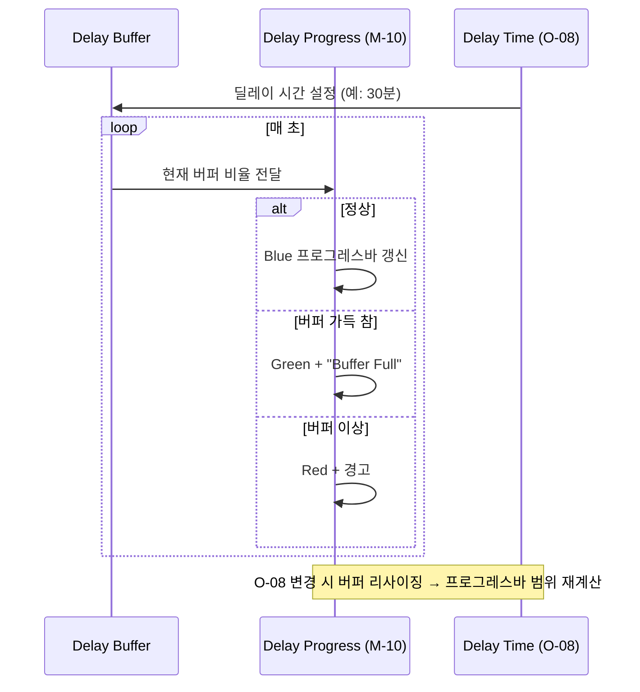
```mermaid
sequenceDiagram
    participant BF as Delay Buffer
    participant PG as Delay Progress (M-10)
    participant O8 as Delay Time (O-08)

    O8->>BF: 딜레이 시간 설정 (예: 30분)
    loop 매 초
        BF->>PG: 현재 버퍼 비율 전달
        alt 정상
            PG->>PG: Blue 프로그레스바 갱신
        else 버퍼 가득 참
            PG->>PG: Green + "Buffer Full"
        else 버퍼 이상
            PG->>PG: Red + 경고
        end
    end
    Note over O8,PG: O-08 변경 시 버퍼 리사이징 → 프로그레스바 범위 재계산
```

**비활성 조건**: M-08 Secure Delay 비활성 시 숨김 처리

---

### M-11: Reset Hand

**트리거**: 버튼 클릭 또는 F5 단축키

**전제조건**: 게임이 IDLE 이외의 상태일 때 활성

**로직 플로우**:
1. 운영자가 Reset Hand 버튼 클릭 또는 F5 입력
2. 확인 다이얼로그 표시: "현재 핸드를 초기화하시겠습니까?"
3. 확인 시:
   a. 게임 상태를 현재 상태에서 IDLE로 강제 전이
   b. 모든 좌석의 RFID 카드 데이터 초기화
   c. Preview Panel의 오버레이를 IDLE 상태(리더보드/대기 화면)로 전환
   d. AT에 TCP로 핸드 초기화 메시지 전송
   e. M-17 Hand Counter는 변경하지 않음 (현재 핸드 번호 유지)
4. 취소 시: 아무 동작 없음

**상태 변화**: 게임 상태 → IDLE. 모든 카드 슬롯 초기화. AT 동기화.

**영향 요소**:
| 요소 | 변화 |
|------|------|
| M-02 | Preview가 IDLE 상태(리더보드/대기)로 전환 |
| M-05 | RFID 상태 유지 (리셋 아님) |
| M-17 | Hand Counter 변경 없음 |
| M-18 | AT 연결 상태 유지, 초기화 메시지 전송 |

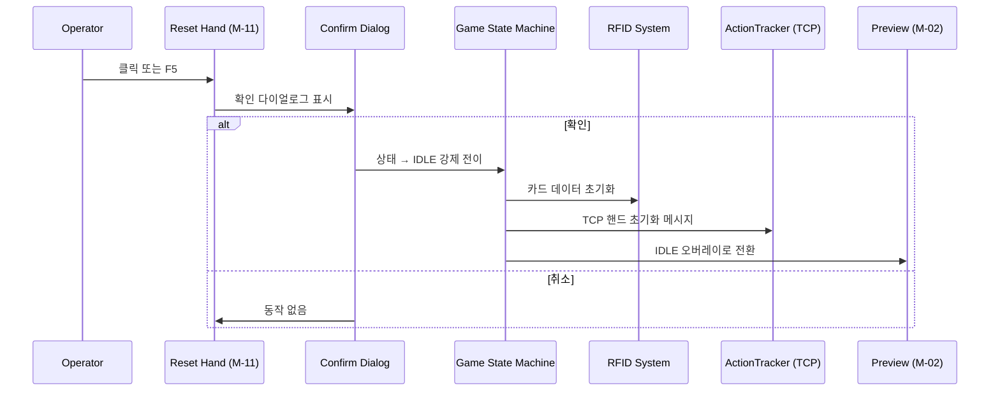
```mermaid
sequenceDiagram
    participant OP as Operator
    participant RH as Reset Hand (M-11)
    participant DG as Confirm Dialog
    participant GS as Game State Machine
    participant RF as RFID System
    participant AT as ActionTracker (TCP)
    participant PV as Preview (M-02)

    OP->>RH: 클릭 또는 F5
    RH->>DG: 확인 다이얼로그 표시
    alt 확인
        DG->>GS: 상태 → IDLE 강제 전이
        GS->>RF: 카드 데이터 초기화
        GS->>AT: TCP 핸드 초기화 메시지
        GS->>PV: IDLE 오버레이로 전환
    else 취소
        DG->>RH: 동작 없음
    end
```

**비활성 조건**: 게임 상태가 이미 IDLE일 때 비활성 (회색 처리)

---

### M-12: Settings

**트리거**: 버튼 클릭 | **전제조건**: 없음

**로직**: 전역 설정 다이얼로그를 모달로 표시. 테마(Dark/Light), 언어, 단축키 바인딩, 자동 저장 간격 등을 설정. 변경 사항은 Ctrl+S 또는 다이얼로그 내 "Save" 버튼으로 저장. Lock(M-07) 영향을 받지 않음.

**영향 요소**: 전역 설정 변경은 모든 화면에 반영

---

### M-13: Register Deck

**트리거**: 버튼 클릭 또는 F7 단축키

**전제조건**: RFID 리더가 연결 상태(M-05 Green), 게임 상태가 IDLE

**로직 플로우**:
1. 운영자가 Register Deck 버튼 클릭 또는 F7 입력
2. 52장 순차 등록 다이얼로그가 모달로 열림
3. 다이얼로그에 현재 등록 대상 카드 표시 (예: "Scan: 2c (1/52)")
4. 운영자가 해당 카드를 안테나에 배치
5. RFID 리더가 UID를 읽고 DB에 매핑:
   a. 성공 → 다음 카드로 진행 (2/52, 3/52, ...)
   b. 실패 → 5초 재시도 → 재실패 시 "Skip" 또는 "Retry" 선택
6. 52장 완료 시 "등록 완료" 메시지 + 다이얼로그 자동 닫힘
7. 중간 취소 가능 (부분 등록 상태로 저장하지 않고 롤백)

**상태 변화**: cards DB의 uid 컬럼이 NULL에서 실제 RFID UID로 매핑됨

**영향 요소**:
| 요소 | 변화 |
|------|------|
| M-05 | 등록 중 Yellow 상태 → 완료 후 Green |
| M-02 | 등록 중 Preview에 카드 스캔 진행 상황 표시 가능 |
| Y-03 | RFID Reset 시 등록 데이터 초기화 주의 |

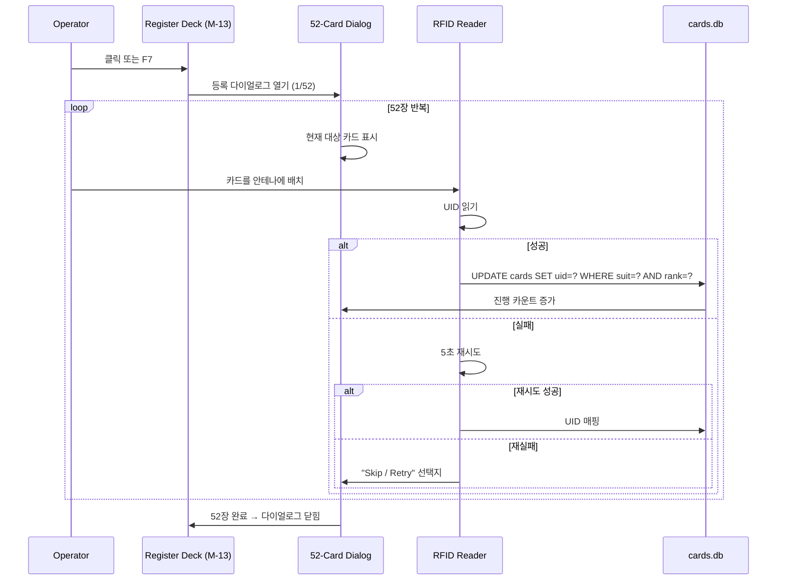
```mermaid
sequenceDiagram
    participant OP as Operator
    participant RD as Register Deck (M-13)
    participant DG as 52-Card Dialog
    participant RF as RFID Reader
    participant DB as cards.db

    OP->>RD: 클릭 또는 F7
    RD->>DG: 등록 다이얼로그 열기 (1/52)
    loop 52장 반복
        DG->>DG: 현재 대상 카드 표시
        OP->>RF: 카드를 안테나에 배치
        RF->>RF: UID 읽기
        alt 성공
            RF->>DB: UPDATE cards SET uid=? WHERE suit=? AND rank=?
            DB->>DG: 진행 카운트 증가
        else 실패
            RF->>RF: 5초 재시도
            alt 재시도 성공
                RF->>DB: UID 매핑
            else 재실패
                RF->>DG: "Skip / Retry" 선택지
            end
        end
    end
    DG->>RD: 52장 완료 → 다이얼로그 닫힘
```

**비활성 조건**: RFID 리더 미연결(M-05 Red) 또는 게임 진행 중(IDLE 아닌 상태)

---

### M-14: Launch AT

**트리거**: 버튼 클릭 또는 F8 단축키

**전제조건**: 없음 (AT 미실행 시 실행, 실행 중이면 포커스 전환)

**로직 플로우**:
1. 운영자가 Launch AT 버튼 클릭 또는 F8 입력
2. AT 프로세스 존재 여부 확인
3. AT 미실행 시:
   a. AT 앱을 별도 프로세스로 실행
   b. TCP :8888 포트 연결 대기
   c. 연결 성공 시 M-18 Connection Status의 AT 항목이 Green으로 전환
   d. 연결 실패 시 "AT 연결 실패" 경고 + 재시도 옵션
4. AT 이미 실행 중이면: 해당 창으로 포커스 전환
5. Y-13 "Allow AT Access"가 비활성이면 AT 실행을 차단하고 경고 표시

**상태 변화**: AT 프로세스 실행/포커스 전환. M-18 AT 연결 상태 Green.

**영향 요소**:
| 요소 | 변화 |
|------|------|
| M-18 | AT 연결 상태가 Red → Green으로 전환 |
| Y-13 | Allow AT Access 비활성 시 실행 차단 |
| Y-14 | Predictive Bet 설정이 AT에 전달 |
| Y-15 | Kiosk Mode 설정이 AT에 전달 |

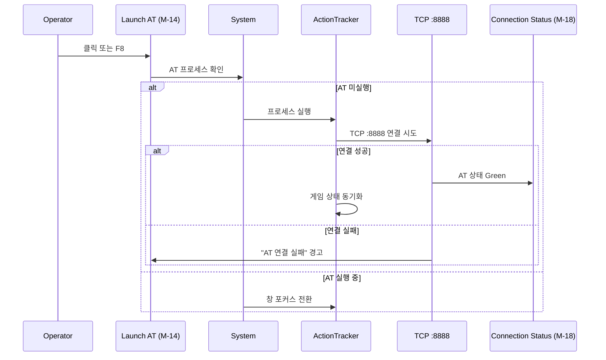
```mermaid
sequenceDiagram
    participant OP as Operator
    participant LA as Launch AT (M-14)
    participant SYS as System
    participant AT as ActionTracker
    participant TCP as TCP :8888
    participant CS as Connection Status (M-18)

    OP->>LA: 클릭 또는 F8
    LA->>SYS: AT 프로세스 확인
    alt AT 미실행
        SYS->>AT: 프로세스 실행
        AT->>TCP: TCP :8888 연결 시도
        alt 연결 성공
            TCP->>CS: AT 상태 Green
            AT->>AT: 게임 상태 동기화
        else 연결 실패
            TCP->>LA: "AT 연결 실패" 경고
        end
    else AT 실행 중
        SYS->>AT: 창 포커스 전환
    end
```

**비활성 조건**: Y-13 Allow AT Access 비활성 시 버튼 비활성 + "AT Access Disabled" 툴팁

---

### M-15: Split Recording

**트리거**: 버튼 토글 | **전제조건**: 녹화 기능(O-15)이 활성 상태

**로직**: 핸드별 분할 녹화를 On/Off 토글. 활성 시 각 핸드가 종료(COMPLETE → IDLE)될 때마다 현재 녹화 파일을 종료하고 새 파일을 시작한다. 파일명에 Hand# 포함.

**영향 요소**: O-15 (Recording Mode와 연동), M-17 (Hand Counter 값을 파일명에 사용)

**비활성 조건**: O-15 Recording이 비활성일 때

---

### M-16: Tag Player

**트리거**: Dropdown 선택 + 텍스트 입력 | **전제조건**: 게임 진행 중 (플레이어 존재)

**로직**: 플레이어 Dropdown에서 대상 선택 후 태그 텍스트 입력. 태그는 Hand History에 기록되어 하이라이트 검색/필터에 활용. 방송 오버레이에는 반영되지 않음.

**영향 요소**: Hand History DB (태그 기록)

**비활성 조건**: 게임 미진행(IDLE) 시 비활성

---

### M-17: Hand Counter

> **[PRD-0004 v22.0.0에서 제거됨]** M-17은 신규 추가 기능으로 분류되어 v22.0.0 재설계에서 제외됨.

현재 세션의 핸드 번호를 Badge로 표시 (예: "Hand #47"). 게임 상태가 SETUP에 진입할 때마다 자동 증가. M-11 Reset Hand로는 카운터가 리셋되지 않음. G-46 "Show Hand #" 체크 시 Viewer Overlay에도 표시.

---

### M-18: Connection Status

> **[PRD-0004 v22.0.0에서 제거됨]** M-18은 신규 추가 기능으로 분류되어 v22.0.0 재설계에서 제외됨.

**트리거**: 연결 상태 변경 시 자동 갱신 | **전제조건**: 없음

**로직**: AT / Overlay Client / DB 세 가지 연결 상태를 각각 Green(연결)/Red(끊김) 아이콘으로 표시. 네트워크 끊김 감지 시 30초 자동 재연결을 시도하고, 실패 시 "수동 재연결" 버튼 활성화.

**영향 요소**: M-14 (AT 실행 시 AT 항목 Green), Y-13 (AT Access 설정)

**비활성 조건**: 없음 (항상 표시)

---

### M-19: Quick Lock

> **[PRD-0004 v22.0.0에서 제거됨]** M-19은 신규 추가 기능으로 분류되어 v22.0.0 재설계에서 제외됨.

Ctrl+L 키보드 단축키. M-07 Lock Toggle과 동일한 동작을 키보드로 수행. Lock 상태 토글 결과는 M-07에 반영.

---

### M-20: Fullscreen Preview

> **[PRD-0004 v22.0.0에서 제거됨]** M-20은 신규 추가 기능으로 분류되어 v22.0.0 재설계에서 제외됨.

**트리거**: 버튼 클릭 또는 F11 단축키 | **전제조건**: M-09 Preview Toggle이 On

**로직**: Preview Panel(M-02)을 전체 화면으로 확장. ESC 키로 원래 크기로 복귀. 전체 화면 중에도 단축키(Ctrl+L, F5, F7, F8)는 동작하여 긴급 조작이 가능.

**영향 요소**: M-02 (전체 화면 전환)

**비활성 조건**: M-09 Preview Toggle Off 시 비활성

---

## 3장: I/O 탭 기능 상세 (Sources — v22.0.0에서 I/O 탭으로 통합)

### 요소 인덱스

| ID | 요소 | 상세도 |
|----|------|--------|
| S-00 | Output Mode Selector | Complex |
| S-01 | Device Table | Medium |
| S-02 | Add Button | Medium |
| S-03 | Settings (per source) | Medium |
| S-04 | Preview (per source) | Simple |
| S-05 | Board Cam Hide GFX | Medium |
| S-06 | Auto Camera Control | Complex |
| S-07 | Camera Mode | Medium |
| S-08 | Heads Up Split | Simple |
| S-09 | Follow Players | Simple |
| S-10 | Follow Board | Simple |
| S-11 | Background Enable | Medium |
| S-12 | Background Colour | Simple |
| S-13 | Switcher Source | Medium |
| S-14 | ATEM Control | Complex |
| S-15 | Board Sync | Simple |
| S-16 | Crossfade | Simple |
| S-17 | Audio Input Source | Medium |
| S-18 | Audio Sync | Simple |

---

### S-00: Output Mode Selector

> **[PRD-0004 v22.0.0에서 제거됨]** S-00은 신규 추가 기능으로 분류되어 v22.0.0 재설계에서 제외됨.

**트리거**: RadioGroup 선택 변경

**전제조건**: Lock(M-07) 해제 상태

**로직 플로우**:
1. 운영자가 3가지 모드 중 하나를 선택: Fill & Key / Chroma Key / Internal
2. 모드 변경 시 하위 요소의 가시성과 필수 여부가 재결정됨:
   - **Fill & Key**: DeckLink 장치 필수. S-13, S-14 ATEM 설정 표시. S-11, S-12 배경 설정 숨김. O-05, O-07 Fill&Key 채널 할당 활성.
   - **Chroma Key**: S-11 배경 활성화 표시, S-12 배경색 선택 표시. S-13, S-14 ATEM 숨김. O-18 Key Color 활성.
   - **Internal**: 내부 캡처 소스(S-01~S-04) 중심. S-13, S-14 숨김. S-11, S-12 숨김.
3. 모드 변경은 I/O 탭(O-04~O-07, O-18~O-20) 구성에도 영향
4. 라이브 중 모드 변경 시 확인 다이얼로그 표시 ("라이브 중 모드 변경은 방송 중단을 유발할 수 있습니다")

**상태 변화**: 선택된 모드에 따라 I/O 탭의 가시성 재구성

**영향 요소**:
| 요소 | 변화 |
|------|------|
| S-11, S-12 | Chroma Key 모드에서만 표시 |
| S-13, S-14 | Fill & Key 모드에서만 표시 |
| O-05, O-07 | Fill & Key 모드에서 채널 할당 활성 |
| O-18 | Chroma Key 모드에서 Key Color 활성 |
| O-19, O-20 | Fill & Key 모드에서 활성 |

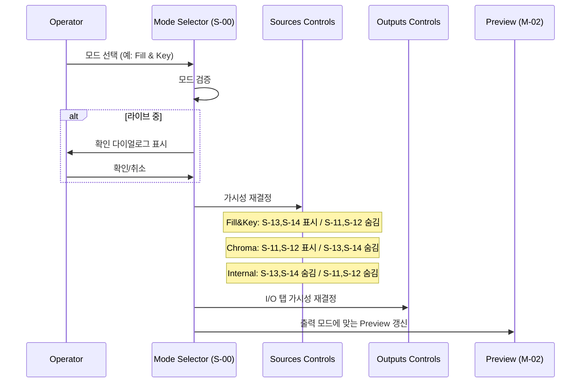
```mermaid
sequenceDiagram
    participant OP as Operator
    participant SM as Mode Selector (S-00)
    participant SC as Sources Controls
    participant OC as Outputs Controls
    participant PV as Preview (M-02)

    OP->>SM: 모드 선택 (예: Fill & Key)
    SM->>SM: 모드 검증
    alt 라이브 중
        SM->>OP: 확인 다이얼로그 표시
        OP->>SM: 확인/취소
    end
    SM->>SC: 가시성 재결정
    Note over SC: Fill&Key: S-13,S-14 표시 / S-11,S-12 숨김
    Note over SC: Chroma: S-11,S-12 표시 / S-13,S-14 숨김
    Note over SC: Internal: S-13,S-14 숨김 / S-11,S-12 숨김
    SM->>OC: I/O 탭 가시성 재결정
    SM->>PV: 출력 모드에 맞는 Preview 갱신
```

**비활성 조건**: Lock(M-07) 활성 시 변경 불가

---

### S-01: Device Table

**트리거**: 시스템 시작 시 자동 스캔 + S-02 Add로 수동 추가 | **전제조건**: 없음

**로직**: NDI, 캡처 카드(DeckLink), 네트워크 카메라를 DataTable로 표시. 각 행에 장치명, 해상도, 상태(연결/끊김), 할당 상태 표시. 행 선택 시 S-03 Settings와 S-04 Preview 활성화.

**영향 요소**: S-03 (선택된 소스의 상세 설정), S-04 (선택된 소스의 미니 프리뷰), O-04 (Live 파이프라인 장치 할당), O-06 (Delay 파이프라인 장치 할당, 추후 개발 시)

---

### S-02: Add Button

**트리거**: 버튼 클릭 | **전제조건**: Lock 해제

**로직**: 클릭 시 NDI 자동 탐색을 시작하거나 수동 URL 입력 다이얼로그를 표시. NDI 탐색 중에는 "Scanning NDI Sources..." 스피너 표시(2~5초). 발견된 소스 목록을 팝업으로 보여주고 선택 시 S-01 Device Table에 추가.

**영향 요소**: S-01 (테이블에 새 소스 추가)

---

### S-03: Settings (per source)

**트리거**: S-01에서 소스 선택 후 설정 아이콘 클릭 | **전제조건**: S-01에서 소스 선택됨

**로직**: 선택된 비디오 소스의 해상도, 프레임레이트, 크롭 영역을 설정하는 팝업. 변경 즉시 Preview(M-02)에 반영.

**영향 요소**: M-02 (설정 변경 시 Preview 갱신), O-01 (출력 해상도와 소스 해상도 불일치 시 스케일링)

**비활성 조건**: S-01에서 소스 미선택 시

---

### S-04: Preview (per source)
소스별 미니 프리뷰를 IconButton 클릭으로 팝업 표시. S-01에서 선택된 소스의 실시간 입력 영상을 확인. 참조 전용, 다른 요소에 영향 없음.

---

### S-05: Board Cam Hide GFX

**트리거**: 체크박스 토글 | **전제조건**: 비디오 소스에 Board Camera가 할당됨

**로직**: 활성 시 Board Camera가 활성화될 때(보드 카드 딜링 시) GFX 오버레이를 자동 숨김. 보드 카메라 전환 → GFX 자동 Hide → 카메라 복귀 → GFX 자동 Show. 보드 카드가 물리적으로 보이는 동안 디지털 오버레이를 제거하여 시각적 충돌 방지.

**영향 요소**: M-02 (GFX 숨김/표시), S-06 (Auto Camera Control과 연동)

---

### S-06: Auto Camera Control

**트리거**: 체크박스 토글

**전제조건**: 비디오 소스(S-01)에 카메라가 2개 이상 등록됨

**로직 플로우**:
1. 체크박스 활성 시 게임 상태 기반 자동 카메라 전환이 시작됨
2. 게임 상태 머신의 전이에 따라 카메라를 자동 선택:
   - IDLE/SETUP: Wide Shot (테이블 전체)
   - PREFLOP: 현재 액션 플레이어 카메라
   - FLOP/TURN/RIVER: Board Camera (S-05와 연동)
   - SHOWDOWN: 위너 플레이어 카메라
3. S-07 Camera Mode에 따라 전환 방식 결정:
   - Static: 직접 컷 전환
   - Dynamic: S-16 Crossfade 시간으로 부드러운 전환
4. S-09 Follow Players 활성 시 베팅 액션 플레이어로 자동 추적
5. S-10 Follow Board 활성 시 보드 카드 딜링 시 보드 카메라로 전환

**상태 변화**: 게임 상태 전이마다 자동 카메라 전환 발생

**영향 요소**:
| 요소 | 변화 |
|------|------|
| S-05 | Board Camera 전환 시 GFX 자동 숨김 연동 |
| S-07 | Static/Dynamic 모드에 따른 전환 방식 |
| S-08 | Heads Up 시 화면 분할 |
| S-09 | 플레이어 추적 활성/비활성 |
| S-10 | 보드 추적 활성/비활성 |
| S-14 | ATEM Control 활성 시 스위처를 통한 카메라 전환 |
| S-16 | Dynamic 모드의 크로스페이드 시간 |

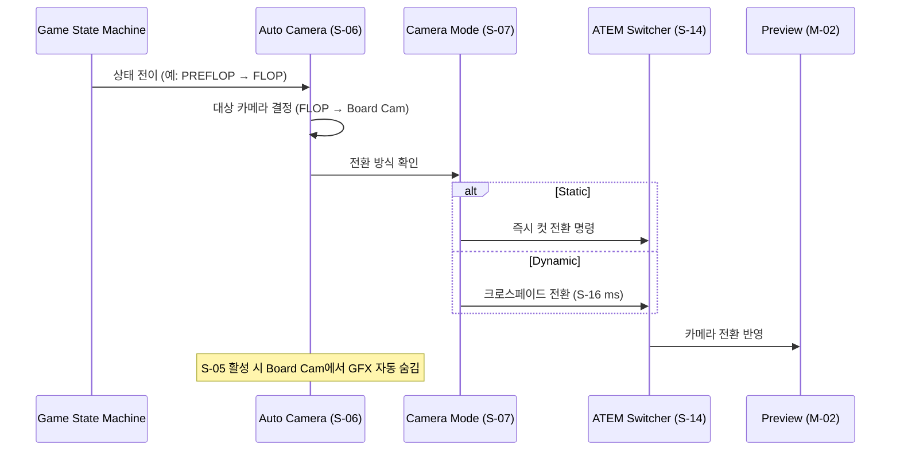
```mermaid
sequenceDiagram
    participant GS as Game State Machine
    participant AC as Auto Camera (S-06)
    participant CM as Camera Mode (S-07)
    participant AT as ATEM Switcher (S-14)
    participant PV as Preview (M-02)

    GS->>AC: 상태 전이 (예: PREFLOP → FLOP)
    AC->>AC: 대상 카메라 결정 (FLOP → Board Cam)
    AC->>CM: 전환 방식 확인
    alt Static
        CM->>AT: 즉시 컷 전환 명령
    else Dynamic
        CM->>AT: 크로스페이드 전환 (S-16 ms)
    end
    AT->>PV: 카메라 전환 반영
    Note over AC: S-05 활성 시 Board Cam에서 GFX 자동 숨김
```

**비활성 조건**: 비디오 소스 1개 이하 등록 시, Lock 활성 시

---

### S-07: Camera Mode

**트리거**: Dropdown 선택 | **전제조건**: S-06 Auto Camera Control 활성

**로직**: Static(직접 컷) / Dynamic(크로스페이드) 모드 선택. Dynamic 모드 시 S-16 Crossfade 시간이 적용됨.

**영향 요소**: S-06 (카메라 전환 방식), S-16 (Dynamic 모드에서 크로스페이드 시간)

**비활성 조건**: S-06 비활성 시

---

### S-08: Heads Up Split
헤즈업(2인 대결) 시 화면을 좌/우로 분할하여 양 플레이어를 동시 표시. G-07, G-08 Heads Up Layout과 연동. S-06 활성 시 자동 적용.

---

### S-09: Follow Players
체크박스. 활성 시 현재 베팅 액션 중인 플레이어로 카메라가 자동 추적. S-06 Auto Camera Control이 전제조건.

---

### S-10: Follow Board
체크박스. 활성 시 보드 카드 딜링 시점에 보드 카메라로 자동 전환. S-06 Auto Camera Control이 전제조건.

---

### S-11: Background Enable

**트리거**: 체크박스 토글 | **전제조건**: S-00에서 Chroma Key 모드 선택

**로직**: Chroma Key 배경 활성/비활성. 활성 시 S-12 Background Colour에서 설정한 색상이 Preview 배경에 적용됨. Canvas의 `_background_colour` 값이 변경됨.

**영향 요소**: S-12 (배경색 활성/비활성), M-02 (Preview 배경색 변경)

**비활성 조건**: S-00이 Fill & Key 또는 Internal 모드일 때 숨김

---

### S-12: Background Colour
ColorPicker. S-11 활성 시 Chroma Key 배경색 선택 (기본: Blue). 선택 즉시 Preview(M-02)에 반영. S-00이 Chroma Key 모드이고 S-11이 활성일 때만 표시.

---

### S-13: Switcher Source

**트리거**: Dropdown 선택 | **전제조건**: S-00 Fill & Key 모드, S-14 ATEM 연결됨

**로직**: ATEM 스위처에 연결된 입력 소스 중 GFX 출력 대상을 선택. 스위처의 DSK(Downstream Key) 레이어에 Fill & Key 신호를 라우팅하는 소스를 지정.

**영향 요소**: S-14 (ATEM 연결 상태에 따라 소스 목록 갱신), O-05/O-07 (Fill & Key 출력 대상)

**비활성 조건**: S-00이 Fill & Key 외 모드일 때 숨김, S-14 ATEM 미연결 시 비활성

---

### S-14: ATEM Control

**트리거**: 체크박스 토글 + IP 주소 입력

**전제조건**: S-00에서 Fill & Key 모드 선택

**로직 플로우**:
1. 체크박스 활성화 후 ATEM 스위처 IP 주소 입력
2. 입력 완료(Enter 또는 Focus Out) 시 TCP 연결 시도
3. 연결 성공: Green 아이콘 + 스위처 모델명/입력 수 표시
4. 연결 실패: Red 아이콘 + "Connection Failed" 메시지 + 5초 후 자동 재시도
5. 연결 후 S-13 Switcher Source Dropdown에 ATEM의 입력 소스 목록이 채워짐
6. 연결 상태는 M-18 Connection Status에는 반영되지 않음 (AT/Overlay/DB만 표시)

**상태 변화**: ATEM 연결 상태 Green/Red 아이콘

**영향 요소**:
| 요소 | 변화 |
|------|------|
| S-13 | ATEM 연결 시 Switcher Source 목록 채움 |
| S-06 | Auto Camera 활성 시 ATEM을 통한 카메라 전환 |
| O-05, O-07 | Fill & Key 출력이 ATEM DSK로 라우팅 |

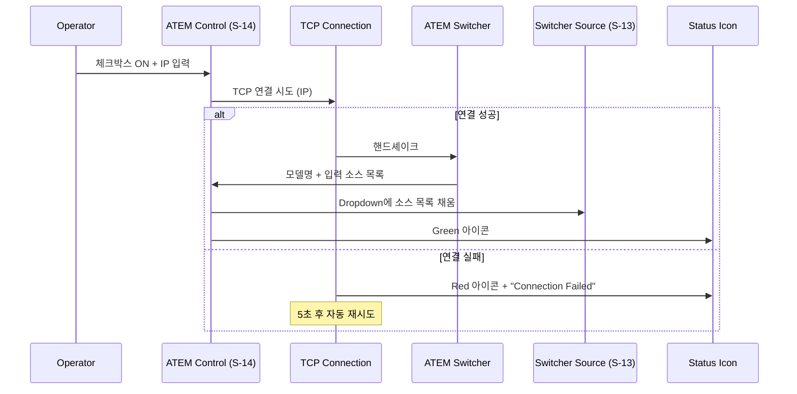
```mermaid
sequenceDiagram
    participant OP as Operator
    participant AC as ATEM Control (S-14)
    participant NET as TCP Connection
    participant SW as ATEM Switcher
    participant SS as Switcher Source (S-13)
    participant IC as Status Icon

    OP->>AC: 체크박스 ON + IP 입력
    AC->>NET: TCP 연결 시도 (IP)
    alt 연결 성공
        NET->>SW: 핸드셰이크
        SW->>AC: 모델명 + 입력 소스 목록
        AC->>SS: Dropdown에 소스 목록 채움
        AC->>IC: Green 아이콘
    else 연결 실패
        NET->>IC: Red 아이콘 + "Connection Failed"
        Note over NET: 5초 후 자동 재시도
    end
```

**비활성 조건**: S-00이 Fill & Key 외 모드일 때 숨김

---

### S-15: Board Sync
NumberInput. 보드 카메라와 GFX 오버레이 간 싱크 보정값 (ms 단위). 양수: GFX 지연, 음수: GFX 선행. 기본 0ms.

---

### S-16: Crossfade
NumberInput. 카메라 전환 시 크로스페이드 시간 (ms, 기본 300). S-07 Dynamic 모드에서 적용. S-06 Auto Camera Control 연동.

---

### S-17: Audio Input Source

**트리거**: Dropdown 선택 | **전제조건**: 없음

**로직**: 시스템에 연결된 오디오 입력 장치 목록에서 소스 선택. 선택된 오디오는 `thread_worker_audio`에서 처리되어 Live 파이프라인에 공급 (Delay는 추후 개발). 모든 출력 모드(Fill & Key, Chroma Key, Internal)에서 공통 적용.

**영향 요소**: O-04 (Live Audio), O-06 (Delay Audio, 추후 개발 시), S-18 (Audio Sync 보정 대상)

---

### S-18: Audio Sync
NumberInput. 오디오와 비디오 간 싱크 보정값 (ms 단위). S-17에서 선택된 오디오 소스에 적용. 양수: 오디오 지연. 기본 0ms.

---

## 4장: I/O 탭 기능 상세 (Outputs — v22.0.0에서 I/O 탭으로 통합)

### 요소 인덱스

| ID | 요소 | 상세도 |
|----|------|--------|
| O-01 | Video Size | Medium |
| O-02 | 9x16 Vertical | Simple |
| O-03 | Frame Rate | Medium |
| O-04 | Live Video/Audio/Device | Complex |
| O-05 | Live Key & Fill | Complex |
| O-06 | Delay Video/Audio/Device *(추후 개발)* | Complex |
| O-07 | Delay Key & Fill *(추후 개발)* | Complex |
| O-08 | Secure Delay Time *(추후 개발)* | Complex |
| O-09 | Dynamic Delay *(추후 개발)* | Medium |
| O-10 | Show Countdown *(추후 개발)* | Medium |
| O-11 | Countdown Video *(추후 개발)* | Simple |
| O-12 | Countdown Background *(추후 개발)* | Simple |
| O-13 | Auto Stream *(추후 개발)* | Simple |
| O-14 | Virtual Camera | Simple |
| O-15 | Recording Mode | Medium |
| O-16 | Streaming Platform | Medium |
| O-17 | Account Connect | Simple |
| O-18 | Key Color | Medium |
| O-19 | Fill/Key Preview | Medium |
| O-20 | DeckLink Channel Map | Complex |

---

### O-01: Video Size

**트리거**: Dropdown 선택 (1080p / 4K) | **전제조건**: Lock 해제

**로직**: 출력 해상도를 변경한다. 변경 시 전체 GPU 파이프라인이 재초기화되며, Preview(M-02)에 잠시 블랙아웃이 발생한 후 복구된다. Live 파이프라인에 적용 (Delay 추가 시 동일 적용).

**영향 요소**: M-02 (재초기화 중 블랙아웃), O-04 (Live 파이프라인 재초기화), O-06 (Delay 파이프라인 재초기화, 추후 개발 시), O-20 (DeckLink 채널 해상도)

**비활성 조건**: 라이브 스트리밍(O-16) 진행 중 변경 시 확인 다이얼로그

---

### O-02: 9x16 Vertical
세로 모드(9:16) 활성 체크박스. 모바일 스트리밍 대응. 활성 시 Canvas 비율이 16:9에서 9:16으로 전환. Preview(M-02) 비율도 변경. P2 기능.

---

### O-03: Frame Rate

**트리거**: Dropdown 선택 (30fps / 60fps) | **전제조건**: Lock 해제

**로직**: 출력 프레임레이트 설정. 60fps 선택 시 GPU 부하 증가(M-04 모니터링 필요). O-01과 마찬가지로 파이프라인 재초기화 발생.

**영향 요소**: M-04 (GPU 사용률 변화), O-04 (Live 파이프라인 프레임레이트), O-06 (Delay 파이프라인 프레임레이트, 추후 개발 시), M-02 (Preview 프레임레이트)

---

### O-04 + O-05: Live Pipeline

**트리거**: O-04 3개 Dropdown 선택 (Video/Audio/Device) + O-05 Fill & Key 채널 할당

**전제조건**: S-01에 비디오 소스 등록됨, S-00 모드에 따라 O-05 활성 여부 결정

**로직 플로우**:
1. **O-04 Live Video**: S-01 Device Table에서 Live 출력 대상 비디오 장치 선택
2. **O-04 Live Audio**: S-17 Audio Source와 별도로 Live 출력 오디오 장치 선택
3. **O-04 Live Device**: 물리적 출력 장치(DeckLink SDI/HDMI, NDI, SRT) 선택
4. **O-05 Live Fill**: DeckLink 포트 중 Live Fill(RGB) 신호 출력 채널 할당
5. **O-05 Live Key**: DeckLink 포트 중 Live Key(Alpha) 신호 출력 채널 할당
6. 선택 즉시 `thread_worker`(Live 메인 스레드)의 출력 타겟이 변경됨
7. 장치 변경 시 Preview(M-02)가 즉시 갱신됨

**상태 변화**: Live 출력 파이프라인의 타겟 장치/채널 변경

**영향 요소**:
| 요소 | 변화 |
|------|------|
| M-02 | Live 장치 변경 시 Preview 즉시 갱신 |
| O-20 | DeckLink Channel Map에서 포트 충돌 검증 |
| O-06+O-07 | Delay 파이프라인과 동일 포트 할당 불가 (Delay 추후 개발 시) |
| S-00 | Fill & Key 모드에서만 O-05 활성 |

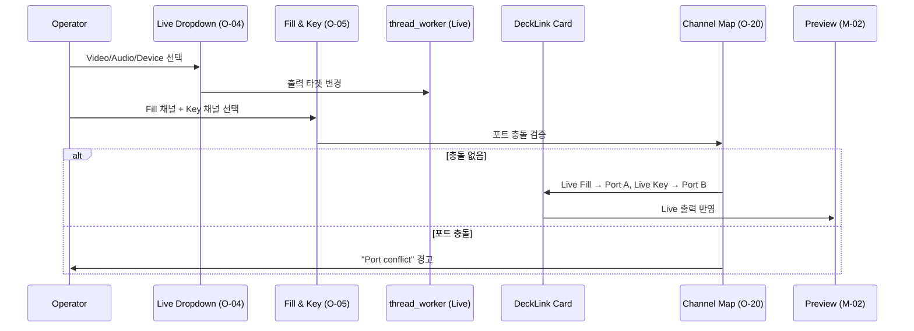
```mermaid
sequenceDiagram
    participant OP as Operator
    participant LV as Live Dropdown (O-04)
    participant FK as Fill & Key (O-05)
    participant TW as thread_worker (Live)
    participant DL as DeckLink Card
    participant CM as Channel Map (O-20)
    participant PV as Preview (M-02)

    OP->>LV: Video/Audio/Device 선택
    LV->>TW: 출력 타겟 변경
    OP->>FK: Fill 채널 + Key 채널 선택
    FK->>CM: 포트 충돌 검증
    alt 충돌 없음
        CM->>DL: Live Fill → Port A, Live Key → Port B
        DL->>PV: Live 출력 반영
    else 포트 충돌
        CM->>OP: "Port conflict" 경고
    end
```

**비활성 조건**: S-01 비디오 소스 미등록 시 O-04 비활성. S-00이 Fill & Key 외 모드 시 O-05 비활성.

---

### O-06 + O-07: Delay Pipeline

> **추후 개발**: Delay 이중 출력 구조는 현재 범위에서 제외. 추후 개발 시 구현.

**트리거**: O-06 3개 Dropdown 선택 + O-07 Fill & Key 채널 할당

**전제조건**: M-08 Secure Delay 활성, S-01 비디오 소스 등록됨

**로직 플로우**:
1. **O-06 Delay Video/Audio/Device**: Live(O-04)와 독립적인 Delay 전용 출력 장치 선택
2. **O-07 Delay Fill & Key**: DeckLink 포트 중 Delay Fill/Key 채널 할당 (Live와 다른 포트)
3. Delay 파이프라인은 `thread_worker_delayed`가 처리
4. `MDelayClass` 버퍼에서 O-08 설정 시간만큼 지연된 프레임을 수신하여 출력
5. Venue Canvas(Live)와 완전히 독립된 Broadcast Canvas를 별도 DeckLink 포트로 출력
6. 이 독립성이 Dual Canvas Architecture의 핵심: Hidden Information Problem을 하드웨어 수준에서 해결

**상태 변화**: Delay 출력 파이프라인의 타겟 장치/채널 변경

**영향 요소**:
| 요소 | 변화 |
|------|------|
| M-08 | Secure Delay 비활성 시 Delay 파이프라인 중단 |
| M-10 | Delay Progress 표시에 영향 |
| O-08 | 딜레이 시간 설정값 적용 |
| O-20 | DeckLink Channel Map에서 포트 충돌 검증 |
| O-04+O-05 | Live 파이프라인과 동일 포트 할당 불가 (추후 개발 시 적용) |

> **추후 개발** 범위의 인터랙션 다이어그램.

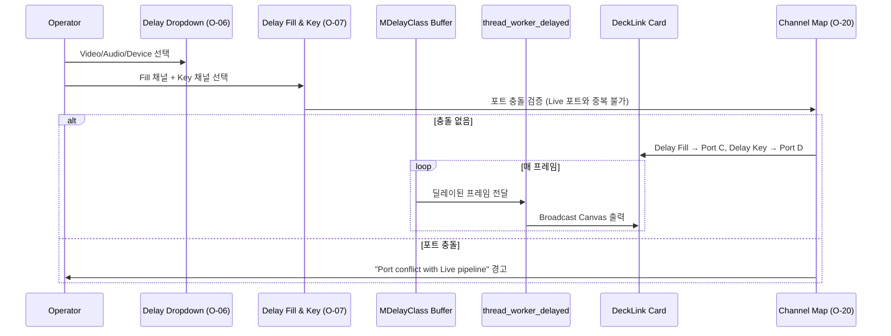
```mermaid
sequenceDiagram
    participant OP as Operator
    participant DV as Delay Dropdown (O-06)
    participant FK as Delay Fill & Key (O-07)
    participant BF as MDelayClass Buffer
    participant TD as thread_worker_delayed
    participant DL as DeckLink Card
    participant CM as Channel Map (O-20)

    OP->>DV: Video/Audio/Device 선택
    OP->>FK: Fill 채널 + Key 채널 선택
    FK->>CM: 포트 충돌 검증 (Live 포트와 중복 불가)
    alt 충돌 없음
        CM->>DL: Delay Fill → Port C, Delay Key → Port D
        loop 매 프레임
            BF->>TD: 딜레이된 프레임 전달
            TD->>DL: Broadcast Canvas 출력
        end
    else 포트 충돌
        CM->>OP: "Port conflict with Live pipeline" 경고
    end
```

**비활성 조건**: M-08 Secure Delay 비활성 시 전체 비활성. S-00 Fill & Key 외 모드 시 O-07 비활성.

---

### O-08: Secure Delay Time

> **추후 개발**: Delay 이중 출력 구조는 현재 범위에서 제외. 추후 개발 시 구현.

**트리거**: NumberInput 값 변경 (1~30분, 기본 30분)

**전제조건**: M-08 Secure Delay 활성

**로직 플로우**:
1. 운영자가 딜레이 시간을 변경 (1~30분 범위)
2. `MDelayClass` 내부 버퍼 크기가 리사이징됨:
   - 현재 버퍼보다 길어지면: 추가 프레임 적재 대기 (버퍼 확장)
   - 현재 버퍼보다 짧아지면: 초과 프레임 즉시 출력하여 버퍼 축소
3. 리사이징 중 Delay 출력이 일시 중단될 수 있음 (경고 표시)
4. M-10 Delay Progress의 프로그레스바 범위가 새 딜레이 시간으로 재계산됨
5. 라이브 중 변경 시 확인 다이얼로그: "딜레이 버퍼 리사이징은 방송 지연에 영향을 줄 수 있습니다"

**상태 변화**: 딜레이 버퍼 크기 변경, M-10 프로그레스바 범위 재계산

**영향 요소**:
| 요소 | 변화 |
|------|------|
| M-10 | 프로그레스바 최대값 재설정 |
| M-08 | Secure Delay 비활성 시 설정 무의미 |
| O-06+O-07 | 딜레이 파이프라인의 버퍼 시간 변경 |
| O-10 | Show Countdown의 카운트다운 시작점 변경 |

> **추후 개발** 범위의 인터랙션 다이어그램.

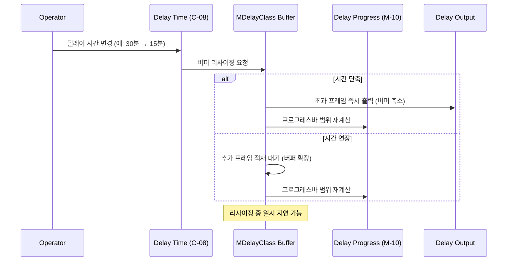
```mermaid
sequenceDiagram
    participant OP as Operator
    participant DT as Delay Time (O-08)
    participant BF as MDelayClass Buffer
    participant PG as Delay Progress (M-10)
    participant DO as Delay Output

    OP->>DT: 딜레이 시간 변경 (예: 30분 → 15분)
    DT->>BF: 버퍼 리사이징 요청
    alt 시간 단축
        BF->>DO: 초과 프레임 즉시 출력 (버퍼 축소)
        BF->>PG: 프로그레스바 범위 재계산
    else 시간 연장
        BF->>BF: 추가 프레임 적재 대기 (버퍼 확장)
        BF->>PG: 프로그레스바 범위 재계산
    end
    Note over BF: 리사이징 중 일시 지연 가능
```

**비활성 조건**: M-08 Secure Delay 비활성 시

---

### O-09: Dynamic Delay

> **추후 개발**: Delay 이중 출력 구조는 현재 범위에서 제외. 추후 개발 시 구현.

**트리거**: 체크박스 + 설정 | **전제조건**: M-08 Secure Delay 활성, O-08 설정됨

**로직**: 상황별 딜레이 시간 자동 조절. 예를 들어 All-in 상황에서는 딜레이를 동적으로 늘려 홀카드 노출 위험을 줄임. O-08의 기본 딜레이를 베이스로 +-N분 범위에서 자동 조절.

**영향 요소**: O-08 (기본 딜레이에 동적 보정), M-10 (프로그레스바 동적 갱신)

**비활성 조건**: M-08 Secure Delay 비활성 시

---

### O-10: Show Countdown

> **추후 개발**: Delay 이중 출력 구조는 현재 범위에서 제외. 추후 개발 시 구현.

**트리거**: 체크박스 토글 | **전제조건**: M-08 Secure Delay 활성

**로직**: 활성 시 Broadcast Canvas(방송 출력)에 딜레이 카운트다운을 표시. 시청자에게 "방송 시작까지 MM:SS" 형식으로 표시. O-11, O-12와 연동하여 카운트다운 중 영상/배경을 표시할 수 있음.

**영향 요소**: O-08 (카운트다운 시작점), O-11 (카운트다운 종료 시 영상), O-12 (카운트다운 배경)

**비활성 조건**: M-08 Secure Delay 비활성 시

---

### O-11: Countdown Video

> **추후 개발**: Delay 이중 출력 구조는 현재 범위에서 제외. 추후 개발 시 구현.

딜레이 카운트다운 종료 시 재생할 영상 파일 선택. O-10 Show Countdown이 활성일 때만 의미. P2 기능.

---

### O-12: Countdown Background

> **추후 개발**: Delay 이중 출력 구조는 현재 범위에서 제외. 추후 개발 시 구현.

딜레이 카운트다운 중 배경 이미지 선택. O-10 Show Countdown이 활성일 때만 의미. P2 기능.

---

### O-13: Auto Stream

> **추후 개발**: Delay 이중 출력 구조는 현재 범위에서 제외. 추후 개발 시 구현.

체크박스 + 시간 설정. 딜레이 버퍼가 가득 찬 후 지정 시간이 지나면 스트리밍을 자동 시작. O-16 Streaming Platform 설정 필요. P2 기능.

---

### O-14: Virtual Camera
가상 카메라(OBS Virtual Cam 등) 활성 체크박스. 활성 시 GFX 출력을 가상 카메라 장치로 노출하여 OBS 등 서드파티 소프트웨어에서 입력 소스로 사용 가능. P2 기능.

---

### O-15: Recording Mode

**트리거**: Dropdown 선택 (Video / Video+GFX / GFX only) | **전제조건**: 없음

**로직**: 녹화 대상을 선택. Video: 소스 영상만 녹화. Video+GFX: 소스 영상에 GFX 오버레이를 합성하여 녹화. GFX only: GFX 오버레이만 녹화 (투명 배경, 후편집용). `thread_worker_write`가 선택된 모드에 따라 녹화 프레임을 구성.

**영향 요소**: M-15 (Split Recording 토글과 연동), Y-11 (Secure Delay Folder에 녹화 파일 저장)

---

### O-16: Streaming Platform

**트리거**: Dropdown 선택 (Twitch / YouTube / Custom RTMP) | **전제조건**: O-17 Account Connect 완료

**로직**: 스트리밍 대상 플랫폼 선택. Custom RTMP 선택 시 RTMP URL 입력 필드 표시. 선택된 플랫폼에 따라 인코딩 프리셋(비트레이트, 코덱)이 자동 설정됨.

**영향 요소**: O-17 (플랫폼별 OAuth 인증), O-13 (Auto Stream 대상)

**비활성 조건**: P2 기능

---

### O-17: Account Connect
OAuth 인증 버튼. O-16에서 선택된 플랫폼(Twitch/YouTube)의 계정 인증을 수행. 인증 성공 시 Green 체크마크, 실패 시 Red X + 재시도 버튼. P2 기능.

---

### O-18: Key Color

> **[PRD-0004 v22.0.0에서 제거됨]** O-18은 신규 추가 기능으로 분류되어 v22.0.0 재설계에서 제외됨.

**트리거**: ColorPicker | **전제조건**: S-00 Fill & Key 또는 Chroma Key 모드

**로직**: Key 신호의 배경색 설정 (기본: #FF000000, 완전 불투명 검정). Fill & Key 모드에서 Key 채널의 Alpha 마스크 배경을 정의. ATEM 스위처의 DSK Key 설정과 일치해야 정상 합성됨.

**영향 요소**: O-05/O-07 (Key 채널 출력), O-19 (Fill/Key Preview에 반영)

**비활성 조건**: S-00 Internal 모드 시 숨김

---

### O-19: Fill/Key Preview

> **[PRD-0004 v22.0.0에서 제거됨]** O-19은 신규 추가 기능으로 분류되어 v22.0.0 재설계에서 제외됨.

**트리거**: 자동 표시 (Fill & Key 모드에서) | **전제조건**: S-00 Fill & Key 모드

**로직**: Fill 신호(RGB)와 Key 신호(Alpha)를 나란히 미니 프리뷰로 표시. 운영자가 Fill과 Key가 정확히 분리되었는지 시각적으로 확인 가능. Key 신호에서 흰색 영역이 GFX 오버레이 영역, 검정 영역이 투명 영역.

**영향 요소**: O-18 (Key Color가 Key Preview에 반영)

**비활성 조건**: S-00 Fill & Key 외 모드 시 숨김

---

### O-20: DeckLink Channel Map

> **[PRD-0004 v22.0.0에서 제거됨]** O-20은 신규 추가 기능으로 분류되어 v22.0.0 재설계에서 제외됨.

**트리거**: 4개 Dropdown 선택 (Live Fill / Live Key / Delay Fill / Delay Key → DeckLink 물리 포트) — Delay 채널은 추후 개발 시 활성화

**전제조건**: DeckLink 카드 장착, S-00 Fill & Key 모드

**로직 플로우**:
1. DeckLink 카드의 물리적 SDI/HDMI 포트(최대 4채널)를 논리적 출력에 매핑
2. 논리 출력:
   - Live Fill (RGB) → DeckLink Port ?
   - Live Key (Alpha) → DeckLink Port ?
   - Delay Fill (RGB) → DeckLink Port ? (추후 개발 시 활성화)
   - Delay Key (Alpha) → DeckLink Port ? (추후 개발 시 활성화)
3. 포트 충돌 검증: 동일 포트에 2개 이상 할당 시 즉시 경고
4. 포트 매핑 변경 시 해당 파이프라인 재초기화 (잠시 출력 끊김)
5. O-04+O-05의 Live 설정이 이 채널 맵에 반영됨 (O-06+O-07 Delay는 추후 개발 시 반영)

**상태 변화**: DeckLink 물리 포트 할당 변경

**영향 요소**:
| 요소 | 변화 |
|------|------|
| O-04+O-05 | Live Fill/Key 포트 반영 |
| O-06+O-07 | Delay Fill/Key 포트 반영 (추후 개발 시) |
| O-01 | 해상도 변경 시 포트 설정 재검증 |

> **추후 개발** 범위의 인터랙션 다이어그램 (Delay 채널 부분).

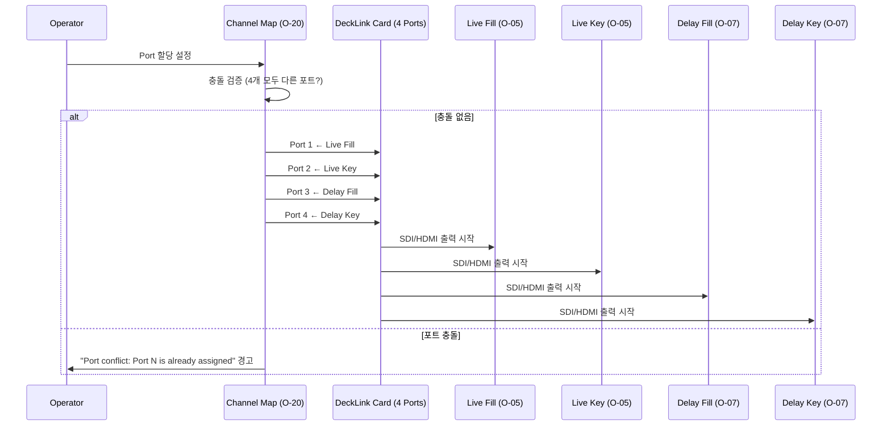
```mermaid
sequenceDiagram
    participant OP as Operator
    participant CM as Channel Map (O-20)
    participant DL as DeckLink Card (4 Ports)
    participant LF as Live Fill (O-05)
    participant LK as Live Key (O-05)
    participant DF as Delay Fill (O-07)
    participant DK as Delay Key (O-07)

    OP->>CM: Port 할당 설정
    CM->>CM: 충돌 검증 (4개 모두 다른 포트?)
    alt 충돌 없음
        CM->>DL: Port 1 ← Live Fill
        CM->>DL: Port 2 ← Live Key
        CM->>DL: Port 3 ← Delay Fill
        CM->>DL: Port 4 ← Delay Key
        DL->>LF: SDI/HDMI 출력 시작
        DL->>LK: SDI/HDMI 출력 시작
        DL->>DF: SDI/HDMI 출력 시작
        DL->>DK: SDI/HDMI 출력 시작
    else 포트 충돌
        CM->>OP: "Port conflict: Port N is already assigned" 경고
    end
```

**비활성 조건**: DeckLink 카드 미감지 시 전체 비활성 + "No DeckLink detected" 메시지. S-00 Fill & Key 외 모드 시 숨김.

## 5장: GFX 탭 기능 상세

### 5.1 Layout 서브탭

#### 요소 인덱스

| ID | 요소 | 상세도 | 영향 범위 |
|----|------|--------|----------|
| G-01 | Board Position | Complex | Global |
| G-02 | Player Layout | Medium | Global |
| G-03 | X Margin | Simple | Global |
| G-04 | Top Margin | Simple | Global |
| G-05 | Bot Margin | Simple | Global |
| G-06 | Leaderboard Position | Medium | Global |
| G-07 | Heads Up Layout L/R | Medium | Local |
| G-08 | Heads Up Camera | Medium | Local |
| G-09 | Heads Up Custom Y | Simple | Local |
| G-10 | Sponsor Logo 1 | Simple | Local |
| G-11 | Sponsor Logo 2 | Simple | Local |
| G-12 | Sponsor Logo 3 | Simple | Local |
| G-13 | Vanity Text | Medium | Local |

---

#### G-01: Board Position

**트리거**: Dropdown 선택 변경 (Left / Right / Centre / Top)

**전제조건**: 게임이 Community Card 계열(game_class=0, Flop 게임)일 때만 유효. Draw/Stud 계열은 보드 카드가 없으므로 선택 무의미.

**로직 플로우**:
1. 운영자가 Board Position Dropdown에서 위치 선택
2. config_type의 board_position 필드 갱신
3. canvas의 모든 보드 관련 image_element/pip_element 위치(x, y) 재계산
4. 보드 카드와 연관된 text_element(팟 사이즈, Equity 바) 위치도 연동 재배치
5. Venue Canvas와 Broadcast Canvas 모두 즉시 재렌더링

**상태 변화**: 선택 즉시 모든 출력 채널의 보드 카드 위치 변경. IDLE 상태에서는 시각적 차이 없음(보드 카드 미표시). FLOP 이후 상태에서 변경하면 라이브 방송에 즉시 반영.

**영향 요소**:
| 요소 | 변화 |
|------|------|
| G-06 Leaderboard Position | 보드 위치에 따라 리더보드 배치 가능 영역 변경 |
| G-41 Outs Position | 보드 위치 기준으로 Outs 표시 위치 연동 |
| G-43 Score Strip | 보드가 하단(Bot) 배치 시 Strip과 겹침 가능 |
| Viewer Overlay 보드 카드 | 3.11.1절 보드 카드 위치 직접 변경 |

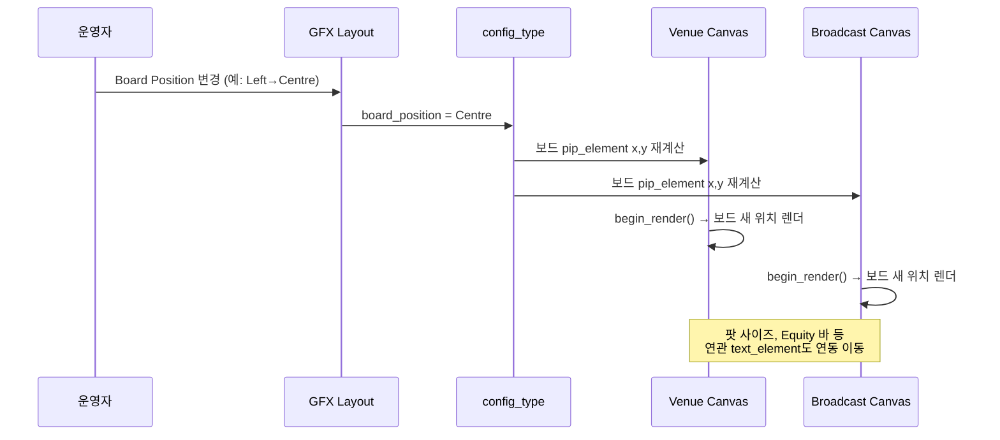
```mermaid
sequenceDiagram
    participant Op as 운영자
    participant UI as GFX Layout
    participant Cfg as config_type
    participant VC as Venue Canvas
    participant BC as Broadcast Canvas

    Op->>UI: Board Position 변경 (예: Left→Centre)
    UI->>Cfg: board_position = Centre
    Cfg->>VC: 보드 pip_element x,y 재계산
    Cfg->>BC: 보드 pip_element x,y 재계산
    VC->>VC: begin_render() → 보드 새 위치 렌더
    BC->>BC: begin_render() → 보드 새 위치 렌더
    Note over VC,BC: 팟 사이즈, Equity 바 등<br/>연관 text_element도 연동 이동
```

**비활성 조건**: Draw/Stud 계열 게임 선택 시 Dropdown 회색 처리. 보드 카드가 없으므로 위치 설정 무의미.
**영향 범위**: Global -- 모든 출력 채널 즉시 반영. 라이브 중 변경 시 방송 화면 레이아웃 급변.

---

#### G-02: Player Layout

**트리거**: Dropdown 선택 변경 (Vert / Bot / Spill) | **영향 범위**: Global

**로직**: 플레이어 박스(border_element + text_element + pip_element)의 배치 방식을 결정한다. **Vert**는 양측 세로 배치(좌 5명, 우 5명), **Bot**은 하단 가로 배치, **Spill**은 인원에 따라 자동 배치(6인 이하: 하단, 7인 이상: 좌우 + 하단). 선택 즉시 모든 플레이어의 위치 좌표(x, y)가 재계산되며 Venue/Broadcast Canvas 동시 반영.

**영향 요소**: G-01 Board Position (플레이어 배치에 따라 보드 위치 제약), G-07 Heads Up Layout (2인 시 별도 배치로 오버라이드), G-03~G-05 Margin (배치 기준점에 여백 적용)

**비활성 조건**: 없음. 모든 게임 타입에서 활성.

---

#### G-03: X Margin
좌우 여백 비율 (기본 0.04, 즉 화면 너비의 4%). NumberInput 직접 입력 또는 화살표 증감. 변경 즉시 플레이어 박스와 보드 카드의 좌우 위치 재계산. 영향 범위: Global. 영향 요소: G-02 Player Layout (배치 기준점), G-01 Board Position (보드 좌우 위치).

#### G-04: Top Margin
상단 여백 비율 (기본 0.05). 이벤트명/블라인드(3차 오버레이)와 플레이어 박스 간 간격 조정. 영향 범위: Global. 영향 요소: G-02 Player Layout.

#### G-05: Bot Margin
하단 여백 비율 (기본 0.04). Score Strip(G-43)과 플레이어 박스 간 간격 조정. 영향 범위: Global. 영향 요소: G-43 Score Strip (하단 겹침 방지).

---

#### G-06: Leaderboard Position

**트리거**: Dropdown 선택 변경 | **영향 범위**: Global

**로직**: 리더보드 오버레이의 화면 내 위치(좌측/중앙/우측)를 결정한다. 리더보드는 IDLE 상태(핸드 사이) 또는 G-22 Show Leaderboard 설정에 따라 표시된다. 위치 변경 시 리더보드의 image_element 및 text_element 위치 좌표 재계산. Board Position(G-01)이 같은 방향에 있으면 겹침이 발생할 수 있으므로 운영자가 수동 조정해야 한다.

**영향 요소**: G-22 Show Leaderboard (리더보드 자동 표시 여부), G-01 Board Position (동일 방향 겹침 주의), G-10 Sponsor Logo 1 (리더보드에 스폰서 로고 삽입)

**비활성 조건**: 없음.

---

#### G-07: Heads Up Layout L/R

**트리거**: Dropdown 선택 변경 | **영향 범위**: Local (2인 경기에서만 적용)

**로직**: 헤즈업(2인 대결) 시 플레이어 박스의 좌/우 배치를 결정한다. 일반 G-02 Player Layout 대신 이 설정이 우선 적용된다. 화면을 좌우로 분할하여 각 플레이어의 카드, 스택, 액션을 대칭 배치한다. 3인 이상이면 이 설정은 무시되고 G-02가 적용된다.

**영향 요소**: G-08 Heads Up Camera (카메라 위치 연동), G-09 Heads Up Custom Y (Y축 미세 조정)

**비활성 조건**: 활성 플레이어 3인 이상.

---

#### G-08: Heads Up Camera

**트리거**: Dropdown 선택 변경 | **영향 범위**: Local

**로직**: 헤즈업 시 카메라(PIP 영상) 배치 위치를 결정한다. 플레이어 박스 상단/하단/없음 중 선택. G-07 Heads Up Layout과 연동하여 카메라 영상이 플레이어 정보와 함께 배치된다.

**영향 요소**: G-07 Heads Up Layout L/R (기본 배치 기준), G-23 Show PIP Capture (PIP 표시 여부)

**비활성 조건**: 활성 플레이어 3인 이상. G-23 PIP 비활성 시 카메라 위치 설정 무의미.

---

#### G-09: Heads Up Custom Y
Checkbox(활성화) + NumberInput(Y축 오프셋). 헤즈업 배치의 Y축을 수동으로 미세 조정한다. Checkbox 해제 시 기본 Y 위치 사용. 영향 범위: Local. 영향 요소: G-07, G-08 (헤즈업 배치 기준).

#### G-10: Sponsor Logo 1
ImageSlot으로 리더보드 영역에 표시될 스폰서 로고 이미지 파일 지정. 파일 선택 다이얼로그로 PNG/JPG 로드. 이미지 없으면 해당 영역 빈 상태. 영향 범위: Local. 영향 요소: G-06 Leaderboard Position (로고 표시 위치), G-22 Show Leaderboard (리더보드 표시 시에만 노출).

#### G-11: Sponsor Logo 2
ImageSlot으로 보드 카드 영역 근처에 표시될 스폰서 로고 지정. 영향 범위: Local. 영향 요소: G-01 Board Position (보드 위치에 따라 로고 위치 변동).

#### G-12: Sponsor Logo 3
ImageSlot으로 Score Strip 영역에 표시될 스폰서 로고 지정. 영향 범위: Local. 영향 요소: G-43 Score Strip (Strip 활성 시에만 노출).

---

#### G-13: Vanity Text

**트리거**: TextField 입력 + Checkbox 토글 | **영향 범위**: Local

**로직**: 테이블 이름 텍스트를 설정한다. Checkbox "Use as Game Variant"를 체크하면 이벤트명/블라인드 오버레이(3차 정보 계층)에서 Game Variant 텍스트 대신 이 Vanity Text가 표시된다. 예: "WSOP Main Event Table 1" 대신 "Final Table"로 커스텀 표시. 텍스트 변경은 즉시 반영되나 해당 text_element만 갱신.

**영향 요소**: Viewer Overlay 이벤트명(3차 요소), G-45 Show Blinds (블라인드 표시와 동일 영역)

**비활성 조건**: 없음. Checkbox 해제 시 기본 Game Variant 텍스트 사용.

---

### 5.2 Visual 서브탭

#### 요소 인덱스

| ID | 요소 | 상세도 | 영향 범위 |
|----|------|--------|----------|
| G-14 | Reveal Players | Complex | Channel |
| G-15 | How to Show Fold | Complex | Global |
| G-16 | Reveal Cards | Complex | Channel |
| G-17 | Transition In | Medium | Local |
| G-18 | Transition Out | Medium | Local |
| G-19 | Indent Action Player | Simple | Global |
| G-20 | Bounce Action Player | Simple | Global |
| G-21 | Action Clock | Medium | Global |
| G-22 | Show Leaderboard | Medium | Global |
| G-23 | Show PIP Capture | Medium | Local |
| G-24 | Show Player Stats | Medium | Global |
| G-25 | Heads Up History | Simple | Local |

---

#### G-14: Reveal Players

**트리거**: Dropdown 선택 변경 (Always / Action On / Never)

**전제조건**: 게임이 진행 중이며 홀카드가 감지된 상태(PREFLOP 이후).

**로직 플로우**:
1. 운영자가 Reveal Players Dropdown에서 공개 정책 선택
2. **Always**: Broadcast Canvas에서 모든 플레이어의 홀카드를 항상 공개. pip_element의 face_up=true 유지.
3. **Action On**: 현재 액션 중인 플레이어(turn_to_act)의 홀카드만 공개. 나머지는 뒷면(face_up=false). 액션이 다른 플레이어로 넘어가면 이전 플레이어 카드 숨김, 새 플레이어 카드 공개.
4. **Never**: Broadcast Canvas에서도 홀카드 미공개. Showdown까지 모든 카드 뒷면. 보안 최우선 설정.
5. **Venue Canvas**: Trustless Mode(Y-13 연동) 활성 시 항상 홀카드 숨김(이 설정 무시). Trustless Mode 비활성 시에도 Venue는 기본적으로 홀카드 숨김(3.11.2절 Dual Canvas 원칙).

**상태 변화**: 설정 변경 즉시 Broadcast Canvas의 pip_element face_up 상태 일괄 갱신.

**영향 요소**:
| 요소 | 변화 |
|------|------|
| G-16 Reveal Cards | 카드 공개 애니메이션 방식 (Reveal Players가 공개 시점, Reveal Cards가 공개 연출) |
| G-37 Show Hand Equities | 홀카드 비공개 시 Equity 표시 의미 감소 (시청자가 카드를 모르므로) |
| G-15 How to Show Fold | 폴드 시 카드 숨김/표시와 연동 |
| Viewer Overlay 홀카드 | 3.11.1절 표시 조건 직접 제어 |

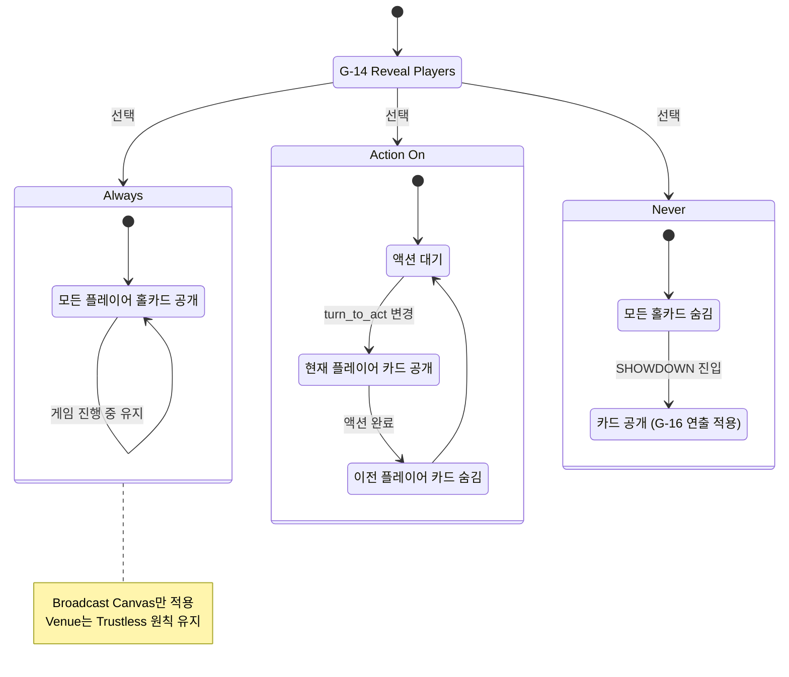
```mermaid
stateDiagram-v2
    state "G-14 Reveal Players" as RP
    state "Always" as AL
    state "Action On" as AO
    state "Never" as NV

    [*] --> RP
    RP --> AL: 선택
    RP --> AO: 선택
    RP --> NV: 선택

    state AL {
        [*] --> AllCards_FaceUp
        AllCards_FaceUp: 모든 플레이어 홀카드 공개
        AllCards_FaceUp --> AllCards_FaceUp: 게임 진행 중 유지
    }

    state AO {
        [*] --> WaitAction
        WaitAction: 액션 대기
        WaitAction --> ShowCurrent: turn_to_act 변경
        ShowCurrent: 현재 플레이어 카드 공개
        ShowCurrent --> HidePrevious: 액션 완료
        HidePrevious: 이전 플레이어 카드 숨김
        HidePrevious --> WaitAction
    }

    state NV {
        [*] --> AllCards_FaceDown
        AllCards_FaceDown: 모든 홀카드 숨김
        AllCards_FaceDown --> ShowdownReveal: SHOWDOWN 진입
        ShowdownReveal: 카드 공개 (G-16 연출 적용)
    }

    note right of AL: Broadcast Canvas만 적용<br/>Venue는 Trustless 원칙 유지
```

**비활성 조건**: 게임 미진행 시(IDLE) 설정 가능하나 즉시 시각 효과 없음.
**영향 범위**: Channel -- Broadcast Canvas에만 적용. Venue Canvas는 Dual Canvas 보안 원칙에 따라 독립 동작.

---

#### G-15: How to Show Fold

**트리거**: Dropdown 선택 (Immediate / Fade) + NumberInput (Fade 시간, 초)

**전제조건**: 게임 진행 중이며 플레이어가 FOLD 액션을 수행한 상태.

**로직 플로우**:
1. AT에서 플레이어 FOLD 액션 수신
2. **Immediate**: 즉시 해당 플레이어 박스 회색 처리. border_element color 변경 + text_element opacity 감소 + pip_element visible=false.
3. **Fade**: NumberInput에 설정된 시간(기본 1.5초) 동안 서서히 페이드아웃. image_element/text_element의 opacity를 1.0에서 0.3으로 선형 보간. 완료 후 회색 상태 유지.
4. 폴드된 플레이어의 홀카드는 숨김 처리(pip_element face_up=false).
5. Venue/Broadcast Canvas 모두 동일하게 적용.

**상태 변화**: FOLD 수신 → 플레이어 박스 시각 상태 변경 (활성 → 비활성/회색)

**영향 요소**:
| 요소 | 변화 |
|------|------|
| G-14 Reveal Players | 폴드 전 카드 공개 상태였던 플레이어의 카드 숨김 처리 |
| G-28 Show Eliminated | 폴드와 탈락 표시 혼동 방지 (폴드=회색, 탈락=빨간 테두리) |
| G-35 Clear Previous Action | 폴드 플레이어의 이전 액션 텍스트 초기화 여부 |
| Viewer Overlay 폴드 표시 | 3.11.1절 "폴드 시 회색 처리" |

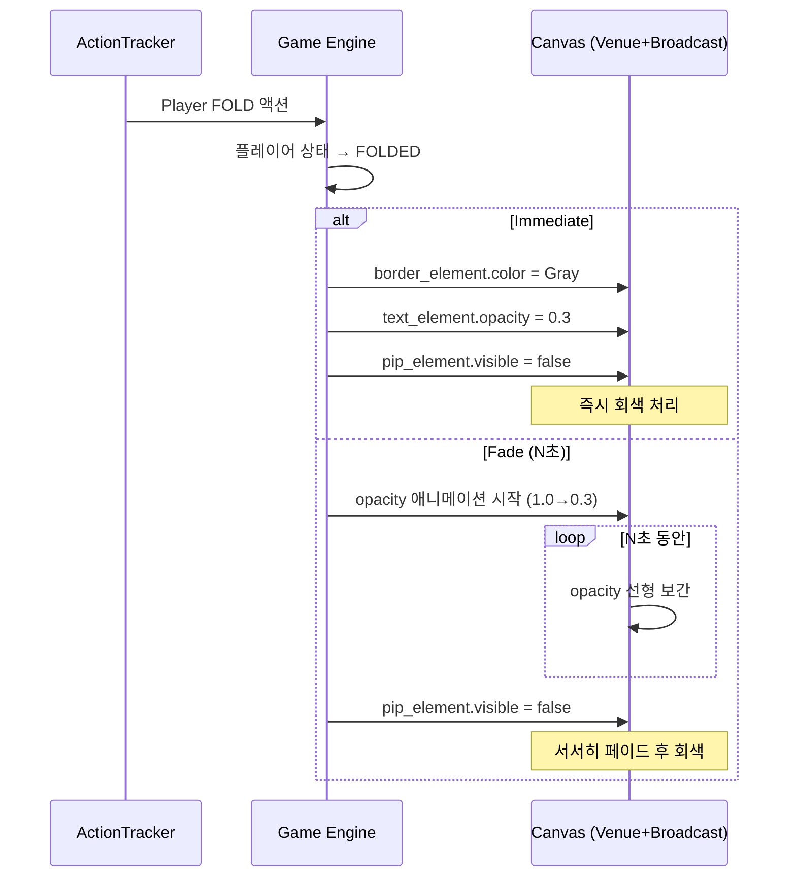
```mermaid
sequenceDiagram
    participant AT as ActionTracker
    participant GE as Game Engine
    participant CV as Canvas (Venue+Broadcast)

    AT->>GE: Player FOLD 액션
    GE->>GE: 플레이어 상태 → FOLDED

    alt Immediate
        GE->>CV: border_element.color = Gray
        GE->>CV: text_element.opacity = 0.3
        GE->>CV: pip_element.visible = false
        Note over CV: 즉시 회색 처리
    else Fade (N초)
        GE->>CV: opacity 애니메이션 시작 (1.0→0.3)
        loop N초 동안
            CV->>CV: opacity 선형 보간
        end
        GE->>CV: pip_element.visible = false
        Note over CV: 서서히 페이드 후 회색
    end
```

**비활성 조건**: 없음. 모든 게임 타입에서 FOLD 존재.
**영향 범위**: Global -- Venue/Broadcast 동일 적용.

---

#### G-16: Reveal Cards

**트리거**: Dropdown 선택 변경 (Immediate / Animated)

**전제조건**: 홀카드 공개 이벤트 발생 시 (G-14 Reveal Players 정책에 따른 공개, 또는 SHOWDOWN 진입).

**로직 플로우**:
1. 카드 공개 이벤트 발생 (G-14 정책 또는 SHOWDOWN)
2. **Immediate**: pip_element.face_up = true 즉시 설정. animation_state = Stop(14). 카드가 바로 앞면으로 전환.
3. **Animated**: AnimationState enum 시퀀스 실행.
   - GlintRotateFront(3): 뒷면에서 반짝이며 앞면으로 회전
   - Glint(1): 앞면 공개 후 반짝임 효과
   - Stop(14): 애니메이션 종료, 정적 표시
4. 애니메이션 소요 시간: 약 0.5~0.8초 (프레임 기반, 30fps 기준 15~24프레임)
5. 복수 플레이어 동시 공개 시(SHOWDOWN) 순차 딜레이(0.2초 간격) 적용으로 시각적 연출

**상태 변화**: pip_element.animation_state 전이: Waiting(15) → GlintRotateFront(3) → Glint(1) → Stop(14)

**영향 요소**:
| 요소 | 변화 |
|------|------|
| G-14 Reveal Players | 공개 시점 결정 (G-16은 공개 "방식"만 결정) |
| G-37 Show Hand Equities | 카드 공개 애니메이션 완료 후 Equity 바 표시 시작 |
| G-38 Hilite Winning Hand | SHOWDOWN에서 카드 공개 완료 후 위닝 핸드 강조 |
| G-17 Transition In | 카드 공개와 등장 애니메이션은 별개 (Transition은 플레이어 박스 전체) |

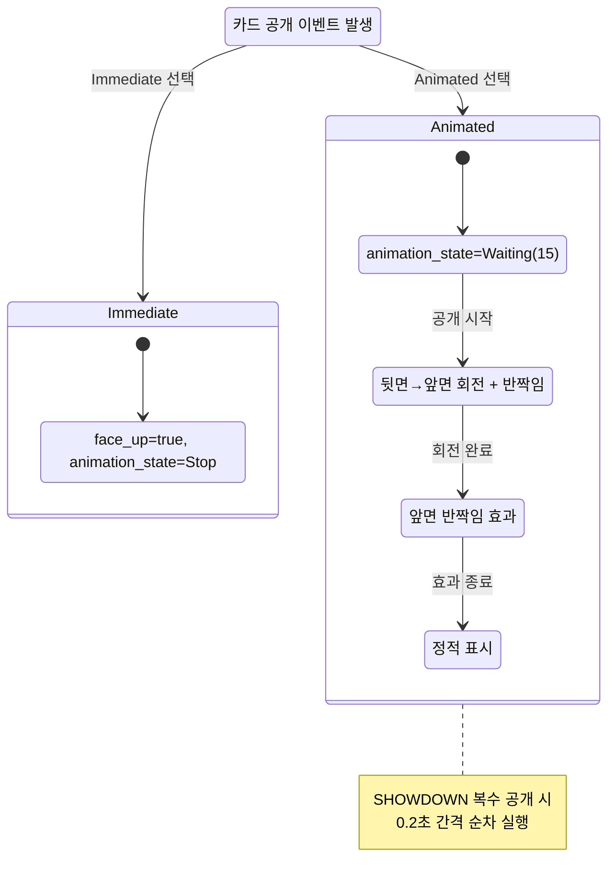
```mermaid
stateDiagram-v2
    state "카드 공개 이벤트 발생" as trigger

    state "Immediate" as imm {
        [*] --> FaceUp_Instant
        FaceUp_Instant: face_up=true, animation_state=Stop
    }

    state "Animated" as anim {
        [*] --> Waiting
        Waiting: animation_state=Waiting(15)
        Waiting --> GlintRotateFront: 공개 시작
        GlintRotateFront: 뒷면→앞면 회전 + 반짝임
        GlintRotateFront --> Glint: 회전 완료
        Glint: 앞면 반짝임 효과
        Glint --> Stop: 효과 종료
        Stop: 정적 표시
    }

    trigger --> imm: Immediate 선택
    trigger --> anim: Animated 선택

    note right of anim
        SHOWDOWN 복수 공개 시
        0.2초 간격 순차 실행
    end note
```

**비활성 조건**: G-14 Reveal Players = Never이고 SHOWDOWN 전이면 카드 공개 이벤트 자체가 발생하지 않으므로 이 설정 무효.
**영향 범위**: Channel -- Broadcast Canvas에서 주로 적용. Venue Canvas는 Trustless Mode에 따라 카드 공개 자체가 제한될 수 있음.

---

#### G-17: Transition In

**트리거**: Dropdown (애니메이션 타입) + NumberInput (지속 시간, 초) | **영향 범위**: Local

**로직**: 플레이어 박스가 화면에 등장할 때의 애니메이션 방식과 시간을 설정한다. 새 핸드 시작(SETUP → PREFLOP 전이) 시 모든 플레이어 박스에 적용. AnimationState의 FadeIn(0), SlideUp(13) 등을 사용하며, NumberInput으로 지속 시간(기본 0.5초)을 조정한다. 다음 핸드부터 적용.

**영향 요소**: G-18 Transition Out (등장/퇴장 일관성), G-02 Player Layout (배치 방향에 따라 슬라이드 방향 결정)

**비활성 조건**: 없음.

---

#### G-18: Transition Out

**트리거**: Dropdown (애니메이션 타입) + NumberInput (지속 시간, 초) | **영향 범위**: Local

**로직**: 핸드 종료(COMPLETE → IDLE 전이) 시 플레이어 박스가 퇴장하는 애니메이션 방식과 시간을 설정한다. SlideAndDarken(11), SlideDownRotateBack(12) 등. 퇴장 완료 후 리더보드/대기 화면으로 전환. NumberInput으로 지속 시간(기본 0.5초) 조정.

**영향 요소**: G-17 Transition In (등장/퇴장 일관성), G-22 Show Leaderboard (퇴장 완료 후 리더보드 표시)

**비활성 조건**: 없음.

---

#### G-19: Indent Action Player
Checkbox. 활성 시 현재 액션 중인 플레이어(turn_to_act)의 박스를 화면 중앙 방향으로 약간 이동(indent)하여 시각적 강조. border_element의 x 오프셋 +-5px. 영향 범위: Global. 영향 요소: G-20 Bounce Action Player (동시 활성 가능, indent + bounce 중복 적용).

#### G-20: Bounce Action Player
Checkbox. 활성 시 현재 액션 중인 플레이어 박스에 바운스 애니메이션(위아래 2px 반복) 적용. G-19 Indent와 동시 적용 가능. 영향 범위: Global. 영향 요소: G-19 Indent Action Player.

---

#### G-21: Action Clock

**트리거**: NumberInput 값 변경 (초 단위 임계값) | **영향 범위**: Global

**로직**: 플레이어의 액션 시간이 설정된 임계값 이하로 남았을 때 Viewer Overlay에 카운트다운 클락을 표시한다. 예: 10초로 설정 시, 남은 시간이 10초 이하가 되면 해당 플레이어 근처에 카운트다운 text_element 표시. 0초 도달 시 시간 초과 경고. 3.11.1절의 "액션 클락"(1차 요소) 표시 조건과 직접 연동.

**영향 요소**: Viewer Overlay 액션 클락(1차 요소), G-19/G-20 (액션 플레이어 강조와 동시 표시)

**비활성 조건**: 0으로 설정 시 클락 표시 안 함.

---

#### G-22: Show Leaderboard

**트리거**: Checkbox + Settings (표시 시간, 자동/수동) | **영향 범위**: Global

**로직**: 핸드 사이(COMPLETE → IDLE) 리더보드를 자동으로 표시할지 결정한다. Checkbox 활성 시 핸드 종료 후 G-18 Transition Out 완료 직후 리더보드 오버레이가 자동 등장한다. Settings에서 표시 지속 시간(기본 5초)과 트리거 방식(Auto/Manual) 설정. Manual이면 운영자가 Main Window에서 수동 트리거해야 표시. Viewer Overlay의 리더보드(2차 요소)와 직접 연동.

**영향 요소**: G-06 Leaderboard Position (위치), G-10 Sponsor Logo 1 (리더보드 내 스폰서 표시), G-18 Transition Out (퇴장 후 표시 시작), G-30 Hide Leaderboard (핸드 시작 시 자동 숨김)

**비활성 조건**: Checkbox 해제 시 리더보드 자동 표시 안 함. 수동 트리거로만 표시 가능.

---

#### G-23: Show PIP Capture

**트리거**: Checkbox + Settings | **영향 범위**: Local

**로직**: 핸드 사이에 PIP 캡처(다른 테이블의 방송 화면)를 자동 표시할지 결정한다. Pipcap 앱(4.1절)이 연결된 상태에서만 동작. 활성 시 원격 GfxServer의 방송 프레임을 pip_element로 렌더링하여 현재 화면의 일부 영역에 작은 PIP 창으로 표시.

**영향 요소**: G-08 Heads Up Camera (PIP 위치 겹침 가능), I/O 탭 비디오 입력 설정

**비활성 조건**: Pipcap 앱 미연결 시 Checkbox 회색 처리.

---

#### G-24: Show Player Stats

**트리거**: Checkbox + Settings | **영향 범위**: Global

**로직**: 핸드 종료 후 플레이어 통계를 티커(화면 하단 스크롤 텍스트) 형태로 자동 표시할지 결정한다. 통계 항목: VPIP, PFR, AGG 등 세션 내 누적 통계. 표시 시간과 스크롤 속도를 Settings에서 조정. Viewer Overlay의 티커(3차 요소) 영역에 표시.

**영향 요소**: G-43 Score Strip (하단 영역 겹침 가능), G-22 Show Leaderboard (동시 표시 시 우선순위)

**비활성 조건**: Checkbox 해제 시 통계 티커 미표시.

---

#### G-25: Heads Up History
Checkbox. 헤즈업(2인 대결) 시 이전 핸드 결과 히스토리를 화면에 요약 표시. 승/패 기록과 주요 팟 크기. 활성 플레이어 3인 이상이면 무의미. 영향 범위: Local. 영향 요소: G-07 Heads Up Layout (헤즈업 배치 내 히스토리 위치).

---

### 5.3 Display 서브탭

#### 요소 인덱스

| ID | 요소 | 상세도 | 영향 범위 |
|----|------|--------|----------|
| G-26 | Show Knockout Rank | Simple | Global |
| G-27 | Show Chipcount % | Simple | Global |
| G-28 | Show Eliminated | Medium | Global |
| G-29 | Cumulative Winnings | Simple | Global |
| G-30 | Hide Leaderboard | Medium | Global |
| G-31 | Max BB Multiple | Medium | Global |
| G-32 | Add Seat # | Simple | Global |
| G-33 | Show as Eliminated | Medium | Global |
| G-34 | Unknown Cards Blink | Simple | Global |
| G-35 | Clear Previous Action | Simple | Global |
| G-36 | Order Players | Medium | Global |
| G-37 | Show Hand Equities | Complex | Channel |
| G-38 | Hilite Winning Hand | Complex | Global |
| G-39 | Hilite Nit Game | Medium | Global |

---

#### G-26: Show Knockout Rank
Checkbox. 노크아웃 토너먼트에서 각 플레이어의 탈락 순위를 text_element로 표시. 영향 범위: Global. 영향 요소: G-28 Show Eliminated (탈락 표시와 순위 표시 연동).

#### G-27: Show Chipcount %
Checkbox. 각 플레이어의 칩 카운트를 절대값 대신 전체 칩 대비 퍼센트로 표시. text_element의 텍스트 포맷 변경. 영향 범위: Global. 영향 요소: G-47 Currency Symbol (% 모드에서는 통화 기호 미적용), G-50 Chipcount Precision (소수점 자릿수).

---

#### G-28: Show Eliminated

**트리거**: Checkbox 토글 | **영향 범위**: Global

**로직**: 칩이 0이 되어 탈락한 플레이어를 화면에 계속 표시할지 결정한다. 활성 시 탈락 플레이어 박스에 빨간 테두리(border_element color=Red) + "ELIMINATED" text_element를 표시하고 회색 배경 처리. 비활성 시 탈락 플레이어 박스가 즉시 제거(visible=false).

**영향 요소**: G-26 Show Knockout Rank (탈락 순위 동시 표시), G-33 Show as Eliminated (스택 소진 시 자동 탈락 처리), G-15 How to Show Fold (폴드=회색 vs 탈락=빨간 테두리 구분)

**비활성 조건**: 캐시 게임(비토너먼트)에서는 탈락 개념 없으므로 무의미.

---

#### G-29: Cumulative Winnings
Checkbox. 세션 전체의 누적 상금을 플레이어 박스에 표시. 캐시 게임에서 유용. 영향 범위: Global. 영향 요소: G-47 Currency Symbol (상금에 통화 기호 적용), G-49 Divide by 100 (금액 변환 적용).

---

#### G-30: Hide Leaderboard

**트리거**: Checkbox 토글 | **영향 범위**: Global

**로직**: 새 핸드 시작 시 리더보드를 자동으로 숨길지 결정한다. 활성 시 SETUP 상태 진입과 동시에 리더보드 오버레이가 Transition Out 애니메이션으로 퇴장. G-22 Show Leaderboard와 반대 동작: G-22는 핸드 종료 시 리더보드 표시, G-30은 핸드 시작 시 리더보드 숨김.

**영향 요소**: G-22 Show Leaderboard (표시/숨김 사이클 완성), G-18 Transition Out (숨김 애니메이션)

**비활성 조건**: G-22 비활성 시 리더보드가 이미 미표시이므로 무의미.

---

#### G-31: Max BB Multiple

**트리거**: NumberInput 값 변경 | **영향 범위**: Global

**로직**: 스택 크기를 BB(Big Blind) 배수로 표시할 때 상한 배수를 설정한다. 예: 200으로 설정하면 200BB 이상의 스택은 "200BB+"로 표시. G-51 Display Mode에서 BB 모드 선택 시에만 유효. 매우 깊은 스택(예: 500BB)의 숫자가 텍스트 영역을 넘치는 것을 방지.

**영향 요소**: G-51 Display Mode (BB 모드에서만 유효), G-50 Chipcount Precision (BB 배수 소수점)

**비활성 조건**: G-51 Display Mode가 Amount 모드일 때 무의미.

---

#### G-32: Add Seat #
Checkbox. 플레이어 박스에 좌석 번호(1~10)를 추가 표시. text_element로 플레이어 이름 옆 또는 상단에 "Seat 3" 형태. 영향 범위: Global. 영향 요소: 없음 (독립 설정).

#### G-33: Show as Eliminated

**트리거**: Checkbox 토글 | **영향 범위**: Global

**로직**: 스택이 0이 된 플레이어를 자동으로 "탈락" 상태로 전환할지 결정한다. 활성 시 칩이 0이 되면 G-28 Show Eliminated의 탈락 표시가 자동 적용(빨간 테두리 + ELIMINATED 텍스트). 비활성 시 스택 0이어도 탈락 처리하지 않음(올인 후 사이드 팟 상황 등).

**영향 요소**: G-28 Show Eliminated (탈락 표시 방식), G-26 Show Knockout Rank (순위 부여)

**비활성 조건**: 캐시 게임에서는 리바이 가능하므로 비활성 권장.

#### G-34: Unknown Cards Blink
Checkbox. RFID로 아직 인식되지 않은 카드(uid=NULL)가 있을 때 해당 pip_element를 깜빡임(opacity 1.0↔0.3 반복) 처리. 운영자에게 미인식 카드 주의 환기. 영향 범위: Global. 영향 요소: Y-03 RFID Reset (RFID 재초기화 시 모든 카드 미인식 상태).

#### G-35: Clear Previous Action
Checkbox. 새로운 베팅 라운드 시작 시 이전 라운드의 액션 텍스트("RAISE $500", "CALL" 등)를 자동 초기화할지 결정. 활성 시 FLOP/TURN/RIVER 전이 시점에 모든 플레이어의 액션 text_element를 빈 문자열로 리셋. 영향 범위: Global. 영향 요소: G-15 How to Show Fold (폴드 표시는 라운드 초기화와 무관하게 유지).

---

#### G-36: Order Players

**트리거**: Dropdown 선택 변경 | **영향 범위**: Global

**로직**: 화면에 표시되는 플레이어의 순서를 결정한다. 옵션: Seat Order (물리적 좌석 번호 순), Stack Size (칩량 내림차순), Alphabetical (이름 순). 선택 즉시 모든 플레이어 박스의 배치 위치가 재계산된다. G-02 Player Layout의 배치 형태 내에서 순서만 변경.

**영향 요소**: G-02 Player Layout (배치 형태 내 순서 변경), G-44 Order Strip By (Score Strip 정렬은 별도 설정)

**비활성 조건**: 없음.

---

#### G-37: Show Hand Equities

**트리거**: Dropdown 선택 변경 (Never / Flop / Turn / River / Always)

**전제조건**: HandEvaluation DLL(4.1절) 연결 상태. 2인 이상 활성 플레이어 존재.

**로직 플로우**:
1. 운영자가 Equity 표시 시작 시점 선택
2. **Never**: Equity 표시 안 함. 모든 게임 상태에서 Equity text_element/image_element 숨김.
3. **Flop**: FLOP 상태 진입 시부터 Equity 표시 시작. PREFLOP에서는 미표시.
4. **Turn**: TURN 상태 진입 시부터.
5. **River**: RIVER 상태 진입 시부터.
6. **Always**: PREFLOP부터 즉시 Equity 표시.
7. Equity 계산: 게임 상태 전이 또는 플레이어 수 변경(FOLD) 시 HandEvaluation DLL 호출. 보드 카드 추가 시 재계산.
8. **Dual Canvas 차등**: Broadcast Canvas에서만 Equity 표시. Venue Canvas는 홀카드 자체가 숨김이므로 Equity도 미표시(3.11.1절).

**상태 변화**: 선택한 게임 상태 이후부터 각 플레이어 근처에 Equity 바(image_element) + 퍼센트 텍스트(text_element) 표시.

**영향 요소**:
| 요소 | 변화 |
|------|------|
| G-14 Reveal Players | 홀카드 비공개(Never) 시 Equity만 표시하면 간접적 카드 정보 노출 |
| G-40 Show Outs | Equity와 Outs 동시 표시 가능 |
| G-42 True Outs | 정밀 계산 모드에서 Equity 정확도 영향 |
| R-06 Ignore Split Pots | Split pot 무시 시 Equity 계산 방식 변경 |
| Viewer Overlay 승률 | 3.11.1절 "2인 이상 활성 플레이어" 조건 |

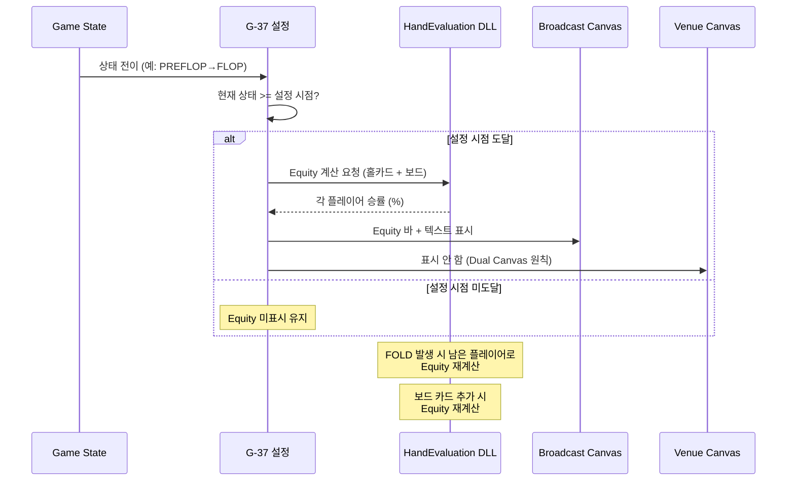
```mermaid
sequenceDiagram
    participant GS as Game State
    participant CFG as G-37 설정
    participant HE as HandEvaluation DLL
    participant BC as Broadcast Canvas
    participant VC as Venue Canvas

    GS->>CFG: 상태 전이 (예: PREFLOP→FLOP)
    CFG->>CFG: 현재 상태 >= 설정 시점?

    alt 설정 시점 도달
        CFG->>HE: Equity 계산 요청 (홀카드 + 보드)
        HE-->>CFG: 각 플레이어 승률 (%)
        CFG->>BC: Equity 바 + 텍스트 표시
        CFG->>VC: 표시 안 함 (Dual Canvas 원칙)
    else 설정 시점 미도달
        Note over CFG: Equity 미표시 유지
    end

    Note over HE: FOLD 발생 시 남은 플레이어로<br/>Equity 재계산
    Note over HE: 보드 카드 추가 시<br/>Equity 재계산
```

**비활성 조건**: HandEvaluation DLL 미연결 시 Dropdown 회색 처리. Draw/Stud 계열에서는 Equity 계산 방식이 다를 수 있음.
**영향 범위**: Channel -- Broadcast Canvas에만 표시. Venue Canvas는 Dual Canvas 보안 원칙으로 미표시.

---

#### G-38: Hilite Winning Hand

**트리거**: Dropdown 선택 변경 (Never / Showdown / Always)

**전제조건**: SHOWDOWN 상태 진입 또는 위너 결정 시.

**로직 플로우**:
1. 운영자가 위닝 핸드 강조 시점 선택
2. **Never**: 위닝 핸드 강조 안 함. 모든 플레이어 박스 동일 표시.
3. **Showdown**: SHOWDOWN 상태 진입 시 위너의 카드와 박스를 강조. border_element에 금색/노란색 하이라이트 적용 + 위닝 핸드 카드(pip_element)에 highlighted=true.
4. **Always**: 각 게임 상태에서 현재 시점 기준 리딩 핸드를 실시간 강조 (Equity 1위). 보드 카드 추가 시 리딩 핸드 변경 가능 → 강조 대상 실시간 전환.
5. 강조 시각 효과: border_element.color 변경 (기본→금색) + border_element.thickness 증가 + pip_element에 Glint(1) 애니메이션.
6. Venue/Broadcast Canvas 모두 적용 (위닝 핸드 정보는 보안 민감 정보가 아님 -- SHOWDOWN에서는 카드가 이미 공개).

**상태 변화**: 위너 결정 → border_element/pip_element 시각 상태 변경

**영향 요소**:
| 요소 | 변화 |
|------|------|
| G-37 Show Hand Equities | Equity 1위와 위닝 핸드 강조 대상 일치 |
| G-16 Reveal Cards | 카드 공개 애니메이션 완료 후 하이라이트 시작 |
| G-15 How to Show Fold | 폴드 플레이어는 위닝 핸드 후보에서 제외 |
| Viewer Overlay 폴드 표시 | 위닝 핸드 강조와 폴드 회색 처리 대비 |

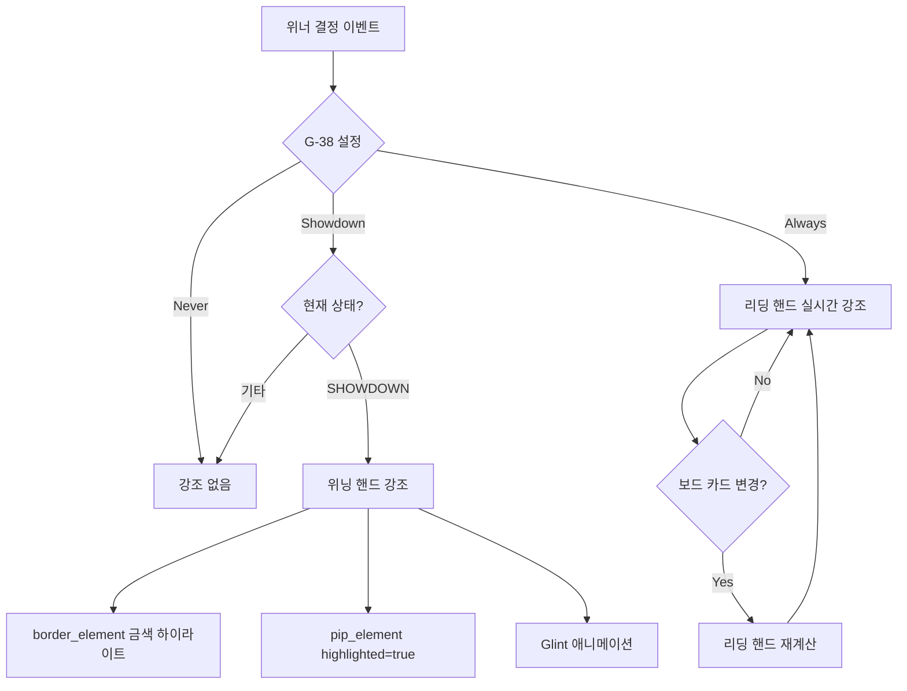
```mermaid
flowchart TD
    A[위너 결정 이벤트] --> B{G-38 설정}
    B -->|Never| C[강조 없음]
    B -->|Showdown| D{현재 상태?}
    B -->|Always| E[리딩 핸드 실시간 강조]

    D -->|SHOWDOWN| F[위닝 핸드 강조]
    D -->|기타| C

    F --> G[border_element 금색 하이라이트]
    F --> H[pip_element highlighted=true]
    F --> I[Glint 애니메이션]

    E --> J{보드 카드 변경?}
    J -->|Yes| K[리딩 핸드 재계산]
    K --> E
    J -->|No| E
```

**비활성 조건**: 없음.
**영향 범위**: Global -- Venue/Broadcast 동일 적용 (SHOWDOWN에서는 카드가 공개된 상태).

---

#### G-39: Hilite Nit Game

**트리거**: Dropdown 선택 변경 | **영향 범위**: Global

**로직**: "닛 게임"(액션 없이 한 명만 남아 팟을 가져가는 핸드) 감지 시 시각적 강조를 적용할 조건을 설정한다. 옵션: Never / Preflop Only / Always. Preflop Only는 프리플랍에서 블라인드 스틸 등으로 1인 남은 경우에만 강조. Always는 모든 스트리트에서 무경쟁 승리 시 강조. 강조 방식: 팟 영역에 특별 border_element 표시 또는 "NIT" text_element 잠깐 표시.

**영향 요소**: G-38 Hilite Winning Hand (닛 게임에서의 위너 강조와 중복 가능), G-35 Clear Previous Action (닛 게임 종료 후 액션 초기화)

**비활성 조건**: 없음.

---

### 5.4 Numbers 서브탭

#### 요소 인덱스

| ID | 요소 | 상세도 | 영향 범위 |
|----|------|--------|----------|
| G-40 | Show Outs | Medium | Channel |
| G-41 | Outs Position | Simple | Global |
| G-42 | True Outs | Simple | Global |
| G-43 | Score Strip | Medium | Global |
| G-44 | Order Strip By | Simple | Global |
| G-45 | Show Blinds | Medium | Global |
| G-46 | Show Hand # | Simple | Global |
| G-47 | Currency Symbol | Complex | Global |
| G-48 | Trailing Currency | Simple | Global |
| G-49 | Divide by 100 | Medium | Global |
| G-50 | Chipcount Precision | Medium | Global |
| G-51 | Display Mode | Medium | Global |

---

#### G-40: Show Outs

**트리거**: Dropdown 선택 변경 (Never / Heads Up / All In / Always) | **영향 범위**: Channel

**로직**: 아웃츠(현재 뒤지고 있는 플레이어가 역전할 수 있는 남은 카드 수)의 표시 조건을 설정한다. **Never**: 미표시. **Heads Up**: 2인 대결에서만 표시. **All In**: 올인 상태에서만 표시. **Always**: 항상 표시. FLOP 이후 게임 상태에서 유효하며, HandEvaluation DLL로 Outs 수를 계산한다. Broadcast Canvas에만 표시(Venue는 홀카드 정보 기반이므로 미표시).

**영향 요소**: G-41 Outs Position (표시 위치), G-42 True Outs (정밀 계산 여부), G-37 Show Hand Equities (Equity와 Outs 동시 표시), G-01 Board Position (보드 근처 Outs 표시 위치)

**비활성 조건**: PREFLOP에서는 Outs 계산 불가(보드 카드 없음). HandEvaluation DLL 미연결 시 비활성.

---

#### G-41: Outs Position
Dropdown. Outs 텍스트의 표시 위치 선택 (보드 옆 / 플레이어 박스 내 / 화면 하단). G-01 Board Position과 연동하여 보드 근처에 표시할 경우 위치 자동 조정. 영향 범위: Global. 영향 요소: G-01 Board Position, G-40 Show Outs (Outs 미표시 시 무의미).

#### G-42: True Outs
Checkbox. 활성 시 정밀 아웃츠 계산(상대방 핸드까지 고려한 실제 역전 가능 카드 수). 비활성 시 단순 아웃츠(자신의 핸드 개선 가능 카드 수만 계산). 정밀 계산은 HandEvaluation DLL 호출 비용이 높으므로 CPU 부하 증가. 영향 범위: Global. 영향 요소: G-40 Show Outs (Outs 미표시 시 무의미), G-37 Show Hand Equities (Equity 계산과 동일 DLL 사용).

---

#### G-43: Score Strip

**트리거**: Dropdown 선택 변경 | **영향 범위**: Global

**로직**: 화면 하단에 스코어 스트립(전체 플레이어 요약 바)을 표시할지와 표시 방식을 설정한다. 옵션: None / Chipcount / Chipcount+Rank / Custom. 스트립은 Viewer Overlay의 2차 요소로, 각 플레이어의 칩량과 순위를 가로 바 형태로 나열한다. G-12 Sponsor Logo 3이 Strip 영역에 표시됨.

**영향 요소**: G-44 Order Strip By (스트립 내 정렬 순서), G-12 Sponsor Logo 3 (스트립 스폰서), G-05 Bot Margin (하단 여백과 겹침), G-24 Show Player Stats (티커와 영역 겹침 가능)

**비활성 조건**: None 선택 시 스트립 미표시.

---

#### G-44: Order Strip By
Dropdown. Score Strip 내 플레이어 정렬 기준 (Seat / Stack / Alphabetical). G-36 Order Players와 독립적 -- 메인 화면 플레이어 순서와 Strip 순서가 다를 수 있다. 영향 범위: Global. 영향 요소: G-43 Score Strip (Strip 미표시 시 무의미).

---

#### G-45: Show Blinds

**트리거**: Dropdown 선택 변경 | **영향 범위**: Global

**로직**: 블라인드 정보 표시 방식을 설정한다. 옵션: Never / With Event Name / Always / With Hand #. Viewer Overlay의 3차 정보 계층(상단 중앙)에 표시. **With Event Name**: 이벤트명과 함께 "WSOP Main Event - $500/$1,000" 형태. **With Hand #**: G-46 Show Hand #과 연동하여 "Hand #42 - $500/$1,000" 형태. 블라인드 값은 Rules 설정 또는 AT에서 수신한 현재 레벨 기반.

**영향 요소**: G-46 Show Hand # (핸드 번호 동시 표시), G-47 Currency Symbol (블라인드 금액에 통화 기호 적용), G-13 Vanity Text (이벤트명 대체 시 블라인드와 함께 표시)

**비활성 조건**: Never 선택 시 블라인드 미표시.

---

#### G-46: Show Hand #
Checkbox. 핸드 번호(M-17 Hand Counter 값)를 Viewer Overlay 3차 요소 영역에 표시. G-45 Show Blinds의 "With Hand #" 옵션과 연동. 영향 범위: Global. 영향 요소: G-45 Show Blinds, M-17 Hand Counter.

---

#### G-47: Currency Symbol

**트리거**: TextField 입력 (예: "$", "€", "₩", "BB")

**전제조건**: 없음. 모든 상태에서 변경 가능.

**로직 플로우**:
1. 운영자가 Currency Symbol TextField에 통화 기호 입력
2. config_type의 currency_symbol 필드 갱신
3. 화면의 **모든** 금액 관련 text_element 즉시 갱신:
   - 플레이어 스택: "$10,000" → "€10,000"
   - 팟 사이즈: "$5,000" → "€5,000"
   - 블라인드 표시: "$500/$1,000" → "€500/€1,000"
   - 베팅 액션: "RAISE $2,000" → "RAISE €2,000"
   - 리더보드 금액: 모든 항목
   - Score Strip 금액: 모든 항목
4. Venue/Broadcast Canvas 모두 즉시 반영

**상태 변화**: 입력 즉시 모든 금액 텍스트의 접두/접미사 변경

**영향 요소**:
| 요소 | 변화 |
|------|------|
| G-48 Trailing Currency | 통화 기호 위치 (앞/뒤) 결정 |
| G-49 Divide by 100 | 금액 값 자체 변환과 동시 적용 |
| G-45 Show Blinds | 블라인드 금액에 통화 기호 적용 |
| G-29 Cumulative Winnings | 누적 상금에 통화 기호 적용 |
| G-50 Chipcount Precision | 수치 형식과 통화 기호 조합 |
| G-43 Score Strip | Strip 금액에 통화 기호 적용 |

```mermaid
sequenceDiagram
    participant Op as 운영자
    participant TF as Currency TextField
    participant Cfg as config_type
    participant TE as 모든 금액 text_element
    participant VC as Venue Canvas
    participant BC as Broadcast Canvas

    Op->>TF: "€" 입력
    TF->>Cfg: currency_symbol = "€"

    par 모든 금액 텍스트 갱신
        Cfg->>TE: 플레이어 스택 텍스트 갱신
        Cfg->>TE: 팟 사이즈 텍스트 갱신
        Cfg->>TE: 블라인드 텍스트 갱신
        Cfg->>TE: 베팅 액션 텍스트 갱신
        Cfg->>TE: 리더보드 금액 갱신
        Cfg->>TE: Score Strip 금액 갱신
    end

    TE->>VC: 렌더링 갱신
    TE->>BC: 렌더링 갱신

    Note over VC,BC: G-48 Trailing Currency에 따라<br/>"€10,000" 또는 "10,000€"
```

**비활성 조건**: 없음. 빈 문자열 입력 시 통화 기호 없이 숫자만 표시.
**영향 범위**: Global -- 모든 출력 채널의 모든 금액 표시 즉시 갱신. 라이브 중 변경 시 방송 화면의 모든 금액이 동시에 변경됨.

---

#### G-48: Trailing Currency
Checkbox. 활성 시 통화 기호가 금액 뒤에 표시 ("10,000$" 대신 "10,000€"). 비활성 시 금액 앞에 표시 ("$10,000"). G-47과 연동하여 모든 금액 text_element에 즉시 적용. 영향 범위: Global. 영향 요소: G-47 Currency Symbol.

---

#### G-49: Divide by 100

**트리거**: Checkbox 토글 | **영향 범위**: Global

**로직**: 활성 시 모든 금액 값을 100으로 나누어 표시한다. 일부 시스템에서 금액을 센트 단위(정수)로 저장하는 경우, 이 설정으로 달러 단위로 변환 표시. 예: 내부 값 150000 → 표시 "$1,500.00". G-47 Currency Symbol, G-48 Trailing Currency와 조합 적용. 모든 금액 text_element(스택, 팟, 블라인드, 베팅, 상금) 즉시 갱신.

**영향 요소**: G-47 Currency Symbol, G-48 Trailing Currency, G-50 Chipcount Precision (소수점 처리)

**비활성 조건**: 없음.

---

#### G-50: Chipcount Precision

**트리거**: PrecisionGroup (8개 영역별 개별 설정) | **영향 범위**: Global

**로직**: 수치 표시의 정밀도(소수점 자릿수, 반올림, 축약)를 8개 영역별로 개별 설정한다. 8개 영역: 플레이어 스택, 팟 사이즈, 블라인드, 베팅 액션, 리더보드, Score Strip, Equity, Outs. 각 영역에서 Decimal Places(0~2), Rounding(Round/Floor/Ceil), Abbreviation(None/K/M) 선택. 예: 스택 "1,234,567" → Abbreviation=K → "1,235K".

**영향 요소**: G-47 Currency Symbol (통화 기호와 축약 조합), G-49 Divide by 100 (변환 후 정밀도 적용), G-27 Show Chipcount % (% 모드에서 소수점 처리)

**비활성 조건**: 없음.

---

#### G-51: Display Mode

**트리거**: ModeGroup (Amount / BB 전환) | **영향 범위**: Global

**로직**: 금액 표시 방식을 Amount(절대 금액) 또는 BB(Big Blind 배수)로 전환한다. **Amount**: G-47 Currency Symbol + 실제 금액 표시 (예: "$15,000"). **BB**: 현재 Big Blind 기준 배수 표시 (예: "150BB"). BB 모드에서는 G-47 Currency Symbol 대신 "BB" 접미사가 사용된다. G-31 Max BB Multiple로 상한 제한 적용.

**영향 요소**: G-31 Max BB Multiple (BB 모드 상한), G-47 Currency Symbol (Amount 모드에서만 유효), G-50 Chipcount Precision (BB 소수점 처리), G-49 Divide by 100 (Amount 모드에서만 유효)

**비활성 조건**: 없음.

---

## 6장: Rules 탭 기능 상세

#### 요소 인덱스

| ID | 요소 | 상세도 | 영향 범위 |
|----|------|--------|----------|
| R-01 | Move Button Bomb Pot | Medium | Game Engine |
| R-02 | Limit Raises | Medium | Game Engine |
| R-03 | Allow Rabbit Hunting | Medium | Game Engine + Display |
| R-04 | Straddle Sleeper | Medium | Game Engine |
| R-05 | Sleeper Final Action | Medium | Game Engine |
| R-06 | Ignore Split Pots | Medium | Game Engine + Display |

> Rules 탭의 모든 요소는 Game Engine의 행동을 결정하며, UI 표시에 대한 영향은 간접적이다. GFX Display 요소와 달리 변경 빈도가 낮고 대부분 기본값으로 운영된다.

---

#### R-01: Move Button Bomb Pot

**트리거**: Checkbox 토글 | **영향 범위**: Game Engine

**로직**: Bomb Pot(모든 플레이어가 동일 금액을 팟에 넣고 Flop부터 시작하는 특수 핸드) 완료 후 딜러 버튼을 이동할지 결정한다. 활성 시 Bomb Pot 종료 후 버튼이 다음 좌석으로 이동(일반 핸드와 동일). 비활성 시 Bomb Pot은 버튼 이동 없이 진행되고, 다음 일반 핸드에서 원래 순서대로 버튼 이동. 버튼 위치는 블라인드 포지션과 액션 순서를 결정하므로 게임 공정성에 영향.

**영향 요소**: AT 버튼 위치 표시, Viewer Overlay 딜러 버튼 아이콘 위치

**비활성 조건**: Bomb Pot을 사용하지 않는 게임에서는 무의미.

---

#### R-02: Limit Raises

**트리거**: Checkbox 토글 | **영향 범위**: Game Engine

**로직**: 유효 스택(Effective Stack) 기반으로 레이즈 횟수를 제한할지 결정한다. 활성 시 잔여 스택이 현재 베팅의 특정 배수 이하이면 레이즈 불가(CALL 또는 ALL-IN만 가능). AT에서 RAISE 버튼 비활성화(회색 처리). 이 규칙은 주로 FixedLimit(BetStructure=1) 게임에서 사용되며, NoLimit에서는 드물게 적용.

**영향 요소**: AT RAISE 버튼 활성/비활성 (2.8절 AT 상태별 버튼 활성화), G-37 Equity 계산 (레이즈 제한이 올인 빈도에 영향)

**비활성 조건**: NoLimit 게임에서는 통상 비활성.

---

#### R-03: Allow Rabbit Hunting

**트리거**: Checkbox 토글 | **영향 범위**: Game Engine + Display

**로직**: 핸드가 SHOWDOWN 전에 종료(1명만 남음)되었을 때, 나올 예정이었던 보드 카드(Rabbit)를 가상으로 표시할지 허용한다. 활성 시 핸드 종료 후 운영자가 Rabbit Hunt 트리거 가능. 가상 카드는 반투명 pip_element(opacity=0.5)로 보드 영역에 표시되며 "RABBIT" text_element와 함께 노출. 3.11.3절의 "Rabbit Hunting: 가상 카드 반투명 표시" 연동.

**영향 요소**: G-37 Show Hand Equities (가상 카드 기반 Equity 재계산은 하지 않음 -- 참고용 표시만), G-01 Board Position (가상 카드 위치), Viewer Overlay 보드 카드 영역

**비활성 조건**: Checkbox 해제 시 Rabbit Hunt 트리거 자체가 비활성.

---

#### R-04: Straddle Sleeper

**트리거**: Dropdown 선택 | **영향 범위**: Game Engine

**로직**: 스트래들(Big Blind의 2배를 자발적으로 블라인드로 올리는 행위)과 슬리퍼(스트래들을 한 플레이어가 아닌 다른 위치의 플레이어가 추가 블라인드를 올리는 행위)의 위치 규칙을 설정한다. 옵션에 따라 스트래들 허용 위치(UTG만 / 어디서든)와 슬리퍼 허용 여부를 결정. 블라인드 구조와 팟 크기 계산에 영향.

**영향 요소**: G-45 Show Blinds (블라인드 표시에 스트래들 금액 포함), AT 블라인드 포지션 표시, 팟 사이즈 초기값

**비활성 조건**: 스트래들을 사용하지 않는 토너먼트에서는 무의미.

---

#### R-05: Sleeper Final Action

**트리거**: Dropdown 선택 | **영향 범위**: Game Engine

**로직**: 슬리퍼 블라인드를 올린 플레이어의 Pre-Flop 최종 액션 권한을 설정한다. 옵션: Big Blind 규칙 적용(체크 가능) / 일반 플레이어 규칙 적용(콜 필요). R-04 Straddle Sleeper 설정과 연동하여 슬리퍼 플레이어의 액션 순서와 권한을 결정.

**영향 요소**: R-04 Straddle Sleeper (슬리퍼 허용 시에만 유효), AT 액션 버튼 활성화 순서

**비활성 조건**: R-04에서 슬리퍼 미허용 시 무의미.

---

#### R-06: Ignore Split Pots

**트리거**: Checkbox 토글 | **영향 범위**: Game Engine + Display

**로직**: Equity 및 Outs 계산에서 Split Pot(Hi-Lo 게임의 팟 분할) 가능성을 무시할지 결정한다. 활성 시 Hi-Lo 게임에서도 Equity를 단순 Hi 기준으로만 계산. 비활성 시 Hi와 Lo 각각의 Equity를 별도 계산하여 표시. Hi-Lo 게임(Omaha Hi-Lo, Stud Hi-Lo 등)에서만 유효.

**영향 요소**: G-37 Show Hand Equities (Equity 계산 방식 변경), G-40 Show Outs (Outs 계산 시 Lo 핸드 고려 여부), HandEvaluation DLL 호출 파라미터

**비활성 조건**: Hi-Lo가 아닌 게임(game enum: 0, 1, 2, 3, 4, 6, 8, 12-16, 19)에서는 Split Pot 자체가 없으므로 무의미.

---

## 부록: 요소 간 의존성 요약

### GFX 요소 간 주요 의존 관계

| 영향 주체 | 영향 대상 | 관계 |
|-----------|----------|------|
| G-01 Board Position | G-06, G-11, G-41, G-43 | 보드 위치 변경 → 연관 요소 위치 재계산 |
| G-02 Player Layout | G-03~G-05, G-07, G-36 | 배치 형태 → 여백/순서 기준 |
| G-14 Reveal Players | G-16, G-37, G-15 | 카드 공개 정책 → 연출/Equity/폴드 연동 |
| G-22 Show Leaderboard | G-06, G-10, G-30 | 리더보드 표시 → 위치/스폰서/숨김 |
| G-37 Show Hand Equities | G-14, G-40, G-42, R-06 | Equity 표시 → 카드 공개/Outs/Split pot |
| G-47 Currency Symbol | G-48, G-49, G-45, G-29, G-50 | 통화 기호 → 모든 금액 표시 |
| G-51 Display Mode | G-31, G-47, G-49, G-50 | 표시 모드 → BB/Amount 전환 |

### Rules → GFX 요소 의존 관계

| Rules 요소 | 영향받는 GFX 요소 | 관계 |
|-----------|-----------------|------|
| R-03 Allow Rabbit Hunting | G-01 Board Position | 가상 카드 표시 위치 |
| R-06 Ignore Split Pots | G-37 Show Hand Equities, G-40 Show Outs | Equity/Outs 계산 방식 변경 |

---

**Version**: 1.0.0 | **Updated**: 2026-02-18

## 7장: System 탭 기능 상세

### 요소 인덱스

| ID | 요소 | 그룹 | 상세도 |
|----|------|------|:------:|
| Y-01 | Table Name | Table | Medium |
| Y-02 | Table Password | Table | Medium |
| Y-03 | RFID Reset | RFID | Complex |
| Y-04 | RFID Calibrate | RFID | Complex |
| Y-05 | UPCARD Antennas | RFID | Medium |
| Y-06 | Disable Muck | RFID | Medium |
| Y-07 | Disable Community | RFID | Medium |
| Y-08 | Hardware Panel | System Info | Simple |
| Y-09 | Table Diagnostics | Diagnostics | Complex |
| Y-10 | System Log | Diagnostics | Simple |
| Y-11 | Secure Delay Folder | Diagnostics | Simple |
| Y-12 | Export Folder | Diagnostics | Simple |
| Y-13 | Allow AT Access | AT | Complex |
| Y-14 | Predictive Bet | AT | Medium |
| Y-15 | Kiosk Mode | AT | Complex |
| Y-16 | MultiGFX | Advanced | Medium |
| Y-17 | Sync Stream | Advanced | Simple |
| Y-18 | Sync Skin | Advanced | Simple |
| Y-19 | No Cards | Advanced | Medium |
| Y-20 | Disable GPU | Advanced | Medium |
| Y-21 | Ignore Name Tags | Advanced | Simple |
| Y-22 | Auto Start | Advanced | Simple |
| Y-23 | Stream Deck | Advanced | Medium |
| Y-24 | Version + Check Updates | Updates | Simple |

---

### Y-01: Table Name

**트리거**: 텍스트 필드 직접 편집 | **전제조건**: 없음

**로직**: 테이블 식별 이름을 설정한다. 이 값은 Graphic Editor Board 모드의 "Table Name" 텍스트 요소에 바인딩되어 방송 오버레이에 표시된다. AT 연결 시 AT 상단에도 테이블명이 표시되어 딜러가 올바른 테이블에 연결되었는지 확인한다.

**영향 요소**: M-01 (Title Bar에 테이블명 표시), Graphic Editor Board의 Table Name 요소, AT 화면 상단 테이블명

**비활성 조건**: 없음 (항상 편집 가능)

---

### Y-02: Table Password

**트리거**: 비밀번호 필드 편집 | **전제조건**: 없음

**로직**: AT 접속 시 인증에 사용되는 비밀번호. AT에서 서버에 TCP 연결을 맺을 때 이 값과 대조한다. 빈 값이면 비밀번호 없이 접속 가능. Y-13 (Allow AT Access)이 해제 상태이면 비밀번호와 관계없이 접속이 차단된다.

**영향 요소**: Y-13 (Allow AT Access와 조합하여 AT 인증 게이트 구성), M-18 (연결 상태에 인증 실패 시 Red 표시)

**비활성 조건**: 없음

---

### Y-03: RFID Reset

**트리거**: "Reset RFID" 버튼 클릭

**전제조건**: 게임 진행 중이 아닐 것 (IDLE 상태)

**로직 플로우**:
1. 운영자가 Reset RFID 버튼 클릭
2. 12대 리더 전체에 리셋 명령 전송 (USB/WiFi)
3. 각 리더가 순차 응답 (N/12 카운트 표시)
4. 응답 성공 리더: Green, 응답 실패 리더: Red
5. 전체 완료 후 M-05 (RFID Status) 갱신
6. 실패한 리더가 있으면 재시도 프롬프트 표시

**상태 변화**: M-05 RFID Status가 Yellow(리셋 중) -> Green(전체 성공) 또는 Red(일부 실패)

**영향 요소**:

| 요소 | 변화 |
|------|------|
| M-05 | RFID 상태 표시 갱신 (Green/Yellow/Red) |
| Y-09 | Table Diagnostics 창이 열려 있으면 리더 상태 실시간 갱신 |
| Y-04 | 리셋 성공 후 Calibrate 버튼 활성화 |

```mermaid
sequenceDiagram
    participant Op as 운영자
    participant SYS as System 탭
    participant RFID as 12대 RFID 리더
    participant M05 as M-05 Status

    Op->>SYS: Reset RFID 클릭
    SYS->>M05: Yellow (리셋 중)
    loop 리더 1~12
        SYS->>RFID: 리셋 명령 (USB/WiFi)
        RFID-->>SYS: ACK 또는 Timeout (3초)
        SYS->>SYS: N/12 카운트 갱신
    end
    alt 전체 성공
        SYS->>M05: Green (12/12)
        SYS->>Op: "RFID Reset Complete"
    else 일부 실패
        SYS->>M05: Red (N/12)
        SYS->>Op: "N개 리더 연결 실패 — 재시도?"
    end
```

**비활성 조건**: 게임 진행 중 (회색 처리, "게임 진행 중" 툴팁)

---

### Y-04: RFID Calibrate

**트리거**: "Calibrate Antennas" 버튼 클릭

**전제조건**: Y-03 리셋이 완료되어 M-05가 Green 상태일 것. 게임 미진행 (IDLE).

**로직 플로우**:
1. 운영자가 Calibrate Antennas 버튼 클릭
2. 캘리브레이션 모달 다이얼로그 표시
3. 안테나별 순차 스캔 시작 (최대 22개 안테나: Seat 10 x 2 + Board 1 + Muck 1)
4. 각 안테나에 테스트 신호 송신 -> 반사 신호 강도 측정
5. 안테나별 결과 표시: 신호 강도 바 + Pass/Fail 판정
6. 전체 완료 후 요약: 통과/실패 안테나 수
7. 실패 안테나가 있으면 해당 안테나 비활성화 옵션 제공 (Y-05~Y-07 연동)

**상태 변화**: 캘리브레이션 중 -> 완료 (통과/부분 실패)

**영향 요소**:

| 요소 | 변화 |
|------|------|
| M-05 | 캘리브레이션 결과 반영 (Green=전체 통과, Yellow=부분 실패) |
| Y-09 | Diagnostics 창의 안테나별 신호 강도 데이터 갱신 |
| Y-05~Y-07 | 실패 안테나와 관련된 체크박스 상태 권고 (예: muck 안테나 실패 시 Y-06 비활성 권고) |

```mermaid
sequenceDiagram
    participant Op as 운영자
    participant SYS as System 탭
    participant ANT as 22개 안테나
    participant DLG as 캘리브레이션 다이얼로그

    Op->>SYS: Calibrate Antennas 클릭
    SYS->>DLG: 모달 다이얼로그 열기
    DLG->>Op: "캘리브레이션 시작 — 테이블에 카드가 없는지 확인하세요"
    Op->>DLG: 확인 클릭
    loop 안테나 1~22
        DLG->>ANT: 테스트 신호 송신
        ANT-->>DLG: 반사 신호 강도 (dBm)
        DLG->>DLG: 신호 강도 바 갱신 + Pass/Fail 판정
        DLG->>DLG: 진행률 (N/22)
    end
    alt 전체 통과
        DLG->>Op: "Calibration Complete — 22/22 Pass"
    else 부분 실패
        DLG->>Op: "N개 안테나 실패 — 비활성화하거나 물리적 점검 필요"
    end
    DLG->>SYS: 결과 저장
    SYS->>SYS: M-05, Y-09 갱신
```

**비활성 조건**: M-05가 Green이 아닐 때 (Y-03 리셋 미완료), 게임 진행 중

---

### Y-05: UPCARD Antennas

**트리거**: 체크박스 토글 | **전제조건**: RFID 리더 연결 상태 (M-05 Green)

**로직**: Draw/Flop 게임에서 UPCARD 안테나로 홀카드를 읽을지 결정한다. 체크 시 UPCARD 안테나가 홀카드 감지에 활용되며, 해제 시 홀카드 안테나만 사용한다. Draw 게임(12~18번)은 카드 노출 구조가 다르므로 이 옵션이 특히 중요하다.

**영향 요소**: M-05 (RFID 안테나 구성 변경), Graphic Editor Player 모드의 카드 요소(B) 표시 타이밍

**비활성 조건**: RFID 오프라인 (M-05 Red)

---

### Y-06: Disable Muck

**트리거**: 체크박스 토글 | **전제조건**: RFID 리더 연결 상태

**로직**: AT 모드에서 muck 안테나를 비활성화한다. Muck 안테나는 테이블 중앙의 폴드 카드 수거 영역에 위치한다. AT로 수동 입력 중일 때 muck 영역에 놓인 카드가 잘못 인식되는 것을 방지한다. 체크 시 muck 안테나의 데이터를 무시한다.

**영향 요소**: M-05 (활성 안테나 수 변경: 22 -> 21), Y-09 (Diagnostics에서 해당 안테나 회색 표시)

**비활성 조건**: RFID 오프라인

---

### Y-07: Disable Community

**트리거**: 체크박스 토글 | **전제조건**: RFID 리더 연결 상태

**로직**: Flop용 커뮤니티 카드 안테나를 비활성화한다. Board 안테나(보드 영역)가 커뮤니티 카드를 자동 인식하는 것을 끈다. Draw/Stud 게임처럼 보드 카드가 없는 게임에서 불필요한 감지를 방지하거나, 보드 카드를 수동 입력하고 싶을 때 사용한다.

**영향 요소**: M-05 (활성 안테나 수 변경), 게임 상태 머신의 FLOP/TURN/RIVER 자동 전이에 영향 (비활성 시 수동 입력 필요)

**비활성 조건**: RFID 오프라인

---

### Y-08: Hardware Panel
CPU, GPU, OS, Encoder, Memory 정보를 자동 감지하여 읽기 전용으로 표시한다. 서버 시작 시 1회 수집. 성능 문제 발생 시 하드웨어 사양 확인에 사용한다.

---

### Y-09: Table Diagnostics

**트리거**: "Open Diagnostics" 버튼 클릭

**전제조건**: 없음 (RFID 오프라인이어도 열 수 있음 — 상태 확인 목적)

**로직 플로우**:
1. 운영자가 Open Diagnostics 클릭
2. 별도 창(모달 아님, 메인 윈도우와 병행 가능)이 열림
3. 12대 리더 x 안테나 배치를 매트릭스로 표시
4. 각 안테나의 실시간 신호 강도를 색상 코드로 표시 (Green > Yellow > Red)
5. 카드 배치 시 해당 안테나의 UID 감지 결과 표시
6. 1초 간격 자동 갱신

**상태 변화**: 없음 (읽기 전용 모니터링 창)

**영향 요소**:

| 요소 | 변화 |
|------|------|
| Y-03 | RFID Reset 실행 시 Diagnostics 창도 실시간 갱신 |
| Y-04 | Calibrate 실행 시 안테나별 결과가 이 창에 표시 |
| M-05 | Diagnostics 창의 요약 정보와 동기화 |

```mermaid
stateDiagram-v2
    [*] --> Closed
    Closed --> Open: Open Diagnostics 클릭
    Open --> Monitoring: 1초 간격 폴링
    Monitoring --> Monitoring: 안테나 신호 갱신
    Monitoring --> Alert: 안테나 이상 감지
    Alert --> Monitoring: 이상 해소
    Open --> Closed: 창 닫기 (X)
```

**비활성 조건**: 없음

---

### Y-10: System Log
"View Log" 버튼 클릭 시 시스템 로그 뷰어를 연다. RFID 이벤트, AT 연결/해제, 에러, 설정 변경 등 시간순 로그를 표시한다. 필터링 (에러만, RFID만 등) 지원.

---

### Y-11: Secure Delay Folder
딜레이 녹화 파일이 저장되는 폴더 경로를 설정한다. 텍스트 필드 + 폴더 선택 다이얼로그. O-08 (Security Delay) 활성 시 딜레이된 프레임이 이 폴더에 임시 저장된다.

---

### Y-12: Export Folder
내보내기 파일(핸드 히스토리, 로그, 설정) 저장 폴더를 설정한다. 텍스트 필드 + 폴더 선택 다이얼로그.

---

### Y-13: Allow AT Access

**트리거**: 체크박스 토글

**전제조건**: 없음

**로직 플로우**:
1. 체크 해제 -> 체크: TCP :8888 포트 리스닝 시작. AT 클라이언트 접속 허용.
2. 체크 -> 체크 해제: 기존 AT 연결이 있으면 경고 다이얼로그 ("현재 연결된 AT가 있습니다. 연결을 끊겠습니까?"). 확인 시 TCP 연결 종료, 포트 리스닝 중단.

**상태 변화**:
- 체크 ON: M-18 (Connection Status)에 "Listening :8888" 표시, AT 접속 대기
- 체크 OFF: M-18에 "AT Disabled" 표시, 기존 연결 해제

**영향 요소**:

| 요소 | 변화 |
|------|------|
| M-14 | Allow AT 해제 시 Launch AT 버튼 비활성 (회색) |
| M-18 | 연결 상태 표시 변경 |
| Y-14 | Predictive Bet은 AT 활성 상태에서만 의미 |
| Y-15 | Kiosk Mode도 AT 활성 상태에서만 적용 |
| Y-02 | Password는 AT Access ON일 때 인증에 사용 |

```mermaid
sequenceDiagram
    participant Op as 운영자
    participant SYS as Y-13 체크박스
    participant TCP as TCP :8888
    participant AT as Action Tracker
    participant M18 as M-18 Status

    alt 체크 ON
        Op->>SYS: Allow AT Access 체크
        SYS->>TCP: 포트 리스닝 시작
        SYS->>M18: "Listening :8888"
        AT->>TCP: 연결 요청
        TCP->>TCP: Y-02 비밀번호 확인
        alt 인증 성공
            TCP-->>AT: 연결 수립
            TCP->>M18: "Connected: [AT IP]" (Green)
        else 인증 실패
            TCP-->>AT: 연결 거부
            TCP->>M18: "Auth Failed" (Red, 3초)
        end
    else 체크 OFF (연결 중)
        Op->>SYS: Allow AT Access 해제
        SYS->>Op: "AT 연결 해제 확인?"
        Op->>SYS: 확인
        SYS->>TCP: 연결 종료 + 포트 닫기
        TCP->>AT: 연결 해제
        SYS->>M18: "AT Disabled"
    end
```

**비활성 조건**: 없음

---

### Y-14: Predictive Bet

**트리거**: 체크박스 토글 | **전제조건**: Y-13 (Allow AT Access) 체크 상태

**로직**: AT에서 베팅 금액 입력 시 예측 입력을 활성화한다. 이전 베팅 패턴, 블라인드 구조, 팟 크기를 기반으로 가능한 베팅 금액 후보를 AT 화면에 버튼으로 표시한다 (예: 1/3 Pot, 1/2 Pot, Pot, 2x Pot). 딜러의 숫자 입력 부담을 줄인다.

**영향 요소**: AT의 베팅 입력 UI (후보 버튼 표시/숨김), 게임 엔진의 베팅 범위 계산

**비활성 조건**: Y-13 해제 시 (AT 자체가 비활성이므로)

---

### Y-15: Kiosk Mode

**트리거**: 체크박스 토글

**전제조건**: Y-13 (Allow AT Access) 체크 상태

**로직 플로우**:
1. 체크 ON: AT 앱에서 딜러가 접근 가능한 기능을 제한
2. 제한 대상: 시스템 설정 접근 불가, 게임 규칙 변경 불가, 서버 종료/재시작 불가
3. 허용 기능: 베팅 액션 입력, New Hand, Showdown, UNDO, 카드 수동 입력
4. 체크 OFF: AT에서 모든 기능 접근 가능 (관리자 모드)

**상태 변화**: AT 앱의 메뉴/기능 가시성 변경

**영향 요소**:

| 요소 | 변화 |
|------|------|
| Y-13 | Kiosk Mode는 AT Access ON 상태에서만 의미 |
| Y-14 | Kiosk Mode에서도 Predictive Bet은 독립 동작 |
| M-14 | Kiosk Mode 활성 시 AT에서 서버 설정 접근 차단 |

```mermaid
stateDiagram-v2
    [*] --> Disabled: Y-15 해제

    Disabled --> AdminMode: Y-13 ON + Y-15 OFF
    AdminMode --> KioskMode: Y-15 ON
    KioskMode --> AdminMode: Y-15 OFF

    state KioskMode {
        [*] --> Limited
        Limited: 베팅/New Hand/Showdown/UNDO만 허용
        Limited: 설정/규칙/서버 제어 차단
    }

    state AdminMode {
        [*] --> Full
        Full: 모든 기능 접근 가능
    }
```

**비활성 조건**: Y-13 해제 시

---

### Y-16: MultiGFX

**트리거**: 체크박스 토글 | **전제조건**: License PRO

**로직**: 다중 테이블 운영 모드를 활성화한다. 동일 서버에서 여러 GfxServer 인스턴스를 실행하고 테이블 간 전환을 지원한다. Pipcap 앱과 연동하여 다른 테이블의 방송 출력을 PIP으로 현재 화면에 삽입할 수 있다.

**영향 요소**: M-01 (Title Bar에 테이블 번호 표시), O-17~O-20 (멀티 출력 구성), 시스템 리소스 사용량 증가

**비활성 조건**: License Basic (회색 처리, "Upgrade to PRO")

---

### Y-17: Sync Stream
다른 GfxServer 인스턴스와 스트림 출력을 동기화한다. MultiGFX(Y-16) 활성 시에만 의미. 체크 시 타임코드 기반으로 여러 테이블의 출력을 정렬한다.

---

### Y-18: Sync Skin
다른 GfxServer 인스턴스와 스킨 설정을 동기화한다. 한 테이블에서 스킨을 변경하면 동기화된 모든 테이블에 동일 스킨이 적용된다.

---

### Y-19: No Cards

**트리거**: 체크박스 토글 | **전제조건**: 없음

**로직**: 카드 표시를 비활성화한다. RFID 없이 운영하거나, 베팅 액션만 추적하는 모드. 체크 시 방송 오버레이에서 홀카드, 보드 카드, 승률, Outs가 모두 숨겨진다. 플레이어 이름, 스택, 액션은 정상 표시된다.

**영향 요소**: G-14 (Reveal Players 무시), G-37 (Equity 비활성), G-40~G-42 (Outs 비활성), Player Overlay B (Hole Cards 숨김)

**비활성 조건**: 없음

---

### Y-20: Disable GPU

**트리거**: 체크박스 토글 | **전제조건**: 없음

**로직**: GPU 하드웨어 인코딩을 비활성화하고 CPU 소프트웨어 인코딩으로 전환한다. GPU 장애 시 fallback으로 사용. 성능이 크게 저하되므로 비상 시에만 사용한다. 체크 시 M-04 (System Status)에 "Software Encoding" 경고 표시.

**영향 요소**: M-04 (System Status 경고), 출력 프레임레이트 저하, Y-08 (Hardware Panel의 Encoder 항목이 "CPU" 표시)

**비활성 조건**: 없음

---

### Y-21: Ignore Name Tags
RFID 네임 태그 기능을 무시한다. 네임 태그는 플레이어 식별용 RFID 카드로, 좌석에 배치하면 자동으로 플레이어 이름이 오버레이에 표시된다. 체크 시 네임 태그 인식을 무시하고 수동 이름 입력만 사용한다.

---

### Y-22: Auto Start
OS 시작 시 GfxServer를 자동 실행한다. Windows Task Scheduler 또는 StartUp 폴더에 바로가기를 등록한다. 체크/해제 시 즉시 반영.

---

### Y-23: Stream Deck

**트리거**: "Configure" 버튼 클릭 | **전제조건**: Elgato Stream Deck 연결

**로직**: Elgato Stream Deck의 물리 버튼에 GfxServer 기능을 매핑하는 설정 다이얼로그를 연다. 매핑 가능 기능: Reset Hand, Register Deck, Launch AT, Lock Toggle, GFX Show/Hide, Leaderboard Toggle 등. 프로필 저장/불러오기 지원.

**영향 요소**: 매핑된 버튼은 해당 GfxServer 기능의 단축키와 동일하게 동작 (예: Stream Deck 버튼 1 = F5 Reset Hand)

**비활성 조건**: Stream Deck 미연결 시 Configure 버튼 회색

---

### Y-24: Version + Check Updates
현재 EBS Server 버전을 표시한다 (예: v2.0.0). "Check for Updates" 버튼 클릭 시 온라인에서 최신 버전을 확인한다. 업데이트 가능 시 다운로드 링크 또는 자동 업데이트 다이얼로그를 표시한다.

---

## 8장: Skin Editor 기능 상세

### 요소 인덱스

| ID | 요소 | 그룹 | 상세도 |
|----|------|------|:------:|
| SK-01 | Name | Info | Simple |
| SK-02 | Details | Info | Simple |
| SK-03 | Remove Transparency | Info | Medium |
| SK-04 | 4K Design | Info | Medium |
| SK-05 | Adjust Size | Info | Simple |
| SK-06 | 10 Element Buttons | Elements | Complex |
| SK-07 | All Caps | Text | Simple |
| SK-08 | Reveal Speed | Text | Medium |
| SK-09 | Font 1/2 | Text | Medium |
| SK-10 | Language | Text | Simple |
| SK-11 | Card Preview | Cards | Simple |
| SK-12 | Add/Replace/Delete | Cards | Medium |
| SK-13 | Import Card Back | Cards | Simple |
| SK-14 | Variant | Player | Medium |
| SK-15 | Player Set | Player | Medium |
| SK-16 | Edit/New/Delete | Player | Medium |
| SK-17 | Crop to Circle | Player | Simple |
| SK-18 | Country Flag | Player | Simple |
| SK-19 | Edit Flags | Player | Simple |
| SK-20 | Hide Flag After | Player | Simple |
| SK-21 | Import | Actions | Medium |
| SK-22 | Export | Actions | Medium |
| SK-23 | Download | Actions | Simple |
| SK-24 | Reset | Actions | Medium |
| SK-25 | Discard | Actions | Medium |
| SK-26 | Use | Actions | Complex |

---

### 편집 계층 위치

Skin Editor는 GFX 탭(런타임 설정) -> **Skin Editor**(테마 편집) -> Graphic Editor(픽셀 편집)의 중간 계층이다. 변경 빈도: GFX는 방송마다, Skin은 시즌마다, Graphic은 디자인 변경 시에만. Skin Editor는 GFX 탭의 Skin 버튼으로 진입하는 별도 창이다.

---

### SK-01: Name
스킨 이름을 텍스트 필드에 입력한다 (예: "Titanium", "WSOP 2026"). SK-22 Export 시 파일명 기본값으로 사용된다.

---

### SK-02: Details
스킨 설명 텍스트. 스킨 목적, 작성자, 시즌 등 자유 기입. Import/Export 시 메타데이터로 포함된다.

---

### SK-03: Remove Transparency

**트리거**: 체크박스 토글 | **전제조건**: 없음

**로직**: Chroma Key가 활성화된 출력에서 부분 투명도를 제거한다. Chroma Key 합성 시 반투명 요소(그림자, 페이드 효과)가 잘못 합성되는 것을 방지한다. 체크 시 모든 알파 값을 0(완전 투명) 또는 255(완전 불투명)으로 이진화한다.

**영향 요소**: 방송 출력의 오버레이 렌더링 품질, Graphic Editor의 그림자/페이드 요소에 영향

---

### SK-04: 4K Design

**트리거**: 체크박스 토글 | **전제조건**: 없음

**로직**: 스킨이 4K (3840x2160) 해상도 기준으로 설계되었음을 지정한다. 체크 시 Graphic Editor의 캔버스 크기가 4K 기준으로 설정되며, 1080p 출력 시 자동 다운스케일링이 적용된다. 해제 시 1080p (1920x1080) 기준.

**영향 요소**: Graphic Editor의 Position (LTWH) 좌표 범위, Live Preview 해상도, 출력 스케일링

---

### SK-05: Adjust Size
전체 스킨 크기를 비율(%) 슬라이더로 조정한다. 기본 100%. 해상도 불일치 시 전체 요소를 비례 확대/축소하는 빠른 조정 도구.

---

### SK-06: 10 Element Buttons

**트리거**: 10개 버튼 중 하나 클릭

**전제조건**: Skin Editor 창이 열려 있을 것

**로직 플로우**:
1. 운영자가 10개 버튼 중 하나를 클릭 (Strip, Board, Player, Leader, PIP, Stats, Score, Clock, Outs, Field)
2. 클릭한 요소에 해당하는 Graphic Editor 별도 창이 열림
3. Board 계열 요소(Strip, Board, Leader, PIP, Stats, Score, Clock, Outs, Field): Graphic Editor Board 모드
4. Player 버튼: Graphic Editor Player 모드
5. Graphic Editor에서 편집 후 OK 클릭 시 결과가 Skin Editor Preview에 실시간 반영
6. Cancel 시 변경 취소

**상태 변화**: Graphic Editor 창 열림/닫힘

**영향 요소**:

| 요소 | 변화 |
|------|------|
| Graphic Editor | 선택한 요소의 편집 모드로 열림 |
| SK Preview | Graphic Editor 편집 결과가 Skin Preview에 반영 |
| SK-26 (Use) | 편집된 결과는 Use 클릭 전까지 임시 상태 |

```mermaid
flowchart TD
    SK06["SK-06: 10 Element Buttons"]
    SK06 -->|Strip| GEB["Graphic Editor<br/>Board Mode"]
    SK06 -->|Board| GEB
    SK06 -->|Player| GEP["Graphic Editor<br/>Player Mode"]
    SK06 -->|Leader| GEB
    SK06 -->|PIP| GEB
    SK06 -->|Stats| GEB
    SK06 -->|Score| GEB
    SK06 -->|Clock| GEB
    SK06 -->|Outs| GEB
    SK06 -->|Field| GEB
    GEB -->|OK| PREV["Skin Preview 갱신"]
    GEP -->|OK| PREV
    GEB -->|Cancel| NOOP["변경 없음"]
    GEP -->|Cancel| NOOP
```

**비활성 조건**: 없음

---

### SK-07: All Caps
체크 시 방송 오버레이의 모든 텍스트를 대문자로 변환한다. 플레이어 이름, 액션 텍스트, 블라인드 레이블 등 text_element 전체에 적용된다.

---

### SK-08: Reveal Speed

**트리거**: 슬라이더 조작 | **전제조건**: 없음

**로직**: 텍스트 요소가 화면에 등장할 때의 애니메이션 속도를 조절한다. 슬라이더 좌측(느림) ~ 우측(빠름). 0이면 즉시 표시, 최대값이면 타자기 효과처럼 한 글자씩 등장한다. AnimationState의 FadeIn 속도와 독립적으로 동작한다.

**영향 요소**: 모든 text_element의 등장 타이밍, 시청자 오버레이의 플레이어 이름/액션/스택 표시 속도

---

### SK-09: Font 1/2

**트리거**: 드롭다운 선택 또는 파일 선택 | **전제조건**: 없음

**로직**: 방송 오버레이에서 사용할 1차/2차 폰트를 설정한다. Font 1은 주요 텍스트(플레이어 이름, 스택), Font 2는 보조 텍스트(블라인드, 핸드 번호, 통계)에 사용된다. 시스템 설치 폰트 목록에서 선택하거나 외부 TTF/OTF 파일을 로드할 수 있다.

**영향 요소**: 모든 text_element의 font_family 속성, Graphic Editor Text 패널의 Font 드롭다운 기본값

---

### SK-10: Language
다국어 텍스트 설정 버튼. 클릭 시 언어 설정 다이얼로그가 열리며, 시스템 레이블(Fold, Check, Call, Raise, All-In, Pot, Blinds 등)의 표시 언어를 선택한다.

---

### SK-11: Card Preview
4개 슈트(Spade, Heart, Diamond, Club) 대표 카드 + 카드 뒷면 이미지를 프리뷰로 표시한다. 읽기 전용. SK-12로 카드 이미지를 변경하면 자동 갱신된다.

---

### SK-12: Add/Replace/Delete

**트리거**: 3개 버튼 중 하나 클릭 | **전제조건**: 없음

**로직**: 카드 이미지 세트를 관리한다. Add는 새 카드 이미지 세트를 추가하고, Replace는 기존 세트의 특정 카드 이미지를 교체하며, Delete는 커스텀 카드 세트를 삭제한다. 카드 이미지는 PNG 형식, 개별 카드 또는 스프라이트 시트로 제공 가능하다.

**영향 요소**: SK-11 (Card Preview 갱신), Graphic Editor의 pip_element에서 참조하는 카드 이미지 변경

---

### SK-13: Import Card Back
카드 뒷면 이미지를 외부 PNG 파일에서 가져온다. 파일 선택 다이얼로그가 열리고, 선택 즉시 SK-11 프리뷰의 뒷면 카드가 갱신된다.

---

### SK-14: Variant

**트리거**: 드롭다운 선택 | **전제조건**: 없음

**로직**: Skin Editor에서 편집할 게임 타입을 선택한다 (Hold'em, Omaha, Draw 등). 게임 타입에 따라 플레이어 오버레이의 홀카드 수가 달라지므로 (2장, 4장, 5장 등), Player Set과 Graphic Editor Player 모드의 카드 요소 수가 연동된다.

**영향 요소**: SK-15 (Player Set 목록 필터링), Graphic Editor Player 모드의 카드 요소 수 (B: Hole Cards)

---

### SK-15: Player Set

**트리거**: 드롭다운 선택 | **전제조건**: SK-14 Variant 선택

**로직**: 선택한 Variant에 맞는 플레이어 그래픽 세트를 선택한다. "2 Card Games"(Hold'em), "4 Card Games"(Omaha) 등 홀카드 수에 따라 분리된 세트. 각 세트는 카드 배치, 이름/스택 위치 등이 다르게 정의되어 있다.

**영향 요소**: Graphic Editor Player 모드의 전체 레이아웃, SK-06 Player 버튼으로 진입하는 편집 대상

---

### SK-16: Edit/New/Delete

**트리거**: 3개 버튼 중 하나 클릭 | **전제조건**: SK-15에서 Player Set 선택

**로직**: Player Set을 관리한다. Edit은 선택한 세트의 Graphic Editor Player 모드를 열고, New는 기존 세트를 복제하여 새 세트를 생성하며, Delete는 커스텀 세트를 삭제한다. 기본 제공 세트는 삭제 불가 (Delete 비활성).

**영향 요소**: SK-15 드롭다운 목록, Graphic Editor Player 모드

---

### SK-17: Crop to Circle
플레이어 프로필 사진을 원형으로 크롭할지 결정한다. 체크 시 사각형 사진에 원형 마스크를 적용하여 Player Overlay A (Player Photo) 요소가 원형으로 렌더링된다.

---

### SK-18: Country Flag
국기 표시 모드를 드롭다운에서 선택한다: None(미표시), Small(작게), Large(크게). Player Overlay D (Country Flag) 요소의 크기와 가시성을 제어한다.

---

### SK-19: Edit Flags
국기 이미지를 편집하는 다이얼로그를 연다. 커스텀 국기 이미지를 추가/교체할 수 있다. 기본적으로 ISO 3166-1 국가 코드에 매핑된 국기 이미지 세트가 포함되어 있다.

---

### SK-20: Hide Flag After
국기를 표시한 후 자동으로 숨기는 시간(초)을 설정한다. 0이면 숨기지 않음 (항상 표시). 설정한 초 경과 후 국기 요소가 FadeOut 애니메이션으로 사라진다.

---

### SK-21: Import

**트리거**: 버튼 클릭 | **전제조건**: 없음

**로직**: 외부 스킨 파일(.skn 또는 .vpt)을 가져온다. 파일 선택 다이얼로그가 열리고, 유효한 스킨 파일 선택 시 현재 편집 세션의 모든 설정이 가져온 스킨으로 교체된다. 현재 편집 중인 변경사항이 있으면 덮어쓰기 경고를 표시한다.

**영향 요소**: Skin Editor의 모든 설정 (SK-01~SK-20), SK Preview 전체 갱신, Graphic Editor 관련 데이터 모두 교체

---

### SK-22: Export

**트리거**: 버튼 클릭 | **전제조건**: 없음

**로직**: 현재 스킨을 파일로 내보낸다. 저장 다이얼로그에서 경로를 선택하면 .skn 파일로 저장된다. 파일에는 ConfigurationPreset 전체(99+ 필드)와 카드/국기 이미지가 포함된다. 파일명 기본값은 SK-01 Name 필드 값.

**영향 요소**: 없음 (파일 시스템에만 영향)

---

### SK-23: Download
온라인 스킨 다운로드 센터를 연다. 사전 제작된 스킨 템플릿을 다운로드하여 Import할 수 있다.

---

### SK-24: Reset

**트리거**: 버튼 클릭 | **전제조건**: 없음

**로직**: 모든 스킨 설정을 공장 초기값(Default Skin)으로 복원한다. 확인 다이얼로그를 표시한 후 실행한다. Import한 이미지, 커스텀 Player Set 등 모두 제거되고 기본값으로 돌아간다.

**영향 요소**: Skin Editor 전체 설정 초기화, SK Preview 기본 스킨으로 갱신

---

### SK-25: Discard

**트리거**: 버튼 클릭 | **전제조건**: 현재 편집 세션에 변경사항이 있을 것

**로직**: Skin Editor를 연 이후의 모든 변경사항을 취소하고 Skin Editor를 열기 직전 상태로 복원한다. SK-26 (Use)로 이미 적용된 변경은 Discard 대상이 아니다 (마지막 Use 시점 이후의 변경만 취소).

**영향 요소**: Skin Editor 전체 설정을 마지막 Use 시점 또는 Editor 진입 시점으로 롤백

---

### SK-26: Use

**트리거**: 버튼 클릭 (강조 표시된 주요 액션)

**전제조건**: Skin Editor 창이 열려 있을 것

**로직 플로우**:
1. 운영자가 Use 버튼 클릭
2. 현재 Skin Editor의 모든 설정을 config_type에 저장
3. ConfigurationPreset 구조체 갱신 (99+ 필드)
4. GFX 렌더링 파이프라인에 새 스킨 적용
5. canvas_live 및 canvas_delayed 양쪽 모두에 즉시 반영
6. Skin Editor 창은 열린 상태 유지 (추가 편집 가능)
7. Main Window Preview Panel에 변경된 스킨 반영

**상태 변화**: 편집 중(미적용) -> 적용 완료

**영향 요소**:

| 요소 | 변화 |
|------|------|
| M-02 | Preview Panel에 새 스킨 렌더링 반영 |
| G-01~G-51 | GFX 탭의 모든 그래픽 요소가 새 스킨 기준 |
| O-01~O-04 | Live 출력에 새 스킨 적용 (Delayed는 추후 개발 시) |
| config_type | 282개 필드 중 스킨 관련 필드 갱신 |
| ConfigurationPreset | 99+ 필드 전체 갱신 |

```mermaid
sequenceDiagram
    participant Op as 운영자
    participant SKE as Skin Editor
    participant CFG as config_type (282필드)
    participant PRE as ConfigurationPreset (99+필드)
    participant REN as 렌더링 파이프라인
    participant PV as M-02 Preview

    Op->>SKE: Use 클릭
    SKE->>CFG: 스킨 설정 저장
    SKE->>PRE: 프리셋 갱신
    CFG->>REN: 새 스킨 로드
    REN->>REN: canvas_live 갱신
    REN->>REN: canvas_delayed 갱신
    REN->>PV: Preview 리렌더링
    SKE->>Op: "Skin Applied" (상태바 메시지)
    Note over SKE: Skin Editor 창은 열린 상태 유지
```

**비활성 조건**: 없음 (항상 클릭 가능)

---

## 9장: Graphic Editor 기능 상세

### 편집 계층 위치

Graphic Editor는 GFX 탭 -> Skin Editor -> **Graphic Editor**의 최하위 계층이다. Skin Editor의 SK-06 Element Buttons에서만 진입할 수 있다. 변경 빈도가 가장 낮으며 (디자인 변경 시에만), 접근 깊이를 두어 실수로 픽셀 수준 편집에 접근하는 것을 방지한다.

### 듀얼 모드 구조

| 모드 | 진입 경로 | 편집 대상 | 캔버스 기준 |
|------|----------|----------|-----------|
| **Board** | SK-06의 Strip/Board/Leader/PIP/Stats/Score/Clock/Outs/Field 버튼 | 보드 영역 요소 (Card 1~5, Pot, Blinds, Table Name 등) | 296 x 197 px (1080p 기준) |
| **Player** | SK-06의 Player 버튼 | 플레이어 박스 요소 (Card, Name, Stack, Action, Equity, Position, Flag) | 465 x 120 px (1080p 기준) |

---

### Graphic Editor 전체 워크플로우

**트리거**: SK-06에서 요소 버튼 클릭

**전제조건**: Skin Editor 창이 열려 있을 것

**로직 플로우**:
1. SK-06에서 버튼 클릭 -> Graphic Editor 별도 창 열림
2. Element 드롭다운에서 편집 대상 선택 (또는 프리뷰에서 요소 직접 클릭)
3. 선택한 요소의 속성이 Position/Properties/Animation/Text/Background 패널에 로드
4. 속성 값 변경 -> 하단 Live Preview에 즉시 반영
5. 프리뷰에서 요소를 직접 클릭하면 Element 드롭다운이 전환 + 노란색 선택 테두리 표시
6. OK 클릭: 변경 사항 저장, Skin Editor Preview에 반영, 창 닫힘
7. Cancel 클릭: 변경 사항 취소, 창 닫힘

**상태 변화**: 편집 전 -> 편집 중 (실시간 프리뷰) -> OK(저장) 또는 Cancel(취소)

```mermaid
flowchart TD
    START["SK-06 Element 버튼 클릭"]
    START --> OPEN["Graphic Editor 창 열기<br/>(Board 또는 Player 모드)"]
    OPEN --> SEL["Element 선택<br/>(드롭다운 또는 프리뷰 클릭)"]
    SEL --> EDIT["속성 편집<br/>Position / Properties / Animation / Text / Background"]
    EDIT --> PREV["Live Preview 즉시 갱신"]
    PREV --> SEL
    PREV --> OK["OK 클릭"]
    PREV --> CANCEL["Cancel 클릭"]
    OK --> SAVE["변경 저장 → Skin Editor Preview 반영"]
    CANCEL --> REVERT["변경 취소"]
    SAVE --> CLOSE["창 닫힘 → Skin Editor로 복귀"]
    REVERT --> CLOSE
```

---

### Board 모드: 10개 편집 기능

#### GE-B01: Element 선택

**트리거**: 드롭다운 선택 또는 프리뷰 요소 클릭 | **전제조건**: Graphic Editor Board 모드 열림

**로직**: 드롭다운에서 편집 대상을 선택한다. Board 모드의 선택 가능 요소: Card 1~5, Pot, Blinds, Table Name 등 진입한 SK-06 버튼에 따라 요소 목록이 달라진다. 프리뷰 영역에서 요소를 직접 클릭하면 드롭다운이 자동 전환되고 노란색 선택 테두리가 표시된다.

**영향 요소**: Position/Properties/Animation/Text/Background 패널이 선택한 요소의 현재 값으로 갱신

---

#### GE-B02: Position (LTWH)

**트리거**: 숫자 필드 직접 편집 | **전제조건**: 요소 선택됨

**로직**: Left, Top, Width, Height를 픽셀 단위로 설정한다. 값 변경 즉시 Live Preview에 반영된다. SK-04 (4K Design) 체크 시 좌표 범위가 3840x2160 기준, 해제 시 1920x1080 기준이다. 음수 값 허용 (화면 밖 배치).

**영향 요소**: Live Preview 즉시 갱신, 방송 오버레이에서 해당 요소의 위치/크기

---

#### GE-B03: Anchor

**트리거**: 드롭다운 선택 | **전제조건**: 요소 선택됨

**로직**: 해상도 변경 시 요소의 기준점을 설정한다. Top-Left, Top-Right, Bottom-Left, Bottom-Right, Center 등 9개 앵커 포인트. 출력 해상도가 변경되면 앵커 기준으로 요소 위치가 재계산된다.

**영향 요소**: 해상도 전환 시 요소 위치 자동 조정

---

#### GE-B04: Z-order

**트리거**: 숫자 필드 편집 | **전제조건**: 요소 선택됨

**로직**: 요소의 레이어 겹침 순서를 정수로 설정한다. 값이 클수록 앞에 렌더링된다. canvas의 begin_render() 시 Z-order 순으로 image_elements -> text_elements -> pip_elements -> border_elements를 렌더링한다.

**영향 요소**: Live Preview 겹침 순서 변경

---

#### GE-B05: Angle

**트리거**: 숫자 필드 편집 (deg) | **전제조건**: 요소 선택됨

**로직**: 요소의 회전 각도를 설정한다 (0~360도). 회전 중심점은 Anchor 설정에 따른다.

**영향 요소**: Live Preview 즉시 갱신

---

#### GE-B06: Animation In/Out

**트리거**: 드롭다운 선택 + 슬라이더 조작 | **전제조건**: 요소 선택됨

**로직**: 요소의 등장(In) 및 퇴장(Out) 애니메이션을 설정한다. AnimationState enum (16개 상태)에서 선택한다. 슬라이더는 애니메이션 속도를 조절한다 (좌측=느림, 우측=빠름). X 토글로 애니메이션을 비활성화할 수 있다.

**영향 요소**: 게임 상태 전이 시 해당 요소의 등장/퇴장 연출

---

#### GE-B07: Transition

**트리거**: 드롭다운 선택 | **전제조건**: 요소 선택됨

**로직**: 요소의 전환 효과를 선택한다: Default, Pop, Expand, Slide. Pop은 튀어나오는 효과, Expand는 확대되며 등장, Slide는 방향 지정 슬라이드이다. Animation In/Out과 조합하여 사용한다.

**영향 요소**: 게임 상태 전이 시 요소 전환 연출

---

#### GE-B08: Text

**트리거**: 폰트/색상/정렬 등 각 속성 편집 | **전제조건**: 요소 선택됨 + 해당 요소가 텍스트 포함 요소일 것

**로직**: 텍스트 속성을 편집한다.
- Font: SK-09에서 설정한 Font 1/2 중 선택 또는 커스텀 폰트
- Color / Highlight Color: 기본 색상 및 강조 색상 (승자 하이라이트 등)
- Align: Left, Center, Right
- Shadow: 체크박스 ON 시 드롭 섀도우 방향 선택 (North, South, East, West 등)
- Rounded Corners: 텍스트 배경의 모서리 둥글기
- Margins X/Y: 텍스트와 배경 사이의 내부 여백

**영향 요소**: text_element의 52개 필드 중 해당 속성 갱신, Live Preview 즉시 갱신

---

#### GE-B09: Background Image

**트리거**: 이미지 영역 클릭 | **전제조건**: 요소 선택됨

**로직**: 요소의 배경 이미지를 설정한다. "Click to add Background Image" 클릭 시 파일 선택 다이얼로그가 열린다. PNG/JPG/BMP 지원. 이미지 선택 시 해당 요소의 image_element 배경으로 설정된다. Adjust Colours 버튼으로 색상 조정 다이얼로그를 열 수 있다.

**영향 요소**: image_element의 source_path 변경, Live Preview 갱신

---

#### GE-B10: Live Preview

**트리거**: 자동 (속성 변경 시 즉시) | **전제조건**: Graphic Editor 창 열림

**로직**: 하단의 WYSIWYG 프리뷰 영역이다. Position, Animation, Text, Background 변경 시 즉시 갱신된다. Board 모드에서는 Card 1~5, Pot, Blinds, Table Name 등의 레이아웃을 보여주며, 예시 데이터(100,000 팟, 50k/100k 블라인드 등)로 채워진다. 프리뷰에서 요소를 직접 클릭하면 GE-B01 Element 선택이 전환된다.

**영향 요소**: 편집 피드백 (모든 편집 동작의 결과를 시각적으로 확인)

---

### Player 모드: 8개 오버레이 요소

Player 모드는 Board 모드와 동일한 편집 기능(Position, Properties, Animation, Text, Background, Live Preview)을 가지며, Element 드롭다운의 선택지만 다르다.

**상단 도구**:
- Player Set 드롭다운: SK-15에서 설정한 세트 (예: "2 Card Games")
- Import Image 버튼: 플레이어 사진 배경 이미지
- AT Mode 드롭다운: 프리뷰 표시 모드 (with photo, without photo 등)

#### Player Overlay A: Player Photo

편집 대상: 프로필 이미지의 위치, 크기, 원형 크롭 마스크. SK-17 (Crop to Circle)과 연동. LTWH + Anchor + Z-order로 위치 지정.

**우선순위**: P1

#### Player Overlay B: Hole Cards

편집 대상: 홀카드 2~5장의 위치, 크기, 간격. pip_element 기반. 게임 타입(SK-14 Variant)에 따라 카드 수가 달라진다 (Hold'em=2, Omaha=4, 6-Card Omaha=6). 각 카드의 LTWH를 개별 설정하거나 균등 배치 자동 계산.

**우선순위**: P0

#### Player Overlay C: Name

편집 대상: 플레이어 이름 텍스트의 위치, 폰트, 색상, 정렬. text_element 기반. Font 1/2 선택, 드롭 섀도우, 대문자 변환(SK-07 All Caps) 적용.

**우선순위**: P0

#### Player Overlay D: Country Flag

편집 대상: 국기 이미지의 위치, 크기. image_element 기반. SK-18 (Country Flag 모드), SK-20 (Hide Flag After)과 연동.

**우선순위**: P2

#### Player Overlay E: Equity %

편집 대상: 승률 텍스트의 위치, 폰트, 색상, 표시 형식. text_element 기반. All-in 시 승률 바 확대 효과의 시작 위치/크기도 여기서 정의한다.

**우선순위**: P0

#### Player Overlay F: Action

편집 대상: 최근 액션 텍스트(Fold, Check, Call, Bet, Raise, All-In)의 위치, 폰트, 색상. text_element 기반. 액션 발생 시 1.5초간 표시 후 FadeOut되는 타이밍은 게임 엔진이 관리하며, Graphic Editor에서는 위치/스타일만 편집한다.

**우선순위**: P0

#### Player Overlay G: Stack

편집 대상: 칩 스택 숫자의 위치, 폰트, 색상, 표시 형식. text_element 기반. G-50 (Chipcount Precision)의 표시 형식 설정과 연동한다.

**우선순위**: P0

#### Player Overlay H: Position

편집 대상: 포지션 표시(D, SB, BB, UTG 등)의 위치, 폰트, 색상. text_element 기반. 포지션 표시 여부는 GFX 탭 Display에서 제어하고, 여기서는 스타일만 편집한다.

**우선순위**: P0

---

## 10장: Action Tracker 상호작용 지점

### AT의 특성

Action Tracker는 GfxServer와 독립된 별도 앱이다. 별도 태블릿/터치스크린에서 실행하며, 딜러 또는 전담 운영자가 사용한다. 본방송 중 운영자 주의력의 85%를 차지한다.

이 장은 AT 내부 UI가 아닌 **GfxServer 측에서 AT와 상호작용하는 지점**만 기술한다.

### GfxServer -> AT 상호작용 매트릭스

| GfxServer 요소 | AT와의 관계 | 방향 | 설명 |
|---------------|------------|:----:|------|
| **M-14** Launch AT | 실행 | GfxServer -> AT | F8 단축키 또는 버튼으로 AT 앱 실행 |
| **M-18** Connection Status | 연결 상태 | 양방향 | TCP :8888 연결 상태 모니터링 |
| **Y-01** Table Name | 식별 정보 | GfxServer -> AT | AT 상단에 테이블명 표시 |
| **Y-02** Table Password | 인증 | AT -> GfxServer | AT 접속 시 비밀번호 확인 |
| **Y-13** Allow AT Access | 접근 정책 | GfxServer -> AT | TCP 포트 리스닝 허용/차단 |
| **Y-14** Predictive Bet | 기능 설정 | GfxServer -> AT | AT의 베팅 예측 버튼 활성/비활성 |
| **Y-15** Kiosk Mode | 기능 제한 | GfxServer -> AT | AT의 메뉴/기능 접근 제한 |
| **M-05** RFID Status | 하드웨어 상태 | GfxServer -> AT | RFID 상태를 AT에 전달 (카드 감지 데이터) |
| **M-11** Reset Hand | 게임 제어 | GfxServer -> AT | 핸드 리셋 시 AT도 초기화 |
| **M-13** Register Deck | 덱 관리 | GfxServer -> AT | 덱 등록 중 AT 입력 일시 차단 |
| **M-17** Hand Counter | 게임 상태 | GfxServer -> AT | 현재 핸드 번호 동기화 |

### AT 통신 프로토콜 요약

| 항목 | 값 |
|------|-----|
| 프로토콜 | TCP |
| 포트 | :8888 |
| 접속 조건 | Y-13 체크 + Y-02 비밀번호 인증 |
| 입력 방식 | 키보드, 마우스, 터치 (Microsoft Surface SDK) |
| 기능 제한 | Y-15 Kiosk Mode |
| Keep-Alive | 30초 자동 재연결 |

### AT 에러/로딩/비활성 상태 (GfxServer 관점)

**에러 상태**:

| 에러 | GfxServer 표시 | GfxServer 대응 |
|------|---------------|---------------|
| AT 연결 끊김 | M-18 Red, 재연결 아이콘 회전 | 30초 자동 재연결 시도 |
| AT 인증 실패 | M-18 "Auth Failed" (3초) | 로그 기록, 재시도 대기 |
| AT에서 잘못된 카드 | M-05 해당 좌석 Red + "WRONG CARD" | UNDO 명령 전송 대기 |

**로딩 상태**:

| 상태 | GfxServer 표시 |
|------|---------------|
| AT 연결 중 | M-18 Yellow, "Connecting..." |
| AT 게임 동기화 | M-18 Yellow, "Syncing..." |

**비활성 상태**:

| 조건 | GfxServer 비활성 요소 |
|------|---------------------|
| Y-13 해제 | M-14 (Launch AT) 회색 |
| RFID 오프라인 | AT의 자동 카드 인식 불가 -> 수동 입력 모드 전환 |
| 게임 미시작 | AT 연결은 유지, 액션 입력 비활성 |

### AT 상태별 버튼 활성화 (기술 명세서 2.8절 참조)

GfxServer의 게임 상태 머신이 AT의 버튼 활성화를 제어한다.

| 게임 상태 | AT에 전송하는 활성 버튼 목록 |
|-----------|--------------------------|
| IDLE | New Hand만 활성 |
| PREFLOP~RIVER | Fold, Check/Call, Bet/Raise, All-In |
| SHOWDOWN | Show, Muck |
| COMPLETE | New Hand, TAG HAND |

GfxServer는 게임 상태 전이 시 TCP를 통해 AT에 활성 버튼 목록을 전송한다. AT는 수신한 목록에 따라 UI를 갱신한다. 이 제어는 단방향(GfxServer -> AT)이며, AT는 활성 버튼 범위 내에서만 입력을 보낼 수 있다.

---

## 변경 이력

| 버전 | 날짜 | 변경 내용 |
|------|------|----------|
| v1.0.0 | 2026-02-18 | 초기 작성. System(24개), Skin Editor(26개), Graphic Editor(Board 10 + Player 8), AT 상호작용 지점 |
| v1.1.0 | 2026-02-27 | PRD-0004 v22.0.0 5탭 구조 반영. Sources 탭→I/O 탭, Outputs 탭→I/O 탭 섹션 명칭 변경. 제거된 신규 기능(M-17/18/19/20, S-00, O-18/19/20)에 "[PRD-0004 v22.0.0에서 제거됨]" 주석 추가. |

---

**Version**: 1.1.0 | **Updated**: 2026-02-27