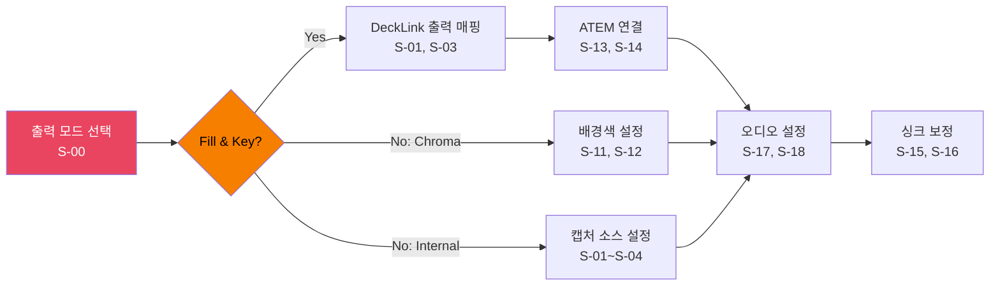
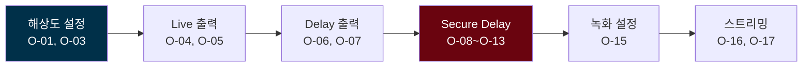
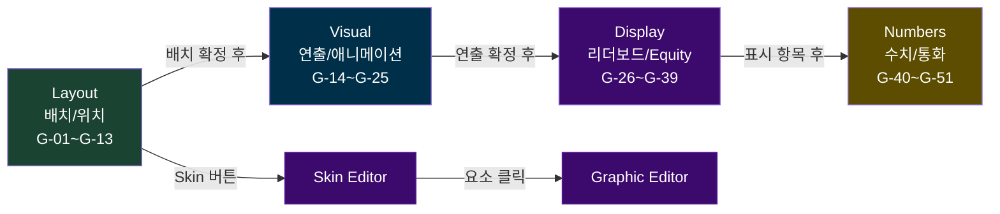
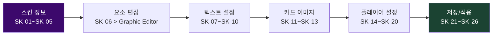

# PRD-0004: Screen Specifications

> 모든 화면의 상세 사양을 하나의 문서에 통합한다. 각 화면의 Design Decisions, Workflow, Element Catalog, Interaction Patterns, Navigation을 포함한다.
>
> Screen Spec 읽는 법:
> 1. **Design Decisions**: 왜 이렇게 설계했는가 (핵심)
> 2. **Workflow**: 작업 흐름 다이어그램
> 3. **Element Catalog**: 요소 테이블 (구현 참조)
> 4. **Interaction Patterns**: 조작-반응-피드백
> 5. **Navigation**: 화면 전환 경로

---

## 1. Main Window

- 단축키: 없음 (기본 화면)
- 요소: 20개 (P0: 11, P1: 7, P2: 2)
- 스크린샷: `images/mockups/ebs-main.png`
- HTML 원본: [ebs-server-ui.html](mockups/ebs-server-ui.html)

### Design Decisions

1. Dual Canvas 모니터링이 Preview Panel(M-02)에 집중되는 이유: 운영자가 방송 중 80% 이상 바라보는 화면이다. Live Canvas와 Delay Canvas의 상태 차이를 한 곳에서 확인할 수 있어야 Hidden Information Problem(홀카드 지연 공개)이 정상 작동하는지 즉시 판단 가능하다.

2. Quick Actions(M-11~M-16)가 메인에 노출되는 이유: 라이브 방송 중 탭 전환 없이 즉시 조작 가능해야 하는 기능이다. Reset Hand(M-11), Register Deck(M-13), Launch AT(M-14)는 초 단위 반응이 필요하므로 메인 화면에 상주한다.

3. Lock Toggle(M-07)이 전역 동작인 이유: 라이브 중 실수로 설정을 변경하면 방송 사고로 이어진다. Lock은 모든 탭의 설정 변경을 일괄 비활성화하며, Ctrl+L 단축키로 언제든 토글 가능하다.

### Workflow

앱 실행 시 기본 화면. Preview로 출력 상태 모니터링 → 상태 표시로 시스템 건강 확인 → 긴급 시 Quick Actions 사용 → 탭 전환으로 상세 설정 접근.

### Element Catalog

#### 상태 표시 그룹 (시스템 건강 상태 한눈에 파악)

| # | 요소 | 타입 | 설명 | PGX 대응 | 우선순위 |
|:-:|------|------|------|:--------:|:--------:|
| M-01 | Title Bar | AppBar | 앱 이름 + 버전 + 윈도우 컨트롤 | #1 | P2 |
| M-02 | Preview Panel | Canvas | 16:9 비율 고정, Chroma Key Blue 배경, GFX 오버레이 실시간 렌더링 | #2 | P0 |
| M-03 | CPU Indicator | ProgressBar | CPU 사용률 + 색상 코딩 (Green < 60%, Yellow < 85%, Red >= 85%) | #3 | P1 |
| M-04 | GPU Indicator | ProgressBar | GPU 사용률 + 색상 코딩 | #3 | P1 |
| M-05 | RFID Status | Icon + Badge | Green=Connected, Red=Disconnected, Yellow=Calibrating | #3 | P0 |
| M-06 | Error Icon | IconButton | 에러 카운트 뱃지, 클릭 시 로그 팝업 | #3 | P1 |
| M-17 | Hand Counter | Badge | 현재 세션 핸드 번호 (Hand #47) | 신규 | P0 |
| M-18 | Connection Status | Row | AT/Overlay/DB 각각 Green/Red 표시 | 신규 | P0 |

#### 보안 제어 그룹 (Hidden Information Problem 직접 대응)

| # | 요소 | 타입 | 설명 | PGX 대응 | 우선순위 |
|:-:|------|------|------|:--------:|:--------:|
| M-07 | Lock Toggle | IconButton | Lock 활성 시 설정 변경 불가, 오조작 방지 | #3 | P0 |
| M-08 | Secure Delay | Checkbox | Dual Canvas의 Delay 파이프라인 On/Off | #4 | P0 |
| M-09 | Preview Toggle | Checkbox | Preview 렌더링 On/Off (CPU 절약) | #4 | P0 |
| M-10 | Delay Progress | LinearProgressIndicator | Secure Delay 남은 시간 프로그레스바 + 텍스트 | 신규 | P0 |

#### Quick Actions 그룹 (라이브 중 가장 빈번한 조작)

| # | 요소 | 타입 | 설명 | PGX 대응 | 우선순위 |
|:-:|------|------|------|:--------:|:--------:|
| M-11 | Reset Hand | ElevatedButton | 현재 핸드 초기화, 확인 다이얼로그 | #5 | P0 |
| M-12 | Settings | IconButton | 전역 설정 다이얼로그 (테마, 언어, 단축키) | #5 | P1 |
| M-13 | Register Deck | ElevatedButton | 52장 RFID 일괄 등록, 진행 다이얼로그 | #6 | P0 |
| M-14 | Launch AT | ElevatedButton | Action Tracker 실행/포커스 전환 | #7 | P0 |
| M-15 | Split Recording | ElevatedButton | 핸드별 분할 녹화 토글 | #9 | P1 |
| M-16 | Tag Player | Dropdown + Text | 플레이어 선택 + 태그 입력 | #10 | P1 |
| M-19 | Quick Lock | Keyboard Shortcut | `Ctrl+L` 즉시 Lock 토글 | 신규 | P1 |
| M-20 | Fullscreen Preview | IconButton | Preview 전체 화면 (F11) | 신규 | P2 |

### Interaction Patterns

| 조작 | 시스템 반응 | 피드백 |
|------|-----------|--------|
| M-07 Lock 클릭 | 모든 설정 변경 비활성화 | 자물쇠 아이콘 변화 + 탭 그레이아웃 |
| M-08 Secure Delay 토글 | Delay Canvas 파이프라인 On/Off | M-10 프로그레스바 표시/숨김 |
| M-11 Reset Hand | 확인 다이얼로그 → 핸드 초기화 | Preview 초기화, Hand# 리셋 |
| M-13 Register Deck | 52장 순차 스캔 다이얼로그 | 1/52~52/52 진행 표시 |

### Navigation

| 목적지 | 방법 | 조건 |
|--------|------|------|
| Sources~System 탭 | Ctrl+1~5 또는 탭 클릭 | M-07 Lock 해제 시 |
| Skin Editor | GFX 탭 > 스킨 선택 영역 | 별도 창 |
| ActionTracker | F8 또는 M-14 | 별도 앱 실행 |
| Preview 전체 화면 | F11 또는 M-20 | ESC로 복귀 |

---

## 2. Sources Tab

- 단축키: Ctrl+1
- 요소: 19개 (P0: 6, P1: 13, P2: 0)
- 스크린샷: `images/mockups/ebs-sources.png`
- HTML 원본: [ebs-server-ui.html](mockups/ebs-server-ui.html)

### Design Decisions

1. Output Mode Selector(S-00)가 첫 번째인 이유: Fill & Key / Chroma Key / Internal 모드 선택이 나머지 모든 요소의 가시성과 필수 여부를 결정한다. Fill & Key 모드에서만 ATEM 설정(S-13, S-14)이 필요하고, Chroma Key 모드에서만 배경색 설정(S-11, S-12)이 활성화된다. 모드를 먼저 결정해야 불필요한 설정 노출을 방지할 수 있다.

2. ATEM Control(S-13, S-14)이 Fill & Key 전용인 이유: Fill & Key 모드에서 GFX Server는 Fill(RGB) + Key(Alpha) 신호 쌍을 DeckLink으로 출력하고, 외부 ATEM 스위처의 DSK가 이를 카메라 위에 합성한다. Chroma Key나 Internal 모드에서는 스위처가 불필요하므로 ATEM 설정을 노출하면 혼란만 가중된다.

3. Audio(S-17, S-18)가 모든 모드에서 공통인 이유: 오디오 소스와 싱크 보정은 출력 모드와 무관하게 항상 필요하다. 모드별로 분리하면 동일 설정을 3번 반복해야 하므로 공통 영역에 배치했다.

### Workflow

### Element Catalog

| # | 그룹 | 요소 | 타입 | 설명 | PGX# | 우선순위 |
|:-:|------|------|------|------|:----:|:--------:|
| S-00 | Output Mode | Mode Selector | RadioGroup | Fill & Key / Chroma Key / Internal (기본: Fill & Key) | 신규 | P0 |
| S-01 | Video Sources | Device Table | DataTable | NDI, 캡처 카드, 네트워크 카메라 목록 | #2 | P0 |
| S-02 | Video Sources | Add Button | TextButton | NDI 자동 탐색 또는 수동 URL | #8 | P1 |
| S-03 | Video Sources | Settings | IconButton | 해상도, 프레임레이트, 크롭 | #2 | P1 |
| S-04 | Video Sources | Preview | IconButton | 소스별 미니 프리뷰 | #2 | P1 |
| S-05 | Camera | Board Cam Hide GFX | Checkbox | 보드 카메라 시 GFX 자동 숨기기 | #3 | P1 |
| S-06 | Camera | Auto Camera Control | Checkbox | 게임 상태 기반 자동 전환 | #3 | P1 |
| S-07 | Camera | Mode | Dropdown | Static / Dynamic | #4 | P1 |
| S-08 | Camera | Heads Up Split | Checkbox | 헤즈업 화면 분할 | #5 | P1 |
| S-09 | Camera | Follow Players | Checkbox | 플레이어 추적 | #5 | P1 |
| S-10 | Camera | Follow Board | Checkbox | 보드 추적 | #5 | P1 |
| S-11 | Background | Enable | Checkbox | 크로마키 활성화 | #7 | P0 |
| S-12 | Background | Background Colour | ColorPicker | 배경색 (기본 Blue) | #7 | P0 |
| S-13 | External | Switcher Source | Dropdown | ATEM 스위처 연결 (Fill & Key 필수) | #10 | P0 |
| S-14 | External | ATEM Control | Checkbox + TextField | ATEM IP + 연결 상태 (Fill & Key 필수) | #10 | P0 |
| S-15 | Sync | Board Sync | NumberInput | 보드 싱크 보정 (ms) | #11 | P1 |
| S-16 | Sync | Crossfade | NumberInput | 크로스페이드 (ms, 기본 300) | #11 | P1 |
| S-17 | Audio | Input Source | Dropdown | 오디오 소스 선택 | #9 | P1 |
| S-18 | Audio | Audio Sync | NumberInput | 오디오 싱크 보정 (ms) | #9 | P1 |

### Interaction Patterns

| 조작 | 시스템 반응 | 피드백 |
|------|-----------|--------|
| S-02 Add 클릭 | NDI 자동 탐색 시작 | 발견된 소스 목록 팝업 |
| S-11 Chroma Key 토글 | Preview에 크로마키 즉시 반영 | 배경색 변화 |
| S-14 ATEM IP 입력 | 연결 시도 + 상태 표시 | Green/Red 아이콘 |

### Navigation

| 목적지 | 방법 | 조건 |
|--------|------|------|
| Main Window | 탭 영역 외 클릭 | 언제든 |
| Outputs 탭 | Ctrl+2 | 비디오 소스 설정 완료 후 자연스러운 다음 단계 |

---

## 3. Outputs Tab

- 단축키: Ctrl+2
- 요소: 20개 (P0: 8, P1: 4, P2: 8)
- 스크린샷: `images/mockups/ebs-outputs.png`
- HTML 원본: [ebs-server-ui.html](mockups/ebs-server-ui.html)

### Design Decisions

1. Live/Delay가 독립 파이프라인인 이유: Dual Canvas Architecture의 핵심이다. Live 출력은 운영자가 즉시 확인하는 채널이고, Delay 출력은 시청자에게 지연 전송되는 채널이다. 두 파이프라인의 장치, 해상도, 프레임레이트가 독립적이어야 Hidden Information Problem을 하드웨어 수준에서 해결할 수 있다.

2. Fill & Key 채널 매핑(O-05, O-07, O-20)이 P0인 이유: Fill(RGB)과 Key(Alpha)는 DeckLink 카드의 물리적 SDI/HDMI 포트에 매핑되어야 한다. Live Fill/Key + Delay Fill/Key = 최소 4개 채널이며, 포트 할당 오류는 방송 화면 깨짐으로 직결된다.

3. Secure Delay 설정(O-08~O-13)이 이 탭에 있는 이유: Secure Delay는 Delay 파이프라인의 버퍼 시간을 제어한다. 출력 장치 설정과 함께 있어야 운영자가 "어디로(장치) + 언제(딜레이)" 를 한 화면에서 결정할 수 있다. 메인 윈도우의 M-08은 On/Off 토글만 제공하고, 상세 시간 설정은 이 탭에서 한다.

### Workflow

### Element Catalog

| # | 그룹 | 요소 | 설명 | PGX# | 우선순위 |
|:-:|------|------|------|:----:|:--------:|
| O-01 | Resolution | Video Size | 1080p/4K 출력 해상도 | #1 | P0 |
| O-02 | Resolution | 9x16 Vertical | 세로 모드 (모바일) | #2 | P2 |
| O-03 | Resolution | Frame Rate | 30/60fps | #3 | P0 |
| O-04 | Live | Video/Audio/Device | Live 파이프라인 3개 드롭다운 | #4 | P0 |
| O-05 | Live | Key & Fill | Live Fill & Key 출력 (DeckLink 채널 할당) | #4 | P0 |
| O-06 | Delay | Video/Audio/Device | Delay 파이프라인 (Live와 독립) | #5 | P0 |
| O-07 | Delay | Key & Fill | Delay Fill & Key 출력 (DeckLink 채널 할당) | #5 | P0 |
| O-08 | Secure Delay | Delay Time | 1~30분 (기본 30분) | #8 | P0 |
| O-09 | Secure Delay | Dynamic Delay | 상황별 자동 조절 | #9 | P1 |
| O-10 | Secure Delay | Show Countdown | 카운트다운 표시 | #11 | P1 |
| O-11 | Secure Delay | Countdown Video | 종료 시 재생 영상 | #12 | P2 |
| O-12 | Secure Delay | Countdown Background | 배경 이미지 | #12 | P2 |
| O-13 | Secure Delay | Auto Stream | 지정 시간 후 자동 시작 | #10 | P2 |
| O-14 | Virtual | Camera | 가상 카메라 (OBS 연동) | #6 | P2 |
| O-15 | Recording | Mode | Video / Video+GFX / GFX only | #7 | P1 |
| O-16 | Streaming | Platform | Twitch/YouTube/Custom RTMP | #13 | P2 |
| O-17 | Streaming | Account Connect | OAuth 연결 | #13 | P2 |
| O-18 | Fill & Key | Key Color | Key 신호 배경색 (기본: #FF000000) | 신규 | P0 |
| O-19 | Fill & Key | Fill/Key Preview | Fill 신호와 Key 신호 나란히 미리보기 | 신규 | P1 |
| O-20 | Fill & Key | DeckLink Channel Map | Live Fill/Key + Delay Fill/Key → DeckLink 포트 매핑 | 신규 | P0 |

### Interaction Patterns

| 조작 | 시스템 반응 | 피드백 |
|------|-----------|--------|
| O-08 딜레이 시간 변경 | Delay 버퍼 리사이징 | Main > M-10 프로그레스바 갱신 |
| O-04 Live 장치 변경 | 즉시 출력 전환 | Preview 갱신 |
| O-01 해상도 변경 | 전체 파이프라인 재초기화 | 잠시 Preview 블랙아웃 후 복구 |

### Navigation

| 목적지 | 방법 | 조건 |
|--------|------|------|
| GFX 탭 | Ctrl+3 | 출력 설정 후 그래픽 조정 |
| Main Window | 탭 영역 외 클릭 | Secure Delay 확인 후 |

---

## 4. GFX Tab

- 단축키: Ctrl+3
- 요소: 51개 (P0: 13, P1: 35, P2: 3) -- 4개 서브 탭: Layout/Visual/Display/Numbers
- 스크린샷: `images/mockups/ebs-gfx-layout.png`
- HTML 원본: [ebs-server-ui.html](mockups/ebs-server-ui.html)

### Design Decisions

1. GFX 1/2/3을 단일 탭(4개 서브 섹션)으로 통합한 이유: PokerGFX의 GFX 1/2/3은 기능 추가 과정의 산물이었다. 게임 규칙이 GFX 2에 리더보드 설정과 혼재되어 있었고, 운영자가 "이 설정이 GFX 1인지 3인지" 기억해야 했다. EBS에서는 기능적 분류(Layout/Visual/Display/Numbers)로 재편하여 "어디에, 어떤 연출로, 무엇을, 어떤 형식으로"라는 자연스러운 작업 순서를 따른다.

2. Global vs Local 설정 영향 범위를 명시한 이유: Board Position(G-01)이나 Currency Symbol(G-47)을 변경하면 모든 출력 채널에 즉시 반영된다(Global). 반면 Sponsor Logo(G-10~G-12)는 해당 요소만 영향받는다(Local). 라이브 중 Global 설정 변경은 방송 사고로 이어질 수 있으므로 영향 범위를 명시하여 운영자가 위험을 인지하도록 했다.

3. Skin Editor/Graphic Editor가 별도 창인 이유: GFX 탭은 "런타임 설정"이고, Skin/Graphic Editor는 "디자인 편집"이다. 편집 작업은 시간이 걸리고 실시간 프리뷰가 필요하므로, 메인 윈도우의 Preview를 유지하면서 별도 창에서 작업하는 것이 효율적이다. 이 분리로 방송 중에는 Editor를 열지 않는 운영 관행도 강화된다.

### Workflow

### Element Catalog

#### Layout 서브 섹션 (위치와 배치)

| # | 요소 | 타입 | 설명 | PGX# | 우선순위 |
|:-:|------|------|------|:----:|:--------:|
| G-01 | Board Position | Dropdown | 보드 카드 위치 (Left/Right/Centre/Top) | GFX1 #2 | P0 |
| G-02 | Player Layout | Dropdown | 플레이어 배치 (Vert/Bot/Spill) | GFX1 #3 | P0 |
| G-03 | X Margin | NumberInput | 좌우 여백 (%, 기본 0.04) | GFX1 #20 | P1 |
| G-04 | Top Margin | NumberInput | 상단 여백 (%, 기본 0.05) | GFX1 #21 | P1 |
| G-05 | Bot Margin | NumberInput | 하단 여백 (%, 기본 0.04) | GFX1 #22 | P1 |
| G-06 | Leaderboard Position | Dropdown | 리더보드 위치 | GFX1 #7 | P1 |
| G-07 | Heads Up Layout L/R | Dropdown | 헤즈업 화면 분할 배치 | GFX1 #10 | P1 |
| G-08 | Heads Up Camera | Dropdown | 헤즈업 카메라 위치 | GFX1 #11 | P1 |
| G-09 | Heads Up Custom Y | Checkbox + NumberInput | Y축 미세 조정 | GFX1 #12 | P1 |
| G-10 | Sponsor Logo 1 | ImageSlot | Leaderboard 스폰서 | GFX1 #16 | P2 |
| G-11 | Sponsor Logo 2 | ImageSlot | Board 스폰서 | GFX1 #17 | P2 |
| G-12 | Sponsor Logo 3 | ImageSlot | Strip 스폰서 | GFX1 #18 | P2 |
| G-13 | Vanity Text | TextField + Checkbox | 테이블 텍스트 + Game Variant 대체 | GFX1 #19 | P2 |

#### Visual 서브 섹션 (애니메이션과 연출)

| # | 요소 | 타입 | 설명 | PGX# | 우선순위 |
|:-:|------|------|------|:----:|:--------:|
| G-14 | Reveal Players | Dropdown | 카드 공개 시점 (Always/Action On/Never) | GFX1 #4 | P0 |
| G-15 | How to Show Fold | Dropdown + NumberInput | 폴드 표시 (Immediate/Fade + 시간) | GFX1 #5 | P0 |
| G-16 | Reveal Cards | Dropdown | 카드 공개 연출 (Immediate/Animated) | GFX1 #6 | P0 |
| G-17 | Transition In | Dropdown + NumberInput | 등장 애니메이션 + 시간 | GFX1 #8 | P1 |
| G-18 | Transition Out | Dropdown + NumberInput | 퇴장 애니메이션 + 시간 | GFX1 #9 | P1 |
| G-19 | Indent Action Player | Checkbox | 액션 플레이어 들여쓰기 | GFX1 #24 | P1 |
| G-20 | Bounce Action Player | Checkbox | 액션 플레이어 바운스 | GFX1 #25 | P1 |
| G-21 | Action Clock | NumberInput | 카운트다운 임계값 (초) | GFX1 #29 | P0 |
| G-22 | Show Leaderboard | Checkbox + Settings | 핸드 후 리더보드 자동 표시 | GFX1 #26 | P1 |
| G-23 | Show PIP Capture | Checkbox + Settings | 핸드 후 PIP 표시 | GFX1 #27 | P1 |
| G-24 | Show Player Stats | Checkbox + Settings | 핸드 후 티커 통계 | GFX1 #28 | P1 |
| G-25 | Heads Up History | Checkbox | 헤즈업 히스토리 | GFX1 #23 | P1 |

#### Display 서브 섹션 (리더보드/플레이어 표시 규칙)

| # | 요소 | 타입 | 설명 | PGX# | 우선순위 |
|:-:|------|------|------|:----:|:--------:|
| G-26 | Show Knockout Rank | Checkbox | 녹아웃 순위 | GFX2 #2 | P1 |
| G-27 | Show Chipcount % | Checkbox | 칩카운트 퍼센트 | GFX2 #3 | P1 |
| G-28 | Show Eliminated | Checkbox | 탈락 선수 표시 | GFX2 #4 | P1 |
| G-29 | Cumulative Winnings | Checkbox | 누적 상금 | GFX2 #5 | P1 |
| G-30 | Hide Leaderboard | Checkbox | 핸드 시작 시 숨김 | GFX2 #6 | P1 |
| G-31 | Max BB Multiple | NumberInput | BB 배수 상한 | GFX2 #7 | P1 |
| G-32 | Add Seat # | Checkbox | 좌석 번호 추가 | GFX2 #12 | P1 |
| G-33 | Show as Eliminated | Checkbox | 스택 소진 시 탈락 | GFX2 #13 | P1 |
| G-34 | Unknown Cards Blink | Checkbox | 미확인 카드 깜빡임 | GFX2 #15 | P1 |
| G-35 | Clear Previous Action | Checkbox | 이전 액션 초기화 | GFX2 #17 | P1 |
| G-36 | Order Players | Dropdown | 플레이어 정렬 순서 | GFX2 #18 | P1 |
| G-37 | Show Hand Equities | Dropdown | Equity 표시 시점 | GFX2 #19 | P0 |
| G-38 | Hilite Winning Hand | Dropdown | 위닝 핸드 강조 시점 | GFX2 #20 | P0 |
| G-39 | Hilite Nit Game | Dropdown | 닛 게임 강조 조건 | GFX2 #16 | P1 |

#### Numbers 서브 섹션 (수치 형식과 통화)

| # | 요소 | 타입 | 설명 | PGX# | 우선순위 |
|:-:|------|------|------|:----:|:--------:|
| G-40 | Show Outs | Dropdown | 아웃츠 조건 (Heads Up/All In/Always) | GFX3 #2 | P1 |
| G-41 | Outs Position | Dropdown | 아웃츠 위치 | GFX3 #3 | P1 |
| G-42 | True Outs | Checkbox | 정밀 아웃츠 계산 | GFX3 #4 | P1 |
| G-43 | Score Strip | Dropdown | 하단 스코어 스트립 | GFX3 #5 | P1 |
| G-44 | Order Strip By | Dropdown | 스트립 정렬 기준 | GFX3 #6 | P1 |
| G-45 | Show Blinds | Dropdown | 블라인드 표시 조건 | GFX3 #8 | P0 |
| G-46 | Show Hand # | Checkbox | 핸드 번호 표시 | GFX3 #9 | P0 |
| G-47 | Currency Symbol | TextField | 통화 기호 | GFX3 #10 | P0 |
| G-48 | Trailing Currency | Checkbox | 후치 통화 기호 | GFX3 #11 | P0 |
| G-49 | Divide by 100 | Checkbox | 금액 100분의 1 | GFX3 #12 | P0 |
| G-50 | Chipcount Precision | PrecisionGroup | 8개 영역별 수치 형식 | GFX3 #14-20 | P1 |
| G-51 | Display Mode | ModeGroup | Amount vs BB 전환 | GFX3 #22-23 | P1 |

### Interaction Patterns

| 조작 | 시스템 반응 | 영향 범위 |
|------|-----------|-----------|
| G-01 Board Position 변경 | 보드 위치 즉시 반영 | Global -- 모든 출력 채널 |
| G-02 Player Layout 변경 | 플레이어 배치 즉시 반영 | Global |
| G-47 Currency Symbol 변경 | 모든 금액 표시 갱신 | Global |
| G-10~G-12 Sponsor Logo 변경 | 해당 로고만 교체 | Local -- 단일 요소 |
| G-17 Transition 변경 | 다음 전환부터 적용 | Local |

설정 영향 범위 (Blast Radius):

| 범위 | 설정 예시 | 라이브 중 변경 |
|------|-----------|:-----------:|
| Global (모든 출력) | Board Position, Player Layout, Currency | 주의 필요 |
| Channel (특정 출력) | Live/Delay 설정 | 안전 |
| Local (단일 요소) | Sponsor Logo, Vanity Text | 안전 |

### Navigation

| 목적지 | 방법 | 조건 |
|--------|------|------|
| Skin Editor | 스킨 선택 영역 클릭 | 별도 창 열림 |
| Graphic Editor | Skin Editor > 요소 클릭 | Skin Editor 경유 |
| Rules 탭 | Ctrl+4 | 게임 규칙 확인 |

---

## 5. Rules Tab

- 단축키: Ctrl+4
- 요소: 6개 (P0: 0, P1: 6, P2: 0)
- 스크린샷: `images/mockups/ebs-rules.png`
- HTML 원본: [ebs-server-ui.html](mockups/ebs-server-ui.html)

### Design Decisions

1. GFX 2에서 분리한 이유: PokerGFX에서 게임 규칙(Bomb Pot, Straddle, Rabbit Hunting)이 GFX 2의 리더보드/플레이어 표시 설정과 혼재되어 있었다. 규칙은 Game Engine의 행동을 결정하고, GFX Display는 시각적 출력을 결정한다. 이 둘은 변경 빈도와 영향 범위가 다르므로 독립 탭으로 분리하여 기능 혼재를 해소했다.

2. 모든 요소가 P1인 이유: 게임 규칙은 대부분의 방송에서 기본값으로 운영된다. Bomb Pot이나 Straddle 같은 특수 규칙은 특정 게임 형식에서만 활성화되므로 P0(필수)이 아닌 P1(중요)로 분류했다.

### Workflow

게임 규칙 설정은 독립적이며 순서가 없다. 필요한 규칙만 확인/변경한다.

### Element Catalog

| # | 요소 | 설명 | PGX# | 우선순위 |
|:-:|------|------|:----:|:--------:|
| R-01 | Move Button Bomb Pot | 봄팟 후 버튼 이동 | GFX2 #8 | P1 |
| R-02 | Limit Raises | 유효 스택 기반 레이즈 제한 | GFX2 #9 | P1 |
| R-03 | Allow Rabbit Hunting | 래빗 헌팅 허용 | GFX2 #14 | P1 |
| R-04 | Straddle Sleeper | 스트래들 위치 규칙 | GFX2 #10 | P1 |
| R-05 | Sleeper Final Action | 슬리퍼 최종 액션 | GFX2 #11 | P1 |
| R-06 | Ignore Split Pots | Equity/Outs에서 Split pot 무시 | GFX2 #21 | P1 |

### Navigation

| 목적지 | 방법 | 조건 |
|--------|------|------|
| GFX 탭 | Ctrl+3 | 규칙과 연동되는 표시 설정 확인 |
| Main Window | 탭 영역 외 클릭 | 설정 완료 후 |

---

## 6. System Tab

- 단축키: Ctrl+5
- 요소: 24개 (P0: 7, P1: 11, P2: 6)
- 스크린샷: `images/mockups/ebs-system.png`
- HTML 원본: [ebs-server-ui.html](mockups/ebs-server-ui.html)

### Design Decisions

1. RFID 캘리브레이션이 방송 준비 첫 단계인 이유: 카드 인식의 정확도가 이 탭에서 결정된다. 캘리브레이션 없이 다른 설정을 진행하면 테스트 핸드에서 카드 오인식이 발생하고, 모든 설정을 다시 확인해야 한다. 따라서 방송 준비 프로세스(Part III 섹션 7)에서 하드웨어 점검(1단계) → RFID 캘리브레이션(2단계)을 최우선으로 배치했다.

2. AT 접근 정책(Y-13~Y-15)이 이 탭에 있는 이유: ActionTracker는 딜러가 사용하는 별도 장치이므로 보안 설정이 필요하다. Kiosk Mode(Y-15)는 딜러가 불필요한 기능에 접근하지 못하도록 제한하고, Predictive Bet(Y-14)는 딜러의 입력 속도를 높인다. 이 설정은 시스템 관리 범주이므로 System 탭에 배치했다.

3. Advanced 그룹(Y-16~Y-23)이 별도 섹션인 이유: MultiGFX(다중 테이블), Stream Deck 매핑, Auto Start 같은 설정은 대부분의 방송에서 변경하지 않는다. 자주 사용하는 RFID/Diagnostics 설정과 시각적으로 분리하여 실수로 변경하는 것을 방지한다.

### Workflow

RFID 리셋/캘리브레이션 → 안테나 설정 → AT 접근 정책 → 진단 확인 → 고급 설정.

### Element Catalog

| # | 그룹 | 요소 | 설명 | PGX# | 우선순위 |
|:-:|------|------|------|:----:|:--------:|
| Y-01 | Table | Name | 테이블 식별 이름 | #2 | P1 |
| Y-02 | Table | Password | 접속 비밀번호 | #3 | P1 |
| Y-03 | RFID | Reset | RFID 시스템 초기화 | #4 | P0 |
| Y-04 | RFID | Calibrate | 안테나별 캘리브레이션 | #5 | P0 |
| Y-05 | RFID | UPCARD Antennas | UPCARD 안테나로 홀카드 읽기 | #22 | P0 |
| Y-06 | RFID | Disable Muck | AT 모드 시 muck 안테나 비활성 | #23 | P0 |
| Y-07 | RFID | Disable Community | 커뮤니티 카드 안테나 비활성 | #24 | P0 |
| Y-08 | System Info | Hardware Panel | CPU/GPU/OS/Encoder 자동 감지 | #11 | P1 |
| Y-09 | Diagnostics | Table Diagnostics | 안테나별 상태, 신호 강도 (별도 창) | #10 | P1 |
| Y-10 | Diagnostics | System Log | 로그 뷰어 | #12 | P1 |
| Y-11 | Diagnostics | Secure Delay Folder | 딜레이 녹화 폴더 | #13 | P1 |
| Y-12 | Diagnostics | Export Folder | 내보내기 폴더 | #14 | P1 |
| Y-13 | AT | Allow AT Access | AT 접근 허용 | #26 | P0 |
| Y-14 | AT | Predictive Bet | 베팅 예측 입력 | #27 | P0 |
| Y-15 | AT | Kiosk Mode | AT 키오스크 모드 | #28 | P0 |
| Y-16 | Advanced | MultiGFX | 다중 테이블 운영 | #16 | P2 |
| Y-17 | Advanced | Sync Stream | 스트림 동기화 | #17 | P2 |
| Y-18 | Advanced | Sync Skin | 스킨 동기화 | #18 | P2 |
| Y-19 | Advanced | No Cards | 카드 비활성화 | #19 | P1 |
| Y-20 | Advanced | Disable GPU | GPU 인코딩 비활성화 | #20 | P1 |
| Y-21 | Advanced | Ignore Name Tags | 네임 태그 무시 | #21 | P1 |
| Y-22 | Advanced | Auto Start | OS 시작 시 자동 실행 | 신규 | P2 |
| Y-23 | Advanced | Stream Deck | Elgato Stream Deck 매핑 | #15 | P2 |
| Y-24 | Updates | Version + Check | 버전 표시 + 업데이트 | #7,#8 | P2 |

### Interaction Patterns

| 조작 | 시스템 반응 | 피드백 |
|------|-----------|--------|
| Y-03 Reset 클릭 | RFID 시스템 재초기화 | M-05 상태 변화 (Yellow → Green/Red) |
| Y-04 Calibrate 클릭 | 안테나별 캘리브레이션 시작 | 진행률 + 안테나별 결과 |
| Y-09 Table Diagnostics | 별도 창 열림 | 안테나 신호 강도 실시간 표시 |

### Navigation

| 목적지 | 방법 | 조건 |
|--------|------|------|
| Table Diagnostics | Y-09 클릭 | 별도 창 열림 |
| Main Window | 탭 영역 외 클릭 | RFID 설정 완료 후 |
| Sources 탭 | Ctrl+1 | RFID 후 비디오 설정으로 이동 |

---

## 7. Skin Editor

- 단축키: 없음 (별도 창)
- 요소: 26개 (P0: 0, P1: 21, P2: 5)
- 스크린샷: `images/mockups/ebs-skin-editor.png`
- HTML 원본: [ebs-skin-editor.html](mockups/ebs-skin-editor.html)

### Design Decisions

1. 에디터 계층 구조 (GFX → Skin → Graphic)가 존재하는 이유: GFX 탭은 "무엇을 어디에 표시할지" 런타임 설정이다. Skin Editor는 "어떤 시각적 테마로" 표현할지 정의한다. Graphic Editor는 "개별 요소를 픽셀 단위로" 편집한다. 이 3단계 계층은 변경 빈도에 따라 분리되었다: GFX는 방송마다, Skin은 시즌마다, Graphic은 디자인 변경 시에만 접근한다.

2. 별도 창인 이유: Skin 편집은 실시간 프리뷰가 필수이며 작업 시간이 길다. 메인 윈도우의 Preview Panel과 독립적으로 프리뷰를 제공하면서, 편집이 끝나면 즉시 적용(SK-26 Use)하는 워크플로우를 지원한다. 방송 중에는 이 창을 열지 않는 운영 관행을 강화한다.

3. Import/Export/Download(SK-21~SK-23)를 분리한 이유: 스킨은 팀 간 공유 자산이다. Import/Export로 파일 기반 교환을 지원하고, Download로 온라인 스킨 리포지토리에서 가져올 수 있다. Reset(SK-24)은 실수로 변경한 스킨을 기본값으로 복구한다.

### Workflow

### Element Catalog

| # | 그룹 | 요소 | 설명 | PGX# | 우선순위 |
|:-:|------|------|------|:----:|:--------:|
| SK-01 | Info | Name | 스킨 이름 | #1 | P1 |
| SK-02 | Info | Details | 설명 텍스트 | #2 | P1 |
| SK-03 | Info | Remove Transparency | 크로마키 투명도 제거 | #3 | P1 |
| SK-04 | Info | 4K Design | 4K 전용 체크 | #4 | P1 |
| SK-05 | Info | Adjust Size | 크기 슬라이더 | #5 | P2 |
| SK-06 | Elements | 10 Buttons | Strip~Field 각 요소 → Graphic Editor | #6-15 | P1 |
| SK-07 | Text | All Caps | 대문자 변환 | #16 | P1 |
| SK-08 | Text | Reveal Speed | 텍스트 등장 속도 | #17 | P1 |
| SK-09 | Text | Font 1/2 | 1차/2차 폰트 | #18,19 | P1 |
| SK-10 | Text | Language | 다국어 설정 | #20 | P1 |
| SK-11 | Cards | Card Preview | 4수트 + 뒷면 미리보기 | #21 | P1 |
| SK-12 | Cards | Add/Replace/Delete | 카드 이미지 관리 | #22 | P1 |
| SK-13 | Cards | Import Card Back | 뒷면 이미지 | #23 | P1 |
| SK-14 | Player | Variant | 게임 타입 선택 | #27 | P1 |
| SK-15 | Player | Player Set | 게임별 세트 | #28 | P1 |
| SK-16 | Player | Edit/New/Delete | 세트 관리 | #30 | P1 |
| SK-17 | Player | Crop to Circle | 원형 크롭 | #31 | P1 |
| SK-18 | Player | Country Flag | 국기 모드 | #24 | P2 |
| SK-19 | Player | Edit Flags | 국기 이미지 편집 | #25 | P2 |
| SK-20 | Player | Hide Flag After | 자동 숨김 (초) | #26 | P2 |
| SK-21 | Actions | Import | 스킨 가져오기 | #32 | P1 |
| SK-22 | Actions | Export | 스킨 내보내기 | #33 | P1 |
| SK-23 | Actions | Download | 온라인 다운로드 | #34 | P2 |
| SK-24 | Actions | Reset | 기본 초기화 | #35 | P1 |
| SK-25 | Actions | Discard | 변경 취소 | #36 | P1 |
| SK-26 | Actions | Use | 현재 적용 | #37 | P1 |

### Navigation

| 목적지 | 방법 | 조건 |
|--------|------|------|
| Graphic Editor | SK-06 요소 버튼 클릭 | 별도 창 열림 |
| GFX 탭 | 창 닫기 | SK-26 Use 후 |

---

## 8. Graphic Editor

- 단축키: 없음 (별도 창, Skin Editor 경유)
- 요소: Board 모드 + Player 모드 (Player Overlay 8개 요소)
- 스크린샷: `images/mockups/ebs-graphic-editor.png`
- HTML 원본: [ebs-graphic-editor.html](mockups/ebs-graphic-editor.html)

### Design Decisions

1. Board/Player 듀얼 모드인 이유: 보드 영역(커뮤니티 카드, 팟)과 플레이어 영역(홀카드, 이름, 스택)은 레이아웃 요소가 완전히 다르다. 하나의 에디터에서 모드를 전환하여 편집하면, 동일한 조작 패턴(Position, Animation, Text)을 유지하면서 대상만 바꿀 수 있다.

2. Skin Editor에서만 접근 가능한 이유: Graphic Editor는 가장 세밀한 편집 수준이다. GFX 탭 → Skin Editor → Graphic Editor 순서로 진입 깊이가 깊어지면서, 실수로 픽셀 수준 편집에 접근하는 것을 방지한다. 이 계층 구조는 "변경 빈도가 낮을수록 접근이 깊다"는 원칙을 따른다.

### Workflow

편집 대상 선택 → 위치/크기 조정 → 애니메이션 설정 → 텍스트 스타일 → 실시간 프리뷰 확인.

### Element Catalog

#### 핵심 편집 기능

| 기능 | 설명 |
|------|------|
| Element 선택 | 드롭다운으로 편집 대상 선택 |
| Position (LTWH) | Left/Top/Width/Height 픽셀 단위 |
| Anchor | 해상도 변경 시 기준점 |
| Z-order | 레이어 겹침 순서 |
| Angle | 요소 회전 |
| Animation In/Out | 등장/퇴장 + 속도 슬라이더 |
| Transition | Default/Pop/Expand/Slide |
| Text | 폰트, 색상, 강조색, 정렬, 그림자 |
| Background Image | 요소 배경 |
| Live Preview | 하단 실시간 프리뷰 |

#### Player Overlay 요소 (8개)

| 코드 | 요소 | 설명 | 우선순위 |
|:----:|------|------|:--------:|
| A | Player Photo | 프로필 이미지 | P1 |
| B | Hole Cards | 홀카드 2~5장 | P0 |
| C | Name | 플레이어 이름 | P0 |
| D | Country Flag | 국적 국기 | P2 |
| E | Equity % | 승률 | P0 |
| F | Action | 최근 액션 | P0 |
| G | Stack | 칩 스택 | P0 |
| H | Position | 포지션 (D/SB/BB) | P0 |

### Navigation

| 목적지 | 방법 | 조건 |
|--------|------|------|
| Skin Editor | 창 닫기 | 편집 완료 후 |

---

## 변경 이력

| 버전 | 날짜 | 변경 내용 |
|------|------|----------|
| v1.0.0 | 2026-02-16 | 8개 개별 Screen Spec을 단일 문서로 통합 |

---

Version: 1.0.0 | Updated: 2026-02-16
