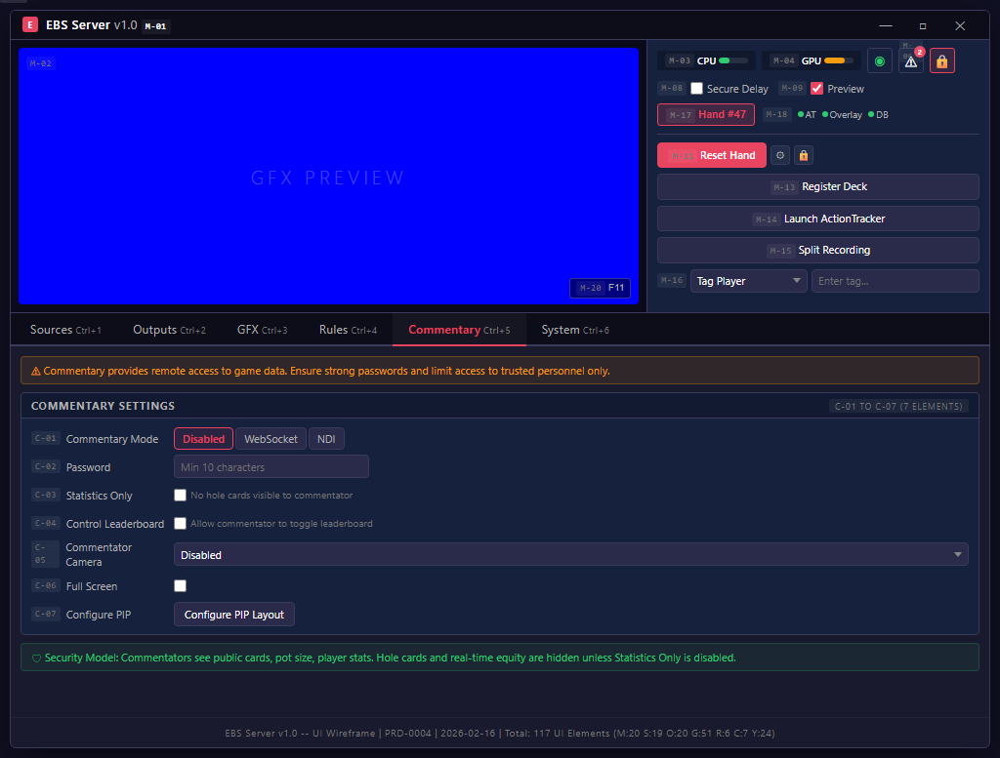

# Commentary Tab -- Screen Specification

> **EBS 배제**: Commentary 탭은 기존 프로덕션에서 사용하지 않는 기능이므로 EBS에서 배제한다. 이 문서는 PokerGFX 분석 기록으로만 유지한다.

## Quick Reference

- 단축키: Ctrl+5
- 요소: 7개 (P0: 0, P1: 5, P2: 2)
- 스크린샷: `images/mockups/ebs-commentary.png`
- HTML 원본: [ebs-server-ui.html](../mockups/ebs-server-ui.html)

## Design Decisions

1. Trustless Mode 보안 모델: 해설자에게 제공하는 정보를 서버 측에서 필터링한다. 해설자가 볼 수 있는 것은 공개된 카드, 팟 크기, 플레이어 통계뿐이다. 홀카드(Trustless 모드)와 실시간 Equity는 해설자에게 전송되지 않는다. 이는 딜레이 방송의 보안을 해설자 클라이언트 수준까지 확장한다.

2. Statistics Only(C-03) 모드가 존재하는 이유: 일부 방송에서는 해설자가 카드 정보 없이 통계만으로 해설한다. 이 모드에서 해설자 화면에는 플레이어 통계, 팟 크기, 리더보드만 표시되며 카드 관련 UI가 완전히 숨겨진다.

3. 대부분의 방송에서 재접근하지 않는 이유: Commentary 설정은 방송 준비 시 한 번 설정하면 변경할 일이 거의 없다. 해설자 접속/해제는 서버에서 자동 관리되므로 운영자 개입이 최소화된다.

## Workflow

Commentary Mode 활성화 → 비밀번호 설정 → 통계 전용 모드 확인 → PIP 설정.

보안 모델:
| 대상 | 해설자가 볼 수 있는 것 | 해설자가 볼 수 없는 것 |
|------|----------------------|----------------------|
| 카드 | 공개된 보드 카드 | 홀카드 (Trustless) |
| 데이터 | 팟 크기, 플레이어 통계 | 실시간 Equity |
| 제어 | 리더보드 (C-04 허용 시) | 게임 설정 변경 |

## Element Catalog

| # | 요소 | 설명 | PGX# | 우선순위 |
|:-:|------|------|:----:|:--------:|
| C-01 | Commentary Mode | Disabled/WebSocket/NDI | #2 | P1 |
| C-02 | Password | 접속 인증 (최소 10자) | #3 | P1 |
| C-03 | Statistics Only | 카드 없이 통계만 | #4 | P1 |
| C-04 | Control Leaderboard | 해설자 리더보드 조작 | #5 | P2 |
| C-05 | Commentator Camera | 카메라 + 오디오 | #6 | P1 |
| C-06 | Full Screen | 전체 화면 허용 | #8 | P2 |
| C-07 | Configure PIP | PIP 위치/크기 설정 | #7 | P1 |

## Navigation

| 목적지 | 방법 | 조건 |
|--------|------|------|
| System 탭 | Ctrl+6 | AT 연결 확인 |
| Outputs 탭 | Ctrl+2 | PIP 출력 확인 |
