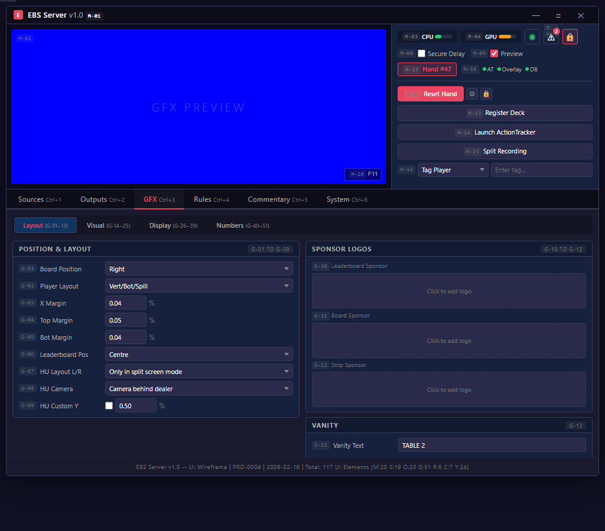
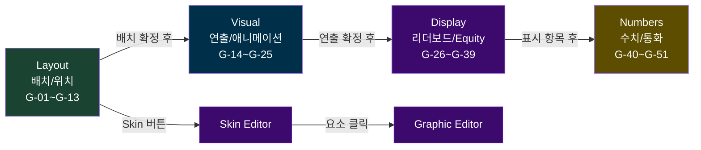

# GFX Tab -- Screen Specification

## Quick Reference

- 단축키: Ctrl+3
- 요소: 51개 (P0: 13, P1: 35, P2: 3) -- 4개 서브 탭: Layout/Visual/Display/Numbers
- 스크린샷: `images/mockups/ebs-gfx-layout.png`
- HTML 원본: [ebs-server-ui.html](../mockups/ebs-server-ui.html)

## Design Decisions

1. GFX 1/2/3을 단일 탭(4개 서브 섹션)으로 통합한 이유: PokerGFX의 GFX 1/2/3은 기능 추가 과정의 산물이었다. 게임 규칙이 GFX 2에 리더보드 설정과 혼재되어 있었고, 운영자가 "이 설정이 GFX 1인지 3인지" 기억해야 했다. EBS에서는 기능적 분류(Layout/Visual/Display/Numbers)로 재편하여 "어디에, 어떤 연출로, 무엇을, 어떤 형식으로"라는 자연스러운 작업 순서를 따른다.

2. Global vs Local 설정 영향 범위를 명시한 이유: Board Position(G-01)이나 Currency Symbol(G-47)을 변경하면 모든 출력 채널에 즉시 반영된다(Global). 반면 Sponsor Logo(G-10~G-12)는 해당 요소만 영향받는다(Local). 라이브 중 Global 설정 변경은 방송 사고로 이어질 수 있으므로 영향 범위를 명시하여 운영자가 위험을 인지하도록 했다.

3. Skin Editor/Graphic Editor가 별도 창인 이유: GFX 탭은 "런타임 설정"이고, Skin/Graphic Editor는 "디자인 편집"이다. 편집 작업은 시간이 걸리고 실시간 프리뷰가 필요하므로, 메인 윈도우의 Preview를 유지하면서 별도 창에서 작업하는 것이 효율적이다. 이 분리로 방송 중에는 Editor를 열지 않는 운영 관행도 강화된다.

## Workflow

## Element Catalog

### Layout 서브 섹션 (위치와 배치)

| # | 요소 | 타입 | 설명 | PGX# | 우선순위 |
|:-:|------|------|------|:----:|:--------:|
| G-01 | Board Position | Dropdown | 보드 카드 위치 (Left/Right/Centre/Top) | GFX1 #2 | P0 |
| G-02 | Player Layout | Dropdown | 플레이어 배치 (Vert/Bot/Spill) | GFX1 #3 | P0 |
| G-03 | X Margin | NumberInput | 좌우 여백 (%, 기본 0.04) | GFX1 #20 | P1 |
| G-04 | Top Margin | NumberInput | 상단 여백 (%, 기본 0.05) | GFX1 #21 | P1 |
| G-05 | Bot Margin | NumberInput | 하단 여백 (%, 기본 0.04) | GFX1 #22 | P1 |
| G-06 | Leaderboard Position | Dropdown | 리더보드 위치 | GFX1 #7 | P1 |
| G-07 | Heads Up Layout L/R | Dropdown | 헤즈업 화면 분할 배치 | GFX1 #10 | P1 |
| G-08 | Heads Up Camera | Dropdown | 헤즈업 카메라 위치 | GFX1 #11 | P1 |
| G-09 | Heads Up Custom Y | Checkbox + NumberInput | Y축 미세 조정 | GFX1 #12 | P1 |
| G-10 | Sponsor Logo 1 | ImageSlot | Leaderboard 스폰서 | GFX1 #16 | P2 |
| G-11 | Sponsor Logo 2 | ImageSlot | Board 스폰서 | GFX1 #17 | P2 |
| G-12 | Sponsor Logo 3 | ImageSlot | Strip 스폰서 | GFX1 #18 | P2 |
| G-13 | Vanity Text | TextField + Checkbox | 테이블 텍스트 + Game Variant 대체 | GFX1 #19 | P2 |

### Visual 서브 섹션 (애니메이션과 연출)

| # | 요소 | 타입 | 설명 | PGX# | 우선순위 |
|:-:|------|------|------|:----:|:--------:|
| G-14 | Reveal Players | Dropdown | 카드 공개 시점 (Always/Action On/Never) | GFX1 #4 | P0 |
| G-15 | How to Show Fold | Dropdown + NumberInput | 폴드 표시 (Immediate/Fade + 시간) | GFX1 #5 | P0 |
| G-16 | Reveal Cards | Dropdown | 카드 공개 연출 (Immediate/Animated) | GFX1 #6 | P0 |
| G-17 | Transition In | Dropdown + NumberInput | 등장 애니메이션 + 시간 | GFX1 #8 | P1 |
| G-18 | Transition Out | Dropdown + NumberInput | 퇴장 애니메이션 + 시간 | GFX1 #9 | P1 |
| G-19 | Indent Action Player | Checkbox | 액션 플레이어 들여쓰기 | GFX1 #24 | P1 |
| G-20 | Bounce Action Player | Checkbox | 액션 플레이어 바운스 | GFX1 #25 | P1 |
| G-21 | Action Clock | NumberInput | 카운트다운 임계값 (초) | GFX1 #29 | P0 |
| G-22 | Show Leaderboard | Checkbox + Settings | 핸드 후 리더보드 자동 표시 | GFX1 #26 | P1 |
| G-23 | Show PIP Capture | Checkbox + Settings | 핸드 후 PIP 표시 | GFX1 #27 | P1 |
| G-24 | Show Player Stats | Checkbox + Settings | 핸드 후 티커 통계 | GFX1 #28 | P1 |
| G-25 | Heads Up History | Checkbox | 헤즈업 히스토리 | GFX1 #23 | P1 |

### Display 서브 섹션 (리더보드/플레이어 표시 규칙)

| # | 요소 | 타입 | 설명 | PGX# | 우선순위 |
|:-:|------|------|------|:----:|:--------:|
| G-26 | Show Knockout Rank | Checkbox | 녹아웃 순위 | GFX2 #2 | P1 |
| G-27 | Show Chipcount % | Checkbox | 칩카운트 퍼센트 | GFX2 #3 | P1 |
| G-28 | Show Eliminated | Checkbox | 탈락 선수 표시 | GFX2 #4 | P1 |
| G-29 | Cumulative Winnings | Checkbox | 누적 상금 | GFX2 #5 | P1 |
| G-30 | Hide Leaderboard | Checkbox | 핸드 시작 시 숨김 | GFX2 #6 | P1 |
| G-31 | Max BB Multiple | NumberInput | BB 배수 상한 | GFX2 #7 | P1 |
| G-32 | Add Seat # | Checkbox | 좌석 번호 추가 | GFX2 #12 | P1 |
| G-33 | Show as Eliminated | Checkbox | 스택 소진 시 탈락 | GFX2 #13 | P1 |
| G-34 | Unknown Cards Blink | Checkbox | 미확인 카드 깜빡임 | GFX2 #15 | P1 |
| G-35 | Clear Previous Action | Checkbox | 이전 액션 초기화 | GFX2 #17 | P1 |
| G-36 | Order Players | Dropdown | 플레이어 정렬 순서 | GFX2 #18 | P1 |
| G-37 | Show Hand Equities | Dropdown | Equity 표시 시점 | GFX2 #19 | P0 |
| G-38 | Hilite Winning Hand | Dropdown | 위닝 핸드 강조 시점 | GFX2 #20 | P0 |
| G-39 | Hilite Nit Game | Dropdown | 닛 게임 강조 조건 | GFX2 #16 | P1 |

### Numbers 서브 섹션 (수치 형식과 통화)

| # | 요소 | 타입 | 설명 | PGX# | 우선순위 |
|:-:|------|------|------|:----:|:--------:|
| G-40 | Show Outs | Dropdown | 아웃츠 조건 (Heads Up/All In/Always) | GFX3 #2 | P1 |
| G-41 | Outs Position | Dropdown | 아웃츠 위치 | GFX3 #3 | P1 |
| G-42 | True Outs | Checkbox | 정밀 아웃츠 계산 | GFX3 #4 | P1 |
| G-43 | Score Strip | Dropdown | 하단 스코어 스트립 | GFX3 #5 | P1 |
| G-44 | Order Strip By | Dropdown | 스트립 정렬 기준 | GFX3 #6 | P1 |
| G-45 | Show Blinds | Dropdown | 블라인드 표시 조건 | GFX3 #8 | P0 |
| G-46 | Show Hand # | Checkbox | 핸드 번호 표시 | GFX3 #9 | P0 |
| G-47 | Currency Symbol | TextField | 통화 기호 | GFX3 #10 | P0 |
| G-48 | Trailing Currency | Checkbox | 후치 통화 기호 | GFX3 #11 | P0 |
| G-49 | Divide by 100 | Checkbox | 금액 100분의 1 | GFX3 #12 | P0 |
| G-50 | Chipcount Precision | PrecisionGroup | 8개 영역별 수치 형식 | GFX3 #14-20 | P1 |
| G-51 | Display Mode | ModeGroup | Amount vs BB 전환 | GFX3 #22-23 | P1 |

## Interaction Patterns

| 조작 | 시스템 반응 | 영향 범위 |
|------|-----------|-----------|
| G-01 Board Position 변경 | 보드 위치 즉시 반영 | Global -- 모든 출력 채널 |
| G-02 Player Layout 변경 | 플레이어 배치 즉시 반영 | Global |
| G-47 Currency Symbol 변경 | 모든 금액 표시 갱신 | Global |
| G-10~G-12 Sponsor Logo 변경 | 해당 로고만 교체 | Local -- 단일 요소 |
| G-17 Transition 변경 | 다음 전환부터 적용 | Local |

설정 영향 범위 (Blast Radius):
| 범위 | 설정 예시 | 라이브 중 변경 |
|------|-----------|:-----------:|
| Global (모든 출력) | Board Position, Player Layout, Currency | 주의 필요 |
| Channel (특정 출력) | Live/Delay 설정 | 안전 |
| Local (단일 요소) | Sponsor Logo, Vanity Text | 안전 |

## Navigation

| 목적지 | 방법 | 조건 |
|--------|------|------|
| Skin Editor | 스킨 선택 영역 클릭 | 별도 창 열림 |
| Graphic Editor | Skin Editor > 요소 클릭 | Skin Editor 경유 |
| Rules 탭 | Ctrl+4 | 게임 규칙 확인 |
