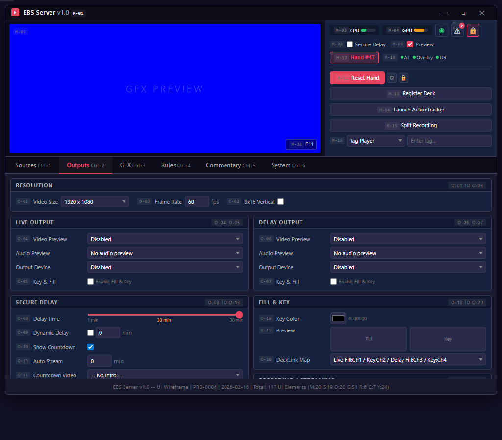
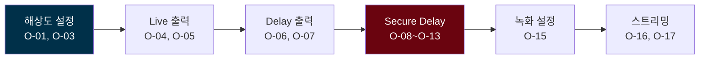

# Outputs Tab -- Screen Specification

## Quick Reference

- 단축키: Ctrl+2
- 요소: 20개 (P0: 8, P1: 4, P2: 8)
- 스크린샷: `images/mockups/ebs-outputs.png`
- HTML 원본: [ebs-server-ui.html](../mockups/ebs-server-ui.html)

## Design Decisions

1. Live/Delay가 독립 파이프라인인 이유: Dual Canvas Architecture의 핵심이다. Live 출력은 운영자가 즉시 확인하는 채널이고, Delay 출력은 시청자에게 지연 전송되는 채널이다. 두 파이프라인의 장치, 해상도, 프레임레이트가 독립적이어야 Hidden Information Problem을 하드웨어 수준에서 해결할 수 있다.

2. Fill & Key 채널 매핑(O-05, O-07, O-20)이 P0인 이유: Fill(RGB)과 Key(Alpha)는 DeckLink 카드의 물리적 SDI/HDMI 포트에 매핑되어야 한다. Live Fill/Key + Delay Fill/Key = 최소 4개 채널이며, 포트 할당 오류는 방송 화면 깨짐으로 직결된다.

3. Secure Delay 설정(O-08~O-13)이 이 탭에 있는 이유: Secure Delay는 Delay 파이프라인의 버퍼 시간을 제어한다. 출력 장치 설정과 함께 있어야 운영자가 "어디로(장치) + 언제(딜레이)" 를 한 화면에서 결정할 수 있다. 메인 윈도우의 M-08은 On/Off 토글만 제공하고, 상세 시간 설정은 이 탭에서 한다.

## Workflow

## Element Catalog

| # | 그룹 | 요소 | 설명 | PGX# | 우선순위 |
|:-:|------|------|------|:----:|:--------:|
| O-01 | Resolution | Video Size | 1080p/4K 출력 해상도 | #1 | P0 |
| O-02 | Resolution | 9x16 Vertical | 세로 모드 (모바일) | #2 | P2 |
| O-03 | Resolution | Frame Rate | 30/60fps | #3 | P0 |
| O-04 | Live | Video/Audio/Device | Live 파이프라인 3개 드롭다운 | #4 | P0 |
| O-05 | Live | Key & Fill | Live Fill & Key 출력 (DeckLink 채널 할당) | #4 | P0 |
| O-06 | Delay | Video/Audio/Device | Delay 파이프라인 (Live와 독립) | #5 | P0 |
| O-07 | Delay | Key & Fill | Delay Fill & Key 출력 (DeckLink 채널 할당) | #5 | P0 |
| O-08 | Secure Delay | Delay Time | 1~30분 (기본 30분) | #8 | P0 |
| O-09 | Secure Delay | Dynamic Delay | 상황별 자동 조절 | #9 | P1 |
| O-10 | Secure Delay | Show Countdown | 카운트다운 표시 | #11 | P1 |
| O-11 | Secure Delay | Countdown Video | 종료 시 재생 영상 | #12 | P2 |
| O-12 | Secure Delay | Countdown Background | 배경 이미지 | #12 | P2 |
| O-13 | Secure Delay | Auto Stream | 지정 시간 후 자동 시작 | #10 | P2 |
| O-14 | Virtual | Camera | 가상 카메라 (OBS 연동) | #6 | P2 |
| O-15 | Recording | Mode | Video / Video+GFX / GFX only | #7 | P1 |
| O-16 | Streaming | Platform | Twitch/YouTube/Custom RTMP | #13 | P2 |
| O-17 | Streaming | Account Connect | OAuth 연결 | #13 | P2 |
| O-18 | Fill & Key | Key Color | Key 신호 배경색 (기본: #FF000000) | 신규 | P0 |
| O-19 | Fill & Key | Fill/Key Preview | Fill 신호와 Key 신호 나란히 미리보기 | 신규 | P1 |
| O-20 | Fill & Key | DeckLink Channel Map | Live Fill/Key + Delay Fill/Key → DeckLink 포트 매핑 | 신규 | P0 |

## Interaction Patterns

| 조작 | 시스템 반응 | 피드백 |
|------|-----------|--------|
| O-08 딜레이 시간 변경 | Delay 버퍼 리사이징 | Main > M-10 프로그레스바 갱신 |
| O-04 Live 장치 변경 | 즉시 출력 전환 | Preview 갱신 |
| O-01 해상도 변경 | 전체 파이프라인 재초기화 | 잠시 Preview 블랙아웃 후 복구 |

## Navigation

| 목적지 | 방법 | 조건 |
|--------|------|------|
| GFX 탭 | Ctrl+3 | 출력 설정 후 그래픽 조정 |
| Main Window | 탭 영역 외 클릭 | Secure Delay 확인 후 |
