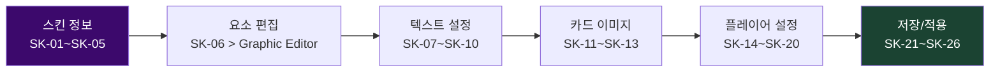

# Skin Editor -- Screen Specification

## Quick Reference

- 단축키: 없음 (별도 창)
- 요소: 26개 (P0: 0, P1: 21, P2: 5)
- 스크린샷: `images/mockups/ebs-skin-editor.png`
- HTML 원본: [ebs-skin-editor.html](../mockups/ebs-skin-editor.html)

## Design Decisions

1. 에디터 계층 구조 (GFX → Skin → Graphic)가 존재하는 이유: GFX 탭은 "무엇을 어디에 표시할지" 런타임 설정이다. Skin Editor는 "어떤 시각적 테마로" 표현할지 정의한다. Graphic Editor는 "개별 요소를 픽셀 단위로" 편집한다. 이 3단계 계층은 변경 빈도에 따라 분리되었다: GFX는 방송마다, Skin은 시즌마다, Graphic은 디자인 변경 시에만 접근한다.

2. 별도 창인 이유: Skin 편집은 실시간 프리뷰가 필수이며 작업 시간이 길다. 메인 윈도우의 Preview Panel과 독립적으로 프리뷰를 제공하면서, 편집이 끝나면 즉시 적용(SK-26 Use)하는 워크플로우를 지원한다. 방송 중에는 이 창을 열지 않는 운영 관행을 강화한다.

3. Import/Export/Download(SK-21~SK-23)를 분리한 이유: 스킨은 팀 간 공유 자산이다. Import/Export로 파일 기반 교환을 지원하고, Download로 온라인 스킨 리포지토리에서 가져올 수 있다. Reset(SK-24)은 실수로 변경한 스킨을 기본값으로 복구한다.

## Workflow

## Element Catalog

| # | 그룹 | 요소 | 설명 | PGX# | 우선순위 |
|:-:|------|------|------|:----:|:--------:|
| SK-01 | Info | Name | 스킨 이름 | #1 | P1 |
| SK-02 | Info | Details | 설명 텍스트 | #2 | P1 |
| SK-03 | Info | Remove Transparency | 크로마키 투명도 제거 | #3 | P1 |
| SK-04 | Info | 4K Design | 4K 전용 체크 | #4 | P1 |
| SK-05 | Info | Adjust Size | 크기 슬라이더 | #5 | P2 |
| SK-06 | Elements | 10 Buttons | Strip~Field 각 요소 → Graphic Editor | #6-15 | P1 |
| SK-07 | Text | All Caps | 대문자 변환 | #16 | P1 |
| SK-08 | Text | Reveal Speed | 텍스트 등장 속도 | #17 | P1 |
| SK-09 | Text | Font 1/2 | 1차/2차 폰트 | #18,19 | P1 |
| SK-10 | Text | Language | 다국어 설정 | #20 | P1 |
| SK-11 | Cards | Card Preview | 4수트 + 뒷면 미리보기 | #21 | P1 |
| SK-12 | Cards | Add/Replace/Delete | 카드 이미지 관리 | #22 | P1 |
| SK-13 | Cards | Import Card Back | 뒷면 이미지 | #23 | P1 |
| SK-14 | Player | Variant | 게임 타입 선택 | #27 | P1 |
| SK-15 | Player | Player Set | 게임별 세트 | #28 | P1 |
| SK-16 | Player | Edit/New/Delete | 세트 관리 | #30 | P1 |
| SK-17 | Player | Crop to Circle | 원형 크롭 | #31 | P1 |
| SK-18 | Player | Country Flag | 국기 모드 | #24 | P2 |
| SK-19 | Player | Edit Flags | 국기 이미지 편집 | #25 | P2 |
| SK-20 | Player | Hide Flag After | 자동 숨김 (초) | #26 | P2 |
| SK-21 | Actions | Import | 스킨 가져오기 | #32 | P1 |
| SK-22 | Actions | Export | 스킨 내보내기 | #33 | P1 |
| SK-23 | Actions | Download | 온라인 다운로드 | #34 | P2 |
| SK-24 | Actions | Reset | 기본 초기화 | #35 | P1 |
| SK-25 | Actions | Discard | 변경 취소 | #36 | P1 |
| SK-26 | Actions | Use | 현재 적용 | #37 | P1 |

## Navigation

| 목적지 | 방법 | 조건 |
|--------|------|------|
| Graphic Editor | SK-06 요소 버튼 클릭 | 별도 창 열림 |
| GFX 탭 | 창 닫기 | SK-26 Use 후 |
