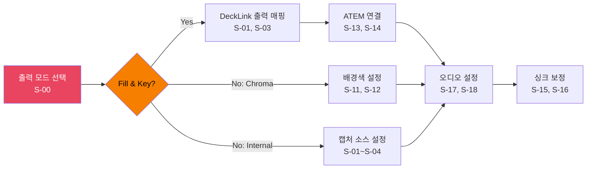

# Sources Tab -- Screen Specification

## Quick Reference

- 단축키: Ctrl+1
- 요소: 19개 (P0: 6, P1: 13, P2: 0)
- 스크린샷: `images/mockups/ebs-sources.png`
- HTML 원본: [ebs-server-ui.html](../mockups/ebs-server-ui.html)

## Design Decisions

1. Output Mode Selector(S-00)가 첫 번째인 이유: Fill & Key / Chroma Key / Internal 모드 선택이 나머지 모든 요소의 가시성과 필수 여부를 결정한다. Fill & Key 모드에서만 ATEM 설정(S-13, S-14)이 필요하고, Chroma Key 모드에서만 배경색 설정(S-11, S-12)이 활성화된다. 모드를 먼저 결정해야 불필요한 설정 노출을 방지할 수 있다.

2. ATEM Control(S-13, S-14)이 Fill & Key 전용인 이유: Fill & Key 모드에서 GFX Server는 Fill(RGB) + Key(Alpha) 신호 쌍을 DeckLink으로 출력하고, 외부 ATEM 스위처의 DSK가 이를 카메라 위에 합성한다. Chroma Key나 Internal 모드에서는 스위처가 불필요하므로 ATEM 설정을 노출하면 혼란만 가중된다.

3. Audio(S-17, S-18)가 모든 모드에서 공통인 이유: 오디오 소스와 싱크 보정은 출력 모드와 무관하게 항상 필요하다. 모드별로 분리하면 동일 설정을 3번 반복해야 하므로 공통 영역에 배치했다.

## Workflow

## Element Catalog

| # | 그룹 | 요소 | 타입 | 설명 | PGX# | 우선순위 |
|:-:|------|------|------|------|:----:|:--------:|
| S-00 | Output Mode | Mode Selector | RadioGroup | Fill & Key / Chroma Key / Internal (기본: Fill & Key) | 신규 | P0 |
| S-01 | Video Sources | Device Table | DataTable | NDI, 캡처 카드, 네트워크 카메라 목록 | #2 | P0 |
| S-02 | Video Sources | Add Button | TextButton | NDI 자동 탐색 또는 수동 URL | #8 | P1 |
| S-03 | Video Sources | Settings | IconButton | 해상도, 프레임레이트, 크롭 | #2 | P1 |
| S-04 | Video Sources | Preview | IconButton | 소스별 미니 프리뷰 | #2 | P1 |
| S-05 | Camera | Board Cam Hide GFX | Checkbox | 보드 카메라 시 GFX 자동 숨기기 | #3 | P1 |
| S-06 | Camera | Auto Camera Control | Checkbox | 게임 상태 기반 자동 전환 | #3 | P1 |
| S-07 | Camera | Mode | Dropdown | Static / Dynamic | #4 | P1 |
| S-08 | Camera | Heads Up Split | Checkbox | 헤즈업 화면 분할 | #5 | P1 |
| S-09 | Camera | Follow Players | Checkbox | 플레이어 추적 | #5 | P1 |
| S-10 | Camera | Follow Board | Checkbox | 보드 추적 | #5 | P1 |
| S-11 | Background | Enable | Checkbox | 크로마키 활성화 | #7 | P0 |
| S-12 | Background | Background Colour | ColorPicker | 배경색 (기본 Blue) | #7 | P0 |
| S-13 | External | Switcher Source | Dropdown | ATEM 스위처 연결 (Fill & Key 필수) | #10 | P0 |
| S-14 | External | ATEM Control | Checkbox + TextField | ATEM IP + 연결 상태 (Fill & Key 필수) | #10 | P0 |
| S-15 | Sync | Board Sync | NumberInput | 보드 싱크 보정 (ms) | #11 | P1 |
| S-16 | Sync | Crossfade | NumberInput | 크로스페이드 (ms, 기본 300) | #11 | P1 |
| S-17 | Audio | Input Source | Dropdown | 오디오 소스 선택 | #9 | P1 |
| S-18 | Audio | Audio Sync | NumberInput | 오디오 싱크 보정 (ms) | #9 | P1 |

## Interaction Patterns

| 조작 | 시스템 반응 | 피드백 |
|------|-----------|--------|
| S-02 Add 클릭 | NDI 자동 탐색 시작 | 발견된 소스 목록 팝업 |
| S-11 Chroma Key 토글 | Preview에 크로마키 즉시 반영 | 배경색 변화 |
| S-14 ATEM IP 입력 | 연결 시도 + 상태 표시 | Green/Red 아이콘 |

## Navigation

| 목적지 | 방법 | 조건 |
|--------|------|------|
| Main Window | 탭 영역 외 클릭 | 언제든 |
| Outputs 탭 | Ctrl+2 | 비디오 소스 설정 완료 후 자연스러운 다음 단계 |
