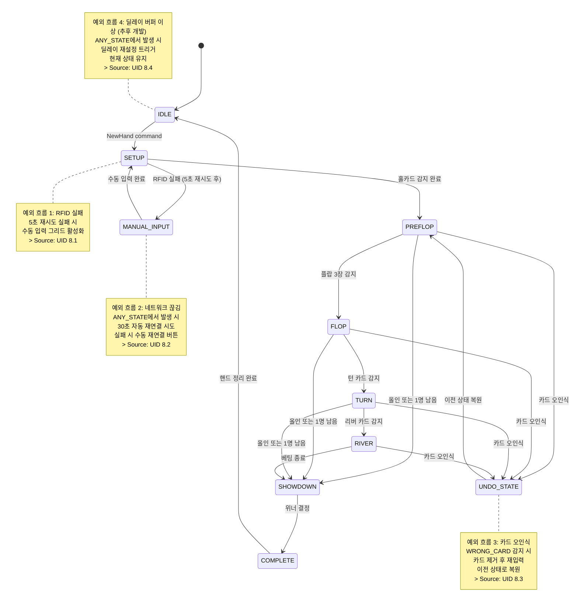

# PRD-0004: EBS Server 기술 명세서

> 이 문서는 EBS Server의 기술 상세를 다룬다.
> 시스템 개요, 핵심 개념, 사용법은 [기획서](PRD-0004-EBS-Server-UI-Design.md)를 먼저 읽어야 한다.
> 각 화면의 상세 요소 사양은 [PRD-0004-EBS-Server-UI-Design.md](PRD-0004-EBS-Server-UI-Design.md) 2~9장에 있다.

---

## 1장: 카드 상세 (Card System)

> 이 장은 RFID 카드 인식 시스템의 기술 구조를 다룬다.

### 1.1 카드 구조

54장 카드 (52장 + 조커 2장)로 구성된다.

| 속성 | 값 범위 | 설명 |
|------|---------|------|
| suit | 0-3 | 0=Club, 1=Diamond, 2=Heart, 3=Spade |
| rank | 0-12 | 0=2, 1=3, ..., 8=10, 9=J, 10=Q, 11=K, 12=A |
| display | 문자열 | 표시용 문자열 (예: "As", "Kh", "2c") |
| value | 정수 | 내부 정렬용 수치 |
| uid | 문자열 (NULL 가능) | RFID 태그 고유 식별자. 초기 NULL이며, 덱 등록 시 매핑 |

> Source: PRD 5.1-5.6 / cards DB 스키마 (server/db/init.sql)

### 1.2 pip_element (12개 필드)

pip_element는 카드를 화면에 렌더링하는 그래픽 요소이다. 카드 한 장의 시각적 표현을 담당한다.

> Source: PRD 7.6

| 필드 | 타입 | 설명 |
|------|------|------|
| x, y | float | 위치 |
| size | float | 크기 |
| suit | int | 문양 (0=Club, 1=Diamond, 2=Heart, 3=Spade) |
| rank | int | 숫자 (0=2, 12=A) |
| face_up | bool | 앞면/뒷면 |
| highlighted | bool | 강조 표시 |
| animation_state | AnimationState | 애니메이션 (16값 enum, [3장 3.10절](#310-animationstate-enum-16개-상태) 참조) |

### 1.3 덱 등록 프로세스

52장 카드의 UID를 RFID 태그에 매핑하는 과정이다. Main Window > M-13 (Register Deck)에서 수행한다.

**등록 흐름**:
1. 운영자가 F7 또는 M-13 버튼으로 덱 등록 시작
2. 52장 순서대로 카드 배치 → 안테나 감지 → UID 읽기 → DB 매핑
3. 진행 표시: 1/52 ~ 52/52 카운트
4. 52장 완료 시 등록 확정

**RFID 인식 흐름**: 카드 배치 → 안테나 감지 → UID 읽기 → DB 매핑 → 다음 카드 대기

> 화면 상세는 [기획서 섹션 15](PRD-0004-EBS-Server-UI-Design.md#15-방송-준비-프로세스) 참조 (통합 점검 단계 8)

### 1.4 카드 오인식 처리

**RFID 인식 실패**: 5초 재시도 → 실패 시 수동 입력 그리드 52장 활성화

**잘못된 카드 (WRONG_CARD)**: AT에서 해당 좌석 빨간 테두리 + "WRONG CARD" 경고 → AT UNDO → 카드 제거 후 재입력

> Source: UID 8.1, 8.3

---

## 2장: 게임 상세 (Game Engine)

> 이 장은 22개 포커 게임 변형과 게임 상태 머신을 다룬다.

### 2.1 game enum (22개 값)

> Source: PRD 5.1-5.6

| enum | 게임명 | 계열 | 홀카드 수 | 특수 규칙 |
|:----:|--------|------|:---------:|----------|
| 0 | Texas Hold'em | Community | 2 | 표준 |
| 1 | 6+ Hold'em (Straight > Trips) | Community | 2 | 2-5 제거 |
| 2 | 6+ Hold'em (Trips > Straight) | Community | 2 | 2-5 제거 |
| 3 | Pineapple | Community | 3 → 2 | Flop 전 1장 버림 |
| 4 | Omaha | Community | 4 | 홀카드 2장 + 보드 3장 필수 |
| 5 | Omaha Hi-Lo | Community | 4 | Hi/Lo 분할 |
| 6 | Five Card Omaha | Community | 5 | 홀카드 2장 + 보드 3장 필수 |
| 7 | Five Card Omaha Hi-Lo | Community | 5 | Hi/Lo |
| 8 | Six Card Omaha | Community | 6 | 홀카드 2장 + 보드 3장 필수 |
| 9 | Six Card Omaha Hi-Lo | Community | 6 | Hi/Lo |
| 10 | Courchevel | Community | 5 | 첫 Flop 카드 미리 공개 |
| 11 | Courchevel Hi-Lo | Community | 5 | Hi/Lo + 미리 공개 |
| 12 | Five Card Draw | Draw | 5 | 1회 교환 |
| 13 | 2-7 Single Draw | Draw | 5 | Lowball, 1회 교환 |
| 14 | 2-7 Triple Draw | Draw | 5 | Lowball, 3회 교환 |
| 15 | A-5 Triple Draw | Draw | 5 | A-5 Lowball, 3회 교환 |
| 16 | Badugi | Draw | 4 | 4장 Lowball |
| 17 | Badeucy | Draw | 5 | Badugi + 2-7 혼합 |
| 18 | Badacey | Draw | 5 | Badugi + A-5 혼합 |
| 19 | 7-Card Stud | Stud | 7 | 3 down + 4 up |
| 20 | 7-Card Stud Hi-Lo | Stud | 7 | Hi/Lo |
| 21 | Razz | Stud | 7 | A-5 Lowball Stud |

### 2.2 game_class enum (3개 계열)

| enum | 이름 | 게임 수 | 보드 | 특징 |
|:----:|------|:-------:|:---:|------|
| 0 | flop | 12 | O | Community Card (Flop/Turn/River) |
| 1 | draw | 6 | X | Draw (교환) |
| 2 | stud | 3 | X | Stud (개인 카드) |

### 2.3 BetStructure enum (3가지)

| enum | 이름 | 설명 |
|:----:|------|------|
| 0 | NoLimit | 무제한 레이즈 |
| 1 | FixedLimit | 고정 베팅 단위 |
| 2 | PotLimit | 팟 크기 제한 레이즈 |

### 2.4 AnteType enum (7가지)

| enum | 이름 | 설명 |
|:----:|------|------|
| 0 | std_ante | 표준 앤티 — 모든 플레이어 동일 금액 |
| 1 | button_ante | 버튼 앤티 — 딜러만 납부 |
| 2 | bb_ante | 빅블라인드 앤티 |
| 3 | bb_ante_bb1st | BB 앤티 (BB 먼저) |
| 4 | live_ante | 라이브 앤티 |
| 5 | tb_ante | Third Blind 앤티 |
| 6 | tb_ante_tb1st | TB 앤티 (TB 먼저) |

### 2.5 게임 상태 머신

EBS Server의 핵심은 게임 상태 머신이다. 모든 UI 갱신은 상태 전이에 의해 트리거된다.

> Source: PRD 5.1-5.6

**Community Card 계열 (Flop) 상태 흐름**:

```
IDLE → SETUP_HAND → PRE_FLOP → FLOP → TURN → RIVER → SHOWDOWN → HAND_COMPLETE → IDLE
                                                  ↑
                                      [run_it_times > 1] → RUN_IT_TWICE
```

**Draw 계열 분기**: PRE_FLOP 대신 DRAW_ROUND로 진입. `draws_completed`가 최대 교환 횟수에 도달할 때까지 교환 + 베팅 반복. 보드 카드 없음.

**Stud 계열 분기**: PRE_FLOP → THIRD_STREET → FOURTH → FIFTH → SIXTH → SEVENTH. 보드 카드 없음, 각 라운드마다 개인 카드 추가.

**전체 상태 전이 다이어그램** (예외 흐름 포함):



### 2.6 상태별 UI 변화 상세

각 게임 상태에서 Preview Panel, Control Panel, 자동 트리거를 명시한다.

| 상태 | Preview Panel | Control Panel | 자동 트리거 |
|------|--------------|---------------|-------------|
| IDLE | 리더보드 / 스폰서 로고 / 대기 화면 | 다음 핸드 대기, 설정 변경 가능 | G-22 리더보드, G-24 통계 티커 |
| SETUP | 초기화, Hand# 표시 (M-17) | Reset Hand (M-11) 활성 | M-17 카운터 증가 |
| PREFLOP | 홀카드 렌더링 + Equity 바 | AT 액션 입력 대기 | G-37 Equity 계산, G-14 카드 공개 |
| FLOP | 보드 3장 + Equity 재계산 + Outs | AT 액션 입력 대기 | G-40 Outs 표시, Equity 갱신 |
| TURN | 보드 4장 + Equity 갱신 + Outs 갱신 | AT 액션 입력 대기 | Equity 재계산 |
| RIVER | 보드 5장 + 최종 Equity | 쇼다운 대기 | 최종 승률 확정 |
| SHOWDOWN | 위닝 핸드 강조 (G-38) + All-in 애니메이션 | 핸드 종료 처리 | G-38 강조, EQ-012 애니메이션 |
| COMPLETE | 리더보드 전환 | 통계 갱신 확인 | 히스토리 저장, 통계 갱신 |
| **RFID_FAIL** | 경고 아이콘 점멸 | 수동 입력 그리드 52장 활성 | M-05 RFID 상태 Red |
| **NET_DISCONNECT** | 연결 끊김 배너 | 자동 재연결 카운트다운 + 수동 버튼 | M-18 Red |
| **WRONG_CARD** | 오인식 경고 | UNDO + 카드 제거 안내 | 카드 슬롯 Red 강조 |
| **DELAY_ERROR** | 딜레이 상태 경고 *(추후 개발)* | 딜레이 재설정 버튼 *(추후 개발)* | M-10 Progress Red |

> **추후 개발**: DELAY_ERROR 상태 및 딜레이 재설정 기능은 Delay 출력 기능 구현 시 추가된다.

### 2.7 Dual Canvas 상태 대비

> Viewer Overlay의 Dual Canvas 비교는 [3장 3.11.2절](#3112-dual-canvas-비교) 참조.

Venue Canvas와 Broadcast Canvas는 동일 게임 상태에서 다르게 동작한다.

| 게임 상태 | Venue Canvas (운영자) | Broadcast Canvas (방송) |
|-----------|---------------------|---------------------|
| PREFLOP | 홀카드 즉시 표시 + Equity | 홀카드 숨김 (Trustless) |
| FLOP~RIVER | 보드 카드 즉시 + Equity | 보드 카드는 표시, 홀카드 계속 숨김 |
| SHOWDOWN | 위닝 핸드 즉시 강조 | 즉시 표시 — 카드가 물리적으로 공개된 상태이므로 지연 불필요 |
| IDLE | 리더보드 즉시 | 즉시 표시 — 숨길 정보 없음 |
| **RFID_FAIL** | 수동 입력 그리드 즉시 표시 | 로딩 인디케이터 (카드 대기 중) |
| **NET_DISCONNECT** | 재연결 UI 즉시 표시 | 지연 버퍼 소진 시 "연결 끊김" 자막 |
| **WRONG_CARD** | 오류 카드 Red 강조 | 변경 전 카드 유지 (오류 전파 방지) |
| **DELAY_ERROR** | 딜레이 상태 경고 표시 *(추후 개발)* | 방송 일시 중단 또는 대체 화면 *(추후 개발)* |

### 2.8 AT 상태별 버튼 활성화

> Source: UID 4.3

**게임 상태별 활성 버튼**:

| 상태 | 활성 버튼 | 비활성 버튼 |
|------|----------|-----------|
| **New Hand 대기** | New Hand | 모든 액션 버튼 |
| **카드 딜 중** | (자동 진행, 버튼 없음) | -- |
| **Pre-Flop 베팅** | Fold, Check/Call, Bet/Raise, All-In | New Hand, Showdown |
| **Flop 베팅** | Fold, Check/Call, Bet/Raise, All-In | New Hand, Showdown |
| **Turn 베팅** | Fold, Check/Call, Bet/Raise, All-In | New Hand, Showdown |
| **River 베팅** | Fold, Check/Call, Bet/Raise, All-In | New Hand, Showdown |
| **Showdown** | Show, Muck | Fold, Bet, Raise |
| **Hand 종료** | New Hand, TAG HAND | 모든 액션 버튼 |

**베팅 라운드 액션 버튼 활성화 조건**:

| 버튼 | 활성화 조건 | 비활성화 조건 |
|------|-----------|-------------|
| **FOLD** | 상대방이 베팅한 경우 | All-in 플레이어 |
| **CHECK** | 액션이 자신에게 왔고, Call 금액이 0일 때 | 상대방이 베팅한 경우 |
| **CALL** | 상대방이 베팅한 경우 | 액션이 없거나 All-in 상태 |
| **BET** | 현재 라운드에서 첫 베팅 | 이미 베팅이 있거나 All-in |
| **RAISE** | 상대방의 베팅이 있고, 스택이 충분할 때 | 스택 부족 또는 All-in |
| **ALL-IN** | 항상 (스택이 남은 경우) | 이미 All-in 상태 |

---

## 3장: 그래픽 상세 (Graphics Pipeline)

> 이 장은 GPU 렌더링 파이프라인과 방송 오버레이 시스템을 다룬다.

### 3.1 GPU 렌더링 파이프라인 개요

> Source: PRD 7.1-7.3 / RE 7장

mmr.dll은 DirectX 11 기반 실시간 비디오 합성 엔진이다. Medialooks MFormats SDK를 래핑하여 비디오 캡처, 믹싱, 렌더링, 녹화를 수행한다.

### 3.2 mixer 클래스: 5-Thread Producer-Consumer 구조

mixer는 mmr.dll의 핵심 클래스로, 90개 필드와 5개 워커 스레드를 관리한다.

| 스레드 | 역할 | 입력 큐 | 출력 |
|--------|------|---------|------|
| **thread_worker** | 메인 라이브 프레임 처리 | `live_frames` | `canvas_live` → `on_frame` |
| **thread_worker_audio** | 오디오 프레임 처리 | `are_audio` | `ext_audio_buffer` |
| **thread_worker_delayed** | 딜레이 프레임 처리 *(추후 개발)* | `delayed_frames` | `canvas_delayed` → `on_frame` |
| **thread_worker_write** | 녹화 파일 쓰기 | `write_frames` | `MFWriterClass` |
| **thread_worker_process_delay** | 딜레이 버퍼 처리 *(추후 개발)* | `MDelayClass` 내부 | `delayed_frames` 큐 |

> **추후 개발**: `thread_worker_delayed`와 `thread_worker_process_delay`는 Delay 출력 기능 구현 시 활성화된다. PokerGFX 역설계 기준으로 구조는 파악되어 있으나, EBS Phase 1에서는 Live 출력만 구현한다.

**데이터 흐름**:
```
[Video Input]
    ↓
[live_frames Queue] → thread_worker → [canvas_live] → [Live Output]
    ↓ (Copy) ← 추후 개발
[sync_frames Queue] → thread_worker_process_delay
    ↓
[MDelayClass: N초 버퍼링]
    ↓
[delayed_frames Queue] → thread_worker_delayed → [canvas_delayed] → [Delayed Output]
```

### 3.3 Dual Canvas System 기술 구현

mixer는 Venue와 Broadcast 두 개의 독립 캔버스를 동시 운영한다.

> **추후 개발**: Broadcast Canvas (`canvas_delayed`) 기반의 딜레이 출력은 추후 개발 대상이다. EBS Phase 1에서는 `canvas_live` (Venue Canvas) 기반 Live 출력만 구현한다.

| Canvas | 코드명 | 용도 | 타임시프트 | 출력 |
|--------|--------|------|-----------|------|
| **Venue Canvas** | `canvas_live` | 현장 모니터 + 운영자 확인 | 0초 | NDI/SRT/BMD 라이브 스트림 |
| **Broadcast Canvas** | `canvas_delayed` | 시청자 방송용 *(추후 개발)* | `_delay_period` | 딜레이 출력 (보통 30초~3분) *(추후 개발)* |

**동기화 옵션** *(추후 개발)*:
- `_sync_live_delay`: true이면 Venue/Broadcast 프레임 동기화
- `delay_modes` enum: `Buffer` (메모리 버퍼) vs `File` (디스크 임시 파일)

**UI 영향**:
- Server UI에서 Venue 출력 상태를 모니터링 (프레임 큐 길이, FPS)
- Broadcast(딜레이) 출력 모니터링은 추후 개발
- `timeshift` enum (`Live`=Venue / `Delayed`=Broadcast): Delayed 선택은 추후 개발
- `record` enum (None/Live/Delayed/Both): Delayed/Both 녹화 옵션은 추후 개발

> Dual Canvas의 개념적 설명은 [기획서 섹션 5](PRD-0004-EBS-Server-UI-Design.md#5-정보-보안-경계) 참조

### 3.4 canvas 클래스 (DirectX 11 렌더링)

각 canvas는 독립 DirectX 11 컨텍스트로, 4개 그래픽 레이어를 Z-order 순으로 렌더링한다.

**렌더링 파이프라인**:
```
begin_render()
  ├─ dc.BeginDraw()
  ├─ dc.Clear(_background_colour)  ← Alpha=1, RGB=0 (투명 흑)
  ├─ [Z-order 순 렌더링]
  │   ├─ image_elements (이미지)
  │   ├─ text_elements (텍스트)
  │   ├─ pip_elements (PIP 영상)
  │   └─ border_elements (테두리)
  ├─ dc.EndDraw()
  └─ Texture2D → MFFrame 변환
end_render()
```

### 3.5 4가지 그래픽 요소 타입

> Source: PRD 7.6

canvas는 4종류의 그래픽 요소를 지원한다. 각 요소는 독립 리스트로 관리되며 Z-order에 따라 렌더링된다.

| 타입 | 필드 수 | 용도 |
|------|:-------:|------|
| image_element | 41 | 이미지 (카드 배경, 로고, 아이콘 등) |
| text_element | 52 | 텍스트 (플레이어명, 스택, 승률 등) |
| pip_element | 12 | PIP 영상 (카드 렌더링) |
| border_element | 8 | 테두리 (플레이어 박스, 강조 표시) |

### 3.6 image_element (41개 필드)

| 필드 카테고리 | 핵심 필드 | 타입 |
|--------------|----------|------|
| **위치/크기** | x, y, width, height | float |
| **소스** | source_path | string |
| **가시성** | visible, opacity | bool, float (0-1) |
| **변형** | rotation, flip_h, flip_v | float, bool |
| **렌더링** | z_order, crop_rect | int, Rect |
| **색상 효과** | tint_color | Color |
| **그림자** | shadow_offset, shadow_blur, shadow_color | Vector2, float, Color |
| **애니메이션** | animation_state | AnimationState (16값 enum) |

### 3.7 text_element (52개 필드)

| 필드 카테고리 | 핵심 필드 | 타입 |
|--------------|----------|------|
| **위치/크기** | x, y, width, height | float |
| **텍스트** | text, word_wrap | string, bool |
| **폰트** | font_family, font_size, font_weight, font_color | string, float, FontWeight, Color |
| **정렬** | text_align, padding | TextAlignment, Thickness |
| **외곽선** | outline_color, outline_width | Color, float |
| **배경/그림자** | background_color, shadow_offset | Color, Vector2 |
| **애니메이션** | animation_state | AnimationState |

### 3.8 pip_element (12개 필드)

[1장 1.2절](#12-pip_element-12개-필드)과 동일 구조. 여기서는 그래픽 파이프라인 관점에서의 역할을 기술한다.

pip_element는 canvas의 4가지 그래픽 요소 중 하나로, 카드 이미지를 렌더링한다. suit/rank 조합으로 스킨의 카드 이미지를 참조하고, face_up으로 앞면/뒷면을 결정하며, highlighted로 승자 카드를 강조한다. animation_state로 카드 공개/숨김/리셋 애니메이션을 제어한다.

### 3.9 border_element (8개 필드)

x, y, width, height, color, thickness, corner_radius, visible

플레이어 박스 테두리, 현재 턴 강조, 승자 하이라이트 등에 사용된다.

### 3.10 AnimationState enum (16개 상태)

| enum 값 | 이름 | 용도 |
|:-------:|------|------|
| 0 | FadeIn | 페이드인 등장 |
| 1 | Glint | 반짝임 |
| 2 | GlintGrow | 반짝이며 확대 |
| 3 | GlintRotateFront | 반짝이며 앞면 회전 |
| 4 | GlintShrink | 반짝이며 축소 |
| 5 | PreStart | 시작 대기 |
| 6 | ResetRotateBack | 리셋 + 뒷면 회전 |
| 7 | ResetRotateFront | 리셋 + 앞면 회전 |
| 8 | Resetting | 리셋 중 |
| 9 | RotateBack | 뒷면 회전 |
| 10 | Scale | 크기 변경 |
| 11 | SlideAndDarken | 슬라이드 + 어두워짐 |
| 12 | SlideDownRotateBack | 아래로 슬라이드 + 뒷면 회전 |
| 13 | SlideUp | 위로 슬라이드 |
| 14 | Stop | 정지 |
| 15 | Waiting | 대기 |

### 3.11 Viewer Overlay 상세 명세

> 11개 오버레이 구성 요소와 정보 계층 설계는 [기획서 Part VI](PRD-0004-EBS-Server-UI-Design.md#part-vi-viewer-overlay-명세) 참조

#### 3.11.1 요소별 표시 조건

> Source: UID 5.2

| 요소 | 위치 | 계층 | 표시 조건 | Broadcast | Venue |
|------|------|:----:|----------|:---------:|:-----:|
| 플레이어 홀카드 | 각 플레이어 근처 | 1차 | Showdown 전까지 숨김 (Venue) | 공개 | 숨김 |
| 승률 (Equity) | 홀카드 옆 | 1차 | 2인 이상 활성 플레이어 | 표시 | 숨김 |
| 팟 사이즈 | 보드 상단 | 2차 | 항상 | 표시 | 표시 |
| 베팅 액션 | 현재 플레이어 | 2차 | 액션 발생 시 (1.5초 후 Fade) | 표시 | 표시 |
| 보드 카드 | 화면 중앙/우측 | 2차 | Flop 이후 | 표시 | 표시 |
| 플레이어 이름/칩 | 각 플레이어 하단 | 2차 | 항상 | 표시 | 표시 |
| 이벤트명/블라인드 | 상단 중앙 | 3차 | 항상 | 표시 | 표시 |
| 핸드 번호 | 블라인드 우측 | 3차 | "Show hand # with blinds" 체크 시 | 표시 | 표시 |
| 로고 | 상단/하단 코너 | 3차 | 항상 | 표시 | 표시 |
| 폴드 표시 | 폴드 플레이어 | -- | 폴드 시 회색 처리 | 표시 | 표시 |
| 리더보드 | 좌/중/우측 | 2차 | 핸드 사이 또는 수동 트리거 | 표시 | 표시 |
| 스트립 | 화면 하단 | 2차 | Score Strip 설정 | 표시 | 표시 |
| 액션 클락 | 현재 플레이어 | 1차 | 10초 이하 | 표시 | 표시 |
| 티커 | 화면 하단 | 3차 | 핸드 종료 후 | 표시 | 표시 |

#### 3.11.2 Dual Canvas 비교

> Source: UID 5.3

| 구분 | Venue Canvas (현장용) | Broadcast Canvas (방송용) |
|------|---------------------|----------------------|
| **대상** | 현장 모니터, 스태프 | TV/스트림 시청자 |
| **홀카드** | 숨김 (Showdown 전까지) | 공개 (홀카드 + 승률) |
| **승률** | 표시 안 함 | 표시 |
| **보드 카드** | 즉시 표시 | 즉시 표시 |
| **보안** | Trustless Mode 적용 가능 | Security Delay Buffer 적용 가능 *(추후 개발)* |

**Trustless Mode**: Venue Canvas에 어떤 상황에서도 홀카드 미표시. 현장 대형 화면에서 상대방 카드 노출 원천 차단.

**Security Delay Buffer** *(추후 개발)*: Broadcast Canvas에만 적용. 30분 기본값. "Show Countdown" 체크 시 카운트다운 표시.

**Canvas 전환 시나리오**:

| 시나리오 | Venue Canvas | Broadcast Canvas |
|----------|-------------|------------------|
| Pre-Flop | 홀카드 숨김, 이름/스택만 | 홀카드 공개, 승률 표시 |
| Flop | 보드 카드 3장 표시 | 보드 카드 3장 + 승률 재계산 |
| All-in | 보드 카드 + 팟 | 홀카드 + 승률 바 확대 |
| Showdown | **홀카드 공개** (Venue도 표시) | 홀카드 + 승자 하이라이트 |

#### 3.11.3 게임 상태별 화면 변화

> Source: UID 5.4

| 상태 | 오버레이 변화 | 1차 요소 | 2차 요소 | 3차 요소 |
|------|-------------|---------|---------|---------|
| **Pre-Flop** | 홀카드 표시 (Broadcast만), 초기 승률 | 홀카드, 승률 | 팟(블라인드), 액션 | 이벤트명, 블라인드, 핸드# |
| **Flop** | 보드 3장 등장 (Pop 0.5초), 승률 재계산 | 홀카드, 승률 | 보드 3장, 팟 | 이벤트명, 블라인드 |
| **Turn** | 보드 1장 추가 (Slide 0.4초), 승률 변동 | 홀카드, 승률 | 보드 4장, 팟 | 이벤트명, 블라인드 |
| **River** | 보드 1장 추가, 승률 최종 확정 | 홀카드, 승률 | 보드 5장, 팟 | 이벤트명, 블라인드 |
| **All-in** | 승률 바 확대 표시 | **승률 바 확대**, 홀카드 | 보드, 팟 | 이벤트명, 블라인드 |
| **Showdown** | Venue에도 카드 공개, 승자 하이라이트 | 홀카드(전원), 승자 강조 | 보드, 팟 분배 | 이벤트명, 블라인드 |

**특수 상황 표시**:

| 상황 | 표시 변화 |
|------|---------|
| Chop | 팟 금액 여러 플레이어에 동시 이동, "CHOP" 텍스트 |
| Run It 2x | 보드 카드 영역 2개 분할, 보드별 승률 |
| Rabbit Hunting | 가상 카드 반투명 표시 ("Allow Rabbit Hunting" 체크 시) |
| Fold | 플레이어 박스 회색 처리 (설정에 따라 즉시 또는 1.5초 후) |
| Eliminated | 플레이어 박스 빨간 테두리, "ELIMINATED" 텍스트 |

---

## 4장: 프로토콜 상세 (Communication & Error Handling)

> 이 장은 앱 간 통신 프로토콜과 시스템 예외 처리를 다룬다.

### 4.1 앱 간 통신 구조

> Source: RE 3.6 / PRD 1.4

PokerGFX는 7개 애플리케이션으로 구성된 생태계이며, 각 앱은 독립 프로세스로 실행되어 GfxServer와 통신한다.

| ApplicationType | 통신 방식 | 상세 |
|-----------------|----------|------|
| **GfxServer** | -- | 메인 애플리케이션 (main_form, 329 메서드) |
| **ActionTracker** | Process IPC | 딜러 터치스크린 액션 추적 |
| **HandEvaluation** | DLL 직접 호출 | 핸드 평가 WCF 서비스 |
| **Pipcap** | net_conn TCP | 멀티테이블 PIP 캡처 |
| ~~ActionClock~~ | net_conn TCP | 배제 (WSOP+ 중복) |
| ~~StreamDeck~~ | net_conn TCP | 입력 옵션으로 재분류 |
| ~~CommentaryBooth~~ | net_conn TCP | 배제 (미사용) |

> 앱 생태계의 역할과 EBS 분류는 [기획서 섹션 8](PRD-0004-EBS-Server-UI-Design.md#8-앱-생태계) 참조

**Pipcap 상세**: 다른 GfxServer 인스턴스의 방송 출력을 TCP로 수신하여, 현재 서버의 화면에 작은 PIP 창으로 삽입하는 유틸리티 앱이다.
- 원격 GfxServer에 TCP 클라이언트로 연결
- 타이머 기반 폴링으로 원격 화면(remote_screen_delegate) 프레임 수신
- 수신된 프레임을 현재 서버의 pip_element로 렌더링

### 4.2 AT 통신 프로토콜

- TCP :8888 포트 연결
- 접속 조건: GfxServer System 탭에서 "Allow Action Tracker access" 체크 필수
- 서버의 "Launch Action Tracker" 버튼(M-14)으로 직접 실행 가능

**3가지 입력 방식** (Microsoft Surface SDK 기반):
| 입력 방식 | 장치 | 우선순위 |
|----------|------|:--------:|
| 키보드 | 표준 키보드 | 기본 |
| 마우스 | 표준 마우스 | 기본 |
| 터치 | 터치스크린/태블릿 | 기본 |

> Source: UID 4.1~4.2, decompiled comm.cs의 `touch_form`, `surface_poker` SDK 참조

### 4.3 GfxServer 에러 상태 (6유형)

> Source: UID 7.1, Part 8

| 에러 유형 | 시각적 표시 | 자동 복구 | 수동 개입 |
|----------|-----------|----------|----------|
| **RFID 인식 실패** | RFID 상태 그리드 빨간색, 5초 카운트다운 | 5초 재시도 | 수동 카드 입력 창 표시 (52장 그리드) |
| **네트워크 끊김** | 클라이언트 상태 회색, 재연결 아이콘 회전 | 30초 자동 재연결 (KeepAlive) | "수동 재연결" 버튼 활성화 |
| **잘못된 카드** | AT 해당 좌석 빨간 테두리, "WRONG CARD" 경고 | -- | 카드 제거 후 올바른 카드 재입력 |
| **서버 크래시** | 전체 다운, 자동 재시작 | GAME_SAVE 마지막 저장점 복원 | 복원 실패 시 수동 재입력 |
| **License 만료** | 시작 시 차단, 모달 다이얼로그 | -- | 라이선스 갱신 필수 |
| **GPU 과부하** | FPS 그래프 빨간색 (30fps 이하), 경고음 | -- | 해상도 낮춤 또는 GFX 숨김 |

**예외 복구 경로** (UID Part 8 기준):
- **RFID 인식 실패**: 카드 배치 → 미인식 (5초) → 재시도 → 실패 시 수동 입력 → 정상 복귀
- **네트워크 끊김**: TCP 끊김 감지 → 30초 재연결 → 실패 시 운영자 알림 + 수동 재연결 → 정상 복귀
- **서버 크래시**: 자동 재시작 → GAME_SAVE 복원 → 정상 복귀

### 4.4 GfxServer 로딩 상태 (6단계)

> Source: UID 7.2

| 로딩 단계 | 예상 시간 | UI 표시 | 프로그레스 형태 |
|----------|:--------:|---------|----------------|
| **서버 시작** | 3~5초 | "Checking License..." | 스피너 |
| **RFID 초기화** | 2~4초 | "Connecting RFID Readers... (0/12)" | 카운트 (N/12) |
| **Skin 로딩** | 1~3초 | "Loading Skin: [파일명]..." | 스피너 |
| **NDI 소스 검색** | 2~5초 | "Scanning NDI Sources..." | 스피너 |
| **테스트 스캔** | 0.2초 | "200ms OK" 또는 "FAIL" | 즉시 결과 표시 |
| **GAME_SAVE 복원** | 1~2초 | "Restoring... Hand #[번호]" | 프로그레스 바 |

**로딩 표시 기준**: 1초 미만 즉시 결과, 1초 이상 스피너/프로그레스 바, 5초 이상 카운트다운 또는 취소 버튼.

### 4.5 GfxServer 비활성 상태 (7조건)

> Source: UID 7.3

| 조건 | 비활성 요소 | 시각적 표시 | 이유 |
|------|-----------|-----------|------|
| 게임 진행 중 | 게임 시작 버튼 | 회색 처리 | 중복 시작 방지 |
| Auto 모드 활성 | 수동 카드 입력 | 회색, "Auto Mode ON" | RFID 우선 |
| Trustless Mode ON | Venue "Show Hole Cards" | 회색, 체크 불가 | 보안 정책 강제 |
| 에디터 빈 캔버스 | Properties 패널 | 회색, "No Element Selected" | 선택 없음 |
| 클라이언트 미연결 | AT 전송 버튼 | 회색, "No Client" | 전송 대상 없음 |
| RFID 오프라인 | Auto 모드 라디오 | 회색, "RFID Offline" | 하드웨어 장애 |
| License Basic | Advanced 기능 | 회색, "Upgrade to PRO" | 라이선스 제한 |

### 4.6 AT 에러/로딩/비활성 상태

> Source: UID 4.4

**AT 에러 상태 (4유형)**:

| 에러 유형 | 시각적 표시 | 자동 복구 | 수동 개입 |
|----------|-----------|----------|----------|
| RFID 인식 실패 | 해당 좌석 빨간색, 5초 카운트다운 | 5초 재시도 | 수동 카드 입력 창 자동 표시 |
| 네트워크 끊김 | 상단 연결 상태 회색, 재연결 아이콘 회전 | 30초 자동 재연결 | "수동 재연결" 버튼 |
| 잘못된 카드 | 해당 좌석 빨간 테두리, "WRONG CARD" | -- | 카드 제거 후 재입력 |
| 서버 크래시 | AT 전체 다운 | GAME_SAVE 자동 복원 | 복원 실패 시 수동 재입력 |

**AT 로딩 상태 (3단계)**:

| 로딩 단계 | 예상 시간 | UI 표시 |
|----------|:--------:|---------|
| 서버 연결 | 1~3초 | "Connecting to Server..." 스피너 |
| 게임 상태 동기화 | 0.5~1초 | "Syncing Game State..." |
| GAME_SAVE 복원 | 1~2초 | "Restoring... Hand #[번호]" 프로그레스 바 |

**AT 비활성 상태 (4조건)**:

| 조건 | 비활성 요소 | 시각적 표시 |
|------|-----------|-----------|
| 게임 미시작 | 모든 액션 버튼 | 회색, "Start Game First" |
| All-in 플레이어 | RAISE 버튼 | 회색, 터치 무반응 |
| RFID 오프라인 | Auto 모드 관련 | "RFID Offline" 경고 |
| 서버 미연결 | 전체 UI | 회색, "No Connection" 배너 |

### 4.7 알림 우선순위 (5단계)

> Source: UID 6.3

정상 상태에서는 아무 알림도 표시되지 않아야 한다. 문제 발생 시에만 시선을 끌어야 한다.

| 우선순위 | 상태 | 시각적 표현 | 사운드 | 운영자 행동 |
|:-------:|------|-----------|--------|-----------|
| 1 | **긴급 에러** | 전체 화면 모달 | 경고음 (3회) | 즉시 개입 필수 |
| 2 | **복구 가능 에러** | 해당 영역 빨간색 + 카운트다운 | 짧은 경고음 (1회) | 자동 복구 대기, 실패 시 개입 |
| 3 | **경고** | 노란색 배너 | 없음 | 모니터링, 필요 시 조치 |
| 4 | **로딩** | 회전 스피너 | 없음 | 대기 |
| 5 | **정보** | 상태바 텍스트 변경 | 없음 | 인지만 |

---

## 5장: 렌더링 파이프라인 해상도 적응 (Resolution Adaptation)

> 이 장은 EBS GFX 렌더링 파이프라인이 다양한 출력 해상도(SD~4K)를 어떻게 처리하는지 정의한다.
> PokerGFX 역설계 데이터(renderer._scale, image_element._scale, Anchor 개념)를 기반으로 한다.

### 5.1 기준 해상도 및 스케일 팩터

**기준 해상도(Design Resolution)**: 1920×1080 (Full HD). 스킨의 SK-04가 ON인 경우 3840×2160으로 전환.

**스케일 팩터 계산**:
```
scale_x = output_width  / design_width
scale_y = output_height / design_height
```

| 출력 해상도 | scale_x | scale_y | 분류 |
|------------|:-------:|:-------:|------|
| SD 480p (854×480) | 0.445 | 0.444 | 다운스케일 |
| HD 720p (1280×720) | 0.667 | 0.667 | 다운스케일 |
| FHD 1080p (1920×1080) | 1.000 | 1.000 | 기준 (변환 없음) |
| QHD 1440p (2560×1440) | 1.333 | 1.333 | 업스케일 |
| 4K UHD (3840×2160) | 2.000 | 2.000 | 업스케일 |

> PokerGFX 역설계 참조: `renderer._scale` (Size2F 타입), `renderer._w`, `renderer._h`

### 5.2 좌표 변환 공식

기준 해상도 픽셀값에서 실제 출력 픽셀값으로의 변환:

```
pixel_actual_x = pixel_base_x * scale_x
pixel_actual_y = pixel_base_y * scale_y
```

예: 기준 해상도(1920×1080)에서 L=100, T=50 → 4K 출력(3840×2160)에서 실제 L=200, T=100

이 변환은 렌더링 엔진이 자동 처리하므로 운영자가 수동으로 좌표를 수정할 필요가 없다.

> PokerGFX 역설계 참조: `image_element._scale`

### 5.3 정규화 좌표 (Normalized Coordinates)

GFX Margin(G-03~G-05)은 정규화 좌표(0.0~1.0)로 저장되므로 스케일 변환이 별도로 필요 없다:

```
margin_pixel_x = margin_normalized * output_width
margin_pixel_y = margin_normalized * output_height
```

예: X Margin = 0.04 (4%) → FHD 출력 시 76.8px, 4K 출력 시 153.6px (자동 계산)

### 5.4 Anchor 동작 메커니즘

해상도 변경 시 각 요소는 지정된 Anchor 기준점에서 위치를 유지한다:

| Anchor | 기준점 | 변환 로직 | 사용 사례 |
|--------|--------|----------|----------|
| TopLeft | 좌상단 | (L×sx, T×sy) | 기본값. 대부분의 요소 |
| TopRight | 우상단 | (output_w - W×sx - R_margin, T×sy) | 우측 정렬 오버레이 |
| BottomLeft | 좌하단 | (L×sx, output_h - H×sy - B_margin) | 하단 자막 |
| BottomRight | 우하단 | (output_w - W×sx, output_h - H×sy) | 우하단 로고 |
| Center | 중심 | (cx×sx, cy×sy) | 중앙 배치 요소 |
| TopCenter | 상단 중앙 | (output_w/2 - W×sx/2, T×sy) | 상단 배너 |
| BottomCenter | 하단 중앙 | (output_w/2 - W×sx/2, output_h - H×sy) | 하단 자막 중앙 |

> PokerGFX 역설계 참조: renderer Anchor 개념

### 5.5 SK-04 스킨 기준 해상도

스킨의 SK-04 설정에 따라 Graphic Editor의 기준 좌표계(Design Resolution)가 달라진다:

| SK-04 상태 | Design Resolution | Graphic Editor 입력 단위 |
|:----------:|:-----------------:|------------------------|
| OFF (기본) | 1920×1080 | 0~1920 (가로), 0~1080 (세로) |
| ON | 3840×2160 | 0~3840 (가로), 0~2160 (세로) |

**출력 해상도(O-01)와 스킨 기준 해상도(SK-04)의 관계**:

| O-01 출력 | SK-04 상태 | 처리 방식 | 품질 |
|:--------:|:----------:|----------|------|
| 4K | ON | 1:1 매핑 (변환 없음) | 최적 |
| 4K | OFF | 업스케일 (scale=2.0) | 경고 표시. 품질 저하 가능 |
| 1080p | OFF | 1:1 매핑 (변환 없음) | 최적 |
| 1080p | ON | 다운스케일 (scale=0.5) | 경고 표시 |

### 5.6 해상도 변경 이벤트 처리 순서

O-01 Video Size 변경 시 렌더링 파이프라인의 전체 처리 체인. 기획서 4.8절 Interaction Patterns와 연동된다:

1. Live 출력 스트림 중단 (Delay 출력은 추후 개발)
2. `renderer._w`, `renderer._h` 갱신
3. `scale_x`, `scale_y` 재계산 (5.1절 공식 적용)
4. 모든 GFX 요소의 픽셀 좌표 재매핑 (5.2절 변환 공식)
5. 현재 스킨 SK-04 상태와 새 출력 해상도 비교 → 불일치 시 경고 토스트 발생
6. M-02 Preview 캔버스 크기 재계산 (새 해상도 종횡비)
7. 출력 스트림 재시작

---

## 부록

### A. 설계 원칙

> 설계 원칙의 전체 내용은 [기획서 섹션 7](PRD-0004-EBS-Server-UI-Design.md#7-설계-원칙) 참조

기술적 구현 관점에서의 보충:

| 원칙 | 기술 구현 |
|------|----------|
| 운영자 중심 설계 | AT 상태별 버튼 활성화/비활성화 ([2장 2.8절](#28-at-상태별-버튼-활성화)), 알림 5단계 우선순위 ([4장 4.7절](#47-알림-우선순위-5단계)) |
| Dual Canvas 우선 | 5-Thread Producer-Consumer 구조로 Venue/Broadcast 독립 렌더링 ([3장 3.2절](#32-mixer-클래스-5-thread-producer-consumer-구조)) |
| 모듈 분리 | 7개 앱 생태계, 각 앱 독립 프로세스 + WCF/TCP 통신 ([4장 4.1절](#41-앱-간-통신-구조)) |

### B. config_type / ConfigurationPreset 구조

**config_type**: PokerGFX 설정 값 **282개 필드**의 중앙 저장소 구조체. 게임 규칙, 그래픽 설정, 출력 옵션, 시스템 설정 등 모든 설정을 하나의 구조체로 관리한다.

**ConfigurationPreset**: **99+ 필드**의 스킨/설정 프리셋 구조체. config_type의 부분집합으로, 스킨 테마(폰트, 색상, 카드 이미지)와 레이아웃 프리셋을 저장/로드하는 데 사용된다.

---

## 변경 이력

| 버전 | 날짜 | 변경 내용 |
|------|------|----------|
| v1.0.0 | 2026-02-17 | 초기 작성. PRD-0004 v8.0.0에서 기술 상세 분리. 카드/게임/그래픽/프로토콜 4장 구성. |
| v2.0.0 | 2026-02-18 | 5장 "렌더링 파이프라인 해상도 적응" 신규 추가. 기준 해상도·스케일 팩터(5.1), 좌표 변환 공식(5.2), 정규화 좌표(5.3), Anchor 메커니즘(5.4), SK-04 스킨 기준 해상도(5.5), 해상도 변경 이벤트 처리 순서(5.6) 정의. PokerGFX 역설계 데이터 기반(renderer._scale, image_element._scale, Anchor). |
| v2.1.0 | 2026-02-27 | PRD-0004 v22.0.0 5탭 구조 반영. Sources→I/O, Outputs→I/O, GFX 1→GFX, GFX 2→Rules, GFX 3→Display 탭 명칭 변경 기준 적용. |

---

**Version**: 2.1.0 | **Updated**: 2026-02-27
