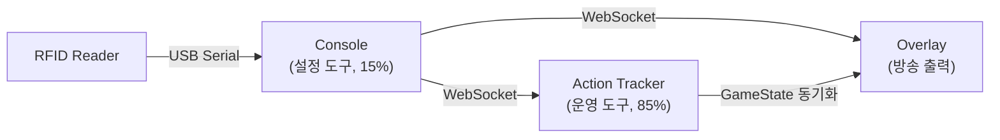
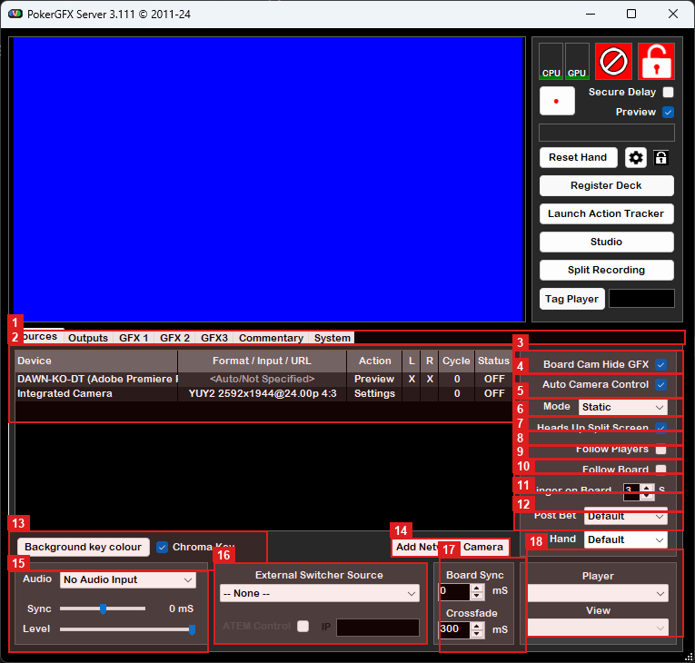
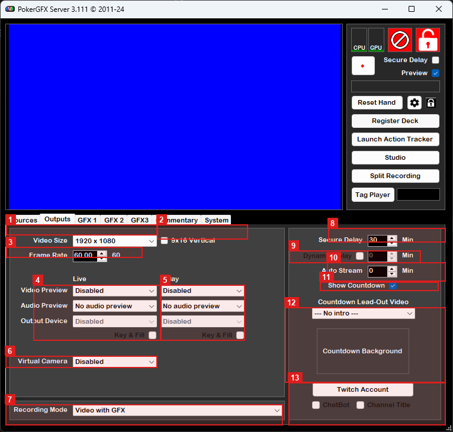
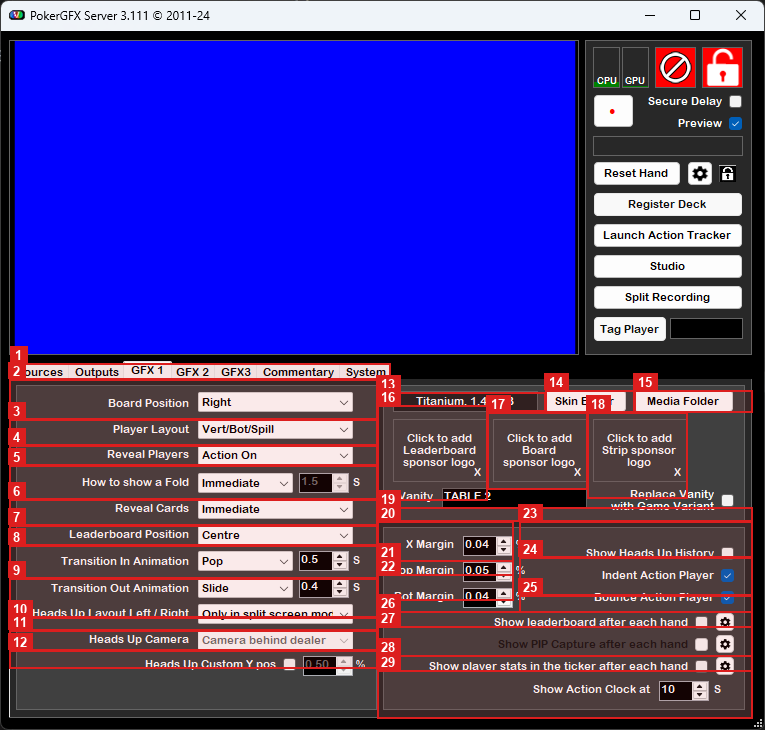
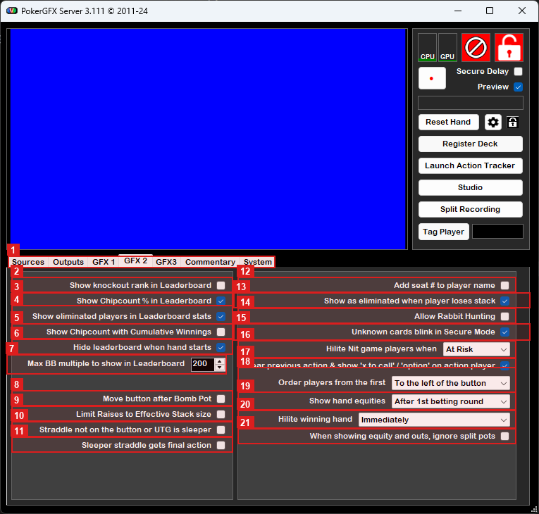
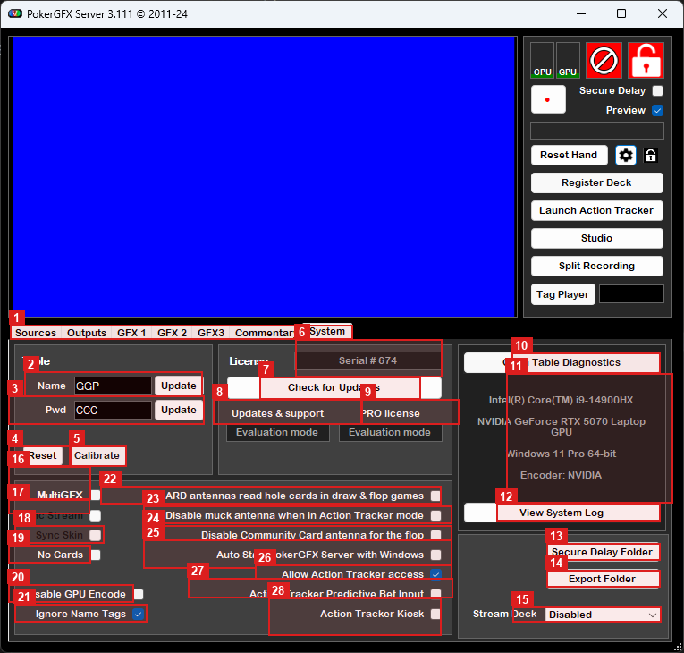
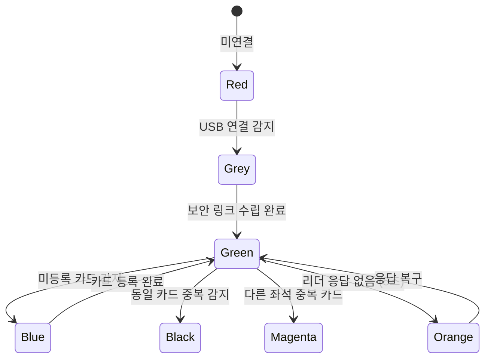
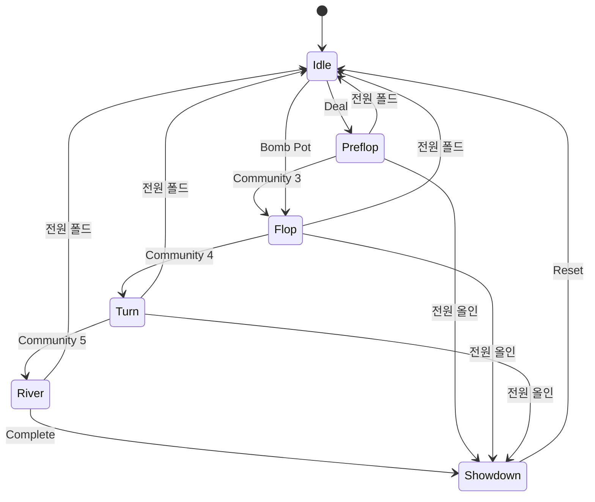

# EBS Console v1.0 UX 설계서

<!-- Part I: 개요 -->

## 1장. 문서 개요

EBS Console v1.0의 전체 시스템 UX 설계서다. Console(86개 요소), Action Tracker(26개 기능), Overlay 출력을 다룬다.

### 범위

| 구성요소 | 요소 수 | 역할 |
|---------|:------:|------|
| Console (5탭 + Main Window) | 86 | 방송 사전 설정 도구 (운영자 주의력 15%) |
| Action Tracker | 26 | 본방송 실시간 게임 진행 입력 (운영자 주의력 85%) |
| Overlay | 8+α | 방송 화면에 합성되는 그래픽 요소 |

### Element ID 체계

| 접두사 | 의미 | 예시 |
|:------:|------|------|
| M | Main Window | M-01 Title Bar |
| S | Sources 입력 | S-01 Video Sources Table |
| O | Outputs 출력 | O-01 Video Size |
| G | GFX/Rules/Display 그래픽 | G-01 Board Position |
| Y | System | Y-01 Table Name |

### Console 5탭 요소 배분

| 탭 | 요소 수 | 서브그룹 |
|---|:---:|---------|
| Main Window | 12 | 상태 표시(6) + 보안(1) + 액션(4) + 탭 내비게이션(1) |
| I/O | 20 | Input(12) + Output(8) |
| GFX | 19 | Layout(6) + Card&Player(4) + Animation(4) + Branding(5) |
| Rules | 9 | Game Rules(4) + Player Display(5) |
| Display | 13 | Blinds(5) + Precision(5) + Mode(3) |
| System | 13 | Table(2) + RFID(5) + AT(2) + Diagnostics(3) + Startup(1) |

---

## 2장. 시스템 아키텍처

### 3구성요소 관계



Console은 방송 시작 전 설정을 구성하는 도구다. Action Tracker는 본방송 중 게임 진행을 실시간으로 입력하는 운영 도구다. Overlay는 Console/AT의 상태를 방송 화면에 합성한다.

### 데이터 흐름

```
RFID Card → ST25R3911B → ESP32 → USB Serial → Console → WebSocket → AT / Overlay
```

### 좌표계

| 단위 | 범위 | 사용 항목 | 해상도 변경 시 |
|------|------|----------|---------------|
| 정규화 좌표 (float) | 0.0~1.0 | Margin % (G-03~G-05) | 변환 불필요 |
| 기준 픽셀 (int) | 0~1920 또는 0~3840 | Graphic Editor LTWH | 스케일 팩터 자동 적용 |

### 앱 윈도우 크기 정책

- 최소: 1280x720 (이하에서는 스크롤 발생)
- Preview(좌) : Control(우) 기본 비율 = 6:4

### 다크 테마 Surface Elevation 체계

```
Surface Elevation (shadcn/ui OKLCH 기반):
  Base:      #0F172A  (앱 배경)
  Surface-1: #1E293B  (패널, 사이드바)
  Surface-2: #334155  (카드, 위젯)
  Surface-3: #475569  (호버, 툴팁)
  Border:    rgba(255,255,255,0.10)

텍스트:
  Primary:   #FAFAFA  (대비비 12.6:1)
  Secondary: #94A3B8  (대비비 4.8:1, WCAG AA)
  Muted:     #64748B  (대비비 3.2:1, Large AA)

상태 색상 (RFID 7색 체계):
  Green:   #22C55E  (정상 운용)
  Grey:    #94A3B8  (보안 링크 수립 중)
  Blue:    #3B82F6  (미등록 카드 감지)
  Black:   #1E293B  (동일 카드 중복)
  Magenta: #D946EF  (중복 카드)
  Orange:  #F97316  (응답 없음)
  Red:     #EF4444  (미연결)

시스템 인디케이터 (CPU/GPU):
  Green:   #22C55E  (<60%)
  Yellow:  #EAB308  (<85%)
  Red:     #EF4444  (>=85%)
```

### 기술 스택

```
프레임워크:    React 19 + TypeScript 5
컴포넌트:     shadcn/ui (Radix Primitives)
스타일링:     Tailwind CSS 4 + CSS Variables (OKLCH)
상태 관리:    Zustand + persist + immer
폼 검증:     React Hook Form + Zod (탭당 1 schema)
테이블:      TanStack Table v8 (Sources DataTable, inline edit)
색상 선택:   react-colorful (2.8KB, WCAG AA)
WebSocket:   react-use-websocket v4 (heartbeat, backoff)
애니메이션:   GSAP v3 (timeline)
출력:        Electron offscreen → NDI SDK (BGRA alpha)
Preview:     CSS transform scale on iframe
```

<!-- Part II: Console 설계 -->

## 3장. Main Window

> **PokerGFX 원본 참조**
>
> 
>
> 

시스템 전체를 한눈에 모니터링하고, 5개 설정 탭으로 분기하는 중앙 통제실. 본방송 중 운영자 주의력의 15%가 여기에 할당된다.

### 레이아웃

```
  +-------------------------------------------------------------+
  | [Logo] EBS Console v1.0              [M-07 Lock] [M-12 설정] |
  +-------------------------------+-----------------------------+
  |                               | [M-03] CPU [████░░] 42%     |
  |    M-02 Preview Panel         | [M-04] GPU [███░░░] 28%     |
  |    (16:9 Chroma Key Blue)     | [M-05] RFID 7색 상태        |
  |    출력 해상도 동비 유지       | [M-06] 연결 아이콘           |
  |                               +-----------------------------+
  |                               | [M-11] Reset Hand            |
  |                               | [M-13] Register Deck         |
  |                               | [M-14] Launch AT (F8)        |
  +-------------------------------+-----------------------------+
  | [M-08] I/O | GFX | Rules | Display | System                 |
  +-------------------------------------------------------------+
  |                                                             |
  |    Tab Content Area                                         |
  |    (탭별 설정 폼)                                            |
  |                                                             |
  +-------------------------------------------------------------+
```

2-column 레이아웃. 좌측 Preview Panel은 CSS `aspect-ratio: 16/9`, `<canvas>`로 구현하며, Chroma Key Blue 배경으로 GFX 오버레이를 실시간 렌더링한다. 우측에는 시스템 상태 표시와 액션 버튼이 배치된다.

### Element Catalog (12개)

#### 상태 표시 그룹

| ID | 요소 | 컴포넌트 | 기본값 | 유효 범위 | 설명 |
|:--:|------|---------|--------|----------|------|
| M-01 | Title Bar | AppBar | — | — | 앱 이름 + 버전 + 윈도우 컨트롤 |
| M-02 | Preview Panel | Canvas | — | 16:9 종횡비 | 출력 해상도(O-01)와 동일 종횡비, Chroma Key Blue 배경, GFX 오버레이 실시간 렌더링 |
| M-03 | CPU Indicator | ProgressBar | — | 0~100% | CPU 사용률 + 색상 코딩 (Green<60%, Yellow<85%, Red>=85%). rAF 폴링 |
| M-04 | GPU Indicator | ProgressBar | — | 0~100% | GPU 사용률 + 동일 색상 코딩 |
| M-05 | RFID Status | Icon+Badge | — | 7색 상태 | Green=정상, Grey=보안 링크, Blue=미등록, Black=중복, Magenta=중복, Orange=응답없음, Red=미연결 |
| M-06 | RFID Connection Icon | Icon | — | — | 연결 시 녹색 USB/WiFi 아이콘, 미연결 시 경고 아이콘 |

#### 보안 제어 그룹

| ID | 요소 | 컴포넌트 | 기본값 | 유효 범위 | 설명 |
|:--:|------|---------|--------|----------|------|
| M-07 | Lock Toggle | IconButton | — | — | 잠금 시 `<fieldset disabled>`로 모든 탭 설정 변경 불가 |

#### 액션 버튼 그룹

| ID | 요소 | 컴포넌트 | 기본값 | 유효 범위 | 설명 |
|:--:|------|---------|--------|----------|------|
| M-11 | Reset Hand | ElevatedButton | — | — | 현재 핸드 초기화, 확인 다이얼로그 |
| M-12 | Settings | IconButton | — | — | 전역 설정 다이얼로그 (테마, 언어, 단축키) |
| M-13 | Register Deck | ElevatedButton | — | — | 52장 RFID 일괄 등록. AbortController + Progress Dialog (1/52~52/52 순차) |
| M-14 | Launch AT | ElevatedButton | — | — | Action Tracker 실행/포커스 전환 (F8) |

#### Tab Navigation

| ID | 요소 | 컴포넌트 | 기본값 | 유효 범위 | 설명 |
|:--:|------|---------|--------|----------|------|
| M-08 | Tab Bar | TabBar | — | 5탭 | I/O, GFX, Rules, Display, System |

## 4장. I/O 탭

> **PokerGFX 원본 참조**
>
> 
>
> 
>
> 
>
> 

Sources와 Outputs를 단일 탭으로 통합한 입출력 파이프라인 설정 화면. 2섹션: Input(상단) + Output(하단). Fill & Key 모드를 기본으로 고정하고, Chroma Key는 S-11에서 개별 제어한다.

### Element Catalog (20개)

#### Input 섹션 (12개)

| ID | 요소 | 컴포넌트 | 기본값 | 유효 범위 | 설명 |
|:--:|------|---------|--------|----------|------|
| S-01 | Video Sources Table | DataTable | — | — | NDI/캡처카드/네트워크 카메라 목록. TanStack Table v8, 셀 클릭 inline edit, onBlur 커밋 |
| S-03 | L Column | DataColumn | — | — | 좌측 비디오 소스 할당 (X 표시) |
| S-04 | Format/Input/URL | DataColumn | — | — | 소스 포맷 및 입력 URL 표시 |
| S-11 | Chroma Key Enable | Checkbox | — | — | 크로마키 활성화 |
| S-12 | Background Colour | ColorPicker | #0000FF | — | 배경색 설정. react-colorful HexAlphaColorPicker |
| S-13 | Switcher Source | Dropdown | — | — | ATEM 스위처 연결. Fill & Key 모드에서만 표시 |
| S-14 | ATEM Control | Checkbox | — | — | ATEM 스위처 제어 활성화. Fill & Key 모드에서만 표시 |
| S-25 | R Column | DataColumn | — | — | 우측 비디오 소스 할당 (X 표시) |
| S-26 | Cycle Column | DataColumn | — | — | 소스 순환 표시 시간 (초, 0=제외) |
| S-27 | Status Column | DataColumn | — | — | 소스 활성/비활성 (ON/OFF) |
| S-28 | Action (Preview/Settings) | DataColumn | — | — | Preview 토글 + Settings 버튼 |
| S-29 | ATEM IP | TextField | — | — | ATEM 스위처 IP 주소 입력. Fill & Key 모드에서만 표시 |

Fill & Key 모드 조건부 표시: S-13, S-14, S-29는 Fill & Key 모드 활성 시에만 UI에 표시된다. single `<video>` → dual `<canvas>` 전환.

#### Output 섹션 (8개)

| ID | 요소 | 컴포넌트 | 기본값 | 유효 범위 | 설명 |
|:--:|------|---------|--------|----------|------|
| O-01 | Video Size | Dropdown | — | 1080p/4K | 출력 해상도 |
| O-02 | 9x16 Vertical | Checkbox | — | — | 세로 모드 (모바일) |
| O-03 | Frame Rate | Dropdown | — | 30/60fps | 프레임레이트 선택 |
| O-04 | Live Video/Audio/Device | DropdownGroup | — | — | Live 파이프라인 3개 드롭다운 (DeckLink/NDI) |
| O-05 | Live Key & Fill | Checkbox | — | — | Live Fill & Key 출력. 외부 키잉 지원 장치 선택 시 활성화 |
| O-18 | Fill & Key Color | ColorPicker | #FF000000 | — | Key 신호 배경색 |
| O-19 | Fill/Key Preview | DualPreview | — | — | Fill 신호와 Key 신호 나란히 미리보기 |
| O-20 | DeckLink Channel Map | ChannelMap | — | — | Live Fill/Key → DeckLink 포트 매핑 |

## 5장. GFX 탭

> **PokerGFX 원본 참조**
>
> 
>
> 

보드와 플레이어 그래픽의 위치, 카드 공개 방식, 등장/퇴장 애니메이션, 스킨 정보를 설정하는 화면. 4서브그룹: Layout > Card & Player > Animation > Branding.

### Element Catalog (19개)

#### Layout 서브그룹 (6개)

| ID | 요소 | 컴포넌트 | 기본값 | 유효 범위 | 설명 |
|:--:|------|---------|--------|----------|------|
| G-01 | Board Position | Dropdown | — | Left/Right/Centre/Top | 보드 카드 위치. 항상 화면 하단 배치 |
| G-02 | Player Layout | Dropdown | — | Horizontal/Vert-Bot-Spill/Vert-Bot-Fit/Vert-Top-Spill/Vert-Top-Fit | 플레이어 배치 모드 |
| G-03 | X Margin | NumberInput | 0.04 | 0.0~1.0 | 좌우 여백 % (정규화 좌표) |
| G-04 | Top Margin | NumberInput | 0.05 | 0.0~1.0 | 상단 여백 % |
| G-05 | Bot Margin | NumberInput | 0.04 | 0.0~1.0 | 하단 여백 % |
| G-06 | Leaderboard Position | Dropdown | — | Centre/Left/Right | 리더보드 위치 |

Margin 값은 정규화 좌표(0.0~1.0)로 입력된다. 실제 픽셀 환산: `margin_pixel = margin_normalized x output_width`. Zod schema로 유효성 검증한다.

#### Card & Player 서브그룹 (4개)

| ID | 요소 | 컴포넌트 | 기본값 | 유효 범위 | 설명 |
|:--:|------|---------|--------|----------|------|
| G-14 | Reveal Players | Dropdown | — | Immediate/On Action/After Bet/On Action + Next | 카드 공개 시점 |
| G-15 | How to Show Fold | Dropdown+NumberInput | — | Immediate/Delayed + 초 | 폴드 표시 방식 + 지연 시간 |
| G-16 | Reveal Cards | Dropdown | — | Immediate/After Action/End of Hand/Showdown Cash/Showdown Tourney/Never | 카드 공개 연출 |
| G-22 | Show Leaderboard | Checkbox+Settings | — | — | 핸드 후 리더보드 자동 표시 + 설정 |

#### Animation 서브그룹 (4개)

| ID | 요소 | 컴포넌트 | 기본값 | 유효 범위 | 설명 |
|:--:|------|---------|--------|----------|------|
| G-17 | Transition In | Dropdown+NumberInput | — | Slide/Pop/Expand/Fade + 초 | 등장 애니메이션. GSAP timeline 파라미터 (duration, ease, direction) 매핑 |
| G-18 | Transition Out | Dropdown+NumberInput | — | Slide/Pop/Expand/Fade + 초 | 퇴장 애니메이션. GSAP timeline 파라미터 매핑 |
| G-19 | Indent Action Player | Checkbox | — | — | 액션 플레이어 들여쓰기 |
| G-20 | Bounce Action Player | Checkbox | — | — | 액션 플레이어 바운스 효과 |

#### Branding 서브그룹 (5개)

| ID | 요소 | 컴포넌트 | 기본값 | 유효 범위 | 설명 |
|:--:|------|---------|--------|----------|------|
| G-10 | Sponsor Logo 1 | ImageSlot | — | — | Leaderboard 위치 스폰서 로고. react-dropzone + 이미지 미리보기 |
| G-11 | Sponsor Logo 2 | ImageSlot | — | — | Board 위치 스폰서 로고 |
| G-12 | Sponsor Logo 3 | ImageSlot | — | — | Strip 위치 스폰서 로고 |
| G-13 | Vanity Text | TextField+Checkbox | — | — | 테이블 표시 텍스트 + Game Variant 대체 옵션 |
| G-13s | Skin Info | Label | — | — | 현재 스킨명 + 용량 (읽기 전용) |

## 6장. Rules 탭

> **PokerGFX 원본 참조**
>
> 
>
> 

게임 규칙 성격의 요소를 모은 전담 탭. Bomb Pot, Straddle 위치 규칙, 플레이어 표시 방식이 여기에 모인다. 규칙 변경이 그래픽 표시에 직접 영향을 미치므로 방송 시작 전 확인 필요. 2서브그룹: Game Rules(상단) + Player Display(하단).

### Element Catalog (9개)

#### Game Rules 서브그룹 (4개)

| ID | 요소 | 컴포넌트 | 기본값 | 유효 범위 | 설명 |
|:--:|------|---------|--------|----------|------|
| G-52 | Move Button Bomb Pot | Checkbox | — | — | 봄팟 후 딜러 버튼 이동 여부 |
| G-53 | Limit Raises | Checkbox | — | — | 유효 스택 기반 레이즈 제한 |
| G-55 | Straddle Sleeper | Dropdown | — | TBD | 스트래들 위치 규칙 (버튼/UTG 이외 = 슬리퍼) |
| G-56 | Sleeper Final Action | Dropdown | — | TBD | 슬리퍼 스트래들 최종 액션 여부 |

#### Player Display 서브그룹 (5개)

| ID | 요소 | 컴포넌트 | 기본값 | 유효 범위 | 설명 |
|:--:|------|---------|--------|----------|------|
| G-32 | Add Seat # | Checkbox | — | — | 플레이어 이름에 좌석 번호 추가 |
| G-33 | Show as Eliminated | Checkbox | — | — | 스택 소진 시 탈락 표시 |
| G-35 | Clear Previous Action | Checkbox | — | — | 이전 액션 초기화 + 'x to call'/'option' 표시 |
| G-36 | Order Players | Dropdown | — | TBD | 플레이어 정렬 순서 (To the left of the button 등) |
| G-38 | Hilite Winning Hand | Dropdown | — | Immediately/After Delay | 위닝 핸드 강조 시점 |

---

## 7장. Display 탭

"어떤 형식으로 수치를 표시할지"를 결정하는 전담 탭. 통화 기호, 정밀도, BB 모드, 블라인드 표시 시점이 여기에 모인다. 3서브그룹: Blinds > Precision > Mode.

### Element Catalog (13개)

#### Blinds 서브그룹 (5개)

| ID | 요소 | 컴포넌트 | 기본값 | 유효 범위 | 설명 |
|:--:|------|---------|--------|----------|------|
| G-45 | Show Blinds | Dropdown | — | Never/When Changed/Always | 블라인드 표시 조건 |
| G-46 | Show Hand # | Checkbox | — | — | 블라인드 표시 시 핸드 번호 동시 표시 |
| G-47 | Currency Symbol | TextField | ₩ | — | 통화 기호 |
| G-48 | Trailing Currency | Checkbox | — | — | 통화 기호 후치 여부 (₩100 vs 100₩) |
| G-49 | Divide by 100 | Checkbox | — | — | 전체 금액을 100으로 나눠 표시 |

#### Precision 서브그룹 (5개)

5개 영역 독립 정밀도 설정. PokerNumberFormatter x 5 인스턴스 (SmartKM 로직: 1000→1K, 1000000→1M).

| ID | 요소 | 컴포넌트 | 기본값 | 유효 범위 | 설명 |
|:--:|------|---------|--------|----------|------|
| G-50a | Leaderboard Precision | Dropdown | — | Exact Amount/Smart k-M/Divide | 리더보드 수치 형식 |
| G-50b | Player Stack Precision | Dropdown | Smart k-M | TBD | 플레이어 스택 표시 형식 |
| G-50c | Player Action Precision | Dropdown | Smart Amount | TBD | 액션 금액 형식 |
| G-50d | Blinds Precision | Dropdown | Smart Amount | TBD | 블라인드 수치 형식 |
| G-50e | Pot Precision | Dropdown | Smart Amount | TBD | 팟 수치 형식 |

#### Mode 서브그룹 (3개)

토너먼트에서 BB 배수 표시는 시청자 이해도 향상 기본 기능. Zustand store slice 분리.

| ID | 요소 | 컴포넌트 | 기본값 | 유효 범위 | 설명 |
|:--:|------|---------|--------|----------|------|
| G-51a | Chipcounts Mode | Dropdown | — | Amount/BB | 칩카운트 표시 모드 |
| G-51b | Pot Mode | Dropdown | — | Amount/BB | 팟 표시 모드 |
| G-51c | Bets Mode | Dropdown | — | Amount/BB | 베팅 표시 모드 |

## 8장. System 탭

> **PokerGFX 원본 참조**
>
> 
>
> 

RFID 리더 연결, Action Tracker 접근 정책, 시스템 진단, 고급 설정을 관리하는 탭. 5서브그룹: Table(최상단) + RFID(상단) + AT(중단) + Diagnostics(하단) + Startup.

### Element Catalog (13개)

#### Table 서브그룹 (2개)

| ID | 요소 | 컴포넌트 | 기본값 | 유효 범위 | 설명 |
|:--:|------|---------|--------|----------|------|
| Y-01 | Table Name | TextField | — | — | 테이블 식별 이름 (AT 접속용) |
| Y-02 | Table Password | TextField | — | — | AT 접속 비밀번호 |

#### RFID 서브그룹 (5개)

RFID 연결이 방송 시작의 첫 번째 전제 조건. 상단 배치.

| ID | 요소 | 컴포넌트 | 기본값 | 유효 범위 | 설명 |
|:--:|------|---------|--------|----------|------|
| Y-03 | RFID Reset | TextButton | — | — | RFID 시스템 초기화 (재시작 없이 연결 재설정) |
| Y-04 | RFID Calibrate | TextButton | — | — | 안테나별 캘리브레이션 (1회 설정) |
| Y-05 | UPCARD Antennas | Checkbox | — | — | UPCARD 안테나로 홀카드 읽기 활성화 |
| Y-06 | Disable Muck | Checkbox | — | — | AT 모드 시 muck 안테나 비활성 |
| Y-07 | Disable Community | Checkbox | — | — | 커뮤니티 카드 안테나 비활성 |

#### AT 서브그룹 (2개)

| ID | 요소 | 컴포넌트 | 기본값 | 유효 범위 | 설명 |
|:--:|------|---------|--------|----------|------|
| Y-13 | Allow AT Access | Checkbox | — | — | AT 접근 허용. 비활성 시 AT Auto 모드만 가능 |
| Y-14 | Predictive Bet | Checkbox | — | — | 베팅 예측 자동완성 (초기 입력 기반) |

#### Diagnostics 서브그룹 (3개)

| ID | 요소 | 컴포넌트 | 기본값 | 유효 범위 | 설명 |
|:--:|------|---------|--------|----------|------|
| Y-09 | Table Diagnostics | TextButton | — | — | 안테나별 상태/신호 강도 별도 창 |
| Y-10 | System Log | TextButton | — | — | 로그 뷰어 (실시간 이벤트/오류 로그) |
| Y-12 | Export Folder | FolderPicker | — | — | JSON 핸드 히스토리 내보내기 폴더 지정 |

#### Startup 서브그룹 (1개)

| ID | 요소 | 컴포넌트 | 기본값 | 유효 범위 | 설명 |
|:--:|------|---------|--------|----------|------|
| Y-22 | Auto Start | Checkbox | — | — | OS 시작 시 EBS Server 자동 실행 |

### RFID 7색 상태 흐름



### 설정 영속화

Zustand persist → platform adapter (Electron: `electron-store` / Tauri: `fs` / Web: `localStorage`). 5탭 설정이 단일 `settings.json`에 매핑된다.

<!-- Part III: Action Tracker + Overlay -->

## 9장. Action Tracker

> **PokerGFX 원본 참조**
>
> 
>
> 

Action Tracker(AT)는 Console과 완전히 분리된 별도 앱이다. Console이 준비 단계의 설정 도구라면, AT는 본방송 중 실시간 게임 진행을 입력하는 운영 도구다 (운영자 주의력 85%).

AT 실행 단축키: `F8` (= M-14 Launch AT 버튼)

### 통신

- 같은 PC: BroadcastChannel API (지연 < 1ms)
- 원격: WebSocket fallback (react-use-websocket v4, heartbeat 5초, exponential backoff)

### AT 26개 기능 매핑

| 그룹 | 기능 ID | 기능 | Console 연동 |
|------|---------|------|-------------|
| **연결** | AT-001 | Network 연결 상태 | WebSocket 서버 주소 |
| | AT-002 | Table 연결 상태 | Y-01 Table Name, Y-02 Password |
| **상태** | AT-003 | Stream 상태 | v2.0 재설계 필요 |
| | AT-004 | Record 상태 | v2.0 재설계 필요 |
| **게임 설정** | AT-005 | 게임 타입 선택 | Game Engine 내부 / G-45 연동 |
| | AT-006 | Blinds 표시 | G-45 Show Blinds, G-46 Show Hand # |
| | AT-007 | Hand 번호 추적 | G-46 Show Hand # (화면 동기) |
| **좌석** | AT-008 | 10인 좌석 레이아웃 | G-02 Player Layout |
| **플레이어** | AT-009 | 플레이어 상태 표시 | G-14 Reveal Players, G-15 How to Show Fold |
| | AT-010 | Action-on 하이라이트 | G-19 Indent, G-20 Bounce |
| | AT-011 | 포지션 표시 | Player Overlay H (포지션 코드) |
| **액션 입력** | AT-012 | Fold | GameState 내부 |
| | AT-013 | Check | GameState 내부 |
| | AT-014 | Call | GameState 내부 |
| | AT-015 | Raise | GameState 내부 |
| | AT-016 | All-in | GameState 내부 |
| | AT-017 | Bet | GameState 내부 |
| **범위** | AT-018 | Min/Max 베팅 범위 | G-53 Limit Raises |
| **카드** | AT-019 | Community Cards 표시 | RFID 자동 |
| | AT-020 | Community Cards 수동 입력 | RFID 실패 폴백 |
| **제어** | AT-021 | HIDE GFX | Preview Canvas 숨김 |
| **고급** | AT-022 | TAG HAND | Hand History DB (v2.0 Defer) |
| | AT-023 | ADJUST STACK | Player Overlay G 즉시 반영 |
| | AT-024 | CHOP | 팟 분배 로직 (v2.0 Defer) |
| | AT-025 | RUN IT 2x | G-52 연동 (v2.0 Defer) |
| | AT-026 | MISS DEAL | M-11 Reset Hand 동등 (v2.0 Defer) |

### 입력 모드 이중 설계

**키보드 모드 (1순위)**:
- F1~F6: 글로벌 hotkey (Fold/Check/Call/Raise/All-in/Bet)
- 숫자키 1~0: 좌석 선택
- 2문자 타이핑: 카드 입력 (As=A♠, Kh=K♥)

**터치 모드 (2순위)**:
- 72px 터치 버튼
- Preset fractions (1/4, 1/3, 1/2, 3/4, Pot)
- 2단계 Suit → Rank 선택

### 좌석 레이아웃

Parametric ellipse 배치: `x = cx + rx*cos(theta)`, `y = cy + ry*sin(theta)`. 10인 좌석을 타원 위에 균등 배치한다.

### Undo

Command Pattern + 5초 타임 윈도우. 5초 이내의 마지막 액션을 취소할 수 있다.

### HIDE GFX

`position: fixed`, `z-index: 9999` + F12 단축키. 오버레이를 즉시 숨기고 복원한다.

### 키보드 단축키

| 키 | 기능 | 모드 |
|---|------|------|
| 1~0 | Seat 1~10 선택 | 글로벌 |
| F1 | Fold | 좌석 선택 후 |
| F2 | Check | 좌석 선택 후 |
| F3 | Call | 좌석 선택 후 |
| F4 | Raise (금액 입력 대기) | 좌석 선택 후 |
| F5 | All-in | 좌석 선택 후 |
| F6 | Bet (금액 입력 대기) | 좌석 선택 후 |
| F8 | AT 실행/포커스 전환 | 글로벌 (Console) |
| F12 | HIDE GFX 토글 | 글로벌 |
| Ctrl+Z | Undo (5초 내) | 글로벌 |

### AT 레이아웃

```
  +------------------------------------------+
  | [연결 상태] Table: Final Table  Hand #47  |
  | Game: Hold'em  Blinds: 50K/100K          |
  +------------------------------------------+
  |                                          |
  |  [1]Seat1  [2]Seat2  [3]Seat3  [4]Seat4  |
  |  [Name]    [Name]    [Name]    [Name]    |
  |  500K      1.2M      [D]800K   400K     |
  |                                          |
  |  [6]Seat6  [7]Seat7  [8]Seat8  [9]Seat9  |
  |  [Name]    [Name]    [Name]    [Name]    |
  |  750K      300K      1.5M      600K     |
  |                                          |
  |       [5]Seat5           [0]Seat10       |
  |       [Name] 2.4M        [Name] 900K    |
  +------------------------------------------+
  | Community: [A♠] [K♦] [7♣] [  ] [  ]     |
  | Pot: 1,250,000                           |
  +------------------------------------------+
  | [F1:FOLD] [F2:CHECK] [F3:CALL 200K]     |
  | [F4:RAISE _____ ] [F5:ALL IN] [F6:BET]  |
  +------------------------------------------+
  | [F12:HIDE GFX] [ADJUST] [RESET]         |
  +------------------------------------------+
```

## 10장. Overlay 출력

방송 화면에 합성되는 그래픽 요소 전체를 정의한다. 렌더링 엔진: HTML5/CSS3 + GSAP v3 timeline.

### Player Overlay 8요소

| 코드 | 요소 | 설명 |
|:----:|------|------|
| A | Player Photo | 프로필 이미지 |
| B | Hole Cards | 홀카드 2~5장 (게임 타입별) |
| C | Name | 플레이어 이름 |
| D | Country Flag | 국적 국기 |
| E | Equity % | 승률 (v2.0 Defer) |
| F | Action | 최근 액션 (Fold/Check/Call/Raise/All-in) |
| G | Stack | 칩 스택 (PokerNumberFormatter 적용) |
| H | Position | 포지션 (D/SB/BB/UTG 등) |

### Board & 부가 요소

| 요소 | 설명 | 제어 |
|------|------|------|
| Board Cards | CSS Grid 5칸 + GSAP `staggerFrom`. Flop 3장 동시 → Turn → River 순차 | RFID 자동 + AT 수동 |
| Pot Display | 현재 팟 + 사이드팟 | GameState 자동 |
| Blinds Display | 블라인드 레벨 + 핸드 번호 | G-45, G-46 |
| Leaderboard | 핸드 후 자동 표시 | G-22, G-06 |
| Sponsor Logos | 3개 슬롯 (Leaderboard/Board/Strip) | G-10~G-12 |
| Vanity Text | 테이블 표시 텍스트 | G-13 |

### 트랜지션 4종

| 타입 | GSAP 매핑 | 설명 |
|------|----------|------|
| Slide | `x/y` tween + ease | 방향성 슬라이드 진입/퇴장 |
| Pop | `scale` 0→1 + `opacity` | 스케일 팝업 |
| Expand | `scaleX/scaleY` 순차 | 폭→높이 순차 확장 |
| Fade | `opacity` 0→1 | 단순 페이드 |

G-17(Transition In)과 G-18(Transition Out)에서 선택한 타입이 GSAP timeline 파라미터로 매핑된다. `duration`(초)과 `ease`(power2.inOut)를 설정할 수 있다.

### NDI 출력

Electron offscreen rendering → NDI SDK (BGRA alpha 보존). 크로마키 없이 투명 알파 채널로 방송 스위처에 전달한다.

### Preview

Console M-02 Preview Panel에서 CSS `transform: scale(0.25)` on iframe으로 축소 표시한다. 이중 렌더링 없이 동일 Overlay 인스턴스를 스케일링한다.

### 스킨 시스템

JSON manifest → CSS custom properties + FontFace API. v1.0은 기본 스킨 1종만 번들한다.

```json
{
  "name": "EBS Default",
  "version": "1.0.0",
  "colors": { "primary": "#...", "secondary": "#..." },
  "fonts": { "heading": "Inter", "body": "Inter" },
  "card_assets": "cards/default/"
}
```

### 상태 관리

Zustand + immer → WebSocket 메시지 수신 → Store 갱신 → GSAP 트리거 직결. GameState Delta 메시지에서 변경된 필드만 병합하여 불필요한 리렌더링을 방지한다.

### 숫자 포맷팅

PokerNumberFormatter x 5 인스턴스:
- SmartKM 로직: 1,000 → 1K, 1,000,000 → 1M
- 5개 영역(G-50a~G-50e)에 독립 인스턴스 할당
- 통화 기호(G-47), 후치 여부(G-48), 100 나누기(G-49) 적용

<!-- Part IV: 기술 + 결정 -->

## 11장. 기술 설계

### Zustand Store 3종

| Store | 역할 | 구독자 |
|-------|------|--------|
| `consoleSettingsStore` | 5탭 86개 설정값 | Console UI |
| `gameStateStore` | AT 게임 상태 (GameState) | AT, Overlay |
| `overlayRenderStore` | 렌더링 상태 (표시/숨김, 트랜지션) | Overlay |

`consoleSettingsStore`는 Zustand persist로 `settings.json`에 영속화한다. `gameStateStore`는 세션 내 휘발성이다.

### WebSocket 3종

| 채널 | 연결 | 프로토콜 |
|------|------|---------|
| Console ↔ AT | BroadcastChannel (로컬) / WebSocket (원격) | JSON, heartbeat 5초 |
| Console ↔ Overlay | 동일 프로세스 Store 공유 또는 WebSocket | JSON |
| Console ↔ RFID | USB Serial (native bridge) | 바이너리 프레임 |

### AT↔Console 동기화

이중 채널 설계:
- **로컬** (같은 PC): BroadcastChannel API — 지연 < 1ms, 별도 서버 불필요
- **원격** (다른 PC): WebSocket fallback — react-use-websocket v4, heartbeat 5초, exponential backoff

두 채널은 동일 메시지 포맷을 사용하며, 연결 시점에 자동 선택한다.

### 게임 엔진

GameState 모델 기반 상태 머신:



예외 흐름: 전원 폴드 → Idle(HAND_COMPLETE), 전원 올인 → Showdown, Bomb Pot → Flop 직행.

상세 데이터 모델, 22개 게임 지원, 베팅 시스템, 핸드 평가는 [game-engine.md](../01_PokerGFX_Analysis/PRD-0004-game-engine.md) 참조.

### 렌더링

GSAP v3 timeline + Electron offscreen + NDI SDK.
- 오버레이는 HTML5/CSS3로 구성하고, GSAP timeline이 트랜지션을 제어한다.
- Electron offscreen rendering으로 프레임을 캡처하여 NDI SDK를 통해 BGRA alpha로 출력한다.
- Preview Panel은 CSS transform scale로 동일 인스턴스를 축소 표시한다.

### 설정 영속화

Zustand persist middleware → platform adapter 패턴:

| 플랫폼 | 어댑터 | 저장 위치 |
|--------|--------|----------|
| Electron | `electron-store` | `settings.json` (userData) |
| Tauri | `@tauri-apps/api/fs` | `settings.json` (appData) |
| Web | `localStorage` | 브라우저 스토리지 |

5탭 86개 설정이 단일 `settings.json`에 매핑된다. 탭 전환 시 자동 저장 (onBlur 커밋).

### 폼 검증

React Hook Form + Zod. 탭당 1 schema, onBlur 커밋 방식. 사용자가 필드에서 포커스를 잃을 때 검증 및 Store 반영이 동시에 수행된다.

### API 계약

WebSocket 메시지 포맷, 5개 서비스 영역(Game/Player/Card/Display/Media), 16개 실시간 이벤트, GameState 전체 동기화 및 Delta 업데이트 패턴은 [api-contracts.md](../01_PokerGFX_Analysis/PRD-0004-api-contracts.md) 참조.

---

## 12장. 의사결정 기록

v1.0 설계 과정에서 내려진 핵심 결정과 그 근거를 요약한다. 상세 내용은 각 ADR 문서를 참조한다.

| ADR | 결정 | 상태 | 요약 |
|-----|------|:----:|------|
| [ADR-001](../01_PokerGFX_Analysis/decisions/ADR-001-commentary-exclusion.md) | Commentary 탭 배제 | 확정 | 운영팀 미사용 확인. OBS Scene으로 대체 가능. 8개 요소 전체 배제 |
| [ADR-002](../01_PokerGFX_Analysis/decisions/ADR-002-delay-pipeline-defer.md) | Delay Pipeline v2.0 Defer | 확정 | 보안 딜레이/이중 출력은 v2.0으로 이연. v1.0은 Live 단일 출력 |
| [ADR-003](../01_PokerGFX_Analysis/decisions/ADR-003-skin-editor-defer.md) | Skin/Graphic Editor v2.0 Defer | 확정 | v1.0은 기본 스킨 1종. G-14s 비활성(회색) 노출 |
| [ADR-005](../01_PokerGFX_Analysis/decisions/ADR-005-rendering-strategy.md) | 렌더링 전략: GSAP v3 + Electron offscreen + NDI | 확정 | Canvas 2D/WebGL/WebGPU 비교 후 GSAP timeline이 업계 표준 (CasparCG, SPX-GC 등에서 검증). Electron offscreen으로 alpha 보존 NDI 출력 |

### 미결 사항

- **기본 스킨 1종 제작 방법**: CSS 직접 작성 vs 디자인 도구 export 미결정

---

## 변경 이력

| 날짜 | 버전 | 변경 내용 | 결정 근거 |
|------|------|-----------|----------|
| 2026-03-03 | v1.0.0 | 최초 작성 | PRD-0004 element-catalog 기반 UX 설계 문서 분리 |

---

**Version**: 1.0.0 | **Updated**: 2026-03-03
