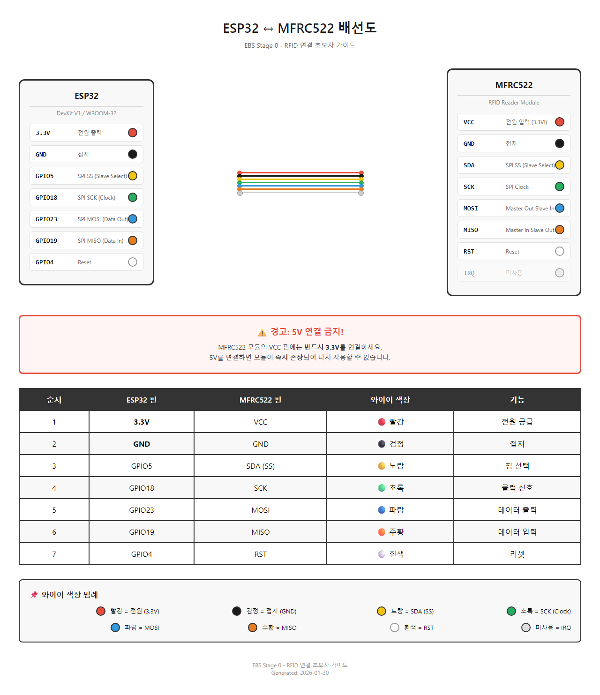

# EBS 하드웨어 연결 초보자 가이드

**대상 독자**: 전자공학/하드웨어 경험이 전혀 없는 개발자
**상세 문서**: [DESIGN-RFID-Hardware.md](DESIGN-RFID-Hardware.md)

---

## 0. 이 문서가 필요한 분

이 문서는 다음과 같은 분을 위해 작성되었습니다:

- 3.3V, 5V가 무엇인지 모름
- SPI, GPIO 같은 용어를 처음 들음
- 브레드보드, 점퍼 와이어를 써본 적 없음
- Arduino IDE를 들어만 봤음
- "카드 리더기를 컴퓨터에 연결하고 싶은데 어디서부터 시작해야 할지 모르겠음"

이미 Arduino나 Raspberry Pi를 다뤄보셨다면? [GUIDE-RFID-Implementation.md](GUIDE-RFID-Implementation.md)로 바로 이동하세요.

---

## 1. 준비물

### 1.1 필수 부품 체크리스트

| 부품 | 수량 | 예상 가격 | 용도 |
|------|------|----------|------|
| ESP32-WROOM-32 DevKit V1 | 1개 | $5-10 | 메인 컴퓨터 역할 (아래 주의사항 참조) |
| MFRC522 모듈 | 1개 | $2-5 | 카드 읽는 기계 |
| MIFARE Classic 1K 카드 | 5장 | $2-3 | 테스트용 카드 |
| 점퍼 와이어 (F-F) | 7개 이상 | $1-2 (세트) | 연결선 |
| USB 케이블 (micro 또는 C) | 1개 | $2-3 | PC 연결용 |

**총 예상 비용**: $15-25

### 1.2 ESP32 보드 선택 주의사항

**이 문서는 ESP32-WROOM-32 DevKit V1 기준으로 작성되었습니다.**

ESP32에는 여러 변형이 있으며, **핀 배치가 다른 모델은 이 문서의 배선도를 그대로 사용할 수 없습니다.**

| 모델 | 이 문서와 호환 | 비고 |
|------|:-------------:|------|
| **ESP32-WROOM-32** | ✅ | 기본형, 권장 |
| **ESP32-WROVER** | ✅ | PSRAM 추가 버전 |
| ESP32-S2 | ❌ | 핀 배치 다름 |
| ESP32-S3 | ❌ | 핀 배치 다름 |
| ESP32-C3 | ❌ | RISC-V 코어, 핀 다름 |
| ESP32-C6 | ❌ | 핀 배치 다름 |

> **구매 팁**: "ESP32 DevKit V1" 또는 "ESP32-WROOM-32"로 검색하세요. "S2", "S3", "C3", "C6"이 붙은 모델은 피하세요.

### 1.3 구매처

| 쇼핑몰 | 장점 | 단점 | 링크 |
|--------|------|------|------|
| **AliExpress** | 가장 저렴 ($2-6) | 배송 2-4주 | aliexpress.com |
| **Amazon** | 빠른 배송 | 가격 높음 ($8-15) | amazon.com |
| **디바이스마트** | 국내 당일/익일 배송 | 약간 비쌈 | devicemart.co.kr |
| **엘레파츠** | 국내, 상세 설명 | - | eleparts.co.kr |

> **팁**: 급하지 않다면 AliExpress에서 구매하세요. 같은 부품을 1/3 가격에 살 수 있습니다.

### 1.4 USB 케이블 주의사항

**중요**: USB 케이블에는 두 종류가 있습니다.

| 종류 | 기능 | 구분 방법 |
|------|------|----------|
| **충전 전용 케이블** | 전기만 전달 | 스마트폰 연결 시 파일 접근 불가 |
| **데이터 케이블** | 전기 + 데이터 전달 | 스마트폰 연결 시 파일 접근 가능 |

ESP32를 컴퓨터에 연결하려면 **반드시 데이터 케이블**을 사용해야 합니다. 스마트폰을 연결했을 때 파일 탐색기에서 폰이 보이는 케이블을 사용하세요.

### 1.5 부품 식별 사진

아래 사진을 참고하여 구매한 부품이 맞는지 확인하세요.

**ESP32 DevKit V1 보드:**


*이미지 출처: [Random Nerd Tutorials](https://randomnerdtutorials.com/esp32-pinout-reference-gpios/)*

**MFRC522 RFID 모듈과 태그:**


*이미지 출처: [Last Minute Engineers](https://lastminuteengineers.com/how-rfid-works-rc522-arduino-tutorial/)*

---

## 2. 핵심 용어 10개

하드웨어를 이해하기 위한 최소한의 용어입니다. 이 10개만 알면 연결할 수 있습니다.

| 용어 | 쉬운 설명 | 비유 |
|------|----------|------|
| **ESP32** | 작은 컴퓨터 보드. 코드를 넣으면 명령대로 움직입니다. | 스마트폰 크기의 두뇌 |
| **MFRC522** | 카드를 읽는 기계. 교통카드 찍는 기계와 같은 원리입니다. | 지하철 카드 단말기 |
| **RFID** | 무선으로 정보를 읽는 기술. 교통카드, 회사 출입카드가 RFID입니다. | 교통카드 기술 |
| **3.3V / 5V** | 전기의 세기. 3.3V는 약한 전기, 5V는 센 전기입니다. | 1.5V 건전지 vs 9V 건전지 |
| **GND** | 전기의 귀갓길. 모든 전자제품은 전기가 나가는 길이 필요합니다. | 물이 빠지는 배수구 |
| **GPIO** | ESP32의 연결 구멍들. 번호가 붙어있어서 "GPIO5"처럼 부릅니다. | 컴퓨터의 USB 포트들 |
| **SPI** | 부품끼리 대화하는 방법. 선만 연결하면 알아서 대화합니다. | 전화선 연결 |
| **점퍼 와이어** | 부품을 연결하는 전선. 양 끝에 핀이 있어서 꽂기만 하면 됩니다. | 랜선처럼 꽂는 전선 |
| **USB Serial** | USB 케이블로 컴퓨터와 대화하는 것. 코드 업로드와 결과 확인에 사용합니다. | USB로 데이터 주고받기 |
| **UID** | 카드의 고유번호. 세상에 하나뿐인 번호입니다. | 주민등록번호 |

### 핵심 개념 그림


*그림 2.1: 카드 스캔부터 화면 표시까지의 전체 데이터 흐름*

**실제 시스템 구성 사진:**


*이미지 출처: [Random Nerd Tutorials](https://randomnerdtutorials.com/esp32-mfrc522-rfid-reader-arduino/)*

---

## 3. 연결하기

### 3.1 배선 개요

ESP32와 MFRC522를 연결하려면 **7개의 선**이 필요합니다.


*그림 3.1: 색상별 배선 가이드*

**권장 색상 코드** (이 색상을 쓰면 실수를 줄일 수 있습니다):

| 색상 | 용도 | 이유 |
|------|------|------|
| 빨강 | 3.3V (전원) | 전기 = 빨강 (관례) |
| 검정 | GND (접지) | 접지 = 검정 (관례) |
| 노랑 | SDA (SS) | 신호선 |
| 초록 | SCK | 클럭 |
| 파랑 | MOSI | 데이터 출력 |
| 주황 | MISO | 데이터 입력 |
| 흰색 | RST | 리셋 |

> **참고**: 점퍼 와이어 색상이 맞지 않아도 됩니다. 선을 어디에 꽂았는지만 기억하면 됩니다.

**ESP32 핀아웃 참조 (어디에 연결할지 찾을 때 사용):**


*이미지 출처: [Random Nerd Tutorials](https://randomnerdtutorials.com/esp32-pinout-reference-gpios/)*

**MFRC522 핀아웃 참조:**


*이미지 출처: [Last Minute Engineers](https://lastminuteengineers.com/how-rfid-works-rc522-arduino-tutorial/)*

---

### 3.2 Step 1: 전원 연결 (가장 중요!)

전원 연결은 가장 먼저, 가장 신중하게 해야 합니다.

<div style="border: 3px solid red; padding: 15px; margin: 10px 0;">

**경고: 5V 연결하면 MFRC522가 고장납니다!**

ESP32 보드에는 3.3V 핀과 5V 핀이 둘 다 있습니다. **반드시 3.3V에 연결하세요.**
5V에 연결하면 MFRC522가 즉시 손상되어 다시 사용할 수 없습니다.

</div>

**전원 연결 방법**:

| 순서 | ESP32 핀 | MFRC522 핀 | 와이어 색상 | 역할 |
|:----:|----------|------------|-------------|------|
| 1 | **3.3V** | VCC | 빨강 | 전기가 들어가는 길 |
| 2 | **GND** | GND | 검정 | 전기가 나오는 길 |

**왜 이렇게 하나요?**
전자제품은 전기가 "들어오는 길"과 "나가는 길"이 둘 다 있어야 작동합니다. 물이 수도꼭지(3.3V)에서 나와서 배수구(GND)로 빠지는 것과 같습니다.

**확인 방법**:
```
□ ESP32의 "3.3V" 라벨이 있는 핀에 빨간 선 연결
□ MFRC522의 "VCC" 라벨이 있는 핀에 빨간 선의 반대쪽 연결
□ ESP32의 "GND" 라벨이 있는 핀에 검정 선 연결
□ MFRC522의 "GND" 라벨이 있는 핀에 검정 선의 반대쪽 연결
```

---

### 3.3 Step 2: 데이터 연결

이제 ESP32와 MFRC522가 대화할 수 있도록 나머지 5개 선을 연결합니다.

| 순서 | ESP32 핀 | MFRC522 핀 | 와이어 색상 | 이 선이 하는 일 |
|:----:|----------|------------|-------------|----------------|
| 3 | GPIO5 | SDA (SS) | 노랑 | ESP32가 "지금부터 네게 말할게"라고 알려줌 |
| 4 | GPIO18 | SCK | 초록 | 대화의 박자를 맞춤 (1,2,3,4... 박자) |
| 5 | GPIO23 | MOSI | 파랑 | ESP32 → MFRC522로 명령 전달 |
| 6 | GPIO19 | MISO | 주황 | MFRC522 → ESP32로 카드 정보 전달 |
| 7 | GPIO4 | RST | 흰색 | MFRC522를 다시 시작시킴 |

**왜 이렇게 하나요?**
SPI 통신은 마치 전화 통화와 같습니다. 클럭(SCK)이 "지금 말해"라는 신호를 보내고, MOSI/MISO가 실제 대화 내용을 주고받습니다.

> **IRQ 핀은?** MFRC522에 IRQ 핀이 있지만 이 프로젝트에서는 사용하지 않습니다. 비워두세요.

---

### 3.4 Step 3: 연결 확인하기

모든 연결이 끝났습니다. 이제 확인합니다.

**체크리스트**:

```
전원 (2개)
□ 3.3V ─── VCC (빨강)
□ GND ─── GND (검정)

데이터 (5개)
□ GPIO5 ─── SDA (노랑)
□ GPIO18 ─── SCK (초록)
□ GPIO23 ─── MOSI (파랑)
□ GPIO19 ─── MISO (주황)
□ GPIO4 ─── RST (흰색)

기타
□ IRQ는 연결 안 함 (정상)
□ 모든 선이 단단히 꽂혀 있음
□ ESP32에 USB 케이블 연결
```

**완성된 배선도**:


*그림 3.2: ESP32와 MFRC522 연결 배선도 (색상별 가이드 포함)*

**실제 배선 예시:**


*이미지 출처: [Random Nerd Tutorials](https://randomnerdtutorials.com/esp32-mfrc522-rfid-reader-arduino/)*

> **핀 번호 주의**: 위 이미지는 RST를 GPIO21에 연결했지만, 이 문서에서는 **GPIO4**를 사용합니다. 핀 번호는 이 문서의 표를 따르세요.

**흔한 실수와 해결**:

| 실수 | 증상 | 해결 |
|------|------|------|
| 선이 헐거움 | 동작 안 함, 간헐적 동작 | 선을 뺐다가 다시 꽂기 |
| 5V에 연결 | MFRC522 고장 | 새 모듈 구매 필요 |
| 핀 번호 착각 | 동작 안 함 | GPIO 번호 다시 확인 |

---

## 4. 소프트웨어 설치

하드웨어 연결이 끝났습니다. 이제 ESP32에 프로그램을 넣어야 합니다.

### 4.1 Arduino IDE 설치

Arduino IDE는 ESP32에 코드를 넣는 프로그램입니다.

1. [arduino.cc/en/software](https://www.arduino.cc/en/software) 접속
2. **Windows** 버전 다운로드
3. 설치 파일 실행 → 기본 설정으로 설치
4. 설치 완료 후 Arduino IDE 실행

**설치 확인**:
```
□ Arduino IDE가 정상적으로 열림
□ 빈 코드 화면이 보임
```

### 4.2 ESP32 보드 추가

Arduino IDE는 기본적으로 ESP32를 모릅니다. 알려줘야 합니다.

1. **File** → **Preferences** 클릭
2. **Additional Boards Manager URLs** 칸에 다음 URL 붙여넣기:
   ```
   https://dl.espressif.com/dl/package_esp32_index.json
   ```
3. **OK** 클릭
4. **Tools** → **Board** → **Boards Manager** 클릭
5. 검색창에 `ESP32` 입력
6. **esp32 by Espressif Systems** 찾기 → **Install** 클릭
7. 설치 완료까지 대기 (2-5분)

**설치 확인**:
```
□ Tools → Board에서 "ESP32 Dev Module"이 보임
```

### 4.3 라이브러리 설치

ESP32가 MFRC522와 대화하려면 라이브러리(번역기)가 필요합니다.

**MFRC522 라이브러리**:
1. **Sketch** → **Include Library** → **Manage Libraries** 클릭
2. 검색창에 `MFRC522` 입력
3. **MFRC522 by GithubCommunity** 찾기 → **Install** 클릭

**ArduinoJson 라이브러리**:
1. 검색창에 `ArduinoJson` 입력
2. **ArduinoJson by Benoit Blanchon** 찾기 → **Install** 클릭

**설치 확인**:
```
□ Sketch → Include Library 목록에 "MFRC522"가 보임
□ Sketch → Include Library 목록에 "ArduinoJson"이 보임
```

### 4.4 드라이버 설치

ESP32가 컴퓨터에 보이려면 드라이버가 필요합니다.

**어떤 드라이버가 필요한지 확인**:
ESP32 보드 뒷면을 보세요. USB 포트 근처에 작은 칩이 있습니다.

| 칩 이름 | 다운로드 링크 |
|--------|--------------|
| **CP2102** | [silabs.com/developers/usb-to-uart-bridge-vcp-drivers](https://www.silabs.com/developers/usb-to-uart-bridge-vcp-drivers) |
| **CH340** | [wch-ic.com/downloads/CH341SER_EXE.html](http://www.wch-ic.com/downloads/CH341SER_EXE.html) |

> **모르겠다면?** 둘 다 설치해도 됩니다. 충돌하지 않습니다.

**드라이버 설치 후**:
1. ESP32를 USB로 컴퓨터에 연결
2. **Tools** → **Port** 확인
3. `COM3`, `COM4` 같은 포트가 보이면 성공

**"ESP32가 안 보여요" 해결**:
```
□ USB 케이블이 데이터 케이블인지 확인 (충전 전용 X)
□ 다른 USB 포트에 연결해보기
□ 컴퓨터 재시작
□ 드라이버 재설치
```

---

## 5. 첫 번째 테스트

### 5.1 예제 코드 복사

아래 코드를 Arduino IDE에 붙여넣으세요.

```cpp
// EBS Stage 0 - RFID 테스트 코드
// 이 코드는 RFID 카드의 UID를 읽어서 화면에 출력합니다.

#include <SPI.h>
#include <MFRC522.h>

// 핀 설정 (배선과 동일해야 함)
#define SS_PIN  5    // GPIO5 → SDA
#define RST_PIN 4    // GPIO4 → RST

MFRC522 mfrc522(SS_PIN, RST_PIN);

void setup() {
  // 컴퓨터와 통신 시작
  Serial.begin(115200);
  while (!Serial);  // Serial 준비 대기

  // SPI 통신 시작
  SPI.begin();

  // RFID 리더 시작
  mfrc522.PCD_Init();

  Serial.println("=============================");
  Serial.println("  RFID 리더 준비 완료!");
  Serial.println("  카드를 리더에 대세요.");
  Serial.println("=============================");
}

void loop() {
  // 새 카드가 있는지 확인
  if (!mfrc522.PICC_IsNewCardPresent()) {
    delay(50);
    return;
  }

  // 카드 정보 읽기
  if (!mfrc522.PICC_ReadCardSerial()) {
    return;
  }

  // UID 출력
  Serial.print("카드 UID: ");
  for (byte i = 0; i < mfrc522.uid.size; i++) {
    if (mfrc522.uid.uidByte[i] < 0x10) {
      Serial.print("0");
    }
    Serial.print(mfrc522.uid.uidByte[i], HEX);
    if (i < mfrc522.uid.size - 1) {
      Serial.print(":");
    }
  }
  Serial.println();

  // 카드 통신 종료
  mfrc522.PICC_HaltA();
  delay(500);  // 같은 카드 연속 읽기 방지
}
```

### 5.2 업로드

1. **Tools** → **Board** → **ESP32 Dev Module** 선택
2. **Tools** → **Port** → 해당 COM 포트 선택 (예: COM3)
3. **Upload** 버튼 클릭 (→ 아이콘)
4. 업로드 완료까지 대기 (30초-1분)

**업로드 성공 메시지**:
```
Leaving...
Hard resetting via RTS pin...
```

**업로드 실패 시**:
| 에러 메시지 | 해결 방법 |
|------------|----------|
| `A fatal error occurred: Failed to connect` | BOOT 버튼을 누른 상태로 업로드 |
| `No such file or directory` | 라이브러리 재설치 |
| `Port not found` | Tools → Port에서 포트 선택 |

### 5.3 결과 확인

1. **Tools** → **Serial Monitor** 클릭
2. 오른쪽 하단에서 **115200 baud** 선택
3. RFID 카드를 리더에 가져다 대기

**예상 출력**:
```
=============================
  RFID 리더 준비 완료!
  카드를 리더에 대세요.
=============================
카드 UID: 04:A2:B3:C4
카드 UID: 08:5D:E1:2F
```

**성공 확인**:
```
□ "RFID 리더 준비 완료!" 메시지가 보임
□ 카드를 대면 "카드 UID: XX:XX:XX:XX" 형태로 출력됨
□ 같은 카드는 같은 UID가 나옴
□ 다른 카드는 다른 UID가 나옴
```

축하합니다! 첫 번째 RFID 읽기에 성공했습니다!

---

## 6. 문제가 생겼을 때

### 6.1 증상별 해결 가이드

| 증상 | 확인할 것 | 해결 방법 |
|------|----------|----------|
| ESP32가 컴퓨터에 안 보여요 | USB 케이블 | 데이터 케이블인지 확인. 충전 전용 케이블은 안 됩니다. |
| 업로드가 안 돼요 | 포트 선택 | Tools → Port에서 COM 포트 선택. 없으면 드라이버 설치. |
| 업로드 중 에러 발생 | BOOT 버튼 | ESP32의 BOOT 버튼을 누른 상태로 Upload 버튼 클릭. |
| Serial Monitor에 이상한 글자가 나와요 | baud rate | 115200으로 설정했는지 확인. |
| 카드를 대도 반응이 없어요 | 배선 | 3.3V, GND 연결 확인. 특히 5V가 아닌 3.3V인지 확인! |
| UID가 이상하게 나와요 | 카드 위치 | 카드를 리더 중앙에 평평하게 대기. 2-3cm 이내. |
| 계속 재부팅돼요 | 배선 | 선이 헐거운 곳 없는지 확인. 모든 선을 뺐다가 다시 꽂기. |
| 가끔씩만 읽혀요 | 접촉 불량 | 점퍼 와이어를 새것으로 교체. |
| "MFRC522 초기화 실패" | SPI 배선 | GPIO 번호가 맞는지 다시 확인 (5, 18, 23, 19, 4). |

### 6.2 추가 도움 받기

위 방법으로 해결되지 않으면:

1. **에러 메시지 전체를 복사**
2. Google에 에러 메시지 붙여넣기
3. "ESP32 MFRC522 [에러 메시지]" 검색
4. Reddit, Stack Overflow, Arduino Forum 결과 확인

---

## 7. 다음 단계

**축하합니다!** 하드웨어 연결에 성공했습니다.

이제 할 수 있는 것:
- RFID 카드의 UID 읽기
- Serial Monitor에서 결과 확인

다음 단계에서 배울 것:
- Python 서버로 카드 정보 전송
- WebSocket으로 웹 브라우저에 표시
- 여러 카드 동시 관리

### 7.1 다음 문서

| 순서 | 문서 | 내용 |
|:----:|------|------|
| 1 | [GUIDE-RFID-Implementation.md](GUIDE-RFID-Implementation.md) | Python 서버 연결, 전체 시스템 구축 |
| 2 | [DESIGN-RFID-Hardware.md](DESIGN-RFID-Hardware.md) | 상세 하드웨어 정보, MCU/리더 대안 비교 |
| 3 | [PRD-0003-Stage0-RFID-Connection.md](PRD-0003-Stage0-RFID-Connection.md) | Stage 0 전체 계획 |

### 7.2 유용한 외부 자료

| 리소스 | 설명 |
|--------|------|
| [Random Nerd Tutorials](https://randomnerdtutorials.com) | ESP32 튜토리얼 (영문) |
| [ESP32 공식 문서](https://docs.espressif.com) | 상세 기술 문서 (영문) |
| [Arduino Forum](https://forum.arduino.cc) | 질문/답변 커뮤니티 (영문) |

### 7.3 참고 이미지 출처

이 문서에 사용된 이미지들의 원본 출처입니다:

| 이미지 | 출처 | 라이선스 |
|--------|------|----------|
| ESP32 핀아웃 | [Random Nerd Tutorials](https://randomnerdtutorials.com/esp32-pinout-reference-gpios/) | 교육 목적 인용 |
| MFRC522 핀아웃 | [Last Minute Engineers](https://lastminuteengineers.com/how-rfid-works-rc522-arduino-tutorial/) | 교육 목적 인용 |
| 배선 다이어그램 | [Random Nerd Tutorials](https://randomnerdtutorials.com/esp32-mfrc522-rfid-reader-arduino/) | 교육 목적 인용 |

---

## 문서 정보

| 항목 | 내용 |
|------|------|
| **문서 버전** | 1.1.0 |
| **작성일** | 2026-01-30 |
| **수정일** | 2026-01-30 |
| **대상 독자** | 하드웨어 완전 초보자 |
| **상태** | Active |

---

**문서 끝**
