# PokerGFX Server 3.111 매뉴얼

> EBS 개발을 위한 벤치마크 분석서

**분석 대상**: PokerGFX Server 3.111 (2011-24)
**분석 목적**: EBS 자체 RFID 방송 시스템 설계 시 기능/UI 벤치마크
**이미지 소스**: 실제 앱 캡처 + 번호 박스 오버레이 (`annotated/` 디렉토리)

---

## 목차

| # | 섹션 | 이미지 | 항목 수 |
|:-:|------|--------|:-------:|
| 1 | [메인 윈도우](#1-메인-윈도우) | `01-main-window.png` | 11 |
| 2 | [Sources 탭](#2-sources-탭) | `02-sources-tab.png` | 12 |
| 3 | [Outputs 탭](#3-outputs-탭) | `03-outputs-tab.png` | 13 |
| 4 | [GFX 1 탭](#4-gfx-1-탭) | `04-gfx1-tab.png` | 12 |
| 5 | [GFX 2 탭](#5-gfx-2-탭) | `05-gfx2-tab.png` | 7 |
| 6 | [GFX3 탭](#6-gfx3-탭) | `06-gfx3-tab.png` | 6 |
| 7 | [Commentary 탭](#7-commentary-탭) | `07-commentary-tab.png` | 6 |
| 8 | [System 탭](#8-system-탭) | `08-system-tab.png` | 12 |
| 9 | [Skin Editor](#9-skin-editor) | `09-skin-editor.png` | 9 |
| 10 | [Graphic Editor - Board](#10-graphic-editor---board) | `10-graphic-editor-board.png` | 10 |
| 11 | [Graphic Editor - Player](#11-graphic-editor---player) | `11-graphic-editor-player.png` | 11 |

---

## 1. 메인 윈도우

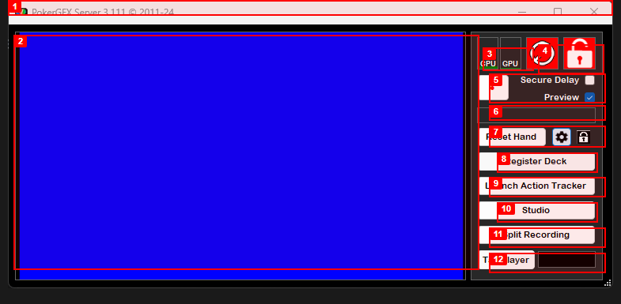

PokerGFX Server는 단일 윈도우 데스크탑 앱입니다. 좌측에 방송 Preview, 우측에 상태 표시와 액션 버튼이 배치되어 있습니다.

| # | 기능명 | 설명 | EBS 복제 |
|:-:|--------|------|:--------:|
| 1 | Title Bar | `PokerGFX Server 3.111 (c) 2011-24` 타이틀 + 최소/최대/닫기 버튼 | P2 |
| 2 | Preview | Chroma Key Blue 배경의 방송 미리보기 화면. GFX 오버레이가 실시간 렌더링됨 | P0 |
| 3 | CPU / GPU | CPU, GPU 사용률 인디케이터. 인코딩 부하를 실시간 모니터링 | P1 |
| 4 | Record / Error / Lock | 녹화 표시등, Error 아이콘, Lock 아이콘 3개 묶음. 빨간 원(●)은 녹화 상태 | P1 |
| 5 | Secure Delay / Preview | Secure Delay 체크박스 + Preview 체크박스. 방송 보안 딜레이와 미리보기 활성화 토글 | P0 |
| 6 | Reset Hand + Settings + Lock | Reset Hand 버튼 + 톱니바퀴(Settings) + 자물쇠(Lock). 핸드 초기화 및 오조작 방지 | P0 |
| 7 | Register Deck | RFID 카드 덱 일괄 등록 버튼. 새 덱 투입 시 52장 순차 스캔 | P0 |
| 8 | Launch Action Tracker | Action Tracker 별도 창 실행 버튼. 운영자용 실시간 게임 추적 인터페이스 | P0 |
| 9 | Studio | Studio 모드 진입 버튼. 방송 스튜디오 환경 전환 | P2 |
| 10 | Split Recording | 핸드별 분할 녹화 버튼. 각 핸드를 개별 파일로 자동 저장 | P1 |
| 11 | Tag Player | 플레이어 태그 + 드롭다운. 특정 플레이어에 마커를 부여하여 추적 | P1 |

### 탭 구조

Preview 하단에 7개 탭이 배치되어 있습니다.

| 탭 | 설정 항목 수 | 해당 섹션 |
|:--:|:----------:|:---------:|
| Sources | 15+ | [2장](#2-sources-탭) |
| Outputs | 20+ | [3장](#3-outputs-탭) |
| GFX 1 | 25+ | [4장](#4-gfx-1-탭) |
| GFX 2 | 20+ | [5장](#5-gfx-2-탭) |
| GFX3 | 20+ | [6장](#6-gfx3-탭) |
| Commentary | 6 | [7장](#7-commentary-탭) |
| System | 20+ | [8장](#8-system-탭) |

> **EBS 설계 시사점**
> - Preview + 우측 컨트롤 패널 2-column 레이아웃은 운영 효율이 검증된 구조
> - Register Deck, Launch Action Tracker, Reset Hand는 P0 필수 기능
> - Lock 기능은 라이브 방송 중 오조작 방지에 필수

---

## 2. Sources 탭

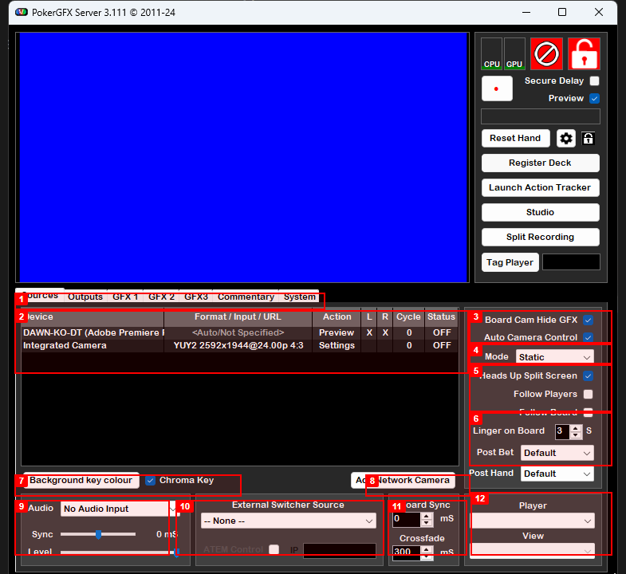

비디오 입력 장치, 카메라 제어, 크로마키, 외부 스위처 연동을 관리하는 탭입니다.

| # | 기능명 | 설명 | EBS 복제 |
|:-:|--------|------|:--------:|
| 1 | Tab Bar | Sources / Outputs / GFX 1 / GFX 2 / GFX3 / Commentary / System 7개 탭 전환 바 | P0 |
| 2 | Device Table | 등록된 비디오 입력 장치 목록. Device / Format / Input / URL / Action / L / R / Cycle / Status 컬럼. Preview, Settings 버튼으로 개별 제어 | P0 |
| 3 | Board Cam / Auto Camera | Board Cam Hide GFX (보드 카메라 전환 시 GFX 자동 숨기기) + Auto Camera Control (게임 상태 기반 자동 카메라 전환) 체크박스 | P1 |
| 4 | Camera Mode | Static / Dynamic 카메라 전환 모드 드롭다운 | P1 |
| 5 | Heads Up / Follow | Heads Up Split Screen 체크박스 + Follow Players / Follow Board 체크박스. 헤즈업 시 화면 분할과 플레이어/보드 추적 | P1 |
| 6 | Linger / Post | Linger on Board (보드 카드 유지 시간, 초 단위) + Post Bet / Post Hand 카메라 동작 설정 | P1 |
| 7 | Chroma Key | Chroma Key 활성화 체크박스 + Background Key Colour 색상 선택기 | P0 |
| 8 | Add Network Camera | 네트워크 카메라 추가 버튼 (IP 기반 원격 카메라) | P2 |
| 9 | Audio / Sync | Audio 입력 소스 드롭다운 (No Audio Input) + Sync 보정값 (mS) | P1 |
| 10 | External Switcher / ATEM | External Switcher Source 드롭다운 + ATEM Control 체크박스 + IP 입력란. Blackmagic ATEM 스위처 직접 통신 | P1 |
| 11 | Board Sync / Crossfade | Board Sync (보드 카드 싱크 보정, mS) + Crossfade (전환 크로스페이드 시간, mS). 기본값 각각 0mS / 300mS | P1 |
| 12 | Player View | 우측 하단 Player / View 버튼. 플레이어별 카메라 뷰 전환 | P1 |

> **EBS 설계 시사점**
> - ATEM 연동: Blackmagic ATEM 스위처 IP 기반 직접 통신 지원 필요
> - Board Sync / Crossfade: mS 단위 미세 조정이 방송 품질에 직결
> - Auto Camera Control: 게임 상태(액션, 보드 카드)에 따른 자동 카메라 전환이 핵심

---

## 3. Outputs 탭

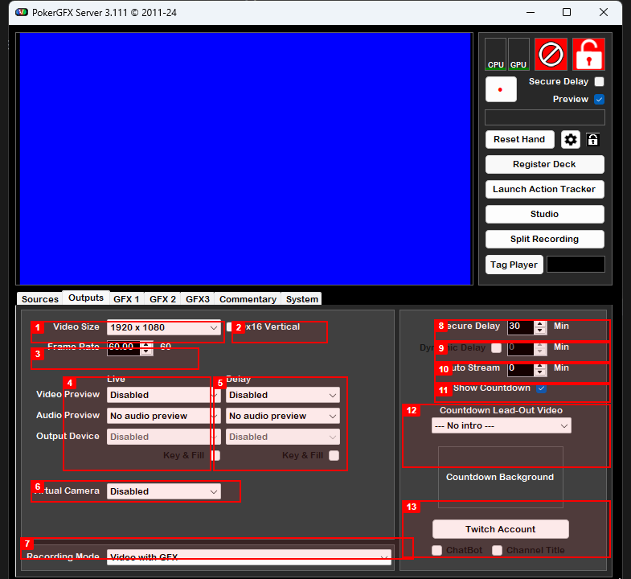

비디오 출력 해상도, Live/Delay 이중 파이프라인, Secure Delay, 스트리밍을 관리하는 탭입니다.

| # | 기능명 | 설명 | EBS 복제 |
|:-:|--------|------|:--------:|
| 1 | Video Size | 출력 해상도 드롭다운. 스크린샷 값: `1920 x 1080` | P0 |
| 2 | 9x16 Vertical | 세로 모드 출력 체크박스. 모바일/쇼츠 포맷용 | P2 |
| 3 | Frame Rate | 출력 프레임레이트 설정. 스크린샷 값: `60.00 -> 60` | P0 |
| 4 | Live column | Live 출력 파이프라인. Video Preview / Audio Preview / Output Device / Key & Fill 4개 설정. Disabled 상태 | P0 |
| 5 | Delay column | Delay 출력 파이프라인. Live와 동일한 4개 설정이 독립 적용. Secure Delay 모드에서 시간 지연 적용 | P0 |
| 6 | Virtual Camera | 가상 카메라 출력 드롭다운. OBS Virtual Camera처럼 소프트웨어 카메라로 출력 | P2 |
| 7 | Recording Mode | 녹화 모드 드롭다운. 스크린샷 값: `Video with GFX` (GFX 오버레이 포함 녹화) | P1 |
| 8 | Secure Delay | 보안 딜레이 시간 설정. 스크린샷 값: **30분**. 기존 체크리스트의 10~120초가 아닌 **분 단위** | P0 |
| 9 | Dynamic Delay | 동적 딜레이 체크박스 + 시간(분). 상황에 따라 딜레이 시간 자동 조절 | P1 |
| 10 | Auto Stream | 자동 스트리밍 시작 딜레이(분). 지정 시간 후 스트리밍 자동 시작 | P2 |
| 11 | Show Countdown | 카운트다운 표시 체크박스. Delay 출력에 남은 시간 표시 | P1 |
| 12 | Countdown Video | Countdown Lead-Out Video 드롭다운. 카운트다운 종료 시 재생할 영상 선택 + Countdown Background 버튼 | P2 |
| 13 | Twitch / ChatBot | Twitch Account 연결 버튼 + ChatBot 체크박스 + Channel Title 체크박스. Twitch 직접 연동 | P2 |

> **EBS 설계 시사점**
> - Secure Delay 30분: 체크리스트에서 10~120초로 기술했으나, 실제 앱은 **분 단위** (최대 30분)
> - Live/Delay 이중 파이프라인: 완전히 독립된 두 출력 스트림이 핵심 아키텍처
> - Twitch 직접 연동: 스트리밍 플랫폼 API 연동 내장

---

## 4. GFX 1 탭

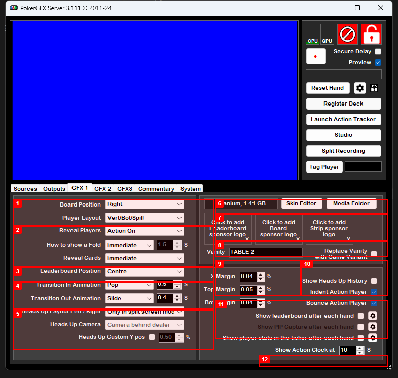

보드/플레이어 레이아웃, Transition 애니메이션, 스킨, 스폰서 로고, 마진을 관리하는 탭입니다.

| # | 기능명 | 설명 | EBS 복제 |
|:-:|--------|------|:--------:|
| 1 | Board Position / Player Layout | Board Position (Right/Left/Centre/Top) + Player Layout (Vert/Bot/Spill) + Reveal Players (Always/Action On/Never). 보드 카드와 플레이어 오버레이의 기본 배치 | P0 |
| 2 | Reveal Players / Fold / Cards | How to show a Fold (Immediate, 1.5초) + Reveal Cards (Immediate/Delayed). 카드 공개와 폴드 연출 타이밍 | P0 |
| 3 | Leaderboard Position | Leaderboard Position (Left/Right/Centre) + Transition In Animation (Pop, 0.5초). 리더보드 위치와 등장 애니메이션 | P1 |
| 4 | Transition In / Out | Transition In (Pop, 0.5초) + Transition Out (Slide, 0.4초). Pop/Slide/Fade + 시간(초) 조합 | P1 |
| 5 | Heads Up Layout / Camera | Heads Up Layout Left/Right (Only in split screen mode) + Heads Up Camera (Camera behind dealer) + Custom Y pos | P1 |
| 6 | Skin Name + Editor | 현재 스킨명 (`Titanium, 1.41 GB`) + Skin Editor / Media Folder 버튼 | P1 |
| 7 | Sponsor Logo Slots | Leaderboard / Board / Strip 3개 위치별 스폰서 로고 슬롯. `Click to add` + X(삭제) 버튼 | P2 |
| 8 | Vanity | Vanity 텍스트 입력란 (`TABLE 2`) + Replace Vanity with Game Variant 체크박스 | P2 |
| 9 | Margins | X Margin (0.04%) / Top Margin (0.05%) / Bot Margin (0.04%). 화면 가장자리 여백 | P1 |
| 10 | Indent / Bounce Action | Show Heads Up History 체크박스 + Indent Action Player 체크박스 + Bounce Action Player 체크박스. 액션 플레이어에 시각 효과 적용 | P1 |
| 11 | Action Clock | Show Action Clock at (10초). 지정 시간부터 원형 타이머 표시 | P0 |
| 12 | Show after each hand options | Show leaderboard after each hand / Show PIP Capture after each hand / Show player stats in the ticker after each hand. 핸드 종료 후 자동 표시 옵션 | P1 |

> **EBS 설계 시사점**
> - 스킨 시스템: 1.41GB "Titanium" 스킨 - 모든 그래픽 에셋이 단일 스킨으로 패키징
> - 3개 스폰서 슬롯: Leaderboard / Board / Strip 위치별 로고 배치
> - Transition Animation: Pop/Slide/Fade + 시간(초) 조합으로 세밀한 제어
> - Bounce Action Player: 액션 대기 플레이어에 바운스 시각 효과 (방송 UX 핵심)

---

## 5. GFX 2 탭

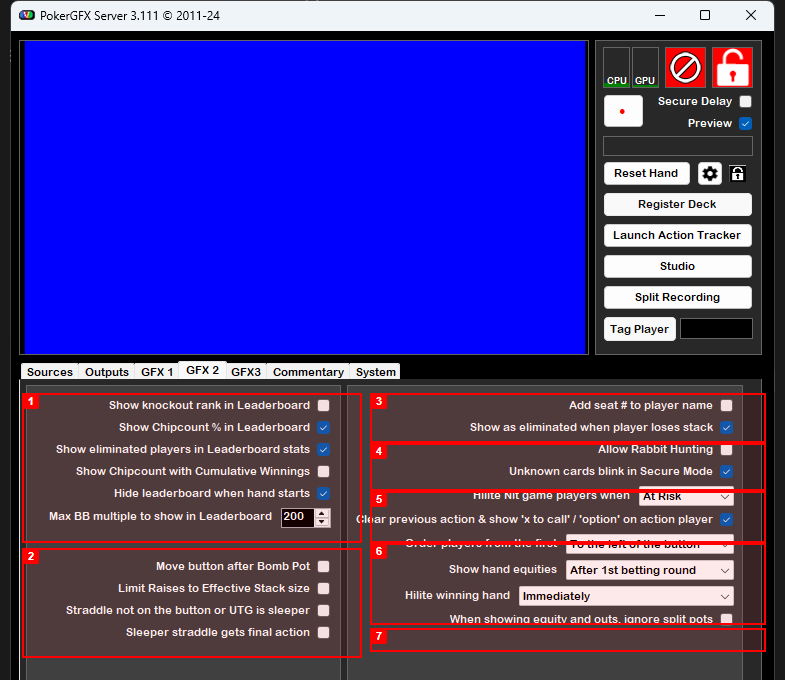

리더보드 옵션, 게임 규칙, 플레이어 표시, Equity 설정을 관리하는 탭입니다.

| # | 기능명 | 설명 | EBS 복제 |
|:-:|--------|------|:--------:|
| 1 | Leaderboard Options | Show knockout rank / Show Chipcount % / Show eliminated players / Show Chipcount with Cumulative Winnings / Hide leaderboard when hand starts / Max BB multiple (200). 리더보드 6개 세부 옵션 | P1 |
| 2 | Game Rules (Bomb Pot / Straddle) | Move button after Bomb Pot / Limit Raises to Effective Stack size / Straddle not on the button or UTG is sleeper / Sleeper straddle gets final action. 특수 게임 규칙 4개 | P1 |
| 3 | Seat / Eliminated | Add seat # to player name 체크박스 + Show as eliminated when player loses stack 체크박스. 좌석 번호와 탈락 표시 | P1 |
| 4 | Rabbit Hunting / Blink | Allow Rabbit Hunting 체크박스 + Unknown cards blink in Secure Mode 체크박스 + Hilite Nit game players when (At Risk). 특수 연출 옵션 | P1 |
| 5 | Hilite Nit / Clear action | Clear previous action & show 'x to call' / 'option' on action player 체크박스 + Order players from the first (To the left of the button). 액션 표시 규칙 | P1 |
| 6 | Order / Equities / Hilite winning | Show hand equities (After 1st betting round) + Hilite winning hand (Immediately). Equity 표시 시점과 위닝 핸드 강조 시점 | P0 |
| 7 | Equity + outs split pots | When showing equity and outs, ignore split pots 체크박스. Split pot 상황에서 Equity/Outs 계산 규칙 | P1 |

> **EBS 설계 시사점**
> - Bomb Pot / Rabbit Hunting / Sleeper Straddle: 방송에서 사용되는 다양한 특수 규칙 지원 필요
> - Equity 표시 시점: "After 1st betting round" 등 정밀 제어 가능
> - Secure Mode 깜빡임: 보안 모드에서 미확인 카드의 시각적 피드백

---

## 6. GFX3 탭

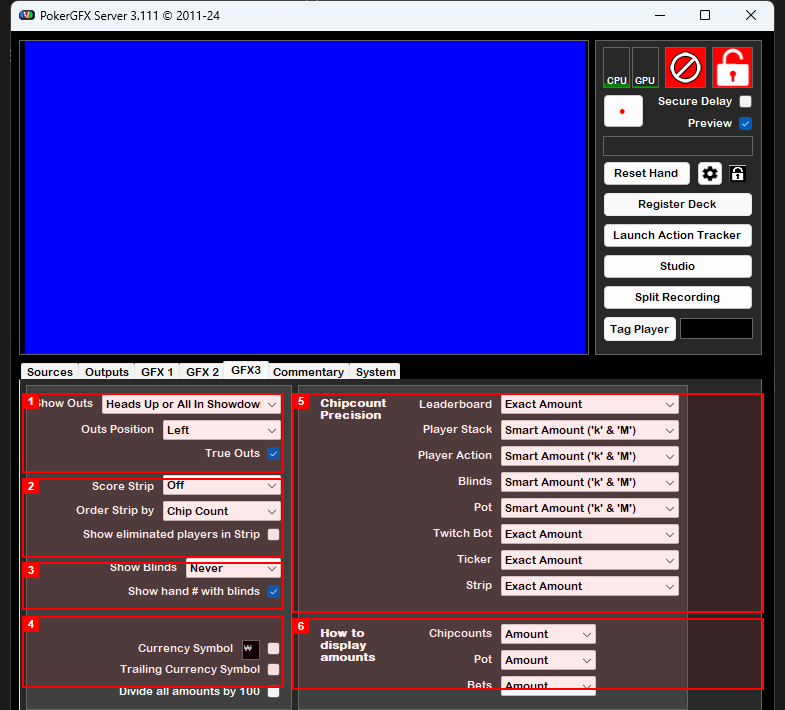

Outs 표시, Score Strip, Blinds, 통화 기호, Chipcount 정밀도, 금액 표시 모드를 관리하는 탭입니다.

| # | 기능명 | 설명 | EBS 복제 |
|:-:|--------|------|:--------:|
| 1 | Outs settings | Show Outs (Heads Up or All In Showdown) + Outs Position (Left) + True Outs 체크박스. 아웃츠 표시 조건과 위치 | P1 |
| 2 | Score Strip | Score Strip (Off) + Order Strip by (Chip Count) + Show eliminated players in Strip. 하단 스코어 스트립 설정 | P1 |
| 3 | Blinds | Show Blinds (Never) + Show hand # with blinds 체크박스. 블라인드와 핸드 번호 표시 옵션 | P0 |
| 4 | Currency Symbol | Currency Symbol (`₩` 원화) + Trailing Currency Symbol 체크박스 + Divide all amounts by 100 체크박스. 통화 기호와 금액 변환 | P0 |
| 5 | Chipcount Precision (8영역) | Leaderboard (Exact Amount) / Player Stack (Smart 'k' & 'M') / Player Action (Smart) / Blinds (Smart) / Pot (Smart) / Twitch Bot (Exact) / Ticker (Exact) / Strip (Exact). 영역별 독립 수치 형식 | P1 |
| 6 | Display amounts mode | Chipcounts / Pot / Bets 각각 Amount 또는 BB 표시 모드 선택. 토너먼트에서 BB 배수 전환 | P1 |

> **EBS 설계 시사점**
> - 영역별 독립 수치 형식: 리더보드 = 정확 금액, 방송 화면 = k/M 축약
> - 통화 기호 ₩: 한국 방송 지원 확인
> - BB 표시 모드: 토너먼트에서 BB 배수로 전환 가능
> - True Outs: 정밀한 아웃츠 계산 알고리즘 필요

---

## 7. Commentary 탭

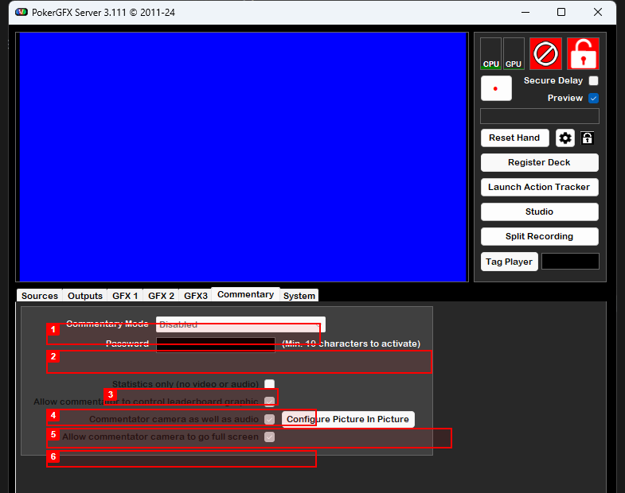

해설자 원격 접속, 통계 전용 모드, PIP 설정을 관리하는 탭입니다. 설정 항목이 적고 단순한 구조입니다.

| # | 기능명 | 설명 | EBS 복제 |
|:-:|--------|------|:--------:|
| 1 | Commentary Mode | Commentary Mode 드롭다운 (Disabled) + Password 입력란 (최소 10자 필요). 해설자 원격 접속 활성화 및 인증 | P1 |
| 2 | Statistics only | Statistics only (no video or audio) 체크박스. 카드 정보 없이 통계만 제공하여 보안 유지 | P1 |
| 3 | Control leaderboard | Allow commentator to control leaderboard graphic 체크박스. 해설자가 리더보드 그래픽을 직접 조작 | P2 |
| 4 | Camera + PIP | Commentator camera as well as audio 체크박스 + Configure Picture In Picture 버튼. 해설자 카메라를 방송 화면에 오버레이 | P1 |
| 5 | Full screen | Allow commentator camera to go full screen 체크박스. 해설자 카메라 전체 화면 전환 허용 | P2 |
| 6 | (하단 예약 영역) | 빈 영역. 추가 Commentary 설정 확장 공간 | - |

> **EBS 설계 시사점**
> - 해설자 원격 접속: 비밀번호 인증으로 외부 해설자가 통계 열람
> - 통계 전용 모드: 카드 정보 없이 통계만 제공 (보안 유지)
> - PIP 설정: 해설자 카메라를 방송 화면에 오버레이

---

## 8. System 탭

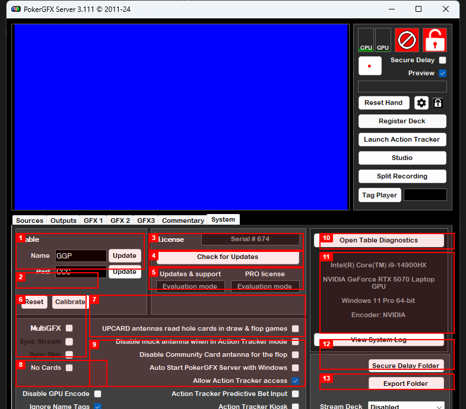

테이블 이름, 라이선스, 캘리브레이션, MultiGFX, RFID 안테나, 시스템 정보, 진단을 관리하는 탭입니다.

| # | 기능명 | 설명 | EBS 복제 |
|:-:|--------|------|:--------:|
| 1 | Table Name / Pwd | Table Name 입력란 (`GGP`) + Table Password (`CCC`) + 각각 Update 버튼 | P1 |
| 2 | Reset / Calibrate | Reset 버튼 (시스템 초기화) + Calibrate 버튼 (RFID 리더 캘리브레이션) | P0 |
| 3 | License / Serial | License 영역. Serial # (`674`) + Check for Updates 버튼 | P2 |
| 4 | Updates / PRO | Updates & support (Evaluation mode) + PRO license (Evaluation mode). 라이선스 상태 표시 | P2 |
| 5 | MultiGFX / Sync | MultiGFX 체크박스 (다중 GFX 인스턴스) + Sync Stream / Sync Skin 체크박스 | P2 |
| 6 | GPU Encode / Name Tags | No Cards 체크박스 + Disable GPU Encode 체크박스 + Ignore Name Tags 체크박스 (활성화 상태) | P1 |
| 7 | RFID Antenna options | UPCARD antennas read hole cards in draw & flop games / Disable muck antenna when in Action Tracker mode / Disable Community Card antenna for the flop / Auto Start PokerGFX Server with Windows. RFID 안테나 3종 독립 제어 | P0 |
| 8 | Action Tracker options | Allow Action Tracker access (활성화) + Action Tracker Predictive Bet Input + Action Tracker Kiosk. AT 접근 권한 및 모드 설정 | P0 |
| 9 | System Info | CPU (Intel Core i9-14900HX) / GPU (NVIDIA GeForce RTX 5070 Laptop GPU) / OS (Windows 11 Pro 64-bit) / Encoder (NVIDIA). 하드웨어 정보 표시 | P1 |
| 10 | Diagnostics / Log | Open Table Diagnostics 버튼 + View System Log 버튼. 테이블 진단 및 시스템 로그 열람 | P1 |
| 11 | Delay / Export Folder | Secure Delay Folder 버튼 + Export Folder 버튼. 딜레이 녹화 및 내보내기 폴더 지정 | P1 |
| 12 | Stream Deck | Stream Deck 드롭다운 (Disabled). Elgato Stream Deck 하드웨어 버튼 매핑 | P2 |

> **EBS 설계 시사점**
> - RFID 안테나 3종 독립 제어: UPCARD / Muck / Community Card 안테나 각각 On/Off
> - Predictive Bet Input: 베팅 금액 예측 입력 기능
> - Kiosk 모드: Action Tracker를 전용 키오스크로 운영
> - Calibrate: RFID 리더 캘리브레이션 기능 필수
> - Stream Deck 연동: Elgato Stream Deck 하드웨어 버튼 매핑

---

## 9. Skin Editor

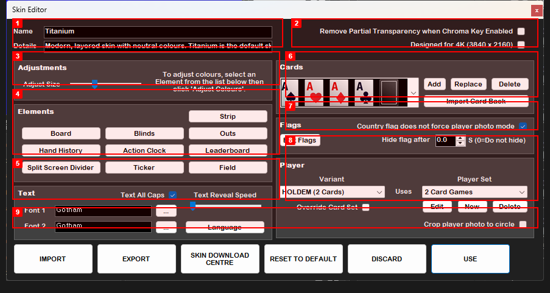

별도 창으로 열리는 스킨 편집기입니다. 스킨 이름, 4K 지원, 요소 편집, 카드 그래픽, 폰트, 국기, 플레이어 세트를 관리합니다.

| # | 기능명 | 설명 | EBS 복제 |
|:-:|--------|------|:--------:|
| 1 | Name / Details | 스킨 이름 (`Titanium`) + 설명 (`Modern, layered skin with neutral colours...`) | P1 |
| 2 | 4K / Transparency | Designed for 4K (3840 x 2160) 체크박스 + Remove Partial Transparency when Chroma Key Enabled 체크박스 | P1 |
| 3 | Adjustments | Adjust Size 슬라이더 + "To adjust colours, select an Element from the list below then click 'Adjust Colours'" 안내 | P2 |
| 4 | Elements (9 buttons) | Board / Blinds / Outs / Hand History / Action Clock / Leaderboard / Split Screen Divider / Ticker / Field + Strip. 9개 요소를 각각 Graphic Editor에서 편집 | P1 |
| 5 | Text (Font / Caps / Speed) | Font 1 / Font 2 (Gotham) + Text All Caps 체크박스 + Text Reveal Speed 슬라이더 + Language 버튼 | P1 |
| 6 | Cards (preview + manage) | A, A, A, A + 카드 뒷면 프리뷰. Add / Replace / Delete 버튼 + Import Card Back 버튼 | P1 |
| 7 | Flags | Country flag 체크박스 (Country flag does not force player photo mode) + Edit Flags 버튼 + Hide flag after (0.0초) | P2 |
| 8 | Player (Variant / Set) | Variant (HOLDEM 2 Cards) + Player Set (2 Card Games) + Override Card Set 체크박스 + Edit / New / Delete 버튼 + Crop player photo to circle 체크박스 | P1 |
| 9 | Bottom buttons | IMPORT / EXPORT / SKIN DOWNLOAD CENTRE / RESET TO DEFAULT / DISCARD / USE. 스킨 관리 액션 버튼 | P1 |

> **EBS 설계 시사점**
> - 스킨 패키징: 모든 그래픽 에셋을 하나의 스킨으로 관리 (Import/Export 가능)
> - 4K 지원 체크박스: 3840x2160 전용 스킨
> - Gotham 폰트: 방송용 가독성 높은 산세리프 폰트
> - Player Set: 게임 타입별 (HOLDEM 2 Cards, PLO 4 Cards 등) 오버레이 세트 분리

---

## 10. Graphic Editor - Board

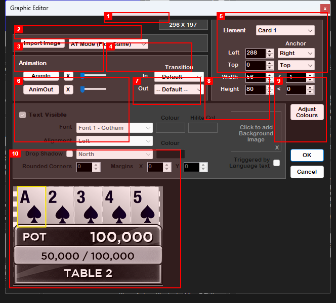

별도 창으로 열리는 요소 편집기입니다. 보드 카드 요소의 레이아웃 크기 `296 x 197`, 모드 `AT Mode (Flop Game)`. 하단 프리뷰에 A 2 3 4 5 보드 + `POT 100,000` + `50,000 / 100,000` 블라인드 + `TABLE 2` 표시.

| # | 기능명 | 설명 | EBS 복제 |
|:-:|--------|------|:--------:|
| 1 | Layout Size | 레이아웃 크기 표시 (`296 X 197`). 요소 전체 영역 픽셀 치수 | P1 |
| 2 | Import Image | Import Image 버튼 + 모드 드롭다운 (`AT Mode (Flop Game)`). 배경 이미지와 표시 모드 선택 | P1 |
| 3 | Animation speeds | AnimIn / AnimOut 속도 슬라이더. X 버튼으로 리셋. 등장/퇴장 애니메이션 속도 | P1 |
| 4 | Transition In / Out | Transition In (Default) / Transition Out (Default) 드롭다운. Default/Pop/Expand/Slide 선택 | P1 |
| 5 | Element + Position + Anchor + Z-order | Element 드롭다운 (`Card 1`) + Left/Top (288/0) + Anchor (Right, Top) + Z-order (1). 선택한 요소의 정확한 위치 지정 | P1 |
| 6 | Text / Font / Alignment / Shadow | Text Visible 체크박스 + Font (Font 1 - Gotham) + Alignment (Left) + Drop Shadow 체크박스 + 방향 (North) | P1 |
| 7 | Colour / Hilite | Colour + Hilite Col 색상 피커. 텍스트 기본색과 강조색 | P1 |
| 8 | Background Image | "Click to add Background Image" 영역 + X(삭제). 요소별 독립 배경 이미지 | P1 |
| 9 | Adjust Colours / OK / Cancel | Adjust Colours 버튼 + Rounded Corners (0) + Margins X/Y (0/0) + Triggered by Language text 체크박스 + OK/Cancel | P2 |
| 10 | Live Preview | 하단 실시간 프리뷰. 편집 결과를 즉시 확인. 보드 카드 + POT + 블라인드 + Vanity 렌더링 | P0 |

> **EBS 설계 시사점**
> - 픽셀 단위 정밀 배치: 모든 요소가 Left/Top/Width/Height로 정확한 위치 지정
> - Anchor 시스템: 해상도 변경 시 기준점 유지 (반응형)
> - Z-order: 오버레이 레이어 겹침 제어
> - 4종 Transition: Default/Pop/Expand/Slide + 속도 슬라이더
> - Drop Shadow 필수: 방송 가독성을 위한 텍스트 그림자

---

## 11. Graphic Editor - Player

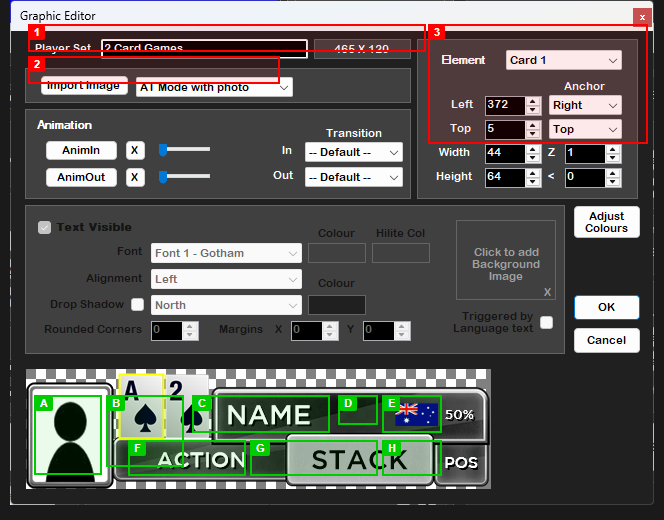

플레이어 오버레이 요소의 편집기입니다. 레이아웃 크기 `465 x 120`, 모드 `AT Mode with photo`, Player Set `2 Card Games`. 하단 프리뷰에 플레이어 오버레이 전체 구성이 표시됩니다.

### 에디터 설정 (빨간 박스 1-3)

| # | 기능명 | 설명 | EBS 복제 |
|:-:|--------|------|:--------:|
| 1 | Editor Title | Graphic Editor 타이틀 바 | P2 |
| 2 | Player Set / Size | Player Set 드롭다운 (`2 Card Games`) + 레이아웃 크기 (`465 X 120`) + Import Image / AT Mode with photo | P1 |
| 3 | Element Properties | Element 드롭다운 (`Card 1`) + Left (372) + Anchor (Right) + Top/Width (44)/Height (64) + Z (1). Animation/Transition/Text/Font/Colour/Shadow/Background 등 전체 속성 패널 | P1 |

### 오버레이 요소 (녹색 박스 A-H)

하단 프리뷰에 표시되는 실제 방송 오버레이 요소입니다.

| # | 요소 | 설명 | EBS 복제 |
|:-:|------|------|:--------:|
| A | Player Photo | 플레이어 프로필 이미지 (실루엣/사진). 원형 또는 사각형 크롭 | P1 |
| B | Hole Cards | 홀카드 2장 (A, 2 표시). 게임 타입에 따라 2~5장 | P0 |
| C | NAME | 플레이어 이름 텍스트. Gotham 폰트, All Caps 적용 | P0 |
| D | Country Flag | 플레이어 국적 국기 아이콘 | P2 |
| E | Equity % | 승률 퍼센트 표시 (`50%`). Equity 계산 엔진 연동 | P0 |
| F | ACTION | 최근 액션 텍스트 (RAISE, CALL, FOLD 등) | P0 |
| G | STACK | 칩 스택 금액 표시. Chipcount Precision 설정 적용 | P0 |
| H | POS | 포지션 표시 (D/SB/BB/UTG 등) | P0 |

> **EBS 설계 시사점**
> - 플레이어 오버레이는 8개 독립 요소로 구성되며 각각 위치/크기/폰트/색상 커스터마이징 가능
> - Hole Cards + NAME + ACTION + STACK + POS가 P0 핵심 요소
> - Player Photo와 Country Flag는 방송 연출 품질 향상 요소
> - 465x120 크기 내에서 모든 정보를 효율적으로 배치하는 레이아웃 설계 필요

---

## 12. 갭 분석: 기존 체크리스트와의 비교

### 12.1 스크린샷에서 새로 발견된 기능 (30개)

| # | 기능 | 탭/창 | 우선순위 |
|:-:|------|:-----:|:--------:|
| NEW-001 | Register Deck (RFID 덱 등록) | 메인 | **P0** |
| NEW-002 | Calibrate (RFID 캘리브레이션) | System | **P0** |
| NEW-003 | Chroma Key | Sources | **P0** |
| NEW-004 | Live/Delay 이중 출력 파이프라인 | Outputs | **P0** |
| NEW-005 | Secure Delay 분 단위 설정 | Outputs | **P0** |
| NEW-006 | Video Size / Frame Rate 설정 | Outputs | **P0** |
| NEW-007 | Auto Camera Control | Sources | P1 |
| NEW-008 | ATEM Control | Sources | P1 |
| NEW-009 | Board Sync / Crossfade | Sources | P1 |
| NEW-010 | Board Position / Player Layout | GFX 1 | P1 |
| NEW-011 | Transition Animation (Pop/Slide/Fade) | GFX 1 | P1 |
| NEW-012 | Bounce Action Player | GFX 1 | P1 |
| NEW-013 | Action Clock (원형 타이머) | GFX 1 | P1 |
| NEW-014 | 영역별 Chipcount Precision (8영역) | GFX3 | P1 |
| NEW-015 | BB 표시 모드 | GFX3 | P1 |
| NEW-016 | 통화 기호 설정 (₩/$) | GFX3 | P1 |
| NEW-017 | Commentary Mode | Commentary | P1 |
| NEW-018 | PIP (Picture In Picture) | Commentary | P1 |
| NEW-019 | Skin Editor | Skin Editor | P1 |
| NEW-020 | Graphic Editor (픽셀 편집) | Graphic Editor | P1 |
| NEW-021 | 플레이어 사진/국기 표시 | Skin Editor | P1 |
| NEW-022 | Split Recording | 메인 | P1 |
| NEW-023 | Score Strip | GFX3 | P1 |
| NEW-024 | 3개 스폰서 로고 슬롯 | GFX 1 | P2 |
| NEW-025 | Virtual Camera | Outputs | P2 |
| NEW-026 | 9x16 Vertical (세로 모드) | Outputs | P2 |
| NEW-027 | Twitch 연동 | Outputs | P2 |
| NEW-028 | MultiGFX (다중 테이블) | System | P2 |
| NEW-029 | Stream Deck 연동 | System | P2 |
| NEW-030 | Ticker Editor | Skin Editor | P2 |

### 12.2 기존 체크리스트 수정 사항

| 기존 ID | 수정 사항 | 근거 |
|---------|----------|------|
| SEC-011 | 딜레이 범위 10~120초 --> **1~30분** | Outputs 탭 스크린샷 |
| VO-001 | "Event Logo" --> **Header 전체** (Sponsor + Title + Event Name + Player Photo) | Graphic Editor 스크린샷 |

### 12.3 업데이트된 총 기능 수

| 카테고리 | 기존 | 추가 | 합계 |
|----------|:----:|:----:|:----:|
| Action Tracker | 26 | 0 | 26 |
| Pre-Start Setup | 13 | 0 | 13 |
| Viewer Overlay | 14 | 0 | 14 |
| GFX Console | 25 | 0 | 25 |
| Security | 11 | 0 | 11 |
| Equity & Stats | 19 | 0 | 19 |
| Hand History | 11 | 0 | 11 |
| **Server 관리** | 0 | **30** | **30** |
| **합계** | **119** | **30** | **149** |

---

## 부록: 스크린샷 색인

### Annotated 이미지 (번호 박스 오버레이)

| # | 파일명 | 내용 | 문서 섹션 |
|:-:|--------|------|:---------:|
| 1 | `annotated/01-main-window.png` | 메인 윈도우 (11개 박스) | [1장](#1-메인-윈도우) |
| 2 | `annotated/02-sources-tab.png` | Sources 탭 (12개 박스) | [2장](#2-sources-탭) |
| 3 | `annotated/03-outputs-tab.png` | Outputs 탭 (13개 박스) | [3장](#3-outputs-탭) |
| 4 | `annotated/04-gfx1-tab.png` | GFX 1 탭 (12개 박스) | [4장](#4-gfx-1-탭) |
| 5 | `annotated/05-gfx2-tab.png` | GFX 2 탭 (7개 박스) | [5장](#5-gfx-2-탭) |
| 6 | `annotated/06-gfx3-tab.png` | GFX3 탭 (6개 박스) | [6장](#6-gfx3-탭) |
| 7 | `annotated/07-commentary-tab.png` | Commentary 탭 (6개 박스) | [7장](#7-commentary-탭) |
| 8 | `annotated/08-system-tab.png` | System 탭 (12개 박스) | [8장](#8-system-탭) |
| 9 | `annotated/09-skin-editor.png` | Skin Editor (9개 박스) | [9장](#9-skin-editor) |
| 10 | `annotated/10-graphic-editor-board.png` | Graphic Editor - Board (10개 박스) | [10장](#10-graphic-editor---board) |
| 11 | `annotated/11-graphic-editor-player.png` | Graphic Editor - Player (빨간 1-3 + 녹색 A-H) | [11장](#11-graphic-editor---player) |

### 원본 스크린샷 (v2.0 참조)

| # | 타임스탬프 | 내용 | 문서 섹션 |
|:-:|:---------:|------|:---------:|
| 1 | 180624 | System 탭 | [8장](#8-system-탭) |
| 2 | 180630 | 메인 윈도우 | [1장](#1-메인-윈도우) |
| 3 | 180637 | Sources 탭 | [2장](#2-sources-탭) |
| 4 | 180645 | Outputs 탭 | [3장](#3-outputs-탭) |
| 5 | 180649 | GFX 1 탭 | [4장](#4-gfx-1-탭) |
| 6 | 180652 | GFX 2 탭 | [5장](#5-gfx-2-탭) |
| 7 | 180655 | GFX3 탭 | [6장](#6-gfx3-탭) |
| 8 | 180659 | Commentary 탭 | [7장](#7-commentary-탭) |
| 9 | 180715 | Skin Editor | [9장](#9-skin-editor) |
| 10 | 180720 | Graphic Editor - Board | [10장](#10-graphic-editor---board) |
| 11 | 180728 | Graphic Editor - Player | [11장](#11-graphic-editor---player) |
| 12 | 180736 | Graphic Editor - Outs | 10장 참조 |
| 13 | 180740 | Graphic Editor - Leaderboard | 10장 참조 |
| 14 | 180750 | Graphic Editor - Blinds | 10장 참조 |
| 15 | 180754 | Graphic Editor - Hand History | 10장 참조 |
| 16 | 180758 | Graphic Editor - Action Clock | 10장 참조 |
| 17 | 180803 | Graphic Editor - Header | 10장 참조 |
| 18 | 180812 | Ticker Editor | 10장 참조 |
| 19 | 180816 | Graphic Editor - Field | 10장 참조 |

---

## 변경 이력

| 버전 | 날짜 | 변경 내용 |
|------|------|----------|
| v1.0.0 | 2026-02-05 | 최초 작성. 21장 스크린샷 기반 기능 분석 |
| v2.0.0 | 2026-02-06 | 전체 구조 재편. 10개 섹션 + 갭 분석 30개 항목 추가 |
| v3.0.0 | 2026-02-06 | 매뉴얼 형식 재작성. annotated 이미지 11장 삽입, 번호별 기능 테이블 + EBS 복제 우선순위 |

---

**Version**: 3.0.0 | **Updated**: 2026-02-06
