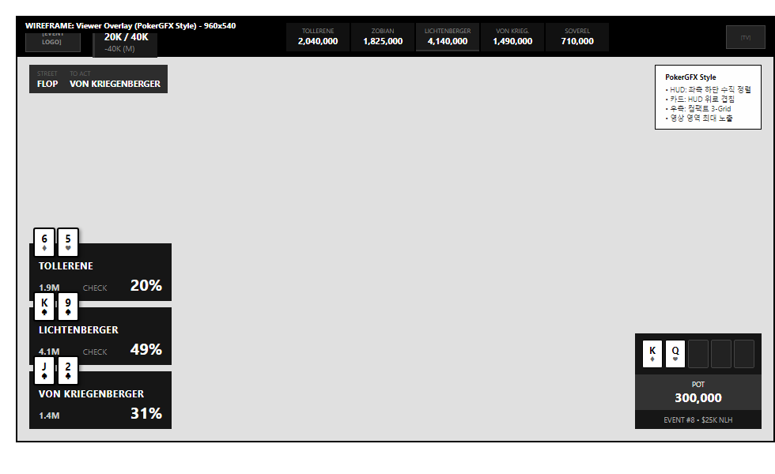
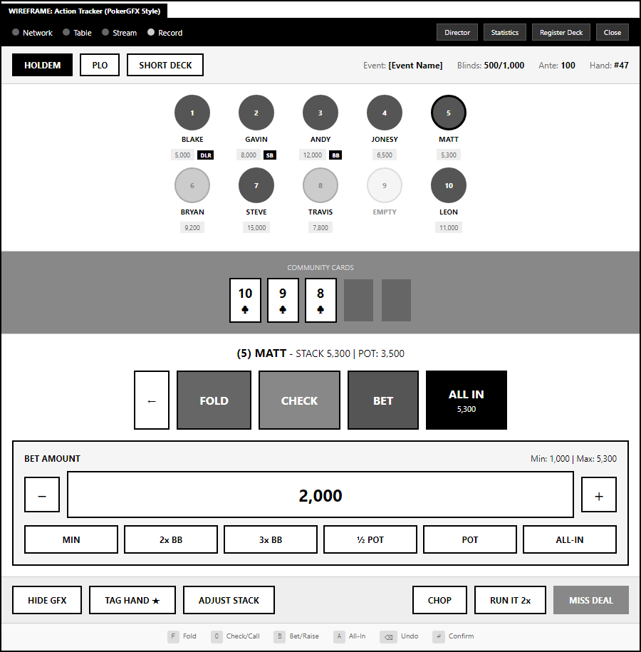
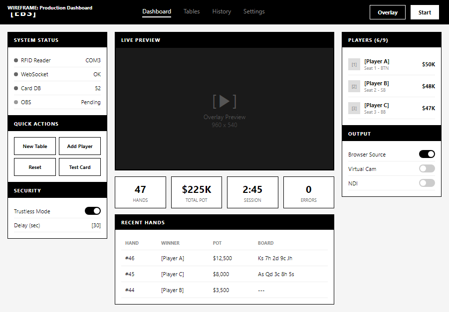

# PRD-0003: EBS Event Broadcasting System

# 1. Executive Summary

## 1.1 제품 비전

> **"WSOP STUDIO의 DB 자산을 내재화하여, 데이터 기반 방송과 사업 확장을 실현한다"**

EBS(Event Broadcasting System)는 **WSOP STUDIO에서 축적된 핸드 히스토리와 플레이어 통계 데이터를 자체 시스템으로 내재화**하는 것을 핵심 목표로 합니다. RFID 기반 포커 카드 인식 시스템을 통해:

1. **DB 자산 완전 소유**: 핸드 히스토리, 플레이어 통계를 자체 DB로 축적
2. **데이터 기반 확장**: 방송 콘텐츠, 비즈니스, 분석 역량 강화
3. **운영 자동화**: 시청자 정보 즉시 제공, 운영자 간편 입력, 전 과정 자동화

를 실현하는 시스템입니다.

## 1.2 핵심 가치 제안 (Value Proposition)

| 핵심 가치 | 설명 | 고객 혜택 |
|-----------|------|----------|
| **DB 자산 내재화** | 핸드 히스토리, 플레이어 통계 자체 소유 | 데이터 독립성, 분석 자유도, 비즈니스 확장 |
| **시청자 중심 정보 전달** | 핸드, 팟, 확률, 액션을 실시간 표시 | 몰입감 있는 시청 경험 |
| **간편한 운영자 입력** | 최소 클릭으로 모든 정보 입력 | 운영 부담 80% 감소 |
| **완전 자동화** | 카드 인식 → 그래픽 → 팟 계산 자동 | 인력/실수 최소화 |
| **Trustless Security** | 운영자조차 실시간 카드 정보 접근 불가 | 게임 무결성 100% 보장 |

## 1.3 4단계 개발 전략

EBS는 **소프트웨어 전문 팀의 첫 하드웨어 도전**으로, 단계적 검증을 통해 안정적으로 발전합니다:

| Stage | 기간 | 목표 연도 | 핵심 전략 |
|-------|------|----------|----------|
| **Stage 0** | 5개월 | 2026 H1 | RFID 연결 검증 (팀 첫 하드웨어) |
| **Stage 1** | 6개월 | 2026 H2 | PokerGFX 100% 복제 |
| **Stage 2** | 12개월 | 2027 | WSOP+ DB 연동 |
| **Stage 3** | 12개월 | 2028 | EBS 독창적 자동화 |

**총 개발 기간**: 약 3년 (2026-2028)

**상세 기획서:**
- [Stage 0: RFID 연결 검증](stage-0/PRD-0003-Stage0-RFID-Connection.md) ← 신규
- [Stage 1: PokerGFX 완전 복제](stage-1/PRD-0003-Stage1-PokerGFX-Clone.md)
- [Stage 2: WSOP+ DB 연동](stage-2/PRD-0003-Stage2-WSOP-Integration.md)
- [Stage 3: EBS 독창적 자동화](stage-3/PRD-0003-Stage3-EBS-Automation.md)

## 1.4 v3.0 vs v4.0 방향 전환

| 영역 | v3.0 (이전) | v4.0 (현재) |
|------|-------------|-------------|
| **핵심 목적** | 보안 (Trustless Security) | **WSOP STUDIO DB 자산 내재화** |
| **핵심 초점** | 기술적 암호화 | **데이터 소유 + 방송 워크플로우** |
| **타겟 사용자** | 운영자 중심 | **방송 확장 / 사업 확장 / 데이터 분석** |
| **설계 원칙** | 보안 우선 | 데이터 축적 + 보안 + 자동화 균형 |

## 1.5 주요 기능 요약

| 카테고리 | 기능 |
|----------|------|
| **시청자 정보** | 실시간 홀카드 표시, 승률/아웃츠 자동 계산, 팟 사이즈, 플레이어 통계 (VPIP, PFR), 핸드 히스토리 |
| **운영자 입력** | 원클릭 액션 입력, 스마트 베팅 예측, 드래그 앤 드롭 플레이어 관리, 음성 입력 (선택), Stream Deck |
| **자동화** | 카드 인식→그래픽, 액션→팟 계산, 핸드 종료 감지, 딜러 버튼 이동, 핸드 히스토리 저장 |
| **보안** | Trustless Mode, Realtime Mode, AES-256 DB 암호화, TLS 1.3, HSM (Enterprise) |
| **프로덕션** | OBS Browser Source, NDI 출력, Chroma Key, 다중 테이블 |
| **커스터마이징** | 스킨 시스템, 다국어, 커스텀 애니메이션, 레이아웃 에디터 |

## 1.6 문서 정체성

> **본 문서는 비전/전략 문서입니다. 상세 설계 명세는 Stage별 문서를 참조하세요.**

| 문서 유형 | 역할 | 상세 수준 |
|----------|------|----------|
| **Master PRD (본 문서)** | 비전, 전략, 로드맵 | 고수준 개요 |
| **Stage PRD** | 구현 계획, 기능 명세 | 상세 설계 |

Stage 1 (PokerGFX 복제) 완료 시점에 개발 명세가 명확해지며, 이후 상세 설계 문서가 산출됩니다.

---

# 2. 제작 의도 및 목적

## 2.1 왜 EBS를 만드는가

### 핵심 목적: WSOP STUDIO DB 자산 내재화

> **EBS의 가장 중요한 목적은 WSOP STUDIO에서 축적된 핸드 히스토리와 플레이어 통계 데이터를 자체 시스템으로 내재화하는 것입니다.**

| 자산 유형 | WSOP STUDIO 현황 | EBS 내재화 목표 |
|----------|------------------|-----------------|
| **핸드 히스토리** | 외부 시스템 의존, 데이터 접근 제한 | 자체 DB 완전 소유, 자유로운 분석 |
| **플레이어 통계** | 제한된 통계 항목, API 의존 | 커스텀 통계 무제한, 실시간 계산 |
| **방송 메타데이터** | 플랫폼 종속 | 독립적 저장 및 활용 |

#### 내재화의 전략적 가치

| 가치 | 설명 | 비즈니스 임팩트 |
|------|------|-----------------|
| **데이터 독립성** | 외부 플랫폼 의존도 제거 | 운영 안정성 확보 |
| **분석 자유도** | 원하는 형태로 데이터 가공/분석 | 인사이트 도출 가속 |
| **비용 절감** | 외부 API/라이선스 비용 제거 | 장기 운영비 감소 |
| **확장성** | 새로운 서비스/기능 개발 기반 | 신규 비즈니스 기회 |
| **IP 자산화** | 축적된 데이터가 회사 자산으로 | 기업 가치 증대 |

### 부차적 목적: 시장 문제점 해결

| 문제점 | EBS 솔루션 | 결과 |
|--------|-----------|------|
| 운영 복잡성 | 자동화 시스템 + 간편 UI | 현장 휴먼 에러율 감소 |
| 시청자 경험 부족 | 실시간 정보 시스템 | 시청자 만족도 향상 |
| 보안 취약점 | Trustless Mode | 내부자 위협 원천 차단 |
| 높은 진입 장벽 | 자동화 시스템 + 간편 UI | 진입 장벽 90% 감소 |

## 2.2 제품 철학

### 세 가지 원칙

| 원칙 | 슬로건 | 구현 |
|------|--------|------|
| **1. 시청자 우선** (Viewer First) | "시청자가 원하는 정보를 즉시 제공한다" | 카드 스캔 즉시 표시, 승률/아웃츠 자동 계산, 정확한 팟 사이즈 |
| **2. 운영자 간편화** (Operator Simplicity) | "운영자는 가능한 적게 입력한다" | 자동 감지, 원클릭 수동 입력, 복잡한 처리는 시스템 담당 |
| **3. 자동화 극대화** (Maximum Automation) | "사람이 개입하는 지점을 최소화한다" | 카드→그래픽, 액션→팟 계산, 핸드 종료→히스토리 저장 자동화 |

## 2.3 경쟁사 분석

### PokerGFX (시장 지배자)

**강점:**
- 10년+ 시장 경험, 40개국+ 사용 실적
- WSOP, WPT 등 메이저 대회 공식 파트너
- 완성도 높은 스킨/그래픽 시스템
- Secure Delay (Trustless Security) 기능

**약점:**
- 복잡한 운영 인터페이스
- 느린 기술 지원 (평균 72시간)
- 아시아 시장 지원 미흡

### EBS 차별화 포인트

| 항목 | PokerGFX | EBS | 차별점 |
|------|----------|-----|--------|
| **운영 복잡도** | 높음 (전담 인력 필요) | 낮음 (자동화) | **80% 간편화** |
| **정보 입력** | 수동 중심 | 자동 + 최소 수동 | **스마트 입력** |
| **시청자 정보** | 기본 | 풍부 (통계, 확률) | **시청자 중심** |
| **WSOP+ 연동** | 없음 | 완전 통합 | **DB 동기화** |
| **보안** | Secure Delay | Dual Mode | **유연한 선택** |
| **DB 소유권** | 외부 의존 | 자체 완전 소유 | **데이터 독립** |

---

# 3. 타겟 사용자

## 3.1 DB 활용 기반 사용자 분류

EBS는 **축적된 DB 자산을 활용**하여 방송과 사업을 확장하는 네 가지 핵심 역할을 위해 설계됩니다:

| 역할 | 소속 | 핵심 목표 | DB 활용 방식 |
|------|------|----------|-------------|
| **시청자** | 외부 (일반 대중) | 정보 소비 | 홀카드, 승률, 통계 시청 |
| **테이블 운영** | WSOP Production - Table Operations | 실시간 데이터 입력 | RFID/Action Tracker 조작 |
| **방송 확장** | WSOP Production - Content Team | 콘텐츠 품질 향상 | 핸드 데이터로 하이라이트 자동 생성 |
| **데이터 분석** | WSOP Production - Analytics Team | 인사이트 도출 | 플레이어 패턴, 시청자 행동 분석 |

## 3.2 페르소나 상세

### 페르소나 1: 시청자 "김철수"

| 항목 | 내용 |
|------|------|
| **이름** | 김철수 |
| **소속** | 외부 사용자 (일반 대중) |
| **역할** | 포커 방송 시청자 |
| **경험** | 온라인 포커 2년, 방송 시청 1년 |

**업무 목표:**
- 실시간 홀카드와 승률 정보로 몰입감 있는 시청 경험
- 플레이어 통계로 전략적 인사이트 습득
- 과거 핸드 히스토리 복기로 학습

**DB 활용 시나리오:**
| 시나리오 | 활용 데이터 | 결과물 |
|----------|------------|--------|
| 실시간 시청 | 홀카드, 커뮤니티 카드, 승률 | 현재 상황 이해도 향상 |
| 통계 확인 | 플레이어 VPIP, PFR, 3Bet% | 플레이어 스타일 파악 |
| 핸드 복기 | 핸드 히스토리, 액션 시퀀스 | 전략 학습 |

**EBS가 제공하는 가치:**
- 카드 스캔 즉시 정보 표시
- 승률/아웃츠 자동 계산
- 플레이어 통계 실시간 업데이트

### 페르소나 2: 테이블 운영자 "박준영"

| 항목 | 내용 |
|------|------|
| **이름** | 박준영 |
| **소속** | WSOP Production - Table Operations |
| **역할** | RFID 시스템 및 Action Tracker 운영 |
| **경험** | 방송 기술 8년, RFID 시스템 3년 |

**업무 목표:**
- 최소 클릭으로 모든 액션 정보 입력
- RFID 카드 인식 시스템 안정적 운영
- 실시간 팟 계산 및 칩 카운트 관리

**DB 활용 시나리오:**
| 시나리오 | 활용 데이터 | 결과물 |
|----------|------------|--------|
| 액션 입력 | 플레이어 액션, 베팅 금액 | 원클릭 입력, 자동 팟 계산 |
| 카드 관리 | RFID UID → 카드 매핑 | 카드 스캔 즉시 화면 표시 |
| 플레이어 관리 | 칩 카운트, 포지션, 이름 | 드래그 앤 드롭 설정 |

**EBS가 제공하는 가치:**
- 스마트 베팅 예측 (입력 80% 감소)
- 자동화된 팟 계산 및 핸드 종료 감지
- Stream Deck 및 음성 입력 지원

### 페르소나 3: 콘텐츠 PD "김영호"

| 항목 | 내용 |
|------|------|
| **이름** | 김영호 |
| **소속** | WSOP Production - Content Team |
| **역할** | 포커 방송 콘텐츠 총괄 |
| **경험** | 방송 프로덕션 15년, 포커 콘텐츠 5년 |

**업무 목표:**
- 핸드 히스토리 기반 하이라이트 클립 자동 생성
- 플레이어 통계로 풍부한 해설 콘텐츠 제작
- 데이터 기반 프로그램 기획 (예: "이달의 블러프왕")

**DB 활용 시나리오:**
| 시나리오 | 활용 데이터 | 결과물 |
|----------|------------|--------|
| 하이라이트 자동화 | 핸드 히스토리 (빅 팟, 올인) | 30초 클립 자동 생성 |
| 해설 콘텐츠 | 플레이어 VPIP, PFR | "이 플레이어는 타이트합니다" |
| 프로그램 기획 | 블러프 성공률, 쇼다운 데이터 | 월간 어워드 방송 |

**EBS가 제공하는 가치:**
- 핸드 데이터 자동 태깅 (빅 팟, 블러프, 배드빗)
- 콘텐츠 API로 편집 도구 연동
- 플레이어 동의 기반 통계 공개

### 페르소나 4: 데이터 분석가 "박지원"

| 항목 | 내용 |
|------|------|
| **이름** | 박지원 |
| **소속** | WSOP Production - Analytics Team |
| **역할** | 데이터 분석가 |
| **경험** | 스포츠 애널리틱스 5년, 포커 2년 |

**업무 목표:**
- 플레이어 패턴 분석 및 인사이트 도출
- 방송 최적화를 위한 A/B 테스트 설계
- 예측 모델 개발 (시청률, 베팅 패턴)

**DB 활용 시나리오:**
| 시나리오 | 활용 데이터 | 결과물 |
|----------|------------|--------|
| 플레이어 분석 | 전체 핸드 히스토리 | 플레이 스타일 분류 |
| 방송 최적화 | 시청 이탈 시점 + 핸드 이벤트 | 최적 하이라이트 타이밍 |
| 예측 모델 | 역대 핸드 + 결과 | 승률 예측 정확도 개선 |

**EBS가 제공하는 가치:**
- SQL 직접 쿼리 인터페이스
- Jupyter 노트북 통합
- 데이터 내보내기 (CSV, Parquet)

---

# 4. 핵심 기능 개요

> **상세 기능 명세는 Stage 1 완료 후 확정됩니다.**
> 본 섹션은 비전 수준의 기능 목표만 제시합니다.

## 4.1 기능 비전

EBS는 세 가지 핵심 기능 영역을 제공합니다:

| 영역 | 비전 | 상세 명세 |
|------|------|----------|
| **시청자 정보 표시** | 홀카드, 승률, 통계를 실시간 표시 | [Stage 1 PRD §2](stage-1/PRD-0003-Stage1-PokerGFX-Clone.md) |
| **운영자 입력** | 최소 클릭으로 액션 입력 | [Stage 1 PRD §2.1](stage-1/PRD-0003-Stage1-PokerGFX-Clone.md) |
| **프로덕션 통합** | OBS, NDI 출력 지원 | [Stage 1 PRD §2.3](stage-1/PRD-0003-Stage1-PokerGFX-Clone.md) |

## 4.2 Stage별 기능 확장 요약

| 기능 | Stage 1 | Stage 2 | Stage 3 |
|------|---------|---------|---------|
| 카드 인식 | RFID 자동 | 동일 | 동일 |
| 팟 계산 | 수동 입력 | DB 동기화 | 자동 계산 |
| 플레이어 통계 | 수동 설정 | WSOP+ 연동 | 실시간 자동 |
| 입력 방식 | 원클릭 | 30% 감소 | 80% 감소 |

## 4.3 컨셉 목업 (비전 전달용)

다음 목업은 **최종 스펙이 아닌 비전 전달 목적**입니다.
Stage 1 개발 중 변경될 수 있습니다.

### Viewer Overlay 컨셉
시청자 화면 레이아웃

### Action Tracker 컨셉
운영자 입력 화면

### Production Dashboard 컨셉
프로덕션 통합

> **상세 UI 명세, 워크플로우, 성능 목표**는 Stage PRD를 참조하세요.

---

# 5. 자동화 목표

> **상세 자동화 시나리오는 Stage 1 개발 중 정의됩니다.**

## 5.1 자동화 비전

EBS의 궁극적 목표는 **수동 입력 80% 감소** (Stage 3 완료 시)입니다.

| Stage | 자동화 수준 | 수동 입력 |
|-------|------------|----------|
| Stage 1 | 카드 인식만 자동 | 액션/베팅 수동 |
| Stage 2 | DB 동기화 추가 | 30% 감소 |
| Stage 3 | 팟/칩 자동 추적 | 80% 감소 |

## 5.2 핵심 자동화 영역

| 영역 | 자동화 방식 |
|------|------------|
| **항상 자동** | 카드 인식, 승률 계산, 핸드 히스토리 저장, 버튼 이동 |
| **점진적 자동화** | 팟 계산, 칩 카운트, 플레이어 통계 |
| **수동 유지** | 베팅 액션 입력 (Stage 3에서 옵션으로 자동화) |

> **상세 자동화 시나리오, 흐름도, 데이터 스키마**는 [Stage 1 PRD](stage-1/PRD-0003-Stage1-PokerGFX-Clone.md)를 참조하세요.

---

# 6. 보안 원칙

> **상세 암호화 스펙, 워크플로우는 Stage 1 보안 설계 문서에서 정의됩니다.**

## 6.1 Dual Mode 개념

EBS는 사용 시나리오에 따라 두 가지 보안 모드를 지원합니다:

| 모드 | 용도 | 원칙 |
|------|------|------|
| **Realtime Mode** | 녹화, 테스트 | 카드 즉시 공개 |
| **Trustless Mode** | 라이브 방송 | 딜레이 후 공개 |

## 6.2 보안 원칙

| 원칙 | 설명 |
|------|------|
| **Trustless** | 운영자 포함 누구도 딜레이 전 카드 정보 접근 불가 |
| **전 구간 암호화** | RFID, 통신, DB 모든 구간 암호화 |
| **역할 기반 접근** | 역할별 권한 분리 |

> **상세 암호화 스펙 (알고리즘, 키 관리), Trustless Mode 워크플로우**는
> [Stage 1 PRD](stage-1/PRD-0003-Stage1-PokerGFX-Clone.md) 및 보안 설계 문서를 참조하세요.

---

# 7. 4단계 개발 로드맵 (2026-2028)

## 7.1 연간 로드맵 개요

### Stage 진행 흐름

다음은 4개 Stage의 연간 진행 계획입니다:

| 시간축 | 2026 H1 | 2026 H2 | 2027 | 2028 |
|--------|---------|---------|------|------|
| **Stage** | Stage 0 | Stage 1 | Stage 2 | Stage 3 |
| **목표** | RFID 검증 | PokerGFX 복제 | WSOP+ 연동 | EBS 자동화 |
| **기간** | 5개월 | 6개월 | 12개월 | 12개월 |
| **슬로건** | "연결 증명" | "동일하게" | "연결한다" | "80% 감소" |
| **Gate 진행** | ✓ Gate 통과 → | ✓ Gate 통과 → | ✓ Gate 통과 → | 완료 |

**진행 원칙**: 각 Stage가 Gate 조건을 만족해야만 다음 단계로 진행됩니다.

### 왜 Stage 0이 필요한가?

> **소프트웨어 전문 팀의 첫 하드웨어 경험**
>
> EBS 개발팀은 웹/앱 개발 전문 팀입니다. RFID, ESP32, Arduino는 완전히 새로운 영역입니다.
> Stage 0는 본격적인 개발 전에 **"우리 팀이 하드웨어를 다룰 수 있는가?"**를 검증합니다.

| 질문 | Stage 0에서 답변 |
|------|-----------------|
| ESP32를 다룰 수 있나? | 환경 설정 + Blink 예제 |
| RFID를 읽을 수 있나? | MFRC522 연결 + 카드 인식 |
| 서버와 연결되나? | Serial → Python → WebSocket |
| 안정적으로 운영 가능한가? | 4시간 무중단 테스트 |

## 7.2 Stage 개요

| Stage | 기간 | 목표 연도 | 핵심 목표 | 성공 지표 |
|-------|------|----------|----------|----------|
| **Stage 0** | 5개월 | 2026 H1 | RFID 연결 검증 | 4시간 무중단 E2E |
| **Stage 1** | 6개월 | 2026 H2 | PokerGFX 100% 복제 | 운영자 2명+ "동일" 승인 |
| **Stage 2** | 12개월 | 2027 | WSOP+ DB 연동 | 수동 입력 30% 감소 |
| **Stage 3** | 12개월 | 2028 | EBS 독창적 자동화 | 수동 입력 80% 감소 |

## 7.3 Stage별 상세 문서

| Stage | 문서 | 주요 내용 |
|-------|------|----------|
| 0 | [PRD-0003-Stage0-RFID-Connection.md](stage-0/PRD-0003-Stage0-RFID-Connection.md) | 하드웨어 학습, 연결 검증, 리스크 발견 |
| 1 | [PRD-0003-Stage1-PokerGFX-Clone.md](stage-1/PRD-0003-Stage1-PokerGFX-Clone.md) | 기능 매핑, 주차별 계획, Gate 조건 |
| 2 | [PRD-0003-Stage2-WSOP-Integration.md](stage-2/PRD-0003-Stage2-WSOP-Integration.md) | API 명세, 동기화 로직, 에러 핸들링 |
| 3 | [PRD-0003-Stage3-EBS-Automation.md](stage-3/PRD-0003-Stage3-EBS-Automation.md) | 자동화 알고리즘, 성능 요구사항 |

## 7.4 Stage Gate 조건

### Stage 0 → Stage 1 Gate (2026년 6월)

| 조건 | 기준 | 검증 방법 |
|------|------|----------|
| RFID 읽기 | 5장 카드 100% 인식 | 테스트 로그 |
| E2E 지연 | 카드 → 화면 < 1초 | 타임스탬프 |
| 연속 운영 | 4시간 무중단 | 모니터링 |
| 팀 합의 | "Stage 1 진행 가능" | 회의록 |
| 문서화 | 4개 가이드 완성 | 문서 검토 |

### Stage 1 → Stage 2 Gate (2026년 12월)

| 조건 | 기준 | 검증 방법 |
|------|------|----------|
| 기능 구현 | PokerGFX-Feature-Checklist.md 100% | 체크리스트 검토 |
| 방송 테스트 | 4시간 연속 운영, 에러 0건 | 로그 검증 |
| 운영자 승인 | 2명+ "동일 수준" 서명 | 서명 문서 |
| 성능 | 카드 < 200ms, 승률 < 100ms | 성능 테스트 |

### Stage 2 → Stage 3 Gate (2027년 12월)

| 조건 | 기준 | 검증 방법 |
|------|------|----------|
| 연결 안정성 | 24시간 99%+ 가동률 | 모니터링 로그 |
| 데이터 정합성 | WSOP+ vs EBS 100% 일치 | 비교 테스트 |
| 동기화 성능 | 지연 < 5초 (95th) | 성능 테스트 |
| 입력 감소 | Stage 1 대비 30%+ | 입력 횟수 비교 |

### Stage 3 완료 조건 (2028년 12월)

| 조건 | 기준 | 검증 방법 |
|------|------|----------|
| 자동화율 | 입력 80% 감소 (Stage 1 대비) | 입력 횟수 비교 |
| 팟 계산 | 100% 정확도 (100핸드) | 수동 검증 |
| 시스템 안정성 | 8시간 99.9% 가동률 | 모니터링 |
| 성능 | 팟 < 100ms, 칩 동기화 < 500ms | 성능 테스트 |

## 7.5 연간 마일스톤

### 2026년

| 분기 | Stage | 목표 |
|------|-------|------|
| Q1 | Stage 0 | ESP32 환경 설정, RFID 기초 학습 |
| Q2 | Stage 0 | E2E 파이프라인 검증, Gate 통과 |
| Q3 | Stage 1 | Action Tracker, 기본 오버레이 |
| Q4 | Stage 1 | Trustless Mode, 운영자 테스트, Gate 통과 |

### 2027년

| 분기 | Stage | 목표 |
|------|-------|------|
| Q1 | Stage 2 | WSOP+ API 연동 기초 |
| Q2 | Stage 2 | 칩 카운트 동기화 |
| Q3 | Stage 2 | 플레이어 정보 동기화 |
| Q4 | Stage 2 | 히스토리 공유, Gate 통과 |

### 2028년

| 분기 | Stage | 목표 |
|------|-------|------|
| Q1 | Stage 3 | 자동 팟 계산 |
| Q2 | Stage 3 | 칩 실시간 추적 |
| Q3 | Stage 3 | 스마트 입력, 액션 감지 |
| Q4 | Stage 3 | 최종 검증, 프로젝트 완료 |

---

# 8. 부록

## 8.1 용어 정의

| 용어 | 정의 |
|------|------|
| **Trustless Mode** | 운영자 포함 누구도 딜레이 전 카드 정보에 접근할 수 없는 보안 모드 |
| **Realtime Mode** | 카드 스캔 즉시 정보가 공개되는 일반 모드 |
| **Action Tracker** | 베팅 액션을 입력하는 운영자용 인터페이스 |
| **Pot Equity** | 현재 상황에서 각 플레이어의 승리 확률 |
| **Outs** | 상대방을 역전할 수 있는 남은 카드 |
| **VPIP** | Voluntarily Put $ In Pot, 자발적으로 팟에 참여한 비율 |
| **PFR** | Pre-Flop Raise, 프리플랍에서 레이즈한 비율 |

## 8.2 참조 문서

### Stage별 PRD

| 문서 | 용도 |
|------|------|
| [stage-0/PRD-0003-Stage0-RFID-Connection.md](stage-0/PRD-0003-Stage0-RFID-Connection.md) | Stage 0: 하드웨어 연결 검증 계획 |
| [stage-1/PRD-0003-Stage1-PokerGFX-Clone.md](stage-1/PRD-0003-Stage1-PokerGFX-Clone.md) | Stage 1: PokerGFX 복제 계획 |
| [stage-2/PRD-0003-Stage2-WSOP-Integration.md](stage-2/PRD-0003-Stage2-WSOP-Integration.md) | Stage 2: WSOP+ 연동 계획 |
| [stage-3/PRD-0003-Stage3-EBS-Automation.md](stage-3/PRD-0003-Stage3-EBS-Automation.md) | Stage 3: 자동화 시스템 계획 |

### 기술 설계 (구현 시 참조)

| 문서 | 용도 |
|------|------|
| [stage-1/ARCHITECTURE-RFID-Software.md](stage-1/ARCHITECTURE-RFID-Software.md) | 소프트웨어 아키텍처 상세 (3-Layer 구조) |
| [stage-0/DESIGN-RFID-Hardware.md](stage-0/DESIGN-RFID-Hardware.md) | 하드웨어 설계 상세 (ESP32+MFRC522 배선) |
| [stage-0/GUIDE-RFID-Implementation.md](stage-0/GUIDE-RFID-Implementation.md) | 구현 가이드 (Week별 체크리스트) |
| [stage-1/PokerGFX-Feature-Checklist.md](stage-1/PokerGFX-Feature-Checklist.md) | Stage 1 기능 추적 체크리스트 |

### 리서치 (의사결정 근거)

| 문서 | 용도 |
|------|------|
| [stage-1/REPORT-PokerGFX-Server-Analysis.md](stage-1/REPORT-PokerGFX-Server-Analysis.md) | 경쟁사 서버 분석 |
| [research/RESEARCH-RFID-Poker-Suppliers.md](research/RESEARCH-RFID-Poker-Suppliers.md) | RFID 공급망 조사 |
| `PokerGFX_Security.pdf` | 경쟁사 보안 분석 |

---

# 9. 문서 정보

## 9.1 문서 메타데이터

| 항목 | 내용 |
|------|------|
| **문서 버전** | 5.5.0 |
| **작성일** | 2026-01-28 |
| **작성자** | EBS Product Team |
| **검토자** | Technical Architect |
| **승인자** | Product Owner |
| **상태** | **Draft** |
| **분류** | 기밀 (Confidential) |

## 9.2 변경 이력

| 버전 | 날짜 | 변경 내용 | 작성자 |
|------|------|----------|--------|
| 1.0.0 | 2026-01-22 | 초안 (MVP 중심) | EBS Team |
| 2.0.0 | 2026-01-25 | 상용 솔루션 + TLEK 기반 | EBS Team |
| 2.1.0 | 2026-01-26 | Retrospective Overlay 패턴 전환 | Architect |
| 2.2.0 | 2026-01-26 | Dual Mode 아키텍처 추가 | Architect |
| 3.0.0 | 2026-01-27 | 완전한 PRD 재작성: 페르소나, 사용자 스토리, 비즈니스 모델 포함 | Product Team |
| 4.0.0 | 2026-01-27 | 방송 워크플로우 최적화 + 자동화 시스템 중심 전면 재설계 | Product Team |
| 5.0.0 | 2026-01-27 | 3단계 개발 전략 추가, Stage별 구현 수준 분리, 가격 정보 제거 | Product Team |
| 5.1.0 | 2026-01-28 | Stage 0 추가 (하드웨어 학습 단계), 연간 타임라인 (2026-2028) 명시 | Product Team |
| 5.2.0 | 2026-01-28 | Master PRD 정체성 재정립: 비전/전략 문서로 전환, 상세 설계 명세 Stage 문서로 위임 | Product Team |
| 5.3.0 | 2026-01-28 | Section 4-6 경량화: 상세 스펙 제거, 비전/목표 요약만 유지, Stage PRD 참조로 전환 | Product Team |
| 5.4.0 | 2026-01-28 | Section 7 (기술 스택) 제거: Stage PRD로 위임, 섹션 번호 재정렬 (7→8→9) | Product Team |
| **5.5.0** | **2026-01-28** | **문서 제목 변경 (Secure Poker → Event), 수평선 정리, Appendix 제거** | Product Team |
