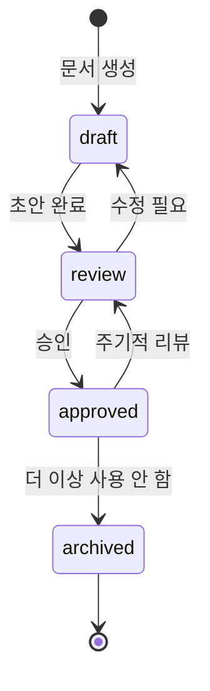
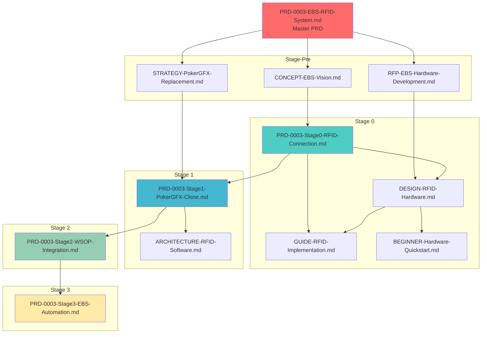

# EBS 문서 관리 시스템

**Version**: 1.0.0
**Last Updated**: 2026-02-02
**Owner**: EBS Project Team

---

## 목차

1. [개요](#개요)
2. [YAML Frontmatter 표준](#yaml-frontmatter-표준)
3. [문서 상태 관리](#문서-상태-관리)
4. [버전 관리 규칙](#버전-관리-규칙)
5. [의존성 관리](#의존성-관리)
6. [리뷰 프로세스](#리뷰-프로세스)
7. [자동화 도구](#자동화-도구)

---

## 개요

### 관리 전략

| 관리 영역 | 방식 | 도구 |
|----------|------|------|
| **문서 상태** | YAML frontmatter + 중앙 대시보드 | Git, Manual Update |
| **버전 관리** | Git commit + Semantic Versioning | Git tags, frontmatter |
| **리뷰 주기** | Stage PRD 분기 1회, Master PRD 반기 1회 | Calendar, Checklist |
| **의존성 추적** | 명시적 문서 링크 + 의존성 맵 | Mermaid 다이어그램 |

### 핵심 원칙

1. **Single Source of Truth**: 각 정보는 하나의 문서에만 존재
2. **명시적 의존성**: 모든 문서 간 관계를 명시
3. **자동화 우선**: 수동 작업 최소화
4. **Git 기반**: 모든 변경사항은 Git으로 추적

---

## YAML Frontmatter 표준

### 필수 필드

모든 문서는 다음 필수 필드를 포함해야 합니다:

```yaml
---
# 문서 메타데이터
doc_type: "prd" | "architecture" | "guide" | "concept" | "strategy" | "rfp" | "operations"
doc_id: "PRD-0003-Stage0"  # 고유 식별자
version: "2.1.0"            # Semantic Versioning
status: "draft" | "review" | "approved" | "archived"

# 소유권 및 관리
owner: "EBS Project Team"
last_updated: "2026-02-02"
next_review: "2026-04-01"   # 다음 리뷰 예정일

# Stage 정보 (해당 시)
stage: "pre" | "0" | "1" | "2" | "3"
phase: "planning" | "development" | "testing" | "production"

# 의존성 (선택)
depends_on:
  - "PRD-0003-EBS-RFID-System.md"
  - "docs/1-stage0/DESIGN-RFID-Hardware.md"

related_docs:
  - "docs/1-stage0/GUIDE-RFID-Implementation.md"
  - "docs/2-stage1/PRD-0003-Stage1-PokerGFX-Clone.md"
---
```

### 문서 타입별 추가 필드

#### PRD (Product Requirements Document)

```yaml
---
doc_type: "prd"
doc_id: "PRD-0003-Stage0"

# PRD 특화 필드
priority: "critical" | "high" | "medium" | "low"
target_date: "2026-06-30"
completion: 0  # 0-100%

# 주요 이해관계자
stakeholders:
  - "방송팀"
  - "기술팀"
  - "하드웨어 팀"

# 승인 이력
approvals:
  - reviewer: "김방송"
    date: "2026-01-15"
    status: "approved"
---
```

#### Architecture 문서

```yaml
---
doc_type: "architecture"
doc_id: "ARCH-RFID-Software"

# 아키텍처 특화 필드
architecture_layer: "hardware" | "firmware" | "backend" | "frontend" | "fullstack"
technology_stack:
  - "ESP32"
  - "FastAPI"
  - "React"

# 아키텍처 결정 기록
adr_refs:
  - "ADR-001: ESP32 선택 이유"
  - "ADR-002: WebSocket vs HTTP Polling"
---
```

#### Guide 문서

```yaml
---
doc_type: "guide"
doc_id: "GUIDE-RFID-Implementation"

# 가이드 특화 필드
audience: "beginner" | "intermediate" | "advanced"
estimated_time: "2 hours"  # 실습 예상 시간
prerequisites:
  - "Arduino IDE 설치"
  - "ESP32 보드 준비"
---
```

#### Operations 문서

```yaml
---
doc_type: "operations"
doc_id: "OPS-Document-Management"

# 운영 특화 필드
update_frequency: "quarterly" | "monthly" | "as-needed"
automation_level: "manual" | "semi-auto" | "fully-auto"
---
```

---

## 문서 상태 관리

### 상태 정의

| 상태 | 설명 | 다음 단계 | 책임자 |
|------|------|----------|--------|
| **draft** | 초안 작성 중 | review | 작성자 |
| **review** | 리뷰 진행 중 | approved / draft | 리뷰어 |
| **approved** | 승인 완료 | archived (필요 시) | Owner |
| **archived** | 더 이상 사용 안 함 | - | Owner |

### 상태 전환 규칙



### 중앙 대시보드

위치: `docs/operations/DOCUMENT-STATUS.md`

```markdown
# EBS 문서 상태 대시보드

**Last Updated**: 2026-02-02

## Master Documents

| 문서 | 버전 | 상태 | 다음 리뷰 | 담당자 |
|------|------|------|----------|--------|
| PRD-0003-EBS-RFID-System.md | 4.0.0 | approved | 2026-07-01 | EBS Team |

## Stage-Pre Documents

| 문서 | 버전 | 상태 | 다음 리뷰 | 담당자 |
|------|------|------|----------|--------|
| CONCEPT-EBS-Vision.md | 2.0.0 | approved | 2026-04-01 | EBS Team |
| RFP-EBS-Hardware-Development.md | 1.2.0 | approved | 2026-03-01 | 구매팀 |
| STRATEGY-PokerGFX-Replacement.md | 3.0.0 | approved | 2026-04-01 | 기술팀 |

## Stage 0 Documents

| 문서 | 버전 | 상태 | 다음 리뷰 | 담당자 |
|------|------|------|----------|--------|
| PRD-0003-Stage0-RFID-Connection.md | 2.1.0 | approved | 2026-04-01 | 하드웨어팀 |
| DESIGN-RFID-Hardware.md | 1.5.0 | review | 2026-03-01 | 하드웨어팀 |
| GUIDE-RFID-Implementation.md | 1.3.0 | approved | - | 기술팀 |
| BEGINNER-Hardware-Quickstart.md | 1.1.0 | approved | - | 기술팀 |

## 상태 요약

| 상태 | 문서 수 |
|------|---------|
| draft | 2 |
| review | 3 |
| approved | 15 |
| archived | 1 |

**Total**: 21 documents
```

### 대시보드 업데이트 규칙

- **빈도**: 문서 상태 변경 시 즉시 업데이트
- **책임자**: 문서 변경자
- **자동화**: `tools/update_status_dashboard.py` 스크립트 사용 (향후 구현)

---

## 버전 관리 규칙

### Semantic Versioning

```
MAJOR.MINOR.PATCH

예: 2.1.3
```

| 버전 | 변경 기준 | 예시 |
|------|----------|------|
| **MAJOR** | 문서 구조 대폭 변경, 이전 버전과 호환 불가 | 1.x.x → 2.0.0 |
| **MINOR** | 새 섹션 추가, 기존 내용 확장 | 2.1.x → 2.2.0 |
| **PATCH** | 오타 수정, 링크 업데이트, 마이너 개선 | 2.1.3 → 2.1.4 |

### 버전 업데이트 프로세스

1. **문서 수정 완료**
   ```bash
   # 1. 문서 내 frontmatter 버전 업데이트
   version: "2.2.0"
   last_updated: "2026-02-02"
   ```

2. **Git Commit**
   ```bash
   git add docs/1-stage0/PRD-0003-Stage0-RFID-Connection.md
   git commit -m "docs(stage-0): update PRD Stage 0 to v2.2.0 - add security requirements"
   ```

3. **Tag 추가 (MAJOR/MINOR 변경 시)**
   ```bash
   git tag -a doc-PRD-Stage0-v2.2.0 -m "Release PRD Stage 0 v2.2.0"
   git push origin doc-PRD-Stage0-v2.2.0
   ```

4. **대시보드 업데이트**
   ```bash
   # docs/operations/DOCUMENT-STATUS.md 업데이트
   git add docs/operations/DOCUMENT-STATUS.md
   git commit -m "docs(ops): update document status dashboard"
   ```

### Git Commit Convention

```
docs(<scope>): <subject>

<body>

<footer>
```

| Scope | 설명 | 예시 |
|-------|------|------|
| `stage-pre` | Stage-Pre 문서 | `docs(stage-pre): update CONCEPT-EBS-Vision` |
| `stage-0` | Stage 0 문서 | `docs(stage-0): add RFID wiring diagram` |
| `stage-1` | Stage 1 문서 | `docs(stage-1): update PokerGFX architecture` |
| `ops` | 운영 문서 | `docs(ops): update document status dashboard` |
| `master` | Master PRD | `docs(master): update EBS master roadmap` |

### 버전 히스토리 조회

```bash
# 특정 문서의 모든 버전 조회
git log --oneline --all --grep="PRD-Stage0" -- "docs/1-stage0/PRD-0003-Stage0-RFID-Connection.md"

# 특정 버전 체크아웃
git show doc-PRD-Stage0-v2.1.0:docs/1-stage0/PRD-0003-Stage0-RFID-Connection.md

# 버전 간 차이 비교
git diff doc-PRD-Stage0-v2.1.0 doc-PRD-Stage0-v2.2.0
```

---

## 의존성 관리

### 의존성 맵



### 의존성 유형

| 유형 | 설명 | Frontmatter 필드 |
|------|------|-----------------|
| **depends_on** | 필수 선행 문서 (이 문서 없이는 이해 불가) | `depends_on:` |
| **related_docs** | 관련 참조 문서 (선택적) | `related_docs:` |
| **supersedes** | 대체하는 구 문서 | `supersedes:` |
| **superseded_by** | 대체된 문서 (archived 시) | `superseded_by:` |

### 의존성 업데이트 규칙

1. **선행 문서 변경 시**
   - 의존 문서의 `depends_on` 필드가 최신 버전을 가리키는지 확인
   - 영향받는 문서 리스트 생성 → 리뷰 예약

2. **문서 아카이브 시**
   - `superseded_by` 필드에 대체 문서 명시
   - 의존하는 모든 문서 업데이트

3. **순환 의존성 금지**
   - A → B → A 형태 금지
   - 의존성 그래프는 DAG (Directed Acyclic Graph)여야 함

### 의존성 검증 스크립트 (향후 구현)

```python
# tools/validate_dependencies.py
# 1. YAML frontmatter 파싱
# 2. depends_on 필드 추출
# 3. 순환 의존성 검사
# 4. 존재하지 않는 문서 참조 경고
```

---

## 리뷰 프로세스

### 리뷰 주기

| 문서 타입 | 리뷰 주기 | 담당자 | 트리거 |
|----------|----------|--------|--------|
| **Master PRD** | 반기 1회 (1월, 7월) | EBS Team Lead | Calendar |
| **Stage PRD** | 분기 1회 (3, 6, 9, 12월) | Stage Owner | Calendar |
| **Architecture** | 필요 시 (기술 변경 시) | Tech Lead | On-demand |
| **Guide** | 필요 시 (피드백 수집 시) | 작성자 | On-demand |
| **Operations** | 분기 1회 | Operations Lead | Calendar |

### 리뷰 체크리스트

#### 1. Master PRD 리뷰

**파일**: `docs/PRD-0003-EBS-RFID-System.md`
**주기**: 반기 1회 (1월 15일, 7월 15일)

```markdown
## Master PRD Review Checklist

**Date**: 2026-07-15
**Reviewer**: EBS Team Lead
**Version**: 4.0.0 → 4.1.0

### 전략적 정렬

- [ ] 비즈니스 목표가 현재 조직 전략과 일치하는가?
- [ ] WSOP Studio 내재화 타임라인이 현실적인가?
- [ ] ROI 계산이 최신 비용 정보를 반영하는가?

### 기술적 타당성

- [ ] 기술 스택 선택이 여전히 최적인가?
- [ ] 하드웨어 공급망이 안정적인가?
- [ ] 보안 요구사항이 최신 표준을 만족하는가?

### Stage별 진행도

- [ ] Stage 0 완료율: ___%
- [ ] Stage 1 착수 준비도: ___%
- [ ] Stage 2-3 계획 유효성: Yes / No

### 의존성 검증

- [ ] Stage-Pre 문서들이 모두 최신 상태인가?
- [ ] 외부 시스템 (WSOP+, PokerGFX) 상태 변경 없는가?

### 문서 품질

- [ ] 오타, 깨진 링크 없음
- [ ] 다이어그램 최신 상태
- [ ] 용어 일관성 유지

### 다음 단계

- [ ] 버전 업데이트 (MAJOR / MINOR / PATCH)
- [ ] 이해관계자 공유
- [ ] 다음 리뷰 예약: 2027-01-15
```

#### 2. Stage PRD 리뷰

**파일**: `docs/1-stage0/PRD-0003-Stage0-RFID-Connection.md`
**주기**: 분기 1회 (3, 6, 9, 12월)

```markdown
## Stage PRD Review Checklist

**Date**: 2026-04-01
**Reviewer**: Hardware Team Lead
**Version**: 2.1.0 → 2.2.0
**Stage**: Stage 0

### 목표 달성도

- [ ] 주요 마일스톤 완료율: ___%
- [ ] 타임라인 준수: Yes / No / Delayed
- [ ] 예산 준수: Yes / No

### 요구사항 변경

- [ ] 새로운 요구사항 추가됨: Yes / No
  - [ ] 추가 요구사항 문서화 완료
- [ ] 기존 요구사항 삭제됨: Yes / No
  - [ ] 삭제 이유 문서화 완료

### 기술적 이슈

- [ ] 하드웨어 문제: None / Minor / Major
- [ ] 소프트웨어 문제: None / Minor / Major
- [ ] 통합 문제: None / Minor / Major

### 의존성 검증

- [ ] Master PRD 변경사항 반영됨
- [ ] Stage-Pre 문서 변경사항 반영됨
- [ ] 다음 Stage(Stage 1) 영향도: None / Low / High

### 리스크 평가

- [ ] 신규 리스크 식별: __개
- [ ] 기존 리스크 상태 업데이트 완료
- [ ] 완화 조치 실행 중: Yes / No

### 다음 단계

- [ ] 버전 업데이트 (MAJOR / MINOR / PATCH)
- [ ] 팀 공유 (Slack, Email)
- [ ] 다음 리뷰 예약: 2026-07-01
```

#### 3. Architecture 문서 리뷰

**파일**: `docs/2-stage1/ARCHITECTURE-RFID-Software.md`
**트리거**: 기술 스택 변경, 아키텍처 결정 필요 시

```markdown
## Architecture Review Checklist

**Date**: 2026-02-15
**Reviewer**: Tech Lead
**Version**: 1.0.0 → 1.1.0

### 아키텍처 결정 (ADR)

- [ ] 모든 주요 결정이 ADR로 문서화됨
- [ ] ADR 이유가 명확히 기술됨
- [ ] 대안 검토 과정 포함됨

### 기술 스택

- [ ] 라이브러리 버전 최신 상태
- [ ] Deprecated 기술 없음
- [ ] 라이선스 이슈 없음

### 확장성/성능

- [ ] 목표 latency 달성 가능: Yes / No
- [ ] 동시 접속자 수 충족: Yes / No
- [ ] 병목 지점 식별 완료

### 보안

- [ ] 인증/인가 설계 적절
- [ ] 데이터 암호화 적용
- [ ] 취약점 분석 완료

### 다음 단계

- [ ] 버전 업데이트
- [ ] 개발팀 공유
- [ ] 다음 리뷰: On-demand
```

### 리뷰 결과 처리

1. **승인 (Approved)**
   - Status: `review` → `approved`
   - Frontmatter에 approvals 추가
   - 다음 리뷰 예약

2. **수정 필요 (Changes Requested)**
   - Status: `review` → `draft`
   - 이슈 생성 (GitHub Issues)
   - 수정 후 재검토

3. **보류 (On Hold)**
   - Status: `review` 유지
   - 보류 이유 기록
   - 재검토 조건 명시

---

## 자동화 도구

### 현재 사용 가능

#### 1. PDF 처리 도구

위치: `tools/split_pdf.py`, `tools/extract_images.py`

```bash
# PDF 페이지 분할
python tools/split_pdf.py docs/PokerGFX_Security.pdf --pages 20

# PDF 이미지 추출
python tools/extract_images.py docs/PokerGFX_Security.pdf --output-dir docs/user-manual_images/
```

### 향후 구현 예정

#### 2. 문서 상태 대시보드 자동 업데이트

위치: `tools/update_status_dashboard.py`

```bash
# 모든 문서의 frontmatter 스캔 → 대시보드 업데이트
python tools/update_status_dashboard.py

# 특정 Stage만 업데이트
python tools/update_status_dashboard.py --stage 0
```

#### 3. 의존성 검증

위치: `tools/validate_dependencies.py`

```bash
# 순환 의존성, 깨진 링크 검사
python tools/validate_dependencies.py

# 특정 문서 의존성 트리 출력
python tools/validate_dependencies.py --doc "PRD-0003-Stage0"
```

#### 4. 버전 자동 업데이트

위치: `tools/bump_version.py`

```bash
# PATCH 버전 자동 증가
python tools/bump_version.py docs/1-stage0/PRD-0003-Stage0-RFID-Connection.md --patch

# MINOR 버전 자동 증가
python tools/bump_version.py docs/1-stage0/PRD-0003-Stage0-RFID-Connection.md --minor

# Git tag 자동 생성
python tools/bump_version.py docs/1-stage0/PRD-0003-Stage0-RFID-Connection.md --minor --tag
```

#### 5. 리뷰 알림

위치: `tools/review_reminder.py`

```bash
# 다음 리뷰 예정일 기준 알림 생성 (Slack, Email)
python tools/review_reminder.py --days-before 7

# 특정 문서 리뷰 알림
python tools/review_reminder.py --doc "PRD-0003-Stage0"
```

---

## 부록

### A. 문서 템플릿

#### PRD 템플릿

위치: `docs/templates/PRD-TEMPLATE.md`

```markdown
---
doc_type: "prd"
doc_id: "PRD-XXXX-YourFeature"
version: "1.0.0"
status: "draft"
owner: "Your Name"
last_updated: "2026-XX-XX"
next_review: "2026-XX-XX"
stage: "0"
phase: "planning"
priority: "high"
target_date: "2026-XX-XX"
completion: 0

depends_on:
  - "docs/PRD-0003-EBS-RFID-System.md"

related_docs:
  - "docs/1-stage0/DESIGN-RFID-Hardware.md"

stakeholders:
  - "Team A"
  - "Team B"
---

# [Feature Name] - PRD

## 개요

### 목적

### 배경

## 요구사항

### 필수 요구사항 (Must Have)

### 선택 요구사항 (Nice to Have)

## 기술 스펙

## 타임라인

## 리스크

## 성공 지표
```

### B. Frontmatter 유효성 검사

Python 스크립트로 모든 문서의 YAML frontmatter 검증:

```python
# tools/validate_frontmatter.py
import yaml
import glob

REQUIRED_FIELDS = ["doc_type", "doc_id", "version", "status", "owner", "last_updated"]

for doc in glob.glob("docs/**/*.md", recursive=True):
    with open(doc, "r", encoding="utf-8") as f:
        content = f.read()
        if content.startswith("---"):
            yaml_end = content.find("---", 3)
            yaml_content = content[3:yaml_end]
            metadata = yaml.safe_load(yaml_content)

            for field in REQUIRED_FIELDS:
                if field not in metadata:
                    print(f"[ERROR] {doc}: Missing field '{field}'")
```

### C. 문서 간 링크 검증

```python
# tools/validate_links.py
import re
import os

def validate_links(doc_path):
    with open(doc_path, "r", encoding="utf-8") as f:
        content = f.read()
        links = re.findall(r'\[.*?\]\((.*?)\)', content)

        for link in links:
            if link.startswith("http"):
                continue  # 외부 링크는 스킵

            full_path = os.path.join(os.path.dirname(doc_path), link)
            if not os.path.exists(full_path):
                print(f"[ERROR] {doc_path}: Broken link '{link}'")
```

---

## 변경 이력

| 버전 | 날짜 | 변경 내용 | 작성자 |
|------|------|----------|--------|
| 1.0.0 | 2026-02-02 | 초안 작성 | EBS Team |

---

**문의**: EBS Project Team
**마지막 업데이트**: 2026-02-02
