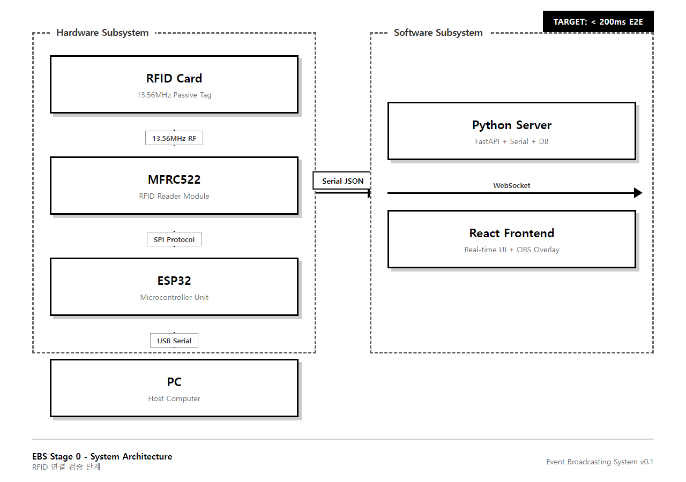
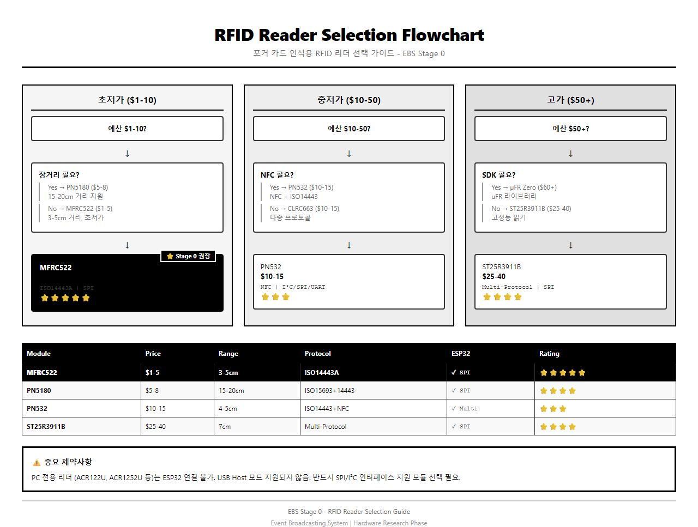
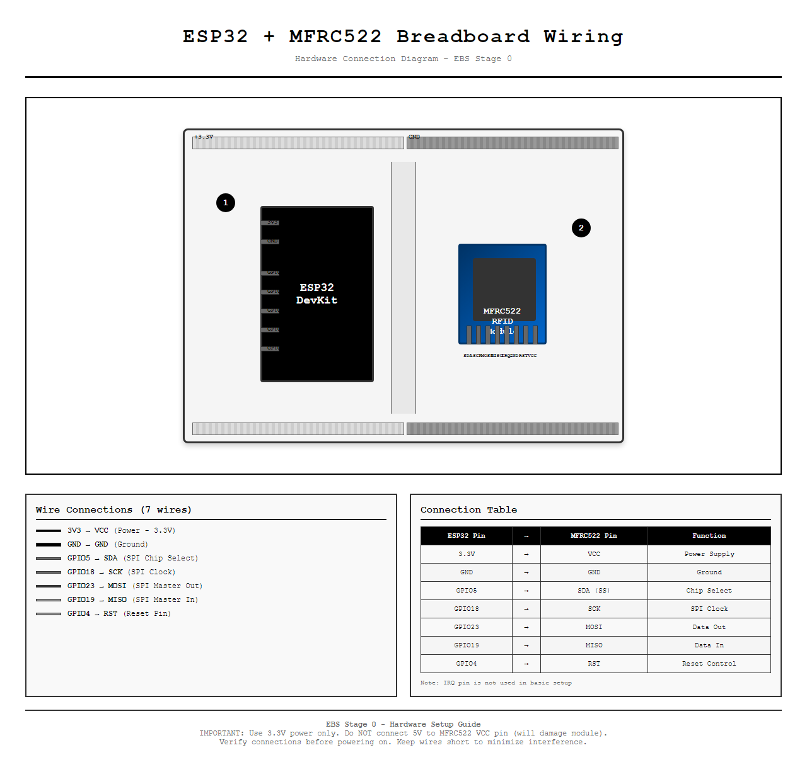

# EBS - RFID 포커 카드 리더 하드웨어 설계 가이드

**Version**: 2.4.0
**작성일**: 2026-01-22
**수정일**: 2026-01-29
**관련 PRD**: [PRD-0003-Stage0-RFID-Connection.md](PRD-0003-Stage0-RFID-Connection.md)

---

## 1. 시스템 개요

### 1.1 하드웨어 블록 다이어그램


*그림 1.1: EBS Stage 0 시스템 아키텍처 - RFID 카드부터 React UI까지의 데이터 흐름*

### 1.2 핵심 컴포넌트

| 컴포넌트 | 역할 | 선택 이유 |
|----------|------|----------|
| **ESP32** | 메인 컨트롤러 | WiFi/BT 내장, SPI 지원, 저렴 |
| **MFRC522** | RFID 리더 | 13.56MHz 표준, 저렴, 라이브러리 풍부 |
| **RFID Tag** | 카드 내장 태그 | MIFARE Classic/Ultralight 호환 |

### 1.3 MCU (마이크로컨트롤러) 선택 가이드

> **목적**: ESP32 외 대안 MCU 검토 및 프로젝트 요구사항에 맞는 선택 지원
> **업데이트**: 2026-01-28

---

#### 1.3.1 MCU 전체 비교표

> 🎯 **Stage 0 권장**: ESP32-WROOM-32 (WiFi+BT 내장, 풍부한 예제, 최적 가성비)

**가격대별 MCU 분류:**

| Tier | 가격 | MCU | 특징 |
|------|------|-----|------|
| **Tier 1** 초저가 | $2-5 | ESP8266 ⭐⭐⭐ | WiFi만, BT 없음, 3.3V |
| | | Arduino Nano ⭐⭐ | WiFi/BT 없음, 5V (레벨 변환 필요!) |
| **Tier 2** 저가 | $4-8 | ESP32-C3 ⭐⭐⭐⭐ | RISC-V, WiFi+BLE, 저전력 |
| | | Raspberry Pi Pico ⭐⭐⭐ | WiFi 없음, PIO 강점, MicroPython |
| | | Raspberry Pi Pico W ⭐⭐⭐⭐ | WiFi 추가, $6 |
| **Tier 3** 중저가 | $5-15 | **ESP32-WROOM-32** ⭐⭐⭐⭐⭐ | 듀얼코어, WiFi+BT, 최다 예제 **← 권장** |
| | | ESP32-S3 ⭐⭐⭐⭐ | AI 가속, USB OTG, 고성능 |
| | | ESP32-C6 ⭐⭐⭐⭐ | WiFi 6, Thread/Zigbee, Matter 지원 |
| **Tier 4** 중가 | $5-30 | STM32 Blue Pill ⭐⭐⭐ | ARM Cortex-M3, 산업용 신뢰성 |
| | | Teensy 4.0 ⭐⭐⭐ | 600MHz, 고성능, USB MIDI/HID |

---

#### 1.3.2 상세 비교

| MCU | 가격 | CPU | WiFi | BT | SPI | 전압 | MFRC522 호환 | 포커 적합성 |
|-----|------|-----|------|----|----|------|-------------|------------|
| **ESP32-WROOM-32** ⭐ | $5-10 | 듀얼코어 240MHz | ✅ | ✅ | ✅ | 3.3V | ✅ 최적 | ⭐⭐⭐⭐⭐ |
| ESP32-C3 | $4-6 | RISC-V 160MHz | ✅ | BLE | ✅ | 3.3V | ✅ | ⭐⭐⭐⭐ |
| ESP32-S3 | $7-14 | 듀얼코어 240MHz | ✅ | BLE 5.0 | ✅ | 3.3V | ✅ | ⭐⭐⭐⭐ |
| ESP32-C6 | $6-11 | RISC-V 160MHz | WiFi 6 | BLE 5.3 | ✅ | 3.3V | ✅ | ⭐⭐⭐⭐ |
| ESP8266 | $2-5 | 싱글코어 80MHz | ✅ | ❌ | ✅ | 3.3V | ✅ | ⭐⭐⭐ |
| Raspberry Pi Pico W | $6 | 듀얼코어 133MHz | ✅ | ❌ | ✅ | 3.3V | ✅ | ⭐⭐⭐ |
| Arduino Nano | $3-5 | ATmega328P 16MHz | ❌ | ❌ | ✅ | 5V | ⚠️ 레벨변환 | ⭐⭐ |
| STM32 Blue Pill | $3-8 | ARM Cortex-M3 72MHz | ❌ | ❌ | ✅ | 3.3V | ✅ | ⭐⭐⭐ |
| Teensy 4.0 | $20-30 | ARM Cortex-M7 600MHz | ❌ | ❌ | ✅ | 3.3V | ✅ | ⭐⭐⭐ |

---

#### 1.3.3 MCU별 상세 분석

**ESP32-WROOM-32 (Stage 0 권장)** ⭐⭐⭐⭐⭐
```
장점:
├── WiFi + Bluetooth Classic + BLE 모두 내장
├── 가장 많은 튜토리얼/예제 (Random Nerd Tutorials 등)
├── Arduino IDE 완벽 지원
├── 듀얼코어 240MHz (여유로운 처리 성능)
├── 3.3V 동작 (MFRC522와 직접 연결)
└── 저렴한 가격 ($5-10)

단점:
├── 전력 소비 높음 (WiFi 시 240mA 피크)
└── 구형 WiFi 4 (802.11 b/g/n)

결론: Stage 0 최적 선택. 변경 불필요.
```

**ESP32-C3 - 저전력 대안** ⭐⭐⭐⭐
```
장점:
├── RISC-V 아키텍처 (최신, 효율적)
├── ESP32보다 저전력
├── WiFi + BLE 지원
├── 더 저렴 ($4-6)
└── 보안 기능 내장 (RSA, ECC, AES)

단점:
├── 싱글코어 (듀얼코어 아님)
├── Bluetooth Classic 미지원
├── GPIO 핀 적음 (22개 vs ESP32 34개)
└── 예제/커뮤니티 ESP32보다 적음

권장: 배터리 구동 필요 시 고려
```

**ESP32-S3 - 고성능 대안** ⭐⭐⭐⭐
```
장점:
├── AI/ML 가속 기능 (벡터 명령어)
├── USB OTG 내장 (별도 USB-Serial 칩 불필요)
├── 512KB SRAM (ESP32의 2배)
├── BLE 5.0 지원
└── 카메라 인터페이스 (향후 영상 분석 가능)

단점:
├── ESP32보다 비쌈 ($7-14)
├── 과잉 스펙 (Stage 0에는 불필요)
└── 전력 소비 높음

권장: Stage 2+ 영상 분석/AI 기능 추가 시
```

**ESP32-C6 - 차세대 IoT 대안** ⭐⭐⭐⭐
```
장점:
├── WiFi 6 지원 (최신)
├── Thread/Zigbee (802.15.4) 지원
├── Matter 네이티브 (스마트홈 표준)
├── BLE 5.3 (최신)
└── 듀얼코어 RISC-V (고성능 + 저전력)

단점:
├── 아직 예제/라이브러리 적음
├── ESP32보다 약간 비쌈
└── WiFi 6 이점은 라우터도 필요

권장: 스마트홈 통합, Matter 지원 필요 시
```

**Raspberry Pi Pico W** ⭐⭐⭐
```
장점:
├── MicroPython/C SDK 우수한 문서화
├── PIO (Programmable I/O) - 유연한 프로토콜 구현
├── 저전력 (25-30mA 활성, <50µA 딥슬립)
├── 저렴 ($6)
└── Raspberry Pi 커뮤니티 지원

단점:
├── Bluetooth 미지원
├── Arduino IDE 지원 제한적
├── MFRC522 라이브러리 MicroPython 버전 필요
└── ESP32 대비 예제 적음

권장: MicroPython 선호 시, 저전력 필요 시
```

**Arduino Nano** ⭐⭐
```
장점:
├── Arduino 생태계 완벽 지원
├── 매우 저렴 ($3-5)
├── 초보자 친화적
└── 안정적

단점:
├── WiFi/Bluetooth 없음! (별도 모듈 필요)
├── 5V 동작 → MFRC522에 레벨 변환 필요!
├── 16MHz (저성능)
├── RAM 2KB (매우 제한적)
└── 무선 통신 시 복잡도 증가

⚠️ 경고: 5V 직접 연결 시 MFRC522 손상
          반드시 3.3V 레벨 시프터 사용

권장: 교육 목적 외 비권장
```

**STM32 Blue Pill** ⭐⭐⭐
```
장점:
├── 산업용 신뢰성 (ARM Cortex-M3)
├── 저렴 ($3-8)
├── 많은 GPIO (37개)
├── 3.3V 동작
└── 프로페셔널 개발 환경 (STM32CubeIDE)

단점:
├── WiFi/Bluetooth 없음! (별도 모듈 필요)
├── Arduino보다 설정 복잡
├── MFRC522 라이브러리 포팅 필요
└── 초보자에게 어려움

권장: 산업용/상용 제품 개발 시
```

---

#### 1.3.4 Stage별 MCU 권장

**Stage별 MCU 권장:**

| Stage | 목표 | 권장 MCU | 대안 |
|-------|------|----------|------|
| **Stage 0** (현재) | 하드웨어 검증 | ESP32-WROOM-32 ($5-10) | 없음 (변경 불필요) |
| **Stage 1** | PokerGFX 복제 | ESP32-WROOM-32 유지 | ESP32-S3 (USB OTG), ESP32-C3 (저전력) |
| **Stage 2** | WSOP+ 연동 | ESP32-S3 (AI 기능, 고성능) | ESP32-C6 (Matter/Thread 연동) |
| **Stage 3** | 자동화 시스템 | ESP32-S3 + 커스텀 PCB | STM32 계열 (산업용 인증) |

---

#### 1.3.5 MCU 선택 의사결정 플로우차트


*그림 1.2: MCU 선택 의사결정 가이드 - Stage 0 권장: ESP32-WROOM-32*

---

#### 1.3.6 MCU 구매 링크 모음

| MCU | AliExpress | Amazon | 국내 |
|-----|------------|--------|------|
| **ESP32-WROOM-32** | [$2-6](https://www.aliexpress.com/item/32864722159.html) | [$8-12](https://www.amazon.com/s?k=esp32+wroom+32) | [디바이스마트](https://www.devicemart.co.kr) |
| **ESP32-C3** | [$2-5](https://www.aliexpress.com/item/1005004894299449.html) | [$6-10](https://www.amazon.com/s?k=esp32-c3) | - |
| **ESP32-S3** | [$9-15](https://www.aliexpress.com/item/1005004025123046.html) | [$10-15](https://www.amazon.com/s?k=esp32-s3) | - |
| **Raspberry Pi Pico W** | - | [$6](https://www.amazon.com/s?k=raspberry+pi+pico+w) | [엘레파츠](https://www.eleparts.co.kr) |
| **STM32 Blue Pill** | [$5-8](https://www.aliexpress.com/item/32246273606.html) | [$8-12](https://www.amazon.com/s?k=stm32+blue+pill) | - |

> **주의**: 가격은 2026-01-29 기준이며 변동될 수 있습니다. 링크가 유효하지 않은 경우 제품명으로 검색하세요.

---

#### 1.3.7 참고 자료 (MCU)

| 리소스 | 용도 |
|--------|------|
| [ESP32 공식 문서](https://docs.espressif.com/projects/esp-idf/en/latest/esp32/) | ESP32 개발 |
| [Random Nerd Tutorials - ESP32 MFRC522](https://randomnerdtutorials.com/esp32-mfrc522-rfid-reader-arduino/) | ESP32 + RFID 튜토리얼 |
| [ESP32 버전 비교](https://www.espboards.dev/blog/esp32-soc-options/) | ESP32 변종 선택 |
| [Raspberry Pi Pico 문서](https://www.raspberrypi.com/documentation/microcontrollers/raspberry-pi-pico.html) | Pico 개발 |
| [MFRC522 Arduino 라이브러리](https://github.com/miguelbalboa/rfid) | 라이브러리 호환성 |

> **결론**: Stage 0에서는 **ESP32-WROOM-32** 유지를 권장합니다.
> WiFi+Bluetooth 내장, 풍부한 예제, 3.3V 직접 연결, 최적 가성비로 변경 필요 없습니다.
> 향후 Stage 2+에서 AI 기능이나 Matter 연동이 필요하면 ESP32-S3 또는 ESP32-C6로 업그레이드를 검토하세요.

---

### 1.4 RFID 리더 모듈 개발 가이드 (가격대별)

> **목적**: 예산과 요구사항에 맞는 최적의 **커스터마이징 가능한** RFID 리더 선택 지원
> **범위**: ESP32 연동 가능, SDK/라이브러리 제공, DIY 개발 가능 제품만 포함
> **제외**: PokerGFX, RF Poker 등 커스터마이징 불가능한 상용 통합 솔루션
> **업데이트**: 2026-01-28 (v2.1.0 - 개발 가능 제품으로 필터링)

---

#### 1.4.1 가격대별 전체 비교표

> ⚠️ **범위**: ESP32 연동 가능 + 커스터마이징 가능 제품만 포함

**가격대별 RFID 리더 분류:**

| Tier | 가격 | 모듈 | 비고 |
|------|------|------|------|
| **Tier 1** 초저가 | $1-5 | **MFRC522 (RC522)** ⭐⭐⭐⭐⭐ | 🎯 Stage 0 권장, ESP32 SPI 직접 연결 |
| | | RDM6300 (125kHz 전용) | ❌ 주파수 불일치로 비권장 |
| **Tier 2** 저가 | $5-10 | PN5180 ⭐⭐⭐⭐ | ESP32 SPI, 장거리 지원 |
| | | PN532 클론 | ESP32 SPI/I2C/UART |
| **Tier 3** 중저가 | $10-25 | PN532 정품 ⭐⭐⭐ | Adafruit 라이브러리 |
| | | CLRC663 | NXP 풀 프로토콜 |
| | | PN7150 | NFC Forum 완전 지원 |
| **Tier 4** 중가 | $25-60 | ST25R3911B ⭐⭐⭐⭐ | ESP32 샘플 코드 제공 |
| | | ST25R3916 | EMVCo 인증, STM32/ESP32 지원 |
| **Tier 5** 고가 | $60-200 | µFR Zero 시리즈 ⭐⭐⭐ | 완벽한 SDK, UART/USB 지원 |

> 📋 **참고**: PC 전용 USB 리더 (ACR122U, ACR1552U, RFIDeas pcProx)는 ESP32 연결 불가 - 테스트/개발 PC 용도만

> ❌ **제외**: 상용 통합 솔루션 (PokerGFX, RF Poker, Tableswin)은 완제품으로 커스터마이징 불가

---

#### 1.4.2 Tier 1: 초저가 ($1-5) - DIY/학습용

| 모듈 | 가격 | 읽기 거리 | 프로토콜 | 인터페이스 | ESP32 | 포커 적합성 |
|------|------|----------|----------|-----------|-------|------------|
| **MFRC522** ⭐ | $1-5 | 3-5cm | ISO14443A | SPI/I2C | ✅ 우수 | **최적** |
| RDM6300 | $2-4 | 5-8cm | 125kHz EM4100 | UART | ✅ | ❌ (주파수 불일치) |

**MFRC522 (RC522) - Stage 0 권장** ⭐⭐⭐⭐⭐
```
장점:
├── 최저가 (~$1 AliExpress, ~$5 국내)
├── 가장 많은 튜토리얼/예제 존재
├── Arduino RFID 라이브러리 (miguelbalboa/rfid) 완벽 지원
├── MIFARE Classic/Ultralight 호환
└── 하드웨어 초보자에게 최적

단점:
├── 저가 클론 품질 편차 큼 (불량률 높음)
├── 읽기 거리 제한 (4-5cm)
└── 5V 연결 시 영구 손상

구매처:
├── AliExpress: ~$1-2 (배송 2-4주)
├── Amazon: ~$5-8 (키트 포함)
└── 국내 (Coupang/디바이스마트): ₩5,000-15,000
```

---

#### 1.4.3 Tier 2: 저가 ($5-10) - 장거리/확장 기능

| 모듈 | 가격 | 읽기 거리 | 프로토콜 | 인터페이스 | ESP32 | 포커 적합성 |
|------|------|----------|----------|-----------|-------|------------|
| **PN5180** | $5-8 | 15-20cm | ISO15693+ISO14443 | SPI | ✅ | ⚠️ 카드 호환 주의 |
| PN532 클론 | $6-10 | 4-5cm | ISO14443+NFC | SPI/I2C/HSU | ✅ | ✅ |

**PN5180 - 장거리 필요 시** ⭐⭐⭐⭐
```
장점:
├── 최대 20cm 읽기 거리 (ISO15693 모드)
├── 다중 프로토콜 지원 (ISO15693 + ISO14443)
├── 동적 전력 제어 (DPC) - 배터리 절약
└── MFRC522보다 저렴하면서 고성능

단점:
├── ISO15693 장거리는 전용 카드 필요!
├── MIFARE 카드는 여전히 4-5cm 거리
├── 5V 안테나 전원 별도 필요
├── 라이브러리 지원 성장 중 (MFRC522보다 적음)
└── 복잡한 설정

⚠️ 주의: 기존 MIFARE 포커 카드로는 장거리 이점 없음
         ISO15693 카드를 별도 구매해야 20cm 거리 활용 가능

구매처:
├── AliExpress: ~$5-8
├── Amazon (AITRIP/Rakstore): ~$10-15
└── 국내: ₩12,000-20,000
```

**PN532 클론 - NFC 필요 시**
```
장점:
├── NFC P2P 모드 지원 (스마트폰 연동)
├── 3가지 인터페이스 (SPI/I2C/HSU)
├── Adafruit 라이브러리 지원
└── MIFARE + NFC 태그 모두 지원

단점:
├── 클론 품질 불안정
├── MFRC522 대비 읽기 거리 개선 없음
├── 정품 대비 기능 제한 가능
└── 크기가 더 큼
```

---

#### 1.4.4 Tier 3: 중저가 ($10-25) - 안정성/다중 프로토콜

| 모듈 | 가격 | 읽기 거리 | 프로토콜 | 인터페이스 | ESP32 | 포커 적합성 |
|------|------|----------|----------|-----------|-------|------------|
| **PN532 정품** | $10-15 | 4-5cm | ISO14443+NFC | SPI/I2C/HSU | ✅ | ✅ |
| **CLRC663** | $10-15 | 5-7cm | 다중 (풀 프로토콜) | SPI | ✅ | ✅ |
| **PN7150** | $15-25 | 5cm | ISO14443+NFC | I2C/SPI | ✅ | ✅ |

**PN532 정품 (Adafruit/Elechouse)** ⭐⭐⭐
```
장점:
├── 검증된 안정성 (정품 NXP 칩)
├── 완벽한 NFC 지원 (P2P, 카드 에뮬레이션)
├── Adafruit 라이브러리 (우수한 문서화)
├── 다양한 인터페이스 선택
└── 스마트폰 NFC 연동 가능

단점:
├── MFRC522 대비 3-5배 비쌈
├── 읽기 거리 개선 없음 (여전히 4-5cm)
├── 포커 테이블 용도에는 과잉 스펙
└── 크기가 큼

결론: 포커 전용이라면 MFRC522로 충분
      NFC 스마트폰 연동 필요 시에만 고려

구매처:
├── Adafruit: $39.95 (공식, 보드 포함)
├── Elechouse: ~$15 (모듈만)
├── Amazon: $15-25
└── 국내: ₩20,000-40,000
```

**CLRC663 - 다중 프로토콜** ⭐⭐⭐
```
장점:
├── NXP 풀 프로토콜 지원 (ISO14443 A/B, ISO15693, FeliCa)
├── MFRC522보다 긴 읽기 거리 (5-7cm)
├── 고급 암호화 지원
├── NXP 공식 라이브러리
└── 다양한 카드 타입 호환

단점:
├── 설정 복잡 (초보자 비추)
├── 라이브러리 문서화 부족 (영어)
├── 동작 전류 높음 (50mA)
└── 가격 대비 포커 용도 이점 적음

구매처:
├── AliExpress (Arduiner): ~$10-15
├── Mouser/Digikey: ~$20-30
└── 국내: ₩20,000-35,000
```

**PN7150 - PN532 후속** ⭐⭐⭐
```
장점:
├── NXP 최신 칩 (PN532 단종 대비)
├── 향후 지원 지속 예정
├── EMVCo 인증 (결제 단말 호환)
├── 저전력 모드 지원
└── 모든 NFC 모드 지원

단점:
├── 새로운 칩으로 예제 적음
├── PN532 라이브러리와 비호환
├── 가격 높음
└── 포커 용도에는 과잉

구매처:
├── Elechouse: ~$20-25
├── NXP 공식 EVK: ~$50+
└── 국내: 희귀 (수입 필요)
```

---

#### 1.4.5 Tier 4: 중가 ($25-60) - 고성능/SDK 포함

| 모듈 | 가격 | 읽기 거리 | 프로토콜 | 인터페이스 | ESP32 | 포커 적합성 |
|------|------|----------|----------|-----------|-------|------------|
| **ST25R3911B** | $20-40 | 최대 7cm | ISO14443+ISO15693+NFC | SPI | ✅ | ✅✅ |
| **ST25R3916** | $30-50 | 최대 7cm+ | EMVCo 인증 | SPI | ✅ | ✅✅ |

**ST25R3911B (Waveshare)** ⭐⭐⭐⭐
```
장점:
├── STMicroelectronics 고성능 칩
├── 최대 1.4W 출력 (긴 읽기 거리)
├── EMVCo 3.0 호환
├── ESP32 샘플 코드 제공
├── 저전력 웨이크업 기능
├── OLED 디스플레이 포함 키트
└── 장기적 안정성 우수

단점:
├── MFRC522보다 10배+ 비쌈
├── 설정 복잡
├── 키트가 아닌 모듈만 구하기 어려움
└── 문서 영어 위주

구매처:
├── Waveshare 공식: ~$25-40
├── Amazon: $30-50
└── 국내: ₩40,000-70,000

Stage 1+ 업그레이드 후보로 권장
```

**ST25R3916 - EMVCo 인증** ⭐⭐⭐⭐
```
장점:
├── EMVCo 3.0 아날로그/디지털 완전 인증
├── POS 단말 수준 성능
├── 확장된 읽기 범위
├── 완벽한 NFC Forum 지원
└── STM32 + ESP32 지원

단점:
├── 고가 ($30-50)
├── 포커 테이블에는 과잉 스펙
├── 전문가 수준 설정 필요
└── 모듈 단품 구하기 어려움

구매처:
├── Elechouse: ~$35-45
├── ST 공식 EVB: ~$60+
└── GitHub 오픈소스 PCB 설계 있음
```

---

#### 1.4.6 Tier 5: 고가 ($60-200) - 산업용/SDK 포함

| 솔루션 | 가격 | 특징 | ESP32 연결 | 포커 적합성 |
|--------|------|------|-----------|------------|
| **µFR Zero 시리즈** | $60-150 | SDK+다중 프로토콜 | ✅ UART | ✅✅ |

**µFR Zero 시리즈 (Digital Logic)** ⭐⭐⭐
```
장점:
├── 완벽한 SDK (C, Python, Java, .NET)
├── 크로스 플랫폼 라이브러리
├── 펌웨어 업그레이드 가능
├── 최대 70mm 읽기 거리 (µFR Zero CS)
├── AES256 암호화 지원
├── ESP32와 UART 연결 가능 ⬅️ 핵심
├── USB/UART/RS232 다양한 연결
└── 전문 기술 지원

단점:
├── 고가 ($60-150)
├── 과잉 스펙 (Stage 0에는 불필요)
├── 국내 구매 어려움
└── 개인 DIY보다 기업용

구매처:
├── D-Logic 공식: €50-120
├── Oz Robotics: ~$100-150
├── eBay: $60-100
└── 국내: 수입 필요

Stage 2+ 상용화 단계에서 고려
```

---

#### 1.4.7 참고: PC 전용 USB 리더 (ESP32 연결 불가)

> ⚠️ **주의**: 아래 제품들은 ESP32와 직접 연결 불가능합니다.
> PC 기반 개발/테스트 용도로만 사용하세요.

| 솔루션 | 가격 | 특징 | 용도 |
|--------|------|------|------|
| **ACR122U** | $30-50 | USB PC/SC 표준 | PC 테스트 |
| **ACR1552U** | $80-120 | ACR122U 후속 | PC 테스트 |
| **RFIDeas pcProx** | $100-200 | 산업용 | PC 기업용 |

```
⚠️ ESP32 프로젝트에서 PC 전용 리더 사용 시:
   └── ESP32 대신 PC를 직접 서버로 사용해야 함
   └── Serial 통신 불필요 (USB 직접 연결)
   └── Python + pyscard 라이브러리로 개발
   └── 포커 테이블 통합 어려움 (케이블 길이 제한)

권장: Stage 0-3에서는 ESP32 연결 가능 모듈 사용
     PC 전용 리더는 카드 UID 덤프/테스트 용도로만 활용
```

---

#### 1.4.8 Stage별 권장 모듈

**Stage별 RFID 리더 권장:**

| Stage | 목표 | 권장 | 대안 | 비고 |
|-------|------|------|------|------|
| **Stage 0** (현재) | 하드웨어 검증 | MFRC522 ($1-5) | 없음 | 최저가, 풍부한 예제 |
| **Stage 1** | PokerGFX 복제 | MFRC522 유지 | ST25R3911B ($25-40), PN532 정품 ($15) | 안정성/NFC 필요 시 |
| **Stage 2** | WSOP+ 연동 | ST25R3916 또는 µFR Zero | - | 장기 안정성, SDK 지원 |
| **Stage 3** | 자동화 시스템 | 커스텀 PCB (µFR Zero 또는 ST25R3916 기반) | - | 프로덕션 품질, 대량 생산 |

---

#### 1.4.9 의사결정 플로우차트


*그림 1.3: RFID 리더 선택 의사결정 가이드 - Stage 0 권장: MFRC522*

---

#### 1.4.10 구매 링크 모음

| 모듈 | AliExpress | Amazon | 국내 |
|------|------------|--------|------|
| **MFRC522** | [$1-2](https://www.aliexpress.com/item/1879927345.html) | [$5-8](https://www.amazon.com/s?k=mfrc522) | [디바이스마트](https://www.devicemart.co.kr) |
| **PN5180** | [$5-8](https://www.aliexpress.com/item/4001090372920.html) | [$10-15](https://www.amazon.com/dp/B09ZTYWDX2) | - |
| **PN532** | [$3-6](https://www.aliexpress.com/item/1005003750271048.html) | [$15-20](https://www.amazon.com/s?k=pn532) | [엘레파츠](https://www.eleparts.co.kr) |
| **ST25R3911B** | [$20-46](https://www.aliexpress.com/item/4000928010647.html) | [$30-50](https://www.amazon.com/s?k=ST25R3911B) | [Waveshare 한국](https://www.waveshare.com) |
| **µFR Zero** | - | - | [D-Logic 직구](https://www.d-logic.com) |

> **주의**: 가격은 2026-01-29 기준이며 변동될 수 있습니다. 링크가 유효하지 않은 경우 제품명으로 검색하세요.

---

#### 1.4.11 참고 자료 (Sources)

| 리소스 | 용도 |
|--------|------|
| [Seeed Studio - RC522 vs PN532](https://www.seeedstudio.com/blog/2020/05/29/which-is-best-rfid-nfc-mifare-chip-selection-guide-rc522-vs-pn532/) | 칩 비교 |
| [GitHub - miguelbalboa/rfid](https://github.com/miguelbalboa/rfid) | MFRC522 라이브러리 |
| [GitHub - playfultechnology/PN5180](https://github.com/playfultechnology/PN5180) | PN5180 라이브러리 |
| [ESP32 RFID Tutorial](https://esp32io.com/tutorials/esp32-rfid-nfc) | ESP32 연동 |
| [ST25R3916 ESP32 코드](https://www.elechouse.com/product/st25r3916_nfc_reader/) | ST 고급 모듈 |
| [D-Logic µFR SDK](https://www.d-logic.com/nfc-rfid-reader-sdk/) | µFR Zero 개발 |
| [NXP CLRC663 Application Note](https://www.nxp.com/docs/en/application-note/AN11022.pdf) | CLRC663 개발 |

> **결론**: Stage 0에서는 **MFRC522 ($1-5)** 로 시작하여 하드웨어 학습과 파이프라인 검증에 집중합니다.
> 이후 Stage에서 요구사항이 명확해지면 ST25R3911B 또는 µFR Zero로 업그레이드를 검토합니다.
>
> **참고**: PokerGFX, RF Poker 등 상용 통합 솔루션은 벤치마킹 대상이지만,
> 커스터마이징이 불가능하므로 본 가이드의 범위에서 제외되었습니다.

---

## 2. 컴포넌트 상세

### 2.1 ESP32 DevKit V1

```
┌─────────────────────────────────────────────────────────────┐
│                     ESP32 DevKit V1                         │
├─────────────────────────────────────────────────────────────┤
│                                                             │
│   ┌─────────────────────────────────────────────────────┐  │
│   │                    [USB-C/Micro]                     │  │
│   │                         │                            │  │
│   │    EN ●              ● GPIO23 (MOSI)                │  │
│   │    VP ●              ● GPIO22                       │  │
│   │    VN ●              ● GPIO1 (TX)                   │  │
│   │   D34 ●              ● GPIO3 (RX)                   │  │
│   │   D35 ●              ● GPIO21                       │  │
│   │   D32 ●              ● GND ●────────┐               │  │
│   │   D33 ●              ● GPIO19 (MISO)│               │  │
│   │   D25 ●              ● GPIO18 (SCK) │               │  │
│   │   D26 ●              ● GPIO5 (SS) ──┼──► MFRC522   │  │
│   │   D27 ●              ● GPIO17       │               │  │
│   │   D14 ●              ● GPIO16       │               │  │
│   │   D12 ●              ● GPIO4 (RST)──┘               │  │
│   │   D13 ●              ● GPIO2                        │  │
│   │   GND ●              ● GPIO15                       │  │
│   │   VIN ●              ● 3V3 ●────────► MFRC522 VCC   │  │
│   │                                                      │  │
│   └─────────────────────────────────────────────────────┘  │
│                                                             │
│   Specs:                                                    │
│   ├── CPU: Dual-core 240MHz                                │
│   ├── RAM: 520KB                                           │
│   ├── Flash: 4MB                                           │
│   ├── WiFi: 802.11 b/g/n                                   │
│   ├── Bluetooth: 4.2 + BLE                                 │
│   └── Power: 5V USB / 3.3V                                 │
│                                                             │
└─────────────────────────────────────────────────────────────┘
```

**핀 매핑 (SPI)**:

| ESP32 Pin | 기능 | MFRC522 Pin |
|-----------|------|-------------|
| GPIO 5 | SS (Chip Select) | SDA |
| GPIO 18 | SCK (Clock) | SCK |
| GPIO 23 | MOSI (Data Out) | MOSI |
| GPIO 19 | MISO (Data In) | MISO |
| GPIO 4 | RST (Reset) | RST |
| 3V3 | Power | VCC |
| GND | Ground | GND |

### 2.2 MFRC522 RFID 모듈

```
┌─────────────────────────────────────────────────────────────┐
│                      MFRC522 Module                         │
├─────────────────────────────────────────────────────────────┤
│                                                             │
│   ┌─────────────────────────────────────────────────────┐  │
│   │                                                      │  │
│   │              ┌──────────────────┐                   │  │
│   │              │   MFRC522 Chip   │                   │  │
│   │              └──────────────────┘                   │  │
│   │                                                      │  │
│   │   ┌────────────────────────────────────────────┐    │  │
│   │   │              Antenna Coil                  │    │  │
│   │   │         (13.56 MHz Inductive)              │    │  │
│   │   └────────────────────────────────────────────┘    │  │
│   │                                                      │  │
│   │   Pins: SDA SCK MOSI MISO IRQ GND RST VCC           │  │
│   │          │   │    │    │   │   │   │   │            │  │
│   └──────────┴───┴────┴────┴───┴───┴───┴───┴────────────┘  │
│                                                             │
│   Specifications:                                           │
│   ├── Frequency: 13.56 MHz                                 │
│   ├── Interface: SPI (up to 10 Mbps)                       │
│   ├── Read Distance: 0-50mm (typical 30mm)                 │
│   ├── Supported Cards: MIFARE Classic, Ultralight          │
│   ├── Operating Voltage: 3.3V                              │
│   ├── Operating Current: 13-26mA                           │
│   └── Standby Current: 10-13mA                             │
│                                                             │
└─────────────────────────────────────────────────────────────┘
```

**지원 프로토콜**:

| 프로토콜 | 카드 타입 | 용량 |
|----------|----------|------|
| MIFARE Classic 1K | S50 | 1KB |
| MIFARE Classic 4K | S70 | 4KB |
| MIFARE Ultralight | - | 64 bytes |
| MIFARE Mini | - | 320 bytes |
| NTAG213/215/216 | - | 144/504/888 bytes |

### 2.3 RFID 포커 카드 규격

```
┌─────────────────────────────────────────────────────────────┐
│                   RFID Poker Card Specs                     │
├─────────────────────────────────────────────────────────────┤
│                                                             │
│   ┌─────────────────────────────────────────────────────┐  │
│   │                                                      │  │
│   │     ┌─────────────────────────────────────────┐     │  │
│   │     │                                         │     │  │
│   │     │              A ♠                        │     │  │
│   │     │                                         │     │  │
│   │     │      ┌───────────────────────┐         │     │  │
│   │     │      │    RFID Inlay         │         │     │  │
│   │     │      │  (Embedded Antenna +  │         │     │  │
│   │     │      │   MIFARE Chip)        │         │     │  │
│   │     │      └───────────────────────┘         │     │  │
│   │     │                                         │     │  │
│   │     │                           A ♠          │     │  │
│   │     │                                         │     │  │
│   │     └─────────────────────────────────────────┘     │  │
│   │                                                      │  │
│   │     63mm x 88mm (Standard Poker Size)               │  │
│   │                                                      │  │
│   └─────────────────────────────────────────────────────┘  │
│                                                             │
│   Physical Specs:                                           │
│   ├── Size: 63 x 88 mm (Poker Standard)                    │
│   ├── Thickness: 0.28-0.32mm                               │
│   ├── Material: PVC + RFID Inlay                           │
│   └── Coating: Gloss/Matte Lamination                      │
│                                                             │
│   RFID Specs:                                               │
│   ├── Frequency: 13.56 MHz (ISO 14443A)                    │
│   ├── Chip: MIFARE Classic 1K / Ultralight                 │
│   ├── UID: 4 or 7 bytes (unique per card)                  │
│   ├── Memory: 1KB (or 64 bytes for Ultralight)             │
│   └── Read Range: 0-5cm (typical 2-3cm)                    │
│                                                             │
└─────────────────────────────────────────────────────────────┘
```

> **📌 Stage 0 카드 조달**: 기존 보유 RFID 포커 카드 사용
> - 신규 구매 불필요 (보유 제품 활용)
> - 카드 UID 사전 등록 후 테스트 진행
> - 보유 카드 규격이 상이할 경우 실측 후 문서 업데이트

---

## 3. 회로 설계

### 3.1 배선도 (Wiring Diagram)


*그림 3.1: ESP32 ↔ MFRC522 배선 연결도 - 7개 핀 연결*

### 3.2 브레드보드 레이아웃


*그림 3.2: ESP32 + MFRC522 브레드보드 배선도 - 7개 핀 연결 (3.3V 전원 필수)*

**핀 연결 요약:**

| ESP32 Pin | MFRC522 Pin | 기능 | 케이블 색상 |
|-----------|-------------|------|-------------|
| 3.3V | VCC | 전원 | 빨강 |
| GND | GND | 접지 | 검정 |
| GPIO5 | SDA (SS) | SPI 칩 선택 | 노랑 |
| GPIO18 | SCK | SPI 클럭 | 초록 |
| GPIO23 | MOSI | SPI 데이터 출력 | 파랑 |
| GPIO19 | MISO | SPI 데이터 입력 | 주황 |
| GPIO4 | RST | 리셋 | 흰색 |

> ⚠️ **주의**: MFRC522는 반드시 3.3V 전원 사용. 5V 연결 시 모듈 손상!

### 3.3 다중 리더 구성 (확장)

```
┌─────────────────────────────────────────────────────────────────────────┐
│                    Multi-Reader Configuration                           │
├─────────────────────────────────────────────────────────────────────────┤
│                                                                         │
│   테이블 상단 배치 (6인 테이블 예시)                                    │
│                                                                         │
│                        ┌─────────────┐                                  │
│                        │   Dealer    │                                  │
│                        │   Reader 0  │                                  │
│                        └─────────────┘                                  │
│                              │                                          │
│      ┌─────────────┐         │         ┌─────────────┐                 │
│      │  Player 1   │         │         │  Player 6   │                 │
│      │  Reader 1   │         │         │  Reader 6   │                 │
│      └─────────────┘         │         └─────────────┘                 │
│             │                │                │                         │
│             │        ┌───────┴───────┐        │                         │
│             │        │               │        │                         │
│             │        │    ESP32      │        │                         │
│             └───────▶│  (Master)     │◀───────┘                         │
│                      │               │                                  │
│      ┌───────────────┤               ├───────────────┐                 │
│      │               │               │               │                 │
│      ▼               └───────────────┘               ▼                 │
│  ┌─────────────┐                              ┌─────────────┐          │
│  │  Player 2   │                              │  Player 5   │          │
│  │  Reader 2   │                              │  Reader 5   │          │
│  └─────────────┘                              └─────────────┘          │
│        │                                            │                   │
│        │         ┌─────────────┐                   │                   │
│        │         │  Player 3   │                   │                   │
│        └────────▶│  Reader 3   │◀──────────────────┘                   │
│                  └─────────────┘                                        │
│                        │                                                │
│                        ▼                                                │
│                  ┌─────────────┐                                        │
│                  │  Player 4   │                                        │
│                  │  Reader 4   │                                        │
│                  └─────────────┘                                        │
│                                                                         │
│   다중 SPI 연결:                                                        │
│   ├── 공유: SCK, MOSI, MISO                                            │
│   └── 개별: SS (각 리더별 GPIO 핀)                                     │
│                                                                         │
│   Pin Assignment (7 Readers):                                          │
│   ├── Reader 0 (Dealer): GPIO 5                                        │
│   ├── Reader 1: GPIO 15                                                │
│   ├── Reader 2: GPIO 16                                                │
│   ├── Reader 3: GPIO 17                                                │
│   ├── Reader 4: GPIO 21                                                │
│   ├── Reader 5: GPIO 22                                                │
│   └── Reader 6: GPIO 25                                                │
│                                                                         │
└─────────────────────────────────────────────────────────────────────────┘
```

---

## 4. 전원 설계

### 4.1 전원 요구사항

| 컴포넌트 | 전압 | 전류 (typ) | 전류 (max) |
|----------|------|------------|------------|
| ESP32 | 5V (USB) / 3.3V | 80mA | 500mA (WiFi) |
| MFRC522 | 3.3V | 13mA | 26mA |
| **총계** | - | ~100mA | ~550mA |

### 4.2 전원 공급 옵션

```
┌─────────────────────────────────────────────────────────────────────────┐
│                        Power Supply Options                             │
├─────────────────────────────────────────────────────────────────────────┤
│                                                                         │
│   Option 1: USB 전원 (권장 - MVP)                                       │
│   ┌───────────┐      ┌───────────┐      ┌───────────┐                  │
│   │    PC     │──USB─│   ESP32   │──3.3V─│  MFRC522  │                  │
│   │   (5V)    │      │  (Onboard │      │           │                  │
│   └───────────┘      │   LDO)    │      └───────────┘                  │
│                      └───────────┘                                      │
│   장점: 간단, 추가 부품 불필요                                          │
│   단점: PC 필요, 이동성 제한                                            │
│                                                                         │
├─────────────────────────────────────────────────────────────────────────┤
│                                                                         │
│   Option 2: 외부 3.3V 전원                                              │
│   ┌───────────┐      ┌───────────┐      ┌───────────┐                  │
│   │  Battery  │──5V──│  AMS1117  │──3.3V─│  ESP32 +  │                  │
│   │  or Wall  │      │  (LDO)    │      │  MFRC522  │                  │
│   └───────────┘      └───────────┘      └───────────┘                  │
│   장점: 독립 동작, 이동성                                               │
│   단점: 추가 부품, 복잡성                                               │
│                                                                         │
├─────────────────────────────────────────────────────────────────────────┤
│                                                                         │
│   Option 3: 배터리 전원 (휴대용)                                        │
│   ┌───────────┐      ┌───────────┐      ┌───────────┐                  │
│   │  LiPo     │──3.7V│  TP4056   │──Boost│  ESP32    │                  │
│   │  Battery  │      │  Charger  │  3.3V │           │                  │
│   └───────────┘      └───────────┘      └───────────┘                  │
│   장점: 완전 무선                                                       │
│   단점: 충전 관리 필요, 복잡성 높음                                     │
│                                                                         │
└─────────────────────────────────────────────────────────────────────────┘
```

### 4.3 전원 안정화

```
주의사항:
1. MFRC522는 반드시 3.3V 사용 (5V 인가 시 손상)
2. ESP32 3.3V 출력은 최대 500mA (다중 리더 시 외부 전원 필요)
3. 전원 노이즈 감소를 위해 100nF 바이패스 커패시터 권장
```

### 4.4 안전 주의사항 (하드웨어 초보자 필독)

| 위험 | 결과 | 예방법 |
|------|------|--------|
| **5V를 MFRC522 VCC에 연결** | 모듈 영구 손상 | ESP32의 3.3V 핀만 사용 |
| **VCC-GND 단락 (쇼트)** | ESP32/PC USB 포트 손상 가능 | 전원 연결 전 배선 재확인 |
| **정전기** | ESP32/MFRC522 손상 | 작업 전 금속 접지 |
| **습기/물기** | 회로 손상 | 건조한 환경에서 작업 |

**전원 연결 전 체크리스트:**
```
□ VCC가 3.3V에 연결되었는가? (5V 아님!)
□ GND가 올바르게 연결되었는가?
□ VCC-GND가 직접 연결되지 않았는가? (멀티미터로 저항 측정)
□ SPI 핀들이 올바른 GPIO에 연결되었는가?
```

### 4.5 바이패스 커패시터 연결 (권장)

```
전원 안정화를 위한 100nF 세라믹 커패시터:

┌─────────────────────────────────────────────────────────────┐
│                                                             │
│   MFRC522 VCC ●────┬────● ESP32 3.3V                       │
│                    │                                        │
│                  ═══ 100nF (0.1uF)                          │
│                    │                                        │
│   MFRC522 GND ●────┴────● ESP32 GND                        │
│                                                             │
│   위치: 커패시터는 MFRC522 모듈 가까이 배치                 │
│   효과: 고주파 노이즈 제거, 인식 안정성 향상                │
│                                                             │
└─────────────────────────────────────────────────────────────┘
```

### 4.6 다중 리더 전원 계산

```
단일 리더: MFRC522 26mA (max) → ESP32 3.3V 출력으로 충분

다중 리더 전원 요구량:
├── 2개 리더: 52mA → ESP32 3.3V OK
├── 4개 리더: 104mA → ESP32 3.3V OK
├── 7개 리더: 182mA → ESP32 3.3V OK (한계)
└── 8개+ 리더: 외부 3.3V 전원 필수

⚠️ 7개 이상 리더 사용 시:
   외부 AMS1117-3.3 레귤레이터 또는 별도 3.3V 전원 공급 필요
```

---

## 5. RF 안테나 설계

### 5.1 기본 안테나 특성

```
┌─────────────────────────────────────────────────────────────────────────┐
│                      Antenna Characteristics                            │
├─────────────────────────────────────────────────────────────────────────┤
│                                                                         │
│   MFRC522 내장 안테나:                                                  │
│   ├── 타입: PCB 트레이스 루프 안테나                                   │
│   ├── 크기: 40 x 40 mm (대략)                                          │
│   ├── 인식 거리: 0-50mm (최적 20-30mm)                                 │
│   └── 각도: ±30° 틸트 허용                                             │
│                                                                         │
│   인식 필드 패턴:                                                       │
│                                                                         │
│                    안테나 중심                                          │
│                        │                                                │
│                        ▼                                                │
│              ╭─────────────────╮                                        │
│            ╭───╮             ╭───╮                                      │
│           ╱     ╲           ╱     ╲                                     │
│          ╱       ╲         ╱       ╲                                    │
│         │  강함   │       │  강함   │    ← 0-2cm                        │
│          ╲       ╱         ╲       ╱                                    │
│           ╲     ╱           ╲     ╱                                     │
│            ╰───╯             ╰───╯                                      │
│              │                 │                                        │
│              │     중간       │          ← 2-3cm                        │
│              │                 │                                        │
│              ╰─────────────────╯                                        │
│                      │                                                  │
│                    약함                  ← 3-5cm                        │
│                                                                         │
└─────────────────────────────────────────────────────────────────────────┘
```

### 5.2 최적 배치

```
포커 테이블 설치 시:
1. 안테나를 테이블 표면 아래 3-5mm에 매립
2. 카드 플레이스먼트 영역 중앙에 위치
3. 금속 테이블인 경우 차폐 필요 (페라이트 시트)
```

---

## 6. 조립 가이드

### 6.1 필요 도구

| 도구 | 용도 | 필수 |
|------|------|------|
| 납땜 인두 | 헤더 납땜 | 선택 (핀헤더 미납땜 시) |
| 점퍼 와이어 | 연결 | 필수 |
| 브레드보드 | 프로토타이핑 | 필수 |
| USB 케이블 | 전원/통신 | 필수 |
| 멀티미터 | 디버깅 | 권장 |

### 6.2 조립 단계

```
┌─────────────────────────────────────────────────────────────────────────┐
│                       Assembly Steps                                    │
├─────────────────────────────────────────────────────────────────────────┤
│                                                                         │
│   Step 1: ESP32 준비                                                    │
│   ├── USB 케이블로 PC 연결                                             │
│   ├── 드라이버 설치 확인 (CP2102/CH340)                                │
│   └── Arduino IDE에서 보드 인식 확인                                   │
│                                                                         │
│   Step 2: MFRC522 헤더 납땜 (필요시)                                    │
│   ├── 8핀 헤더를 모듈에 납땜                                           │
│   └── 납땜 품질 확인 (멀티미터)                                        │
│                                                                         │
│   Step 3: 브레드보드 배치                                               │
│   ├── ESP32를 브레드보드에 장착                                        │
│   └── MFRC522 위치 확보 (별도 브레드보드 또는 점퍼)                    │
│                                                                         │
│   Step 4: 배선                                                          │
│   ├── VCC → 3.3V (빨강)                                                │
│   ├── GND → GND (검정)                                                 │
│   ├── SDA → GPIO5 (노랑)                                               │
│   ├── SCK → GPIO18 (초록)                                              │
│   ├── MOSI → GPIO23 (파랑)                                             │
│   ├── MISO → GPIO19 (주황)                                             │
│   └── RST → GPIO4 (흰색)                                               │
│                                                                         │
│   Step 5: 검증                                                          │
│   ├── 배선 재확인 (VCC-GND 쇼트 주의!)                                 │
│   ├── 멀티미터로 연결 확인                                             │
│   └── 펌웨어 업로드 테스트                                             │
│                                                                         │
└─────────────────────────────────────────────────────────────────────────┘
```

### 6.3 트러블슈팅

| 증상 | 원인 | 해결 |
|------|------|------|
| 카드 미인식 | 배선 오류 | SPI 핀 재확인 |
| 간헐적 인식 | 전원 불안정 | 커패시터 추가 |
| ESP32 미인식 | 드라이버 | CP2102/CH340 재설치 |
| 짧은 인식 거리 | 안테나 | 금속 간섭 제거 |

---

## 7. 테스트 절차

### 7.1 하드웨어 테스트

```
Test 1: 전원 테스트
├── ESP32 전원 LED 점등 확인
├── 3.3V 출력 측정 (3.2-3.4V)
└── MFRC522 VCC 측정

Test 2: SPI 통신 테스트
├── 예제 코드 업로드 (DumpInfo)
├── Serial Monitor 115200 baud
└── 초기화 메시지 확인

Test 3: 카드 인식 테스트
├── RFID 카드/태그 준비
├── 리더 위에 카드 배치
└── UID 출력 확인
```

### 7.2 성능 테스트

| 테스트 항목 | 방법 | 기준 |
|-------------|------|------|
| 인식 거리 | 거리별 인식률 측정 | 3cm에서 99%+ |
| 인식 속도 | 카드 → 시리얼 출력 시간 | < 100ms |
| 연속 인식 | 100회 반복 테스트 | 실패율 < 1% |
| 다중 카드 | 2장 동시 배치 | Anti-collision 동작 확인 |

---

## 8. 케이스 설계 (옵션)

### 8.1 3D 프린트 케이스

```
┌─────────────────────────────────────────────────────────────────────────┐
│                        Enclosure Design                                 │
├─────────────────────────────────────────────────────────────────────────┤
│                                                                         │
│   기본 케이스 (단일 리더):                                              │
│                                                                         │
│   ┌─────────────────────────────────────────────┐                       │
│   │  Top Cover (카드 플레이스먼트 영역)          │                       │
│   │  ┌───────────────────────────────────────┐  │                       │
│   │  │           Card Here                   │  │                       │
│   │  │        (읽기 영역 표시)               │  │                       │
│   │  └───────────────────────────────────────┘  │                       │
│   │                                             │                       │
│   ├─────────────────────────────────────────────┤                       │
│   │                                             │                       │
│   │     ┌─────────────────────────────────┐    │                       │
│   │     │        MFRC522 Module           │    │   Base                │
│   │     └─────────────────────────────────┘    │   (ESP32 + MFRC522)   │
│   │                                             │                       │
│   │     ┌─────────────────────────────────┐    │                       │
│   │     │        ESP32 DevKit             │    │                       │
│   │     └─────────────────────────────────┘    │                       │
│   │                                             │                       │
│   │     ◀─── USB 포트 ───▶                     │                       │
│   │                                             │                       │
│   └─────────────────────────────────────────────┘                       │
│                                                                         │
│   크기: 80 x 60 x 30 mm (대략)                                         │
│   재료: PLA 또는 ABS (비금속 필수)                                      │
│                                                                         │
└─────────────────────────────────────────────────────────────────────────┘
```

---

## 9. 부품 구매 체크리스트

### 9.1 MVP 필수 부품

```
□ ESP32 DevKit V1 (또는 V2) x1
  └── 국내: ₩15,000-25,000 (Coupang, 디바이스마트)
  └── AliExpress: $2-6 (https://www.aliexpress.com/item/32864722159.html)

□ MFRC522 RFID 모듈 x1
  └── 국내: ₩8,000-15,000 (Coupang, 디바이스마트)
  └── AliExpress: $1-2 (https://www.aliexpress.com/item/1879927345.html)

□ 점퍼 와이어 (M-F, F-F) x40
  └── 국내: ₩3,000 (전자부품몰)
  └── AliExpress: $0.5-1 (https://www.aliexpress.com/item/32891879068.html)

□ 브레드보드 400핀 x1
  └── 국내: ₩3,000 (전자부품몰)
  └── AliExpress: $0.5-1 (https://www.aliexpress.com/item/32523839459.html)

□ USB Micro 케이블 x1
  └── 국내: ₩3,000 (다이소, 온라인)
  └── AliExpress: $1-3 (https://www.aliexpress.com/w/wholesale-micro-usb-cable.html)

□ MIFARE Classic 1K 카드/태그 x5-10
  └── 국내: ₩5,000-10,000 (전자부품몰)
  └── AliExpress: $3-8 (https://www.aliexpress.com/item/32849324530.html)

□ RFID 포커 카드 1덱 (54장)
  └── 가격: ₩50,000-100,000
  └── 구매: RFIDup, 스마트포커 (AliExpress 미판매)
```

> **주의**: AliExpress 가격은 2026-01-29 기준이며 변동/배송비 별도입니다.

### 9.2 확장 옵션 부품

```
□ 추가 MFRC522 모듈 x2-6
  └── 다중 플레이어 인식용

□ 3D 프린트 케이스
  └── 외주 또는 자체 출력

□ 바이패스 커패시터 100nF x5
  └── 전원 안정화

□ 외부 3.3V 레귤레이터 (AMS1117)
  └── 다중 리더 전원
```

---

## 10. 참고 자료

### 10.1 데이터시트

| 문서 | 링크 |
|------|------|
| ESP32 Datasheet | [Espressif](https://www.espressif.com/sites/default/files/documentation/esp32_datasheet_en.pdf) |
| MFRC522 Datasheet | [NXP](https://www.nxp.com/docs/en/data-sheet/MFRC522.pdf) |
| MIFARE Classic | [NXP](https://www.nxp.com/docs/en/data-sheet/MF1S50YYX_V1.pdf) |

### 10.2 튜토리얼

| 리소스 | URL |
|--------|-----|
| ESP32 + MFRC522 기초 | [Random Nerd Tutorials](https://randomnerdtutorials.com/esp32-mfrc522-rfid-reader-arduino/) |
| Arduino RFID 라이브러리 | [GitHub - miguelbalboa/rfid](https://github.com/miguelbalboa/rfid) |
| SPI 통신 이해 | [SparkFun SPI Tutorial](https://learn.sparkfun.com/tutorials/serial-peripheral-interface-spi) |

---

## 11. Multi-Reader Architecture (Stage 1+)

> **참고**: 이 섹션은 Stage 1 이후 다중 리더 구현을 위한 설계 가이드입니다.
> Stage 0에서는 단일 리더로 검증 후, Stage 1에서 확장합니다.

### 11.1 시스템 개요

단일 ESP32가 SPI 버스 공유 방식으로 최대 10개의 MFRC522 리더를 제어합니다.

```
┌─────────────────────────────────────────────────────────────────────────────┐
│                    Multi-Reader SPI Bus Topology                             │
├─────────────────────────────────────────────────────────────────────────────┤
│                                                                             │
│                              ESP32 Master                                   │
│                           ┌─────────────┐                                   │
│                           │             │                                   │
│      SCK (GPIO18) ────────┤   SPI Bus   ├───────────────────────────────►  │
│      MOSI (GPIO23) ───────┤   (Shared)  │        All Readers               │
│      MISO (GPIO19) ───────┤             │                                   │
│                           └─────────────┘                                   │
│                                                                             │
│   Individual SS (Chip Select) Pins:                                         │
│   ┌─────────────────────────────────────────────────────────────────────┐  │
│   │ SS0(GPIO5)  ──► Reader 0 (Dealer)      SS5(GPIO22) ──► Reader 5     │  │
│   │ SS1(GPIO15) ──► Reader 1 (Seat 1)      SS6(GPIO25) ──► Reader 6     │  │
│   │ SS2(GPIO16) ──► Reader 2 (Seat 2)      SS7(GPIO26) ──► Reader 7     │  │
│   │ SS3(GPIO17) ──► Reader 3 (Seat 3)      SS8(GPIO27) ──► Reader 8     │  │
│   │ SS4(GPIO21) ──► Reader 4 (Seat 4)      SS9(GPIO32) ──► Reader 9     │  │
│   └─────────────────────────────────────────────────────────────────────┘  │
│                                                                             │
│   Shared RST: GPIO4 (모든 리더 공통 리셋)                                   │
│                                                                             │
└─────────────────────────────────────────────────────────────────────────────┘
```

**설계 원칙:**

| 원칙 | 설명 |
|------|------|
| **Sequential Polling** | 한 번에 하나의 리더만 활성화 (RF 충돌 방지) |
| **Independent Failure** | 단일 리더 장애가 다른 리더에 영향 없음 |
| **Event-driven** | 변경된 상태만 서버로 전송 |
| **Configurable** | 리더-좌석 매핑 설정 가능 |

---

### 11.2 GPIO Pin Assignment

| Reader ID | 역할 | SS Pin | 비고 |
|-----------|------|--------|------|
| 0 | Dealer (커뮤니티 카드) | GPIO5 | 기본 SS (Stage 0 호환) |
| 1 | Seat 1 (BTN) | GPIO15 | |
| 2 | Seat 2 (SB) | GPIO16 | |
| 3 | Seat 3 (BB) | GPIO17 | |
| 4 | Seat 4 | GPIO21 | |
| 5 | Seat 5 | GPIO22 | |
| 6 | Seat 6 | GPIO25 | |
| 7 | Seat 7 | GPIO26 | |
| 8 | Seat 8 | GPIO27 | |
| 9 | Seat 9 | GPIO32 | |

**공유 SPI 핀:**

| 기능 | GPIO | 모든 리더 |
|------|------|----------|
| SCK | GPIO18 | 공유 |
| MOSI | GPIO23 | 공유 |
| MISO | GPIO19 | 공유 |
| RST | GPIO4 | 공유 (글로벌 리셋) |

**GPIO 선택 근거:**

| 피한 GPIO | 이유 |
|-----------|------|
| GPIO0, 2 | 부팅 모드 스트래핑 |
| GPIO6-11 | 내부 플래시 |
| GPIO12 | 부팅 전압 선택 |
| GPIO34-39 | 입력 전용 |

---

### 11.3 전원 설계

```
┌─────────────────────────────────────────────────────────────────────────────┐
│                         전원 분배 토폴로지                                    │
├─────────────────────────────────────────────────────────────────────────────┤
│                                                                             │
│   Configuration A: USB 전원 (4개 이하 리더)                                  │
│   ─────────────────────────────────────────                                 │
│       USB 5V ──► ESP32 (Onboard LDO) ──► 3.3V Rail                         │
│                        │                                                    │
│                        ├──► MFRC522 #0 (26mA max)                          │
│                        ├──► MFRC522 #1                                      │
│                        ├──► MFRC522 #2                                      │
│                        └──► MFRC522 #3                                      │
│                                                                             │
│       합계: ~104mA (RFID) + 80mA (ESP32) = ~184mA (USB 500mA 이내)         │
│                                                                             │
│   Configuration B: 외부 전원 (5개 이상 리더) *** 권장 ***                    │
│   ────────────────────────────────────────────────────                      │
│       외부 5V (2A+) ──► AMS1117-3.3V ──► 전용 3.3V Rail                    │
│                               │                                             │
│                               └──► MFRC522 #0 ~ #9 (260mA max)             │
│                                                                             │
│       USB 5V ──► ESP32 (별도 전원)                                          │
│                                                                             │
└─────────────────────────────────────────────────────────────────────────────┘
```

**전력 예산:**

| 컴포넌트 | 일반 | 최대 | 수량 | 합계 (최대) |
|----------|------|------|------|-------------|
| ESP32 | 80mA | 240mA* | 1 | 240mA |
| MFRC522 | 13mA | 26mA | 10 | 260mA |
| **합계** | | | | **500mA** |

\* ESP32 WiFi TX 버스트 시 최대값

**바이패스 커패시터 (리더당 필수):**
- 100nF 세라믹 + 10µF 전해 커패시터
- MFRC522 VCC 핀에서 10mm 이내 배치

---

### 11.4 Time-Division Polling

RF 충돌 방지를 위해 **순차적 리더 활성화** 방식 사용:

```
┌─────────────────────────────────────────────────────────────────────────────┐
│                    Time-Division Polling Diagram                             │
├─────────────────────────────────────────────────────────────────────────────┤
│                                                                             │
│   Time (ms) →                                                               │
│   0    20   40   60   80  100  120  140  160  180  200  ...                │
│   │────│────│────│────│────│────│────│────│────│────│────                  │
│   │R0  │    │    │    │    │    │    │    │    │    │R0  │ ...             │
│   │    │R1  │    │    │    │    │    │    │    │    │    │R1   ...         │
│   │    │    │R2  │    │    │    │    │    │    │    │    │    │R2  ...     │
│   │    │    │    │R3  │    │    │    │    │    │    │    │    │    ...     │
│   │    │    │    │    │R4  │    │    │    │    │    │                       │
│   │    │    │    │    │    │R5  │    │    │    │                            │
│   │    │    │    │    │    │    │R6  │    │                                 │
│   │    │    │    │    │    │    │    │R7  │                                 │
│   │    │    │    │    │    │    │    │    │R8                               │
│   │    │    │    │    │    │    │    │    │    │R9                          │
│                                                                             │
│   핵심: 한 번에 하나의 리더 RF 필드만 활성화                                 │
│   폴링 간격: 20ms/reader, 전체 사이클: 200ms (10 readers)                   │
│                                                                             │
└─────────────────────────────────────────────────────────────────────────────┘
```

**폴링 파라미터:**

| 파라미터 | 값 | 근거 |
|----------|------|------|
| Poll Interval | 20ms/reader | MFRC522 읽기: 10-15ms |
| Full Cycle | 200ms (10 readers) | 5 Hz 갱신율 |
| Debounce | 100ms | 중복 읽기 방지 |
| Removal Timeout | 500ms | 카드 제거 감지 |

**카드 존재 State Machine:**

```
┌────────────┐   card detected   ┌─────────────┐   confirmed    ┌──────────────┐
│  NO_CARD   │ ─────────────────► │  DETECTING  │ ──────────────► │ CARD_PRESENT │
└────────────┘                    └─────────────┘                 └──────────────┘
      ▲                                  │                               │
      │                           timeout│                        removal│
      │                                  │                        timeout│
      └──────────────────────────────────┴───────────────────────────────┘
```

---

### 11.5 물리적 배치 가이드

**리더 간격:**
- **최소**: 10cm (간섭 가능)
- **권장**: 15cm 이상
- **최적**: 20cm 이상

**포커 테이블 레이아웃 예시 (10인 테이블):**

```
                        ┌─────────────┐
                        │   DEALER    │ ← Reader 0
                        │   (Board)   │
                        └─────────────┘

    ┌─────┐ ┌─────┐ ┌─────┐           ┌─────┐ ┌─────┐ ┌─────┐
    │  1  │ │  2  │ │  3  │           │  7  │ │  8  │ │  9  │
    └─────┘ └─────┘ └─────┘           └─────┘ └─────┘ └─────┘

              ┌─────┐                        ┌─────┐
              │  4  │                        │  6  │
              └─────┘                        └─────┘
                         ┌─────┐
                         │  5  │
                         └─────┘
```

**케이블 관리:**
- SPI 배선: 50cm 이하 권장 (shielded는 1m까지)
- Twisted pair 사용: SCK/MOSI, MISO/GND
- 전원 케이블과 분리

**메탈 테이블 대응:**
- 페라이트 시트 0.5-1mm 사용
- 또는 비금속 마운팅 플레이트

---

### 11.6 장애 처리 및 Health Check

**장애 모드 및 복구:**

| 장애 | 감지 방법 | 복구 조치 | 알림 |
|------|----------|----------|------|
| Init 실패 | PCD_Init 에러 | 해당 리더 비활성화, 계속 | reader_status |
| 통신 타임아웃 | 50ms 무응답 | 리셋 후 3회 재시도 | reader_status |
| CRC 에러 | MFRC522 CRC 실패 | 재시도, 3회 실패 시 무시 | 없음 |
| 리더 분리 | 연속 init 실패 | 비활성화, 주기적 재시도 | reader_status: offline |
| 전체 오프라인 | 성공한 폴링 0건 | 글로벌 RST, 운영자 알림 | error (critical) |

**Per-Reader Health Check Sequence:**

```cpp
bool healthCheckReader(int readerId) {
    // Step 1: Version register 읽기
    byte version = readers[readerId].PCD_ReadRegister(MFRC522::VersionReg);
    if (version != 0x91 && version != 0x92 && version != 0x88) {
        return false;  // 유효하지 않은 버전
    }

    // Step 2: Self-test command
    readers[readerId].PCD_Reset();
    delay(10);
    readers[readerId].PCD_Init(SS_PINS[readerId], RST_PIN);

    // Step 3: FIFO 테스트
    readers[readerId].PCD_WriteRegister(MFRC522::FIFODataReg, 0x00);
    byte fifoLevel = readers[readerId].PCD_ReadRegister(MFRC522::FIFOLevelReg);

    return (fifoLevel == 1);  // FIFO에 1바이트 있어야 함
}
```

**Graceful Degradation:**

| 시나리오 | 대응 |
|----------|------|
| 단일 리더 장애 | 폴링에서 제외, 다른 리더 정상 동작 |
| 다수 장애 (<50%) | 경고 로그, 가용 리더로 계속 |
| 과반 장애 (≥50%) | Degraded 모드 진입, 운영자 알림 |
| 전체 장애 | Critical 에러, 하드웨어 점검 권고 |

---

### 11.7 SPI Bus Recovery Protocol

**Bus Lockup 감지:**
- MISO 라인이 LOW로 고정된 경우
- 연속 3회 이상 타임아웃 발생

**복구 시퀀스:**

```cpp
void recoverSPIBus() {
    // Step 1: 모든 SS 핀 HIGH (deselect all)
    for (int i = 0; i < MAX_READERS; i++) {
        digitalWrite(SS_PINS[i], HIGH);
    }
    delay(10);

    // Step 2: 글로벌 RST
    digitalWrite(RST_PIN, LOW);
    delay(50);
    digitalWrite(RST_PIN, HIGH);
    delay(100);

    // Step 3: SPI 재초기화
    SPI.end();
    delay(10);
    SPI.begin();

    // Step 4: 모든 리더 재초기화
    for (int i = 0; i < MAX_READERS; i++) {
        if (readerEnabled[i]) {
            readers[i].PCD_Init(SS_PINS[i], RST_PIN);
        }
    }

    sendEvent("bus_recovery", "SPI bus recovered");
}
```

**Watchdog 통합:**
- Watchdog 타이머: 5초
- 폴링 루프에서 주기적으로 리셋
- Watchdog 트리거 시 자동 복구 시퀀스 실행

---

### 11.8 Configuration Schema

```json
{
  "version": "1.0.0",
  "system": {
    "serial_port": "auto",
    "serial_baudrate": 115200,
    "max_readers": 10
  },
  "polling": {
    "interval_ms": 20,
    "debounce_ms": 100,
    "removal_timeout_ms": 500,
    "watchdog_timeout_ms": 5000
  },
  "readers": [
    {
      "reader_id": 0,
      "enabled": true,
      "seat_position": "dealer",
      "display_name": "Dealer Board",
      "ss_pin": 5
    },
    {
      "reader_id": 1,
      "enabled": true,
      "seat_position": "seat_1",
      "display_name": "Seat 1 (BTN)",
      "ss_pin": 15
    }
    // ... readers 2-9
  ]
}
```

**Runtime API Endpoints (계획):**

| Endpoint | Method | 설명 |
|----------|--------|------|
| `/api/readers` | GET | 모든 리더 상태 조회 |
| `/api/readers/{id}` | GET | 특정 리더 상태 |
| `/api/readers/{id}` | PATCH | 리더 설정 변경 |
| `/api/readers/{id}/reset` | POST | 리더 리셋 |
| `/api/readers/{id}/enable` | POST | 리더 활성화 |
| `/api/readers/{id}/disable` | POST | 리더 비활성화 |

---

### 11.9 Success Criteria

**Performance Targets:**

| 메트릭 | 목표 | 측정 방법 |
|--------|------|----------|
| 폴링 사이클 | < 200ms (10 readers) | 펌웨어 타임스탬프 |
| 카드 감지 지연 | < 50ms/reader | 오실로스코프 |
| E2E 지연 | < 300ms | 카드 스캔 → UI 표시 |
| 오인식률 | < 0.1% | 1000회 테스트 |
| 연속 운영 | 4시간 무중단 | 모니터링 |

**Implementation Phases:**

| Phase | Scope | 기간 |
|-------|-------|------|
| Phase 1 | 2 readers (Dealer + 1) | 2주 |
| Phase 2 | 4 readers (6-max) | 2주 |
| Phase 3 | 7 readers (Standard) | 2주 |
| Phase 4 | 10 readers (Full) | 2주 |

**Testing Checklist:**

**Hardware:**
- [ ] 모든 SS 핀 개별 토글 확인 (오실로스코프)
- [ ] 최대 케이블 길이에서 SPI 신호 품질
- [ ] 10개 리더 전력 소비 측정
- [ ] RF 필드 격리 검증

**Firmware:**
- [ ] 개별 리더 초기화
- [ ] 순차 폴링 동작
- [ ] 카드 감지/제거 이벤트
- [ ] 에러 복구 기능

**Integration:**
- [ ] Serial 프로토콜 검증
- [ ] 서버 리더 레지스트리
- [ ] WebSocket 브로드캐스트
- [ ] UI 상태 표시

---

**문서 끝**
